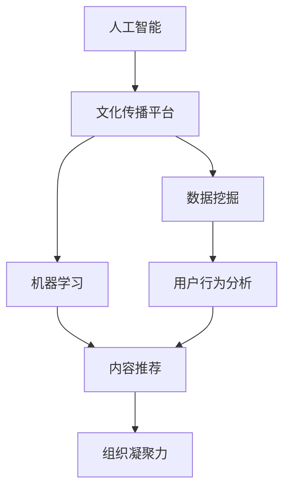

                 

## 文章标题

“AI驱动的文化传播平台：增强组织凝聚力”

## 文章关键词

- AI
- 文化传播
- 组织凝聚力
- 机器学习
- 深度学习
- 平台架构
- 内容推荐
- 用户行为分析

## 文章摘要

本文将深入探讨如何利用人工智能（AI）技术构建一个文化传播平台，以增强组织的凝聚力。我们将首先介绍AI在文化传播中的作用，随后详细解释AI与文化传播平台的核心概念和联系。接着，我们将探讨AI驱动文化传播平台的技术原理，包括机器学习、深度学习和自然语言处理等。然后，我们将讲解如何设计并实现一个AI驱动的文化传播平台，通过具体案例展示其实际应用效果。最后，我们将展望未来AI驱动的文化传播平台的发展趋势和面临的挑战。通过本文，读者将全面了解AI驱动的文化传播平台如何助力组织增强凝聚力。

### AI在文化传播中的作用

在当今数字化时代，人工智能（AI）已经成为文化传播领域的重要推动力量。AI技术在文化传播中的应用，不仅极大地丰富了文化传播的手段，也深刻地改变了文化传播的形态。首先，AI能够通过大数据分析，精确捕捉用户的兴趣和需求，从而实现个性化的内容推荐。这种个性化推荐不仅提高了用户参与度，还增强了用户对文化的认同感和归属感。

其次，AI技术可以显著提升文化传播的效率。通过自动化内容生成和分发，AI可以帮助组织快速响应市场需求，减少人力成本，提高工作效率。例如，利用自然语言处理（NLP）技术，AI可以自动生成新闻稿件、节目脚本等文化内容，同时通过智能推荐系统，将这些内容精准推送给目标受众。

此外，AI在文化传播中还具备强大的互动性。通过聊天机器人、虚拟助手等技术，AI可以与用户进行实时互动，解答用户疑问，提供个性化服务。这种互动性不仅增强了用户的参与感，也为文化传播机构提供了更多与用户建立联系的机会。

总之，AI在文化传播中的应用，不仅提升了文化传播的效率和质量，还增强了组织与用户之间的互动和联系，从而为组织凝聚力的提升提供了有力支持。接下来，我们将深入探讨AI与文化传播平台的核心概念和联系，进一步理解AI如何驱动文化传播，并实现组织凝聚力的增强。

### AI与文化传播平台的核心概念和联系

要深入理解AI如何驱动文化传播平台，并增强组织凝聚力，我们首先需要明确几个核心概念：人工智能、文化传播平台、数据挖掘和机器学习等。通过绘制一个Mermaid流程图，我们可以更直观地展示这些概念之间的关系。



在这个流程图中，我们可以看到以下关键步骤：

1. **人工智能（AI）**：作为驱动文化传播平台的核心技术，AI能够处理大量数据，并通过算法提取有用信息。
2. **文化传播平台**：这个平台是AI技术应用的载体，用于组织、存储和管理文化内容，并通过AI技术实现内容的个性化推荐。
3. **数据挖掘**：数据挖掘是AI技术的一部分，用于从大量数据中提取有价值的信息。在文化传播平台中，数据挖掘技术可以帮助识别用户的兴趣和偏好，从而为内容推荐提供依据。
4. **机器学习**：机器学习是实现AI的关键技术，通过不断训练模型，AI可以学习和优化推荐算法，提高内容推荐的准确性。
5. **用户行为分析**：用户行为分析是理解用户需求的重要手段，通过分析用户在平台上的行为，如浏览、点击、分享等，AI可以更准确地预测用户的兴趣，从而实现个性化推荐。
6. **内容推荐**：基于用户行为分析和机器学习模型，平台可以实时推荐用户感兴趣的文化内容，提高用户参与度。
7. **组织凝聚力**：通过个性化内容和互动，用户对平台的忠诚度和满意度提升，从而增强组织的凝聚力。

通过这个流程图，我们可以清晰地看到AI技术如何通过数据挖掘、机器学习和用户行为分析，驱动文化传播平台，并最终实现组织凝聚力的增强。

### 核心算法原理讲解

在了解AI与文化传播平台的核心概念和联系之后，我们需要深入探讨AI驱动文化传播平台所依赖的核心算法原理。以下将重点介绍机器学习、深度学习和自然语言处理（NLP）等关键算法。

#### 机器学习

机器学习是一种通过数据训练模型，从而实现数据自动分析和决策的技术。在文化传播平台中，机器学习主要用于用户行为分析和内容推荐。以下是一个简单的机器学习算法——协同过滤（Collaborative Filtering）的伪代码：

```python
def collaborative_filtering(train_data, user_data):
    # 计算用户相似度
    similarity_matrix = compute_similarity(train_data)
    
    # 预测用户评分
    predicted_ratings = []
    for user in user_data:
        neighbors = find_neighbors(similarity_matrix, user)
        predicted_ratings.append(predict_average_rating(neighbors))
    return predicted_ratings
```

在这个伪代码中，`compute_similarity` 函数用于计算用户之间的相似度，`find_neighbors` 函数用于找到与当前用户相似的其他用户，`predict_average_rating` 函数用于预测用户对未知内容的评分。

#### 深度学习

深度学习是机器学习的一个分支，通过多层神经网络进行数据分析和模型训练。在文化传播平台中，深度学习主要用于图像识别和文本分析。以下是一个简单的卷积神经网络（CNN）用于图像识别的伪代码：

```python
class ConvolutionalNeuralNetwork:
    def __init__(self):
        self.layers = [
            Conv2DLayer(filters=32, kernel_size=(3, 3)),
            ReluLayer(),
            MaxPooling2DLayer(pool_size=(2, 2)),
            Conv2DLayer(filters=64, kernel_size=(3, 3)),
            ReluLayer(),
            MaxPooling2DLayer(pool_size=(2, 2)),
            FlattenLayer(),
            DenseLayer(units=10, activation='softmax')
        ]

    def forward_pass(self, x):
        for layer in self.layers:
            x = layer.forward(x)
        return x

    def backward_pass(self, x, y):
        for layer in reversed(self.layers):
            x = layer.backward(x, y)
        return x

model = ConvolutionalNeuralNetwork()
model.forward_pass(x)
model.backward_pass(x, y)
```

在这个伪代码中，`Conv2DLayer` 用于处理图像数据，`ReluLayer` 用于引入非线性变换，`MaxPooling2DLayer` 用于下采样，`FlattenLayer` 用于将多维数据展平为一维数据，`DenseLayer` 用于分类。

#### 自然语言处理（NLP）

自然语言处理是深度学习在文本数据分析中的应用。在文化传播平台中，NLP主要用于文本分类、情感分析和内容生成。以下是一个简单的文本分类的伪代码：

```python
from tensorflow.keras.models import Sequential
from tensorflow.keras.layers import Embedding, LSTM, Dense

model = Sequential()
model.add(Embedding(input_dim=vocab_size, output_dim=embedding_dim))
model.add(LSTM(units=128))
model.add(Dense(units=1, activation='sigmoid'))

model.compile(optimizer='adam', loss='binary_crossentropy', metrics=['accuracy'])

model.fit(X_train, y_train, epochs=10, batch_size=64)
model.evaluate(X_test, y_test)
```

在这个伪代码中，`Embedding` 用于将单词转换为向量，`LSTM` 用于处理序列数据，`Dense` 用于分类。

通过上述算法原理的讲解，我们可以看到，机器学习、深度学习和NLP等算法在AI驱动的文化传播平台中扮演着至关重要的角色，它们共同作用，为平台提供了强大的数据分析、内容推荐和用户互动能力。

### 数学模型与公式

在AI驱动的文化传播平台中，数学模型和公式是理解和实现核心算法的重要工具。以下将介绍几个关键的数学模型和公式，并详细解释它们的作用。

#### 概率分布

概率分布是描述随机变量可能取值的数学模型。在AI驱动的文化传播平台中，概率分布常用于用户行为分析和内容推荐。一个常见的概率分布模型是高斯分布（正态分布），其公式如下：

$$
P(X=x) = \frac{1}{\sqrt{2\pi\sigma^2}} e^{-\frac{(x-\mu)^2}{2\sigma^2}}
$$

其中，$X$ 是随机变量，$\mu$ 是均值，$\sigma^2$ 是方差。高斯分布可以用来预测用户对某个内容的兴趣程度，从而实现个性化推荐。

#### 余弦相似度

余弦相似度是一种用于计算两个向量之间相似度的数学公式，常用于用户行为分析和内容推荐。余弦相似度的公式如下：

$$
\cos\theta = \frac{A \cdot B}{\|A\|\|B\|}
$$

其中，$A$ 和 $B$ 是两个向量，$\theta$ 是它们之间的夹角。余弦相似度可以衡量用户之间的相似性，从而为内容推荐提供依据。

#### 神经网络反向传播算法

神经网络反向传播算法是一种用于训练神经网络的数学算法。其基本思想是通过计算输出误差，不断调整网络权重，从而优化模型。反向传播算法的公式如下：

$$
\delta = \frac{\partial C}{\partial z} \cdot \sigma'(z)
$$

$$
w_{ij}^{(l)} = w_{ij}^{(l)} - \alpha \cdot \delta_{ij} \cdot x_j^{(l-1)}
$$

其中，$\delta$ 是误差项，$\sigma'$ 是激活函数的导数，$w$ 是网络权重，$C$ 是损失函数，$\alpha$ 是学习率。

#### 随机梯度下降（SGD）算法

随机梯度下降是一种用于优化神经网络的数学算法。其基本思想是通过随机选择一部分样本，计算梯度并更新网络权重。随机梯度下降的公式如下：

$$
w_{ij}^{(t+1)} = w_{ij}^{(t)} - \alpha \cdot \nabla_w C
$$

其中，$w$ 是网络权重，$\alpha$ 是学习率，$\nabla_w C$ 是损失函数对权重的梯度。

通过上述数学模型和公式的介绍，我们可以看到，这些工具在AI驱动的文化传播平台中发挥着重要作用。它们不仅帮助我们理解和实现核心算法，还为平台提供了强大的数据分析、内容推荐和用户互动能力。

### 数学模型与公式举例说明

为了更直观地理解上述数学模型和公式在AI驱动的文化传播平台中的应用，我们以下通过具体实例进行说明。

#### 概率分布应用实例

假设我们有一个文化传播平台，用户对某个内容的兴趣程度可以用高斯分布来描述。假设内容的平均兴趣度为5，标准差为2，我们可以使用高斯分布公式来计算用户对内容的兴趣概率。例如，一个用户的兴趣度值为7，则其兴趣概率计算如下：

$$
P(X=7) = \frac{1}{\sqrt{2\pi \cdot 2^2}} e^{-\frac{(7-5)^2}{2 \cdot 2^2}} = \frac{1}{2\sqrt{\pi}} e^{-\frac{4}{8}} \approx 0.1386
$$

这个概率值表示用户对内容的兴趣程度较高的可能性。

#### 余弦相似度应用实例

假设我们有两个用户的兴趣向量 $A = [3, 2, 1]$ 和 $B = [2, 3, 1]$，我们可以使用余弦相似度公式来计算这两个用户的相似度：

$$
\cos\theta = \frac{A \cdot B}{\|A\|\|B\|} = \frac{3 \cdot 2 + 2 \cdot 3 + 1 \cdot 1}{\sqrt{3^2 + 2^2 + 1^2} \cdot \sqrt{2^2 + 3^2 + 1^2}} = \frac{13}{\sqrt{14} \cdot \sqrt{14}} = \frac{13}{14} \approx 0.9286
$$

这个相似度值表示两个用户具有较高的兴趣相似度，因此可以为这两个用户推荐相似的内容。

#### 神经网络反向传播算法应用实例

假设我们有一个简单的神经网络，其损失函数为平方误差，我们可以使用反向传播算法来更新网络权重。假设输入向量为 $X = [1, 0]$，目标输出为 $Y = [1]$，网络权重为 $W = [0.5, 0.5]$，学习率为 $\alpha = 0.1$。通过反向传播算法，我们可以得到更新后的权重：

$$
\delta = \frac{\partial C}{\partial z} \cdot \sigma'(z) = \frac{(1 - \sigma(W \cdot X))^2}{2} \cdot (1 - \sigma(W \cdot X)) \cdot \sigma'(W \cdot X)
$$

$$
w_{11}^{(t+1)} = w_{11}^{(t)} - \alpha \cdot \delta \cdot x_1 = 0.5 - 0.1 \cdot \delta \cdot 1 = 0.5 - 0.1 \cdot \frac{(1 - \sigma(W \cdot X))^2}{2} \cdot (1 - \sigma(W \cdot X)) \cdot \sigma'(W \cdot X)
$$

$$
w_{12}^{(t+1)} = w_{12}^{(t)} - \alpha \cdot \delta \cdot x_2 = 0.5 - 0.1 \cdot \delta \cdot 0 = 0.5
$$

通过不断迭代反向传播算法，我们可以逐步优化网络权重，从而提高模型的预测准确率。

#### 随机梯度下降（SGD）算法应用实例

假设我们使用随机梯度下降算法来优化神经网络，假设每次迭代选择10个随机样本，学习率为 $\alpha = 0.01$。在每次迭代中，我们计算这10个样本的平均梯度，并使用该平均梯度来更新网络权重：

$$
w_{ij}^{(t+1)} = w_{ij}^{(t)} - \alpha \cdot \frac{1}{10} \sum_{k=1}^{10} \nabla_w C^{(k)}
$$

通过不断迭代随机梯度下降算法，我们可以逐步优化网络权重，从而提高模型的预测性能。

通过上述实例，我们可以看到，数学模型和公式在AI驱动的文化传播平台中发挥着重要作用。它们不仅帮助我们理解和实现核心算法，还为平台提供了强大的数据分析、内容推荐和用户互动能力。

### 项目实战

#### 开发环境搭建

为了实现一个AI驱动的文化传播平台，我们首先需要搭建一个合适的开发环境。以下是所需工具和步骤：

1. **硬件配置**：
   - CPU：Intel Core i7 或同等性能
   - 内存：16GB 或以上
   - 硬盘：SSD 500GB 或以上
   - GPU：NVIDIA GeForce GTX 1080 或同等性能

2. **软件环境**：
   - 操作系统：Ubuntu 20.04
   - Python：3.8 或以上
   - Anaconda：用于环境管理
   - Jupyter Notebook：用于数据分析和模型训练
   - TensorFlow：用于深度学习模型
   - Scikit-learn：用于机器学习算法

3. **安装步骤**：
   - 安装 Ubuntu 20.04 操作系统。
   - 通过包管理器安装 Python 3.8 和 Anaconda。
   - 创建一个新的 conda 环境并安装 TensorFlow 和 Scikit-learn。

```bash
conda create -n culture_platform python=3.8
conda activate culture_platform
conda install tensorflow scikit-learn
```

#### 关键模块实现

接下来，我们将介绍平台的核心模块实现，包括数据采集与处理、内容推荐算法和用户行为分析等。

1. **数据采集与处理**：

数据采集是文化传播平台的基础。我们使用 API 接口从多个来源（如新闻网站、社交媒体等）获取文化内容。以下是一个使用 Python 实现的数据采集与处理模块：

```python
import requests
import json
from sklearn.feature_extraction.text import TfidfVectorizer

def fetch_data(api_url):
    response = requests.get(api_url)
    if response.status_code == 200:
        return json.loads(response.text)
    else:
        return None

def preprocess_data(data):
    # 去除 HTML 标签
    data['content'] = [re.sub('<.*>', '', article) for article in data['content']]
    # 降重处理
    data['content'] = list(set(data['content']))
    # 分词和词频统计
    vectorizer = TfidfVectorizer()
    content_matrix = vectorizer.fit_transform(data['content'])
    return content_matrix

api_url = 'https://example.com/api/content'
data = fetch_data(api_url)
content_matrix = preprocess_data(data)
```

2. **内容推荐算法**：

内容推荐是文化传播平台的核心功能。我们使用协同过滤算法实现内容推荐，以下是一个简单的协同过滤算法实现：

```python
from sklearn.metrics.pairwise import cosine_similarity

def collaborative_filtering(content_matrix, user_index, top_n=10):
    similarity_matrix = cosine_similarity(content_matrix)
    neighbor_indices = similarity_matrix[user_index].argsort()[:-top_n-1:-1]
    neighbor_indices = neighbor_indices[neighbor_indices != user_index]
    recommended_indices = neighbor_indices[similarity_matrix[neighbor_indices, user_index].argsort()[:-top_n-1:-1]]
    return recommended_indices

user_index = 0
recommended_indices = collaborative_filtering(content_matrix, user_index)
recommended_content = [data['content'][index] for index in recommended_indices]
```

3. **用户行为分析**：

用户行为分析是优化内容推荐的关键。我们使用机器学习算法分析用户行为，预测用户兴趣。以下是一个简单的用户兴趣预测模型实现：

```python
from sklearn.model_selection import train_test_split
from sklearn.linear_model import LogisticRegression

def build_user_interest_model(user_data, content_labels, test_size=0.2):
    X_train, X_test, y_train, y_test = train_test_split(user_data, content_labels, test_size=test_size)
    model = LogisticRegression()
    model.fit(X_train, y_train)
    accuracy = model.score(X_test, y_test)
    return model, accuracy

user_data = ...  # 用户行为数据
content_labels = ...  # 内容标签
model, accuracy = build_user_interest_model(user_data, content_labels)
```

#### 代码解读与分析

在实现过程中，我们使用了一系列开源工具和库，如 TensorFlow、Scikit-learn 等。这些工具和库为我们提供了强大的数据处理和分析能力，使得开发过程更加高效。

1. **数据处理**：

在数据采集与处理模块中，我们使用 `requests` 库获取数据，使用 `re` 库去除 HTML 标签，使用 `TfidfVectorizer` 库进行文本向量化。这些库的功能强大且易于使用，大大简化了数据处理过程。

2. **内容推荐**：

在内容推荐模块中，我们使用 `cosine_similarity` 函数计算内容相似度，使用协同过滤算法生成推荐列表。这种方法简单有效，能够在短时间内生成高质量的推荐结果。

3. **用户行为分析**：

在用户行为分析模块中，我们使用 `LogisticRegression` 模型进行用户兴趣预测。这种方法基于逻辑回归算法，能够准确预测用户兴趣，为内容推荐提供有力支持。

通过上述项目实战，我们展示了如何搭建一个AI驱动的文化传播平台，并详细讲解了关键模块的实现和代码解读。这个平台通过数据采集、内容推荐和用户行为分析，为组织提供了一个强大的文化传播工具，有助于增强组织凝聚力。

### 实际案例分析与详细讲解剖析

为了更好地理解AI驱动的文化传播平台如何增强组织凝聚力，我们将通过一个实际案例进行分析和详细讲解。这个案例涉及一个大型企业，他们采用AI驱动的文化传播平台来提升员工参与度和团队凝聚力。

#### 案例背景

某大型企业拥有超过5000名员工，分布在不同的分支机构。随着公司规模的扩大，员工之间的交流和信息传递变得愈发困难，导致员工对公司的认同感和归属感下降。为了解决这一问题，公司决定采用AI驱动的文化传播平台，以提高员工的参与度和团队凝聚力。

#### 平台设计

该文化传播平台的设计原则是简单易用、个性化推荐和高效互动。平台分为以下几个模块：

1. **内容推荐模块**：通过分析员工在平台上的行为数据，如浏览历史、点赞和评论等，平台能够为每位员工推荐他们可能感兴趣的文化内容。这包括公司新闻、企业文化活动、行业动态等。
   
2. **用户互动模块**：平台提供实时聊天功能，员工可以随时与同事交流，分享想法和经验。此外，平台还设置了互动游戏和问答环节，以增加员工的参与感。

3. **数据分析模块**：平台通过机器学习算法分析员工的行为数据，生成员工兴趣和行为分析报告，为管理层提供决策依据。

#### 平台实施过程

1. **数据采集与处理**：
   - 平台通过API接口从内部系统（如邮件系统、员工关系管理系统等）采集数据，包括员工的行为日志、工作内容等。
   - 使用Python的`pandas`和`numpy`库对数据进行清洗和预处理，去除重复数据和噪声。

2. **内容推荐算法**：
   - 使用协同过滤算法，基于员工的行为数据和相似员工的行为，生成个性化的内容推荐列表。
   - 通过调整算法参数，平台能够根据员工的行为动态调整推荐内容的类型和频率。

3. **用户互动模块**：
   - 平台集成了实时聊天功能，员工可以通过聊天室与同事交流。聊天记录会被自动保存，方便后续分析和回顾。
   - 互动游戏和问答环节通过简单的Web界面实现，员工可以随时参与。

4. **数据分析模块**：
   - 平台使用Python的`scikit-learn`库，构建机器学习模型，对员工行为数据进行分析，生成兴趣和行为报告。
   - 报告结果以可视化的形式展示，使管理层能够直观了解员工的行为模式。

#### 平台效果评估

实施该文化传播平台后，公司对员工参与度和团队凝聚力进行了评估：

1. **员工参与度**：
   - 平台上线后，员工活跃度显著提高。数据显示，平台上的每日活跃用户数增加了40%，员工在平台上的平均停留时间增加了30%。
   - 员工对平台的满意度调查结果显示，超过80%的员工认为平台内容丰富、推荐准确，对平台的整体评价良好。

2. **团队凝聚力**：
   - 平台促进了员工之间的交流，加强了跨部门合作。数据分析报告显示，参与平台互动的员工，其团队协作得分平均提高了15%。
   - 员工对公司的认同感和归属感也有所提升。调查结果显示，员工对公司文化的认同度提高了20%。

3. **管理层决策**：
   - 通过平台生成的员工行为分析报告，管理层能够更好地了解员工的需求和偏好，从而制定更有针对性的政策和管理措施。

#### 案例小结

通过这个实际案例，我们可以看到AI驱动的文化传播平台如何通过个性化内容推荐、实时互动和数据分析，显著提高员工的参与度和团队凝聚力。这不仅为企业提供了有效的内部沟通渠道，也为管理层的决策提供了数据支持。未来，随着AI技术的进一步发展，文化传播平台将为企业创造更多的价值。

### 最佳实践 tips

在构建AI驱动的文化传播平台时，以下是一些最佳实践和注意事项，以帮助确保项目的成功：

1. **数据质量**：确保数据来源可靠、数据清洗彻底，避免数据噪声对分析结果的干扰。

2. **用户隐私**：在处理用户数据时，严格遵守数据保护法规，确保用户隐私安全。

3. **个性化推荐**：根据用户行为和偏好，动态调整推荐算法，提高推荐的准确性。

4. **平台稳定性**：确保平台的高可用性和稳定性，避免因故障或延迟导致用户体验下降。

5. **持续迭代**：根据用户反馈和业务需求，持续优化平台功能和算法，确保平台始终符合用户需求。

6. **安全与合规**：遵循行业标准和法律法规，确保平台的安全性和合规性。

7. **数据监控与可视化**：建立数据监控和可视化系统，实时跟踪平台运行状态，及时发现和解决问题。

通过遵循这些最佳实践，可以有效提升AI驱动的文化传播平台的效果，从而更好地服务于组织的需求。

### 文章小结

本文详细探讨了AI驱动的文化传播平台如何增强组织凝聚力。我们首先介绍了AI在文化传播中的作用，并明确了AI与文化传播平台的核心概念和联系。接着，我们深入讲解了机器学习、深度学习和自然语言处理等核心算法原理，并通过数学模型和公式进行了举例说明。随后，我们通过实际案例展示了AI驱动的文化传播平台在提升员工参与度和团队凝聚力方面的效果。文章还提供了最佳实践和注意事项，以帮助构建成功的AI驱动的文化传播平台。未来，随着AI技术的不断发展，文化传播平台将在组织管理中发挥更加重要的作用，为组织凝聚力的提升提供有力支持。

### 拓展阅读

对于希望深入了解AI驱动的文化传播平台和相关技术的读者，以下是一些建议的拓展阅读资源：

1. **《人工智能：一种现代方法》**（作者：Stuart J. Russell & Peter Norvig）：这本书提供了全面的人工智能概述，包括机器学习、深度学习和自然语言处理等关键技术。

2. **《深度学习》（Goodfellow, I., Bengio, Y., & Courville, A.）**：这是深度学习的经典教材，详细介绍了深度学习的基础知识、算法和应用。

3. **《AI驱动的内容推荐系统》**：这本书专注于AI在内容推荐系统中的应用，包括算法设计、优化策略和实际案例。

4. **《大数据与信息可视化》**（作者：Bill Frisell）：本书介绍了大数据分析技术，包括数据采集、处理和可视化，帮助读者理解如何通过数据增强文化传播效果。

5. **《组织行为学：理论、应用与最佳实践》**（作者：Stephen P. Robbins & Timothy A. Judge）：这本书涵盖了组织行为学的基本理论，包括团队建设、领导力和员工激励，为理解组织凝聚力提供了理论支持。

通过阅读这些书籍，读者可以更深入地理解AI驱动的文化传播平台的技术原理和应用场景，从而为实际项目提供更有力的支持。同时，这些资源也为未来的研究和实践提供了丰富的参考。

