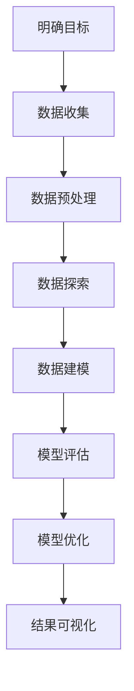
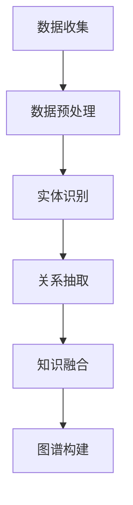
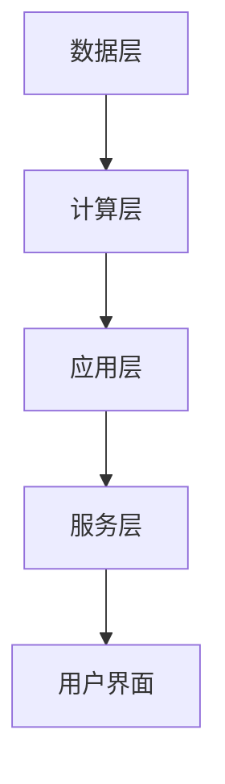
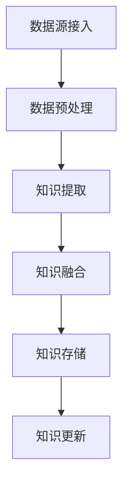

                 

## 文章标题：AI驱动的知识挖掘系统：提取数据价值

### 关键词：人工智能，知识挖掘，数据价值，知识图谱，AI驱动，数据挖掘算法

### 摘要：
本文深入探讨了AI驱动的知识挖掘系统在数据价值提取中的应用。首先介绍了知识挖掘的基本概念和背景，随后详细讲解了AI在知识挖掘中的应用，包括机器学习、深度学习和强化学习等技术的具体实现。接着，文章阐述了知识图谱的构建方法及其在知识挖掘中的关键作用。然后，重点分析了AI驱动的知识提取算法，包括文本挖掘、实体识别、关联规则挖掘、文本分类和主题模型等。在此基础上，介绍了知识融合与更新的策略与方法，并探讨了数据挖掘在金融行业的应用。最后，通过一个实际项目案例，展示了知识挖掘系统的设计与实现过程，并对未来发展方向和面临的挑战进行了展望。

## 引言

### 研究背景与意义

在信息化时代，数据已经成为企业和组织的宝贵资产。然而，如何从海量数据中提取有价值的信息，实现数据到知识的转化，成为当前数据科学领域的一个重要研究方向。知识挖掘（Knowledge Mining）作为一种高级数据挖掘技术，旨在从数据中发现隐含在其中的模式和知识，为决策提供支持。传统的知识挖掘方法主要依赖于统计学和机器学习方法，但面对越来越复杂的数据环境和多样化的应用需求，单纯依靠传统方法已难以满足需求。

人工智能（AI）技术的发展，为知识挖掘带来了新的机遇。AI技术，尤其是机器学习、深度学习和强化学习等，通过自动化、智能化的方式，能够高效地处理和分析大规模数据，发现数据中的潜在模式和关联，从而实现知识挖掘。AI驱动的知识挖掘系统，不仅能够提升知识挖掘的效率，还能够拓展知识挖掘的应用范围，为各行业提供更加精准和智能的数据分析服务。

本文旨在探讨AI驱动的知识挖掘系统在数据价值提取中的应用。通过对AI技术、知识挖掘方法和应用场景的深入分析，本文希望能够为从事数据科学研究和应用的人员提供有益的参考，推动AI驱动的知识挖掘技术的发展。

### 书籍结构概述

本文共分为八个章节，结构如下：

- 第1章：引言，介绍研究背景、意义和书籍结构。
- 第2章：数据挖掘基础，包括数据挖掘的概述、方法分类和流程。
- 第3章：AI在知识挖掘中的应用，介绍机器学习、深度学习和强化学习等AI技术在知识挖掘中的应用。
- 第4章：知识图谱构建，阐述知识图谱的概念、构建方法和应用场景。
- 第5章：AI驱动的知识提取算法，分析文本挖掘、实体识别、关联规则挖掘、文本分类和主题模型等算法。
- 第6章：知识挖掘系统设计与实现，介绍知识挖掘系统的设计原则、架构设计和系统开发与部署。
- 第7章：知识挖掘项目实战，通过实际案例展示知识挖掘系统的设计与实现过程。
- 第8章：未来展望与挑战，探讨知识挖掘技术的发展趋势、面临的挑战和未来发展方向。

### 阅读对象

本文面向的数据科学家、机器学习工程师、软件工程师和研究人员，以及对AI驱动的知识挖掘系统感兴趣的所有读者。本文旨在为读者提供一份系统、全面的知识挖掘指南，帮助读者理解知识挖掘的基本概念、方法和应用，掌握AI技术在知识挖掘中的应用，从而能够在实际项目中有效地运用知识挖掘技术，实现数据到知识的转化。

## 数据挖掘基础

### 数据挖掘概述

数据挖掘（Data Mining）是指从大量的数据中提取有价值信息的过程。它是一种跨学科的交叉领域，涉及统计学、机器学习、数据库和信息检索等多个领域。数据挖掘的主要目标是从海量数据中发现潜在的、有价值的信息或知识，这些信息或知识可以用于决策支持、商业智能、市场分析、风险控制等领域。

数据挖掘的基本流程包括以下几个步骤：

1. **数据预处理**：这一步主要包括数据清洗、数据整合、数据转换和数据归一化等操作。数据预处理是数据挖掘过程中至关重要的一环，它直接影响到后续挖掘结果的质量。
   
2. **数据探索**：通过数据探索，我们可以了解数据的分布、模式、异常值等信息，为数据建模提供依据。

3. **数据建模**：数据建模是数据挖掘的核心环节，通过构建数学模型或机器学习模型，对数据进行挖掘和分析。

4. **评估与优化**：评估模型的效果，并通过优化调整模型参数，提升模型的性能。

5. **结果可视化**：将挖掘结果以图形或报表的形式展示，帮助决策者理解分析结果。

### 数据挖掘方法分类

数据挖掘方法可以根据挖掘目标和数据类型进行分类。以下是几种常见的数据挖掘方法：

1. **分类方法**：分类方法将数据分为不同的类别，常见算法包括决策树、随机森林、支持向量机（SVM）等。

2. **聚类方法**：聚类方法将相似的数据点归为一类，常见算法包括K-均值、层次聚类、DBSCAN等。

3. **关联规则挖掘**：关联规则挖掘用于发现数据项之间的关联关系，常见算法包括Apriori算法、FP-growth算法等。

4. **异常检测**：异常检测旨在发现数据中的异常或离群点，常见算法包括孤立森林、Local Outlier Factor（LOF）等。

5. **时序分析**：时序分析用于分析时间序列数据，常见算法包括ARIMA模型、LSTM网络等。

### 数据挖掘流程

数据挖掘流程可以分为以下几个步骤：

1. **明确目标**：明确数据挖掘的目标，如分类、聚类、关联规则挖掘等。

2. **数据收集**：收集与目标相关的数据，包括结构化数据、半结构化数据和非结构化数据。

3. **数据预处理**：对数据进行清洗、整合、转换和归一化等处理。

4. **数据探索**：对预处理后的数据进行分析，发现数据的分布、模式、异常值等。

5. **数据建模**：选择合适的算法对数据进行建模。

6. **模型评估**：评估模型的性能，如准确率、召回率、F1值等。

7. **模型优化**：根据评估结果，对模型进行调整和优化。

8. **结果可视化**：将挖掘结果以图形或报表的形式展示。

### 核心概念与联系

在数据挖掘过程中，核心概念与联系主要体现在以下几个方面：

1. **特征工程**：特征工程是数据挖掘中至关重要的环节，它包括特征选择、特征提取和特征构造等。特征工程的质量直接影响模型的性能。

2. **模型评估**：模型评估是数据挖掘流程中的重要步骤，常用的评估指标包括准确率、召回率、F1值、ROC曲线等。通过模型评估，可以了解模型的性能和预测能力。

3. **模型优化**：模型优化是提高模型性能的重要手段，通过调整模型参数、增加数据预处理步骤、引入新的算法等，可以优化模型。

4. **集成方法**：集成方法是指将多个模型进行组合，以提升整体模型的性能。常见的集成方法包括Bagging、Boosting和Stacking等。

### Mermaid 流程图

以下是一个简单的Mermaid流程图，展示了数据挖掘的基本流程：



通过这个流程图，可以清晰地看到数据挖掘的各个步骤及其相互关系。

### 总结

数据挖掘作为一门跨学科的技术，广泛应用于各行业。通过对数据挖掘基础知识的深入理解和掌握，读者可以更好地应对复杂的数据分析和挖掘任务。在接下来的章节中，我们将进一步探讨AI在知识挖掘中的应用，以及具体的算法和技术。

## AI在知识挖掘中的应用

### 机器学习在数据挖掘中的应用

机器学习（Machine Learning）是人工智能（AI）的一个重要分支，它通过构建和分析算法模型，使计算机能够从数据中学习并做出预测或决策。在数据挖掘中，机器学习技术被广泛应用于分类、聚类、回归、异常检测等多种任务。

**分类算法**：分类算法用于将数据分为不同的类别。常见的分类算法包括决策树（Decision Tree）、支持向量机（Support Vector Machine，SVM）、随机森林（Random Forest）和K最近邻（K-Nearest Neighbors，KNN）等。这些算法通过学习训练数据中的特征，构建分类模型，用于对新数据进行分类预测。

```python
# 决策树分类算法的伪代码
class DecisionTreeClassifier:
    def fit(self, X, y):
        # 构建决策树模型
        pass

    def predict(self, X):
        # 使用决策树模型进行预测
        pass
```

**聚类算法**：聚类算法用于将数据点分组，使得同组内的数据点彼此相似，不同组的数据点差异较大。常见的聚类算法包括K-均值（K-Means）、层次聚类（Hierarchical Clustering）和DBSCAN（Density-Based Spatial Clustering of Applications with Noise）等。聚类算法在数据探索和分析中具有重要的应用价值。

```python
# K-均值聚类算法的伪代码
class KMeans:
    def fit(self, X, k):
        # 构建K-均值模型
        pass

    def predict(self, X):
        # 使用K-均值模型进行聚类
        pass
```

**回归算法**：回归算法用于预测数值型数据。常见的回归算法包括线性回归（Linear Regression）、岭回归（Ridge Regression）、Lasso回归（Lasso Regression）等。回归算法在预测分析和决策支持中发挥着重要作用。

```python
# 线性回归算法的伪代码
class LinearRegression:
    def fit(self, X, y):
        # 拟合线性回归模型
        pass

    def predict(self, X):
        # 使用线性回归模型进行预测
        pass
```

**异常检测**：异常检测算法用于发现数据中的异常或离群点。常见的异常检测算法包括孤立森林（Isolation Forest）、Local Outlier Factor（LOF）和基于密度的方法等。异常检测在安全监控、金融欺诈检测等领域有着广泛应用。

```python
# 孤立森林异常检测算法的伪代码
class IsolationForest:
    def fit(self, X):
        # 构建孤立森林模型
        pass

    def predict(self, X):
        # 使用孤立森林模型进行异常检测
        pass
```

### 深度学习在数据挖掘中的应用

深度学习（Deep Learning）是一种基于多层神经网络的机器学习方法。与传统的机器学习方法相比，深度学习模型能够自动学习数据的复杂特征，从而在许多数据挖掘任务中取得了显著的性能提升。

**卷积神经网络（CNN）**：卷积神经网络是深度学习中的一种重要模型，特别适用于处理图像数据。通过卷积层、池化层和全连接层的组合，CNN能够提取图像中的高级特征，实现图像分类、目标检测和图像生成等任务。

```python
# 卷积神经网络（CNN）的伪代码
class ConvolutionalNeuralNetwork:
    def forward(self, X):
        # 前向传播计算输出
        pass

    def backward(self, d_output):
        # 反向传播计算梯度
        pass

    def train(self, X, y, epochs):
        # 模型训练过程
        pass
```

**循环神经网络（RNN）**：循环神经网络特别适合处理序列数据，如文本、语音和时间序列等。通过引入门控机制，如Long Short-Term Memory（LSTM）和Gated Recurrent Unit（GRU），RNN能够有效地捕捉序列数据中的长期依赖关系。

```python
# 长短时记忆网络（LSTM）的伪代码
class LSTM:
    def forward(self, X):
        # 前向传播计算输出
        pass

    def backward(self, d_output):
        # 反向传播计算梯度
        pass

    def train(self, X, y, epochs):
        # 模型训练过程
        pass
```

**生成对抗网络（GAN）**：生成对抗网络是一种由生成器和判别器组成的对抗性模型，用于生成逼真的数据。GAN在图像生成、语音合成和数据增强等领域有着广泛应用。

```python
# 生成对抗网络（GAN）的伪代码
class Generator:
    def generate(self, z):
        # 生成器生成数据
        pass

class Discriminator:
    def forward(self, x):
        # 判别器判断数据真实性
        pass

class GAN:
    def train(self, X, epochs):
        # 模型训练过程
        pass
```

### 强化学习在知识挖掘中的应用

强化学习（Reinforcement Learning）是一种通过试错和反馈来学习策略的机器学习方法。在知识挖掘中，强化学习可以用于自动推荐系统、智能调度和优化决策等任务。

**Q学习**：Q学习是一种基于值函数的强化学习算法，通过学习状态-动作价值函数来决策。Q学习在多步骤决策问题中具有广泛的应用。

```python
# Q学习算法的伪代码
class QLearningAgent:
    def __init__(self, learning_rate, discount_factor):
        # 初始化参数
        pass

    def update_q_value(self, state, action, reward, next_state):
        # 更新Q值
        pass

    def select_action(self, state):
        # 选择最佳动作
        pass

    def train(self, environment, episodes):
        # 模型训练过程
        pass
```

**深度Q网络（DQN）**：深度Q网络（Deep Q-Network，DQN）是结合了深度学习和Q学习的强化学习算法。DQN通过神经网络来近似Q值函数，从而实现更高效的决策。

```python
# 深度Q网络（DQN）的伪代码
class DeepQNetwork:
    def __init__(self, learning_rate, discount_factor):
        # 初始化参数
        pass

    def forward(self, X):
        # 前向传播计算输出
        pass

    def backward(self, d_output):
        # 反向传播计算梯度
        pass

    def train(self, X, y, epochs):
        # 模型训练过程
        pass
```

### 总结

机器学习、深度学习和强化学习在知识挖掘中发挥着重要作用。通过这些先进的技术，我们可以从海量数据中提取有价值的信息，实现数据的自动分析和智能决策。在接下来的章节中，我们将进一步探讨知识图谱的构建方法及其在知识挖掘中的应用。

## 知识图谱构建

### 知识图谱概述

知识图谱（Knowledge Graph）是一种用于表示实体及其相互关系的图形化数据模型。它通过将现实世界中的事物（实体）及其关系（边）进行抽象和建模，形成一种结构化的知识表示方式。知识图谱的构建旨在将分散的数据信息进行整合和关联，从而实现数据的综合利用和智能分析。

知识图谱的核心概念包括实体（Entity）、属性（Attribute）、关系（Relationship）和图谱（Graph）。实体是知识图谱中的基本元素，表示现实世界中的事物，如人、地点、组织等。属性用于描述实体的特征，如人的年龄、地点的经纬度等。关系表示实体之间的关联，如人物之间的朋友关系、地点之间的相邻关系等。

### 知识图谱构建方法

构建知识图谱通常涉及以下几个步骤：

1. **数据收集**：收集与目标领域相关的数据，包括结构化数据、半结构化数据和非结构化数据。

2. **数据预处理**：对收集到的数据进行清洗、整合和规范化，确保数据质量。

3. **实体识别**：通过文本挖掘和实体识别技术，从数据中提取出实体，并将其转换为知识图谱中的节点。

4. **关系抽取**：从原始数据中抽取实体之间的关联关系，并将其转换为知识图谱中的边。

5. **知识融合**：将来自不同来源的数据进行融合，解决数据冗余和冲突问题。

6. **图谱构建**：利用图数据库或图计算框架，将实体、属性和关系组织成知识图谱。

### 知识图谱的应用场景

知识图谱在多个领域具有广泛的应用场景，以下是几个典型的应用示例：

1. **搜索引擎**：知识图谱可以用于构建智能搜索引擎，通过理解用户查询和实体关系，提供更精准的搜索结果和推荐。

2. **自然语言处理**：知识图谱在语义理解和问答系统中发挥着重要作用，通过将自然语言文本与知识图谱进行关联，提升语言理解能力。

3. **智能推荐系统**：知识图谱可以用于构建推荐系统，通过分析用户行为和实体关系，提供个性化的推荐。

4. **智能问答系统**：知识图谱可以用于构建智能问答系统，通过理解用户问题和知识图谱中的关系，提供准确的答案。

5. **智能客服系统**：知识图谱可以用于构建智能客服系统，通过理解用户问题和实体关系，提供高效的客户服务。

### 核心概念与联系

在知识图谱的构建过程中，核心概念与联系主要体现在以下几个方面：

1. **实体-关系-属性（E-R-A）模型**：实体-关系-属性模型是知识图谱的基本构建单元，它描述了实体、属性和关系之间的结构关系。

2. **本体论（Ontology）**：本体论是一种用于描述领域知识的理论框架，它为知识图谱的构建提供了理论基础。

3. **语义网（Semantic Web）**：语义网是一种基于Web的语义信息表示方法，它通过使用语义标记来增强Web数据的语义信息，为知识图谱的构建提供了支持。

4. **图数据库（Graph Database）**：图数据库是一种用于存储和查询图结构数据的数据库，它为知识图谱的存储和查询提供了高效的数据结构。

### Mermaid 流程图

以下是一个简单的Mermaid流程图，展示了知识图谱构建的基本流程：



通过这个流程图，可以清晰地看到知识图谱构建的各个步骤及其相互关系。

### 总结

知识图谱作为一种重要的知识表示方法，在智能搜索、自然语言处理、智能推荐等领域具有广泛的应用。通过深入理解和掌握知识图谱的构建方法和应用场景，读者可以更好地利用知识图谱实现数据的智能化处理和分析。在接下来的章节中，我们将进一步探讨AI驱动的知识提取算法及其在知识挖掘中的应用。

## AI驱动的知识提取算法

知识提取是指从大量数据中提取出具有价值的信息或知识的过程。AI驱动的知识提取算法通过机器学习、深度学习和自然语言处理等技术，能够高效地从非结构化或半结构化数据中提取出结构化的知识，为决策支持和业务优化提供有力支持。以下是几种常见的AI驱动的知识提取算法：

### 文本挖掘与实体识别

文本挖掘（Text Mining）是知识提取的重要手段，它通过分析文本数据，提取出其中的有用信息。实体识别（Named Entity Recognition，NER）是文本挖掘的一个重要任务，旨在从文本中识别出实体，并将其分类到预定义的类别中。

#### 核心算法原理

实体识别通常采用以下步骤：

1. **分词**：将文本划分为一个个的词语或词组。
   
2. **词性标注**：对每个词语进行词性标注，如名词、动词等。

3. **命名实体识别**：基于预定义的规则或机器学习模型，识别出文本中的实体。

4. **实体分类**：对识别出的实体进行分类，如人名、地点、组织等。

以下是一个简单的NER算法的伪代码：

```python
# 命名实体识别算法的伪代码
class NERModel:
    def tokenize(self, text):
        # 分词
        pass

    def tag_tokens(self, tokens):
        # 词性标注
        pass

    def recognize_entities(self, tokens):
        # 实体识别
        pass

    def classify_entities(self, entities):
        # 实体分类
        pass
```

### 关联规则挖掘

关联规则挖掘（Association Rule Learning，ARL）是一种用于发现数据项之间关联关系的方法。它通过挖掘数据中的频繁模式，生成一系列的关联规则，如“购买A商品的概率高时，购买B商品的概率也高”。

#### 核心算法原理

关联规则挖掘主要包括以下两个步骤：

1. **频繁项集挖掘**：找出数据中出现频率较高的项集。

2. **规则生成**：从频繁项集中生成满足最小支持度和最小置信度的关联规则。

以下是一个简单的关联规则挖掘算法的伪代码：

```python
# 关联规则挖掘算法的伪代码
class AssociationRuleLearner:
    def find_frequent_itemsets(self, data, min_support):
        # 挖掘频繁项集
        pass

    def generate_rules(self, frequent_itemsets, min_confidence):
        # 生成关联规则
        pass
```

### 文本分类与主题模型

文本分类（Text Classification）是一种将文本数据分配到预定义类别中的方法，常用于情感分析、垃圾邮件检测等任务。主题模型（Topic Modeling）则是一种无监督学习技术，用于发现文本数据中的主题结构。

#### 核心算法原理

文本分类和主题模型的核心算法原理如下：

1. **文本表示**：将文本数据转换为向量表示，如词袋模型（Bag of Words）或词嵌入（Word Embedding）。

2. **分类算法**：使用分类算法（如朴素贝叶斯、支持向量机、随机森林等）对文本数据进行分类。

3. **主题建模**：使用主题模型（如LDA，Latent Dirichlet Allocation）发现文本数据中的潜在主题。

以下是一个简单的文本分类和主题模型算法的伪代码：

```python
# 文本分类算法的伪代码
class TextClassifier:
    def train(self, X, y):
        # 训练分类模型
        pass

    def predict(self, X):
        # 进行预测
        pass

# LDA主题模型的伪代码
class LDA:
    def train(self, corpus, num_topics):
        # 训练LDA模型
        pass

    def predict(self, corpus):
        # 预测文本主题
        pass
```

### AI驱动的知识图谱表示学习

知识图谱表示学习（Knowledge Graph Embedding）是一种将知识图谱中的实体和关系转换为低维向量表示的方法。通过这种方式，实体和关系之间的复杂关系可以被表示为向量空间中的几何关系，从而便于计算机处理。

#### 核心算法原理

知识图谱表示学习通常采用以下步骤：

1. **实体表示**：将实体转换为向量表示。

2. **关系表示**：将关系转换为向量表示。

3. **实体关系融合**：通过矩阵乘法或图神经网络，融合实体和关系的向量表示，生成最终的实体向量表示。

以下是一个简单的知识图谱表示学习算法的伪代码：

```python
# 知识图谱表示学习算法的伪代码
class KGEmbedding:
    def train(self, graph, embedding_dim):
        # 训练实体和关系的向量表示
        pass

    def embed_entity(self, entity):
        # 获取实体的向量表示
        pass

    def embed_relation(self, relation):
        # 获取关系的向量表示
        pass
```

### 知识融合与更新

知识融合与更新是确保知识图谱质量和实时性的重要环节。知识融合涉及将来自不同源的知识进行整合，解决数据冗余和冲突问题。知识更新则包括实时收集新数据、更新知识图谱中的实体和关系。

#### 知识融合的基本概念

知识融合主要包括以下几个基本概念：

1. **数据源**：知识融合的数据来源，可以是数据库、文本、知识库等。

2. **融合策略**：知识融合的方法和规则，如基于规则融合、基于模型融合等。

3. **冲突解决**：处理知识融合过程中出现的数据冲突，如数据不一致、冗余等。

#### 知识更新的策略与方法

知识更新主要包括以下几种策略：

1. **增量更新**：只更新新增或修改的实体和关系。

2. **全量更新**：定期将整个知识图谱的数据进行更新。

3. **版本控制**：记录知识图谱的历史版本，便于回溯和审计。

#### 知识融合与更新的应用案例

以下是一个简单的知识融合与更新的应用案例：

```python
# 知识融合与更新算法的伪代码
class KnowledgeFusion:
    def fuse_data(self, data_sources):
        # 融合不同数据源的知识
        pass

    def resolve_conflicts(self, fused_data):
        # 解决数据冲突
        pass

class KnowledgeUpdate:
    def incremental_update(self, graph, new_data):
        # 增量更新知识图谱
        pass

    def full_update(self, graph, new_data):
        # 全量更新知识图谱
        pass
```

### 总结

AI驱动的知识提取算法在知识挖掘中发挥着关键作用。通过文本挖掘、实体识别、关联规则挖掘、文本分类和主题模型等技术，我们可以从大量数据中提取出有价值的信息。知识图谱表示学习则为知识图谱的构建提供了有效的向量表示方法。通过深入理解和掌握这些算法，读者可以更好地实现数据的智能化处理和分析。在接下来的章节中，我们将进一步探讨知识挖掘系统的设计与实现。

## 知识挖掘系统设计与实现

### 系统设计原则

知识挖掘系统设计应遵循以下原则：

1. **模块化设计**：将系统分为多个模块，每个模块负责特定的功能，便于系统的扩展和维护。

2. **高可用性**：系统应具备高可用性，能够在出现故障时快速恢复。

3. **可扩展性**：系统设计应考虑未来的扩展需求，支持数据量和功能的变化。

4. **易用性**：系统界面友好，用户操作简单，便于非专业用户使用。

5. **安全性**：确保数据安全和用户隐私，防止未授权访问和数据泄露。

### 系统架构设计

知识挖掘系统的架构设计包括以下几个方面：

1. **数据层**：负责数据的存储和管理，包括关系型数据库、NoSQL数据库、图数据库等。

2. **计算层**：负责数据预处理、模型训练、模型评估等计算任务，包括分布式计算框架、GPU集群等。

3. **应用层**：提供知识挖掘的API接口和Web界面，方便用户进行操作和获取结果。

4. **服务层**：包括数据采集服务、数据预处理服务、模型训练服务、模型评估服务等，负责系统的业务逻辑。

以下是知识挖掘系统架构的Mermaid流程图：



### 系统开发与部署

知识挖掘系统的开发与部署包括以下几个步骤：

1. **需求分析**：明确系统功能需求和性能指标，制定开发计划。

2. **技术选型**：根据需求分析结果，选择合适的数据库、计算框架、开发工具等。

3. **系统设计**：根据技术选型结果，进行系统架构设计，制定详细的技术方案。

4. **编码实现**：按照系统设计进行编码实现，包括数据层、计算层、应用层和服务层的开发。

5. **测试与调试**：对系统进行功能测试、性能测试和安全测试，修复发现的问题。

6. **部署上线**：将系统部署到生产环境，进行实际的运行和维护。

7. **监控与优化**：对系统运行情况进行监控，根据反馈进行性能优化和功能升级。

### 知识融合与更新

知识融合与更新是知识挖掘系统中的重要环节，主要包括以下几个方面：

1. **数据源接入**：接入不同类型的数据源，如关系型数据库、NoSQL数据库、知识库等。

2. **数据预处理**：对数据进行清洗、整合和规范化，确保数据质量。

3. **知识提取**：利用AI驱动的知识提取算法，从数据中提取出有价值的信息。

4. **知识融合**：将不同数据源的知识进行融合，解决数据冗余和冲突问题。

5. **知识存储**：将融合后的知识存储到知识图谱或数据库中，便于后续查询和使用。

6. **知识更新**：定期更新知识图谱或数据库，保持知识的实时性和准确性。

以下是知识融合与更新的Mermaid流程图：



### 开发环境搭建

以下是知识挖掘系统开发所需的主要开发环境搭建步骤：

1. **操作系统**：选择Linux操作系统，如Ubuntu。

2. **数据库**：安装MySQL、MongoDB或Neo4j等数据库。

3. **计算框架**：安装Apache Spark或Docker等计算框架。

4. **编程语言**：选择Python或Java等编程语言。

5. **开发工具**：安装Eclipse、IntelliJ IDEA或Visual Studio Code等开发工具。

6. **依赖库**：安装Numpy、Pandas、Scikit-learn、TensorFlow或PyTorch等依赖库。

### 源代码详细实现

以下是知识挖掘系统的部分源代码示例：

```python
# 数据预处理代码示例
import pandas as pd
from sklearn.model_selection import train_test_split

# 读取数据
data = pd.read_csv('data.csv')
X = data.drop('target', axis=1)
y = data['target']

# 数据预处理
X_train, X_test, y_train, y_test = train_test_split(X, y, test_size=0.2, random_state=42)

# 模型训练代码示例
from sklearn.ensemble import RandomForestClassifier

# 训练模型
model = RandomForestClassifier()
model.fit(X_train, y_train)

# 预测代码示例
predictions = model.predict(X_test)

# 评估代码示例
from sklearn.metrics import accuracy_score

accuracy = accuracy_score(y_test, predictions)
print(f"Accuracy: {accuracy}")
```

### 代码解读与分析

以下是源代码的详细解读和分析：

1. **数据预处理**：使用Pandas库读取CSV文件，将数据分为特征和标签两部分。然后使用Scikit-learn库进行数据分割，将数据集分为训练集和测试集，用于模型训练和评估。

2. **模型训练**：选择随机森林（Random Forest）分类器，使用训练集进行模型训练。随机森林是一种集成学习方法，通过构建多个决策树，提升模型的预测性能。

3. **预测**：使用训练好的模型对测试集进行预测，得到预测结果。

4. **评估**：使用准确率（Accuracy）评估模型的性能，准确率是预测正确的样本数占总样本数的比例。

### 实际案例分析和详细讲解剖析

以下是知识挖掘系统的实际案例分析和详细讲解剖析：

1. **案例背景**：某电商平台希望通过知识挖掘系统分析用户购买行为，实现精准营销和个性化推荐。

2. **数据来源**：电商平台的历史交易数据、用户行为数据、商品信息数据等。

3. **数据预处理**：对数据进行清洗、整合和规范化，提取有用的特征，如用户ID、商品ID、购买时间、购买金额等。

4. **知识提取**：使用文本挖掘、实体识别、关联规则挖掘等技术，从数据中提取用户购买行为特征和商品特征。

5. **知识融合**：将用户行为特征和商品特征进行融合，形成用户和商品的关联关系。

6. **系统部署**：将知识挖掘系统部署到生产环境，实现实时数据分析和个性化推荐。

7. **效果评估**：通过A/B测试，评估知识挖掘系统对用户购买行为的分析和推荐效果，提升用户满意度和销售额。

### 项目小结

通过以上实际案例的分析和详细讲解，我们可以看到知识挖掘系统在电商领域的重要应用。知识挖掘系统不仅能够分析用户购买行为，实现个性化推荐，还能够为电商平台提供决策支持，优化营销策略。在实际开发过程中，需要注意数据质量、系统性能和用户体验等方面的问题，不断提升系统的实用性和效果。

## 未来展望与挑战

### 知识挖掘技术发展趋势

随着人工智能和大数据技术的快速发展，知识挖掘技术正面临着前所未有的机遇。以下是知识挖掘技术在未来可能的发展趋势：

1. **多模态知识挖掘**：未来的知识挖掘技术将不仅限于处理文本数据，还将涵盖图像、音频、视频等多种数据类型。通过多模态数据的融合，可以更全面地理解数据和提取知识。

2. **增强现实与虚拟现实**：知识挖掘技术将在增强现实（AR）和虚拟现实（VR）领域发挥重要作用，为用户提供沉浸式的知识探索和互动体验。

3. **联邦学习**：联邦学习（Federated Learning）是一种分布式学习技术，可以在不同数据源之间共享模型，而不需要交换原始数据。这将为知识挖掘技术提供更广泛的数据来源和更高的数据隐私保护。

4. **知识图谱的自动化构建**：随着知识图谱的应用越来越广泛，自动化构建知识图谱将成为一个重要方向。通过利用自然语言处理、图神经网络等技术，可以自动化地从非结构化数据中提取实体和关系，构建知识图谱。

### 知识挖掘面临的挑战

尽管知识挖掘技术在不断发展，但仍然面临着一些挑战：

1. **数据质量和多样性**：数据质量和多样性是知识挖掘的关键因素。然而，数据质量问题如数据缺失、噪声、不一致性等，仍然对知识挖掘的效果产生影响。

2. **计算资源消耗**：知识挖掘通常需要大量的计算资源，尤其是在处理大规模数据和高维数据时。如何高效地利用计算资源，提高知识挖掘的效率，是一个重要的挑战。

3. **模型解释性**：深度学习等复杂模型在知识挖掘中取得了显著的效果，但它们的解释性较差，难以理解模型是如何进行决策的。提高模型的解释性，使其更易于理解和信任，是一个重要的研究方向。

4. **数据隐私和安全**：在知识挖掘过程中，数据隐私和安全是一个重要的关注点。如何保护用户的隐私数据，防止数据泄露，是一个亟待解决的问题。

### 未来发展方向

为了应对上述挑战，未来知识挖掘技术的发展方向可能包括：

1. **数据治理与质量管理**：加强数据治理和质量管理，确保数据的质量和一致性，为知识挖掘提供可靠的数据基础。

2. **高效计算与并行化**：利用高效计算技术和并行化方法，提升知识挖掘的效率，降低计算资源消耗。

3. **可解释性人工智能**：发展可解释性人工智能技术，提高模型的透明度和可理解性，使其更易于被用户接受和信任。

4. **隐私保护与安全机制**：加强数据隐私保护和安全机制，采用差分隐私、联邦学习等技术，确保用户数据的安全和隐私。

### 总结

知识挖掘技术在未来的发展中将面临新的机遇和挑战。通过不断探索和创新，我们可以推动知识挖掘技术的进步，实现更高效、更智能的知识提取和应用。未来，知识挖掘技术将在更多的领域发挥重要作用，为企业和组织提供更强大的数据分析和决策支持能力。

## 附录

### A.1 开发工具与资源

以下是知识挖掘系统开发所需的主要工具和资源：

1. **开发工具**：Eclipse、IntelliJ IDEA、Visual Studio Code。
2. **数据库**：MySQL、MongoDB、Neo4j。
3. **计算框架**：Apache Spark、Docker。
4. **编程语言**：Python、Java。
5. **依赖库**：Numpy、Pandas、Scikit-learn、TensorFlow、PyTorch。

### A.2 代码示例

以下是知识挖掘系统的部分代码示例：

```python
# 数据预处理代码示例
import pandas as pd
from sklearn.model_selection import train_test_split

# 读取数据
data = pd.read_csv('data.csv')
X = data.drop('target', axis=1)
y = data['target']

# 数据预处理
X_train, X_test, y_train, y_test = train_test_split(X, y, test_size=0.2, random_state=42)

# 模型训练代码示例
from sklearn.ensemble import RandomForestClassifier

# 训练模型
model = RandomForestClassifier()
model.fit(X_train, y_train)

# 预测代码示例
predictions = model.predict(X_test)

# 评估代码示例
from sklearn.metrics import accuracy_score

accuracy = accuracy_score(y_test, predictions)
print(f"Accuracy: {accuracy}")
```

### A.3 参考文献

1. Han, J., Kamber, M., & Pei, J. (2011). *Data Mining: Concepts and Techniques*. Morgan Kaufmann.
2. Mitchell, T. M. (1997). *Machine Learning*. McGraw-Hill.
3. Goodfellow, I., Bengio, Y., & Courville, A. (2016). *Deep Learning*. MIT Press.
4. Russell, S., & Norvig, P. (2010). *Artificial Intelligence: A Modern Approach*. Prentice Hall.
5. Brachman, R. J., & Fikes, R. E. (1991). *Knowledge Representation and Reasoning*. Addison-Wesley.

