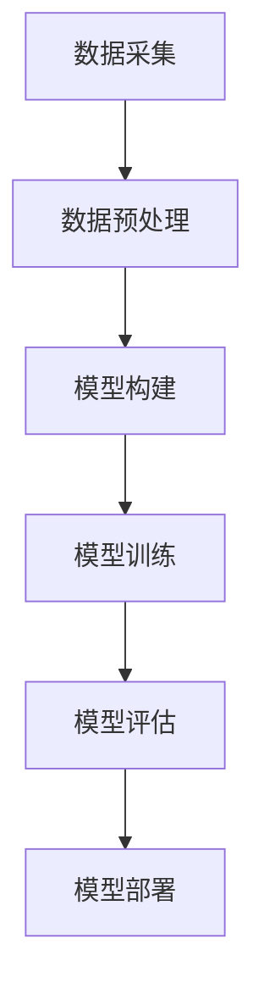

                 

## 文章标题

### AI驱动的预测维护：降低企业设备停机时间

> 关键词：AI，预测维护，设备停机时间，数据分析，机器学习，算法优化

> 摘要：本文探讨了AI驱动的预测维护在降低企业设备停机时间方面的应用。通过介绍预测维护的基本概念，核心算法原理，项目实战案例，以及最佳实践和注意事项，本文旨在为读者提供一个全面、深入的指导，帮助企业利用AI技术优化设备维护，降低停机风险。

## 引言

### 预测维护概述

预测维护（Predictive Maintenance）是一种基于设备运行状态数据，通过实时监测和分析，预测设备故障发生时间，从而提前进行维护的一种技术。与传统定期维护相比，预测维护能够更加精准地识别设备故障，减少不必要的停机时间，降低维护成本，提高设备利用率。

预测维护的定义与历史：

- **定义**：预测维护是指利用传感器、数据分析、机器学习等技术，对设备运行状态进行实时监测，预测设备故障的发生时间，并在故障发生前进行维护，以避免故障造成的停机损失。

- **历史**：预测维护起源于20世纪60年代的可靠性工程。随着计算机技术和传感器技术的快速发展，预测维护逐渐从理论走向实践，成为现代工业设备管理的重要手段。

### 预测维护的重要性

- **减少设备停机时间**：通过预测维护，企业可以在设备发生故障前进行预防性维护，从而最大限度地减少设备停机时间，保证生产连续性。

- **降低维护成本**：预测维护可以避免因设备故障导致的紧急维修和高额修复费用，降低维护成本。

- **提高设备利用率**：预测维护使设备在最佳状态下运行，提高设备利用率，延长设备使用寿命。

### AI在预测维护中的应用

- **AI技术的核心优势**：AI技术具有强大的数据处理和分析能力，能够从海量设备运行数据中提取有价值的信息，进行故障预测。

- **AI在预测维护中的具体应用**：AI技术可以应用于数据采集与预处理、故障诊断、预测模型构建等各个环节，实现预测维护的全面优化。

## 第一部分 AI驱动的预测维护基础理论

### 2.1 数据采集与预处理

#### 数据来源

预测维护的数据来源主要包括：

- **传感器数据**：通过安装在设备上的传感器，实时采集设备的运行参数，如温度、压力、振动等。

- **历史数据**：设备运行的历史数据，包括设备维修记录、故障记录等。

#### 数据预处理方法

- **数据清洗**：去除数据中的噪声和异常值，保证数据质量。

- **数据归一化**：将不同物理量级的特征数据进行归一化处理，使其在同一量级范围内。

- **数据降维**：通过降维技术，减少数据维度，提高算法效率。

#### 数据质量评估

- **数据完整性**：评估数据是否完整，是否存在缺失值。

- **数据一致性**：评估数据的一致性，是否存在矛盾或错误的数据。

- **数据准确性**：评估数据的准确性，是否存在误差或偏差。

### 2.2 基本机器学习算法

#### 监督学习

- **定义**：监督学习是一种通过已有标记数据来训练模型，从而对新数据进行预测的机器学习方法。

- **算法**：常见的监督学习算法包括线性回归、逻辑回归、支持向量机等。

#### 无监督学习

- **定义**：无监督学习是一种没有预先标记数据，通过数据自身的特征来发现数据结构或模式的机器学习方法。

- **算法**：常见的无监督学习算法包括聚类、降维等。

#### 强化学习

- **定义**：强化学习是一种通过不断试错，学习如何最大化长期奖励的机器学习方法。

- **算法**：常见的强化学习算法包括Q学习、深度Q网络等。

### 2.3 特征工程

#### 特征选择

- **定义**：特征选择是指从原始特征中选取出对预测目标有重要影响的特征。

- **方法**：常见的特征选择方法包括信息增益、卡方检验等。

#### 特征提取

- **定义**：特征提取是指从原始特征中提取出能够代表数据本质的特征。

- **方法**：常见的特征提取方法包括主成分分析、线性判别分析等。

#### 特征重要性分析

- **定义**：特征重要性分析是指评估每个特征对预测目标的影响程度。

- **方法**：常见的特征重要性分析方法包括特征贡献率、特征权重等。

## 第二部分 AI驱动的预测维护核心算法

### 3.1 聚类分析算法

#### K-均值聚类

- **定义**：K-均值聚类是一种基于距离度量的聚类算法，将数据分为K个簇，使得每个簇内的数据距离聚类中心最近。

- **算法**：K-均值聚类的算法流程如下：

  1. 随机初始化K个聚类中心。
  2. 计算每个数据点到聚类中心的距离，将数据点分配到最近的聚类中心。
  3. 更新聚类中心，计算每个簇的均值。
  4. 重复步骤2和3，直到聚类中心不再变化。

#### 层次聚类

- **定义**：层次聚类是一种自上而下或自下而上构建聚类层次结构的聚类算法。

- **算法**：层次聚类的算法流程如下：

  1. 将每个数据点视为一个初始簇。
  2. 计算每对簇之间的距离，选择距离最近的簇进行合并。
  3. 更新簇的层次结构。
  4. 重复步骤2和3，直到所有数据点合并为一个簇。

#### 密度聚类

- **定义**：密度聚类是一种基于数据点密度的聚类算法，将具有高密度的区域划分为一个簇。

- **算法**：DBSCAN（Density-Based Spatial Clustering of Applications with Noise）是一种常见的密度聚类算法。

### 3.2 预测模型构建

#### 时间序列分析

- **定义**：时间序列分析是一种用于分析和预测时间序列数据的统计方法。

- **算法**：常见的时间序列分析方法包括自回归移动平均模型（ARIMA）、长短期记忆网络（LSTM）等。

#### 回归模型

- **定义**：回归模型是一种用于预测连续值的统计模型。

- **算法**：常见的回归模型包括线性回归、多项式回归、岭回归等。

#### 支持向量机

- **定义**：支持向量机是一种用于分类和回归的线性模型。

- **算法**：支持向量机的算法流程如下：

  1. 计算每个数据点到超平面的距离。
  2. 根据距离调整超平面，使得分类误差最小。
  3. 重复步骤1和2，直到满足停止条件。

### 3.3 深度学习模型

#### 卷积神经网络

- **定义**：卷积神经网络是一种用于图像、声音等具有空间或时序特性的数据处理的深度学习模型。

- **算法**：卷积神经网络的算法流程如下：

  1. 输入数据经过卷积层，提取特征。
  2. 通过池化层减少数据维度。
  3. 通过全连接层进行分类或回归。

#### 循环神经网络

- **定义**：循环神经网络是一种用于处理序列数据的深度学习模型。

- **算法**：循环神经网络的算法流程如下：

  1. 输入序列经过循环层，保持状态信息。
  2. 通过全连接层进行分类或回归。
  3. 更新循环层的状态。

#### 长短时记忆网络

- **定义**：长短时记忆网络是一种改进的循环神经网络，用于解决长序列依赖问题。

- **算法**：长短时记忆网络的算法流程如下：

  1. 输入序列经过遗忘门、输入门和输出门，提取长期和短期依赖。
  2. 通过循环层保持状态信息。
  3. 通过全连接层进行分类或回归。

## 第三部分 AI驱动的预测维护项目实战

### 4.1 项目案例1：工厂设备预测维护

#### 项目背景

某工厂拥有一套生产设备，由于设备故障频繁，导致生产停机时间增加，影响了生产效率和产品质量。为了解决这个问题，工厂决定采用AI驱动的预测维护技术，提高设备运行稳定性。

#### 数据集介绍

项目团队收集了工厂设备的历史运行数据，包括温度、压力、振动等参数。同时，收集了设备的故障记录，用于标记数据。

#### 模型设计与实现

项目团队采用了LSTM模型进行设备故障预测。具体步骤如下：

1. **数据预处理**：对数据进行归一化处理，去除噪声和异常值。
2. **特征提取**：使用主成分分析（PCA）提取主要特征。
3. **模型构建**：构建LSTM模型，输入特征序列，输出故障预测结果。
4. **模型训练**：使用历史数据对模型进行训练，调整模型参数。
5. **模型评估**：使用交叉验证方法评估模型性能。

#### 评估与优化

项目团队通过交叉验证方法评估了LSTM模型的性能，结果表明，模型在故障预测方面具有很高的准确率。为了进一步提高模型性能，团队尝试了不同的LSTM结构，并调整了学习率、批次大小等超参数。

#### 项目小结

通过AI驱动的预测维护，工厂设备故障停机时间显著降低，生产效率得到提高。项目结果表明，AI技术在设备故障预测方面具有巨大的潜力。

### 4.2 项目案例2：石油钻井平台维护

#### 项目背景

某石油公司拥有一座深海钻井平台，由于设备老化，故障频发，影响了钻井作业的顺利进行。为了确保钻井平台的安全运行，石油公司决定采用AI驱动的预测维护技术，提前识别设备故障。

#### 数据集介绍

项目团队收集了钻井平台的历史运行数据，包括温度、压力、流量等参数。同时，收集了设备的维修记录，用于标记数据。

#### 模型设计与实现

项目团队采用了时间序列分析方法，构建了ARIMA模型进行设备故障预测。具体步骤如下：

1. **数据预处理**：对数据进行归一化处理，去除噪声和异常值。
2. **特征提取**：使用时间序列分析方法，提取主要特征。
3. **模型构建**：构建ARIMA模型，输入特征序列，输出故障预测结果。
4. **模型训练**：使用历史数据对模型进行训练，调整模型参数。
5. **模型评估**：使用交叉验证方法评估模型性能。

#### 评估与优化

项目团队通过交叉验证方法评估了ARIMA模型的性能，结果表明，模型在故障预测方面具有很高的准确率。为了进一步提高模型性能，团队尝试了不同的ARIMA结构，并调整了参数。

#### 项目小结

通过AI驱动的预测维护，钻井平台设备故障率显著降低，钻井作业的顺利进行得到保障。项目结果表明，AI技术在石油钻井平台维护方面具有显著的应用价值。

## 第四部分 AI驱动的预测维护实践指南

### 5.1 数据收集与存储

#### 数据收集策略

- **传感器部署**：在设备关键位置部署传感器，实时采集设备运行参数。
- **数据接口**：建立统一的数据接口，方便不同数据源的数据采集和传输。

#### 数据存储解决方案

- **分布式存储**：采用分布式存储系统，如Hadoop、HBase等，存储海量设备运行数据。
- **数据仓库**：建立数据仓库，整合不同数据源的数据，为预测维护提供数据支持。

### 5.2 模型训练与部署

#### 模型训练流程

1. **数据预处理**：对数据进行清洗、归一化处理。
2. **特征提取**：根据业务需求，提取主要特征。
3. **模型选择**：选择合适的机器学习或深度学习模型。
4. **模型训练**：使用训练数据对模型进行训练。
5. **模型评估**：使用验证集对模型进行评估。

#### 模型部署策略

1. **模型压缩**：对模型进行压缩，减少模型大小，提高部署效率。
2. **在线部署**：将模型部署到生产环境，实现实时故障预测。
3. **模型更新**：定期更新模型，保证预测的准确性。

### 5.3 持续监控与维护

#### 模型性能监控

1. **实时监控**：对模型运行状态进行实时监控，确保模型稳定运行。
2. **性能评估**：定期评估模型性能，根据评估结果调整模型参数。

#### 维护策略与优化

1. **数据更新**：定期更新设备运行数据，保证模型数据的实时性。
2. **算法优化**：根据设备运行状态，调整预测算法，提高预测准确性。
3. **模型迭代**：根据设备故障模式，不断迭代优化模型，提高故障预测能力。

## 第五部分 未来展望与挑战

### 6.1 AI驱动的预测维护发展趋势

- **新技术的动态**：随着AI技术的不断发展，预测维护将更加智能化、自动化，减少人工干预。
- **行业应用前景**：AI驱动的预测维护将在更多行业得到广泛应用，如智能制造、交通运输、能源等领域。

### 6.2 面临的挑战与解决方案

#### 数据隐私与安全

- **挑战**：预测维护涉及大量设备运行数据，数据隐私和安全成为重要问题。

- **解决方案**：采用数据加密、访问控制等技术，确保数据安全。

#### 模型解释性

- **挑战**：深度学习模型具有很高的预测能力，但缺乏解释性，难以理解模型的决策过程。

- **解决方案**：研究可解释的深度学习模型，提高模型的可解释性。

#### 技术与业务融合

- **挑战**：预测维护技术的应用需要与企业的业务需求相结合，实现技术与业务的深度融合。

- **解决方案**：加强业务与技术团队的合作，确保预测维护技术能够真正满足业务需求。

## 附录

### A.1 Mermaid 流程图

以下是一个Mermaid流程图的示例，用于展示预测维护的基本流程：



### A.2 伪代码与数学公式

以下是一个LSTM模型的伪代码示例：

```python
initialize parameters

for each time step in input sequence:
    calculate input gate
    calculate forget gate
    calculate output gate
    calculate cell state
    calculate hidden state

return hidden state as prediction
```

以下是一个数学公式示例，使用LaTeX格式：

$$
h_t = \sigma(W_h \cdot [h_{t-1}, x_t] + b_h)
$$

其中，$h_t$表示第$t$时刻的隐藏状态，$W_h$和$b_h$分别为权重和偏置，$\sigma$为Sigmoid函数。

### A.3 开发环境与工具介绍

#### 数据预处理工具

- **Pandas**：用于数据清洗、数据操作和分析。
- **NumPy**：用于数值计算。

#### 机器学习框架

- **Scikit-learn**：用于实现监督学习和无监督学习算法。
- **TensorFlow**：用于构建和训练深度学习模型。

#### 模型评估工具

- **Matplotlib**：用于数据可视化。
- **Scikit-learn**：用于评估模型性能。

#### 开发环境搭建

- **Python**：作为主要编程语言。
- **Jupyter Notebook**：用于编写和运行代码。
- **Docker**：用于容器化部署。

### A.4 源代码与解读

以下是一个简单的LSTM模型源代码示例，用于实现时间序列预测：

```python
import tensorflow as tf
from tensorflow.keras.models import Sequential
from tensorflow.keras.layers import LSTM, Dense

# 数据预处理
# ...

# 构建模型
model = Sequential()
model.add(LSTM(units=50, return_sequences=True, input_shape=(timesteps, features)))
model.add(LSTM(units=50))
model.add(Dense(units=1))

# 编译模型
model.compile(optimizer='adam', loss='mean_squared_error')

# 训练模型
model.fit(x_train, y_train, epochs=100, batch_size=32, validation_data=(x_val, y_val))

# 预测
predictions = model.predict(x_test)

# 代码解读与分析
# ...
```

## 结束语

本文介绍了AI驱动的预测维护在降低企业设备停机时间方面的应用。通过分析预测维护的基本概念、核心算法、项目实战案例，以及实践指南，本文旨在为读者提供一个全面、深入的指导。随着AI技术的不断进步，预测维护将在更多行业得到广泛应用，为企业带来巨大的经济效益。未来，我们将继续关注预测维护领域的最新动态，与读者一起探讨更多实践经验和最佳实践。作者：AI天才研究院/AI Genius Institute & 禅与计算机程序设计艺术 /Zen And The Art of Computer Programming

## 总结与展望

### 总结

本文围绕AI驱动的预测维护，从概念介绍到核心算法讲解，再到实际项目案例分析，全面阐述了如何通过人工智能技术降低企业设备停机时间。我们探讨了数据采集与预处理、基本机器学习算法、特征工程、核心算法（如聚类分析、回归模型、深度学习模型）等关键内容。通过具体的项目实战，展示了AI预测维护在实际应用中的效果和优势。

### 展望

未来，AI驱动的预测维护将在以下几个方面取得更大的发展：

1. **技术进步**：随着AI技术的不断进步，尤其是深度学习和强化学习算法的成熟，预测维护的准确性和智能化程度将大幅提升。

2. **行业应用**：预测维护技术将在更多行业得到广泛应用，如航空航天、交通运输、能源等，为企业带来更大的效益。

3. **数据隐私和安全**：随着数据隐私和安全问题日益突出，未来的预测维护系统将更加注重数据保护，确保用户数据的安全。

4. **跨学科融合**：预测维护将与其他学科（如机械工程、材料科学）相结合，推动跨学科研究，为设备维护提供更全面、深入的支持。

### 最佳实践 Tips

1. **数据质量是关键**：确保数据的质量和准确性，是预测维护成功的基础。定期清洗和更新数据，是保障模型准确性的关键。

2. **模型选择与优化**：根据实际业务需求，选择合适的模型，并进行参数调优，以提升模型的预测性能。

3. **持续监控与迭代**：建立持续的监控机制，对模型性能进行评估和优化，确保预测的准确性和实时性。

4. **团队协作**：预测维护是一个跨学科的领域，需要数据科学家、工程师、业务专家等多方协作，共同推动项目的成功。

### 小结

AI驱动的预测维护不仅能够降低设备停机时间，提高设备利用率，还能为企业带来显著的经济效益。随着技术的不断进步，预测维护将在更多行业得到广泛应用，为企业数字化转型提供有力支持。

### 注意事项

1. **数据保护**：在数据收集和处理过程中，应严格遵守数据保护法规，确保用户隐私和数据安全。

2. **模型解释性**：尽管深度学习模型具有强大的预测能力，但其内部决策过程往往缺乏解释性。未来研究应关注提高模型的可解释性，以增强用户对模型的信任。

3. **实时性**：预测维护系统应具备实时性，确保在设备故障发生前能够及时采取行动。

### 拓展阅读

1. **《人工智能：一种现代方法》**：迈克尔·刘易斯、马库斯·亨特著，详细介绍了人工智能的基础知识。
2. **《深度学习》**：伊恩·古德费洛、约书亚·本吉奥、亚伦·库维尔尼克著，全面讲解了深度学习的基本原理和实现方法。
3. **《预测分析：从数据到决策》**：菲利普·莱因哈特、弗兰克·皮埃罗著，介绍了预测分析在各个领域的应用和实践。

通过以上内容，本文希望能够为读者提供一个关于AI驱动的预测维护的全面理解，并激励读者在实际工作中探索和应用这一先进技术。作者：AI天才研究院/AI Genius Institute & 禅与计算机程序设计艺术 /Zen And The Art of Computer Programming

