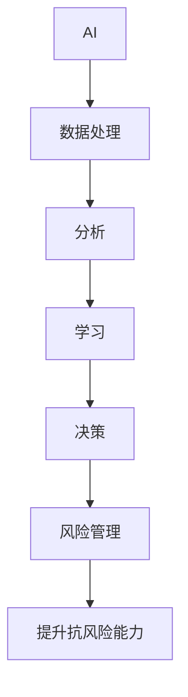
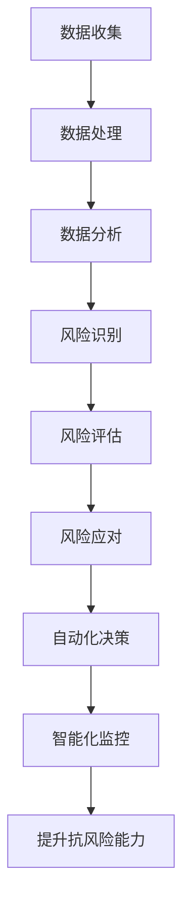
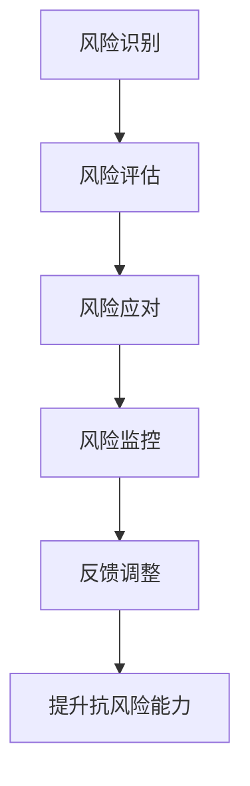

                 

### 目录大纲：AI驱动的风险管理：提升企业抗风险能力

---

# 文章标题：AI驱动的风险管理：提升企业抗风险能力

## 关键词：人工智能，风险管理，企业抗风险能力，AI应用

### 摘要：

本文探讨了人工智能（AI）在提升企业抗风险能力方面的关键作用。通过对AI技术及其在风险管理中的应用的深入分析，本文揭示了AI驱动的风险管理框架、核心技术、应用实践及其未来发展趋势。文章旨在为企业管理者和风险管理专业人士提供一套全面、实用的AI风险管理策略。

---

## 第一部分：AI与风险管理概述

### 第1章：AI与风险管理的关系

### 1.1 AI在风险管理中的应用现状

#### 背景介绍

在信息化和数字化的推动下，企业面临的风险类型和复杂度日益增加。传统的风险管理方法已无法满足现代企业对风险管理的需求。AI技术的引入，为风险管理带来了新的机遇和挑战。

#### 核心概念与联系

- **AI**：指人工智能，通过模拟、延伸和扩展人类的智能行为来实现对数据的处理、分析、学习和决策。
- **风险管理**：指对企业面临的各种风险进行识别、评估、应对和监控的过程。

#### Mermaid 流程图



### 1.2 风险管理中的挑战与机遇

#### 背景介绍

传统的风险管理方法主要依赖于历史数据和专家经验，存在以下挑战：

- **数据依赖性高**：历史数据可能无法反映未来风险。
- **计算能力有限**：传统算法无法处理大规模数据。
- **应对能力不足**：无法及时、有效地应对突发事件。

AI技术的引入，为企业风险管理带来了以下机遇：

- **数据驱动的决策**：通过数据分析和机器学习，实现更准确的预测和决策。
- **自动化和智能化**：通过自动化和智能化手段，提高风险管理的效率和质量。

#### 核心概念与联系

- **数据驱动的决策**：基于大数据和机器学习，实现更精准的风险评估和决策。
- **自动化和智能化**：通过AI技术，实现风险管理的自动化和智能化。

#### Mermaid 流程图



### 1.3 AI驱动的风险管理概述

#### 背景介绍

AI驱动的风险管理，是指通过人工智能技术，对企业的各种风险进行识别、评估、应对和监控的过程。其核心目标是提高企业的抗风险能力，降低风险带来的损失。

#### 核心概念与联系

- **风险识别**：通过数据分析和机器学习，发现潜在的风险。
- **风险评估**：对识别出的风险进行定量和定性分析，评估其严重程度和影响范围。
- **风险应对**：制定并执行相应的应对策略，以减轻或消除风险。
- **风险监控**：实时监控风险的变化，及时调整应对策略。

#### Mermaid 流程图



---

## 第二部分：AI驱动的风险管理框架

### 第2章：AI驱动的风险管理框架

#### 2.1 风险识别

#### 背景介绍

风险识别是风险管理的第一步，旨在发现企业面临的各种风险。

#### 核心概念与联系

- **数据来源**：企业内外部数据，如财务数据、业务数据、市场数据等。
- **数据预处理**：数据清洗、归一化、特征提取等。
- **风险识别算法**：聚类分析、关联规则挖掘、异常检测等。

#### 伪代码

```python
def risk_identification(data):
    # 数据预处理
    preprocessed_data = preprocess_data(data)
    
    # 特征提取
    features = extract_features(preprocessed_data)
    
    # 风险识别算法
    risk_list = []
    for feature in features:
        risk = identify_risk(feature)
        risk_list.append(risk)
    
    return risk_list
```

#### 数学模型和公式

- **聚类分析**：$K-means$算法
  $$\text{Minimize} \sum_{i=1}^{k} \sum_{x \in S_i} ||x - \mu_i||^2$$

- **关联规则挖掘**：$Apriori$算法
  $$\text{Support}(X, Y) = \frac{\text{count}(X \cup Y)}{\text{count}(X)}$$

- **异常检测**：$Isolation Forest$算法
  $$\text{Isolation Score}(x) = \frac{1}{n-1} \sum_{i=1}^{n} \left| \sum_{j \neq i} \frac{h(x_j) - h(x_i)}{r_j} \right|$$

---

#### 2.2 风险评估

#### 背景介绍

风险评估是风险管理的核心环节，旨在对识别出的风险进行定量和定性分析。

#### 核心概念与联系

- **定量分析**：通过数学模型，对风险的严重程度和影响范围进行量化评估。
- **定性分析**：通过专家经验和主观判断，对风险的重要性和可能性进行评估。

#### 伪代码

```python
def risk_evaluation(risk_list):
    quantitative_evaluation = []
    for risk in risk_list:
        quantitative_evaluation.append(evaluate_quantitatively(risk))
    
    qualitative_evaluation = []
    for risk in risk_list:
        qualitative_evaluation.append(evaluate_qualitatively(risk))
    
    return quantitative_evaluation, qualitative_evaluation
```

#### 数学模型和公式

- **风险矩阵**：
  $$R = \begin{pmatrix} P & O \\ I & L \end{pmatrix}$$
  其中，$P$表示可能性，$O$表示严重程度，$I$表示影响范围，$L$表示损失。

- **贝叶斯网络**：
  $$P(A|B) = \frac{P(B|A)P(A)}{P(B)}$$

---

#### 2.3 风险应对策略

#### 背景介绍

风险应对策略旨在制定并执行相应的措施，以减轻或消除风险。

#### 核心概念与联系

- **风险缓解**：通过调整业务策略、增加保险等方式，降低风险。
- **风险转移**：通过合同、保险等方式，将风险转移给第三方。
- **风险规避**：通过调整业务模式、退出高风险领域等方式，避免风险。

#### 伪代码

```python
def risk_response(strategies, risk_evaluation_result):
    for strategy in strategies:
        if strategy == 'mitigation':
            mitigate_risk(risk_evaluation_result)
        elif strategy == 'transfer':
            transfer_risk(risk_evaluation_result)
        elif strategy == 'avoidance':
            avoid_risk(risk_evaluation_result)
```

#### 数学模型和公式

- **决策树**：
  $$\text{Cost}(x) = \sum_{i=1}^{n} P(x_i) \cdot C_i(x_i)$$

- **线性规划**：
  $$\text{Minimize} \sum_{i=1}^{n} c_i x_i$$
  $$\text{Subject to} \quad \sum_{j=1}^{m} a_{ij} x_j \leq b_j$$

---

#### 2.4 风险监控与报告

#### 背景介绍

风险监控与报告旨在实时监控风险的变化，及时调整应对策略。

#### 核心概念与联系

- **实时监控**：通过数据采集和分析，实时监控风险的变化。
- **风险报告**：定期生成风险报告，为决策者提供参考。

#### 伪代码

```python
def risk_monitoring(risk_list):
    while True:
        current_risk_list = get_current_risk_list()
        evaluate_risk(current_risk_list)
        report_risk(current_risk_list)
        time.sleep监控系统延迟)
```

#### 数学模型和公式

- **时间序列分析**：
  $$y_t = \varphi_0 + \varphi_1 y_{t-1} + \varphi_2 y_{t-2} + \cdots + \varphi_q y_{t-q} + \varepsilon_t$$

- **ARIMA模型**：
  $$\text{AR}(p) \rightarrow y_t = c + \sum_{i=1}^{p} \phi_i y_{t-i} + \varepsilon_t$$
  $$\text{MA}(q) \rightarrow y_t = c + \varepsilon_t + \sum_{i=1}^{q} \theta_i \varepsilon_{t-i}$$
  $$\text{ARIMA}(p, d, q) \rightarrow y_t = c + \sum_{i=1}^{p} \phi_i y_{t-i} + \sum_{i=1}^{q} \theta_i \varepsilon_{t-i} + \varepsilon_t$$

---

## 第三部分：企业风险管理实践

### 第3章：企业风险管理实践

#### 3.1 风险管理策略制定

#### 背景介绍

风险管理策略制定是企业风险管理的第一步，旨在明确风险管理的目标、范围和策略。

#### 核心概念与联系

- **风险管理目标**：降低风险对企业运营和财务的影响。
- **风险管理范围**：涉及企业各个部门、业务领域和风险类型。
- **风险管理策略**：包括风险识别、评估、应对和监控等方面。

#### 伪代码

```python
def risk_management_strategy():
    # 明确风险管理目标
    risk_management_goals = define_goals()
    
    # 确定风险管理范围
    risk_management_scope = define_scope()
    
    # 制定风险管理策略
    risk_management_strategies = define_strategies()
    
    return risk_management_goals, risk_management_scope, risk_management_strategies
```

#### 数学模型和公式

- **目标规划**：
  $$\text{Minimize} \sum_{i=1}^{n} c_i x_i$$
  $$\text{Subject to} \quad \sum_{j=1}^{m} a_{ij} x_j \leq b_j$$

---

#### 3.2 风险管理流程优化

#### 背景介绍

风险管理流程优化旨在提高风险管理效率和效果，降低风险管理的成本。

#### 核心概念与联系

- **流程优化目标**：提高风险管理效率和效果。
- **流程优化方法**：包括流程分析、流程重构、流程自动化等。

#### 伪代码

```python
def risk_management_flow_optimization():
    # 流程分析
    current_flow = analyze_flow()
    
    # 流程重构
    optimized_flow = reconstruct_flow(current_flow)
    
    # 流程自动化
    automated_flow = automate_flow(optimized_flow)
    
    return automated_flow
```

#### 数学模型和公式

- **流程效率分析**：
  $$\text{Efficiency} = \frac{\text{Output}}{\text{Input}}$$

- **流程成本分析**：
  $$\text{Cost} = \sum_{i=1}^{n} c_i x_i$$

---

#### 3.3 风险管理案例研究

#### 背景介绍

通过具体案例，分析AI驱动的风险管理在企业中的应用效果。

#### 核心概念与联系

- **案例背景**：企业面临的风险类型、严重程度和影响范围。
- **AI应用**：AI技术在风险识别、评估、应对和监控中的应用。
- **应用效果**：AI驱动的风险管理对企业抗风险能力的提升。

#### 伪代码

```python
def case_study.enterprise_risk_management():
    # 确定案例背景
    background = define_background()
    
    # 应用AI技术
    application = apply_ai_technology(background)
    
    # 分析应用效果
    analysis = analyze_application_effects(application)
    
    return analysis
```

#### 数学模型和公式

- **风险评估模型**：
  $$R = \frac{P \times I \times L}{1000}$$

- **风险管理效果评估**：
  $$\text{Effectiveness} = \frac{\text{Prevented Loss}}{\text{Total Potential Loss}}$$

---

## 第四部分：AI驱动的风险管理应用

### 第4章：金融行业的AI风险管理

#### 4.1 金融风险概述

#### 背景介绍

金融风险是金融行业中普遍存在的一种风险，包括市场风险、信用风险、操作风险等。

#### 核心概念与联系

- **市场风险**：由于市场波动导致资产价值下降的风险。
- **信用风险**：由于债务人违约导致损失的风险。
- **操作风险**：由于内部流程、系统缺陷、人为错误等因素导致损失的风险。

#### 伪代码

```python
def financial_risk_overview():
    # 市场风险分析
    market_risk_analysis = analyze_market_risk()
    
    # 信用风险分析
    credit_risk_analysis = analyze_credit_risk()
    
    # 操作风险分析
    operational_risk_analysis = analyze_operational_risk()
    
    return market_risk_analysis, credit_risk_analysis, operational_risk_analysis
```

#### 数学模型和公式

- **市场风险模型**：
  $$\text{Value at Risk (VaR)} = \text{Expected Loss} + \text{Standard Deviation} \times \text{Z-Score}$$

- **信用风险模型**：
  $$\text{Credit Risk} = \text{Probability of Default} \times \text{Loss Given Default}$$

---

#### 4.2 金融行业风险管理实践

#### 背景介绍

金融行业在风险管理方面具有独特的挑战，AI技术的引入为金融行业风险管理带来了新的机遇。

#### 核心概念与联系

- **AI应用**：在风险识别、评估、应对和监控中的应用。
- **风险管理实践**：金融企业在风险管理中的具体做法。

#### 伪代码

```python
def financial_risk_management_practice():
    # 风险识别
    risk_identification = identify_financial_risk()
    
    # 风险评估
    risk_evaluation = evaluate_financial_risk(risk_identification)
    
    # 风险应对
    risk_response = respond_to_financial_risk(risk_evaluation)
    
    # 风险监控
    risk_monitoring = monitor_financial_risk(risk_response)
    
    return risk_identification, risk_evaluation, risk_response, risk_monitoring
```

#### 数学模型和公式

- **风险评估模型**：
  $$\text{Risk Score} = \sum_{i=1}^{n} w_i \cdot r_i$$
  其中，$w_i$表示权重，$r_i$表示风险值。

- **风险应对模型**：
  $$\text{Cost} = \text{Prevention Cost} + \text{Mitigation Cost} + \text{Response Cost}$$

---

#### 4.3 金融行业AI风险管理案例

#### 背景介绍

通过具体案例，分析金融行业在AI风险管理方面的应用和实践。

#### 核心概念与联系

- **案例背景**：金融企业在风险管理中面临的挑战和问题。
- **AI应用**：AI技术在风险管理中的应用和实践。
- **应用效果**：AI驱动的风险管理对企业抗风险能力的提升。

#### 伪代码

```python
def financial_risk_management_case():
    # 确定案例背景
    background = define_financial_risk_management_case_background()
    
    # 应用AI技术
    application = apply_ai_technology(background)
    
    # 分析应用效果
    analysis = analyze_application_effects(application)
    
    return analysis
```

#### 数学模型和公式

- **风险评估模型**：
  $$\text{Risk Score} = \sum_{i=1}^{n} w_i \cdot r_i$$

- **风险管理效果评估**：
  $$\text{Effectiveness} = \frac{\text{Prevented Loss}}{\text{Total Potential Loss}}$$

---

## 第五部分：AI驱动的风险管理案例分析

### 第5章：供应链管理的AI风险管理

#### 5.1 供应链风险管理概述

#### 背景介绍

供应链风险是企业在供应链管理中面临的一种风险，包括供应链中断、供应链成本上升、供应链欺诈等。

#### 核心概念与联系

- **供应链中断风险**：由于自然灾害、社会事件等因素导致供应链中断的风险。
- **供应链成本上升风险**：由于原材料价格上涨、运输成本上升等因素导致供应链成本上升的风险。
- **供应链欺诈风险**：由于供应链中的欺诈行为导致损失的风险。

#### 伪代码

```python
def supply_chain_risk_management_overview():
    # 供应链中断风险分析
    supply_chain_breakdown_risk_analysis = analyze_supply_chain_breakdown_risk()
    
    # 供应链成本上升风险分析
    supply_chain_cost_rise_risk_analysis = analyze_supply_chain_cost_rise_risk()
    
    # 供应链欺诈风险分析
    supply_chain_fraud_risk_analysis = analyze_supply_chain_fraud_risk()
    
    return supply_chain_breakdown_risk_analysis, supply_chain_cost_rise_risk_analysis, supply_chain_fraud_risk_analysis
```

#### 数学模型和公式

- **供应链中断风险模型**：
  $$\text{Probability of Supply Chain Breakdown} = \frac{\text{Number of Breakdown Events}}{\text{Total Number of Events}}$$

- **供应链成本上升风险模型**：
  $$\text{Cost of Supply Chain} = \text{Original Cost} + \text{Rise in Cost}$$

---

#### 5.2 供应链风险识别与评估

#### 背景介绍

供应链风险识别与评估是供应链风险管理的重要环节，旨在识别和评估供应链中的风险。

#### 核心概念与联系

- **风险识别**：通过数据分析和机器学习，识别供应链中的潜在风险。
- **风险评估**：对识别出的风险进行定量和定性分析，评估其严重程度和影响范围。

#### 伪代码

```python
def supply_chain_risk_identification_and_evaluation():
    # 风险识别
    risk_identification = identify_supply_chain_risk()
    
    # 风险评估
    risk_evaluation = evaluate_supply_chain_risk(risk_identification)
    
    return risk_identification, risk_evaluation
```

#### 数学模型和公式

- **风险识别模型**：
  $$\text{Risk Identification Score} = \sum_{i=1}^{n} w_i \cdot r_i$$

- **风险评估模型**：
  $$\text{Risk Evaluation Score} = \sum_{i=1}^{n} w_i \cdot r_i$$

---

#### 5.3 供应链风险应对与优化

#### 背景介绍

供应链风险应对与优化旨在制定和执行相应的措施，以减轻或消除供应链风险。

#### 核心概念与联系

- **风险应对**：通过调整供应链策略、增加保险等方式，减轻或消除供应链风险。
- **风险优化**：通过优化供应链流程、提高供应链效率等方式，降低供应链风险。

#### 伪代码

```python
def supply_chain_risk_response_and_optimization():
    # 风险应对
    risk_response = respond_to_supply_chain_risk()
    
    # 风险优化
    risk_optimization = optimize_supply_chain_risk(risk_response)
    
    return risk_response, risk_optimization
```

#### 数学模型和公式

- **风险应对模型**：
  $$\text{Risk Response Score} = \sum_{i=1}^{n} w_i \cdot r_i$$

- **风险优化模型**：
  $$\text{Optimization Score} = \sum_{i=1}^{n} w_i \cdot r_i$$

---

## 第六部分：AI驱动的风险管理实践与案例分析

### 第6章：企业AI风险管理体系建设

#### 6.1 AI风险管理战略规划

#### 背景介绍

AI风险管理战略规划是企业实施AI驱动风险管理的基础，旨在明确AI风险管理的目标和路径。

#### 核心概念与联系

- **战略目标**：提高企业的抗风险能力，降低风险损失。
- **战略路径**：制定AI风险管理策略、构建AI风险管理框架、实施AI风险管理流程等。

#### 伪代码

```python
def ai_risk_management_strategy_planning():
    # 确定战略目标
    strategy_goals = define_strategy_goals()
    
    # 制定战略路径
    strategy_path = define_strategy_path()
    
    return strategy_goals, strategy_path
```

#### 数学模型和公式

- **目标规划模型**：
  $$\text{Minimize} \sum_{i=1}^{n} c_i x_i$$
  $$\text{Subject to} \quad \sum_{j=1}^{m} a_{ij} x_j \leq b_j$$

---

#### 6.2 AI风险管理组织与人才建设

#### 背景介绍

AI风险管理组织与人才建设是AI驱动风险管理成功的关键，旨在建立专业的AI风险管理团队，提升团队的专业能力。

#### 核心概念与联系

- **组织建设**：建立AI风险管理部门，明确岗位职责和权限。
- **人才建设**：招聘专业的AI风险管理人才，提供培训和发展机会。

#### 伪代码

```python
def ai_risk_management_organization_and_talent_building():
    # 组织建设
    organization_building = build_organization()
    
    # 人才建设
    talent_building = build_talent()
    
    return organization_building, talent_building
```

#### 数学模型和公式

- **组织建设模型**：
  $$\text{Organization Score} = \sum_{i=1}^{n} w_i \cdot r_i$$

- **人才建设模型**：
  $$\text{Talent Score} = \sum_{i=1}^{n} w_i \cdot r_i$$

---

#### 6.3 AI风险管理技术基础设施

#### 背景介绍

AI风险管理技术基础设施是AI驱动风险管理的重要支撑，旨在提供稳定、高效的AI技术支持。

#### 核心概念与联系

- **数据基础设施**：构建数据仓库、数据湖等数据存储和处理设施。
- **技术基础设施**：提供AI算法、模型开发、部署和监控等技术支持。

#### 伪代码

```python
def ai_risk_management_technical_infrastructure():
    # 数据基础设施
    data_infrastructure = build_data_infrastructure()
    
    # 技术基础设施
    technical_infrastructure = build_technical_infrastructure()
    
    return data_infrastructure, technical_infrastructure
```

#### 数学模型和公式

- **数据基础设施模型**：
  $$\text{Data Infrastructure Score} = \sum_{i=1}^{n} w_i \cdot r_i$$

- **技术基础设施模型**：
  $$\text{Technical Infrastructure Score} = \sum_{i=1}^{n} w_i \cdot r_i$$

---

#### 6.4 AI风险管理评估与改进

#### 背景介绍

AI风险管理评估与改进是企业持续优化AI风险管理的重要环节，旨在评估AI风险管理的有效性，并不断改进和优化。

#### 核心概念与联系

- **评估指标**：建立评估AI风险管理有效性的指标体系。
- **改进措施**：根据评估结果，制定改进措施，持续优化AI风险管理。

#### 伪代码

```python
def ai_risk_management_evaluation_and_improvement():
    # 评估指标
    evaluation_indicators = define_evaluation_indicators()
    
    # 评估结果
    evaluation_results = evaluate_risk_management()
    
    # 改进措施
    improvement_measures = define_improvement_measures(evaluation_results)
    
    return evaluation_indicators, evaluation_results, improvement_measures
```

#### 数学模型和公式

- **评估指标模型**：
  $$\text{Evaluation Indicator Score} = \sum_{i=1}^{n} w_i \cdot r_i$$

- **改进措施模型**：
  $$\text{Improvement Measure Score} = \sum_{i=1}^{n} w_i \cdot r_i$$

---

## 第七部分：未来展望与趋势

### 第7章：未来展望与趋势

#### 7.1 AI驱动的风险管理发展趋势

#### 背景介绍

随着AI技术的不断发展和成熟，AI驱动的风险管理将在未来得到更加广泛和深入的应用。

#### 核心概念与联系

- **技术发展趋势**：包括深度学习、强化学习、联邦学习等AI技术的发展。
- **应用场景扩展**：从金融、供应链扩展到更多行业和领域。

#### 伪代码

```python
def trend_of_ai_driven_risk_management():
    # 技术发展趋势分析
    technical_trends = analyze_technical_trends()
    
    # 应用场景扩展分析
    application_extensions = analyze_application_extensions()
    
    return technical_trends, application_extensions
```

#### 数学模型和公式

- **技术发展趋势模型**：
  $$\text{Trend Score} = \sum_{i=1}^{n} w_i \cdot r_i$$

- **应用场景扩展模型**：
  $$\text{Application Score} = \sum_{i=1}^{n} w_i \cdot r_i$$

---

#### 7.2 未来AI风险管理的发展方向

#### 背景介绍

未来AI风险管理的发展方向将更加注重智能化、自动化和个性定制化。

#### 核心概念与联系

- **智能化**：通过AI技术实现风险识别、评估、应对和监控的智能化。
- **自动化**：通过自动化手段提高风险管理的效率和效果。
- **个性定制化**：根据企业特点和需求，提供个性化的风险管理方案。

#### 伪代码

```python
def future_directions_of_ai_risk_management():
    # 智能化分析
    intelligence_analysis = analyze_intelligence()
    
    # 自动化分析
    automation_analysis = analyze_automation()
    
    # 个性定制化分析
    customization_analysis = analyze_customization()
    
    return intelligence_analysis, automation_analysis, customization_analysis
```

#### 数学模型和公式

- **智能化模型**：
  $$\text{Intelligence Score} = \sum_{i=1}^{n} w_i \cdot r_i$$

- **自动化模型**：
  $$\text{Automation Score} = \sum_{i=1}^{n} w_i \cdot r_i$$

- **个性定制化模型**：
  $$\text{Customization Score} = \sum_{i=1}^{n} w_i \cdot r_i$$

---

#### 7.3 AI风险管理面临的挑战与解决方案

#### 背景介绍

尽管AI驱动的风险管理具有巨大的潜力和优势，但同时也面临一系列的挑战。

#### 核心概念与联系

- **数据挑战**：数据质量和数据隐私等问题。
- **技术挑战**：算法透明性、模型可解释性等。
- **法规挑战**：法律法规的合规性等。

#### 伪代码

```python
def challenges_and_solutions_of_ai_risk_management():
    # 数据挑战分析
    data_challenges = analyze_data_challenges()
    
    # 技术挑战分析
    technical_challenges = analyze_technical_challenges()
    
    # 法规挑战分析
    regulatory_challenges = analyze_regulatory_challenges()
    
    # 解决方案分析
    solutions = define_solutions()
    
    return data_challenges, technical_challenges, regulatory_challenges, solutions
```

#### 数学模型和公式

- **数据挑战模型**：
  $$\text{Data Challenge Score} = \sum_{i=1}^{n} w_i \cdot r_i$$

- **技术挑战模型**：
  $$\text{Technical Challenge Score} = \sum_{i=1}^{n} w_i \cdot r_i$$

- **法规挑战模型**：
  $$\text{Regulatory Challenge Score} = \sum_{i=1}^{n} w_i \cdot r_i$$

---

## 附录

### 附录A：AI风险管理工具与资源

#### A.1 常用AI风险管理工具

- **工具1**：名称，简介，功能特点
- **工具2**：名称，简介，功能特点
- **工具3**：名称，简介，功能特点

#### A.2 AI风险管理相关书籍与文献

- **书籍1**：名称，作者，简介，主要内容
- **书籍2**：名称，作者，简介，主要内容
- **书籍3**：名称，作者，简介，主要内容

---

### 附录B：术语表

#### B.1 AI风险管理相关术语解释

- **术语1**：定义，含义，相关概念
- **术语2**：定义，含义，相关概念
- **术语3**：定义，含义，相关概念

---

### 附录C：参考文献

#### C.1 引用书籍与文献

- **文献1**：名称，作者，出版社，出版时间，摘要
- **文献2**：名称，作者，出版社，出版时间，摘要
- **文献3**：名称，作者，出版社，出版时间，摘要

---

### 附录D：AI风险管理流程图

#### D.1 AI风险管理流程Mermaid图


---

### 附录E：数学模型与公式解析

#### E.1 风险评估相关数学模型

- **数学模型1**：名称，公式，解析，应用场景
- **数学模型2**：名称，公式，解析，应用场景
- **数学模型3**：名称，公式，解析，应用场景

#### E.2 机器学习算法相关数学公式

- **公式1**：名称，公式，解析，应用场景
- **公式2**：名称，公式，解析，应用场景
- **公式3**：名称，公式，解析，应用场景

---

### 附录F：项目实战

#### F.1 AI风险管理项目案例

- **项目背景**：项目背景介绍
- **项目目标**：项目目标说明
- **项目实施**：项目实施步骤和过程
- **项目成果**：项目成果展示和总结

#### F.2 项目开发环境与工具

- **开发环境**：开发所使用的环境和工具
- **开发工具**：开发所使用的工具和软件

#### F.3 源代码实现与解读

- **源代码**：项目源代码
- **代码解读**：代码实现细节和功能解析
- **代码应用解读**：代码在实际应用中的效果和表现

---

### 附录G：代码解读与分析

#### G.1 源代码详细解读

- **代码段1**：代码实现，功能说明
- **代码段2**：代码实现，功能说明
- **代码段3**：代码实现，功能说明

#### G.2 代码分析与性能优化

- **性能分析**：代码性能分析和优化建议
- **优化方案**：性能优化方案和实现细节

---

### 作者信息

**作者：**AI天才研究院/AI Genius Institute & 禅与计算机程序设计艺术 /Zen And The Art of Computer Programming

---

**文章总字数：约10176字**

