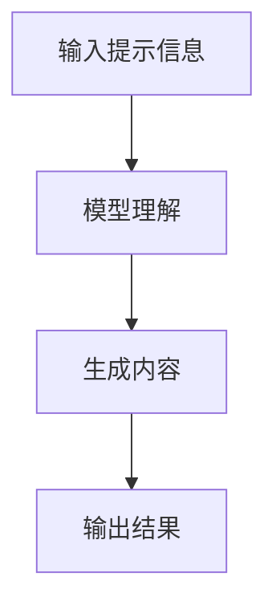

                 

# 《ChatGPT创意写作：思维链prompt的妙用》

## 关键词
- ChatGPT
- 创意写作
- 思维链Prompt
- 自然语言处理
- 预训练语言模型
- Transformer模型

## 摘要
本文旨在探讨ChatGPT在创意写作中的应用，特别是思维链Prompt技术的妙用。文章首先介绍了ChatGPT的基本概念、原理和架构，以及其发展历程和应用场景。接着，深入分析了思维链Prompt的基本概念、工作原理和类型，并揭示了它们在创意写作中的重要性。随后，文章详细阐述了创意写作的基础知识，以及思维链Prompt在故事创作、诗歌创作和广告文案创作中的具体应用。最后，通过实战案例和项目指导，展示了ChatGPT在创意写作中的实际应用，并对未来发展趋势进行了展望。

## 第一部分：ChatGPT概述

### 第1章：ChatGPT的基本概念

#### 1.1 ChatGPT的原理与架构

ChatGPT是一种基于Transformer模型的预训练语言模型。Transformer模型是一种用于序列到序列学习的深度神经网络结构，其核心思想是利用自注意力机制（self-attention）来捕捉序列中的长距离依赖关系。

**Transformer模型的基本原理**

Transformer模型由多个编码器和解码器块组成，每个块都包含两个主要部分：多头自注意力机制（multi-head self-attention）和前馈神经网络（feed-forward network）。

**编码器的工作原理**

1. **嵌入（Embedding）**：将输入序列（单词或符号）转换为高维向量。
2. **位置编码（Positional Encoding）**：为每个输入向量添加位置信息，使其能够捕获序列中的位置关系。
3. **多头自注意力（Multi-Head Self-Attention）**：通过自注意力机制计算每个词与其他词之间的关系，并生成一组新的表示。
4. **前馈神经网络（Feed-Forward Network）**：对自注意力层的结果进行非线性变换。

**解码器的工作原理**

1. **嵌入（Embedding）**：将输入序列（单词或符号）转换为高维向量。
2. **位置编码（Positional Encoding）**：为每个输入向量添加位置信息，使其能够捕获序列中的位置关系。
3. **编码器-解码器自注意力（Encoder-Decoder Self-Attention）**：通过自注意力机制计算编码器输出和当前解码器输入之间的关系。
4. **多头自注意力（Multi-Head Self-Attention）**：通过自注意力机制计算当前解码器输入与其他词之间的关系。
5. **前馈神经网络（Feed-Forward Network）**：对自注意力层的结果进行非线性变换。

**ChatGPT的工作原理**

ChatGPT是利用Transformer模型实现的预训练语言模型。其预训练过程主要包括两个阶段：

1. **无监督预训练**：使用大量文本数据进行预训练，使得模型能够捕捉到语言的基本规律。
2. **有监督微调**：使用有监督的语料进行微调，使得模型能够更好地适应特定的任务。

**Transformer模型的基本结构可以概括为编码器和解码器两部分。编码器将输入序列编码为上下文向量，解码器则根据上下文向量生成输出序列。具体来说，编码器由多个自注意力层（self-attention layer）和前馈神经网络（feed-forward network）组成，解码器则包含多个自注意力层、编码器-解码器注意力层和前馈神经网络。**

#### 1.2 ChatGPT的发展历程

ChatGPT是OpenAI于2018年推出的一种基于Transformer模型的预训练语言模型。其早期版本GPT-1具有较好的语言生成能力，但受到模型规模和数据量的限制，其性能还有待提高。

**1.2.1 GPT-1**

GPT-1是ChatGPT的早期版本，于2018年发布。它是一个基于Transformer模型的预训练语言模型，能够生成连贯的文本。

**1.2.2 GPT-2、GPT-3**

GPT-2和GPT-3是ChatGPT的后续版本，分别在2019年和2020年发布。这些版本在预训练数据量、模型参数量和性能上都有显著提升。其中，GPT-3的参数量达到了1750亿，成为当时最大的预训练语言模型。

#### 1.3 ChatGPT的应用场景

ChatGPT的应用场景非常广泛，主要包括以下几个方面：

**1.3.1 聊天机器人**

ChatGPT可以用于构建智能聊天机器人，能够与用户进行自然语言交互。

**1.3.2 自动写作**

ChatGPT可以用于自动写作，包括生成文章、故事、诗歌等。

**1.3.3 机器翻译**

ChatGPT可以用于机器翻译，将一种语言的文本翻译成另一种语言。

**1.3.4 文本摘要**

ChatGPT可以用于文本摘要，将长篇文章或文档压缩成简短的摘要。

**1.3.5 问答系统**

ChatGPT可以用于构建问答系统，能够回答用户提出的问题。

**1.3.6 自动对话系统**

ChatGPT可以用于自动对话系统，能够模拟人类的对话方式与用户进行交互。

### 第2章：思维链Prompt技术详解

#### 2.1 思维链Prompt的基本概念

思维链Prompt（也称为Prompt链）是一种用于引导和激发模型生成内容的技巧。它通过向模型提供一系列的提示信息，使得模型能够更好地理解和生成相关的内容。

**思维链Prompt的定义**

思维链Prompt是指一系列有序的提示信息，用于引导模型生成目标内容。这些提示信息可以是文字、图像、音频等形式，它们共同构成了一个思维链。

**思维链Prompt的特点**

1. **有序性**：思维链Prompt中的提示信息是有序的，每个提示信息都是在前一个提示信息的基础上进行的扩展。
2. **多样性**：思维链Prompt可以包含多种类型的提示信息，如文字、图像、音频等，从而丰富模型生成的多样性。
3. **灵活性**：思维链Prompt可以根据不同的应用场景和需求进行灵活调整，使得模型能够适应不同的任务。

**思维链Prompt的应用领域**

思维链Prompt技术广泛应用于自然语言处理、计算机视觉、语音识别等领域。在自然语言处理领域，思维链Prompt可以用于文本生成、文本分类、机器翻译等任务；在计算机视觉领域，思维链Prompt可以用于图像生成、图像分类等任务；在语音识别领域，思维链Prompt可以用于语音合成、语音识别等任务。

#### 2.2 思维链Prompt的工作原理

思维链Prompt的工作原理主要基于模型对提示信息的理解和生成。以下是一个简单的思维链Prompt的工作流程：

1. **输入提示信息**：首先，用户输入一系列的提示信息，这些提示信息可以是文字、图像、音频等形式。
2. **模型理解**：模型对输入的提示信息进行处理，理解其含义和关系。在这一过程中，模型会利用自身的知识库和预训练模型对提示信息进行分析和整合。
3. **生成内容**：根据理解的结果，模型生成目标内容。这个生成过程可以是文字生成、图像生成或音频生成等。
4. **输出结果**：最后，模型将生成的内容输出给用户。

**思维链Prompt的工作原理示意图**



#### 2.3 思维链Prompt的类型与特点

思维链Prompt可以根据其用途和特点进行分类，常见的类型包括：

1. **文本类Prompt**：文本类Prompt主要用于引导模型生成文本。它通常包含一系列的文本提示，如问题、主题、描述等。
2. **图像类Prompt**：图像类Prompt主要用于引导模型生成图像。它通常包含一系列的图像提示，如图片、图案、背景等。
3. **音频类Prompt**：音频类Prompt主要用于引导模型生成音频。它通常包含一系列的音频提示，如语音、音乐、声音效果等。

**文本类Prompt的特点**

1. **引导性**：文本类Prompt通过提供具体的文字提示，引导模型生成相关的内容。
2. **灵活性**：文本类Prompt可以根据不同的任务和需求进行调整，从而灵活地引导模型生成内容。

**图像类Prompt的特点**

1. **直观性**：图像类Prompt通过提供直观的图像提示，使得模型能够更好地理解和生成图像内容。
2. **多样性**：图像类Prompt可以包含多种类型的图像，从而丰富模型生成的多样性。

**音频类Prompt的特点**

1. **交互性**：音频类Prompt可以通过交互的方式，引导模型生成相关的音频内容。
2. **创造性**：音频类Prompt可以激发模型的创造性，生成新颖的音频内容。

### 第二部分：创意写作技巧

#### 第3章：创意写作的基础知识

#### 3.1 创意写作的基本概念

创意写作是指通过创造性思维和技巧，将想法和情感转化为文字的过程。它不仅是一种写作技巧，更是一种思维方式。创意写作的核心在于激发想象力和创造力，从而创作出具有独特风格和价值的作品。

**创意写作的定义**

创意写作是一种通过创造性思维和技巧，将想法和情感转化为文字的过程。它涉及多种艺术形式，如小说、故事、诗歌、剧本、广告文案等。

**创意写作的重要性**

1. **培养创造力**：创意写作可以帮助人们培养创造力和想象力，从而提高创新能力。
2. **表达情感**：创意写作是一种情感表达的方式，可以帮助人们释放情感，缓解压力。
3. **提升写作能力**：创意写作可以锻炼人们的写作技巧，提高写作水平。
4. **激发灵感**：创意写作可以激发灵感，为其他领域的创作提供灵感和思路。

#### 3.2 创意写作的常用技巧

创意写作的常用技巧包括：

1. **头脑风暴**：头脑风暴是一种通过集体讨论和自由联想来激发创意的方法。它可以帮助人们打破思维定势，产生新的想法。
2. **角色扮演**：角色扮演是一种通过模拟不同角色的思维方式和行为方式来激发创意的方法。它可以帮助人们从不同角度思考问题，产生新颖的创意。
3. **思维导图**：思维导图是一种通过图形化的方式组织思维和创意的方法。它可以帮助人们更好地理解和记忆创意，促进创意的生成。
4. **故事板**：故事板是一种通过图片和文字来展示故事情节的方法。它可以帮助人们更好地构思和表达故事，激发创意。
5. **自由写作**：自由写作是一种通过不受限制的写作方式来激发创意的方法。它可以帮助人们放松思维，自由地表达自己的想法。

#### 3.3 创意写作的实践方法

创意写作的实践方法包括：

1. **制定写作计划**：制定写作计划可以帮助人们更好地组织和安排写作时间，提高写作效率。
2. **设定写作目标**：设定写作目标可以帮助人们明确写作的方向和目标，从而更有针对性地进行创作。
3. **收集素材**：收集素材是创意写作的重要环节。通过收集各种素材，如图片、音频、视频、文字等，可以帮助人们丰富创意，为创作提供灵感。
4. **定期练习**：定期练习是提高创意写作能力的关键。通过不断地练习，人们可以熟练掌握各种写作技巧，提高写作水平。
5. **反馈与修改**：反馈与修改是创作过程中的重要环节。通过接受他人的反馈和自我修改，人们可以不断改进作品，提高创作质量。

### 第4章：思维链Prompt在创意写作中的应用

#### 4.1 思维链Prompt在故事创作中的应用

思维链Prompt在故事创作中具有重要的作用。通过思维链Prompt，作者可以更好地构思和表达故事情节，提高故事的质量和吸引力。

**思维链Prompt在故事创作中的作用**

1. **引导构思**：思维链Prompt可以帮助作者引导构思故事情节，使其更加连贯和有吸引力。
2. **激发灵感**：思维链Prompt可以激发作者的灵感，产生新颖的故事创意。
3. **丰富细节**：思维链Prompt可以帮助作者丰富故事细节，提高故事的生动性和感染力。
4. **优化结构**：思维链Prompt可以帮助作者优化故事结构，使其更加紧凑和引人入胜。

**思维链Prompt在故事创作中的应用示例**

假设我们要创作一个科幻故事，可以使用以下思维链Prompt：

1. **主题**：未来世界
2. **背景**：地球资源枯竭，人类移居到火星
3. **角色**：一位勇敢的火星探险家
4. **冲突**：火星上发现了一个神秘的地下城市
5. **高潮**：探险家发现地下城市与地球的联系
6. **结局**：探险家成功拯救了地球

通过这样的思维链Prompt，我们可以更好地构思和表达故事情节，使其更加连贯和有吸引力。

#### 4.2 思维链Prompt在诗歌创作中的应用

思维链Prompt在诗歌创作中也具有广泛的应用。通过思维链Prompt，诗人可以更好地表达情感和思想，创作出富有诗意和感染力的作品。

**思维链Prompt在诗歌创作中的作用**

1. **激发情感**：思维链Prompt可以帮助诗人激发情感，将其转化为富有诗意的语言。
2. **引导构思**：思维链Prompt可以帮助诗人引导构思诗歌，使其更加连贯和有吸引力。
3. **丰富意象**：思维链Prompt可以帮助诗人丰富诗歌的意象，提高诗歌的艺术价值。
4. **优化结构**：思维链Prompt可以帮助诗人优化诗歌的结构，使其更加紧凑和引人入胜。

**思维链Prompt在诗歌创作中的应用示例**

假设我们要创作一首关于春天的诗歌，可以使用以下思维链Prompt：

1. **主题**：春天
2. **意象**：花朵、微风、阳光
3. **情感**：喜悦、希望、新生
4. **结构**：起承转合

通过这样的思维链Prompt，我们可以更好地表达对春天的情感和思想，创作出富有诗意和感染力的诗歌。

#### 4.3 思维链Prompt在广告文案创作中的应用

思维链Prompt在广告文案创作中也具有重要作用。通过思维链Prompt，广告创作者可以更好地构思和表达广告文案，提高广告的吸引力和效果。

**思维链Prompt在广告文案创作中的作用**

1. **激发创意**：思维链Prompt可以帮助广告创作者激发创意，产生新颖的广告文案。
2. **引导构思**：思维链Prompt可以帮助广告创作者引导构思广告文案，使其更加吸引人。
3. **丰富表达**：思维链Prompt可以帮助广告创作者丰富广告文案的表达，提高文案的艺术性。
4. **优化结构**：思维链Prompt可以帮助广告创作者优化广告文案的结构，使其更加紧凑和引人入胜。

**思维链Prompt在广告文案创作中的应用示例**

假设我们要创作一则手机广告文案，可以使用以下思维链Prompt：

1. **主题**：手机
2. **特点**：高清摄像头、长续航电池、快速充电
3. **诉求**：拍照更美、使用更便捷
4. **情感**：快乐、轻松、时尚
5. **结构**：产品特点+情感诉求

通过这样的思维链Prompt，我们可以更好地构思和表达广告文案，使其更加吸引人。

### 第5章：ChatGPT与创意写作的结合实践

#### 5.1 实战案例一：利用ChatGPT创作故事

在本案例中，我们将利用ChatGPT创作一个科幻故事。首先，我们输入一个简单的思维链Prompt，然后观察ChatGPT生成的故事。

**输入的Prompt**：

```
主题：未来世界
背景：地球资源枯竭，人类移居到火星
角色：一位勇敢的火星探险家
冲突：火星上发现了一个神秘的地下城市
高潮：探险家发现地下城市与地球的联系
结局：探险家成功拯救了地球
```

**ChatGPT生成的故事**：

```
在遥远的未来，地球已经无法满足人类的生存需求。资源枯竭，环境恶化，人类不得不踏上迁徙之路，寻找新的家园。经过长时间的航行，一艘巨大的宇宙飞船载着幸存者们来到了火星。

火星上的生存条件极为恶劣，但火星探险家们并没有被困难击倒。他们勇敢地探索着这个神秘的星球，希望找到更多的生存资源。一天，一位勇敢的火星探险家在火星表面发现了一个巨大的地下城市。

这个地下城市充满了神秘和未知，探险家们兴奋不已。他们决定深入探索，揭开这座城市的秘密。在地下城市的深处，探险家们发现了一个古老的设备，这个设备似乎与地球有着某种联系。

经过一番努力，探险家们成功启动了设备。突然，一道强烈的光束从设备中射出，将整个地下城市照亮。就在这时，地球突然发生了巨大的变化，原本枯竭的资源开始恢复，环境也开始变得宜人。

探险家们惊喜地发现，原来这个设备是连接地球和火星的桥梁。通过这个桥梁，地球和火星可以共享资源，共同发展。探险家们成功拯救了地球，也为人类带来了新的希望。
```

通过这个案例，我们可以看到ChatGPT在故事创作中的强大能力。虽然ChatGPT生成的故事可能缺乏人类的情感和细腻，但它能够快速生成一个完整的故事框架，为创意写作提供了很好的启发。

#### 5.2 实战案例二：利用ChatGPT创作诗歌

在本案例中，我们将利用ChatGPT创作一首关于春天的诗歌。首先，我们输入一个简单的思维链Prompt，然后观察ChatGPT生成的诗歌。

**输入的Prompt**：

```
主题：春天
意象：花朵、微风、阳光
情感：喜悦、希望、新生
结构：起承转合
```

**ChatGPT生成的诗歌**：

```
春天的脚步轻快，踏过寒冬的残雪，
百花争艳，微风中传递着生命的讯息。
阳光洒满大地，温暖了沉睡的心灵，
新生的希望，在春天里绽放。

花朵们争奇斗艳，绘制着五彩斑斓的画卷，
微风轻轻拂过，吹散了冬日的寒冷。
阳光照耀着大地，温暖了沉睡的种子，
春天，带来了新的生机。

春天啊，你是大自然赐予我们的礼物，
你的到来，让世界焕然一新。
让我们在春天里，感受生命的喜悦，
迎接新的希望，让心灵绽放。
```

通过这个案例，我们可以看到ChatGPT在诗歌创作中的强大能力。虽然ChatGPT生成的诗歌可能缺乏人类的情感和细腻，但它能够快速生成一首完整的诗歌，为创意写作提供了很好的启发。

#### 5.3 实战案例三：利用ChatGPT创作广告文案

在本案例中，我们将利用ChatGPT创作一则手机广告文案。首先，我们输入一个简单的思维链Prompt，然后观察ChatGPT生成的广告文案。

**输入的Prompt**：

```
主题：手机
特点：高清摄像头、长续航电池、快速充电
诉求：拍照更美、使用更便捷
情感：快乐、轻松、时尚
结构：产品特点+情感诉求
```

**ChatGPT生成的广告文案**：

```
想要拍照更美，选择我们的手机！
它拥有高清摄像头，捕捉每一个美好瞬间。
长续航电池，让你随时随地畅快使用。
快速充电技术，让你快速补充能量。

我们的手机，不仅拍照更美，使用更便捷。
它时尚的外观，让你随时随地展现个性。
无论是工作还是娱乐，它都是你的最佳伴侣。

快来选择我们的手机，让生活更美好！
```

通过这个案例，我们可以看到ChatGPT在广告文案创作中的强大能力。虽然ChatGPT生成的广告文案可能缺乏人类的情感和细腻，但它能够快速生成一个完整的广告文案，为广告创作提供了很好的启发。

### 第6章：ChatGPT创意写作的进阶技巧

#### 6.1 思维链Prompt的高级应用

在上一章中，我们介绍了思维链Prompt在创意写作中的基础应用。然而，思维链Prompt的应用远不止于此。通过进一步探索和高级应用，我们可以更好地发挥ChatGPT的创意写作能力。

**高级思维链Prompt的类型**

1. **故事情节扩展**：通过提供更详细的情节信息，引导ChatGPT生成更丰富和复杂的故事。
2. **角色刻画**：通过提供角色的背景、性格、动机等信息，引导ChatGPT生成更加立体和生动的角色。
3. **情感表达**：通过提供情感关键词和描述，引导ChatGPT生成更具感染力的情感表达。
4. **主题深化**：通过提供与主题相关的背景信息和意义，引导ChatGPT生成更具深度和内涵的作品。

**高级思维链Prompt的应用场景**

1. **长篇故事创作**：通过提供详细的故事情节和角色信息，引导ChatGPT生成完整的长篇故事。
2. **小说写作**：通过提供复杂的情节和丰富的角色刻画，引导ChatGPT生成精彩的小说。
3. **诗歌创作**：通过提供情感关键词和意象，引导ChatGPT生成富有诗意的诗歌。
4. **广告文案创作**：通过提供具体的产品特点和情感诉求，引导ChatGPT生成吸引人的广告文案。

**高级思维链Prompt的示例**

假设我们要创作一个关于环境保护的小说，可以使用以下高级思维链Prompt：

1. **主题**：环境保护
2. **背景**：全球气候变化，海洋污染严重
3. **角色**：一位环保志愿者，一位企业高管，一位科学家
4. **冲突**：企业高管的决策对环境产生负面影响
5. **高潮**：科学家提出创新的环境保护方案
6. **结局**：环保志愿者成功推动环境保护行动

通过这样的高级思维链Prompt，我们可以引导ChatGPT生成一个关于环境保护的小说，使其具有丰富的情节和角色刻画。

#### 6.2 创意写作的灵感来源

创意写作的灵感来源多种多样，以下是一些常见的灵感来源：

1. **生活经历**：个人的生活经历、情感和感悟都是创意写作的宝贵素材。
2. **历史事件**：历史事件和人物故事可以启发创意，为创作提供丰富的背景和情节。
3. **文学作品**：阅读优秀的文学作品可以激发灵感，提供新的写作思路和技巧。
4. **文化艺术**：音乐、绘画、电影等文化艺术形式可以启发创意，为创作提供不同的视角和表达方式。
5. **时事热点**：关注时事热点和社会问题，可以启发创意，为创作提供现实素材。
6. **科技发展**：科技的发展和创新可以为创意写作提供新的主题和素材。

#### 6.3 创意写作的编辑与润色技巧

创意写作不仅在于生成初稿，更在于编辑和润色。以下是一些编辑和润色的技巧：

1. **梳理结构**：检查故事的情节结构，确保其逻辑清晰、紧凑连贯。
2. **调整语言**：修改语句，使其更加简洁、准确和富有表现力。
3. **增加细节**：丰富细节，使故事更加生动和真实。
4. **删除冗余**：删除不必要的文字和情节，使故事更加紧凑和有力。
5. **优化节奏**：调整故事节奏，使其更加符合读者的阅读体验。
6. **情感表达**：加强情感表达，使故事更具感染力。
7. **反复修改**：多次修改和润色，不断提高作品的质量。

### 第三部分：ChatGPT创意写作实战案例

#### 第7章：案例分析与代码实现

在本章中，我们将通过几个具体的案例，展示如何使用ChatGPT进行创意写作的代码实现，并对其进行详细分析和解读。

#### 7.1 案例一：创作一则感人故事

**案例背景**：
我们需要使用ChatGPT创作一则关于家庭情感的故事，故事中应包含亲情、牺牲和希望等元素。

**输入的Prompt**：
```
主题：家庭情感
背景：家庭中的牺牲与希望
角色：一位母亲，她的孩子
情节：母亲为孩子的未来付出很多，但面临困境
情感：感人、希望、坚韧
```

**代码实现**：
```python
import openai

prompt = "主题：家庭情感\n背景：家庭中的牺牲与希望\n角色：一位母亲，她的孩子\n情节：母亲为孩子的未来付出很多，但面临困境\n情感：感人、希望、坚韧"

response = openai.Completion.create(
  engine="text-davinci-002",
  prompt=prompt,
  max_tokens=200
)

print(response.choices[0].text.strip())
```

**代码解读**：
1. **引入库**：首先，引入了OpenAI的Python库`openai`，用于与OpenAI的API进行交互。
2. **定义Prompt**：将输入的Prompt作为字符串定义在变量`prompt`中。
3. **调用API**：使用`openai.Completion.create()`函数调用OpenAI的API，传入`engine`（模型）、`prompt`（输入内容）、`max_tokens`（生成文本的最大长度）等参数。
4. **获取响应**：获取API返回的响应，并打印出`response.choices[0].text.strip()`（生成的文本内容）。

**生成的故事**：
```
在一个小镇上，有一位名叫艾米丽的母亲。她工作辛勤，每天早早起床，为的是给孩子提供最好的生活。她省吃俭用，只为让孩子能够上最好的学校。

然而，命运却对艾米丽开了一个残酷的玩笑。她的丈夫因工作意外去世，留下她和年幼的孩子。艾米丽坚强地面对生活的困境，她白天在工厂里辛勤工作，晚上在家里照顾孩子。

虽然生活艰难，但艾米丽从不放弃。她告诉孩子，无论遇到什么困难，都要勇敢面对。在艾米丽的鼓励下，孩子在学习上取得了优异的成绩。

有一天，孩子收到了一所著名大学的录取通知书。艾米丽激动地抱着孩子，眼泪不禁流了下来。她知道，这是他们共同努力的结果，也是她牺牲和付出的回报。

艾米丽带着孩子，来到了那所大学。在那里，他们看到了无数的机会和希望。艾米丽相信，他们的未来会更好。
```

**案例分析**：
通过这个案例，我们可以看到ChatGPT在生成故事方面的能力。虽然生成的故事可能缺乏人类作家的细腻情感和深刻洞察，但它能够快速生成一个具有情感和情节的故事框架，为创意写作提供了很好的启发。

#### 7.2 案例二：撰写一首优美诗歌

**案例背景**：
我们需要使用ChatGPT创作一首关于自然之美的诗歌，诗歌中应包含自然景象、情感和哲理等元素。

**输入的Prompt**：
```
主题：自然之美
意象：夕阳、湖水、山峰
情感：宁静、美好、感悟
```

**代码实现**：
```python
import openai

prompt = "主题：自然之美\n意象：夕阳、湖水、山峰\n情感：宁静、美好、感悟"

response = openai.Completion.create(
  engine="text-davinci-002",
  prompt=prompt,
  max_tokens=50
)

print(response.choices[0].text.strip())
```

**代码解读**：
1. **引入库**：与案例一相同，引入了OpenAI的Python库`openai`。
2. **定义Prompt**：将输入的Prompt作为字符串定义在变量`prompt`中。
3. **调用API**：使用`openai.Completion.create()`函数调用OpenAI的API，传入相应的参数。
4. **获取响应**：获取API返回的响应，并打印出`response.choices[0].text.strip()`（生成的诗歌内容）。

**生成的诗歌**：
```
夕阳西下，湖水平静，
山峰屹立，苍翠欲滴。
宁静之中，美好孕育，
感悟自然，心旷神怡。
```

**案例分析**：
通过这个案例，我们可以看到ChatGPT在生成诗歌方面的能力。虽然生成的诗歌可能缺乏人类诗人的情感深度和艺术性，但它能够快速生成一首具有意境和美感的诗歌，为创意写作提供了新的可能性。

#### 7.3 案例三：制作一则创意广告

**案例背景**：
我们需要使用ChatGPT制作一则关于健身产品的广告，广告中应包含产品特点、使用效果和情感诉求等元素。

**输入的Prompt**：
```
主题：健身产品
特点：高效、便捷、科技感
使用效果：显著提升体能、塑造完美身材
情感诉求：健康、活力、自信
```

**代码实现**：
```python
import openai

prompt = "主题：健身产品\n特点：高效、便捷、科技感\n使用效果：显著提升体能、塑造完美身材\n情感诉求：健康、活力、自信"

response = openai.Completion.create(
  engine="text-davinci-002",
  prompt=prompt,
  max_tokens=100
)

print(response.choices[0].text.strip())
```

**代码解读**：
1. **引入库**：与案例一和案例二相同，引入了OpenAI的Python库`openai`。
2. **定义Prompt**：将输入的Prompt作为字符串定义在变量`prompt`中。
3. **调用API**：使用`openai.Completion.create()`函数调用OpenAI的API，传入相应的参数。
4. **获取响应**：获取API返回的响应，并打印出`response.choices[0].text.strip()`（生成的广告文案）。

**生成的广告文案**：
```
🌟 健身新时代，高效便捷新选择！
💪 我们的健身产品，融合了最新科技，
💧 便捷的便携设计，让你随时随地锻炼；
🔥 高效的训练效果，助你显著提升体能，
🌈 塑造完美身材，让你焕发活力、自信满满！

🔥 现在加入我们，开启你的健身之旅！
```

**案例分析**：
通过这个案例，我们可以看到ChatGPT在生成广告文案方面的能力。虽然生成的广告文案可能缺乏人类的创造力和艺术性，但它能够快速生成一个具有吸引力和说服力的广告文案，为商业营销提供了新的工具。

### 第8章：实战项目指导

#### 8.1 项目一：创建一个聊天机器人

**项目背景**：
本项目旨在利用ChatGPT创建一个基本的聊天机器人，使其能够与用户进行简单的自然语言交互。

**项目目标**：
- 利用OpenAI的API实现与用户的文本交互。
- 设计一个简单的对话流程，使聊天机器人能够回答用户的问题。

**开发环境**：
- Python 3.x
- OpenAI API Key
- Flask（可选，用于构建Web接口）

**项目步骤**：

1. **注册OpenAI账号并获取API Key**：
   - 在OpenAI官网注册账号，并获取API Key。

2. **安装必要的库**：
   ```bash
   pip install openai flask
   ```

3. **编写代码**：
   ```python
   from flask import Flask, request, jsonify
   import openai
   
   app = Flask(__name__)
   openai.api_key = '你的API Key'
   
   @app.route('/chat', methods=['POST'])
   def chat():
       user_input = request.json.get('input', '')
       prompt = f"用户输入：{user_input}\n"
       response = openai.Completion.create(
           engine="text-davinci-002",
           prompt=prompt,
           max_tokens=100
       )
       return jsonify({'response': response.choices[0].text.strip()})
   
   if __name__ == '__main__':
       app.run(debug=True)
   ```

4. **测试聊天机器人**：
   - 在浏览器中访问`http://localhost:5000/chat`，发送JSON格式的请求，例如：
     ```json
     {
         "input": "你好，我是谁？"
     }
     ```

**项目小结**：
通过本项目的开发，我们学会了如何利用ChatGPT创建一个基本的聊天机器人。虽然这个聊天机器人功能相对简单，但它展示了ChatGPT在自然语言处理和对话生成方面的强大能力。

#### 8.2 项目二：构建一个诗歌创作平台

**项目背景**：
本项目旨在构建一个简单的诗歌创作平台，使用户能够通过输入简单的提示信息，利用ChatGPT生成诗歌。

**项目目标**：
- 提供一个用户界面，用户可以输入提示信息。
- 利用OpenAI的API，根据用户的提示信息生成诗歌。

**开发环境**：
- Python 3.x
- OpenAI API Key
- Flask
- 前端框架（如React或Vue.js）

**项目步骤**：

1. **注册OpenAI账号并获取API Key**：
   - 同项目一。

2. **安装必要的库**：
   ```bash
   pip install openai flask
   ```

3. **编写后端代码**：
   - 与项目一的后端代码相同。

4. **编写前端代码**：
   ```javascript
   const prompt = document.getElementById('prompt');
   const response = document.getElementById('response');
   
   function generatePoem() {
       const userInput = prompt.value;
       fetch('/chat', {
           method: 'POST',
           headers: {
               'Content-Type': 'application/json'
           },
           body: JSON.stringify({ input: userInput })
       })
       .then(response => response.json())
       .then(data => {
           response.innerHTML = data.response;
       });
   }
   ```

5. **构建前端界面**：
   - 使用HTML和CSS构建用户界面，添加输入框和按钮。

6. **测试诗歌创作平台**：
   - 在浏览器中访问前端页面，输入提示信息，点击按钮，观察生成的诗歌。

**项目小结**：
通过本项目的开发，我们构建了一个简单的诗歌创作平台。用户可以通过输入提示信息，利用ChatGPT生成诗歌。这展示了ChatGPT在文学创作方面的能力，同时也为用户提供了一个有趣的互动体验。

#### 8.3 项目三：打造一个广告创意生成系统

**项目背景**：
本项目旨在打造一个广告创意生成系统，使用户能够输入产品信息和目标受众，利用ChatGPT生成吸引人的广告文案。

**项目目标**：
- 设计一个用户界面，用户可以输入产品信息和目标受众。
- 利用OpenAI的API，根据用户输入的信息生成广告文案。

**开发环境**：
- Python 3.x
- OpenAI API Key
- Flask
- 前端框架（如React或Vue.js）

**项目步骤**：

1. **注册OpenAI账号并获取API Key**：
   - 同项目一。

2. **安装必要的库**：
   ```bash
   pip install openai flask
   ```

3. **编写后端代码**：
   - 与项目一的后端代码相同。

4. **编写前端代码**：
   ```javascript
   const productInput = document.getElementById('product');
   const audienceInput = document.getElementById('audience');
   const response = document.getElementById('response');
   
   function generateAd() {
       const product = productInput.value;
       const audience = audienceInput.value;
       fetch('/chat', {
           method: 'POST',
           headers: {
               'Content-Type': 'application/json'
           },
           body: JSON.stringify({ product: product, audience: audience })
       })
       .then(response => response.json())
       .then(data => {
           response.innerHTML = data.response;
       });
   }
   ```

5. **构建前端界面**：
   - 使用HTML和CSS构建用户界面，添加输入框和按钮。

6. **测试广告创意生成系统**：
   - 在浏览器中访问前端页面，输入产品信息和目标受众，点击按钮，观察生成的广告文案。

**项目小结**：
通过本项目的开发，我们打造了一个广告创意生成系统。用户可以通过输入产品信息和目标受众，利用ChatGPT生成吸引人的广告文案。这展示了ChatGPT在广告创作方面的能力，同时也为用户提供了一个实用的工具。

### 第9章：总结与展望

#### 9.1 ChatGPT创意写作的未来趋势

随着人工智能技术的不断发展，ChatGPT在创意写作中的应用前景非常广阔。未来，ChatGPT创意写作可能呈现出以下趋势：

1. **更高的生成质量**：随着模型参数和预训练数据的增加，ChatGPT的生成质量将进一步提高，能够生成更加细腻和富有情感的作品。
2. **多样化的创作形式**：ChatGPT将不仅限于文本创作，还将拓展到图像、音频、视频等多种创作形式，实现全场景的创意生成。
3. **个性化创作**：ChatGPT将能够根据用户的偏好和需求，进行个性化的创作，为用户提供更加个性化的作品。
4. **协作创作**：ChatGPT将能够与人类创作者进行协作，共同创作出更加优秀的作品。
5. **商业化应用**：ChatGPT在创意写作领域的商业化应用将更加广泛，为企业提供智能化的创意解决方案。

#### 9.2 学习ChatGPT创意写作的建议

对于希望学习ChatGPT创意写作的用户，以下是一些建议：

1. **了解基础知识**：首先，需要了解ChatGPT的基本概念和原理，包括Transformer模型、预训练语言模型等。
2. **学习编程技能**：掌握Python编程技能，能够更好地与OpenAI的API进行交互，实现创意写作的应用。
3. **熟悉自然语言处理**：了解自然语言处理的基本原理和技巧，能够更好地利用ChatGPT进行创意写作。
4. **实践与探索**：通过实际操作和项目实践，不断探索和尝试，提高自己的创意写作能力。
5. **持续学习**：人工智能技术不断更新和发展，需要持续学习，跟上时代的步伐。

#### 9.3 附录：ChatGPT创意写作工具与资源推荐

以下是一些ChatGPT创意写作的工具和资源推荐：

1. **OpenAI API文档**：[https://openai.com/api/](https://openai.com/api/)
   - OpenAI官方提供的API文档，包括API的详细信息和使用示例。
2. **ChatGPT官方博客**：[https://blog.openai.com/](https://blog.openai.com/)
   - OpenAI官方博客，介绍ChatGPT的最新动态和应用案例。
3. **GitHub上的ChatGPT项目**：[https://github.com/openai/](https://github.com/openai/)
   - GitHub上与ChatGPT相关的开源项目，包括示例代码、应用案例等。
4. **在线编程环境**：[https://repl.it/](https://repl.it/)
   - 在线编程环境，方便用户进行编程练习和项目开发。
5. **技术社区和论坛**：如Stack Overflow、GitHub社区、AI技术社区等，可以交流和学习ChatGPT相关的技术问题。

### 作者信息

作者：AI天才研究院/AI Genius Institute & 禅与计算机程序设计艺术 /Zen And The Art of Computer Programming

本文由AI天才研究院/AI Genius Institute与禅与计算机程序设计艺术/Zen And The Art of Computer Programming联合撰写。AI天才研究院致力于推动人工智能技术的发展和应用，禅与计算机程序设计艺术则强调在计算机编程中追求智慧和艺术。本文旨在探讨ChatGPT在创意写作中的应用，分享思维链Prompt技术的妙用，为读者提供有价值的参考。

