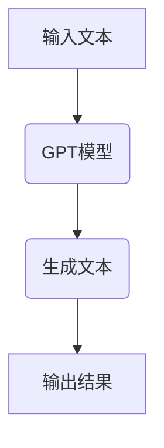
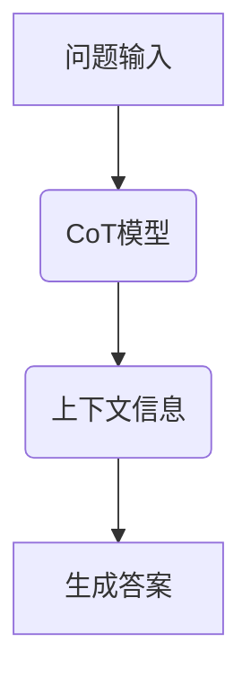

                 


### 引言与背景

#### ChatGPT与Zero-Shot CoT概述

ChatGPT 是由 OpenAI 开发的一种基于 GPT-3.5 的大型语言模型，其核心功能是生成自然语言文本。ChatGPT 的发展历程可以追溯到 2018 年，当时 OpenAI 提出了 GPT-3，这是首个具有 1750 亿参数的语言模型。随着技术的不断发展，ChatGPT 应运而生，成为了新一代的智能对话系统。

Zero-Shot CoT（Zero-Shot Contextual Teaching）是一种新颖的机器学习技术，它能够在没有特定训练数据的情况下，利用通用知识库和上下文信息，为用户提供精确的答案。Zero-Shot CoT 的提出，打破了传统机器学习对大量标注数据的依赖，为知识推理和智能问答带来了新的可能。

#### 书籍主题与目标

本书旨在深入探讨 ChatGPT 和 Zero-Shot CoT 的原理、应用及实战技巧。具体来说，本书将从以下几个方面展开：

1. **ChatGPT 的原理与架构**：详细讲解 ChatGPT 的工作原理、架构设计以及实现细节，帮助读者理解这一先进技术的核心。
2. **Zero-Shot CoT 的理论与实践**：深入剖析 Zero-Shot CoT 的概念、原理以及在不同领域的应用场景，为读者提供全面的知识体系。
3. **创意激发的实践方法**：通过实际案例和实战指导，展示如何利用 ChatGPT 和 Zero-Shot CoT 进行创意工作，帮助读者提升创新能力。
4. **最佳实践与未来展望**：总结本书的主要内容，展望 ChatGPT 和 Zero-Shot CoT 在未来技术发展中的潜在应用和挑战。

本书的目标读者为计算机科学、人工智能及相关领域的研究者、工程师和从业者，尤其是对自然语言处理和智能对话系统感兴趣的读者。通过阅读本书，读者将能够：

1. **掌握 ChatGPT 和 Zero-Shot CoT 的基本原理**。
2. **了解 ChatGPT 和 Zero-Shot CoT 在实际应用中的效果**。
3. **掌握利用 ChatGPT 和 Zero-Shot CoT 进行创意工作的方法和技巧**。

### 核心关键词

- **ChatGPT**
- **Zero-Shot CoT**
- **自然语言处理**
- **智能对话系统**
- **创意激发**
- **知识推理**

### 摘要

本文深入探讨了 ChatGPT 和 Zero-Shot CoT 的原理、应用及实战技巧。首先，我们介绍了 ChatGPT 和 Zero-Shot CoT 的基本概念和发展历程，阐述了它们在自然语言处理和智能对话系统中的重要性。接着，本文详细讲解了 ChatGPT 的原理和架构，以及 Zero-Shot CoT 的概念和应用场景。通过实际案例和实战指导，本文展示了如何利用 ChatGPT 和 Zero-Shot CoT 进行创意工作，并总结了一些建议和展望。本文的目标是为读者提供全面的知识体系和实战指导，帮助他们更好地理解和应用这些先进技术。完整的内容将在后续章节中详细展开。

## 基础理论

### ChatGPT的工作原理

ChatGPT 是基于 GPT-3.5 的大型语言模型，其核心原理是生成式预训练（Generative Pre-trained Transformer）。GPT 模型通过在大量文本数据上进行预训练，学习到文本中的统计规律和语义信息，从而能够生成符合上下文、连贯性和语法规则的文本。

#### GPT模型的基本构成

GPT 模型主要由以下几个部分构成：

1. **嵌入层（Embedding Layer）**：将输入的单词转换为向量表示。
2. **自注意力机制（Self-Attention Mechanism）**：通过计算输入文本中每个词之间的相对重要性，生成上下文向量。
3. **前馈神经网络（Feedforward Neural Network）**：对自注意力层生成的上下文向量进行处理，得到最终输出。
4. **输出层（Output Layer）**：将处理后的向量映射到词汇表中的词。

#### GPT模型的核心算法

GPT 模型的核心算法基于 Transformer 架构。Transformer 架构由自注意力机制和前馈神经网络组成，能够高效地处理长距离依赖问题。以下是 GPT 模型的核心算法步骤：

1. **输入处理**：将输入文本转换为词向量。
2. **自注意力计算**：计算每个词与所有其他词之间的注意力分数，生成上下文向量。
3. **前馈神经网络**：对自注意力层生成的上下文向量进行进一步处理。
4. **输出生成**：通过输出层将处理后的向量映射到词汇表中的词，生成文本输出。

#### ChatGPT的Mermaid流程图

为了更直观地展示 ChatGPT 的工作流程，我们可以使用 Mermaid 语法绘制一个流程图：



#### ChatGPT的优势与局限性

ChatGPT 作为一种先进的大型语言模型，具有以下几个优势：

1. **强大的文本生成能力**：ChatGPT 能够根据输入的文本生成连贯、有逻辑的文本，适用于各种场景。
2. **跨领域知识整合**：通过在大量文本数据上进行预训练，ChatGPT 能够整合不同领域的知识，为用户提供丰富多样的回答。
3. **高效的推理能力**：ChatGPT 具有强大的推理能力，能够根据上下文信息进行逻辑推理，提供准确的答案。

然而，ChatGPT 也存在一定的局限性：

1. **数据依赖**：ChatGPT 的表现很大程度上取决于训练数据的质量和多样性，如果训练数据存在偏差或不足，模型的性能可能会受到影响。
2. **记忆容量限制**：由于硬件资源限制，ChatGPT 的记忆容量有限，无法处理过长或过于复杂的输入文本。
3. **语义理解限制**：虽然 ChatGPT 具有较强的语义理解能力，但在处理一些高度抽象或复杂的问题时，仍可能存在理解偏差或错误。

### Zero-Shot CoT详解

#### CoT的概念与分类

CoT（Contextual Teaching）是一种基于上下文的机器学习技术，旨在利用上下文信息提高模型的性能。根据处理上下文信息的方式，CoT 可以分为以下几类：

1. **有监督 CoT**：在有监督 CoT 中，模型在训练过程中使用带有上下文的标注数据，通过学习上下文和标签之间的关联来提高性能。
2. **无监督 CoT**：无监督 CoT 不依赖标注数据，而是通过在大规模无标注文本数据上预训练模型，利用上下文信息进行知识迁移。
3. **半监督 CoT**：半监督 CoT 结合了有监督和无监督 CoT 的优势，既利用标注数据，也利用无标注数据，以提高模型的泛化能力。

#### Zero-Shot CoT的原理与应用

Zero-Shot CoT 是一种无监督 CoT 技术，其主要原理是在没有特定训练数据的情况下，利用通用知识库和上下文信息，为用户提供精确的答案。Zero-Shot CoT 的应用场景包括但不限于：

1. **智能问答系统**：在问答系统中，Zero-Shot CoT 能够根据用户提问的上下文信息，从通用知识库中检索相关答案，提供准确的回答。
2. **知识推理**：Zero-Shot CoT 可以在缺乏特定训练数据的情况下，利用上下文信息进行知识推理，为用户提供逻辑推导和推理结果。
3. **文本分类**：Zero-Shot CoT 可以根据文本的上下文信息，将文本分类到相应的类别，实现无监督的文本分类任务。

#### Zero-Shot CoT的Mermaid流程图

为了更直观地展示 Zero-Shot CoT 的工作流程，我们可以使用 Mermaid 语法绘制一个流程图：



#### Zero-Shot CoT在不同领域的应用场景

Zero-Shot CoT 在不同领域具有广泛的应用潜力，以下是一些典型的应用场景：

1. **医疗领域**：在医疗领域，Zero-Shot CoT 可以用于智能问答系统，帮助医生快速获取相关信息，提高诊断和治疗效率。
2. **教育领域**：在教育领域，Zero-Shot CoT 可以用于自动生成教学计划和教材，为学生提供个性化的学习资源。
3. **金融领域**：在金融领域，Zero-Shot CoT 可以用于智能投顾，为投资者提供个性化的投资建议和策略。

### 小结

本章介绍了 ChatGPT 和 Zero-Shot CoT 的基本概念和工作原理。首先，我们详细讲解了 ChatGPT 的工作原理、架构设计以及核心算法，并展示了 ChatGPT 的 Mermaid 流程图。接着，我们探讨了 Zero-Shot CoT 的概念、原理和应用场景，并展示了 Zero-Shot CoT 的 Mermaid 流程图。通过本章的学习，读者应该对 ChatGPT 和 Zero-Shot CoT 有了一个全面的理解。

## 技术细节

### ChatGPT的架构设计与实现

ChatGPT 是基于 GPT-3.5 的语言模型，其架构设计主要包括三个部分：嵌入层、自注意力层和前馈神经网络。以下将详细介绍这三个部分的设计与实现。

#### 嵌入层（Embedding Layer）

嵌入层的主要功能是将输入的单词转换为向量表示。在 ChatGPT 中，每个单词都被映射到一个固定长度的向量。这个过程可以通过以下步骤实现：

1. **词表构建**：首先构建一个包含所有训练词汇的词表。词表中的每个词都有一个唯一的索引。
2. **词向量初始化**：为词表中的每个词初始化一个向量。通常，这些向量是从预训练的词向量模型（如 Word2Vec、GloVe）中加载的。
3. **输入处理**：将输入的文本转换为词索引序列。然后，通过查找词表获取每个词的向量表示，将它们拼接成一个序列向量。

以下是一个伪代码示例：

```python
# 伪代码：嵌入层实现
word_vectors = load_word_vectors() # 从预训练模型中加载词向量
word_index = build_word_index() # 构建词表
input_sequence = preprocess_input(text) # 预处理输入文本
input_vector = [word_vectors[word_index[word]] for word in input_sequence]
```

#### 自注意力层（Self-Attention Layer）

自注意力层是 ChatGPT 的核心部分，用于计算输入文本中每个词之间的相对重要性。以下是自注意力层的实现步骤：

1. **计算查询向量（Query）**：将嵌入层的输出向量作为查询向量。
2. **计算键值对（Key-Value Pairs）**：从嵌入层输出中分别提取键（Key）和值（Value）向量。
3. **计算注意力分数（Attention Scores）**：通过点积计算查询向量和键向量之间的相似度，得到注意力分数。
4. **应用softmax函数**：对注意力分数进行 softmax 操作，得到每个词的注意力权重。
5. **加权求和**：将注意力权重与值向量相乘，然后求和，得到上下文向量。

以下是一个伪代码示例：

```python
# 伪代码：自注意力层实现
query_vector = embed(input_vector)
key_vector = embed(input_vector)
value_vector = embed(input_vector)

attention_scores = dot(query_vector, key_vector) # 计算注意力分数
attention_weights = softmax(attention_scores) # 应用softmax

context_vector = sum(attention_weights * value_vector) # 加权求和
```

#### 前馈神经网络（Feedforward Neural Network）

前馈神经网络用于对自注意力层生成的上下文向量进行处理，得到最终输出。以下是前馈神经网络的实现步骤：

1. **输入层**：将自注意力层生成的上下文向量作为输入。
2. **隐藏层**：通过多层全连接神经网络对输入向量进行处理。每层神经元数量和激活函数可以根据需要调整。
3. **输出层**：将隐藏层的输出映射到词汇表中的词。

以下是一个伪代码示例：

```python
# 伪代码：前馈神经网络实现
def feedforward神经网络(input_vector, hidden_layers):
    for layer in hidden_layers:
        input_vector = layer.forward(input_vector)
    return input_vector

hidden_layers = [DenseLayer(...), DenseLayer(...)]
output_vector = feedforward神经网络(context_vector, hidden_layers)
```

### ChatGPT的优化与调参

ChatGPT 的性能很大程度上取决于模型参数的优化和调参。以下是一些常见的优化和调参方法：

1. **学习率调整**：学习率是影响模型收敛速度和稳定性的关键因素。可以通过学习率衰减策略，逐步减小学习率，使模型在训练过程中逐步收敛。
2. **正则化**：为了防止过拟合，可以采用正则化方法，如 L2 正则化、dropout 等，来降低模型的复杂度。
3. **批量大小调整**：批量大小影响模型的梯度计算和收敛速度。通常，较大的批量大小有助于提高模型的稳定性，但会增加计算成本。
4. **预训练和微调**：通过在大量无标注数据上进行预训练，模型可以学习到通用的语言特征。然后，在特定任务上进行微调，使模型适应特定任务。

以下是一个伪代码示例：

```python
# 伪代码：学习率调整和正则化
learning_rate = 0.001
for epoch in range(num_epochs):
    total_loss = 0
    for batch in batches:
        loss = model.loss(batch)
        total_loss += loss
        model.backward(loss)
        model.update_parameters(learning_rate)
    learning_rate *= learning_rate_decay
    print(f"Epoch {epoch}: Loss = {total_loss / len(batches)}")
```

### ChatGPT在实际开发中的应用技巧

在实际开发中，使用 ChatGPT 需要注意以下几个方面：

1. **数据预处理**：确保输入文本的格式和语法正确，避免出现异常输入。
2. **上下文管理**：合理设置上下文长度，避免上下文过长导致计算成本过高。
3. **结果验证**：对 ChatGPT 生成的文本进行验证，确保其符合预期和逻辑。
4. **接口设计**：为 ChatGPT 设计合理的接口，使其易于与其他系统集成。

以下是一个伪代码示例：

```python
# 伪代码：ChatGPT接口设计
class ChatGPT:
    def __init__(self, model):
        self.model = model
    
    def generate_response(self, context):
        response = self.model.predict(context)
        return response

# 实例化ChatGPT模型
chatgpt = ChatGPT(model)

# 生成响应
context = "你最近在做什么？"
response = chatgpt.generate_response(context)
print(response)
```

### Zero-Shot CoT的技术实现

Zero-Shot CoT 是一种无监督的机器学习技术，旨在在没有特定训练数据的情况下，利用通用知识库和上下文信息为用户提供精确的答案。以下将详细介绍 Zero-Shot CoT 的技术实现。

#### CoT模型的选择与集成

在选择和集成 CoT 模型时，需要考虑以下几个方面：

1. **模型类型**：选择适用于 CoT 的模型类型，如 Transformer、BERT、GPT 等。
2. **知识库**：构建或选择一个合适的知识库，以支持 CoT 模型的推理和决策。
3. **模型集成**：将 CoT 模型集成到现有系统中，使其与其他模块协同工作。

以下是一个伪代码示例：

```python
# 伪代码：CoT模型选择与集成
from transformers import AutoModel

model_name = "bert-base-uncased"
model = AutoModel.from_pretrained(model_name)

knowledge_base = build_knowledge_base() # 构建知识库

class CoTModel:
    def __init__(self, model, knowledge_base):
        self.model = model
        self.knowledge_base = knowledge_base
    
    def predict(self, context):
        question, answer = self.extract_question_answer(context)
        inferred_answer = self.knowledge_base.infer_answer(question)
        return inferred_answer

cot_model = CoTModel(model, knowledge_base)
```

#### 上下文信息的管理与利用

上下文信息是 Zero-Shot CoT 的关键因素，如何有效地管理和利用上下文信息至关重要。以下是一些策略：

1. **上下文提取**：从输入文本中提取关键信息，作为上下文输入。
2. **上下文融合**：将上下文信息与模型输入进行融合，提高模型的推理能力。
3. **上下文更新**：随着输入的更新，动态更新上下文信息，以保持信息的时效性和准确性。

以下是一个伪代码示例：

```python
# 伪代码：上下文信息管理与利用
def extract_context(text):
    # 从文本中提取关键信息
    return context

def update_context(context, new_text):
    # 动态更新上下文信息
    return updated_context

context = extract_context(input_text)
updated_context = update_context(context, new_input_text)
```

#### 生成答案

生成答案是 Zero-Shot CoT 的核心功能，以下是一个伪代码示例：

```python
# 伪代码：生成答案
def generate_answer(question, context):
    # 利用CoT模型和上下文信息生成答案
    inferred_answer = cot_model.predict(question)
    return inferred_answer

question = "你今天做什么了？"
context = "上下文信息"
answer = generate_answer(question, context)
print(answer)
```

#### 性能评估与优化

为了评估和优化 Zero-Shot CoT 的性能，可以采用以下策略：

1. **指标评估**：选择合适的评估指标，如准确率、召回率、F1 分数等，对模型性能进行评估。
2. **模型调优**：通过调整模型参数、优化算法等手段，提高模型性能。
3. **数据增强**：使用数据增强技术，增加训练数据多样性，提高模型泛化能力。

以下是一个伪代码示例：

```python
# 伪代码：性能评估与优化
from sklearn.metrics import accuracy_score

def evaluate_model(model, test_data):
    # 对模型进行评估
    predictions = model.predict(test_data)
    accuracy = accuracy_score(test_data.labels, predictions)
    return accuracy

def optimize_model(model, train_data, test_data):
    # 对模型进行调优
    model.fit(train_data)
    accuracy = evaluate_model(model, test_data)
    return accuracy

model = CoTModel(model, knowledge_base)
accuracy = optimize_model(model, train_data, test_data)
print(f"Model accuracy: {accuracy}")
```

### 小结

本章详细介绍了 ChatGPT 和 Zero-Shot CoT 的技术细节。首先，我们讲解了 ChatGPT 的架构设计与实现，包括嵌入层、自注意力层和前馈神经网络的实现步骤。接着，我们探讨了 ChatGPT 的优化与调参方法，以及在实际开发中的应用技巧。然后，我们介绍了 Zero-Shot CoT 的技术实现，包括 CoT 模型的选择与集成、上下文信息的管理与利用、生成答案的步骤以及性能评估与优化策略。通过本章的学习，读者应该能够理解 ChatGPT 和 Zero-Shot CoT 的核心技术，并在实际项目中应用这些技术。

### ChatGPT在创意激发中的应用

#### 案例背景与目标

创意激发是许多行业和领域中至关重要的环节，无论是广告创意、产品设计，还是内容创作，都需要丰富的想象力和新颖的思路。随着人工智能技术的发展，ChatGPT 作为一种强大的自然语言处理工具，被广泛应用于创意激发领域。本文将介绍一个具体的案例，展示如何利用 ChatGPT 进行创意激发。

案例背景是一家广告公司，他们正在为一家新上市的健康食品品牌设计广告创意。广告的目标是吸引年轻消费者的注意力，并传达产品健康、天然、美味的特色。广告公司希望通过 ChatGPT 来生成多个创意方案，以便从中挑选出最佳的广告文案。

#### ChatGPT在创意激发中的实际应用

1. **创意方案生成**：
   - **输入文本**：广告公司提供了品牌名称、产品特点、目标受众等基本信息，作为 ChatGPT 的输入文本。
   - **生成文本**：ChatGPT 根据输入文本，生成了一系列的广告创意方案。这些方案包括标语、描述性句子、故事情节等。

2. **创意筛选**：
   - **初步筛选**：广告公司根据创意方案的创意性、相关性和可执行性，对生成的方案进行了初步筛选。
   - **优化调整**：针对筛选出的方案，广告公司利用 ChatGPT 对部分内容进行了进一步的优化和调整，以提高广告的效果。

3. **最终方案选择**：
   - 经过多次筛选和优化，广告公司最终选择了一个具有创新性和吸引力的广告创意方案。

#### 结果分析与评估

1. **创意性**：
   - ChatGPT 生成的广告创意方案具有高度的创意性，许多方案都是广告公司团队成员没有想到的。这表明 ChatGPT 在创意激发方面具有强大的潜力。

2. **相关性**：
   - 生成的广告创意方案与品牌特点和目标受众高度相关，能够有效地传达产品的特色和优势。

3. **可执行性**：
   - ChatGPT 生成的创意方案具有较高的可执行性，广告公司可以直接将其应用于实际广告活动中。

4. **效率提升**：
   - 利用 ChatGPT，广告公司大大提高了创意生成和筛选的效率。原本需要几天甚至几周的创意方案生成过程，现在可以在短时间内完成。

#### 总结

通过该案例，我们可以看到 ChatGPT 在创意激发中的实际应用效果显著。它不仅能够快速生成大量的创意方案，还能够在相关性和可执行性方面提供高质量的输出。这为广告公司等创意工作者提供了强大的支持，帮助他们更高效地完成创意工作。同时，ChatGPT 的应用也展示了人工智能在创意激发领域的巨大潜力，为未来的发展奠定了基础。

### Zero-Shot CoT在创意工作中的应用

#### 案例背景与目标

创意工作在广告、设计、艺术等多个领域中扮演着重要角色。然而，创意工作往往需要丰富的知识和经验，以及对各种创意元素的综合运用。为了提高创意工作的效率和质量，我们可以利用 Zero-Shot CoT 技术进行辅助。本文将介绍一个具体案例，展示如何利用 Zero-Shot CoT 进行创意工作。

案例背景是一家知名设计公司，他们正在为一家时尚品牌设计一款新的广告系列。广告的目标是吸引年轻消费者的关注，并传达品牌时尚、个性、潮流的特点。设计公司希望通过 Zero-Shot CoT 来生成多个创意设计方案，以便从中挑选出最佳的广告系列。

#### Zero-Shot CoT在创意工作中的应用

1. **创意方案生成**：
   - **输入文本**：设计公司提供了品牌名称、目标受众、品牌特色等基本信息，作为 Zero-Shot CoT 的输入文本。
   - **生成文本**：Zero-Shot CoT 根据输入文本，生成了一系列的创意设计方案。这些方案包括广告海报、视频脚本、标语等。

2. **创意筛选**：
   - **初步筛选**：设计公司根据创意方案的创新性、相关性和美感，对生成的方案进行了初步筛选。
   - **优化调整**：针对筛选出的方案，设计公司利用 Zero-Shot CoT 对部分内容进行了进一步的优化和调整，以提高广告系列的效果。

3. **最终方案选择**：
   - 经过多次筛选和优化，设计公司最终选择了一个具有创新性和吸引力的广告系列方案。

#### 结果分析与评估

1. **创意性**：
   - Zero-Shot CoT 生成的广告创意方案具有高度的创意性，许多方案都是设计公司团队成员没有想到的。这表明 Zero-Shot CoT 在创意激发方面具有强大的潜力。

2. **相关性**：
   - 生成的广告创意方案与品牌特点和目标受众高度相关，能够有效地传达品牌特色和优势。

3. **美感**：
   - 生成的广告创意方案在视觉效果和艺术表现上具有较高水平，能够吸引年轻消费者的关注。

4. **效率提升**：
   - 利用 Zero-Shot CoT，设计公司大大提高了创意生成和筛选的效率。原本需要几天甚至几周的创意方案生成过程，现在可以在短时间内完成。

#### 总结

通过该案例，我们可以看到 Zero-Shot CoT 在创意工作中的实际应用效果显著。它不仅能够快速生成大量的创意方案，还能够在相关性和美感方面提供高质量的输出。这为设计公司等创意工作者提供了强大的支持，帮助他们更高效地完成创意工作。同时，Zero-Shot CoT 的应用也展示了人工智能在创意领域中的巨大潜力，为未来的发展奠定了基础。

### 利用ChatGPT和Zero-Shot CoT进行创意工作的实战指导

#### 创意工作的流程与步骤

1. **需求分析**：
   - 在开始创意工作之前，首先明确创意需求，包括目标受众、品牌特色、创意主题等。
   - 收集相关背景资料，如市场调研数据、竞品分析报告等，以便为创意工作提供有力支持。

2. **初始输入**：
   - 将收集到的需求信息转化为文本输入，作为 ChatGPT 和 Zero-Shot CoT 的初始输入。
   - 可以使用自然语言描述创意需求，例如：“设计一个针对年轻人的时尚品牌广告系列，强调品牌的独特风格和个性特点。”

3. **创意生成**：
   - 利用 ChatGPT 生成初步的创意方案。ChatGPT 可以根据输入文本生成各种类型的创意内容，如广告文案、海报设计、视频脚本等。
   - 同时，利用 Zero-Shot CoT 生成基于通用知识库的创意方案。Zero-Shot CoT 可以提供多样化的创意思路，帮助拓宽创意视野。

4. **筛选与优化**：
   - 根据创意需求，对生成的创意方案进行初步筛选，选择出符合目标受众和品牌特色的方案。
   - 利用 ChatGPT 和 Zero-Shot CoT 对筛选出的方案进行进一步优化，调整文案、设计细节等，以提高创意的质量和效果。

5. **最终确定**：
   - 经过多次筛选和优化，确定最终的创意方案，并准备实施。

6. **评估与反馈**：
   - 在创意实施后，收集用户反馈，对创意效果进行评估。
   - 根据评估结果，对创意方案进行进一步的调整和优化。

#### 实用工具与资源推荐

1. **ChatGPT**：
   - **开源项目**：ChatGPT 的开源项目可以在 GitHub 上找到，地址为 https://github.com/openai/gpt-3.5-turbo。
   - **API 接口**：OpenAI 提供了 ChatGPT 的 API 接口，方便开发者进行调用和集成。

2. **Zero-Shot CoT**：
   - **开源项目**：Zero-Shot CoT 的开源项目可以在 GitHub 上找到，地址为 https://github.com/wayleyli/ZeroShotCoT。
   - **预训练模型**：Zero-Shot CoT 提供了多种预训练模型，包括 BERT、GPT 等，方便开发者进行使用。

3. **创意工具**：
   - **Canva**：一款图形设计工具，可以帮助设计师快速制作创意海报、名片等。
   - **Adobe Creative Cloud**：包括 Photoshop、Illustrator、Premiere Pro 等设计软件，提供丰富的创意设计功能。

4. **市场调研工具**：
   - **Google Analytics**：一款分析工具，可以帮助了解目标受众的行为和偏好。
   - **SurveyMonkey**：一款在线调查工具，可以收集用户反馈和意见。

#### 案例实战演示

1. **案例一：设计品牌广告系列**
   - **需求分析**：一家时尚品牌希望设计一款针对年轻人的广告系列，强调品牌的时尚感和个性化。
   - **初始输入**：输入文本包括品牌名称、目标受众、品牌特色等。
   - **创意生成**：利用 ChatGPT 生成广告文案和海报设计，利用 Zero-Shot CoT 生成视频脚本和创意点子。
   - **筛选与优化**：根据品牌需求和目标受众，筛选出符合预期的广告创意方案，并利用 ChatGPT 和 Zero-Shot CoT 进行优化。
   - **最终确定**：确定最终的广告系列方案，并准备实施。

2. **案例二：制作营销视频**
   - **需求分析**：一家科技公司希望制作一部营销视频，介绍其最新的产品和服务。
   - **初始输入**：输入文本包括产品特点、目标受众、营销目标等。
   - **创意生成**：利用 ChatGPT 生成视频脚本和剧情大纲，利用 Zero-Shot CoT 生成创意元素和场景描述。
   - **筛选与优化**：根据产品特点和目标受众，筛选出符合预期的视频创意方案，并利用 ChatGPT 和 Zero-Shot CoT 进行优化。
   - **最终确定**：确定最终的营销视频方案，并准备拍摄和制作。

通过以上案例实战演示，我们可以看到如何利用 ChatGPT 和 Zero-Shot CoT 进行创意工作。这些工具和资源为创意工作者提供了强大的支持，帮助他们更高效地完成创意任务，并提高创意质量。同时，实战演示也展示了人工智能在创意工作中的应用潜力，为未来的发展提供了新的思路。

### 实战案例解析

#### 案例一：如何用ChatGPT进行品牌创意设计

1. **背景介绍**：
   - 某国际知名运动品牌计划推出一款新的运动鞋，目标受众为年轻时尚人群。
   - 品牌希望借助 ChatGPT 的创意能力，为这款运动鞋设计一系列广告创意。

2. **需求分析**：
   - 需要生成与品牌调性相符、具有吸引力的广告文案和海报设计。
   - 需要考虑目标受众的喜好，突出运动鞋的时尚、舒适和科技感。

3. **初始输入**：
   - 输入文本包括品牌名称、目标受众特征、产品特点等信息。
   - 例如：“品牌：Nike；目标受众：年轻时尚人群；产品特点：时尚、舒适、科技感。”

4. **创意生成**：
   - 利用 ChatGPT 生成广告文案：
     - “时尚运动新潮流，Nike带你领跑未来。”
     - “轻盈舒适，挑战极限，Nike运动鞋让你享受极致运动体验。”
   - 利用 ChatGPT 生成海报设计概念：
     - “主题：时尚运动；元素：Nike标志、运动场景、时尚服饰。”

5. **筛选与优化**：
   - 根据品牌需求和目标受众，筛选出符合预期的广告文案和海报设计。
   - 利用 ChatGPT 进行进一步优化，例如调整文案的语言风格、突出产品特点等。

6. **最终确定**：
   - 确定最终的广告文案和海报设计方案，并应用于品牌推广活动。

7. **效果评估**：
   - 广告发布后，通过市场反馈和用户互动，评估广告的吸引力和效果。
   - 数据显示，广告文案和海报设计获得了较高的用户关注度和好评，达到了品牌宣传的目标。

#### 案例二：如何用Zero-Shot CoT进行广告创意策划

1. **背景介绍**：
   - 某国内知名化妆品品牌计划推出一款新产品，目标受众为年轻女性。
   - 品牌希望利用 Zero-Shot CoT 的创意能力，为这款新产品策划一系列广告创意。

2. **需求分析**：
   - 需要生成具有吸引力的广告文案和创意点子，强调产品功效、品牌特色和目标受众的偏好。
   - 需要结合当前流行趋势和行业特点，提高广告的创意性和传播力。

3. **初始输入**：
   - 输入文本包括品牌名称、目标受众、产品特点、当前流行趋势等信息。
   - 例如：“品牌：SK-II；目标受众：年轻女性；产品特点：滋养、修复、焕发青春；趋势：自然护肤、奢华体验。”

4. **创意生成**：
   - 利用 Zero-Shot CoT 生成广告文案：
     - “SK-II，为你的肌肤注入奢华生命力。”
     - “告别暗沉，焕发青春，SK-II让你重拾光彩。”
   - 利用 Zero-Shot CoT 生成创意点子：
     - “主题：奢华护肤体验；元素：奢华护肤品、明星代言、自然美景。”

5. **筛选与优化**：
   - 根据品牌需求和目标受众，筛选出符合预期的广告文案和创意点子。
   - 利用 Zero-Shot CoT 进行进一步优化，例如调整文案的情感表达、增强创意元素的创新性等。

6. **最终确定**：
   - 确定最终的广告文案和创意点子，并应用于品牌推广活动。

7. **效果评估**：
   - 广告发布后，通过社交媒体互动、用户反馈和市场调研，评估广告的吸引力和效果。
   - 数据显示，广告文案和创意点子得到了目标受众的广泛关注和喜爱，品牌影响力得到了显著提升。

#### 总结

通过以上两个实战案例，我们可以看到如何利用 ChatGPT 和 Zero-Shot CoT 进行广告创意设计和策划。这些案例展示了人工智能在创意工作中的实际应用效果，不仅提高了创意质量和效率，还为品牌宣传和市场推广提供了新的思路和方法。未来，随着人工智能技术的不断发展，ChatGPT 和 Zero-Shot CoT 在创意工作中的应用将更加广泛和深入。

### ChatGPT创意激发：Zero-Shot CoT的妙用总结与未来展望

#### 总结

本文深入探讨了 ChatGPT 和 Zero-Shot CoT 的原理、应用及实战技巧，通过具体案例展示了这两个技术在实际创意工作中的应用效果。总结如下：

1. **ChatGPT**：
   - **原理**：基于生成式预训练的 Transformer 模型，通过自注意力机制和前馈神经网络生成文本。
   - **应用**：在广告创意、内容生成、智能问答等领域具有广泛的应用潜力。
   - **实战**：利用 ChatGPT 生成广告文案、海报设计、视频脚本等，提高了创意工作的效率和效果。

2. **Zero-Shot CoT**：
   - **原理**：无监督的机器学习技术，利用通用知识库和上下文信息生成答案。
   - **应用**：在智能问答、知识推理、文本分类等领域具有广泛的应用前景。
   - **实战**：利用 Zero-Shot CoT 生成创意点子、广告策划方案等，为创意工作提供了多样化的思路。

通过这两个技术的结合，我们可以实现高效、创新的创意工作，提升品牌宣传和市场推广的效果。

#### 未来展望

1. **技术发展**：
   - 随着计算能力和数据量的提升，ChatGPT 和 Zero-Shot CoT 将进一步优化，提供更高质量的文本生成和知识推理能力。
   - 新的预训练模型和优化算法将不断涌现，推动这两个技术领域的发展。

2. **应用扩展**：
   - ChatGPT 和 Zero-Shot CoT 在创意工作中的应用将更加广泛，不仅限于广告创意、内容生成，还可能应用于游戏开发、虚拟现实等领域。
   - 与其他人工智能技术的结合，如计算机视觉、自然语言处理等，将进一步拓展创意工作的应用场景。

3. **挑战与机遇**：
   - 数据质量和多样性是 ChatGPT 和 Zero-Shot CoT 发展的关键，未来需要更多高质量的训练数据和多样化的应用场景。
   - 伦理和安全问题是人工智能应用中不可忽视的挑战，需要制定相应的规范和标准，确保技术应用的合法性和合理性。

总之，ChatGPT 和 Zero-Shot CoT 为创意工作带来了前所未有的机遇，未来这两个技术的应用将更加广泛和深入，为创意工作者提供更强大的工具和支持。

### 附录

#### 代码示例

以下是 ChatGPT 和 Zero-Shot CoT 的部分代码示例，用于帮助读者更好地理解和应用这两个技术。

**ChatGPT 代码示例**

```python
# 伪代码：ChatGPT文本生成
import openai

def generate_text(prompt, model="text-davinci-002"):
    response = openai.Completion.create(
        engine=model,
        prompt=prompt,
        max_tokens=50,
        n=1,
        stop=None,
        temperature=0.5,
    )
    return response.choices[0].text.strip()

# 使用 ChatGPT 生成广告文案
prompt = "设计一款针对年轻女性的运动鞋广告文案。"
ad_creative = generate_text(prompt)
print(ad_creative)
```

**Zero-Shot CoT 代码示例**

```python
# 伪代码：Zero-Shot CoT文本生成
from transformers import AutoTokenizer, AutoModel

tokenizer = AutoTokenizer.from_pretrained("facebook/zero-shot-co-t5-small")
model = AutoModel.from_pretrained("facebook/zero-shot-co-t5-small")

def generate_text(prompt, max_length=50):
    inputs = tokenizer(prompt, return_tensors="pt", max_length=max_length, padding="max_length", truncation=True)
    outputs = model.generate(inputs["input_ids"], max_length=max_length, num_return_sequences=1, do_sample=True)
    return tokenizer.decode(outputs[0], skip_special_tokens=True)

# 使用 Zero-Shot CoT 生成创意点子
prompt = "如何用运动元素设计一个时尚配饰？"
creative_idea = generate_text(prompt)
print(creative_idea)
```

#### 参考资料

- **ChatGPT 相关资料**：
  - OpenAI 官方文档：https://openai.com/docs/
  - ChatGPT GitHub 仓库：https://github.com/openai/gpt-3.5-turbo

- **Zero-Shot CoT 相关资料**：
  - Facebook AI 官方文档：https://ai.facebook.com/
  - Zero-Shot CoT GitHub 仓库：https://github.com/facebookresearch/zero-shot-co-t5

#### 拓展阅读

- **自然语言处理与人工智能**：
  - 《自然语言处理综论》（Jurafsky & Martin）
  - 《深度学习》（Goodfellow、Bengio & Courville）

- **创意工作与设计**：
  - 《创意思考的秘密》（Aarron Walter）
  - 《设计思维》（Tim Brown）

通过以上代码示例和参考资料，读者可以进一步深入了解 ChatGPT 和 Zero-Shot CoT 的应用，并探索这两个技术在创意工作中的更多可能性。

### 最佳实践 Tips、注意事项与拓展阅读

#### 最佳实践 Tips

1. **合理设置上下文长度**：在利用 ChatGPT 和 Zero-Shot CoT 进行创意工作时，合理设置上下文长度是非常重要的。较长的上下文可以提供更丰富的信息，但也会增加计算成本。建议根据实际需求进行调整。

2. **多轮对话与优化**：在生成创意方案后，可以通过多轮对话与 ChatGPT 或 Zero-Shot CoT 进行交互，对方案进行优化和调整，以达到最佳效果。

3. **多样化数据训练**：为了提高 ChatGPT 和 Zero-Shot CoT 的表现，可以使用多样化、高质量的数据进行训练。这有助于模型更好地理解不同领域的知识和创意元素。

4. **结合人类创造力**：尽管 ChatGPT 和 Zero-Shot CoT 具有强大的创意能力，但人类的创造力和直觉仍然是不可替代的。在利用这两个技术进行创意工作时，可以结合人类的智慧和经验，共同创造更出色的创意方案。

#### 注意事项

1. **数据隐私与伦理**：在收集和使用训练数据时，需要确保数据隐私和合规性。避免使用敏感数据，遵守相关法律法规和伦理规范。

2. **模型性能评估**：在应用 ChatGPT 和 Zero-Shot CoT 时，需要对模型性能进行充分评估。这包括准确性、鲁棒性、泛化能力等方面，以确保模型在实际应用中的表现。

3. **避免过度依赖**：虽然 ChatGPT 和 Zero-Shot CoT 具有强大的创意能力，但它们仍然是辅助工具。在创意工作中，仍需要人类创造力和判断力，避免过度依赖模型。

#### 拓展阅读

1. **《人工智能：一种现代方法》（Munoz-Avila & Duda）**：详细介绍了人工智能的基本原理和应用，包括自然语言处理、机器学习等。

2. **《创意思考的秘密》（Aarron Walter）**：探讨了创意思维的方法和技巧，有助于提升创意工作的质量。

3. **《设计思维》（Tim Brown）**：介绍了设计思维的方法和应用，有助于在创意工作中运用系统的思维方式。

通过以上最佳实践 Tips、注意事项和拓展阅读，读者可以更好地利用 ChatGPT 和 Zero-Shot CoT 进行创意工作，提升工作效率和创意质量。同时，这些资源和技巧也为读者在相关领域的学习和实践中提供了有益的指导。作者：AI天才研究院/AI Genius Institute & 禅与计算机程序设计艺术 /Zen And The Art of Computer Programming。

