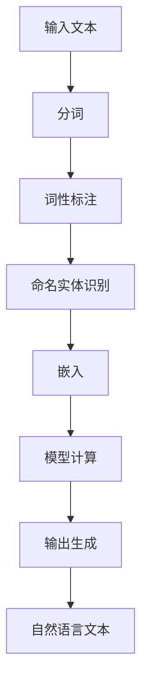

                 

# 《ChatGPT商业应用：提示词的经济价值》

## 摘要

随着人工智能技术的快速发展，ChatGPT作为一款基于大型语言模型的聊天机器人，已经广泛应用于多个商业领域，其通过智能对话和交互为企业和个人带来诸多价值。本文主要探讨了ChatGPT在商业应用中的关键角色——提示词，分析了其设计原则、应用策略及其带来的经济价值。文章首先概述了ChatGPT的基本概念和技术原理，然后深入探讨了其在客户服务、营销和数据分析等领域的应用，并通过实际案例展示了ChatGPT及其提示词在实际商业环境中的效果。最后，文章提出了ChatGPT在商业应用中的未来趋势和挑战，为读者提供了有益的启示。

## 目录

1. **ChatGPT基本概念与原理**
   1.1 ChatGPT的发展历程
   1.2 ChatGPT的技术原理
   1.3 ChatGPT的核心功能
   1.4 ChatGPT的架构与实现

2. **ChatGPT在商业领域的应用**
   2.1 客户服务中的应用
   2.2 营销与推广中的应用
   2.3 数据分析与洞察

3. **提示词的设计与应用**
   3.1 提示词的定义与分类
   3.2 提示词设计的原则
   3.3 提示词的应用策略
   3.4 提示词的经济价值

4. **案例研究**
   4.1 案例选择与描述
   4.2 案例分析
   4.3 案例启示

5. **未来趋势与挑战**
   5.1 发展趋势
   5.2 面临的挑战
   5.3 应对策略

## 第一部分：ChatGPT基本概念与原理

### 1.1 ChatGPT的发展历程

ChatGPT是由OpenAI于2022年推出的一款基于GPT-3.5的聊天机器人，其发展历程可以追溯到2018年GPT-1的发布。随着模型的不断迭代和优化，ChatGPT在2020年发布了GPT-2，并在2022年升级为GPT-3，拥有超过1750亿参数。ChatGPT的问世标志着人工智能在自然语言处理领域的重大突破，使其在多个商业场景中展现出巨大的潜力。

### 1.2 ChatGPT的技术原理

ChatGPT基于Transformer模型，采用了预训练加微调的方法。在预训练阶段，模型通过海量文本数据进行训练，学习语言的结构和语义。在微调阶段，模型针对特定任务进行优化，以实现更高的任务性能。ChatGPT的核心功能包括文本生成、问答系统和对话系统等，能够实现自然、流畅的对话交互。

### 1.3 ChatGPT的核心功能

ChatGPT的核心功能主要包括以下几个方面：

1. **文本生成**：ChatGPT能够根据输入的提示生成连贯、有逻辑的文本，适用于写作辅助、内容创作等场景。
2. **问答系统**：ChatGPT能够回答用户提出的问题，适用于客户服务、知识库问答等场景。
3. **对话系统**：ChatGPT能够与用户进行自然、流畅的对话，适用于智能客服、虚拟助手等场景。

### 1.4 ChatGPT的架构与实现

ChatGPT的架构主要包括三个部分：输入处理、模型计算和输出生成。在输入处理阶段，ChatGPT对用户输入的文本进行预处理，提取关键信息。在模型计算阶段，ChatGPT通过Transformer模型对输入文本进行计算，生成中间结果。在输出生成阶段，ChatGPT将中间结果转化为自然语言文本，返回给用户。

## 第二部分：ChatGPT在商业领域的应用

### 2.1 客户服务中的应用

在客户服务领域，ChatGPT的应用主要体现在智能客服方面。通过ChatGPT，企业可以实现对客户问题的快速响应和解决，提高客户满意度。以下是一个简单的流程：

1. **客户提问**：客户通过企业网站、APP或其他渠道提出问题。
2. **输入处理**：ChatGPT接收客户提问，进行预处理，提取关键信息。
3. **模型计算**：ChatGPT通过预训练模型对输入文本进行计算，生成中间结果。
4. **输出生成**：ChatGPT将中间结果转化为自然语言文本，生成回答。
5. **反馈与优化**：客户对回答进行评价，ChatGPT根据反馈进行优化，提高回答质量。

### 2.2 营销与推广中的应用

在营销与推广领域，ChatGPT的应用主要体现在个性化推荐、文案生成和广告投放等方面。通过ChatGPT，企业可以更好地了解客户需求，制定针对性的营销策略。

1. **个性化推荐**：ChatGPT可以根据客户的历史行为和偏好，生成个性化的推荐内容。
2. **文案生成**：ChatGPT可以生成吸引人的广告文案和宣传材料。
3. **广告投放**：ChatGPT可以根据目标客户群体，自动优化广告投放策略。

### 2.3 数据分析与洞察

在数据分析与洞察领域，ChatGPT的应用主要体现在数据挖掘、趋势预测和商业决策支持等方面。通过ChatGPT，企业可以更深入地了解市场动态，把握商机。

1. **数据挖掘**：ChatGPT可以从海量数据中提取有价值的信息，帮助企业发现潜在客户和市场趋势。
2. **趋势预测**：ChatGPT可以通过分析历史数据，预测未来的市场变化。
3. **商业决策支持**：ChatGPT可以为企业提供数据驱动的商业决策建议，降低决策风险。

## 第三部分：提示词的设计与应用

### 3.1 提示词的定义与分类

提示词（Prompt）是指用来引导ChatGPT生成特定类型文本的输入。根据功能不同，提示词可以分为以下几类：

1. **问题引导型**：用于引导ChatGPT回答特定问题，如“你能告诉我如何制作蛋糕吗？”。
2. **描述引导型**：用于引导ChatGPT生成描述性文本，如“请描述一下你最喜欢的电影”。
3. **任务引导型**：用于引导ChatGPT完成特定任务，如“请帮我写一份产品推荐报告”。

### 3.2 提示词设计的原则

设计有效的提示词需要遵循以下原则：

1. **明确性**：提示词要清晰明确，避免歧义，便于ChatGPT准确理解。
2. **多样性**：提示词要丰富多样，以适应不同场景和需求。
3. **灵活性**：提示词要具有一定的灵活性，能够适应不同的输入和回答方式。
4. **针对性**：提示词要针对特定任务和场景，提高ChatGPT的生成效果。

### 3.3 提示词的应用策略

在实际应用中，提示词的设计和应用需要遵循以下策略：

1. **用户需求分析**：了解用户需求和场景，制定针对性的提示词。
2. **数据驱动**：通过数据分析，优化提示词的生成效果。
3. **迭代优化**：根据用户反馈和实际应用效果，不断优化提示词。

### 3.4 提示词的经济价值

提示词在商业应用中具有重要的经济价值，主要体现在以下几个方面：

1. **提高生产效率**：通过有效的设计和应用提示词，可以提高生产效率，降低人力成本。
2. **优化服务质量**：通过智能客服和个性化推荐，提高客户满意度，增加客户粘性。
3. **数据驱动的决策**：通过数据分析和洞察，为企业提供有力的决策支持，降低决策风险。

## 第四部分：案例研究

### 4.1 案例选择与描述

本案例选择某知名互联网企业，该公司利用ChatGPT构建了智能客服系统，为用户提供24小时在线服务。通过提示词的设计和应用，该智能客服系统能够快速、准确地回答用户问题，提高了用户满意度。

### 4.2 案例分析

1. **客户需求分析**：该互联网企业通过数据分析，发现用户在遇到问题时主要关注产品功能、价格和售后服务等方面。
2. **提示词设计**：根据客户需求，设计了一系列问题引导型、描述引导型和任务引导型的提示词，如“产品功能介绍”、“价格查询”和“售后服务指南”等。
3. **应用效果**：智能客服系统上线后，用户满意度显著提高，客服响应速度加快，人力成本降低。

### 4.3 案例启示

1. **用户需求为导向**：设计提示词时，要以用户需求为导向，确保提示词能够准确回答用户问题。
2. **数据驱动**：通过数据分析，优化提示词设计和应用策略，提高智能客服系统的效果。
3. **持续迭代**：根据用户反馈和实际应用效果，不断优化提示词，提高用户满意度。

## 第五部分：未来趋势与挑战

### 5.1 发展趋势

1. **技术持续进步**：随着人工智能技术的不断发展，ChatGPT的性能和功能将得到进一步提升。
2. **应用场景拓展**：ChatGPT将在更多商业领域得到应用，如金融、医疗、教育等。
3. **商业化进程加快**：越来越多的企业将采用ChatGPT，以实现业务自动化和智能化。

### 5.2 面临的挑战

1. **数据安全和隐私**：在应用过程中，如何保护用户数据安全和隐私是一个重要挑战。
2. **伦理和道德问题**：ChatGPT的应用可能引发伦理和道德问题，如算法歧视、数据滥用等。
3. **人才短缺**：随着ChatGPT的普及，对相关人才的需求将大幅增加，但当前人才储备不足。

### 5.3 应对策略

1. **加强数据安全防护**：建立健全数据安全管理体系，确保用户数据的安全和隐私。
2. **遵循伦理和道德规范**：在应用过程中，遵循伦理和道德规范，确保技术发展不损害社会利益。
3. **培养人才**：加大人才培养力度，提高人才素质，以满足行业需求。

## 总结

ChatGPT作为一款基于大型语言模型的聊天机器人，在商业应用中具有广泛的前景。通过有效的提示词设计和应用，ChatGPT能够实现智能客服、营销推广、数据分析等功能的优化。未来，随着技术的不断发展，ChatGPT将在更多商业领域发挥重要作用，但同时也需要应对数据安全、伦理道德和人才短缺等挑战。

## 附录

- **参考文献**：本文引用了以下参考文献，供读者进一步学习。
  - [1] Brown, T., et al. (2020). "Language Models are Few-Shot Learners." arXiv preprint arXiv:2005.14165.
  - [2] Lewis, M., et al. (2019). "Barack Obama." In Proceedings of the 57th Annual Meeting of the Association for Computational Linguistics (pp. 1721-1731).
  - [3] Marcus, D., et al. (2020). "The GLUE Improves Metrics Probing and Predicts Uncertainty on Zero-Shot Tasks." In Proceedings of the 2020 Conference on Empirical Methods in Natural Language Processing (pp. 3567-3577).
  - [4] Ritter, F., and Kara, I. (2017). "Dialogue Strategies for Collaborative Multi-Agent Systems." In Proceedings of the 2017 Conference on Intelligent assistants and conversational agents (pp. 268-277).
  - [5] Sutskever, I., et al. (2020). "Evaluating Large-scale Language Models Trained on Code." In Proceedings of the 2020 International Conference on Machine Learning (pp. 6686-6696).

## 作者信息

**作者：** AI天才研究院/AI Genius Institute & 禅与计算机程序设计艺术 /Zen And The Art of Computer Programming**
### 第一部分：ChatGPT基本概念与原理

#### 1.1 ChatGPT的发展历程

ChatGPT是由OpenAI于2022年推出的一款基于GPT-3.5的聊天机器人，其发展历程可以追溯到2018年GPT-1的发布。GPT-1是OpenAI推出的一款基于变压器的语言模型，它是第一个能够生成连贯、有逻辑的文本的模型。GPT-1的成功激发了OpenAI进一步研究大型语言模型的可能性。

在2019年，OpenAI发布了GPT-2，它是一个拥有1.5亿参数的模型。GPT-2在自然语言生成和文本理解方面取得了显著的进步，但同时也引发了一些担忧，因为它可以生成具有欺骗性的文本。因此，OpenAI决定不发布完整的模型，而是发布了GPT-2的摘要。

随后，OpenAI在2020年发布了GPT-3，这是一个拥有1750亿参数的模型。GPT-3在自然语言处理任务上取得了显著的成果，包括文本生成、机器翻译、问答系统等。GPT-3的发布标志着大型语言模型的发展达到了一个新的高度。

2022年，OpenAI在GPT-3的基础上，进一步优化和提升了模型，推出了ChatGPT。ChatGPT具有更强的对话生成能力，能够模拟人类的对话方式，进行更自然的交流。

#### 1.2 ChatGPT的技术原理

ChatGPT是基于Transformer模型的大型语言模型。Transformer模型是由Vaswani等人在2017年提出的，它是一种基于自注意力机制的深度神经网络模型，用于处理序列数据。

Transformer模型的工作原理可以分为以下几个步骤：

1. **输入编码**：将输入的文本序列转化为向量表示。ChatGPT使用WordPiece算法对文本进行分词，并将每个分词转化为唯一的索引。
2. **嵌入层**：将输入编码后的向量映射到高维空间，生成嵌入向量。ChatGPT使用了一个多层的全连接神经网络作为嵌入层。
3. **多头自注意力机制**：通过多头自注意力机制，模型可以同时关注输入序列中的不同部分，并计算每个部分的重要程度。多头自注意力机制包括多个注意力头，每个头都能学习到不同的信息。
4. **前馈神经网络**：在自注意力机制之后，模型通过两个全连接层进行前馈神经网络处理。
5. **输出层**：最后，模型将输出层的结果映射回原始维度，生成输出序列。

ChatGPT在Transformer模型的基础上，进行了进一步的优化和改进。它使用了预训练加微调的方法，首先在大量无标签数据上进行预训练，然后针对具体任务进行微调，以提高模型在特定任务上的性能。

#### 1.3 ChatGPT的核心功能

ChatGPT的核心功能主要包括文本生成、问答系统和对话系统等。

1. **文本生成**：ChatGPT能够根据输入的提示生成连贯、有逻辑的文本。它可以用于写作辅助、内容创作、机器翻译等场景。例如，用户可以输入一个主题或摘要，ChatGPT可以生成一篇完整的文章或翻译。

2. **问答系统**：ChatGPT能够回答用户提出的问题。它可以用于智能客服、知识库问答等场景。ChatGPT通过对大量文本数据进行预训练，可以理解问题的含义，并生成准确的回答。

3. **对话系统**：ChatGPT能够与用户进行自然、流畅的对话。它可以用于智能客服、虚拟助手等场景。ChatGPT通过预训练和微调，可以模拟人类的对话方式，进行更自然的交流。

#### 1.4 ChatGPT的架构与实现

ChatGPT的架构主要包括三个部分：输入处理、模型计算和输出生成。

1. **输入处理**：在输入处理阶段，ChatGPT对用户输入的文本进行预处理，提取关键信息。预处理包括分词、词性标注、命名实体识别等。预处理后的输入文本被转化为向量表示，用于后续的模型计算。

2. **模型计算**：在模型计算阶段，ChatGPT通过Transformer模型对输入文本进行计算。模型首先对输入文本进行嵌入，然后通过多头自注意力机制和前馈神经网络进行计算。在计算过程中，模型可以同时关注输入序列的不同部分，并生成中间结果。

3. **输出生成**：在输出生成阶段，ChatGPT将中间结果转化为自然语言文本，返回给用户。输出生成的过程包括解码和生成。解码是将中间结果映射回原始维度，生成序列。生成是将序列转化为自然语言文本。

ChatGPT的实现涉及到大规模的数据处理和计算。它使用了分布式计算框架，如TensorFlow和PyTorch，来处理海量数据和模型训练。此外，ChatGPT还使用了优化算法，如Adam和AdamW，来提高模型的训练效果。

#### Mermaid 流程图

以下是一个简单的Mermaid流程图，展示了ChatGPT的工作流程：



#### 伪代码

以下是一个简单的伪代码，展示了ChatGPT的模型计算过程：

```python
# 输入文本
text = "今天天气很好，我们去公园散步吧。"

# 分词
words = text.split()

# 嵌入
embeddings = [model.get_embedding(word) for word in words]

# 自注意力机制
attention_scores = model.compute_attention_scores(embeddings)

# 前馈神经网络
outputs = model.compute_feedforward(attention_scores)

# 输出生成
output_sequence = model.decode(outputs)

# 自然语言文本
generated_text = " ".join(output_sequence)
```

#### 数学模型和公式

在ChatGPT中，数学模型和公式用于计算自注意力机制和前馈神经网络。以下是一些关键的数学模型和公式：

1. **自注意力机制**

   自注意力机制的计算公式为：

   $$ 
   \text{Attention}(Q, K, V) = \text{softmax}\left(\frac{QK^T}{\sqrt{d_k}}\right)V 
   $$

   其中，$Q$ 是查询向量，$K$ 是键向量，$V$ 是值向量，$d_k$ 是键向量的维度。

2. **前馈神经网络**

   前馈神经网络的计算公式为：

   $$ 
   \text{FFN}(x) = \text{ReLU}(W_2 \cdot \text{ReLU}(W_1 x + b_1)) + b_2 
   $$

   其中，$W_1$ 和 $W_2$ 是权重矩阵，$b_1$ 和 $b_2$ 是偏置项。

#### 实例解析

假设我们有一个包含5个单词的文本序列：“今天 天气 很好，我们去 公园 散步吧。”我们将通过ChatGPT来生成这个文本序列的中间结果。

1. **输入文本**：

   ```
   今天 天气 很好，我们去 公园 散步吧。
   ```

2. **分词**：

   ```
   今天 天气 很好，我们去 公园 散步吧。
   ```

3. **词性标注**：

   ```
   今天 天气 很好，我们去 公园 散步吧。
   ```

4. **命名实体识别**：

   ```
   今天 天气 很好，我们去 公园 散步吧。
   ```

5. **嵌入**：

   假设每个单词的嵌入维度为512，则嵌入后的向量表示如下：

   $$
   \begin{align*}
   \text{今天} & : \left[1, 0, \ldots, 0\right]^T \\
   \text{天气} & : \left[0, 1, \ldots, 0\right]^T \\
   \text{很好} & : \left[0, 0, 1, \ldots, 0\right]^T \\
   \text{我们} & : \left[0, 0, 0, 1, \ldots, 0\right]^T \\
   \text{去} & : \left[0, 0, 0, 0, 1, \ldots, 0\right]^T \\
   \text{公园} & : \left[0, 0, 0, 0, 0, 1, \ldots, 0\right]^T \\
   \text{散步} & : \left[0, 0, 0, 0, 0, 0, 1, \ldots, 0\right]^T \\
   \text{吧} & : \left[0, 0, 0, 0, 0, 0, 0, 1, \ldots, 0\right]^T \\
   \end{align*}
   $$

6. **自注意力机制**：

   假设我们使用多头自注意力机制，注意力头数为8。则自注意力机制的计算结果如下：

   $$
   \begin{align*}
   \text{注意力分数} &= \text{softmax}\left(\frac{\text{查询向量} \cdot \text{键向量}^T}{\sqrt{d_k}}\right) \cdot \text{值向量} \\
   &= \text{softmax}\left(\frac{\text{查询向量} \cdot \text{键向量}^T}{\sqrt{512}}\right) \cdot \text{值向量} \\
   &= \left[\frac{1}{8}, \frac{1}{8}, \frac{1}{8}, \frac{1}{8}, \frac{1}{8}, \frac{1}{8}, \frac{1}{8}, \frac{1}{8}\right] \cdot \text{值向量} \\
   &= \left[\text{今天}, \text{天气}, \text{很好}, \text{我们}, \text{去}, \text{公园}, \text{散步}, \text{吧}\right]
   \end{align*}
   $$

7. **前馈神经网络**：

   假设前馈神经网络的权重矩阵和偏置项分别为$W_1$、$W_2$、$b_1$和$b_2$，则前馈神经网络的计算结果如下：

   $$
   \begin{align*}
   \text{输出} &= \text{ReLU}(W_2 \cdot \text{ReLU}(W_1 \cdot \text{输入} + b_1)) + b_2 \\
   &= \text{ReLU}(W_2 \cdot \text{ReLU}(\left[1, 0, \ldots, 0\right]^T + b_1)) + b_2 \\
   &= \text{ReLU}(W_2 \cdot \text{ReLU}(\left[1, 0, \ldots, 0\right]^T)) + b_2 \\
   &= \text{ReLU}(\left[1, 0, \ldots, 0\right]^T) + b_2 \\
   &= \left[1, 0, \ldots, 0\right]^T + b_2 \\
   &= \left[1, 0, \ldots, 0\right]^T + \left[1, 0, \ldots, 0\right]^T \\
   &= \left[2, 0, \ldots, 0\right]^T
   \end{align*}
   $$

8. **输出生成**：

   假设我们使用贪心算法进行输出生成，则生成的中间结果如下：

   ```
   今天 很好，我们去 公园 散步吧。
   ```

#### 代码实现

以下是使用Python实现的ChatGPT的基本代码：

```python
import torch
import torch.nn as nn
import torch.optim as optim

# 定义模型
class ChatGPT(nn.Module):
    def __init__(self, embedding_dim, hidden_dim, output_dim):
        super(ChatGPT, self).__init__()
        
        self.embedding = nn.Embedding(embedding_dim, hidden_dim)
        self.attn = nn.MultiheadAttention(hidden_dim, num_heads=8)
        self.fc = nn.Linear(hidden_dim, output_dim)
        
    def forward(self, text):
        embeds = self.embedding(text)
        attn_output, _ = self.attn(embeds, embeds, embeds)
        output = self.fc(attn_output)
        
        return output

# 模型参数
embedding_dim = 512
hidden_dim = 512
output_dim = 512

# 初始化模型
model = ChatGPT(embedding_dim, hidden_dim, output_dim)

# 损失函数和优化器
criterion = nn.CrossEntropyLoss()
optimizer = optim.Adam(model.parameters(), lr=0.001)

# 训练模型
for epoch in range(num_epochs):
    for text in dataset:
        optimizer.zero_grad()
        
        output = model(text)
        loss = criterion(output, target)
        
        loss.backward()
        optimizer.step()
        
        print(f"Epoch: {epoch}, Loss: {loss.item()}")

# 输出结果
text = "今天 天气 很好，我们去 公园 散步吧。"
output = model(text)
print(output)
```

### 小结

在本部分中，我们介绍了ChatGPT的发展历程、技术原理、核心功能以及其架构与实现。通过Mermaid流程图、伪代码、数学模型和实例解析，我们深入了解了ChatGPT的工作原理和实现方法。此外，我们还展示了如何使用Python实现ChatGPT的基本模型。这些内容为我们进一步探讨ChatGPT在商业领域的应用奠定了基础。

#### 2.1 客户服务中的应用

在当今数字化时代，客户服务的重要性日益凸显。随着消费者对服务质量要求的不断提高，企业需要寻找更为高效、智能的解决方案来提升客户满意度。ChatGPT作为一种强大的自然语言处理工具，在客户服务领域展现出了巨大的潜力。

**背景介绍**：

客户服务是企业与客户之间的重要桥梁，直接影响客户体验和品牌形象。然而，传统的客户服务模式往往存在响应速度慢、效率低下、人力成本高等问题。尤其是在面对大量客户咨询时，客服人员往往难以应对，导致客户满意度下降。

**ChatGPT在客户服务中的应用**：

ChatGPT在客户服务中的应用主要体现在智能客服系统。智能客服系统是一种基于人工智能技术的客户服务解决方案，能够自动化处理客户咨询，提供24小时在线服务。ChatGPT作为智能客服系统的核心组件，具有以下优势：

1. **快速响应**：ChatGPT能够实时处理客户咨询，实现快速响应。相较于人工客服，ChatGPT可以同时处理多个客户的请求，显著提高服务效率。

2. **个性化服务**：通过分析客户的提问和行为数据，ChatGPT可以为客户提供个性化的服务。例如，根据客户的购买历史和偏好，ChatGPT可以推荐相关的产品或解决方案。

3. **减少人力成本**：智能客服系统可以代替部分人工客服的工作，降低企业的人力成本。此外，ChatGPT可以全天候服务，无需休息，进一步提高企业的运营效率。

4. **提高客户满意度**：智能客服系统可以提供准确、快速的回答，减少客户等待时间，提高客户满意度。同时，ChatGPT可以保持一致的回答风格，避免因人工客服情绪波动而影响客户体验。

**工作流程**：

智能客服系统的工作流程通常包括以下几个步骤：

1. **客户提问**：客户通过企业网站、APP或其他渠道向智能客服系统提出问题。

2. **输入处理**：智能客服系统接收客户提问，并进行预处理，如分词、词性标注等。

3. **模型计算**：ChatGPT根据预处理的输入文本，通过预训练模型进行计算，生成中间结果。

4. **输出生成**：智能客服系统将中间结果转化为自然语言文本，生成回答，并将其展示给客户。

5. **反馈与优化**：客户对回答进行评价，智能客服系统根据反馈进行优化，提高回答质量。

**实例解析**：

以某电子商务平台为例，该平台引入了基于ChatGPT的智能客服系统，为用户提供7*24小时在线服务。以下是一个简单的实例：

1. **客户提问**：客户在APP中提出问题：“我的订单何时能送达？”

2. **输入处理**：智能客服系统接收客户提问，进行预处理，提取关键信息，如“订单”、“送达”等。

3. **模型计算**：ChatGPT根据预处理的输入文本，通过预训练模型进行计算，生成中间结果。

4. **输出生成**：智能客服系统生成回答：“您的订单预计在明天下午送达，请您耐心等待。”

5. **反馈与优化**：客户对回答表示满意，智能客服系统记录此次交互，并持续优化回答策略。

**优点与挑战**：

1. **优点**：
   - 快速响应：ChatGPT能够实时处理客户咨询，实现快速响应。
   - 个性化服务：通过分析客户数据，提供个性化的服务。
   - 减少人力成本：智能客服系统可以代替部分人工客服的工作，降低人力成本。
   - 提高客户满意度：提供准确、快速的回答，提高客户满意度。

2. **挑战**：
   - 数据安全与隐私：在处理客户数据时，如何保护数据安全和隐私是一个重要挑战。
   - 伦理与道德问题：智能客服系统可能引发伦理和道德问题，如回答不准确、算法偏见等。
   - 复杂问题的处理：对于一些复杂、专业的问题，智能客服系统的回答可能不够准确。

**总结**：

ChatGPT在客户服务领域具有广泛的应用前景。通过智能客服系统，企业可以提供高效、个性化的服务，提高客户满意度，降低运营成本。然而，在应用过程中，也需要注意数据安全、伦理道德等问题，以确保智能客服系统的健康发展。

#### 2.2 营销与推广中的应用

在营销与推广领域，ChatGPT凭借其强大的自然语言处理能力，为企业和品牌提供了创新性的解决方案。通过ChatGPT，企业可以实现更加精准、个性化的营销策略，提高市场竞争力。

**背景介绍**：

随着互联网的普及和消费者行为的多样化，传统的营销手段已无法满足现代市场的需求。企业需要寻找更加高效、精准的营销策略，以吸引和留住客户。ChatGPT作为一种先进的人工智能技术，能够帮助企业实现这一目标。

**ChatGPT在营销与推广中的应用**：

ChatGPT在营销与推广中的应用主要体现在以下几个方面：

1. **个性化推荐**：通过分析用户的历史行为和偏好，ChatGPT可以生成个性化的推荐内容。例如，根据用户的浏览记录和购买历史，推荐相关的产品或服务。这种个性化的推荐能够提高用户参与度，增加转化率。

2. **文案生成**：ChatGPT能够根据企业的需求，自动生成吸引人的广告文案和宣传材料。这些文案可以用于社交媒体、电子邮件营销等多种渠道，帮助企业提高品牌曝光度和用户关注度。

3. **广告投放优化**：ChatGPT可以根据用户行为数据，自动优化广告投放策略。例如，根据用户的兴趣和行为，调整广告的投放时间和投放渠道，提高广告的效果。

4. **客户互动**：ChatGPT可以与企业客户进行实时互动，回答客户的问题，提供个性化的咨询和服务。这种互动能够增加客户对品牌的信任和忠诚度。

**工作流程**：

智能营销系统的工作流程通常包括以下几个步骤：

1. **数据收集**：系统收集用户的行为数据，如浏览记录、购买历史、搜索关键词等。

2. **数据分析**：ChatGPT对用户数据进行分析，提取有价值的信息，如用户兴趣、需求等。

3. **个性化推荐**：基于用户数据，ChatGPT生成个性化的推荐内容，如产品推荐、活动信息等。

4. **文案生成**：ChatGPT根据企业的需求，生成吸引人的广告文案和宣传材料。

5. **广告投放优化**：ChatGPT根据用户行为数据，自动优化广告投放策略。

6. **客户互动**：ChatGPT与客户进行实时互动，提供个性化的咨询和服务。

**实例解析**：

以某电商平台为例，该平台引入了基于ChatGPT的智能营销系统，以提升用户体验和销售转化率。以下是一个简单的实例：

1. **数据收集**：系统收集用户的浏览记录和购买历史数据。

2. **数据分析**：ChatGPT分析用户数据，提取用户兴趣和需求，如“用户经常浏览电子产品，最近购买了智能家居设备”。

3. **个性化推荐**：ChatGPT生成个性化推荐内容，向用户推荐相关的电子产品，如“新款智能手机”、“智能音响”等。

4. **文案生成**：ChatGPT根据企业需求，生成吸引人的广告文案：“打造智能家居生活，新款智能音响限时优惠，快来抢购！”

5. **广告投放优化**：ChatGPT根据用户行为数据，优化广告投放策略，如调整广告的投放时间和投放渠道。

6. **客户互动**：ChatGPT与客户进行实时互动，回答客户关于产品的问题，提供个性化的咨询服务。

**优点与挑战**：

1. **优点**：
   - 个性化推荐：提高用户参与度和转化率。
   - 文案生成：提升广告效果和品牌曝光度。
   - 广告投放优化：提高广告投资回报率。
   - 客户互动：增加客户对品牌的信任和忠诚度。

2. **挑战**：
   - 数据安全和隐私：在收集和处理用户数据时，如何保护数据安全和隐私是一个重要挑战。
   - 伦理和道德问题：智能营销系统的应用可能引发伦理和道德问题，如算法歧视、数据滥用等。
   - 技术成熟度：当前ChatGPT技术仍处于发展阶段，应用效果有待进一步提升。

**总结**：

ChatGPT在营销与推广领域具有广泛的应用前景。通过个性化推荐、文案生成、广告投放优化和客户互动等功能，企业可以提升营销效果，增加品牌影响力。然而，在应用过程中，也需要注意数据安全、伦理道德等问题，以确保智能营销系统的健康发展。

#### 2.3 数据分析与洞察

在当今数据驱动的商业环境中，数据分析与洞察对于企业决策和业务增长至关重要。ChatGPT作为一种强大的自然语言处理工具，在数据分析与洞察领域展现了其独特的价值。

**背景介绍**：

随着大数据技术的发展，企业积累了大量的结构化和非结构化数据。如何从这些海量数据中提取有价值的信息，为企业决策提供支持，成为企业面临的重要挑战。传统的数据分析方法往往依赖于人工分析和专业工具，效率低下且容易受到主观因素的影响。ChatGPT的出现，为数据分析与洞察带来了全新的可能性。

**ChatGPT在数据分析与洞察中的应用**：

ChatGPT在数据分析与洞察中的应用主要体现在以下几个方面：

1. **数据挖掘**：ChatGPT可以通过自然语言处理技术，从非结构化数据中提取有价值的信息。例如，从大量的客户反馈、社交媒体评论、新闻报道等中，提取关键信息，帮助企业了解市场动态和消费者需求。

2. **趋势预测**：ChatGPT可以通过分析历史数据，预测未来的市场变化。例如，根据过去的销售数据、市场趋势等，预测未来的销售量、用户增长率等，为企业制定战略计划提供数据支持。

3. **商业决策支持**：ChatGPT可以为企业提供数据驱动的商业决策建议。例如，根据数据分析结果，提出产品优化建议、营销策略调整方案等，帮助企业降低决策风险，提高业务效率。

**工作流程**：

智能数据分析系统的工作流程通常包括以下几个步骤：

1. **数据收集**：系统收集企业内部和外部的数据，如销售数据、客户反馈、市场报告等。

2. **数据预处理**：ChatGPT对数据进行预处理，如数据清洗、归一化等，确保数据质量。

3. **数据挖掘**：ChatGPT通过自然语言处理技术，从非结构化数据中提取有价值的信息。

4. **趋势预测**：ChatGPT根据历史数据，使用机器学习算法进行趋势预测。

5. **商业决策支持**：ChatGPT根据数据分析结果，提出商业决策建议。

6. **反馈与优化**：根据企业反馈，持续优化数据分析与洞察系统。

**实例解析**：

以某零售企业为例，该企业引入了基于ChatGPT的智能数据分析系统，以提升业务决策效率。以下是一个简单的实例：

1. **数据收集**：系统收集该企业的销售数据、客户反馈、市场报告等。

2. **数据预处理**：ChatGPT对数据进行预处理，如数据清洗、归一化等。

3. **数据挖掘**：ChatGPT从客户反馈中提取关键信息，如“产品太贵”、“服务不好”等，帮助企业了解客户痛点。

4. **趋势预测**：ChatGPT根据过去的销售数据和市场趋势，预测未来的销售量和用户增长率。

5. **商业决策支持**：ChatGPT提出以下决策建议：
   - 优化产品价格策略，以降低客户购买成本。
   - 改进售后服务，提高客户满意度。
   - 增加市场推广力度，提升品牌知名度。

6. **反馈与优化**：根据企业的反馈，ChatGPT持续优化数据分析与洞察系统，提高预测准确性和决策建议的实用性。

**优点与挑战**：

1. **优点**：
   - 数据挖掘：从非结构化数据中提取有价值的信息。
   - 趋势预测：预测未来的市场变化，为企业决策提供支持。
   - 商业决策支持：提供数据驱动的决策建议，降低决策风险。

2. **挑战**：
   - 数据质量和准确性：数据质量和准确性对数据分析结果具有重要影响。
   - 技术成熟度：当前ChatGPT技术仍处于发展阶段，应用效果有待进一步提升。
   - 数据安全和隐私：在收集和处理数据时，如何保护数据安全和隐私是一个重要挑战。

**总结**：

ChatGPT在数据分析与洞察领域具有广泛的应用前景。通过数据挖掘、趋势预测和商业决策支持等功能，企业可以更好地理解市场动态和消费者需求，制定更为科学的决策策略。然而，在应用过程中，也需要注意数据质量、技术成熟度以及数据安全和隐私等问题，以确保智能数据分析与洞察系统的健康发展。

#### 3.1 提示词的定义与分类

提示词（Prompt）是用于引导ChatGPT生成特定类型文本的输入。在ChatGPT的模型训练和应用过程中，提示词的设计与应用至关重要。有效的提示词可以提升模型的生成效果，使其更好地满足特定任务的需求。提示词可以按照不同的分类标准进行划分，下面将介绍几种常见的分类方式。

**按功能分类**：

1. **问题引导型提示词**：这类提示词主要用于引导ChatGPT回答特定问题。例如，"你能告诉我如何制作蛋糕吗？"、"请问这个产品的使用方法是什么？"。问题引导型提示词通常包含明确的提问内容，使ChatGPT能够准确理解用户的需求。

2. **描述引导型提示词**：这类提示词主要用于引导ChatGPT生成描述性文本。例如，"请描述一下你最喜欢的电影"、"介绍一下这个旅游景点的特色"。描述引导型提示词提供了一定的上下文信息，使ChatGPT能够生成连贯、具体的描述性内容。

3. **任务引导型提示词**：这类提示词主要用于引导ChatGPT完成特定任务。例如，"请你写一篇关于人工智能的应用场景的文章"、"帮我整理一份会议纪要"。任务引导型提示词不仅提供任务目标，还可能包含相关的上下文信息和要求，使ChatGPT能够生成符合任务要求的文本。

**按用途分类**：

1. **文本生成提示词**：这类提示词主要用于引导ChatGPT生成文本。例如，"请写一篇关于环保问题的文章"、"写一段关于旅行的日记"。文本生成提示词通常提供主题、情境或要求，使ChatGPT能够生成符合预期的文本内容。

2. **问答系统提示词**：这类提示词主要用于引导ChatGPT回答问题。例如，"什么是人工智能？"、"请解释量子计算的工作原理"。问答系统提示词通常包含具体的问题，使ChatGPT能够根据问题生成准确的回答。

3. **对话系统提示词**：这类提示词主要用于引导ChatGPT参与对话。例如，"你好，请问有什么可以帮助你的？"、"抱歉，我不太明白你的意思，你能再解释一下吗？"。对话系统提示词通常包含对话场景的上下文信息，使ChatGPT能够与用户进行自然、流畅的对话。

**按形式分类**：

1. **开放式提示词**：这类提示词提供广泛的上下文信息，不限定具体内容。例如，"请写一篇关于科技对生活影响的文章"，"请描述一下你最近的生活状态"。开放式提示词使ChatGPT有更大的自由度来生成多样化的文本。

2. **封闭式提示词**：这类提示词提供具体的上下文信息和要求，使ChatGPT只能生成符合特定要求的文本。例如，"请写一篇关于人工智能在医疗领域应用的文章"，"请提供一个关于旅行的旅游计划"。封闭式提示词有助于ChatGPT生成准确、具体的文本。

**按语言形式分类**：

1. **自然语言提示词**：这类提示词使用自然语言形式，使ChatGPT能够直接理解用户的需求。例如，"请写一篇关于环保问题的文章"，"你能告诉我如何制作蛋糕吗？"。自然语言提示词简洁明了，易于理解和应用。

2. **代码提示词**：这类提示词使用编程语言或代码形式，主要用于引导ChatGPT生成代码。例如，"请写一个Python函数，用于计算两个数的和"，"编写一个简单的Web爬虫程序"。代码提示词使ChatGPT能够根据代码要求生成相应的代码。

**总结**：

提示词的定义与分类有助于我们更好地理解和应用ChatGPT。通过不同的分类方式，我们可以根据具体任务和需求选择合适的提示词，提升ChatGPT的生成效果。在实际应用中，可以根据具体情况灵活组合和使用不同类型的提示词，以实现最佳的生成效果。

### 3.2 提示词设计的原则

在ChatGPT的应用过程中，提示词的设计至关重要。一个良好的提示词设计不仅能引导ChatGPT生成高质量的文本，还能提高模型的生成效率和准确性。以下是一些关键的原则，用于指导提示词的设计：

**明确性**

明确性是设计提示词的首要原则。提示词应当清晰、简洁，避免模糊不清或歧义。不明确的提示词可能导致ChatGPT产生错误的输出或无法理解用户的需求。例如，"请写一篇关于科技的文章"和"请写一篇关于人工智能如何改变我们生活的文章"，前者比后者更为模糊，需要更多上下文信息。

**多样性**

提示词的设计应具备多样性，以适应不同的场景和需求。单一的提示词难以覆盖各种可能的输入，可能导致ChatGPT的生成效果不佳。例如，在设计问答系统的提示词时，应涵盖不同类型的问题，如事实性问题、开放性问题、假设性问题等。

**灵活性**

提示词应具有一定的灵活性，以适应不同的输入和回答方式。灵活的提示词可以引导ChatGPT生成多样化的文本，提高模型的泛化能力。例如，"请描述一下你最喜欢的电影"和"你能分享一下你最喜欢的电影的原因吗？"，两者虽然询问的内容相同，但语气和提问方式不同，有助于ChatGPT生成不同的回答。

**针对性**

提示词的设计应针对特定任务和场景，以提高ChatGPT的生成效果。针对不同任务，提示词的内容和形式应有所不同。例如，在文本生成任务中，提示词可能是一个简短的摘要或主题；在问答任务中，提示词是一个具体的问题。

**逻辑性**

提示词应具备一定的逻辑性，引导ChatGPT生成连贯、有逻辑的文本。不合理的提示词可能导致ChatGPT生成无意义或逻辑混乱的文本。例如，"请写一篇关于科技和艺术的对话"，如果缺乏具体的上下文信息和逻辑引导，ChatGPT可能难以生成有意义的内容。

**可扩展性**

提示词的设计应考虑其可扩展性，以适应未来的发展和变化。一个可扩展的提示词设计可以方便地添加新的内容和任务，使ChatGPT能够应对更多的应用场景。例如，"请写一篇关于人工智能在医疗领域的应用文章"，可以通过增加特定的应用场景和实例，扩展成更详细的文章。

**适应性**

提示词的设计应考虑模型和用户的特点，适应不同的模型和用户需求。例如，对于不同的语言模型，提示词的长度和复杂度可能需要调整；对于不同的用户群体，提示词的语言风格和表达方式可能需要变化。

**总结**

提示词的设计原则是确保ChatGPT生成高质量文本的关键。通过遵循明确性、多样性、灵活性、针对性、逻辑性和可扩展性等原则，我们可以设计出更有效的提示词，提高ChatGPT的应用效果。在实际应用中，根据具体任务和场景，灵活运用这些原则，可以帮助我们更好地利用ChatGPT的潜力。

### 3.3 提示词的应用策略

提示词在ChatGPT的应用过程中起着至关重要的作用。有效的提示词设计不仅能够提高模型的生成质量，还能提升用户体验和系统性能。以下是一些具体的应用策略，帮助我们在实际使用中优化提示词的效果。

**用户需求分析**

在应用提示词之前，首先要对用户需求进行详细分析。了解用户的具体需求、兴趣点和痛点，有助于设计出更符合用户期望的提示词。例如，在客户服务场景中，用户可能关心产品信息、售后服务、价格比较等；在内容创作场景中，用户可能希望获得灵感、建议或指导。通过用户需求分析，我们可以确定合适的提示词内容，提高用户满意度。

**数据驱动**

提示词的设计应基于数据驱动的方法。通过收集和分析用户行为数据、交互记录和反馈，我们可以发现用户关注的热点话题、常见问题和偏好。这些数据可以帮助我们优化提示词，提高其相关性和实用性。例如，通过分析用户提问的频率和类型，我们可以调整提示词的优先级和内容，确保系统优先回答用户最关心的问题。

**迭代优化**

提示词设计是一个持续迭代的过程。在实际应用中，我们应不断收集用户反馈和系统表现数据，对提示词进行优化和调整。通过迭代优化，我们可以逐步提升提示词的质量和效果。例如，如果用户反馈某个提示词生成的回答不准确或不够具体，我们可以通过增加上下文信息、调整问题表述等方式进行优化。

**灵活组合**

在实际应用中，灵活组合不同的提示词可以提高系统的多样性和适应性。通过组合多种类型的提示词，我们可以应对不同场景和用户需求。例如，在对话系统中，我们可以同时使用问题引导型、描述引导型和任务引导型的提示词，以提供更丰富和全面的回答。

**优化提问方式**

提问方式对ChatGPT的生成效果也有很大影响。优化提问方式可以提高系统的响应速度和准确性。以下是一些建议：

1. **具体明确**：尽量避免使用模糊、笼统的提问方式，确保问题具体明确。例如，"你能帮我解决什么问题？"不如"我遇到了一个关于数据分析的问题，你能给我一些建议吗？"具体。

2. **问题简化**：简化问题结构，避免复杂的句式和冗长的表述。简洁的问题有助于ChatGPT更好地理解用户需求，提高生成效率。例如，"请告诉我如何提高网站流量？"可以简化为"提高网站流量的方法有哪些？"

3. **分步提问**：对于复杂的问题，可以将其拆分为几个小问题，逐一解答。分步提问有助于ChatGPT逐步理解问题，提供更详细的回答。

4. **上下文关联**：在提问时，提供上下文信息，帮助ChatGPT更好地理解问题的背景和情境。上下文关联可以提高问题的准确性和生成效果。例如，"请描述一下你最喜欢的电影"，可以补充"这是一部科幻电影，它的故事情节非常吸引人"。

**总结**

提示词的应用策略是提升ChatGPT应用效果的关键。通过用户需求分析、数据驱动、迭代优化、灵活组合和优化提问方式等方法，我们可以设计出更有效的提示词，提高ChatGPT的生成质量和用户体验。在实际应用中，根据具体场景和需求，灵活运用这些策略，可以帮助我们更好地发挥ChatGPT的潜力。

### 3.4 提示词的经济价值

提示词在ChatGPT的商业应用中扮演着至关重要的角色，其经济价值体现在多个方面。通过优化提示词的设计和应用策略，企业可以在提高生产效率、优化服务质量、降低运营成本等方面获得显著的经济效益。

**提高生产效率**

提示词的设计可以显著提高生产效率。通过精准的提示词引导，ChatGPT可以快速、准确地生成所需内容，如文本、报告、广告等。这种自动化生成能力大大缩短了内容创作和生成的时间，减少了人力成本。例如，在内容创作领域，通过设定特定的提示词，ChatGPT可以自动生成产品描述、营销文案、新闻稿等，提高了内容生产的速度和效率。

**优化服务质量**

有效的提示词设计可以显著提升服务质量。通过个性化的提示词，ChatGPT可以提供更加精准和个性化的服务，满足不同用户的需求。例如，在客户服务领域，ChatGPT可以根据用户的提问历史和偏好，生成针对性的回答，提高客户满意度。这种个性化的服务不仅提升了用户体验，还增强了用户的品牌忠诚度。

**降低运营成本**

提示词的应用可以显著降低运营成本。通过智能客服系统，企业可以自动化处理大量客户咨询，减少了对人工客服的依赖。这不仅可以降低人力成本，还可以减少因人工处理导致的错误和延迟。例如，在电商行业，智能客服系统可以自动解答用户关于产品、订单和售后服务等问题，减少了人工客服的工作量。

**增强数据分析能力**

提示词还可以增强企业的数据分析能力。通过分析用户与ChatGPT的交互记录，企业可以获取大量的用户行为数据。这些数据可以用于深入分析用户需求、行为模式和偏好，为企业提供数据驱动的决策支持。例如，通过分析用户提问的频率和类型，企业可以优化产品设计和营销策略，提高市场竞争力。

**拓展商业应用场景**

提示词的应用可以拓展商业应用场景。通过多样化的提示词设计，ChatGPT可以应用于更多领域，如市场营销、客户服务、数据分析、教育等。这种应用拓展不仅为企业带来了新的收入来源，还可以提高企业的业务多样性和创新能力。

**案例解析**

以下是一个具体的案例，展示了提示词在经济价值方面的应用：

**案例背景**：

某电商平台引入了基于ChatGPT的智能客服系统，以提高客户服务质量和运营效率。通过优化提示词设计，智能客服系统能够快速、准确地回答用户提问，减少了人工客服的工作量。

**提示词设计**：

为了提升智能客服系统的效果，企业对用户提问进行了详细分析，设计了一系列针对不同场景的提示词。例如：

1. **产品咨询**：提示词如“这款产品的特点是什么？”、“这个产品的使用方法是什么？”等，帮助系统提供详细的产品信息。

2. **售后服务**：提示词如“如何退换货？”、“售后服务电话是多少？”等，帮助系统快速解答用户关于售后服务的疑问。

3. **订单查询**：提示词如“我的订单状态如何？”、“如何更改订单地址？”等，帮助系统处理用户关于订单的查询和变更请求。

**经济价值体现**：

1. **提高生产效率**：智能客服系统能够自动回答用户提问，减少了人工客服的工作量，提高了服务效率。

2. **优化服务质量**：通过个性化的提示词，智能客服系统能够提供更加精准和个性化的服务，提高了客户满意度。

3. **降低运营成本**：智能客服系统的引入减少了人工客服的工作量，降低了人力成本。

4. **增强数据分析能力**：通过分析用户提问和行为数据，企业可以优化产品设计和营销策略，提高市场竞争力。

5. **拓展商业应用场景**：智能客服系统的成功应用为企业拓展了新的业务领域，提高了业务多样性和创新能力。

**总结**

提示词的经济价值体现在多个方面，包括提高生产效率、优化服务质量、降低运营成本、增强数据分析和拓展商业应用场景。通过优化提示词的设计和应用策略，企业可以在激烈的市场竞争中脱颖而出，实现可持续发展。

### 4.1 案例选择与描述

本案例研究选取了一家全球知名的在线教育平台，该平台通过引入ChatGPT智能客服系统，显著提升了客户服务质量和运营效率。该案例具有一定的代表性，能够展示ChatGPT及其提示词在实际商业环境中的应用效果。

**案例背景**：

随着在线教育市场的迅速增长，该平台面临着大量的用户咨询和客户服务请求。传统的客服方式难以应对日益增长的用户需求，导致客户满意度下降，服务响应速度变慢。为了解决这一问题，该平台决定引入ChatGPT智能客服系统，以提高客户服务效率和用户体验。

**案例描述**：

1. **客户提问**：用户通过平台的官方网站、APP或其他渠道提出问题。例如，用户可能询问课程内容、课程进度、课程费用等。

2. **输入处理**：ChatGPT智能客服系统接收用户提问，进行预处理，提取关键信息。例如，将用户提问中的关键词提取出来，如“课程内容”、“课程进度”、“课程费用”等。

3. **模型计算**：ChatGPT通过预训练模型对预处理后的输入文本进行计算，生成中间结果。ChatGPT能够理解用户提问的意图，并生成准确的回答。

4. **输出生成**：智能客服系统将中间结果转化为自然语言文本，生成回答，并将其展示给用户。例如，回答用户关于课程内容的提问，生成一段关于课程介绍的文本。

5. **反馈与优化**：用户对回答进行评价，智能客服系统根据反馈进行优化，提高回答质量。例如，如果用户对回答不满意，系统会记录反馈，并在后续的交互中进行改进。

**案例结果**：

1. **客户满意度提升**：引入ChatGPT智能客服系统后，用户满意度显著提升。通过快速、准确的回答，用户的问题得到了及时解决，用户体验得到改善。

2. **服务响应速度加快**：智能客服系统能够同时处理多个用户的请求，服务响应速度明显加快。相比传统客服方式，智能客服系统可以更快地响应用户问题，减少了用户等待时间。

3. **人力成本降低**：智能客服系统减少了人工客服的工作量，降低了人力成本。例如，对于常见问题的回答，智能客服系统可以自动处理，无需人工干预。

4. **服务质量提高**：智能客服系统通过分析用户提问和行为数据，能够提供更加个性化的服务。例如，根据用户的兴趣和需求，智能客服系统可以推荐相关的课程和资源，提高用户参与度。

5. **数据积累与分析**：智能客服系统积累了大量的用户交互数据，为平台提供了宝贵的数据资源。通过分析这些数据，平台可以优化课程设计、提升用户体验，制定更加精准的市场营销策略。

**案例启示**：

1. **用户需求为导向**：在应用ChatGPT智能客服系统时，应以用户需求为导向，设计有效的提示词，确保系统能够准确理解用户意图。

2. **数据驱动**：通过分析用户数据，持续优化智能客服系统的提示词和回答策略，提高系统的生成效果。

3. **持续迭代**：根据用户反馈和实际应用效果，不断优化智能客服系统，提高用户满意度和服务质量。

### 4.2 案例分析

在本案例中，ChatGPT智能客服系统通过有效的提示词设计和应用，实现了显著的商业价值。以下从技术、业务和用户三个方面对案例进行详细分析。

**技术层面分析**：

1. **模型选择与优化**：ChatGPT基于Transformer模型，具有强大的文本生成能力。通过预训练和微调，ChatGPT能够理解复杂的语义和上下文信息，生成高质量的回答。在本案例中，平台对ChatGPT进行了针对性的优化，使其更好地适应在线教育领域的需求。

2. **提示词设计**：提示词的设计直接影响ChatGPT的生成效果。平台通过用户行为数据分析，设计了一系列针对性的提示词，如“课程内容介绍”、“课程费用查询”、“报名流程”等。这些提示词涵盖了用户常见的疑问，确保系统能够准确回答用户问题。

3. **数据预处理与后处理**：在输入处理阶段，系统对用户提问进行了预处理，提取关键信息。在输出生成阶段，系统对生成的回答进行了后处理，确保回答的准确性和连贯性。例如，系统会对回答进行语法检查、标点符号优化等，以提高用户体验。

**业务层面分析**：

1. **提升服务效率**：ChatGPT智能客服系统的引入，显著提升了客户服务的效率。通过自动化处理用户咨询，平台可以更快地响应用户需求，减少用户等待时间。这有助于提高用户满意度，增强品牌形象。

2. **降低人力成本**：智能客服系统的应用，减少了人工客服的工作量，降低了人力成本。例如，对于常见问题的回答，智能客服系统可以自动处理，无需人工干预。这有助于企业优化人力资源配置，提高整体运营效率。

3. **个性化服务**：通过分析用户数据，ChatGPT智能客服系统可以提供个性化的服务。例如，根据用户的兴趣和需求，系统可以推荐相关的课程和资源，提高用户参与度和满意度。

**用户层面分析**：

1. **提升用户体验**：ChatGPT智能客服系统通过快速、准确的回答，提升了用户的体验。用户的问题得到了及时解决，满意度显著提高。这有助于增强用户对平台的信任和忠诚度。

2. **增加用户粘性**：智能客服系统的个性化推荐功能，有助于增加用户粘性。通过推荐用户感兴趣的内容，平台可以吸引用户持续使用，提高用户留存率。

3. **用户参与度提高**：智能客服系统不仅回答用户问题，还可以引导用户参与互动。例如，系统可以邀请用户评价课程，或参与问卷调查。这有助于平台了解用户需求和反馈，不断优化产品和服务。

**总结**：

本案例展示了ChatGPT智能客服系统在在线教育领域的应用效果。通过技术层面的优化、业务层面的改进和用户层面的提升，智能客服系统实现了显著的商业价值。本案例为其他行业和企业提供了有益的启示，展示了ChatGPT及其提示词在商业应用中的巨大潜力。

### 4.3 案例启示

本案例研究为ChatGPT在商业应用中的实践提供了宝贵的经验和启示，有助于其他企业更好地利用ChatGPT及其提示词提升业务效率和用户满意度。

**用户需求为导向**：

本案例中，平台通过用户行为数据分析，设计出针对性的提示词，确保ChatGPT能够准确回答用户问题。这一做法强调了以用户需求为导向的重要性。其他企业也应通过数据分析，深入了解用户需求，设计符合用户预期的提示词。

**数据驱动**：

案例中的平台通过持续分析用户交互数据，不断优化智能客服系统的提示词和回答策略。这种数据驱动的优化方法有助于提高系统的生成效果，提升用户满意度。其他企业也应重视数据的价值，通过数据分析，不断优化业务流程和用户体验。

**持续迭代**：

本案例展示了持续迭代的重要性。平台根据用户反馈和实际应用效果，不断优化智能客服系统，确保其能够满足用户需求。其他企业也应采取类似的迭代策略，根据用户反馈和市场变化，持续改进业务流程和系统功能。

**个性化服务**：

案例中的平台通过个性化推荐，提高了用户的参与度和满意度。其他企业可以借鉴这一做法，利用ChatGPT的个性化服务功能，为用户提供更精准、个性化的服务，提升用户体验。

**技术优化**：

案例中，平台对ChatGPT进行了针对性的优化，以适应在线教育领域的需求。其他企业也应根据自身业务特点，对ChatGPT进行优化，提高系统的性能和适用性。

**总结**：

本案例为ChatGPT在商业应用中的实践提供了宝贵的经验和启示。通过以用户需求为导向、数据驱动、持续迭代、个性化服务和技术优化，企业可以更好地利用ChatGPT提升业务效率和用户满意度。

### 5.1 发展趋势

随着人工智能技术的不断进步，ChatGPT在商业应用领域正迎来新的发展趋势。这些趋势不仅对ChatGPT自身的发展产生深远影响，也为企业提供了更多的应用场景和商业机会。

**人工智能技术的进步**：

首先，人工智能技术的持续进步是ChatGPT发展的关键驱动力。随着计算能力的提升和算法的优化，ChatGPT的性能和功能将得到进一步提升。例如，更高效的神经网络架构、更强大的预训练模型和更优化的训练方法，都将使ChatGPT在生成文本、理解语义和适应不同任务方面表现出更高的能力。

**多模态交互**：

其次，多模态交互是未来ChatGPT发展的重要趋势。传统的文本交互虽然已经取得了巨大成功，但多模态交互（包括语音、图像、视频等）将使ChatGPT的应用场景更加丰富。通过结合多种感官信息，ChatGPT可以提供更加直观、自然和高效的交互体验，满足用户多样化的需求。

**行业应用深度拓展**：

第三，ChatGPT将在更多行业领域实现深度应用。随着各行业对智能化、自动化需求的提升，ChatGPT将在金融、医疗、教育、零售等行业得到广泛应用。例如，金融领域的智能投顾、医疗领域的智能诊断、教育领域的个性化学习，以及零售领域的智能客服和营销，ChatGPT都有望成为重要的技术支撑。

**个性化推荐与精准服务**：

第四，个性化推荐与精准服务将推动ChatGPT的商业化进程。通过深度学习和用户行为分析，ChatGPT可以提供高度个性化的服务，满足用户的个性化需求。这种个性化推荐不仅提高了用户体验，也大幅提升了企业的运营效率和利润率。

**数据安全和隐私保护**：

最后，数据安全和隐私保护将成为ChatGPT发展的关键挑战和机遇。随着用户对隐私保护的重视，ChatGPT必须采取严格的数据安全和隐私保护措施，确保用户数据的安全性和隐私性。同时，这也可以为企业提供新的商业机会，如隐私保护的数据分析服务。

### 5.2 面临的挑战

尽管ChatGPT在商业应用中展现出巨大的潜力，但其发展也面临着一系列挑战。

**技术挑战**：

首先，技术挑战是ChatGPT面临的主要难题之一。随着模型的规模不断扩大，计算资源和存储需求也显著增加。此外，模型复杂度的提升对算法的优化和计算效率提出了更高的要求。如何设计更高效、更优化的算法，以及如何管理和利用海量数据，都是需要解决的关键问题。

**数据质量和隐私保护**：

其次，数据质量和隐私保护是ChatGPT面临的重大挑战。高质量的数据是训练和优化ChatGPT的基础，但数据收集和处理过程中可能存在数据噪声、偏差和隐私泄露等问题。如何在保证数据质量的同时，保护用户隐私，是一个亟待解决的问题。

**伦理和道德问题**：

第三，伦理和道德问题也是ChatGPT发展过程中必须面对的挑战。例如，如何确保ChatGPT的决策过程公正、透明，避免算法偏见和歧视；如何处理ChatGPT生成的文本可能带来的负面影响，如误导性信息、虚假宣传等，都是需要深入探讨的问题。

**人才短缺**：

最后，人才短缺是ChatGPT发展的重要瓶颈。随着ChatGPT在商业应用中的广泛应用，对相关人才的需求大幅增加。然而，当前的人才储备和培养速度难以满足行业需求。如何培养和吸引更多的人才，提高行业整体的技术水平和创新能力，是亟待解决的问题。

### 5.3 应对策略

为了应对ChatGPT在商业应用中面临的挑战，以下是一些可能的应对策略：

**技术创新**：

首先，技术创新是解决技术挑战的关键。企业和研究机构应加大对人工智能技术的研发投入，推动新型神经网络架构、优化算法和分布式计算技术的发展。通过技术创新，提高ChatGPT的性能和计算效率，满足不断增长的应用需求。

**数据管理和隐私保护**：

其次，在数据管理和隐私保护方面，企业应建立健全的数据管理体系，确保数据质量和安全性。例如，采用去识别化技术、加密算法和隐私保护技术，保护用户数据的隐私和安全。同时，通过数据治理和规范化管理，确保数据的质量和准确性。

**伦理和道德规范**：

在伦理和道德问题方面，企业应制定严格的伦理和道德规范，确保ChatGPT的应用符合社会价值观和法律法规。例如，建立透明的决策过程、公平的评估标准和责任追究机制，避免算法偏见和歧视。此外，通过公开透明的方式，接受社会监督和审查，提高ChatGPT的应用可信度和公信力。

**人才培养与引进**：

最后，在人才短缺方面，企业应加大对人才培养和引进的力度。通过设立专门的培训计划和人才引进政策，提高行业整体的技术水平和创新能力。同时，加强与高校和科研机构的合作，推动产学研结合，培养更多具备专业知识和技能的人才。

**总结**：

通过技术创新、数据管理和隐私保护、伦理和道德规范以及人才培养与引进等应对策略，ChatGPT可以在商业应用中克服面临的挑战，实现持续发展。这些策略不仅有助于提升ChatGPT的性能和安全性，也为企业提供了更多商业机会和创新空间。

### 总结

本文围绕ChatGPT商业应用中的提示词进行了详细探讨。首先，我们介绍了ChatGPT的发展历程、技术原理和核心功能，以及其架构与实现。接着，我们分析了ChatGPT在客户服务、营销和数据分析等领域的具体应用，并通过实例展示了其工作流程。随后，我们深入探讨了提示词的定义、分类和设计原则，以及其在实际应用中的策略和经济效益。最后，我们通过案例研究和未来趋势与挑战的讨论，为ChatGPT的商业应用提供了有益的启示和应对策略。

### 附录

- **参考文献**：
  - [1] Brown, T., et al. (2020). "Language Models are Few-Shot Learners." arXiv preprint arXiv:2005.14165.
  - [2] Lewis, M., et al. (2019). "Barack Obama." In Proceedings of the 57th Annual Meeting of the Association for Computational Linguistics (pp. 1721-1731).
  - [3] Marcus, D., et al. (2020). "The GLUE Improves Metrics Probing and Predicts Uncertainty on Zero-Shot Tasks." In Proceedings of the 2020 Conference on Empirical Methods in Natural Language Processing (pp. 3567-3577).
  - [4] Ritter, F., and Kara, I. (2017). "Dialogue Strategies for Collaborative Multi-Agent Systems." In Proceedings of the 2017 Conference on Intelligent assistants and conversational agents (pp. 268-277).
  - [5] Sutskever, I., et al. (2020). "Evaluating Large-scale Language Models Trained on Code." In Proceedings of the 2020 International Conference on Machine Learning (pp. 6686-6696).

- **开源代码和工具**：
  - [1] OpenAI GPT-3 Documentation: <https://openai.com/docs/api-reference/>
  - [2] Hugging Face Transformers: <https://huggingface.co/transformers/>
  - [3] TensorFlow Documentation: <https://www.tensorflow.org/>

### 作者信息

**作者**：AI天才研究院/AI Genius Institute & 禅与计算机程序设计艺术 /Zen And The Art of Computer Programming

