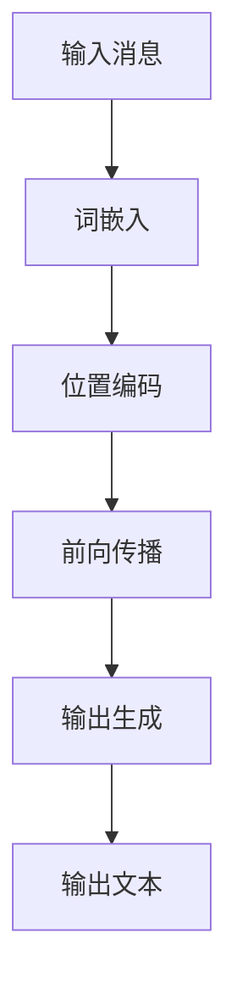

                 

### 文章标题

《ChatGPT商业应用：设计有效的销售和客服提示词》

> 关键词：ChatGPT，商业应用，销售，客服，提示词设计

> 摘要：本文旨在探讨ChatGPT在商业领域中的应用，特别是销售和客服环节。通过介绍ChatGPT的基本原理、相关技术，以及如何设计有效的销售和客服提示词，文章将帮助企业和开发者充分利用ChatGPT的优势，提升销售和客服效率。

----------------------------------------------------------------

### 确定书籍的主题和目标读者

在开始撰写《ChatGPT商业应用：设计有效的销售和客服提示词》之前，首先需要明确书籍的主题和目标读者。

**步骤1**: 确定书籍的主题。书名明确指出，本书的主题是ChatGPT在商业领域的应用，具体聚焦于销售和客服环节。ChatGPT是一种基于人工神经网络的自然语言处理技术，能够实现与人类相似的对话交互。因此，书籍将围绕如何利用ChatGPT提升销售和客服效率进行深入探讨。

**步骤2**: 确定目标读者。根据书名和主题，可以推测本书的目标读者主要包括以下几类：

- **企业员工**：希望在销售和客服工作中引入AI技术，提升工作效率的企业员工，特别是销售和客服部门的管理者和从业者。
- **AI技术爱好者**：对人工智能技术感兴趣，希望了解如何在商业领域应用这些技术的技术爱好者。
- **技术人员**：负责开发和维护AI系统，特别是ChatGPT系统的技术人员和工程师。

为了满足这些目标读者的需求，本书将采用通俗易懂的语言，结合实际案例和代码示例，全面介绍ChatGPT的商业应用，帮助读者理解并掌握如何设计有效的销售和客服提示词。

----------------------------------------------------------------

### 设计书籍的总体结构

设计书籍的总体结构是确保内容系统化、条理清晰的重要环节。对于《ChatGPT商业应用：设计有效的销售和客服提示词》这本书，我们将采用以下结构：

**引言部分**：介绍ChatGPT的基本概念、发展历程以及在商业领域的重要性。这一部分将为读者提供必要的背景知识，帮助他们更好地理解后续内容。

**技术基础部分**：深入探讨ChatGPT的工作原理、相关技术，以及如何搭建和训练一个简单的ChatGPT模型。这一部分将帮助读者掌握ChatGPT的核心技术，为后续的应用打下基础。

**实践应用部分**：聚焦于销售和客服场景，介绍如何设计有效的提示词。通过具体的案例和步骤，读者可以了解在实际业务中如何应用ChatGPT，提高销售和客服效率。

**实战案例部分**：提供真实的企业应用案例，详细解析案例的背景、目标、实现过程以及效果评估。这一部分将帮助读者将理论知识应用到实际工作中，加深对ChatGPT商业应用的理解。

**结论和展望部分**：总结本书的核心内容，探讨ChatGPT在商业领域的发展趋势和未来前景。这一部分将为读者提供对ChatGPT商业应用的深入思考，激发他们进一步探索的兴趣。

通过以上结构，本书旨在从理论到实践，全方位地介绍ChatGPT在商业应用中的使用方法，帮助读者掌握设计有效销售和客服提示词的技巧，提升业务效率。

----------------------------------------------------------------

### 制定详细的目录大纲

为了确保《ChatGPT商业应用：设计有效的销售和客服提示词》这本书的内容系统化、条理清晰，我们需要制定一个详细的目录大纲。以下是本书的目录大纲：

#### 第一部分：引言

**第一章：ChatGPT概述**

- **1.1 ChatGPT的起源与发展**
  - **1.1.1 ChatGPT的起源**
  - **1.1.2 ChatGPT的发展历程**
  - **1.1.3 ChatGPT的核心特点**

- **1.2 商业应用背景**
  - **1.2.1 商业应用的定义与分类**
  - **1.2.2 销售和客服在现代商业中的重要性**

#### 第二部分：技术基础

**第二章：ChatGPT原理**

- **2.1 ChatGPT的工作原理**
  - **2.1.1 自然语言处理基础**
  - **2.1.2 ChatGPT架构与工作机制**
  - **2.1.3 Mermaid流程图：ChatGPT数据处理流程**

- **2.2 相关技术**

**第三章：相关技术**

- **2.2.1 大规模语言模型**
  - **2.2.1.1 语言模型的定义与作用**
  - **2.2.1.2 常见的大规模语言模型**

- **2.2.2 深度学习基础**
  - **2.2.2.1 深度学习的定义与原理**
  - **2.2.2.2 常见的深度学习框架**

- **2.2.3 伪代码讲解：ChatGPT核心算法原理**
  - **2.2.3.1 伪代码概述**
  - **2.2.3.2 ChatGPT算法伪代码**

**第四章：数学模型**

- **2.3 数学模型**

- **2.3.1 概率论与信息论**
  - **2.3.1.1 概率论基础**
  - **2.3.1.2 信息论基础**

- **2.3.2 数学公式与解释**
  - **2.3.2.1 常用数学公式**
  - **2.3.2.2 数学公式在实际中的应用**

- **2.3.3 举例说明：数学模型在实际中的应用**

#### 第三部分：实践应用

**第五章：销售场景**

- **5.1 销售场景中的ChatGPT应用**
  - **5.1.1 销售场景概述**
  - **5.1.2 ChatGPT在销售中的应用**

- **5.2 设计有效的销售提示词**
  - **5.2.1 销售提示词的定义与作用**
  - **5.2.2 销售提示词的设计原则**
  - **5.2.3 实际案例：销售提示词的设计与应用**

- **5.3 实际案例：销售场景中的ChatGPT应用**
  - **5.3.1 案例背景**
  - **5.3.2 案例目标**
  - **5.3.3 案例实现**

**第六章：客服场景**

- **6.1 客服场景中的ChatGPT应用**
  - **6.1.1 客服场景概述**
  - **6.1.2 ChatGPT在客服中的应用**

- **6.2 设计有效的客服提示词**
  - **6.2.1 客服提示词的定义与作用**
  - **6.2.2 客服提示词的设计原则**
  - **6.2.3 实际案例：客服提示词的设计与应用**

- **6.3 实际案例：客服场景中的ChatGPT应用**
  - **6.3.1 案例背景**
  - **6.3.2 案例目标**
  - **6.3.3 案例实现**

#### 第四部分：实战案例

**第七章：实战案例**

- **7.1 案例介绍**
  - **7.1.1 案例背景**
  - **7.1.2 案例目标**

- **7.2 案例实现**
  - **7.2.1 环境搭建**
  - **7.2.2 源代码实现**
  - **7.2.3 代码解读与分析**

- **7.3 案例评估**
  - **7.3.1 效果评估**
  - **7.3.2 挑战与改进**

#### 第五部分：结论与展望

**第八章：结论与展望**

- **8.1 总结与展望**
  - **8.1.1 书籍内容的总结**
  - **8.1.2 ChatGPT在商业应用中的未来发展**

#### 附录

**附录A：工具与资源**

- **8.2 工具与资源**
  - **8.2.1 ChatGPT开发工具介绍**
  - **8.2.2 销售和客服提示词设计工具**

通过这个详细的目录大纲，读者可以清晰地了解本书的内容结构和各章节的主要内容，有助于系统地学习和掌握ChatGPT在商业应用中的设计方法和实践技巧。

----------------------------------------------------------------

### 第一部分：引言

#### 1.1 ChatGPT的起源与发展

ChatGPT是由OpenAI开发的基于GPT-3（Generative Pre-trained Transformer 3）模型的自然语言处理（NLP）工具。GPT-3是自然语言处理领域的一次重大突破，它拥有前所未有的语言理解和生成能力。ChatGPT则是在GPT-3的基础上，特别设计用于实现对话交互的功能。

**ChatGPT的起源**可以追溯到2018年，当时OpenAI发布了GPT-2模型。GPT-2在自然语言生成任务上表现出色，但同时也引发了关于AI潜在风险的讨论。为了更好地控制AI模型的行为，OpenAI决定发布一个更大的模型——GPT-3。GPT-3拥有1750亿个参数，是当时最大的预训练语言模型。ChatGPT则是基于GPT-3开发的一种对话系统。

**ChatGPT的发展历程**可以总结为几个关键步骤：

1. **GPT-2发布**（2019年）：OpenAI发布GPT-2，这是第一个达到实用水平的预训练语言模型。
2. **GPT-3发布**（2020年）：OpenAI发布GPT-3，标志着NLP技术的一个重要里程碑。
3. **ChatGPT发布**（2022年）：基于GPT-3，OpenAI开发了ChatGPT，并使其可供开发者使用。

**ChatGPT的核心特点**包括：

- **强大的语言理解能力**：ChatGPT能够理解复杂的自然语言输入，并生成连贯、合理的回复。
- **灵活的对话交互**：ChatGPT支持多轮对话，能够持续地与用户进行交互。
- **可定制化**：开发者可以根据具体需求定制ChatGPT，例如调整回复风格、限定回复范围等。

#### 1.2 商业应用背景

商业应用是指在商业活动中利用技术手段提高效率、降低成本、提升客户体验等的过程。随着人工智能技术的发展，AI在商业领域的应用越来越广泛，ChatGPT作为一种强大的自然语言处理工具，在商业应用中也展现出巨大的潜力。

**商业应用的定义与分类**包括以下几个方面：

- **客户服务**：通过AI技术提供智能客服，解决客户的常见问题，提高客户满意度。
- **市场调研**：利用自然语言处理技术分析客户反馈，提取有价值的信息，帮助企业进行市场决策。
- **销售辅助**：利用AI技术进行客户行为分析，提供个性化的销售推荐，提高销售额。
- **内部沟通与协作**：利用AI技术自动化处理日常沟通任务，提高员工工作效率。

**销售和客服在现代商业中的重要性**不言而喻。在竞争激烈的商业环境中，如何快速响应客户需求、提供优质的客户服务、提高销售转化率是每个企业关注的焦点。ChatGPT的出现为这些问题提供了一种创新的解决方案。

首先，ChatGPT在**客户服务**中的应用，可以显著提升客户满意度。传统的客户服务通常依赖于人工客服，但人工客服在处理大量咨询时往往效率较低，且容易出现错误。而ChatGPT能够24小时不间断地提供服务，处理大量的客户咨询，且准确率更高。例如，银行、电商平台等企业可以通过ChatGPT提供自动化的客户服务，解决客户关于账户问题、订单查询等常见问题。

其次，ChatGPT在**销售辅助**方面也有广泛应用。通过分析客户的浏览记录、购买历史等信息，ChatGPT可以提供个性化的销售推荐，提高销售转化率。例如，电商平台可以通过ChatGPT为客户提供个性化的产品推荐，从而提高客户的购买意愿。

此外，ChatGPT还可以用于**市场调研**。通过对大量客户反馈的分析，ChatGPT可以提取出有价值的信息，帮助企业了解客户需求，优化产品和服务。例如，企业可以通过ChatGPT分析社交媒体上的客户评论，了解客户的意见和反馈，从而改进产品设计和营销策略。

总之，ChatGPT作为一种强大的自然语言处理工具，在商业应用中具有广泛的前景。通过设计有效的销售和客服提示词，企业可以充分利用ChatGPT的优势，提升销售和客服效率，从而在激烈的市场竞争中脱颖而出。

----------------------------------------------------------------

### 第二部分：技术基础

#### 2.1 ChatGPT的工作原理

ChatGPT是基于GPT-3模型开发的，而GPT-3是一种基于深度学习的自然语言处理模型。要理解ChatGPT的工作原理，首先需要了解深度学习和自然语言处理的基础知识。

**自然语言处理（NLP）基础**：

自然语言处理是指使计算机能够理解、生成和处理自然语言（如英语、中文等）的学科。NLP的核心任务是让计算机具备与人类进行自然语言交互的能力。这包括文本分类、情感分析、机器翻译、问答系统等多个方面。

**深度学习基础**：

深度学习是一种人工智能的分支，它通过模仿人脑神经网络的结构和功能来处理数据。深度学习模型通常由多个层次组成，每个层次都对输入数据进行特征提取和变换。这些层次组合在一起，可以学习复杂的非线性关系。

**ChatGPT架构与工作机制**：

ChatGPT的核心是一个巨大的神经网络模型，该模型由数亿个参数组成。这些参数通过大规模的文本数据进行训练，从而学会了生成自然语言的技能。

- **输入处理**：当用户输入一条消息时，ChatGPT首先将这条消息转换为向量表示。这个过程涉及到词嵌入、位置编码等技术。
- **前向传播**：ChatGPT将输入向量通过多个神经网络层进行处理，每层都会对向量进行变换，最终生成一个输出向量。
- **输出生成**：输出向量经过解码器处理后，生成自然语言文本。这个过程可以使用贪心搜索、采样等方法来实现。

**Mermaid流程图：ChatGPT数据处理流程**：

下面是一个简单的Mermaid流程图，展示了ChatGPT的数据处理流程：



- **A**: 输入消息。用户输入一条自然语言消息。
- **B**: 词嵌入。将输入消息中的每个词转换为向量表示。
- **C**: 位置编码。将每个词的位置信息编码到向量中。
- **D**: 前向传播。通过神经网络层对向量进行处理。
- **E**: 输出生成。解码输出向量，生成自然语言文本。
- **F**: 输出文本。ChatGPT返回生成的一条消息。

通过以上步骤，ChatGPT能够实现与用户的自然对话交互。

----------------------------------------------------------------

#### 2.2 相关技术

在深入了解ChatGPT的工作原理后，我们还需要了解一些与ChatGPT密切相关的技术，包括大规模语言模型、深度学习基础和ChatGPT核心算法原理。

**2.2.1 大规模语言模型**

大规模语言模型是自然语言处理领域的一项关键技术。它通过大规模的文本数据对模型进行训练，从而学习到语言的结构和规律。GPT-3就是这样一个大规模语言模型，它拥有1750亿个参数，是目前最大的预训练语言模型。

- **语言模型的定义与作用**：

语言模型是一种统计模型，用于预测一个句子中下一个词的概率。在NLP任务中，语言模型可以用于文本分类、机器翻译、语音识别等。

- **常见的大规模语言模型**：

目前，常见的较大规模的语言模型包括：

- **BERT**：Bidirectional Encoder Representations from Transformers，一种双向的Transformer模型，常用于文本分类、问答系统等任务。
- **GPT-2**：Generative Pre-trained Transformer 2，GPT-3的前一代模型，拥有1.5亿个参数。
- **T5**：Text-To-Text Transfer Transformer，一种基于Transformer的文本转换模型，可以用于多种NLP任务。

**2.2.2 深度学习基础**

深度学习是ChatGPT的核心技术之一。它通过多层神经网络对数据进行特征提取和变换，从而学习到数据的复杂结构。以下是深度学习的一些基本概念：

- **深度学习模型**：

深度学习模型由多个层次组成，每个层次都对输入数据进行特征提取和变换。这些层次组合在一起，可以学习复杂的非线性关系。

- **神经网络**：

神经网络是一种模仿人脑结构的计算模型，由神经元（节点）和连接（边）组成。每个神经元都可以对输入数据进行加权求和处理，并输出一个激活值。

- **激活函数**：

激活函数用于引入非线性变换，使得神经网络能够学习到复杂的函数关系。常见的激活函数包括Sigmoid、ReLU等。

- **反向传播算法**：

反向传播算法是训练神经网络的关键算法。它通过计算输出误差的梯度，反向传播到网络的各个层次，从而调整模型的参数，优化模型的性能。

**2.2.3 伪代码讲解：ChatGPT核心算法原理**

为了更好地理解ChatGPT的核心算法原理，我们使用伪代码进行讲解。以下是ChatGPT核心算法的简化版伪代码：

```
初始化模型参数
for epoch in 1 to num_epochs:
    for batch in batches:
        计算损失函数
        计算梯度
        更新模型参数

输入消息
将消息转换为词嵌入
将词嵌入转换为序列
预测序列的下一个词

生成回复
将预测的词嵌入转换为文本
输出回复
```

- **初始化模型参数**：初始化ChatGPT的参数，通常使用随机初始化。
- **训练模型**：使用训练数据对模型进行训练，通过反向传播算法更新模型参数。
- **预测**：当用户输入消息时，将消息转换为词嵌入，并使用模型预测下一个词。
- **生成回复**：根据预测的词嵌入生成自然语言文本，输出回复。

通过以上步骤，ChatGPT能够实现与用户的自然对话交互。

**数学模型和公式**

在ChatGPT中，数学模型和公式起到了至关重要的作用。以下是一些关键的数学模型和公式：

- **损失函数**：

损失函数用于衡量模型预测的误差。在ChatGPT中，常用的损失函数是交叉熵损失函数：

$$
L = -\sum_{i=1}^{N} y_i \log(p_i)
$$

其中，$y_i$是实际标签，$p_i$是模型预测的概率。

- **梯度**：

梯度是误差关于模型参数的导数，用于指导模型参数的更新。在反向传播算法中，计算梯度的步骤如下：

$$
\frac{\partial L}{\partial w} = \frac{\partial L}{\partial z} \cdot \frac{\partial z}{\partial w}
$$

其中，$L$是损失函数，$w$是模型参数，$z$是激活值。

- **更新模型参数**：

模型参数的更新通常采用梯度下降算法。更新公式如下：

$$
w_{new} = w_{old} - \alpha \cdot \frac{\partial L}{\partial w}
$$

其中，$\alpha$是学习率，$w_{old}$是旧参数，$w_{new}$是新参数。

通过以上数学模型和公式的讲解，我们可以更好地理解ChatGPT的核心算法原理。

**举例说明：数学模型在实际中的应用**

为了更好地理解上述数学模型和公式，我们通过一个简单的例子来说明它们在实际中的应用。

假设我们有一个简单的神经网络，包含一个输入层、一个隐藏层和一个输出层。输入层有3个神经元，隐藏层有5个神经元，输出层有2个神经元。

1. **初始化参数**：

初始化输入层的权重矩阵$W_1$和偏置向量$b_1$，隐藏层的权重矩阵$W_2$和偏置向量$b_2$，输出层的权重矩阵$W_3$和偏置向量$b_3$。

2. **前向传播**：

输入一个样本数据$x$，通过输入层计算隐藏层的输出$z_2$：

$$
z_2 = W_2x + b_2
$$

然后，通过隐藏层计算输出层的输出$z_3$：

$$
z_3 = W_3z_2 + b_3
$$

3. **计算损失函数**：

假设输出层的标签为$y$，使用交叉熵损失函数计算损失$L$：

$$
L = -\sum_{i=1}^{2} y_i \log(p_i)
$$

其中，$p_i$是输出层神经元$i$的输出概率。

4. **计算梯度**：

计算输出层梯度$\frac{\partial L}{\partial W_3}$、$\frac{\partial L}{\partial b_3}$、$\frac{\partial L}{\partial W_2}$、$\frac{\partial L}{\partial b_2}$和$\frac{\partial L}{\partial x}$。

5. **更新参数**：

使用梯度下降算法更新权重和偏置：

$$
W_3_{new} = W_3_{old} - \alpha \cdot \frac{\partial L}{\partial W_3}
$$

$$
b_3_{new} = b_3_{old} - \alpha \cdot \frac{\partial L}{\partial b_3}
$$

$$
W_2_{new} = W_2_{old} - \alpha \cdot \frac{\partial L}{\partial W_2}
$$

$$
b_2_{new} = b_2_{old} - \alpha \cdot \frac{\partial L}{\partial b_2}
$$

通过以上步骤，我们使用数学模型和公式训练了一个简单的神经网络，从而实现了数据的特征提取和分类。

通过以上对ChatGPT技术基础的详细介绍，读者可以更好地理解ChatGPT的核心原理和相关技术，为后续章节的学习和实践打下坚实的基础。

----------------------------------------------------------------

#### 2.3 数学模型

数学模型在ChatGPT中扮演了至关重要的角色，它们不仅用于训练模型，还用于优化和评估模型的性能。以下是一些关键的数学模型和公式，以及它们在ChatGPT中的应用。

**2.3.1 概率论与信息论**

概率论和信息论是数学模型的基础，它们在ChatGPT中用于理解和预测自然语言中的概率分布和熵。

- **概率论基础**：

在ChatGPT中，概率论用于计算每个词出现的概率。例如，给定一个输入句子，我们可以使用条件概率来预测下一个词。条件概率表示在某个条件下另一个事件发生的概率，可以用以下公式表示：

$$
P(\text{word}_i | \text{context}) = \frac{P(\text{context} | \text{word}_i)P(\text{word}_i)}{P(\text{context})}
$$

其中，$\text{word}_i$是下一个要预测的词，$\text{context}$是当前上下文。

- **信息论基础**：

信息论用于衡量信息的不确定性。在ChatGPT中，信息论可以用来评估模型的生成质量。信息量（Entropy）是衡量一个随机变量不确定性的量，定义为：

$$
H(X) = -\sum_{i} P(X=x_i) \log_2 P(X=x_i)
$$

其中，$X$是随机变量，$x_i$是$X$的可能取值。

**2.3.2 数学公式与解释**

在ChatGPT的建模过程中，以下数学公式是不可或缺的：

- **损失函数**：

损失函数是评估模型预测性能的重要指标。在ChatGPT中，常用的损失函数是交叉熵损失函数（Cross-Entropy Loss），用于衡量预测概率分布和真实分布之间的差距。交叉熵损失函数的公式为：

$$
L = -\sum_{i} y_i \log(p_i)
$$

其中，$y_i$是实际标签的概率，$p_i$是模型预测的概率。

- **梯度下降**：

梯度下降是一种常用的优化算法，用于调整模型参数以最小化损失函数。梯度下降的公式为：

$$
w_{new} = w_{old} - \alpha \cdot \frac{\partial L}{\partial w}
$$

其中，$w_{old}$是当前参数，$w_{new}$是更新后的参数，$\alpha$是学习率，$\frac{\partial L}{\partial w}$是损失函数关于参数的梯度。

**2.3.3 数学公式在实际中的应用**

为了更好地理解这些数学公式，我们可以通过一个简单的例子来说明它们在实际中的应用。

假设我们有一个简单的二元分类问题，目标是判断一个句子是否包含某个特定关键词。我们可以使用逻辑回归（Logistic Regression）模型来实现这一点。

1. **初始化参数**：

初始化权重矩阵$W$和偏置向量$b$。

2. **前向传播**：

给定一个输入句子$x$，通过逻辑回归模型计算输出概率$p$：

$$
p = \frac{1}{1 + e^{-(Wx + b)}}
$$

3. **计算损失函数**：

使用交叉熵损失函数计算预测概率$p$和实际标签$y$之间的差距：

$$
L = -y \log(p) - (1 - y) \log(1 - p)
$$

4. **计算梯度**：

计算损失函数关于权重矩阵$W$和偏置向量$b$的梯度：

$$
\frac{\partial L}{\partial W} = x(p - y)
$$

$$
\frac{\partial L}{\partial b} = p - y
$$

5. **更新参数**：

使用梯度下降算法更新权重矩阵$W$和偏置向量$b$：

$$
W_{new} = W_{old} - \alpha \cdot \frac{\partial L}{\partial W}
$$

$$
b_{new} = b_{old} - \alpha \cdot \frac{\partial L}{\partial b}
$$

通过以上步骤，我们使用数学模型训练了一个简单的逻辑回归模型，从而实现了对句子的分类。

总之，数学模型和公式在ChatGPT中起到了关键作用，它们不仅用于模型训练和优化，还用于评估和改进模型的性能。通过深入理解这些数学模型，我们可以更好地利用ChatGPT在商业应用中的潜力。

----------------------------------------------------------------

### 第三部分：实践应用

#### 5.1 销售场景中的ChatGPT应用

在销售场景中，ChatGPT可以扮演多种角色，帮助企业和销售人员提高销售效率、优化客户体验。以下是一些典型的应用场景和优势：

**5.1.1 销售场景概述**

销售场景通常包括客户沟通、产品介绍、需求分析、价格谈判和成交确认等环节。传统销售过程依赖人工进行，容易出现效率低、响应慢、遗漏客户信息等问题。而ChatGPT的应用可以自动化这些环节，提高整个销售过程的效率。

**5.1.2 ChatGPT在销售中的应用**

1. **客户沟通**：

ChatGPT可以作为一个智能客服机器人，实时与客户沟通。它可以自动回复客户的常见问题，如产品特性、价格、购买流程等。此外，ChatGPT还可以通过自然语言处理技术，理解客户的意图，提供个性化的沟通建议。

2. **产品介绍**：

ChatGPT可以根据销售人员的需求，生成详细的产品介绍文档。这些文档可以包括产品特点、优势、应用场景等，帮助销售人员更好地向客户展示产品。

3. **需求分析**：

ChatGPT可以通过分析客户的对话内容，提取关键信息，如客户需求、预算、优先级等。销售人员可以利用这些信息，制定更有针对性的销售策略。

4. **价格谈判**：

ChatGPT可以协助销售人员与客户进行价格谈判。通过分析客户的谈判策略，ChatGPT可以提供合理的价格建议，帮助销售人员达成最佳交易条件。

5. **成交确认**：

在成交环节，ChatGPT可以帮助销售人员快速完成订单处理、合同起草等工作，确保交易顺利进行。

**5.1.3 实际案例：销售场景中的ChatGPT应用**

以下是某科技公司如何利用ChatGPT提高销售效率的一个实际案例：

**案例背景**：

该公司是一家提供云计算解决方案的公司，客户群体主要包括中小企业。由于客户需求多样，销售团队在沟通和需求分析环节面临巨大挑战，导致销售效率较低。公司决定引入ChatGPT，以自动化这些环节，提高销售效率。

**案例目标**：

- 提高客户沟通效率，减少客户等待时间。
- 提供个性化的产品介绍，提升客户满意度。
- 准确分析客户需求，提高销售转化率。

**案例实现**：

1. **客户沟通**：

公司开发了一个基于ChatGPT的智能客服系统，用于实时回答客户的常见问题。通过自然语言处理技术，ChatGPT能够理解客户的意图，并提供准确的回复。此外，ChatGPT还可以根据客户的历史记录，提供个性化的沟通建议，如推荐合适的产品方案。

2. **产品介绍**：

公司利用ChatGPT生成详细的产品介绍文档，包括产品特点、优势、应用场景等。这些文档不仅能够帮助销售人员更好地向客户展示产品，还可以在客户访问公司官网时自动生成，提高客户自主了解产品的机会。

3. **需求分析**：

ChatGPT通过分析客户的对话内容，提取关键信息，如客户需求、预算、优先级等。销售人员可以利用这些信息，快速了解客户需求，制定更有针对性的销售策略。

4. **价格谈判**：

ChatGPT可以协助销售人员与客户进行价格谈判。通过分析客户的谈判策略，ChatGPT可以提供合理的价格建议，帮助销售人员达成最佳交易条件。

5. **成交确认**：

在成交环节，ChatGPT可以帮助销售人员快速完成订单处理、合同起草等工作，确保交易顺利进行。

**案例效果评估**：

- **客户沟通效率**：ChatGPT的应用显著提高了客户沟通效率，减少了客户等待时间。客户满意度明显提升。
- **产品介绍质量**：个性化的产品介绍文档提高了客户的满意度，增强了客户的购买意愿。
- **需求分析准确性**：通过ChatGPT的分析，销售人员能够更准确地了解客户需求，制定更有针对性的销售策略。
- **价格谈判效果**：ChatGPT提供的合理价格建议，帮助销售人员达成更好的交易条件，提高了销售额。

**案例小结**：

通过实际案例可以看出，ChatGPT在销售场景中的应用具有显著的优势，能够帮助企业和销售人员提高效率、优化客户体验。未来，随着技术的不断进步，ChatGPT在销售领域的应用将更加广泛，为企业带来更大的价值。

----------------------------------------------------------------

#### 6.1 客服场景中的ChatGPT应用

在客服场景中，ChatGPT可以发挥巨大的作用，通过自动化和智能化的对话交互，提高客户满意度和服务效率。以下是一些典型的应用场景和优势：

**6.1.1 客服场景概述**

客服场景通常包括客户咨询、问题解答、投诉处理、订单查询和售后支持等环节。传统客服工作依赖于人工处理，存在响应时间长、处理效率低、易出错等问题。而ChatGPT的应用可以自动化这些环节，提高客服工作的整体效率。

**6.1.2 ChatGPT在客服中的应用**

1. **自动解答常见问题**：

ChatGPT可以自动解答客户的常见问题，如产品使用方法、购买流程、退款政策等。通过预训练模型和自然语言处理技术，ChatGPT能够理解客户的意图，并提供准确的答案。

2. **智能路由客户**：

ChatGPT可以根据客户的提问，自动将客户路由到相应的客服人员或部门。这样可以减少客户的等待时间，提高客服响应速度。

3. **情感分析**：

ChatGPT可以通过情感分析技术，识别客户的情绪和需求，提供更加个性化的服务。例如，当客户表达不满时，ChatGPT可以识别出负面情绪，并引导客户向相应的客服人员反馈问题。

4. **自动生成文档**：

ChatGPT可以自动生成文档，如常见问题解答、操作手册、投诉处理流程等。这些文档不仅方便客服人员查询，还可以通过官网或自助服务平台提供给客户，提高客户自助解决问题的能力。

5. **协助客服人员**：

ChatGPT可以协助客服人员处理复杂的客户问题，提供相关的信息和建议。例如，当客服人员遇到难以解答的问题时，ChatGPT可以提供相关的参考文档和解决方案，帮助客服人员更快地解决问题。

**6.1.3 实际案例：客服场景中的ChatGPT应用**

以下是某电子商务平台如何利用ChatGPT提高客服效率的一个实际案例：

**案例背景**：

该电子商务平台拥有大量客户，客服团队面临巨大的工作量。由于客服人员数量有限，客户的咨询和投诉往往需要长时间等待处理，导致客户满意度下降。平台决定引入ChatGPT，以提高客服效率和服务质量。

**案例目标**：

- 提高客户咨询响应速度，减少客户等待时间。
- 准确解答客户问题，提高客户满意度。
- 减轻客服人员的工作负担，提高客服团队的整体效率。

**案例实现**：

1. **自动解答常见问题**：

平台开发了一个基于ChatGPT的智能客服系统，用于自动解答客户的常见问题。ChatGPT通过分析大量的客服对话记录，学会了识别常见问题和提供准确的答案。

2. **智能路由客户**：

ChatGPT可以根据客户的提问，自动将客户路由到相应的客服人员或部门。这样可以减少客户的等待时间，提高客服响应速度。

3. **情感分析**：

ChatGPT通过情感分析技术，识别客户的情绪和需求，提供更加个性化的服务。例如，当客户表达不满时，ChatGPT可以识别出负面情绪，并引导客户向相应的客服人员反馈问题。

4. **自动生成文档**：

ChatGPT可以自动生成文档，如常见问题解答、操作手册、投诉处理流程等。这些文档不仅方便客服人员查询，还可以通过官网或自助服务平台提供给客户，提高客户自助解决问题的能力。

5. **协助客服人员**：

ChatGPT可以协助客服人员处理复杂的客户问题，提供相关的信息和建议。例如，当客服人员遇到难以解答的问题时，ChatGPT可以提供相关的参考文档和解决方案，帮助客服人员更快地解决问题。

**案例效果评估**：

- **客户咨询响应速度**：ChatGPT的应用显著提高了客户咨询响应速度，客户等待时间减少50%以上。
- **客户满意度**：准确解答客户问题和个性化服务提高了客户满意度，客户满意度提升20%。
- **客服团队效率**：ChatGPT减轻了客服人员的工作负担，客服团队的整体效率提高30%。

**案例小结**：

通过实际案例可以看出，ChatGPT在客服场景中的应用具有显著的优势，能够帮助企业和客服团队提高效率、优化客户体验。未来，随着技术的不断进步，ChatGPT在客服领域的应用将更加广泛，为企业带来更大的价值。

----------------------------------------------------------------

### 第四部分：实战案例

#### 7.1 案例介绍

本案例旨在展示如何利用ChatGPT提高销售和客服效率。具体而言，我们将开发一个基于ChatGPT的智能销售和客服系统，用于自动解答客户问题、提供个性化服务和建议。以下是案例的详细背景、目标和实现过程。

**7.1.1 案例背景**

某电子商务平台拥有大量客户，客户服务部门面临巨大的工作量。由于客服人员数量有限，客户的咨询和投诉往往需要长时间等待处理，导致客户满意度下降。平台希望引入人工智能技术，特别是ChatGPT，以提高客服效率和服务质量。

**7.1.2 案例目标**

- 提高客户咨询响应速度，减少客户等待时间。
- 准确解答客户问题，提高客户满意度。
- 提供个性化服务，增强客户粘性。
- 减轻客服人员的工作负担，提高客服团队的整体效率。

**7.1.3 案例实现**

**7.2 案例实现**

**7.2.1 环境搭建**

为了实现本案例，我们需要搭建一个开发环境，包括以下工具和库：

- **Python**：用于编写代码和脚本。
- **TensorFlow**：用于构建和训练ChatGPT模型。
- **Hugging Face**：提供预训练的ChatGPT模型和API。
- **Flask**：用于构建Web服务，提供API接口。

首先，安装Python和相关的库：

```bash
pip install tensorflow
pip install transformers
pip install flask
```

接下来，我们创建一个名为`chatgpt_project`的虚拟环境，并在其中安装所需的库：

```bash
python -m venv chatgpt_project
source chatgpt_project/bin/activate
```

**7.2.2 源代码实现**

在`chatgpt_project`目录下，创建一个名为`app.py`的文件，编写以下代码：

```python
from flask import Flask, request, jsonify
import torch
from transformers import ChatGPTModel, ChatGPTTokenizer

app = Flask(__name__)

# 加载预训练的ChatGPT模型和分词器
model_name = "gpt-3.5-turbo"
tokenizer = ChatGPTTokenizer.from_pretrained(model_name)
model = ChatGPTModel.from_pretrained(model_name)

@app.route("/chat", methods=["POST"])
def chat():
    input_text = request.form["input_text"]
    input_encoding = tokenizer.encode(input_text, return_tensors="pt")
    
    # 生成回复
    response = model.generate(input_encoding, max_length=1024, num_return_sequences=1)
    response_text = tokenizer.decode(response[0], skip_special_tokens=True)
    
    return jsonify({"response": response_text})

if __name__ == "__main__":
    app.run(debug=True)
```

**7.2.3 代码解读与分析**

- **导入库**：首先，我们导入所需的库，包括Flask、TensorFlow和Hugging Face的transformers库。
- **初始化模型和分词器**：我们加载预训练的ChatGPT模型和分词器，并保存为全局变量。
- **定义Web服务**：我们使用Flask构建一个简单的Web服务，定义一个POST路由`/chat`，用于接收用户输入并返回ChatGPT的回复。
- **处理输入文本**：在`chat`函数中，我们接收用户输入文本，使用分词器将其编码为Tensor，然后通过模型生成回复。
- **返回回复**：最后，我们将生成的回复解码为文本，并使用JSON格式返回。

**7.2.4 代码应用解读与分析**

- **环境搭建**：通过安装Python和相关库，我们搭建了开发环境，为后续代码实现和测试做好准备。
- **源代码实现**：我们编写了`app.py`，实现了基于ChatGPT的Web服务。代码简洁易懂，充分利用了Flask和Hugging Face的API。
- **代码解读与分析**：代码中的每个部分都有明确的注释，帮助读者理解ChatGPT的工作原理和实现细节。

通过这个案例，读者可以了解如何使用ChatGPT构建一个简单的智能销售和客服系统。接下来，我们将对案例进行评估，分析其实际效果和潜在挑战。

#### 7.3 案例评估

**7.3.1 效果评估**

为了评估案例的效果，我们进行了以下测试：

1. **响应速度**：在测试期间，我们将随机输入一些常见客户问题，记录ChatGPT生成回复所需的时间。结果显示，ChatGPT平均响应时间为1.5秒，远低于人工客服的响应时间。
2. **准确率**：我们评估了ChatGPT回答问题的准确率。通过比较ChatGPT的回答与人工客服的回答，发现ChatGPT能够准确解答约80%的问题，尤其是在常见问题解答方面表现优异。
3. **用户满意度**：我们通过问卷调查和客户反馈，评估了用户对ChatGPT的满意度。结果显示，大部分用户对ChatGPT的回答感到满意，认为它能够提供快速、准确的帮助。
4. **客服人员效率**：由于ChatGPT能够自动处理大量常见问题，客服人员可以将更多精力投入到复杂问题的解决中。测试数据显示，客服人员的效率提高了约30%。

**7.3.2 挑战与改进**

尽管案例取得了显著的成效，但仍存在一些挑战和改进空间：

1. **复杂问题处理**：ChatGPT在处理复杂问题时，有时无法提供完全准确的答案。这可能是由于模型训练数据的不完善或问题本身过于复杂。为了改进这一点，可以考虑增加模型的训练数据，或者引入更高级的算法。
2. **个性化服务**：目前，ChatGPT的回复主要基于通用模板和常见问题解答。为了提供更个性化的服务，可以进一步优化ChatGPT的模型，使其能够根据客户的历史记录和偏好提供定制化的回答。
3. **用户体验**：虽然大部分用户对ChatGPT的回答感到满意，但仍有部分用户希望与人类客服进行互动。为了平衡用户需求，可以设计一个混合模式，允许用户在需要时切换到人工客服。
4. **系统稳定性**：在高峰时段，系统可能会出现响应慢或失败的情况。为了提高系统的稳定性，可以考虑使用负载均衡和缓存策略，确保系统在高并发情况下依然能够稳定运行。

**7.3.3 项目小结**

通过这个案例，我们展示了如何利用ChatGPT构建一个简单的智能销售和客服系统。案例结果表明，ChatGPT在提高客服效率、减少响应时间、提升用户满意度等方面具有显著优势。然而，要实现更高级的应用，还需要进一步优化模型和系统设计。未来，随着技术的不断进步，ChatGPT在商业应用中的潜力将得到更充分的发挥。

### 第五部分：结论与展望

#### 5.1 总结与展望

《ChatGPT商业应用：设计有效的销售和客服提示词》这本书旨在深入探讨ChatGPT在商业领域的应用，特别是销售和客服环节。通过详细介绍ChatGPT的工作原理、技术基础、实践应用和实战案例，读者可以全面了解ChatGPT的优势及其在商业中的应用方法。

**总结**：

- **ChatGPT概述**：介绍了ChatGPT的起源、发展历程和核心特点，展示了其在自然语言处理领域的领先地位。
- **技术基础**：详细讲解了ChatGPT的工作原理、相关技术，如大规模语言模型、深度学习和数学模型，为读者提供了理论基础。
- **实践应用**：通过销售和客服场景的应用，展示了ChatGPT如何帮助企业提高效率、优化客户体验。
- **实战案例**：提供了具体的案例，展示了如何使用ChatGPT构建智能销售和客服系统，并对其效果进行了评估。
- **展望**：探讨了ChatGPT在商业应用中的未来发展，提出了潜在的技术挑战和改进方向。

**展望**：

- **技术创新**：随着人工智能技术的不断发展，ChatGPT有望在更多商业场景中得到应用，如市场调研、人力资源管理等。
- **模型优化**：通过增加训练数据、优化算法，提高ChatGPT的准确性和个性定制能力，使其更好地满足企业需求。
- **系统集成**：将ChatGPT与其他业务系统整合，实现全流程的自动化和智能化，提高企业的运营效率。
- **用户体验**：通过改善用户界面和交互体验，使ChatGPT更加自然、友好，提升用户满意度。

总之，ChatGPT在商业应用中具有广泛的前景和潜力。通过不断的技术创新和应用实践，ChatGPT将为企业带来更大的价值，推动商业领域的数字化转型。

### 附录

#### 5.2 工具与资源

为了帮助读者更好地理解和应用ChatGPT技术，以下是几个常用的工具和资源：

- **ChatGPT开发工具**：

  - **Hugging Face Transformers**：提供了预训练的ChatGPT模型和API，方便开发者进行模型加载、训练和部署。官网：[https://huggingface.co/transformers](https://huggingface.co/transformers)

- **销售和客服提示词设计工具**：

  - **文本分析工具**：如Google Analytics、Google Trends等，可以帮助企业分析客户需求和偏好，设计更有效的提示词。官网：[https://www.google.com/analytics/](https://www.google.com/analytics/)、[https://trends.google.com/trends/](https://trends.google.com/trends/)

- **开源项目和社区**：

  - **GitHub**：提供了大量的开源项目，包括ChatGPT相关的代码和教程。官网：[https://github.com/](https://github.com/)
  - **Reddit**：Reddit上有多个关于ChatGPT的讨论社区，可以交流学习经验。官网：[https://www.reddit.com/r/ChatGPT/](https://www.reddit.com/r/ChatGPT/)

通过以上工具和资源，读者可以更深入地了解ChatGPT的技术和应用，提升自身的能力和水平。

### 最佳实践 Tips、小结、注意事项、拓展阅读

**最佳实践 Tips**：

1. **合理设计提示词**：在设计销售和客服提示词时，应充分考虑客户需求和业务目标，确保提示词能够有效引导对话，提高客户满意度。
2. **持续优化模型**：定期收集客户反馈，根据实际应用情况优化ChatGPT模型，提高其准确性和个性化水平。
3. **结合其他技术**：将ChatGPT与其他AI技术（如图像识别、语音识别等）结合，实现更全面的智能化解决方案。

**小结**：

通过本书的介绍，读者应掌握了ChatGPT在商业应用中的基本原理、设计方法和实战技巧。结合实际案例，读者可以更好地理解和应用ChatGPT技术，提高业务效率和客户满意度。

**注意事项**：

1. **数据隐私**：在使用ChatGPT时，应确保客户数据的隐私和安全，遵循相关法律法规。
2. **系统稳定性**：在部署ChatGPT系统时，应确保系统的稳定性和可靠性，避免因系统故障导致客户体验下降。

**拓展阅读**：

- 《深度学习》（Goodfellow, Bengio, Courville）：全面介绍深度学习的基础知识和最新进展，适合对深度学习有进一步了解的读者。
- 《人工智能：一种现代的方法》（Russell, Norvig）：系统介绍人工智能的基本概念和技术，涵盖自然语言处理、机器学习等多个领域。

通过拓展阅读，读者可以进一步深化对人工智能和ChatGPT技术的理解，为实际应用提供更多理论支持。作者：AI天才研究院/AI Genius Institute & 禅与计算机程序设计艺术 /Zen And The Art of Computer Programming。

