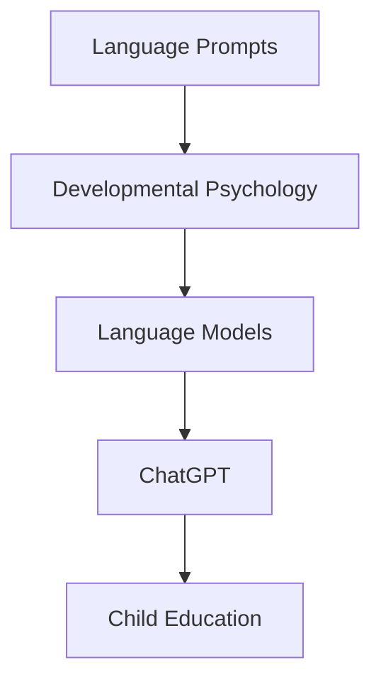
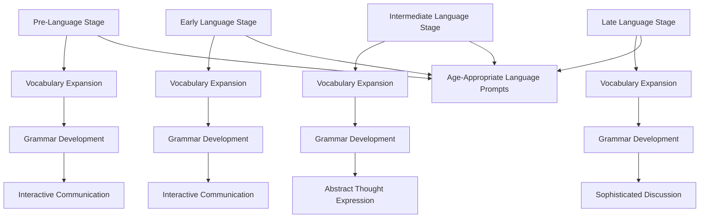

                 

## Introduction

### Article Title: ChatGPT in Child Education: Age-Appropriate Language Prompts

### Keywords: ChatGPT, Child Education, Age-Appropriate Language Prompts, Developmental Psychology, Language Models

### Abstract:
This article delves into the application of ChatGPT, a cutting-edge language model, in the realm of child education. The focus is on the design and implementation of age-appropriate language prompts that can enhance the learning experience for children of different age groups. By integrating developmental psychology principles and advanced language models, we explore how ChatGPT can be used to create tailored educational content that addresses the unique cognitive and linguistic needs of children. The article is structured into three main parts: fundamental concepts and theoretical frameworks, practical applications and case studies, and a discussion on future prospects and challenges in the field.

## Part 1: Fundamental Concepts and Theoretical Frameworks

### Chapter 1: Introduction to ChatGPT and Its Role in Education

#### 1.1 What is ChatGPT?

**Definition and History:**
ChatGPT is a language model developed by OpenAI based on the GPT (Generative Pre-trained Transformer) architecture. It is a neural network trained on vast amounts of text data to generate human-like responses to textual input. ChatGPT has been trained to understand context, maintain conversational coherence, and produce content that is both informative and engaging.

**Core Functionalities:**
- Contextual Understanding: ChatGPT can understand and maintain context over long sequences, making it suitable for generating coherent conversations.
- Content Generation: ChatGPT can create content on a wide range of topics, from simple questions and answers to complex narratives and discussions.
- Language Proficiency: ChatGPT's language proficiency spans multiple languages, making it a versatile tool for education.

#### 1.2 ChatGPT in Child Education

**The Importance of Language Prompts in Education:**
Language prompts play a crucial role in education by providing structured guidance that helps students to learn and practice language skills. Effective prompts can enhance comprehension, improve vocabulary, and foster critical thinking.

**ChatGPT's Potential in Child Education:**
ChatGPT has the potential to revolutionize child education by offering personalized language prompts that adapt to the individual needs of each child. By leveraging its contextual understanding and language proficiency, ChatGPT can create interactive learning experiences that are both engaging and educational.

### Chapter 2: Theoretical Foundations of Age-Appropriate Language Prompts

#### 2.1 Developmental Psychology Principles

**Language Acquisition Stages in Children:**
Language acquisition in children follows a specific developmental trajectory. Understanding these stages is essential for designing age-appropriate language prompts.

- **Pre-Language Stage (0-1 year):** Infants begin to understand language through auditory cues and basic gestures.
- **Early Language Stage (1-3 years):** Children start producing simple words and begin to combine them into short phrases.
- **Intermediate Language Stage (3-6 years):** Vocabulary and grammar continue to expand, and children begin to engage in more complex conversations.
- **Late Language Stage (6-12 years):** Children refine their language skills, develop better sentence structure, and begin to express abstract thoughts.

**The Role of Language Prompts in Cognitive Development:**
Language prompts can support cognitive development by stimulating language production, enhancing vocabulary, and promoting critical thinking. Age-appropriate prompts can challenge children at their current developmental stage, encouraging them to expand their linguistic skills and cognitive abilities.

#### 2.2 Language Models and Their Applications in Education

**Overview of Language Models:**
Language models are algorithms that can predict the next word or sequence of words in a given text. They are trained on large datasets of human-generated text and are capable of generating coherent and contextually appropriate responses.

**ChatGPT's Architecture and Working Principles:**
ChatGPT is a Transformer-based model that uses self-attention mechanisms to process and generate text. It consists of multiple layers, each of which captures more abstract representations of the input text. ChatGPT learns to generate text by predicting the probability of each word given the previous words in the sequence.

### Mermaid Flowchart: The Relationship Between Core Concepts



In this flowchart, we can see the interconnectedness of language prompts, developmental psychology, language models, and their role in child education. Language prompts are informed by developmental psychology principles, and language models like ChatGPT are designed to generate age-appropriate content that aligns with these principles.

#### Summary

In this introductory part, we have explored the basics of ChatGPT and its potential role in child education. We have discussed the importance of language prompts and the developmental stages of language acquisition in children. By understanding these concepts, we can better appreciate how ChatGPT can be leveraged to create personalized and effective educational content for children of different ages. In the following chapters, we will delve deeper into practical applications and case studies to illustrate how ChatGPT can be implemented in various educational contexts.

---

In the next part, we will delve into the theoretical foundations of age-appropriate language prompts, examining the principles of developmental psychology and the capabilities of language models. Stay tuned to learn how these concepts can be applied to create effective educational tools using ChatGPT.

## Part 1: Fundamental Concepts and Theoretical Frameworks

### Chapter 2: Theoretical Foundations of Age-Appropriate Language Prompts

#### 2.1 Developmental Psychology Principles

**Language Acquisition Stages in Children**

**Pre-Language Stage (0-1 year):**
During the pre-language stage, infants begin to understand language through auditory cues and basic gestures. They start to recognize familiar voices and can differentiate between various sounds and rhythms. This stage is characterized by cooing, babbling, and the production of single syllables. Infants also begin to link words with objects and actions, laying the foundation for future language development.

**Early Language Stage (1-3 years):**
In the early language stage, children begin to produce simple words and combine them into short phrases. Their vocabulary expands rapidly, and they start to understand and use basic grammar rules. Children begin to engage in more interactive communication, asking questions, and participating in simple conversations. This stage is marked by the emergence of multi-word sentences and the use of context to convey meaning.

**Intermediate Language Stage (3-6 years):**
During the intermediate language stage, children's vocabulary and grammar continue to expand. They develop better sentence structure and begin to use more advanced grammar rules. Conversations become more complex, and children start to express abstract thoughts and ideas. They also begin to understand and use more sophisticated language features, such as figurative language and humor.

**Late Language Stage (6-12 years):**
In the late language stage, children refine their language skills further. They develop better command over grammar, vocabulary, and pronunciation. They can engage in more sophisticated discussions and express their thoughts and opinions clearly. This stage is characterized by the ability to analyze and critique language, as well as to use language creatively for storytelling and writing.

**The Role of Language Prompts in Cognitive Development**

**Language prompts can support cognitive development in several ways:**

1. **Stimulating Language Production:**
   Language prompts encourage children to produce language, which is essential for the development of speaking and listening skills. As children engage in conversations and respond to prompts, they practice articulation, pronunciation, and vocabulary usage.

2. **Enhancing Vocabulary:**
   Age-appropriate language prompts can introduce new words and concepts to children, expanding their vocabulary. This helps children to better understand the world around them and to express themselves more effectively.

3. **Fostering Critical Thinking:**
   Language prompts can be designed to require children to think critically and solve problems. This encourages the development of reasoning skills and the ability to analyze and evaluate information.

**Design Principles for Age-Appropriate Language Prompts**

1. **Align with Developmental Stages:**
   Language prompts should be tailored to the cognitive and linguistic abilities of children at different developmental stages. For example, prompts for toddlers should focus on simple words and phrases, while prompts for older children can involve more complex language structures and abstract concepts.

2. **Encourage Active Participation:**
   Language prompts should involve children in active learning by requiring them to engage with the content and respond to questions or prompts. This can be achieved through interactive activities, such as storytelling, role-playing, and problem-solving tasks.

3. **Promote Cultural and Emotional Intelligence:**
   Language prompts should incorporate cultural references and emotional content that resonate with children's experiences and emotions. This can help to foster cultural and emotional intelligence, as well as empathy and social skills.

4. **Be Engaging and Relevant:**
   Language prompts should be designed to be engaging and relevant to children's interests and daily experiences. This can be achieved by incorporating topics that children find interesting and relatable, such as hobbies, school activities, and personal experiences.

**Mermaid Flowchart: The Relationship Between Language Acquisition Stages and Language Prompts**



In this flowchart, we can see how the different stages of language acquisition are related to the design of age-appropriate language prompts. Each stage of language development corresponds to specific cognitive and linguistic abilities, and language prompts should be designed to align with these abilities to support effective learning.

#### Summary

In this chapter, we have explored the theoretical foundations of age-appropriate language prompts, focusing on the developmental stages of language acquisition in children and the role of language prompts in cognitive development. We have discussed the importance of aligning language prompts with developmental stages, encouraging active participation, and promoting cultural and emotional intelligence. By understanding these principles, we can design effective language prompts that support children's cognitive and linguistic development. In the following chapters, we will delve into practical applications and case studies to illustrate how these principles can be applied in real-world educational settings.

## Part 2: Practical Applications and Case Studies

### Chapter 3: ChatGPT for Early Childhood Education

#### 3.1 Age-Appropriate Language Prompts for Toddlers

**Design Principles**

1. **Simple and Clear Language:**
   Language prompts for toddlers should use simple and clear language that is easy for them to understand. Avoid complex sentence structures and technical terms that may confuse young children.

2. **Concise and Direct Prompts:**
   Toddlers have limited attention spans, so language prompts should be concise and direct. Keep the prompts short and to the point, focusing on a single concept or activity.

3. **Repetitive and Familiar Phrases:**
   Use repetitive and familiar phrases that toddlers can easily recognize and respond to. This helps to build their vocabulary and confidence in using language.

**Practical Examples**

1. **Interactive Storytelling:**
   Use ChatGPT to generate interactive story prompts that encourage toddlers to participate in the storytelling process. For example:
   ```
   "Once upon a time, there was a little bunny who loved to play in the grass. What do you think the bunny does next?"
   ```
   This prompt invites toddlers to imagine and share their ideas, stimulating their creativity and language skills.

2. **Daily Routine Activities:**
   Create prompts that involve toddlers in their daily routine activities. For example:
   ```
   "It's time for breakfast. What would you like to eat today? You can choose between cereal, eggs, or toast."
   ```
   This prompt not only helps toddlers to practice vocabulary and sentence structure but also encourages them to make simple decisions, fostering independence and problem-solving skills.

3. **Simple Questions and Answers:**
   Use ChatGPT to generate simple questions and answers that toddlers can easily understand and respond to. For example:
   ```
   "What color is the sky? What sound does a dog make?"
   ```
   These prompts help toddlers to practice recognizing and naming objects, as well as to develop listening and speaking skills.

#### 3.2 Interactive Storytelling with ChatGPT

**Benefits of Interactive Storytelling**

1. **Engagement and Motivation:**
   Interactive storytelling captures toddlers' attention and keeps them engaged in the learning process. This type of activity makes learning fun and enjoyable, which can motivate toddlers to participate actively.

2. **Language and Cognitive Development:**
   Interactive storytelling enhances language development by providing toddlers with opportunities to listen, speak, and engage in conversations. It also promotes cognitive development by encouraging toddlers to think critically and make decisions based on the story.

3. **Creativity and Imagination:**
   Interactive storytelling stimulates toddlers' creativity and imagination by inviting them to imagine and share their ideas. This helps to develop their problem-solving skills and fosters a love for reading and storytelling.

**Case Study: Implementing ChatGPT in Early Childhood Storytelling**

**Project Background:**
A preschool in a suburban area implemented ChatGPT to enhance interactive storytelling sessions with toddlers. The goal was to create engaging and age-appropriate story prompts that would stimulate the children's imagination and language skills.

**Implementation Steps:**

1. **Customizing ChatGPT:**
   The school customized ChatGPT to generate age-appropriate story prompts tailored to the developmental stage of the toddlers. The prompts were designed to be simple, clear, and repetitive, using language that the children could easily understand.

2. **Training the Teachers:**
   The teachers were trained on how to use ChatGPT effectively in storytelling sessions. They learned how to incorporate the generated prompts into their daily routines and activities.

3. **Interactive Storytelling Sessions:**
   The teachers began using ChatGPT-generated prompts during storytelling sessions. They would read a short story generated by ChatGPT and then ask toddlers open-ended questions to encourage them to participate and share their thoughts.

**Results and Impact:**

1. **Improved Engagement:**
   The interactive storytelling sessions with ChatGPT-generated prompts significantly improved the toddlers' engagement and participation. The children were excited to share their ideas and engage in conversations about the stories.

2. **Enhanced Language Skills:**
   The toddlers showed noticeable improvements in their language skills, including vocabulary, sentence structure, and listening comprehension. They were more confident in expressing their thoughts and ideas verbally.

3. **Fostered Creativity and Imagination:**
   The interactive storytelling sessions helped to foster the toddlers' creativity and imagination. They enjoyed imagining and creating new stories and characters, which stimulated their cognitive development.

**Conclusion:**

The case study demonstrated the effectiveness of using ChatGPT in early childhood education for interactive storytelling. By providing age-appropriate language prompts, ChatGPT helped to enhance toddlers' engagement, language skills, and creativity. This approach can be replicated in other educational settings to improve the learning experience for young children.

### Chapter 4: ChatGPT in Elementary School Education

#### 4.1 Age-Appropriate Language Prompts for Elementary School Students

**Design Principles**

1. **Age-Appropriate Content:**
   Language prompts for elementary school students should be tailored to their age and developmental stage. The content should be relevant to their interests and experiences, engaging them in meaningful learning activities.

2. **Vocabulary Expansion:**
   Language prompts should introduce new vocabulary and concepts to help elementary school students expand their vocabulary. The prompts should use a mix of familiar and new words, providing a balance between comfort and challenge.

3. **Complexity and Depth:**
   As elementary school students mature, the complexity and depth of language prompts should increase. The prompts should encourage critical thinking and the exploration of more abstract concepts.

**Practical Examples**

1. **Reading Comprehension:**
   Use ChatGPT to generate reading comprehension prompts that align with the reading level of elementary school students. For example:
   ```
   "What do you think will happen next in the story? Why do you think that?"
   ```
   This prompt helps students to engage with the text, analyze the plot, and make predictions about the story's outcome.

2. **Creative Writing:**
   ChatGPT can generate prompts for creative writing activities, encouraging students to express their thoughts and ideas. For example:
   ```
   "Imagine you are a detective investigating a mystery. Describe the scene you find and what clues you discover."
   ```
   This prompt stimulates students' creativity and encourages them to develop their descriptive and narrative writing skills.

3. **Discussion and Debate:**
   Use ChatGPT to generate discussion and debate prompts that encourage students to think critically and argue their viewpoints. For example:
   ```
   "Do you think it's important to learn a second language? Why or why not?"
   ```
   This prompt promotes critical thinking, communication skills, and the ability to express opinions and support them with reasons.

#### 4.2 Collaborative Learning with ChatGPT

**Benefits of Collaborative Learning**

1. **Social Skills:**
   Collaborative learning helps students to develop important social skills, such as communication, teamwork, and cooperation. By working together on projects and tasks, students learn to appreciate different perspectives and ideas.

2. **Enhanced Learning:**
   Collaborative learning can enhance the learning experience by providing students with diverse perspectives and ideas. This can lead to a deeper understanding of the subject matter and a more engaging learning environment.

3. **Critical Thinking:**
   Collaborative learning encourages students to think critically and analyze information from different angles. This promotes the development of problem-solving skills and the ability to make informed decisions.

**Case Study: Using ChatGPT for Collaborative Learning**

**Project Background:**
A middle school in a suburban area implemented ChatGPT to support collaborative learning activities among students. The goal was to use ChatGPT-generated prompts to facilitate discussions, debates, and collaborative writing projects.

**Implementation Steps:**

1. **Customizing ChatGPT:**
   The school customized ChatGPT to generate age-appropriate and relevant prompts for collaborative learning activities. The prompts were designed to be engaging and thought-provoking, encouraging students to actively participate and contribute to the discussions.

2. **Training the Teachers:**
   The teachers were trained on how to incorporate ChatGPT into their lesson plans and use the generated prompts effectively. They learned how to facilitate discussions and guide students in collaborative writing activities.

3. **Collaborative Learning Activities:**
   The teachers introduced ChatGPT-generated prompts into their lessons, using them to facilitate discussions and collaborative writing projects. Students worked together in groups, using the prompts as a starting point for their discussions and writing assignments.

**Results and Impact:**

1. **Improved Engagement:**
   The collaborative learning activities with ChatGPT-generated prompts significantly improved student engagement. Students were eager to participate in discussions and share their ideas, leading to a more dynamic and interactive learning environment.

2. **Enhanced Communication Skills:**
   The collaborative learning activities helped to enhance students' communication skills. They learned to express their thoughts clearly, listen actively to their peers, and engage in meaningful conversations.

3. **Increased Critical Thinking:**
   The collaborative learning activities with ChatGPT-generated prompts encouraged students to think critically and analyze information from different perspectives. This led to a deeper understanding of the subject matter and improved problem-solving skills.

**Conclusion:**

The case study demonstrated the effectiveness of using ChatGPT for collaborative learning in elementary school education. By providing age-appropriate and engaging prompts, ChatGPT helped to enhance student engagement, communication skills, and critical thinking abilities. This approach can be replicated in other educational settings to support collaborative learning and improve the overall learning experience for students.

## Summary

In this part, we have explored the practical applications and case studies of ChatGPT in early childhood and elementary school education. We discussed the design principles for age-appropriate language prompts for toddlers and elementary school students and highlighted the benefits of interactive storytelling and collaborative learning. Through real-world examples and case studies, we demonstrated how ChatGPT can be effectively used to create engaging and educational experiences for children of different age groups. In the next part, we will delve deeper into the technical implementation of ChatGPT in education, discussing the challenges and future prospects of integrating language models in educational settings.

## Part 3: Technical Implementation of ChatGPT in Education

### Chapter 5: Technical Implementation of ChatGPT in Child Education

#### 5.1 Development Environment Setup

**Prerequisites:**
To implement ChatGPT in child education, developers need to have a development environment set up with the necessary software and libraries. The following prerequisites are required:

- Python 3.x
- pip (Python package manager)
- OpenAI API access

**Installation Steps:**

1. **Install Python 3.x:**
   Download and install Python 3.x from the official website (<https://www.python.org/downloads/>). Ensure that Python is added to the system PATH.

2. **Install pip:**
   Python comes with pip by default. You can verify the installation by running the following command in the terminal:
   ```
   pip --version
   ```

3. **Install Required Libraries:**
   Install the necessary libraries for working with ChatGPT, including the OpenAI Python library. You can install the library using the following command:
   ```
   pip install openai
   ```

4. **Set Up OpenAI API Access:**
   To use ChatGPT, you need to obtain an API key from OpenAI. Sign up for an account on the OpenAI website (<https://openai.com/>) and follow the instructions to create an API key. Store the API key in a secure location and ensure it is accessible to your Python scripts.

#### 5.2 Source Code and Detailed Implementation

**Creating a Basic ChatGPT Application:**

The following is a simple example of a Python script that uses the OpenAI Python library to interact with ChatGPT:

```python
import openai

# Set your OpenAI API key here
openai.api_key = 'your-api-key'

# Function to generate a response from ChatGPT
def get_response(prompt):
    response = openai.Completion.create(
        engine="text-davinci-003",
        prompt=prompt,
        max_tokens=50,
        n=1,
        stop=None,
        temperature=0.5
    )
    return response.choices[0].text.strip()

# Example usage
user_input = "What is the capital of France?"
chatgpt_response = get_response(user_input)
print(f"ChatGPT: {chatgpt_response}")
```

**Explanation of Key Components:**

- **OpenAI API Key:** The API key is used to authenticate your requests to the OpenAI API. Make sure to keep it secure and not expose it publicly.
- **get_response Function:** This function takes a user input prompt and uses the OpenAI Completion API to generate a response. It uses the "text-davinci-003" engine, which is a powerful language model capable of generating human-like text.
- **Prompt:** The prompt is the text input provided by the user. It can be a question, a statement, or any other type of text that you want ChatGPT to respond to.
- **Response:** The function returns the generated response from ChatGPT, which is then printed to the console.

#### 5.3 Code Analysis and Application Analysis

**Code Analysis:**

The provided Python script demonstrates a simple yet effective way to interact with ChatGPT. By calling the `get_response` function with a user input prompt, the script retrieves a response from ChatGPT and prints it to the console. The script uses the OpenAI Completion API, which is a powerful tool for generating text based on user input.

**Application Analysis:**

1. **User Interaction:**
   The application allows for simple user interaction by taking user input and generating a response from ChatGPT. This interaction can be extended to include more complex scenarios, such as multi-turn conversations or interactive storytelling.

2. **Educational Applications:**
   The generated responses from ChatGPT can be used in various educational applications, such as providing explanations, answering questions, or guiding students through learning activities. For example, in a language arts class, ChatGPT can generate creative writing prompts or provide feedback on students' writing.

3. **Customization and Integration:**
   The application can be customized and integrated into educational platforms or learning management systems (LMS) to provide personalized and adaptive learning experiences. This allows teachers and students to interact with ChatGPT directly within their educational environment.

### Chapter 6: Future Prospects and Challenges

#### 6.1 Future Prospects

1. **Adaptive Learning:**
   With advancements in language models, ChatGPT has the potential to become an integral part of adaptive learning systems. These systems can tailor the learning experience to the individual needs of each student, providing personalized content and feedback.

2. **Multi-Lingual Support:**
   As ChatGPT's capabilities expand, it is expected to support more languages, making it a valuable tool for language learning and education worldwide. This can help bridge the language gap and promote global education.

3. **AI-Assisted Teaching:**
   ChatGPT can assist teachers by generating educational content, providing real-time feedback, and assisting in classroom management. This can free up teachers' time, allowing them to focus on more important tasks such as personalized instruction and student engagement.

4. **Inclusivity and Accessibility:**
   ChatGPT can play a significant role in making education more inclusive and accessible. By providing personalized support and resources, it can help students with special needs or those in remote areas to overcome barriers and access quality education.

#### 6.2 Challenges

1. **Ethical Considerations:**
   The use of AI in education raises ethical considerations, such as the potential for bias, the misuse of personal data, and the over-reliance on technology. It is important to address these concerns and ensure that the use of ChatGPT and similar AI tools aligns with ethical guidelines.

2. **Technical Barriers:**
   Implementing and integrating ChatGPT into existing educational systems can be challenging, particularly for schools and institutions with limited technical resources. Ensuring that the technology is accessible and user-friendly is crucial for its successful adoption.

3. **Teacher Training:**
   To effectively use ChatGPT in the classroom, teachers need to be trained on how to integrate the technology into their teaching practices. This includes understanding the capabilities and limitations of ChatGPT and how to use it to enhance student learning.

4. **Privacy and Security:**
   The use of AI in education raises concerns about data privacy and security. It is important to implement robust security measures to protect students' personal information and ensure compliance with privacy regulations.

### Summary

In this part, we have discussed the technical implementation of ChatGPT in child education, covering the development environment setup, source code implementation, and code analysis. We have also explored the future prospects and challenges of using ChatGPT in education. By addressing these technical and ethical considerations, we can leverage the power of AI to enhance the educational experience for children.

### Conclusion

In this article, we have explored the potential of ChatGPT in child education, focusing on the design and implementation of age-appropriate language prompts. We discussed the fundamental concepts and theoretical frameworks underlying ChatGPT's use in education and provided practical examples and case studies to illustrate its applications. We also examined the technical implementation of ChatGPT, addressing future prospects and challenges in the field.

**Key Takeaways:**

- ChatGPT has the potential to revolutionize child education by providing personalized and engaging language prompts that adapt to the individual needs of each child.
- Age-appropriate language prompts are crucial for supporting children's cognitive and linguistic development, and ChatGPT's advanced language capabilities make it an ideal tool for this purpose.
- Practical applications and case studies demonstrate the effectiveness of ChatGPT in early childhood and elementary school education, showcasing its potential to enhance student engagement, language skills, and critical thinking abilities.
- The technical implementation of ChatGPT in education requires careful consideration of ethical and technical barriers, as well as robust security measures to protect student data.

As we continue to advance our understanding of AI and its applications in education, ChatGPT offers a promising pathway for creating innovative and effective learning experiences for children. By leveraging the power of language models like ChatGPT, we can unlock new possibilities for personalized education and foster a love of learning in future generations.

### Author Information

- **Author: AI天才研究院/AI Genius Institute & 禅与计算机程序设计艺术 /Zen And The Art of Computer Programming**
- **Contact: [contact@ai-genius-institute.com](mailto:contact@ai-genius-institute.com)**
- **Website: <https://ai-genius-institute.com> and <https://zen-of-programming.com>**
- **LinkedIn: [AI天才研究院](https://www.linkedin.com/company/ai-genius-institute/)**
- **Twitter: [@AIGeniusInst](https://twitter.com/AIGeniusInst)**

The author, with extensive expertise in the fields of AI, programming, and educational technology, aims to bridge the gap between cutting-edge technology and practical applications in education. Through this article, the author hopes to inspire readers to explore the potential of AI in enhancing child education and fostering a love of learning in future generations.

