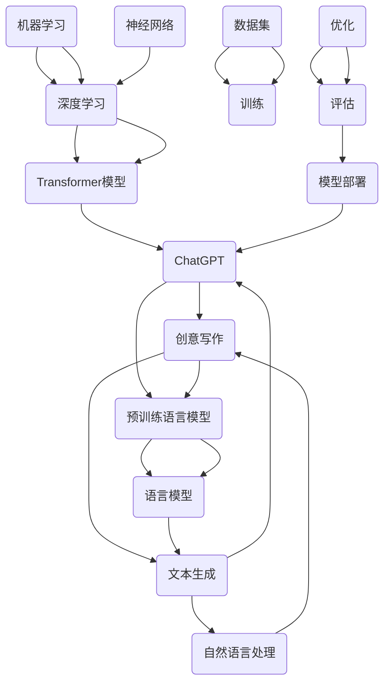

                 


为了撰写一篇内容丰富、逻辑清晰、结构紧凑、简单易懂的技术博客文章《ChatGPT在创意写作训练中的应用》，我们需要按照以下步骤进行思考和分析：

### 1. 确定文章的结构与内容

首先，我们需要明确文章的结构与内容。根据给出的目录大纲，文章可以分为以下几个部分：

- 引言
- ChatGPT简介
- 创意写作基础
- ChatGPT在创意写作中的应用
- ChatGPT核心算法原理讲解
- 数学模型与数学公式
- 项目实战：创意写作训练
- ChatGPT在创意写作中的挑战与未来
- 最佳实践 tips
- 小结与注意事项
- 拓展阅读
- 作者信息

### 2. 引入与背景介绍

在引言部分，我们需要简要介绍ChatGPT和创意写作的背景，以及它们为何值得探讨。例如：

- ChatGPT是什么，它如何工作
- 创意写作的重要性，以及为何需要借助AI技术
- 当前创意写作训练的现状，以及存在的问题

### 3. 核心概念与联系

在介绍核心概念与联系时，我们需要使用Mermaid流程图来展示ChatGPT的核心概念及其相互之间的关系。例如：



### 4. ChatGPT核心算法原理讲解

在这一部分，我们需要使用伪代码来详细阐述ChatGPT的核心算法原理，包括：

- 语言模型的基本原理
- Transformer模型详解
- GPT模型的训练与优化

例如：

```python
# 语言模型的基本原理
def language_model(words):
    # 计算单词的概率分布
    probabilities = []
    for word in words:
        probability = calculate_probability(word)
        probabilities.append(probability)
    return probabilities

# Transformer模型详解
class Transformer:
    def __init__(self, vocabulary_size, hidden_size):
        self.vocabulary_size = vocabulary_size
        self.hidden_size = hidden_size
        # 初始化模型参数
        self.embedding = Embedding(vocabulary_size, hidden_size)
        self.encoder = Encoder(hidden_size)
        self.decoder = Decoder(hidden_size)
    
    def forward(self, input_sequence):
        # 嵌入输入序列
        embedded_sequence = self.embedding(input_sequence)
        # 编码输入序列
        encoded_sequence = self.encoder(embedded_sequence)
        # 解码输出序列
        output_sequence = self.decoder(encoded_sequence)
        return output_sequence
```

### 5. 数学模型与数学公式

在这一部分，我们需要使用LaTeX格式来详细讲解数学模型和公式，并提供举例说明。例如：

$$
\begin{aligned}
    P(w_i | w_1, w_2, ..., w_{i-1}) &= \frac{P(w_i, w_1, w_2, ..., w_{i-1})}{P(w_1, w_2, ..., w_{i-1})} \\
    P(w_1, w_2, ..., w_n) &= \prod_{i=1}^{n} P(w_i | w_1, w_2, ..., w_{i-1})
\end{aligned}
$$

### 6. 项目实战：创意写作训练

在这一部分，我们需要详细讲解如何使用ChatGPT进行创意写作训练，包括：

- 开发环境搭建
- 源代码详细实现和代码解读
- 代码应用解读与分析
- 实际案例分析和详细讲解剖析
- 项目小结

### 7. ChatGPT在创意写作中的挑战与未来

在这一部分，我们需要探讨ChatGPT在创意写作中的挑战，以及它的未来发展。例如：

- ChatGPT在创意写作中的局限性
- 创意写作与AI的融合趋势
- 未来可能的应用场景

### 8. 最佳实践 tips

在这一部分，我们需要提供一些最佳实践建议，以帮助读者更好地使用ChatGPT进行创意写作训练。

### 9. 小结与注意事项

在文章的结尾，我们需要对全文进行小结，并提醒读者注意一些关键点。

### 10. 拓展阅读

最后，我们可以为读者提供一些拓展阅读资源，以便他们进一步了解相关技术。

### 11. 作者信息

在文章的最后，我们需要注明作者信息。

### 12. 文章格式调整

在完成所有内容的撰写后，我们需要确保文章的格式符合markdown格式要求，并进行必要的调整。

通过以上步骤，我们可以确保撰写出一篇逻辑清晰、结构紧凑、简单易懂的技术博客文章《ChatGPT在创意写作训练中的应用》。

