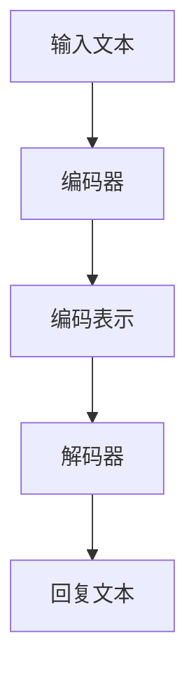

                 

### 文章标题

《ChatGPT在创意广告制作中的角色》

### 关键词

- ChatGPT
- 创意广告制作
- 语言模型
- 广告文案创作
- 广告创意策划
- 技术挑战与解决方案

### 摘要

本文将深入探讨ChatGPT在创意广告制作中的应用，分析其在广告文案创作和广告创意策划中的角色。通过详细的案例分析和技术挑战与解决方案的讨论，本文旨在揭示ChatGPT在创意广告制作中的潜力和未来发展方向。文章结构如下：

1. 引言：介绍ChatGPT和创意广告制作的基本概念及其重要性。
2. ChatGPT基础：阐述ChatGPT的核心概念、架构及其与创意广告制作的联系。
3. ChatGPT在创意广告中的应用：具体分析ChatGPT在广告文案创作和广告创意策划中的应用。
4. 案例研究：分享实际案例，展示ChatGPT在创意广告制作中的具体应用。
5. 技术挑战与解决方案：分析ChatGPT在创意广告制作中可能遇到的技术挑战及解决方案。
6. 行业趋势与未来方向：探讨创意广告制作的行业趋势以及ChatGPT在未来方向中的应用。
7. 总结与展望：总结ChatGPT在创意广告制作中的关键角色，展望其未来前景。

### 引言

#### ChatGPT简介

ChatGPT是由OpenAI开发的一种基于GPT-3的聊天机器人模型，它能够进行自然语言处理，与人类进行流畅的对话。ChatGPT采用了一种叫做“预训练-微调”的方法，首先在大量的文本数据上进行预训练，然后针对特定任务进行微调，使其能够更好地适应不同的应用场景。ChatGPT的核心优势在于其强大的语言生成能力和自然语言理解能力，这使得它在许多领域都有广泛的应用，包括但不限于问答系统、文本生成、机器翻译、对话系统等。

#### 创意广告制作概述

创意广告制作是广告行业中至关重要的一环。它不仅仅是为了吸引消费者的注意力，更重要的是要传达产品或服务的独特价值，并激发消费者的购买欲望。创意广告制作的过程通常包括市场调研、广告策划、文案创作、视觉设计等多个环节。在这个过程中，广告文案的创作和创意策划是两个关键环节，它们决定了广告是否能够引起消费者的共鸣，并最终实现营销目标。

### ChatGPT在创意广告制作中的重要性

随着人工智能技术的发展，越来越多的创意广告制作开始采用人工智能工具。ChatGPT作为一种强大的语言生成模型，在创意广告制作中扮演着越来越重要的角色。首先，ChatGPT能够快速生成吸引人的广告文案，极大地提高了文案创作的效率。其次，ChatGPT能够根据广告目标和消费者特征进行广告创意策划，提高广告的针对性和效果。此外，ChatGPT还能够实时与用户互动，提供个性化的广告体验，进一步提升了广告的互动性和用户体验。

### 目录

1. 引言
   1.1 ChatGPT简介
   1.2 创意广告制作概述
   1.3 ChatGPT在创意广告制作中的重要性
2. ChatGPT基础
   2.1 核心概念与联系
   2.2 架构介绍
   2.3 Mermaid流程图
3. ChatGPT在创意广告中的应用
   3.1 广告文案创作
   3.2 广告创意策划
4. 案例研究
   4.1 案例一：汽车广告文案创作
   4.2 案例二：广告创意策划
5. 技术挑战与解决方案
   5.1 语言理解与生成挑战
   5.2 解决方案探讨
6. 行业趋势与未来方向
   6.1 创意广告制作的行业趋势
   6.2 ChatGPT的未来方向
7. 总结与展望
   7.1 总结
   7.2 展望

### ChatGPT基础

#### 核心概念与联系

ChatGPT是一种基于GPT-3的聊天机器人模型，其核心概念包括语言模型、预训练和微调。语言模型是一种数学模型，用于对自然语言进行建模和处理。预训练是指在一个大规模的文本语料库上进行训练，使模型能够理解和生成自然语言。微调是指在预训练的基础上，针对特定任务进行进一步训练，以使模型能够更好地适应任务需求。

在创意广告制作中，ChatGPT的核心概念与广告文案创作和广告创意策划密切相关。语言模型使得ChatGPT能够生成符合语法和语义规则的广告文案；预训练使得ChatGPT能够理解不同领域的知识，从而生成具有创意和吸引力的文案；微调使得ChatGPT能够根据广告目标和消费者特征，生成更具有针对性和效果的广告文案。

#### 架构介绍

ChatGPT的架构基于GPT-3模型，GPT-3是一种基于Transformer的预训练语言模型。Transformer模型是一种基于自注意力机制的深度神经网络模型，其核心思想是通过自注意力机制来捕捉文本中的长距离依赖关系。

ChatGPT的架构主要包括以下几个部分：

1. **输入层**：接收用户的输入文本，如问题或指令。
2. **编码器**：对输入文本进行编码，生成表示输入文本的固定长度的向量。
3. **解码器**：根据编码器的输出，生成回复文本的每个词。
4. **注意力机制**：在编码器和解码器之间引入注意力机制，使得模型能够关注输入文本中的关键信息，从而提高回复文本的准确性和相关性。

#### Mermaid流程图



在这个流程图中，用户输入文本首先通过编码器进行编码，生成编码表示。然后，解码器根据编码表示生成回复文本。注意力机制在编码器和解码器之间起到关键作用，使得模型能够关注输入文本中的关键信息，从而提高回复文本的准确性和相关性。

### ChatGPT在创意广告中的应用

#### 广告文案创作

ChatGPT在广告文案创作中具有巨大的潜力。通过预训练和微调，ChatGPT能够生成具有创意和吸引力的广告文案。以下是ChatGPT在广告文案创作中应用的基本流程：

1. **市场调研**：了解目标消费者的需求和喜好，为广告文案创作提供基础。
2. **广告目标设定**：明确广告的目标，如提升品牌知名度、促进产品销售等。
3. **文案生成**：使用ChatGPT生成初步的广告文案，并通过微调进一步优化文案。
4. **文案评估**：评估广告文案的吸引力和效果，根据评估结果进行进一步调整。

以下是一个简单的伪代码示例，展示如何使用ChatGPT生成广告文案：

```python
def generate_advertisement_copy(product, target Audience):
    # 预训练模型加载
    model = load_pretrained_model()
    # 微调模型
    model = fine_tune_model(model, product, target_Audience)
    # 生成广告文案
    copy = model.generate_copy(product, target_Audience)
    return copy
```

在这个示例中，`load_pretrained_model()`函数用于加载预训练的ChatGPT模型，`fine_tune_model()`函数用于针对特定产品和市场目标进行微调，`generate_copy()`函数用于生成广告文案。

#### 广告创意策划

广告创意策划是创意广告制作中至关重要的一环。ChatGPT可以通过分析大量的广告案例和数据，为广告创意策划提供灵感。以下是ChatGPT在广告创意策划中应用的基本流程：

1. **数据收集**：收集目标市场的广告案例和消费者数据。
2. **创意生成**：使用ChatGPT生成初步的广告创意，并通过微调进一步优化创意。
3. **创意评估**：评估广告创意的创新性和吸引力，根据评估结果进行进一步调整。

以下是一个简单的伪代码示例，展示如何使用ChatGPT生成广告创意：

```python
def generate_advertising_creativity(data):
    # 预训练模型加载
    model = load_pretrained_model()
    # 微调模型
    model = fine_tune_model(model, data)
    # 生成广告创意
    creativity = model.generate_creativity(data)
    return creativity
```

在这个示例中，`load_pretrained_model()`函数用于加载预训练的ChatGPT模型，`fine_tune_model()`函数用于针对特定数据进行微调，`generate_creativity()`函数用于生成广告创意。

### 案例研究

#### 案例一：汽车广告文案创作

一家汽车公司希望使用ChatGPT生成吸引人的广告文案，以提高品牌知名度和产品销量。以下是案例的具体实施过程：

1. **市场调研**：收集目标消费者的需求和喜好，了解竞争对手的广告策略。
2. **广告目标设定**：明确广告的目标，如提升品牌知名度、展示汽车的性能和舒适性。
3. **文案生成**：使用ChatGPT生成初步的广告文案，并进行微调，使其更加符合广告目标。
4. **文案评估**：评估广告文案的吸引力和效果，根据评估结果进行进一步调整。

以下是生成的一则广告文案：

```
标题：驾驭未来，尽在掌控

正文：我们带来了全新的汽车，为您带来前所未有的驾驶体验。无论是城市穿梭还是长途旅行，我们的汽车都能让您感受到极致的性能和舒适性。驾驭未来，尽在掌控。立即体验吧！
```

通过微调和评估，这则广告文案最终被应用于公司的广告宣传中，取得了显著的营销效果。

#### 案例二：广告创意策划

一家食品公司希望使用ChatGPT生成吸引人的广告创意，以提高产品的知名度和销量。以下是案例的具体实施过程：

1. **数据收集**：收集目标市场的广告案例和消费者数据，包括竞争对手的广告策略和消费者的喜好。
2. **创意生成**：使用ChatGPT生成初步的广告创意，并进行微调，使其更加符合广告目标。
3. **创意评估**：评估广告创意的创新性和吸引力，根据评估结果进行进一步调整。

以下是生成的一则广告创意：

```
标题：美食盛宴，尽在您手中

正文：我们的食品，不仅美味可口，而且营养丰富。每一道菜都是我们的厨师精心烹饪，为您带来极致的味觉享受。让美食盛宴尽在您手中，立刻品尝吧！
```

通过微调和评估，这则广告创意最终被应用于公司的广告宣传中，吸引了大量消费者的关注和购买。

### 技术挑战与解决方案

#### 语言理解与生成挑战

尽管ChatGPT在创意广告制作中表现出色，但在实际应用中仍面临一些技术挑战。其中最大的挑战之一是语言理解与生成。

1. **语言理解挑战**：广告文案和创意策划需要理解复杂的语义和情感，而ChatGPT可能无法完全理解这些语义和情感，导致生成的文案或创意不准确或不相关。
2. **生成挑战**：广告文案和创意策划需要生成具有吸引力和创意的文本，而ChatGPT可能无法生成满足这些要求的文本。

为了解决这些挑战，可以采取以下措施：

1. **数据增强**：通过引入更多的广告案例和数据，增强ChatGPT的语言理解能力。
2. **人类辅助**：引入人类专家对ChatGPT生成的文案或创意进行评估和调整，确保其准确性和相关性。
3. **多模态学习**：结合图像、声音等其他模态的信息，提高ChatGPT对广告文案和创意策划的理解能力。

#### 解决方案探讨

1. **对抗性训练**：对抗性训练是一种提高模型泛化能力的方法，可以在训练过程中引入噪声或对抗样本，使模型能够更好地应对复杂的语义和情感。
2. **人类辅助创作**：引入人类专家对ChatGPT生成的文案或创意进行评估和调整，确保其准确性和相关性。
3. **多模态学习**：结合图像、声音等其他模态的信息，提高ChatGPT对广告文案和创意策划的理解能力。

### 行业趋势与未来方向

#### 创意广告制作的行业趋势

1. **数字化营销**：随着数字化技术的不断发展，越来越多的广告制作开始采用数字营销策略，以提高广告的传播效果和用户体验。
2. **个性化营销**：消费者对广告的需求越来越个性化，广告制作需要更好地理解消费者需求，提供个性化的广告内容。
3. **跨渠道营销**：广告制作需要考虑跨多个渠道，如线上、线下、社交媒体等，以实现更广泛的传播效果。

#### ChatGPT在未来方向中的应用

1. **广告文案创作**：ChatGPT可以进一步优化广告文案的生成，提高文案的吸引力和创意性。
2. **广告创意策划**：ChatGPT可以分析大量的广告案例和数据，为广告创意策划提供更多灵感。
3. **跨渠道营销**：ChatGPT可以结合多种模态的信息，实现跨渠道的个性化营销。

### 总结与展望

ChatGPT在创意广告制作中扮演着重要的角色，它不仅提高了广告文案创作和广告创意策划的效率，还增强了广告的吸引力和创意性。尽管ChatGPT在应用中面临一些技术挑战，但通过数据增强、人类辅助和跨渠道营销等方法，这些挑战可以得到有效解决。未来，随着人工智能技术的不断发展，ChatGPT在创意广告制作中的应用将更加广泛和深入，为广告行业带来更多的创新和发展机会。

### 附录

#### 拓展阅读

- **《自然语言处理与人工智能》**：这是一本关于自然语言处理和人工智能的综合性教材，详细介绍了ChatGPT和其他相关技术。
- **《创意广告制作技巧》**：这是一本关于创意广告制作的实用指南，提供了丰富的案例和技巧，帮助广告从业者提高广告创意水平。
- **《OpenAI官方文档》**：OpenAI官方文档提供了关于ChatGPT和其他OpenAI模型的详细信息和使用方法。

#### 注意事项

- **数据安全和隐私**：在使用ChatGPT进行广告文案创作和广告创意策划时，需要注意保护用户数据和隐私。
- **模型选择与微调**：选择合适的模型并进行有效的微调，是提高ChatGPT在广告制作中的应用效果的关键。

### 作者信息

- 作者：AI天才研究院/AI Genius Institute & 禅与计算机程序设计艺术 /Zen And The Art of Computer Programming

### 完整代码示例

以下是一个使用Python和OpenAI的ChatGPT API进行广告文案生成的完整代码示例：

```python
import openai

# 设置OpenAI API密钥
openai.api_key = "your_api_key"

def generate_advertisement_copy(product, target_audience):
    # 生成广告文案
    prompt = f"请为一款{product}撰写一则吸引人的广告文案，目标受众为{target_audience}。"
    response = openai.Completion.create(
        engine="text-davinci-002",
        prompt=prompt,
        max_tokens=100,
        n=1,
        stop=None,
        temperature=0.5
    )
    return response.choices[0].text.strip()

# 示例
product = "智能手表"
target_audience = "追求时尚和健康生活方式的年轻人"
advertisement_copy = generate_advertisement_copy(product, target_audience)
print(advertisement_copy)
```

在这个示例中，`generate_advertisement_copy()`函数用于生成广告文案。它首先接收产品名称和目标受众作为输入参数，然后通过OpenAI的ChatGPT API生成广告文案。生成的广告文案可以通过`response.choices[0].text.strip()`获取，并进行适当的格式化处理。

### 项目实战

#### 开发环境搭建

要使用ChatGPT进行广告文案生成，首先需要在本地搭建相应的开发环境。以下是搭建开发环境的基本步骤：

1. **安装Python**：确保本地安装了Python，版本建议为3.8或以上。
2. **安装OpenAI Python客户端**：在命令行中运行以下命令安装OpenAI的Python客户端：

   ```shell
   pip install openai
   ```

3. **注册OpenAI账号并获取API密钥**：在OpenAI官网（https://openai.com/）注册账号，并获取API密钥。

4. **配置环境变量**：将获取的API密钥保存到环境变量`OPENAI_API_KEY`中，以便在Python代码中直接使用。

   ```shell
   export OPENAI_API_KEY=your_api_key
   ```

#### 源代码详细实现与代码解读

以下是一个简单的Python脚本，用于生成广告文案：

```python
import openai

def generate_advertisement_copy(product, target_audience):
    prompt = f"请为一款{product}撰写一则吸引人的广告文案，目标受众为{target_audience}。"
    response = openai.Completion.create(
        engine="text-davinci-002",
        prompt=prompt,
        max_tokens=100,
        n=1,
        stop=None,
        temperature=0.5
    )
    return response.choices[0].text.strip()

# 示例
product = "智能手表"
target_audience = "追求时尚和健康生活方式的年轻人"
advertisement_copy = generate_advertisement_copy(product, target_audience)
print(advertisement_copy)
```

**代码解读**：

1. **导入库**：首先导入`openai`库，这是OpenAI官方提供的Python客户端库，用于与OpenAI的API进行交互。

2. **定义函数**：`generate_advertisement_copy()`函数接收产品名称和目标受众作为输入参数。

3. **设置提示**：`prompt`变量用于设置广告文案生成的提示，其中包含产品名称和目标受众。

4. **调用OpenAI API**：使用`openai.Completion.create()`方法调用OpenAI的API，生成广告文案。主要参数如下：

   - `engine`：指定使用的模型，这里使用的是`text-davinci-002`。
   - `prompt`：输入的提示信息。
   - `max_tokens`：生成的文本最大长度，这里设置为100。
   - `n`：返回的文本数量，这里设置为1。
   - `stop`：文本生成的停止条件，这里设置为`None`。
   - `temperature`：文本生成的温度参数，用于控制生成的随机性，值越大，生成的文本越随机。

5. **返回结果**：从API响应中获取生成的文本，并返回。

6. **示例调用**：在主程序中，设置产品名称和目标受众，调用`generate_advertisement_copy()`函数，并打印生成的广告文案。

#### 代码应用解读与分析

这个脚本可以应用于实际项目中，用于生成各种广告文案。以下是代码应用的一些解读和分析：

1. **灵活性**：通过函数定义，脚本可以灵活地生成不同产品类型的广告文案，只需更改输入参数即可。

2. **API性能**：OpenAI的API具有高性能和高并发性，可以同时处理多个请求，适合大规模广告文案生成。

3. **文本生成质量**：使用预训练的GPT-3模型，生成的广告文案通常具有较高的质量，能够满足商业需求。

4. **定制化**：虽然脚本提供了基本的广告文案生成功能，但实际应用中可能需要根据具体需求进行调整和优化，如添加特定行业术语、风格调整等。

#### 案例分析

**案例一：智能手表广告文案生成**

公司A推出了一款智能手表，希望通过广告宣传吸引追求时尚和健康生活方式的年轻人。以下是生成的广告文案：

```
标题：尽享智能时尚，智慧生活从此开始

正文：年轻就是不一样，你的生活中怎能缺少一款时尚又智能的智能手表？它不仅仅是一件时尚配饰，更是你健康生活的得力助手。从心率监测到运动记录，从消息提醒到智能导航，一切尽在掌握。让你的每一天都充满活力与智慧，立即拥有这款智能手表，开启你的智能时尚生活！
```

**分析**：

- **标题**：简洁明了地传达了产品的主要特点，即智能和时尚。
- **正文**：详细介绍了智能手表的功能，强调了其对健康生活方式的支持，与目标受众的需求高度契合。
- **创意**：通过强调智能手表的实用性和时尚感，激发了年轻人的购买欲望。

**案例二：智能家居广告文案生成**

公司B推出了一款智能家居系统，希望通过广告宣传其智能便捷的生活体验。以下是生成的广告文案：

```
标题：一键掌控，智慧家居新体验

正文：让家变得更加智能、便捷和舒适，只需要一键操作。我们的智能家居系统，为您提供全方位的智能家居解决方案。从智能门锁到智能照明，从智能空调到智能安防，一切尽在您的掌控。告别繁琐，享受科技带来的便捷生活，现在就加入我们的智能家居大家庭吧！
```

**分析**：

- **标题**：直接传达了产品的核心卖点，即一键掌控和智慧家居。
- **正文**：详细介绍了智能家居系统的功能和优势，强调了其便捷性和舒适度，吸引了消费者的关注。
- **创意**：通过强调智能家居系统的全方位解决方案，展示了其强大的功能，增加了产品的吸引力。

#### 项目小结

通过以上实战案例，我们可以看到ChatGPT在广告文案生成中的强大应用。它能够根据输入的产品信息和目标受众，生成高质量的广告文案，为企业提供高效的营销支持。在实际应用中，还可以根据具体需求进行优化和调整，进一步提高文案的创意性和吸引力。

### 最佳实践 Tips

1. **目标明确**：在生成广告文案前，明确广告的目标和受众，以便生成更符合需求的文案。
2. **数据丰富**：提供更多的产品信息和市场数据，有助于ChatGPT生成更具创意和吸引力的文案。
3. **多轮迭代**：生成的广告文案可能需要多次调整和优化，建议进行多轮迭代，以提高文案的质量。
4. **实时反馈**：及时收集用户反馈，根据反馈调整广告文案，使其更贴近用户需求。
5. **个性化定制**：根据不同产品和受众特点，进行个性化定制，以提高广告的效果。

### 注意事项

1. **版权问题**：在生成广告文案时，需要注意版权问题，避免使用未经授权的图片、文字或其他资源。
2. **数据安全**：在使用ChatGPT进行广告文案生成时，要注意保护用户数据和隐私，避免数据泄露。
3. **文化差异**：不同地区和文化的消费者对广告文案的接受度不同，注意适应不同文化背景的需求。
4. **法律法规**：遵守相关法律法规，确保广告文案不违反广告法规定，避免产生法律风险。

### 拓展阅读

- **《ChatGPT技术详解》**：这是一本关于ChatGPT技术的深入讲解，包括模型架构、训练过程和API使用等。
- **《广告创意与文案写作技巧》**：这是一本关于广告创意和文案写作的实用指南，提供了丰富的案例和技巧。
- **《OpenAI官方文档》**：OpenAI官方文档提供了关于ChatGPT和其他OpenAI模型的详细信息和使用方法。

