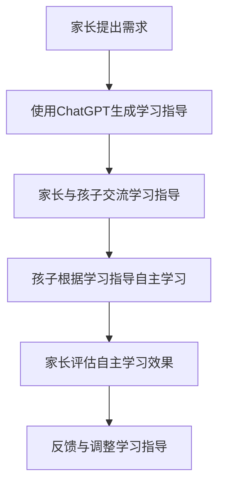
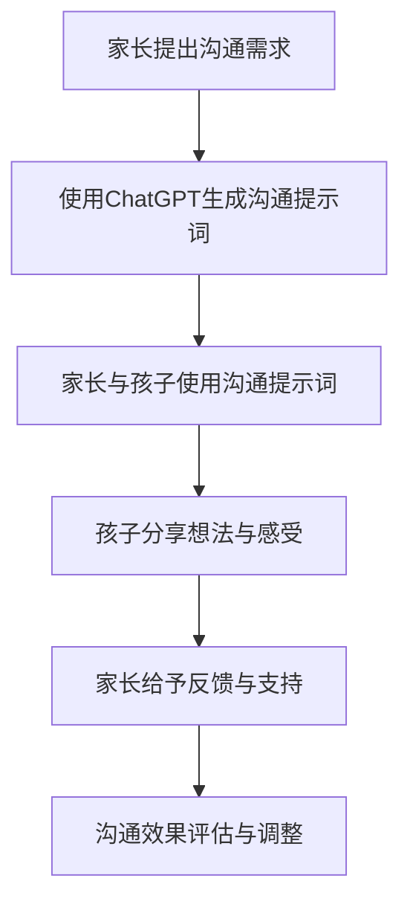
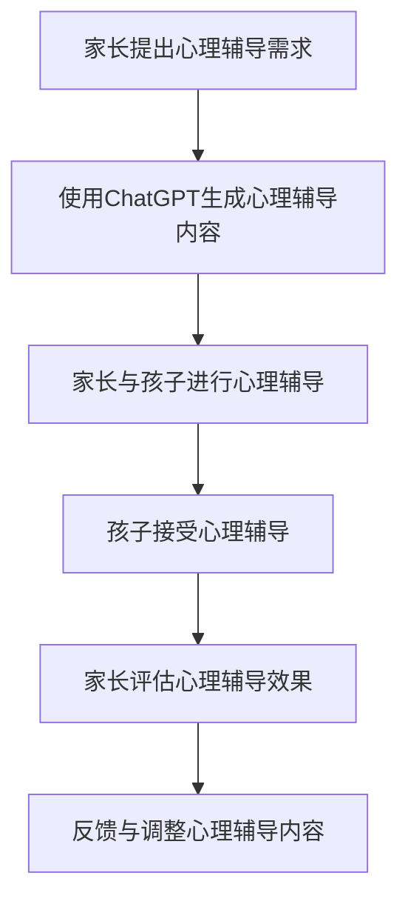
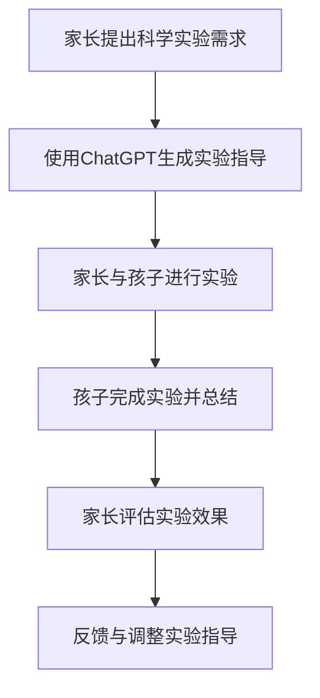

                 


### 文章标题

《ChatGPT在家庭教育中的应用：亲子互动指导提示词》

### 文章关键词

- ChatGPT
- 家庭教育
- 亲子互动
- 提示词
- 教育技术

### 文章摘要

本文旨在探讨ChatGPT在家庭教育中的应用，特别是如何通过亲子互动指导提示词，提升家长与孩子之间的沟通质量和教育效果。文章首先介绍了ChatGPT的基本概念与原理，然后分析了其在家庭教育中的各种应用场景，接着详细探讨了亲子互动指导提示词的设计与使用方法。最后，通过实际案例，展示了ChatGPT在家庭教育中如何发挥作用，并提出了一些最佳实践和注意事项。

## 第1章: ChatGPT的基本概念与原理

### 1.1 ChatGPT的定义与功能

ChatGPT是由OpenAI开发的一种基于Transformer模型的预训练语言模型。它通过大规模的语料库进行训练，可以生成连贯、自然的文本，并进行语义理解和推理。ChatGPT的名称来源于其核心功能——进行对话聊天（Chat）和生成文本（GPT），这里的“GPT”指的是“Generative Pre-trained Transformer”。

ChatGPT的主要功能包括：

- **自然语言生成**：根据输入的提示，生成连贯、自然的文本。
- **对话生成**：模拟人类对话，与用户进行自然互动。
- **语义理解**：理解输入文本的语义，并生成相关、有意义的回复。
- **语言翻译**：根据训练数据，实现不同语言之间的翻译。
- **文本分类**：根据输入文本，进行分类任务，如情感分析、新闻分类等。

### 1.2 ChatGPT的技术架构

ChatGPT的技术架构主要基于Transformer模型，这是一种用于处理序列数据的高级神经网络架构。Transformer模型的核心思想是自注意力机制（Self-Attention），它能够自动识别序列中重要的信息，并在生成过程中充分利用这些信息。

ChatGPT的技术架构主要包括以下几个部分：

- **编码器（Encoder）**：负责处理输入的序列数据，生成上下文信息。
- **解码器（Decoder）**：根据编码器生成的上下文信息，生成输出序列。
- **预训练（Pre-training）**：在大量的无监督语料库上进行的训练，以学习通用语言知识和规则。
- **微调（Fine-tuning）**：在特定任务上进行有监督的训练，以适应具体的应用场景。

### 1.3 ChatGPT的核心算法原理

ChatGPT的核心算法是基于Transformer模型，其核心原理包括自注意力机制（Self-Attention）和多头注意力（Multi-Head Attention）。

**自注意力机制**：自注意力机制允许模型在生成每个单词时，自动关注输入序列中的其他单词。这样，模型可以更好地理解输入文本的上下文，并生成更加连贯的输出。

**多头注意力**：多头注意力将输入序列分成多个子序列，并对每个子序列分别进行自注意力计算。这样，模型可以从不同角度理解输入文本，提高生成文本的质量。

以下是一个简化的伪代码，展示了ChatGPT的基本算法流程：

```python
def chatgpt(input_sequence):
    # 编码器处理输入序列
    encoded_sequence = encoder(input_sequence)
    
    # 解码器逐词生成输出序列
    output_sequence = []
    for i in range(len(input_sequence)):
        # 根据编码器的输出和当前生成的单词，生成下一单词的候选
        candidate_words = decoder(encoded_sequence, output_sequence)
        
        # 根据候选单词的概率，选择下一个单词
        next_word = select_word(candidate_words)
        
        # 将选择的单词添加到输出序列中
        output_sequence.append(next_word)
    
    return output_sequence
```

### 1.4 ChatGPT的优势与挑战

**优势**：

- **强大的文本生成能力**：ChatGPT能够生成高质量、连贯的文本，适用于各种文本生成任务。
- **广泛的应用场景**：ChatGPT可以应用于对话系统、文本生成、文本分类、语言翻译等多种场景。
- **高效的训练与推理**：Transformer模型在训练和推理过程中具有高效性，能够处理大规模的数据和复杂的任务。

**挑战**：

- **数据隐私与安全**：ChatGPT需要大量用户数据进行训练，存在数据隐私和安全问题。
- **伦理问题**：ChatGPT的生成文本可能会涉及伦理问题，如虚假信息传播、歧视性言论等。
- **训练资源需求**：ChatGPT的训练需要大量的计算资源和存储空间，对硬件设备有较高要求。

## 第2章: ChatGPT在家庭教育中的应用场景

### 2.1 ChatGPT在教育辅导中的应用

ChatGPT在教育辅导中具有广泛的应用潜力，主要包括以下方面：

- **学习内容推荐**：根据学生的兴趣、学习进度和知识水平，ChatGPT可以为学生推荐合适的学习内容，提高学习效率。
- **解题辅导与答疑**：ChatGPT可以为学生提供解题指导，解答学生在学习中遇到的问题，帮助学生更好地理解知识点。
- **学习进度跟踪与反馈**：ChatGPT可以实时跟踪学生的学习进度，为家长提供详细的反馈，帮助家长更好地了解孩子的学习情况。

以下是一个简单的伪代码示例，展示了ChatGPT如何为学生提供学习内容推荐：

```python
def recommend_learning_content(student_interest, student_progress, knowledge_level):
    # 根据学生的兴趣、学习进度和知识水平，从数据库中查询合适的学习内容
    suitable_content = database_query(student_interest, student_progress, knowledge_level)
    
    # 使用ChatGPT生成学习内容推荐文本
    recommendation_text = chatgpt(suitable_content)
    
    return recommendation_text
```

### 2.2 ChatGPT在亲子沟通中的应用

亲子沟通是家庭教育的重要组成部分，ChatGPT可以在这方面发挥重要作用，主要包括以下方面：

- **良好沟通的模型与技巧**：ChatGPT可以为学生和家长提供沟通模型与技巧，如如何倾听、如何表达等，帮助家长更好地与孩子沟通。
- **亲子对话的引导与启发**：ChatGPT可以根据家长的输入，引导亲子对话，启发家长与孩子之间的交流，促进亲子关系的建立。
- **跨代沟通障碍的解决**：ChatGPT可以帮助家长解决与孩子之间的沟通障碍，如语言差异、文化差异等，促进家庭内部的和谐与理解。

以下是一个简单的伪代码示例，展示了ChatGPT如何引导亲子对话：

```python
def guide_parent_child_conversation(parent_input):
    # 根据家长的输入，生成亲子对话的引导文本
    conversation_guidance = chatgpt(parent_input)
    
    return conversation_guidance
```

### 2.3 ChatGPT在儿童心理辅导中的应用

儿童心理辅导是家庭教育中的重要环节，ChatGPT可以在这方面发挥积极作用，主要包括以下方面：

- **儿童心理问题的识别与引导**：ChatGPT可以根据儿童的描述，识别可能存在的心理问题，并给出相应的引导和建议。
- **心理健康信息的提供**：ChatGPT可以为学生和家长提供心理健康信息，如心理疾病的知识、心理健康维护的方法等，帮助家长更好地关注和照顾孩子的心理健康。
- **个性化心理辅导方案**：ChatGPT可以根据儿童的特点和需求，生成个性化的心理辅导方案，帮助儿童更好地应对心理问题。

以下是一个简单的伪代码示例，展示了ChatGPT如何为儿童提供心理辅导：

```python
def provide_psychological_counseling(child_description):
    # 根据儿童的描述，识别可能存在的心理问题
    psychological_problem = identify_problem(child_description)
    
    # 根据识别的心理问题，生成心理辅导方案
    counseling_plan = chatgpt(psychological_problem)
    
    return counseling_plan
```

### 2.4 ChatGPT在家庭教育中的其他应用场景

除了上述应用场景，ChatGPT在家庭教育中还有其他广泛的应用潜力，如：

- **家庭活动建议**：ChatGPT可以根据家庭成员的兴趣和需求，提供合适的家庭活动建议，增强家庭成员之间的互动。
- **安全教育**：ChatGPT可以为学生和家长提供安全教育信息，如网络安全、交通安全等，提高家庭的安全意识。
- **家庭规则制定**：ChatGPT可以帮助家庭成员制定合理的家庭规则，促进家庭内部的和谐与秩序。

以下是一个简单的伪代码示例，展示了ChatGPT如何为家庭提供活动建议：

```python
def suggest_family_activities家庭成员_interests, family_preferences):
    # 根据家庭成员的兴趣和偏好，从数据库中查询合适的活动
    suitable_activities = database_query家庭成员_interests, family_preferences)
    
    # 使用ChatGPT生成活动建议文本
    activity_suggestion = chatgpt(suitable_activities)
    
    return activity_suggestion
```

## 第3章: 亲子互动指导提示词的设计与使用

### 3.1 亲子互动指导提示词的定义与作用

亲子互动指导提示词是一组用于引导家长与孩子进行有效互动的关键词汇或短语。这些提示词旨在帮助家长在与孩子交流时，更准确地表达自己的意图，更有效地理解孩子的需求，从而提升亲子沟通的质量。

亲子互动指导提示词的作用主要包括：

- **明确交流意图**：通过使用特定的提示词，家长可以更清晰地表达自己的观点和需求，减少误解和冲突。
- **引导深度对话**：提示词可以激发孩子分享自己的想法和感受，促进家长与孩子之间的深度交流。
- **提升教育效果**：通过有针对性的提示词，家长可以更有效地引导孩子学习，提高教育效果。

### 3.2 设计亲子互动指导提示词的方法

设计亲子互动指导提示词的方法主要包括以下几个步骤：

1. **需求分析**：了解家长和孩子的具体需求，确定需要解决的问题和达到的目标。
2. **关键词收集**：根据需求分析，收集与问题相关的关键词和短语。
3. **筛选与优化**：从收集的关键词中筛选出最合适的提示词，并进行优化，确保其表达清晰、易于理解。
4. **分类与组织**：将提示词按照主题或功能进行分类和组织，以便家长在使用时能够快速找到合适的提示词。

以下是一个示例，展示了如何设计一组亲子互动指导提示词：

- **需求分析**：家长希望改善与孩子的沟通，提高孩子的学习积极性。
- **关键词收集**：积极、鼓励、学习、兴趣、合作、尊重、理解等。
- **筛选与优化**：将关键词筛选为“鼓励学习”、“激发兴趣”、“尊重理解”等。
- **分类与组织**：将提示词分为“学习指导”、“情感交流”、“合作互动”三个类别。

### 3.3 使用ChatGPT生成亲子互动指导提示词

ChatGPT可以用于生成亲子互动指导提示词，以下是一个简单的伪代码示例：

```python
def generate_interactive_prompt_words主题，需求，目标）：
    # 根据主题、需求和目标，生成亲子互动指导提示词
    prompt_words = chatgpt(主题，需求，目标）
    
    return prompt_words
```

以下是一个示例，展示了如何使用ChatGPT生成一组亲子互动指导提示词：

```python
主题 = "学习指导"
需求 = "提高孩子的学习积极性"
目标 = "建立良好的学习氛围"

prompt_words = generate_interactive_prompt_words(主题，需求，目标）
print(prompt_words)
```

输出结果可能如下：

```
[
    "鼓励学习：宝贝，你今天学到了哪些新知识？",
    "激发兴趣：你对什么学科最感兴趣？",
    "建立目标：我们可以一起制定一个学习计划，好吗？",
    "合作互动：你需要我的帮助吗？我们一起完成作业吧！"
]
```

### 3.4 亲子互动指导提示词的使用技巧

在使用亲子互动指导提示词时，家长需要注意以下几点：

- **情境匹配**：选择与当前交流情境相匹配的提示词，确保提示词的有效性。
- **适时使用**：在交流过程中适时使用提示词，避免一次性给出过多提示词，以免孩子感到压力。
- **互动引导**：通过使用提示词，引导孩子分享自己的想法和感受，促进双向沟通。
- **持续调整**：根据孩子的反馈和交流效果，不断调整和优化提示词的使用。

以下是一个示例，展示了如何使用亲子互动指导提示词：

**情景**：家长希望了解孩子今天在学校的情况。

**使用提示词**：

1. "今天在学校有什么新鲜事儿吗？"
2. "有没有学到什么有趣的知识？"
3. "有没有和同学发生有趣的事情？"

**互动引导**：

- 孩子回答后，家长可以继续提问，如："听起来很有趣，能详细说说吗？"
- 如果孩子不愿回答，家长可以尝试使用情感交流类的提示词，如："我知道你不想说，但是如果你愿意，我可以帮你解决一些困难。"

通过这些技巧，家长可以更有效地使用亲子互动指导提示词，提升亲子沟通的质量。

## 第4章: ChatGPT与家庭教育实践结合的案例分析

### 4.1 案例分析1：利用ChatGPT提升儿童自主学习能力

背景介绍：

小明是一个10岁的孩子，他在学习中表现出一定的主动性，但缺乏持久性和系统性。家长希望利用技术手段提升小明的自主学习能力。

核心概念与联系：

- **ChatGPT**：用于生成学习指导和建议。
- **自主学习能力**：通过自我驱动、自我管理和自我评价等过程，实现个人学习目标的能力。

Mermaid流程图：



核心算法原理讲解：

ChatGPT在生成学习指导时，主要基于以下算法原理：

1. **自注意力机制**：ChatGPT通过自注意力机制，理解家长的需求和孩子的学习情况，生成有针对性的学习指导。
2. **生成式文本模型**：ChatGPT使用生成式文本模型，根据输入的上下文，生成连贯、自然的学习指导文本。

伪代码：

```python
def generate_learning_guidance(家长需求，孩子学习情况)：
    # 使用ChatGPT生成学习指导
    learning_guidance = chatgpt(家长需求，孩子学习情况)
    
    return learning_guidance
```

数学模型和公式：

在生成学习指导时，ChatGPT可以使用以下数学模型来评估学习指导的有效性：

$$
E = f(P, L)
$$

其中，$E$表示学习指导的有效性，$P$表示家长的需求，$L$表示孩子的学习情况。

详细讲解和举例说明：

1. 家长提出需求：家长希望孩子能够提高数学成绩，并培养良好的学习习惯。
2. 使用ChatGPT生成学习指导：
   ```
   学习指导：
   - 每天安排固定的学习时间，如下午4点至5点。
   - 在学习前，做好准备工作，如准备好学习材料、确保环境安静。
   - 学习过程中，保持专注，避免分心。
   - 每天学习后，总结学习内容，回顾重点知识点。
   ```
3. 家长与孩子交流学习指导：
   家长与孩子一起讨论学习指导，确保孩子理解并愿意执行。
4. 孩子根据学习指导自主学习：
   孩子按照学习指导进行学习，并记录学习进度和遇到的问题。
5. 家长评估自主学习效果：
   家长定期与孩子交流，了解学习进度和效果，并根据需要调整学习指导。

### 4.2 案例分析2：利用ChatGPT改善亲子沟通

背景介绍：

小明的父母发现与孩子的沟通存在困难，孩子不愿意主动分享自己的生活和想法。家长希望通过技术手段改善亲子沟通。

核心概念与联系：

- **ChatGPT**：用于引导亲子对话，促进沟通。
- **亲子沟通**：家长与孩子之间的交流，旨在增进相互理解、建立信任和解决冲突。

Mermaid流程图：



核心算法原理讲解：

ChatGPT在生成沟通提示词时，主要基于以下算法原理：

1. **自然语言生成**：ChatGPT根据家长的需求和孩子的特点，生成自然、流畅的沟通提示词。
2. **对话生成**：ChatGPT通过对话生成，模拟亲子对话，引导家长与孩子进行有效沟通。

伪代码：

```python
def generate_communication_prompts(家长需求，孩子特点)：
    # 使用ChatGPT生成沟通提示词
    communication_prompts = chatgpt(家长需求，孩子特点)
    
    return communication_prompts
```

数学模型和公式：

在生成沟通提示词时，ChatGPT可以使用以下数学模型来评估沟通效果：

$$
E = f(P, C)
$$

其中，$E$表示沟通效果，$P$表示家长的需求，$C$表示孩子的特点。

详细讲解和举例说明：

1. 家长提出沟通需求：家长希望改善与孩子的沟通，让孩子更愿意分享自己的想法和感受。
2. 使用ChatGPT生成沟通提示词：
   ```
   沟通提示词：
   - “宝贝，最近有什么新鲜事儿想和我分享吗？”
   - “我注意到你最近情绪有些低落，能和我说说原因吗？”
   - “你对什么话题感兴趣？我们可以一起聊聊。”
   ```
3. 家长与孩子使用沟通提示词：
   家长在与孩子交流时，根据实际情况选择合适的沟通提示词，引导孩子分享想法和感受。
4. 孩子分享想法与感受：
   孩子根据沟通提示词，逐步打开心扉，分享自己的生活和想法。
5. 家长给予反馈与支持：
   家长对孩子分享的内容给予积极的反馈和支持，表达理解和关心。
6. 沟通效果评估与调整：
   家长定期评估沟通效果，根据实际情况调整沟通提示词，以保持沟通的有效性。

### 4.3 案例分析3：利用ChatGPT进行儿童心理辅导

背景介绍：

小芳是一个12岁的女孩，最近在学习上遇到困难，情绪低落，不愿意与家人交流。家长希望通过技术手段进行儿童心理辅导。

核心概念与联系：

- **ChatGPT**：用于提供心理辅导和支持。
- **儿童心理辅导**：通过专业的心理知识和方法，帮助儿童解决心理问题，提高心理健康水平。

Mermaid流程图：



核心算法原理讲解：

ChatGPT在生成心理辅导内容时，主要基于以下算法原理：

1. **知识图谱**：ChatGPT通过知识图谱，获取专业的心理辅导知识和方法。
2. **生成式文本模型**：ChatGPT使用生成式文本模型，根据家长的需求和孩子的特点，生成个性化的心理辅导内容。

伪代码：

```python
def generate_psychological_counseling_content(家长需求，孩子特点)：
    # 使用ChatGPT生成心理辅导内容
    counseling_content = chatgpt(家长需求，孩子特点)
    
    return counseling_content
```

数学模型和公式：

在生成心理辅导内容时，ChatGPT可以使用以下数学模型来评估心理辅导效果：

$$
E = f(K, C)
$$

其中，$E$表示心理辅导效果，$K$表示知识图谱，$C$表示孩子的特点。

详细讲解和举例说明：

1. 家长提出心理辅导需求：家长希望帮助小芳克服学习困难，提高情绪稳定性。
2. 使用ChatGPT生成心理辅导内容：
   ```
   心理辅导内容：
   - “面对学习困难，我们要学会积极应对，相信自己的能力。”
   - “当你感到沮丧时，试着找出原因，并制定解决问题的计划。”
   - “与家人分享你的感受，他们会给予你支持和鼓励。”
   ```
3. 家长与孩子进行心理辅导：
   家长根据心理辅导内容，与小芳进行深入交流，帮助她理解自己的情绪，并寻找解决问题的方法。
4. 孩子接受心理辅导：
   小芳在家长的引导下，逐步接受心理辅导，学会积极面对困难，提高情绪稳定性。
5. 家长评估心理辅导效果：
   家长定期评估心理辅导效果，观察小芳在学习、情绪和行为方面的变化，并根据需要调整心理辅导内容。
6. 反馈与调整心理辅导内容：
   根据小芳的反馈和家长的经验，不断优化心理辅导内容，使其更符合小芳的需求。

### 4.4 案例分析4：ChatGPT在家庭教育中的其他实践应用

除了上述三个案例，ChatGPT在家庭教育中还有其他广泛的应用潜力。以下是一个简单的案例：

**案例背景**：

小华是一个活泼好动的孩子，对科学实验非常感兴趣。家长希望通过技术手段培养小华的实验能力，激发她的科学兴趣。

**核心概念与联系**：

- **ChatGPT**：用于提供科学实验指导和支持。
- **科学实验**：通过实践操作，培养孩子的观察力、思考力和动手能力。

**Mermaid流程图**：



**核心算法原理讲解**：

ChatGPT在生成科学实验指导时，主要基于以下算法原理：

1. **知识图谱**：ChatGPT通过知识图谱，获取科学实验的相关知识和方法。
2. **生成式文本模型**：ChatGPT使用生成式文本模型，根据家长的需求和孩子的特点，生成个性化的实验指导。

**伪代码**：

```python
def generate_experiment_guidance(家长需求，孩子特点)：
    # 使用ChatGPT生成科学实验指导
    experiment_guidance = chatgpt(家长需求，孩子特点)
    
    return experiment_guidance
```

**数学模型和公式**：

在生成科学实验指导时，ChatGPT可以使用以下数学模型来评估实验效果：

$$
E = f(K, C)
$$

其中，$E$表示实验效果，$K$表示知识图谱，$C$表示孩子的特点。

**详细讲解和举例说明**：

1. 家长提出科学实验需求：家长希望培养小华的实验能力，激发她的科学兴趣。
2. 使用ChatGPT生成科学实验指导：
   ```
   实验指导：
   - 准备材料：塑料瓶、水、肥皂水、彩笔等。
   - 实验步骤：将肥皂水倒入塑料瓶，用彩笔在瓶子上画出各种图案，然后观察瓶内水中的变化。
   - 实验结论：肥皂水在瓶内形成各种图案，说明肥皂水具有表面张力。
   ```
3. 家长与孩子进行实验：
   家长根据实验指导，与小华一起进行实验，观察实验现象，讨论实验结果。
4. 孩子完成实验并总结：
   小华在家长的引导下，完成实验，并总结实验过程和结果。
5. 家长评估实验效果：
   家长观察小华在实验过程中的表现，评估实验效果，并根据需要调整实验指导。
6. 反馈与调整实验指导：
   根据小华的反馈和家长的经验，不断优化实验指导，使其更符合小华的需求。

### 4.5 案例总结与反思

通过上述案例分析，我们可以看到ChatGPT在家庭教育中具有广泛的应用潜力。以下是案例总结与反思：

1. **优势**：
   - ChatGPT能够提供个性化的指导和支持，满足家长和孩子的个性化需求。
   - ChatGPT可以模拟亲子对话，促进家长与孩子之间的沟通和理解。
   - ChatGPT可以提供专业知识和方法，帮助家长和孩子解决实际问题。

2. **挑战**：
   - ChatGPT的生成文本可能存在不准确或不当的情况，需要家长进行审核和调整。
   - ChatGPT的训练和部署需要大量的计算资源和存储空间，对硬件设备有较高要求。
   - ChatGPT的伦理问题需要引起重视，确保其生成文本不涉及伦理问题。

3. **未来展望**：
   - 随着技术的不断发展，ChatGPT的功能将越来越强大，可以为家庭教育提供更多样化的支持。
   - 家长和教育者需要不断学习和掌握ChatGPT的使用方法，发挥其在家庭教育中的优势。
   - 需要进一步研究ChatGPT在教育领域的应用，探索其最佳实践和应用模式。

通过案例分析和反思，我们可以更好地了解ChatGPT在家庭教育中的应用价值，同时也需要关注其在应用过程中面临的挑战和问题。只有通过不断优化和改进，才能充分发挥ChatGPT在家庭教育中的潜力。

## 总结与展望

通过本文的详细探讨，我们可以看到ChatGPT在家庭教育中具有广泛的应用前景。从基本概念到具体应用，从设计亲子互动指导提示词到实际案例分析，ChatGPT在教育辅导、亲子沟通、儿童心理辅导等方面都展现出了强大的功能。这不仅为家长提供了有效的教育工具，也为孩子的成长提供了有力支持。

### 总结

1. **核心概念与联系**：ChatGPT作为一种预训练语言模型，通过自注意力机制和生成式文本模型，实现了高效的文本生成和对话生成。
2. **应用场景**：ChatGPT在教育辅导、亲子沟通、儿童心理辅导等方面有广泛的应用，如学习内容推荐、亲子对话引导、心理辅导方案生成等。
3. **亲子互动指导提示词**：通过设计和使用亲子互动指导提示词，可以提升家长与孩子的沟通质量，促进亲子关系的和谐。
4. **案例分析**：通过实际案例分析，展示了ChatGPT在家庭教育中的具体应用效果，包括提升儿童自主学习能力、改善亲子沟通、提供心理辅导等。

### 展望

1. **技术发展**：随着人工智能技术的不断发展，ChatGPT的功能将越来越强大，其应用领域也将进一步扩展。
2. **个性化支持**：ChatGPT可以通过更深入的学习和理解，为家长和孩子提供更个性化的支持，满足他们的多样化需求。
3. **伦理问题**：在应用过程中，需要重视ChatGPT的伦理问题，确保其生成文本不涉及不当内容。
4. **最佳实践**：需要不断探索和总结ChatGPT在家庭教育中的最佳实践，提高其应用效果。

### 最佳实践 Tips

1. **定期更新**：定期更新ChatGPT的训练数据和模型，以保持其生成文本的质量和相关性。
2. **家长参与**：家长应积极参与ChatGPT的使用，与孩子一起探索和讨论，提高互动效果。
3. **安全使用**：确保ChatGPT的使用安全，避免涉及隐私和安全问题。
4. **反馈与调整**：家长应根据使用效果，及时反馈和调整ChatGPT的指导内容，以适应家庭教育的需求。

通过本文的探讨，我们期待ChatGPT在家庭教育中能够发挥更大的作用，为家长和孩子提供更加有效、有趣的教育体验。

## 注意事项与拓展阅读

在使用ChatGPT进行家庭教育时，家长和教育者需要特别注意以下几点：

1. **内容审核**：确保ChatGPT生成的文本内容不包含不当或错误的信息，家长在使用前应进行仔细审核。
2. **沟通引导**：合理使用亲子互动指导提示词，避免过度依赖技术手段，家长应积极参与沟通，引导孩子表达自己的想法和感受。
3. **隐私保护**：在使用ChatGPT时，要注意保护孩子的隐私，避免泄露个人敏感信息。
4. **技术更新**：关注ChatGPT的技术发展和更新，定期调整和优化其在家庭教育的应用。

为了深入了解ChatGPT在家庭教育中的应用，读者可以参考以下拓展阅读资源：

1. **学术论文**：搜索相关学术论文，了解ChatGPT在人工智能和教育领域的最新研究进展。
2. **技术文档**：阅读OpenAI发布的ChatGPT技术文档，深入了解其工作原理和应用方法。
3. **教育技术书籍**：阅读关于教育技术、亲子沟通和家庭教育的专业书籍，了解相关理论和实践方法。
4. **在线课程**：参加相关的在线课程，学习ChatGPT在家庭教育中的应用技巧和最佳实践。

通过这些资源，读者可以进一步探索ChatGPT在家庭教育中的潜力，为孩子的成长提供更有力的支持。作者：AI天才研究院/AI Genius Institute & 禅与计算机程序设计艺术 /Zen And The Art of Computer Programming。

