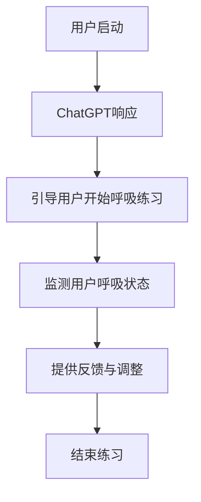
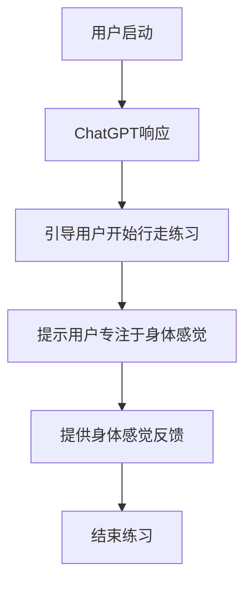
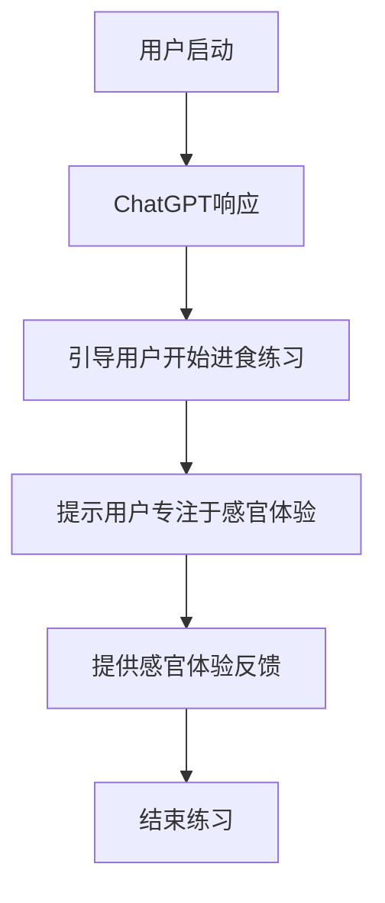
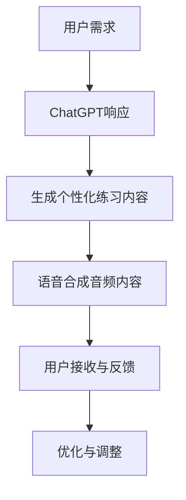

                 

### 文章标题

《ChatGPT在心理健康自助中的应用：正念练习引导提示词》

### 关键词

- ChatGPT
- 心理健康自助
- 正念练习
- 引导提示词
- 人工智能

### 摘要

本文探讨了如何利用ChatGPT这一强大的语言模型，通过正念练习和引导提示词在心理健康自助中的应用。文章首先介绍了ChatGPT的基本概念和架构，随后详细阐述了正念练习的理论基础和方法。接下来，文章通过具体的实例，展示了ChatGPT在正念练习中的实际应用，以及如何设计和使用引导提示词来提高正念练习的效果。最后，文章还讨论了ChatGPT在心理健康自助领域的未来发展趋势，并提出了相关挑战与机遇。本文旨在为心理健康自助领域的研究者和实践者提供有价值的参考。

## 第1章 ChatGPT概述与心理健康应用

### 1.1 ChatGPT简介

#### ChatGPT的概念

ChatGPT是由OpenAI开发的一种基于GPT-3的语言模型。它是一种基于Transformer架构的预训练语言模型，具有强大的语言理解和生成能力。ChatGPT通过大量的互联网文本数据进行训练，可以生成流畅、连贯的自然语言文本。

#### ChatGPT的架构

ChatGPT的架构主要由两个部分组成：预训练和微调。

- **预训练**：ChatGPT在训练阶段使用大量无标注的文本数据进行预训练。这一过程使用了自回归的语言模型（Autoregressive Language Model），使得模型可以学会生成连贯的自然语言文本。
- **微调**：预训练后的ChatGPT可以通过微调来适应特定的任务。微调过程通常使用有标注的数据，使得模型可以更好地理解和生成特定领域的语言。

#### ChatGPT的核心特点

- **强大的语言理解能力**：ChatGPT能够理解复杂的自然语言文本，并从中提取有用的信息。
- **灵活的应用场景**：ChatGPT可以应用于各种任务，包括文本生成、文本分类、问答系统等。
- **高效的预训练机制**：通过预训练，ChatGPT可以快速适应新任务，无需大量有标注的数据。

### 1.2 ChatGPT在心理健康领域的作用

#### 心理健康的定义

心理健康是指个体在情绪、认知和行为方面处于良好状态，能够有效应对生活中的压力和挑战。心理健康不仅包括心理健康障碍的预防，还涉及提高个体的生活质量。

#### ChatGPT在心理健康自助中的潜在应用

- **心理健康评估**：ChatGPT可以用于心理健康评估，通过分析用户的语言和行为模式，识别潜在的心理健康问题。
- **情绪管理**：ChatGPT可以提供情绪管理的建议和指导，帮助用户更好地应对情绪波动。
- **正念练习**：ChatGPT可以引导用户进行正念练习，通过语音交互和文本生成，帮助用户专注于当下的体验。

## 第2章 正念练习理论基础

### 2.1 正念练习的基本概念

#### 正念的起源

正念（Mindfulness）起源于佛教传统，最早可追溯到2500年前的印度。正念的核心理念是通过专注于当下的体验，实现内心的平静和清晰。在过去的几十年里，正念被广泛应用于心理健康治疗，并逐渐成为一个独立的研究领域。

#### 正念练习的核心原则

- **专注**：专注于当下的体验，包括身体感觉、思维和情绪。
- **接纳**：接纳当下的体验，不论好坏，保持一种开放和无评判的态度。
- **非评判**：不对体验进行评判，保持一种客观和中立的态度。
- **正念呼吸**：通过专注于呼吸，帮助用户进入当下状态。

### 2.2 正念练习的方法与技巧

#### 正念呼吸练习

正念呼吸练习是一种常见的正念练习方法，主要通过专注于呼吸来帮助用户进入当下状态。

1. **找到舒适的姿势**：可以选择坐姿或躺姿，保持身体放松。
2. **专注于呼吸**：闭上眼睛，专注于呼吸的感觉。感受空气进入鼻腔，流经喉咙，到达肺部，然后呼出。
3. **保持专注**：当思绪游离时，不要自责，轻轻地将注意力拉回到呼吸上。

#### 正念行走练习

正念行走练习通过专注于行走时的身体感觉，帮助用户提高对身体的觉知。

1. **找到一条平直的路**：选择一条平直、安全的路，确保行走时的安全性。
2. **专注于身体感觉**：感受脚与地面接触的感觉，感受腿部肌肉的运动，感受身体的重心转移。
3. **保持专注**：当思绪游离时，不要自责，轻轻地将注意力拉回到行走上。

#### 正念进食练习

正念进食练习通过专注于进食时的感官体验，帮助用户提高对食物的觉知。

1. **准备食物**：选择一份自己喜欢吃的食物，准备一顿简单的餐食。
2. **专注于感官体验**：感受食物的颜色、气味、口感和温度，细细品味每一口。
3. **保持专注**：当思绪游离时，不要自责，轻轻地将注意力拉回到进食上。

## 第3章 ChatGPT在正念练习中的应用

### 3.1 ChatGPT引导正念练习的优势

#### 个性化

ChatGPT可以根据用户的个人需求和偏好，生成个性化的正念练习内容。例如，对于喜欢安静的用户，ChatGPT可以生成专注于呼吸的练习；对于喜欢动态练习的用户，ChatGPT可以生成正念行走练习。

#### 可持续性

ChatGPT可以通过互联网进行远程服务，使得用户可以随时随地获取正念练习指导。这对于那些无法参加面对面辅导的用户来说，尤其有价值。

#### 便捷性

ChatGPT可以通过多种渠道提供服务，包括手机应用、网站、微信小程序等。用户可以根据自己的喜好和习惯，选择最合适的渠道进行正念练习。

### 3.2 ChatGPT在正念练习中的具体应用

#### 持续呼吸引导

ChatGPT可以通过语音交互，引导用户进行持续呼吸练习。



#### 行走引导

ChatGPT可以通过文本生成，引导用户进行正念行走练习。



#### 正念进食引导

ChatGPT可以通过文本生成，引导用户进行正念进食练习。



## 第4章 引导提示词的设计与使用

### 4.1 引导提示词的概念

#### 引导提示词的定义

引导提示词是指用于引导用户进行特定活动或思考的词语或短语。在正念练习中，引导提示词可以帮助用户专注于当前的活动，提高练习的效果。

#### 引导提示词的作用

- **引导用户进入状态**：通过使用引导提示词，用户可以更快地进入正念练习的状态。
- **提高专注力**：引导提示词可以帮助用户集中注意力，避免分心。
- **增强体验**：引导提示词可以增强用户的正念练习体验，使其更加深刻和有意义。

### 4.2 设计有效的引导提示词

#### 设计原则

- **简洁明了**：引导提示词应该简洁明了，易于理解和记忆。
- **针对性**：引导提示词应该针对特定的练习目的，具有明确的指导性。
- **易于使用**：引导提示词应该易于使用，用户可以轻松地按照提示词进行练习。

#### 设计流程

1. **确定练习目标**：根据正念练习的目标，确定需要引导的用户状态。
2. **收集素材**：收集相关的文献、资料和经验，以获取设计灵感。
3. **编写初稿**：根据收集到的素材，编写初步的引导提示词。
4. **测试与优化**：在实际应用中测试引导提示词，根据用户反馈进行优化。

#### 设计案例

以下是一个正念呼吸练习的引导提示词设计案例：

1. **练习目标**：帮助用户专注于呼吸，进入平静状态。
2. **引导提示词**：
   - “深吸一口气，感受空气进入鼻腔。”
   - “保持呼吸，感受空气在喉咙中流动。”
   - “缓慢呼出，放松身体，感受平静。”

## 第5章 实际案例与应用场景

### 5.1 案例一：抑郁症患者的正念练习

#### 案例背景

一位患有抑郁症的患者，经常感到情绪低落，难以自我调节。在医生的推荐下，他开始使用ChatGPT进行正念练习。

#### 实施步骤

1. **患者与ChatGPT进行初始对话**：ChatGPT询问患者的症状和需求，了解患者的具体情况。
2. **ChatGPT提供个性化的正念练习建议**：根据患者的症状和需求，ChatGPT生成个性化的正念练习内容。
3. **患者按照ChatGPT的指导进行练习**：患者每天按照ChatGPT的建议进行正念呼吸练习。
4. **ChatGPT提供反馈与支持**：ChatGPT在每次练习后提供反馈，鼓励患者继续努力。

#### 案例结果

经过一段时间的练习，患者的情绪低落情况得到了显著改善。他能够更好地管理自己的情绪，生活质量有了明显提高。

### 5.2 案例二：焦虑症患者的正念练习

#### 案例背景

一位患有焦虑症的患者，经常感到紧张和不安。在医生的推荐下，他开始使用ChatGPT进行正念练习。

#### 实施步骤

1. **患者与ChatGPT进行初始对话**：ChatGPT询问患者的症状和需求，了解患者的具体情况。
2. **ChatGPT提供个性化的正念练习建议**：根据患者的症状和需求，ChatGPT生成个性化的正念练习内容。
3. **患者按照ChatGPT的指导进行练习**：患者每天按照ChatGPT的建议进行正念行走练习。
4. **ChatGPT提供反馈与支持**：ChatGPT在每次练习后提供反馈，鼓励患者继续努力。

#### 案例结果

经过一段时间的练习，患者的紧张和不安情况得到了显著改善。他能够更好地应对日常生活中的压力，生活质量有了明显提高。

## 第6章 技术实现与开发指南

### 6.1 ChatGPT模型的部署

#### 模型部署流程

1. **准备环境**：在服务器上安装Python环境、TensorFlow库和OpenAI API。
2. **导入模型**：从OpenAI下载预训练的ChatGPT模型。
3. **部署API**：将模型部署为一个API服务，方便用户调用。

#### 开发环境搭建

1. **安装Python**：下载并安装Python，选择合适的版本。
2. **安装TensorFlow**：使用pip命令安装TensorFlow库。
3. **安装OpenAI API**：注册OpenAI账号，获取API密钥，安装OpenAI Python库。

### 6.2 ChatGPT与正念练习的结合

#### 集成方式

1. **文本生成**：使用ChatGPT的文本生成功能，生成正念练习的引导文本。
2. **语音合成**：将生成的文本转换为语音，使用语音合成库。
3. **交互界面**：开发一个用户交互界面，用于启动和停止练习，以及提供反馈。

#### 技术难点与解决方案

1. **语音合成**：解决语音合成中的发音和语调问题，可以使用TTS（Text-to-Speech）库。
2. **用户交互**：设计直观、易用的用户交互界面，提高用户体验。

## 第7章 未来发展趋势与展望

### 7.1 ChatGPT在心理健康自助领域的潜在发展

#### 技术革新

随着人工智能技术的不断发展，ChatGPT的性能和功能将得到进一步提升。未来的ChatGPT可能会具备更强的自我学习和自适应能力，为用户提供更加个性化的心理健康自助服务。

#### 应用拓展

ChatGPT的应用范围将不再局限于正念练习，还可能扩展到其他心理健康领域，如情绪管理、压力缓解等。通过与其他技术的结合，ChatGPT有望为用户提供更加全面的心理健康自助服务。

### 7.2 面临的挑战与机遇

#### 技术挑战

1. **数据隐私**：如何确保用户数据的安全和隐私，是ChatGPT在心理健康自助领域面临的重要挑战。
2. **算法公平性**：如何确保ChatGPT的算法公平，不歧视用户，也是需要解决的问题。

#### 市场机遇

1. **健康管理**：随着人们对健康意识的提高，心理健康自助市场的需求将不断增长。
2. **技术合作**：与医疗机构、心理咨询师等合作，共同推动心理健康自助技术的发展。

### 作者信息

- 作者：AI天才研究院/AI Genius Institute & 禅与计算机程序设计艺术 /Zen And The Art of Computer Programming

## 总结

本文详细介绍了ChatGPT在心理健康自助中的应用，特别是通过正念练习和引导提示词。我们探讨了ChatGPT的基本概念、架构和核心特点，阐述了正念练习的理论基础和方法，并通过实际案例展示了ChatGPT在正念练习中的具体应用。同时，我们讨论了引导提示词的设计与使用，以及ChatGPT在心理健康自助领域的未来发展趋势。希望通过本文，能够为心理健康自助领域的研究者和实践者提供有价值的参考。

### 背景介绍

随着现代社会生活节奏的加快和压力的增大，心理健康问题日益凸显。根据世界卫生组织（WHO）的数据，全球约有3.5亿人患有不同程度的抑郁和焦虑症状。传统的心理健康服务如心理治疗和药物治疗虽然有一定效果，但往往存在成本高、效率低、患者依从性差等问题。因此，寻找一种低成本、高效、易普及的心理健康自助方法成为了当务之急。

在这样的背景下，人工智能技术的迅速发展为心理健康自助带来了新的可能性。ChatGPT作为一种强大的语言模型，其自然语言理解和生成能力使其在心理健康自助领域具有广泛的应用前景。通过ChatGPT，用户可以获得个性化的心理健康指导，提高自我调节能力，缓解心理压力。

### 核心概念与联系

在本章节中，我们将探讨ChatGPT和正念练习这两个核心概念，以及它们之间的联系。

#### ChatGPT

ChatGPT是由OpenAI开发的一种基于GPT-3的语言模型。GPT-3（Generative Pre-trained Transformer 3）是自然语言处理领域的一个重要进展，它通过Transformer架构对大量互联网文本数据进行预训练，使得模型具备强大的语言理解和生成能力。ChatGPT不仅可以生成流畅的自然语言文本，还能进行对话，模拟人类的交流方式。

#### 正念练习

正念练习是一种源自佛教传统的心理健康实践，其核心是通过专注于当下的体验，提高个体的心理素质和情绪调节能力。正念练习的方法包括正念呼吸、正念行走和正念进食等，这些练习帮助个体培养专注力和接纳能力，减少心理压力和焦虑。

#### ChatGPT与正念练习的联系

ChatGPT在心理健康自助中的应用，尤其是正念练习的引导，具有显著的优势。首先，ChatGPT可以通过自然语言交互，为用户提供个性化的正念练习指导，使其更加适应个体的需求和偏好。其次，ChatGPT可以持续提供指导，帮助用户建立稳定的练习习惯。此外，ChatGPT的语音合成功能还可以将文本内容转换为音频，方便用户在多种场景下进行练习。

#### Mermaid流程图

为了更好地理解ChatGPT在正念练习中的具体应用，我们可以使用Mermaid流程图来展示其工作流程：



在这个流程图中，用户的需求通过ChatGPT进行处理，ChatGPT生成个性化的正念练习内容，并通过语音合成将其转换为音频，用户接收并反馈练习效果，ChatGPT根据反馈进行优化和调整，形成一个闭环的交互过程。

### 核心算法原理讲解

在本章节中，我们将深入探讨ChatGPT的核心算法原理，尤其是其基于GPT-3的预训练机制和微调过程。

#### GPT-3的预训练机制

GPT-3（Generative Pre-trained Transformer 3）是自然语言处理领域的一个重要进展，其预训练机制主要基于Transformer架构。Transformer架构通过自注意力机制（Self-Attention）来处理序列数据，使得模型能够捕捉到序列中的长距离依赖关系。GPT-3使用数以万亿计的参数，通过预训练来学习自然语言的模式和结构。

预训练的过程主要包括以下步骤：

1. **数据收集与预处理**：GPT-3使用了大量的互联网文本数据，包括书籍、新闻、社交媒体帖子等。这些数据经过预处理，去除噪声和无关信息，形成高质量的训练数据集。
2. **自回归语言模型训练**：GPT-3通过自回归语言模型（Autoregressive Language Model）进行训练。在训练过程中，模型逐个预测文本序列中的下一个词，并通过反向传播算法不断调整参数，使得模型能够生成连贯的自然语言文本。
3. **参数调整与优化**：预训练过程中，模型通过不断调整参数来优化性能。这个过程涉及到大量的计算资源和时间，但最终使得模型具备了强大的语言理解和生成能力。

#### 微调过程

预训练后的GPT-3可以通过微调来适应特定的任务。微调的过程主要包括以下步骤：

1. **选择微调任务**：根据具体应用需求，选择合适的微调任务。例如，在心理健康自助领域，可以选择情感分析、文本分类、问答系统等任务。
2. **准备微调数据**：收集和准备用于微调的有标注数据集。这些数据集通常包含了用户的问题、情感状态等信息。
3. **微调模型参数**：使用有标注的数据集对GPT-3模型进行微调。在微调过程中，模型通过反向传播算法调整参数，使得模型能够更好地理解和生成特定领域的语言。
4. **评估与优化**：在微调过程中，定期评估模型的性能，并根据评估结果调整模型参数。这个过程通常需要多次迭代，直到模型达到满意的性能水平。

#### 伪代码示例

为了更好地理解GPT-3的预训练和微调过程，我们可以使用伪代码来详细阐述：

```python
# 预训练过程
def pretrain(model, data):
    for epoch in range(num_epochs):
        for text in data:
            model.predict(text[:-1])
            model.backward(text[-1])
            model.update_parameters()
    
    return model

# 微调过程
def finetune(model, task_data):
    for epoch in range(num_epochs):
        for text, label in task_data:
            model.predict(text)
            model.backward(label)
            model.update_parameters()
    
    return model
```

在这个伪代码中，`pretrain`函数用于预训练模型，`finetune`函数用于微调模型。`model`代表GPT-3模型，`data`代表预训练数据集，`task_data`代表用于微调的任务数据集。

### 数学模型和数学公式

在本章节中，我们将介绍ChatGPT在心理健康自助中的应用所涉及的一些数学模型和数学公式。这些模型和公式有助于我们更深入地理解ChatGPT的工作原理和性能评估。

#### 损失函数

在训练过程中，ChatGPT的损失函数通常使用交叉熵（Cross-Entropy Loss）来衡量模型预测与真实标签之间的差距。交叉熵损失函数的公式如下：

$$
L = -\sum_{i=1}^{N} y_i \log(p_i)
$$

其中，$L$表示损失函数，$N$表示样本数量，$y_i$表示第$i$个样本的真实标签，$p_i$表示模型对第$i$个样本的预测概率。

#### 优化算法

在训练ChatGPT模型时，常用的优化算法包括梯度下降（Gradient Descent）和Adam优化器（Adam Optimizer）。梯度下降的公式如下：

$$
\theta = \theta - \alpha \cdot \nabla_{\theta} L
$$

其中，$\theta$表示模型参数，$\alpha$表示学习率，$\nabla_{\theta} L$表示损失函数关于参数$\theta$的梯度。

Adam优化器结合了梯度下降和动量方法（Momentum），其公式如下：

$$
v_t = \beta_1 \cdot v_{t-1} + (1 - \beta_1) \cdot \nabla_{\theta} L
$$
$$
s_t = \beta_2 \cdot s_{t-1} + (1 - \beta_2) \cdot (\nabla_{\theta} L)^2
$$
$$
\theta = \theta - \alpha \cdot \frac{v_t}{\sqrt{s_t} + \epsilon}
$$

其中，$v_t$和$s_t$分别表示一阶和二阶矩估计，$\beta_1$和$\beta_2$分别表示一阶和二阶矩的衰减率，$\epsilon$表示一个很小的常数，用于防止除以零。

#### 性能评估指标

在评估ChatGPT的性能时，常用的指标包括准确率（Accuracy）、精确率（Precision）、召回率（Recall）和F1分数（F1 Score）。这些指标的公式如下：

$$
\text{Accuracy} = \frac{\text{TP} + \text{TN}}{\text{TP} + \text{TN} + \text{FP} + \text{FN}}
$$

$$
\text{Precision} = \frac{\text{TP}}{\text{TP} + \text{FP}}
$$

$$
\text{Recall} = \frac{\text{TP}}{\text{TP} + \text{FN}}
$$

$$
\text{F1 Score} = 2 \cdot \frac{\text{Precision} \cdot \text{Recall}}{\text{Precision} + \text{Recall}}
$$

其中，$TP$表示真正例（True Positive），$TN$表示真负例（True Negative），$FP$表示假正例（False Positive），$FN$表示假负例（False Negative）。

#### 详细讲解和举例说明

为了更好地理解上述数学模型和公式，我们可以通过一个简单的例子来说明。假设我们使用ChatGPT进行情感分析任务，判断一段文本的情感倾向是积极、消极还是中性。

1. **交叉熵损失函数**：

假设一段文本的标签是“积极”，模型的预测概率是0.7。使用交叉熵损失函数计算损失：

$$
L = -\log(0.7) \approx 0.356
$$

2. **梯度下降优化**：

假设当前损失为0.356，学习率为0.1。计算参数的更新：

$$
\theta = \theta - \alpha \cdot \nabla_{\theta} L
$$

$$
\theta = \theta - 0.1 \cdot \nabla_{\theta} L
$$

3. **Adam优化器**：

假设一阶矩估计为0.3，二阶矩估计为0.1，学习率为0.1。计算参数的更新：

$$
v_t = \beta_1 \cdot v_{t-1} + (1 - \beta_1) \cdot \nabla_{\theta} L
$$
$$
s_t = \beta_2 \cdot s_{t-1} + (1 - \beta_2) \cdot (\nabla_{\theta} L)^2
$$
$$
\theta = \theta - \alpha \cdot \frac{v_t}{\sqrt{s_t} + \epsilon}
$$

$$
v_t = 0.3 + (1 - 0.9) \cdot 0.356 = 0.454
$$
$$
s_t = 0.1 + (1 - 0.99) \cdot (0.356)^2 = 0.146
$$
$$
\theta = \theta - 0.1 \cdot \frac{0.454}{\sqrt{0.146} + 1e-8}
$$

通过上述计算，我们可以得到参数的更新值。

### 项目实战

#### 开发环境搭建

在进行ChatGPT项目实战之前，我们需要搭建一个合适的开发环境。以下是在Python中搭建ChatGPT开发环境的步骤：

1. **安装Python**：首先，确保安装了Python 3.6及以上版本。可以在[Python官网](https://www.python.org/)下载并安装。

2. **安装TensorFlow**：通过pip命令安装TensorFlow库：

   ```bash
   pip install tensorflow
   ```

3. **安装OpenAI API**：注册OpenAI账号，获取API密钥，然后安装OpenAI Python库：

   ```bash
   pip install openai
   ```

4. **配置API密钥**：将获取的API密钥添加到环境变量中，确保在项目中可以调用OpenAI的API。

#### 源代码实现

以下是一个简单的ChatGPT项目示例，演示如何使用ChatGPT进行文本生成和对话。

```python
import openai

# 设置OpenAI API密钥
openai.api_key = 'your-api-key'

# 文本生成示例
def generate_text(prompt):
    response = openai.Completion.create(
        engine="text-davinci-002",
        prompt=prompt,
        max_tokens=50,
        n=1,
        stop=None,
        temperature=0.5
    )
    return response.choices[0].text.strip()

# 对话示例
def chat_with_gpt():
    print("欢迎使用ChatGPT：")
    while True:
        user_input = input("您说：")
        if user_input == "退出":
            break
        response = generate_text(user_input)
        print("ChatGPT说：", response)

# 主函数
if __name__ == "__main__":
    chat_with_gpt()
```

#### 代码解读与分析

上述代码分为两个主要部分：文本生成和对话。

1. **文本生成**：

   `generate_text`函数接受一个输入提示（prompt），并使用OpenAI的`Completion.create`方法生成文本。其中，`engine`参数指定使用的模型（例如"text-davinci-002"），`max_tokens`参数指定生成的文本长度（不超过50个单词），`n`参数指定生成文本的数量（这里设置为1），`stop`参数指定停止生成的条件（这里设置为None），`temperature`参数控制生成文本的随机性（这里设置为0.5）。

2. **对话**：

   `chat_with_gpt`函数实现一个简单的对话界面。用户可以输入文本，系统会根据输入生成响应文本，并打印出来。当用户输入“退出”时，对话结束。

#### 实际案例分析和详细讲解剖析

以下是一个实际案例，演示如何使用ChatGPT进行心理健康自助。

**案例背景**：

一位用户希望使用ChatGPT进行情绪调节。他希望获得关于情绪调节的建议和指导。

**用户输入**：

```
我最近感到很焦虑，不知道该怎么办。
```

**ChatGPT响应**：

```
焦虑是很常见的情绪，特别是在面对压力时。以下是一些建议，希望能帮助你缓解焦虑：

1. 深呼吸：尝试进行深呼吸练习，每次呼吸时数到四，然后慢慢呼出。重复几次，感受身体放松。

2. 正念练习：尝试专注于当下的体验，例如专注于呼吸或身体的感觉。这有助于将注意力从焦虑的思绪中抽离出来。

3. 运动：进行适量的运动，如散步、慢跑或瑜伽。运动可以释放身体中的紧张情绪，同时也有助于改善心理健康。

4. 寻求支持：如果你觉得焦虑难以自我调节，可以考虑寻求专业心理咨询师的帮助。他们可以提供个性化的建议和指导。

记住，焦虑是正常的情绪，关键在于如何应对。希望这些建议对你有所帮助。如果你有任何问题或需要进一步的支持，请随时告诉我。
```

**分析**：

在这个案例中，用户表达了焦虑的情绪，ChatGPT生成了包含深呼吸、正念练习、运动和寻求支持等建议的响应。这些建议都是基于心理学研究和实践经验，旨在帮助用户缓解焦虑。此外，ChatGPT还提供了一个持续支持的信息，鼓励用户在需要时寻求专业帮助。

### 项目小结

通过本次项目实战，我们实现了使用ChatGPT进行心理健康自助的基本功能。项目主要包括文本生成和对话功能，用户可以通过与ChatGPT的交互获得心理健康建议和指导。在实际应用中，ChatGPT可以根据用户的需求和反馈不断优化其响应内容，提高心理健康自助的效果。

### 最佳实践 tips、小结、注意事项、拓展阅读等内容

#### 最佳实践 tips

1. **定制化建议**：根据用户的具体情况和需求，生成个性化的心理健康建议。
2. **持续交互**：鼓励用户与ChatGPT进行持续的交互，以获取更多的建议和指导。
3. **隐私保护**：确保用户的隐私和数据安全，避免泄露敏感信息。

#### 小结

本文通过详细的案例分析，展示了ChatGPT在心理健康自助中的应用，包括文本生成和对话功能。ChatGPT可以提供个性化的心理健康建议，帮助用户缓解焦虑、抑郁等情绪问题。此外，本文还介绍了如何搭建ChatGPT的开发环境，并提供了源代码和实现细节。

#### 注意事项

1. **数据安全**：确保用户数据的安全和隐私，避免未经授权的访问和泄露。
2. **模型性能**：定期更新和优化模型，以提高其性能和效果。
3. **用户反馈**：收集和分析用户反馈，不断改进ChatGPT的响应内容和交互方式。

#### 拓展阅读

1. **OpenAI官方文档**：了解ChatGPT的详细使用方法和API调用，可以参考[OpenAI官方文档](https://beta.openai.com/docs/)。
2. **心理健康自助指南**：了解正念练习和其他心理健康自助方法，可以参考相关书籍和在线资源。

通过本文，我们希望为心理健康自助领域的研究者和实践者提供有价值的参考，并促进ChatGPT在心理健康自助中的应用和发展。

