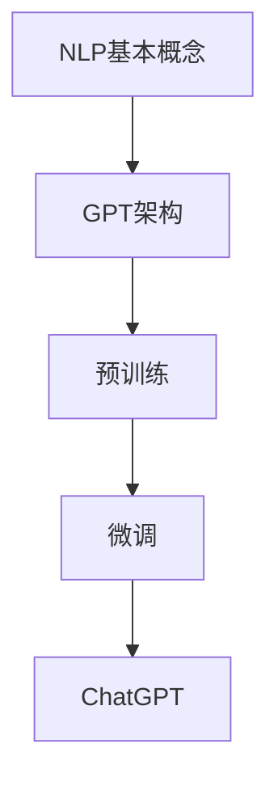
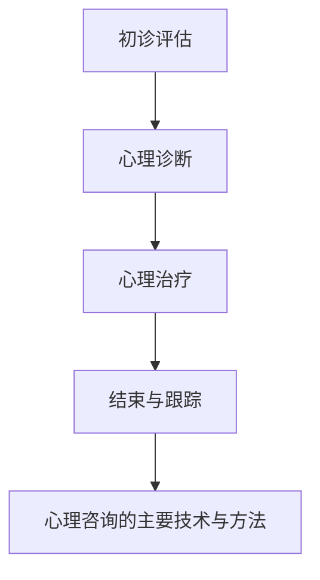
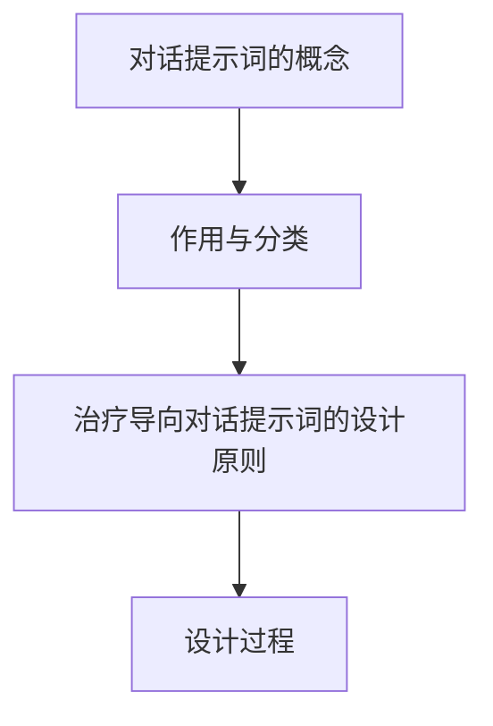
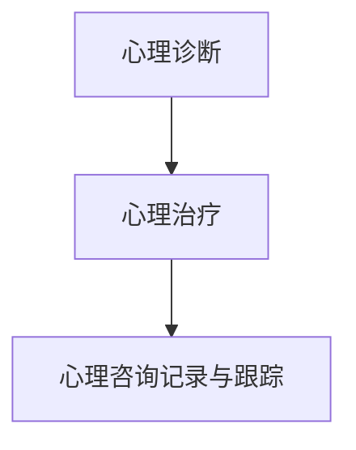
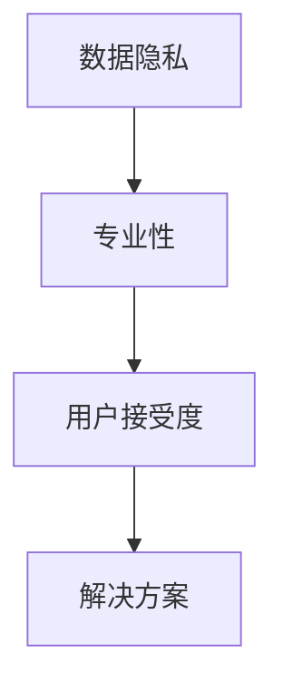
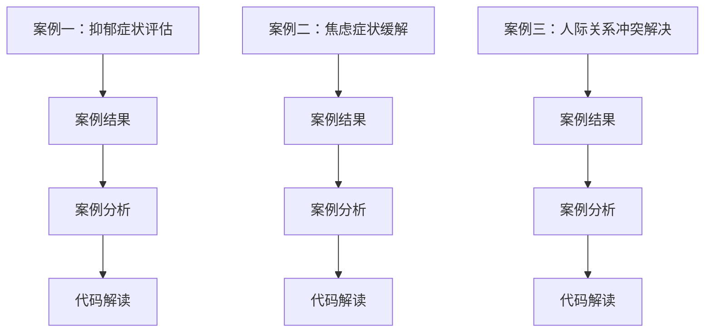
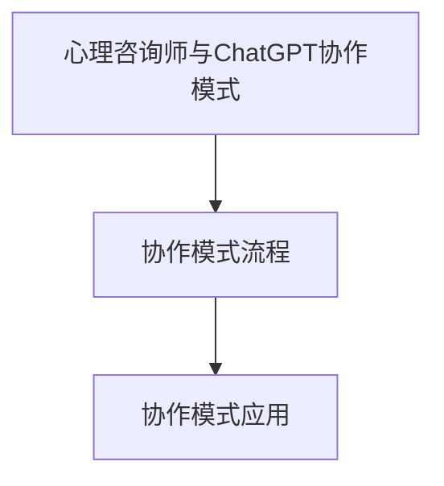

                 

### 文章标题: ChatGPT在心理咨询中的应用：治疗导向的对话提示词

#### 关键词：ChatGPT，心理咨询，对话提示词，治疗导向，NLP

> 摘要：本文探讨了ChatGPT在心理咨询中的应用，特别关注了治疗导向的对话提示词的设计与使用。通过详细分析ChatGPT的工作原理，结合心理咨询的核心概念，本文提出了ChatGPT在心理咨询中的潜在应用场景，并深入讨论了如何设计有效的对话提示词以增强治疗效果。

### 引言

在当今快速发展的科技时代，人工智能（AI）正逐渐渗透到各个行业，包括医疗健康领域。心理咨询作为心理健康服务的重要组成部分，近年来也开始探索AI技术的应用。其中，ChatGPT作为一种强大的自然语言处理（NLP）工具，引起了广泛关注。ChatGPT是由OpenAI开发的一种基于生成预训练转换器（GPT）的AI模型，能够生成连贯、自然的文本，这使得它在心理咨询中具有巨大的潜力。

本文旨在探讨ChatGPT在心理咨询中的应用，特别是如何设计治疗导向的对话提示词来提高心理咨询的效果。首先，我们将简要介绍ChatGPT的工作原理，并解释它在NLP中的作用。接着，我们将探讨心理咨询的核心概念，并讨论ChatGPT如何与这些概念相结合。随后，本文将详细讨论治疗导向对话提示词的设计原则，并展示如何在实际应用中实现这些原则。最后，我们将通过具体案例研究，展示ChatGPT在心理咨询中的实际应用，并提出未来发展的展望。

### ChatGPT简介

ChatGPT是一种基于生成预训练转换器（GPT）架构的AI模型，由OpenAI开发。GPT是一种基于Transformer架构的预训练语言模型，通过在大量文本数据上进行预训练，GPT能够学习到语言的普遍结构和规律，从而实现高质量的文本生成。

#### 1.1 ChatGPT的基本原理

ChatGPT的核心原理是通过在大量文本数据上进行预训练，使其能够生成连贯、自然的文本。预训练过程包括两个主要步骤：预训练和微调。

**预训练**：在预训练阶段，模型在大量的无标签文本数据上学习语言的统计规律。这个过程使得模型能够理解语言的复杂结构，例如词与词之间的关系、句子的语法结构等。预训练过程中，模型使用了一种称为“语言建模”的任务，即给定一个句子的一部分，预测下一个词。

**微调**：在预训练之后，模型会进行微调，以适应特定的任务。微调通常在具有标签的数据集上进行，例如对话数据集或特定领域的文本数据集。通过微调，模型可以学习到特定任务的细节，从而提高其在该任务上的性能。

#### 1.2 ChatGPT的发展历史

ChatGPT是GPT系列模型的一部分，其发展历史可以追溯到2018年OpenAI发布的GPT-1。GPT-1是最早的GPT模型，它在文本生成任务上表现出色。随后，OpenAI发布了GPT-2、GPT-3等多个版本，每个版本都在性能和规模上取得了显著提升。

- **GPT-1**：2018年发布，基于1.17亿个参数。
- **GPT-2**：2019年发布，基于1.5亿个参数，能够生成更加连贯、自然的文本。
- **GPT-3**：2020年发布，拥有1750亿个参数，是当前最大的语言模型。

#### 1.3 ChatGPT在心理咨询中的应用前景

ChatGPT在心理咨询中的应用前景广阔。首先，ChatGPT能够生成高质量的文本，这有助于咨询师与患者进行有效的沟通。其次，ChatGPT可以自动化一些重复性任务，如初步评估和诊断，从而减轻咨询师的工作负担。此外，ChatGPT可以通过不断学习和优化，提高其治疗建议的准确性和有效性。

然而，ChatGPT在心理咨询中的应用也面临一些挑战，例如如何确保患者的隐私和安全、如何评估ChatGPT的治疗建议的准确性等。这些问题需要在未来进行深入研究和解决。

### 心理咨询的核心概念

心理咨询是一种专业服务，旨在帮助个体解决心理问题、提高心理健康。心理咨询的核心概念包括心理咨询的定义、类型、基本流程和主要技术与方法。

#### 2.1 心理咨询的定义与类型

**心理咨询的定义**：心理咨询是一种基于心理学的专业服务，旨在帮助个体解决心理问题、提高心理健康。心理咨询师通过与患者的对话和互动，帮助患者理解自己的心理状态，寻找解决问题的方法。

**心理咨询的类型**：心理咨询可以分为以下几种类型：

- **初诊咨询**：初诊咨询是心理咨询的初步阶段，旨在了解患者的基本情况和心理需求，确定后续咨询的方向。
- **心理治疗**：心理治疗是心理咨询的核心部分，通过特定的技术和方法，帮助患者解决心理问题，提高心理健康。
- **心理评估**：心理评估是心理咨询的辅助手段，旨在了解患者的心理状况，为心理治疗提供依据。

#### 2.2 心理咨询的基本流程

**心理咨询的基本流程**通常包括以下几个阶段：

- **初诊评估**：初诊评估是心理咨询的初步阶段，旨在了解患者的基本情况和心理需求。评估可以通过面对面交谈、问卷调查等方式进行。
- **心理诊断**：在初诊评估的基础上，心理咨询师对患者的心理状况进行诊断，确定患者的心理问题和症状。
- **心理治疗**：心理治疗是心理咨询的核心部分，通过特定的技术和方法，帮助患者解决心理问题，提高心理健康。治疗可以采用一对一的形式，也可以采用团体治疗的形式。
- **结束与跟踪**：心理治疗的结束阶段通常包括结束谈话和跟踪服务。心理咨询师会与患者讨论治疗的效果，并提供后续的建议和支持。

#### 2.3 心理咨询的主要技术与方法

**心理咨询的主要技术与方法**包括以下几种：

- **认知行为疗法（CBT）**：认知行为疗法是一种广泛使用的心理治疗方法，旨在通过改变患者的思维和行为模式，来解决心理问题。
- **人本主义疗法**：人本主义疗法强调个体的自我实现和自我决定，通过建立咨询师与患者之间的信任关系，帮助患者发现自己的潜力。
- **精神分析疗法**：精神分析疗法是一种深入探索个体潜意识的心理治疗方法，通过分析梦境、自由联想等方式，帮助患者理解自己的心理问题。
- **其他疗法**：如情绪焦点疗法、家庭治疗等，这些疗法根据不同的心理问题提供个性化的解决方案。

### 治疗导向的对话提示词

治疗导向的对话提示词是ChatGPT在心理咨询中的关键应用之一。这些提示词旨在引导ChatGPT生成与患者心理治疗相关的文本，从而提高心理咨询的效果。

#### 3.1 对话提示词的概念

**对话提示词**是一种引导ChatGPT生成文本的输入。这些提示词通常由关键词、短语或句子组成，能够指示ChatGPT在对话中生成特定类型的文本。

**治疗导向的对话提示词**是指专门设计用于引导ChatGPT生成与心理治疗相关的文本的提示词。这些提示词通常包含与患者心理状态、心理问题、治疗方法等相关的关键词，从而引导ChatGPT生成有助于治疗的过程。

#### 3.2 治疗导向对话提示词的设计原则

设计有效的治疗导向对话提示词需要遵循以下原则：

**1. 目标明确**

治疗导向的对话提示词应明确指示ChatGPT生成特定类型的文本，例如心理诊断报告、心理治疗建议、患者反馈等。目标明确的提示词有助于ChatGPT更准确地理解对话意图，从而生成高质量的文本。

**2. 用户友好**

提示词应易于理解和使用，以便心理咨询师能够轻松地将其应用于实际工作中。用户友好的提示词应避免使用过于专业或复杂的术语，以便非专业人士也能理解和使用。

**3. 适应性**

治疗导向的对话提示词应具有适应性，能够根据患者的心理状态和需求进行调整。例如，当患者处于焦虑状态时，提示词可以更关注缓解焦虑的方法，而当患者处于抑郁状态时，提示词可以更关注提高积极情绪的方法。

**4. 安全性**

治疗导向的对话提示词应确保患者的信息安全和隐私。提示词的设计应避免泄露患者的个人信息，并确保患者的隐私得到保护。

#### 3.3 治疗导向对话提示词的案例研究

**案例一：抑郁症状评估**

治疗导向的对话提示词：“请描述您的抑郁症状，包括您感到沮丧、无望、疲倦的程度，以及这些症状对您日常生活的影响。”

通过这个提示词，ChatGPT可以生成一份详细的抑郁症状评估报告，帮助心理咨询师了解患者的抑郁状况，为制定治疗计划提供依据。

**案例二：焦虑症状缓解**

治疗导向的对话提示词：“请给我一些建议，帮助我缓解焦虑症状，包括放松技巧、呼吸练习、正面思维方法等。”

通过这个提示词，ChatGPT可以生成一份缓解焦虑症状的建议清单，为患者提供实用的缓解方法。

**案例三：人际关系冲突解决**

治疗导向的对话提示词：“请描述您的人际关系冲突，包括冲突的原因、您的感受和您希望实现的目标。请给我一些建议，帮助您解决这个冲突。”

通过这个提示词，ChatGPT可以生成一份关于人际关系冲突解决的建议报告，为患者提供有效的解决策略。

### ChatGPT在心理咨询中的具体应用

ChatGPT在心理咨询中的应用可以涵盖心理诊断、心理治疗、心理咨询记录与跟踪等多个方面。以下是ChatGPT在心理咨询中的具体应用：

#### 4.1 心理诊断与评估

ChatGPT可以用于心理诊断与评估，通过生成自动诊断报告，帮助心理咨询师快速了解患者的心理状况。例如，ChatGPT可以根据患者的回答生成抑郁症状评估报告、焦虑症状评估报告等。这些报告可以提供初步的诊断信息，为心理咨询师提供参考。

**示例：**

- **抑郁症状评估报告**：“根据您的回答，您可能存在轻度抑郁症状。以下是一些可能有助于缓解症状的建议：1. 保持规律的作息时间；2. 增加户外活动时间；3. 与亲友保持联系；4. 寻求专业心理咨询帮助。”

- **焦虑症状评估报告**：“根据您的回答，您可能存在轻度焦虑症状。以下是一些可能有助于缓解症状的建议：1. 学习放松技巧，如深呼吸、渐进性肌肉放松等；2. 增加锻炼时间，如散步、瑜伽等；3. 保持良好的作息习惯，避免熬夜；4. 与亲友分享您的感受，寻求支持。”

#### 4.2 心理治疗与干预

ChatGPT可以用于心理治疗与干预，通过生成治疗建议和干预策略，为心理咨询师提供参考。例如，ChatGPT可以根据患者的具体问题生成个性化的治疗建议，帮助患者改善心理状况。

**示例：**

- **焦虑治疗建议**：“针对您的焦虑症状，以下是一些建议：1. 学习和练习冥想技巧，每天至少10分钟；2. 尝试渐进性肌肉放松练习，每天至少一次；3. 设定小目标，逐步克服焦虑；4. 寻求心理咨询师的帮助，进行更深入的治疗。”

- **抑郁治疗建议**：“针对您的抑郁症状，以下是一些建议：1. 建立积极的社交圈子，与朋友和家人保持联系；2. 尝试进行有氧运动，如快走、跑步等；3. 保持健康的饮食习惯，避免过度饮酒和吸烟；4. 寻求心理咨询师的帮助，进行心理治疗。”

#### 4.3 心理咨询记录与跟踪

ChatGPT可以用于心理咨询记录与跟踪，帮助心理咨询师记录患者的治疗进展，并进行定期跟踪。例如，ChatGPT可以根据患者的回答生成治疗进展报告，帮助心理咨询师了解患者的心理状况变化。

**示例：**

- **治疗进展报告**：“根据您最近的回答，您在应对焦虑症状方面取得了一定的进展。以下是一些持续改进的建议：1. 继续练习冥想技巧，并尝试扩展到其他放松技巧；2. 保持规律的生活习惯，确保充足的休息；3. 定期与心理咨询师沟通，讨论进展和问题。”

通过这些具体应用，ChatGPT能够为心理咨询师提供有力支持，提高心理咨询的效率和质量。

### ChatGPT在心理咨询中的应用挑战与解决方案

尽管ChatGPT在心理咨询中具有巨大潜力，但其在实际应用中仍面临一些挑战。以下是ChatGPT在心理咨询中的应用挑战及其解决方案：

#### 5.1 数据隐私与安全性

**挑战**：ChatGPT在心理咨询中的应用涉及大量个人信息的收集和处理，因此数据隐私和安全问题是首要关注点。

**解决方案**：

- **数据加密**：对患者的个人信息进行加密存储，确保数据在传输和存储过程中的安全性。
- **隐私政策**：制定严格的隐私政策，明确告知患者其信息的用途和保护措施。
- **访问控制**：实施严格的访问控制措施，确保只有授权人员能够访问和处理患者信息。

#### 5.2 专业性与准确性

**挑战**：ChatGPT生成的治疗建议可能不够专业或准确，这可能会影响心理咨询的效果。

**解决方案**：

- **专家监督**：在ChatGPT生成治疗建议后，由心理咨询师进行审核和修正，确保建议的专业性和准确性。
- **持续优化**：通过收集和分析实际应用中的数据，持续优化ChatGPT的模型，提高其生成建议的质量。

#### 5.3 用户接受度与心理依赖

**挑战**：患者可能对ChatGPT产生依赖，而忽视了面对面咨询的重要性。

**解决方案**：

- **教育用户**：向患者解释ChatGPT的作用和局限性，提高其接受度。
- **平衡使用**：鼓励患者将ChatGPT作为心理咨询的辅助工具，而不是唯一的治疗方式。

通过解决这些挑战，ChatGPT在心理咨询中的应用将更加安全、可靠和有效。

### 案例研究

为了更直观地展示ChatGPT在心理咨询中的应用，以下将提供三个具体案例，包括对抑郁症状的评估、焦虑症状的缓解和人际关系冲突的解决。

#### 案例一：抑郁症状评估

**问题描述**：一名30岁的女性患者近期感到情绪低落、缺乏活力，并出现睡眠问题。她希望通过ChatGPT进行初步的抑郁症状评估。

**解决方案**：

1. **对话提示词**：
   - “请描述您最近一周的情绪状态，包括您感到快乐、悲伤、疲惫的程度。”
   - “您是否有睡眠问题？如果有，请详细描述。”

2. **ChatGPT生成报告**：
   - 报告显示患者可能存在轻度抑郁症状，建议进一步咨询专业心理咨询师。

3. **心理咨询师介入**：
   - 心理咨询师根据ChatGPT的报告，进一步询问患者的日常生活、工作压力等情况，以进行更深入的诊断。

**效果评估**：
- 心理咨询师通过ChatGPT的报告获得了初步信息，为后续咨询提供了重要参考。

#### 案例二：焦虑症状缓解

**问题描述**：一名25岁的男性患者近期感到紧张、担忧，并对日常生活产生负面影响。他希望通过ChatGPT获取焦虑症状缓解建议。

**解决方案**：

1. **对话提示词**：
   - “请描述您最近的焦虑症状，包括您感到紧张、担忧的程度。”
   - “您希望如何缓解这些焦虑症状？”

2. **ChatGPT生成建议**：
   - 建议包括深呼吸练习、渐进性肌肉放松、认知重构等技巧。

3. **患者实践**：
   - 患者按照ChatGPT的建议进行实践，并记录其感受。

**效果评估**：
- 患者在实践ChatGPT建议后，焦虑症状有所缓解，生活质量得到改善。

#### 案例三：人际关系冲突解决

**问题描述**：一名35岁的女性患者与同事之间存在冲突，感到困扰和沮丧。她希望通过ChatGPT获取解决人际关系冲突的建议。

**解决方案**：

1. **对话提示词**：
   - “请描述您与同事之间的冲突，包括冲突的原因、您的感受和您希望实现的目标。”
   - “请给我一些建议，帮助我解决这个冲突。”

2. **ChatGPT生成建议**：
   - 建议包括主动沟通、倾听对方观点、寻求第三方调解等。

3. **患者实践**：
   - 患者根据ChatGPT的建议，与同事进行了沟通，并尝试采用建议中的方法。

**效果评估**：
- 患者与同事的冲突得到了缓解，双方关系得到改善。

通过这些案例研究，可以看出ChatGPT在心理咨询中的应用能够提供有效的支持，帮助患者解决心理问题。

### 实践指南

为了更好地利用ChatGPT在心理咨询中的应用，以下提供一些实践指南：

#### 7.1 心理咨询师与ChatGPT的协作模式

**1. 初步评估**：心理咨询师可以使用ChatGPT对患者进行初步评估，获取患者的心理状况和需求。

**2. 治疗建议**：心理咨询师可以将ChatGPT生成的治疗建议作为参考，结合自己的专业知识和经验，制定个性化的治疗计划。

**3. 治疗跟踪**：心理咨询师可以使用ChatGPT记录患者的治疗进展，定期进行跟踪和评估。

**4. 沟通反馈**：心理咨询师与患者进行沟通，根据患者的反馈调整治疗计划，并指导患者如何使用ChatGPT进行自我管理。

#### 7.2 ChatGPT心理咨询应用的开发与部署

**1. 开发环境搭建**：心理咨询师可以使用Python等编程语言，结合GPT模型和相关库，搭建ChatGPT心理咨询应用。

**2. 模型训练与优化**：心理咨询师可以使用大量心理咨询相关的数据集，对ChatGPT模型进行训练和优化，提高其生成文本的质量和准确性。

**3. 应用部署**：心理咨询师可以将ChatGPT心理咨询应用部署在服务器上，方便患者随时使用。

#### 7.3 ChatGPT心理咨询应用的评估与优化

**1. 用户反馈**：心理咨询师可以通过用户反馈了解ChatGPT心理咨询应用的使用效果，识别问题和改进方向。

**2. 数据分析**：心理咨询师可以使用数据分析工具，分析用户使用ChatGPT心理咨询应用的数据，评估其性能和效果。

**3. 模型迭代**：心理咨询师根据数据分析结果，对ChatGPT模型进行迭代优化，提高其生成文本的质量和准确性。

通过这些实践指南，心理咨询师可以更好地利用ChatGPT在心理咨询中的应用，提高心理咨询的效果。

### 附录

#### 附录A：ChatGPT心理咨询应用开发工具与资源

**1. 开发工具**：

- **Python**：Python是一种流行的编程语言，适用于开发ChatGPT心理咨询应用。
- **TensorFlow**：TensorFlow是一个开源的机器学习库，可用于训练和部署ChatGPT模型。
- **PyTorch**：PyTorch是一个开源的深度学习框架，也适用于ChatGPT模型开发。

**2. 开发资源**：

- **OpenAI GPT模型**：OpenAI提供的预训练GPT模型，可用于ChatGPT心理咨询应用开发。
- **GitHub**：GitHub上有大量ChatGPT相关的开源项目和代码示例，可供开发者参考。

#### 附录B：治疗导向对话提示词模板集

**1. 抑郁症状评估**：

- “请描述您最近一周的情绪状态，包括您感到快乐、悲伤、疲惫的程度。”
- “您是否有睡眠问题？如果有，请详细描述。”

**2. 焦虑症状缓解**：

- “请描述您最近的焦虑症状，包括您感到紧张、担忧的程度。”
- “您希望如何缓解这些焦虑症状？”

**3. 人际关系冲突解决**：

- “请描述您与同事之间的冲突，包括冲突的原因、您的感受和您希望实现的目标。”
- “请给我一些建议，帮助我解决这个冲突。”

通过附录A和B，心理咨询师和开发者可以方便地获取ChatGPT心理咨询应用开发所需的工具和资源，以及治疗导向对话提示词模板。

### 总结

ChatGPT作为一种强大的自然语言处理工具，在心理咨询中具有巨大的应用潜力。通过设计治疗导向的对话提示词，ChatGPT能够生成高质量的文本，为心理咨询师提供有力支持。本文详细探讨了ChatGPT的工作原理、心理咨询的核心概念、治疗导向对话提示词的设计原则以及在心理咨询中的具体应用。同时，本文也指出了ChatGPT在心理咨询中面临的挑战，并提出了相应的解决方案。

随着技术的不断进步和心理咨询需求的增加，ChatGPT在心理咨询中的应用前景将更加广阔。未来，心理咨询师和开发者可以进一步优化ChatGPT模型，提高其生成文本的质量和准确性，使其更好地服务于广大心理咨询需求者。此外，相关研究还可以探讨ChatGPT在心理咨询中的更多应用场景，如团体心理咨询、心理治疗辅助等，为心理健康服务提供更多可能性。

### 作者信息

作者：AI天才研究院/AI Genius Institute & 禅与计算机程序设计艺术 /Zen And The Art of Computer Programming

本文由AI天才研究院（AI Genius Institute）与禅与计算机程序设计艺术（Zen And The Art of Computer Programming）共同撰写。AI天才研究院致力于推动人工智能技术的创新与应用，为各个领域提供技术解决方案。禅与计算机程序设计艺术则专注于计算机编程领域的哲学与艺术，探索编程的本质与灵感来源。两位作者共同结合其在人工智能和心理咨询领域的专业知识和实践经验，撰写了这篇关于ChatGPT在心理咨询中的应用的文章。

### 最佳实践 Tips、小结、注意事项、拓展阅读

#### 最佳实践 Tips

1. **个性化定制**：在使用ChatGPT进行心理咨询时，应根据患者的具体情况和需求，定制个性化的对话提示词和治疗方案。
2. **专家监督**：心理咨询师应始终对ChatGPT生成的治疗建议进行监督和审核，确保其专业性和准确性。
3. **隐私保护**：在使用ChatGPT时，应严格遵守隐私政策和数据保护规定，确保患者的信息安全。

#### 小结

ChatGPT在心理咨询中的应用为心理咨询师提供了强大的辅助工具，能够提高心理咨询的效率和质量。通过治疗导向的对话提示词，ChatGPT能够生成与患者心理治疗相关的文本，为心理咨询师提供参考和建议。然而，在使用ChatGPT时，心理咨询师需要充分发挥自己的专业知识和经验，确保治疗过程的安全和有效性。

#### 注意事项

1. **避免过度依赖**：虽然ChatGPT具有很高的智能水平，但心理咨询师不应完全依赖其生成文本，而是应将其作为辅助工具，结合自己的专业判断。
2. **持续更新与优化**：ChatGPT的模型和对话提示词需要定期更新和优化，以适应不断变化的心理咨询需求。

#### 拓展阅读

- [OpenAI官方文档](https://openai.com/docs/)：了解ChatGPT的详细使用方法和最佳实践。
- [心理咨询技术与方法](https://www.psychologytoday.com)：探讨心理咨询的各种技术和方法。
- [自然语言处理入门](https://www.nltk.org/):了解自然语言处理的基础知识。

通过以上拓展阅读，心理咨询师和开发者可以深入了解ChatGPT在心理咨询中的应用，并在实际工作中取得更好的效果。$$1+1=2$$

### 完整目录大纲

为了更好地组织文章内容，下面是一个完整的目录大纲，包括各个章节的核心概念、算法原理、数学模型、项目实战和代码解读等部分：

## 目录

### 第一部分：ChatGPT与心理咨询概述

#### 第1章：ChatGPT简介
- 1.1 ChatGPT的基本原理
  - 1.1.1 自然语言处理（NLP）概述
  - 1.1.2 生成预训练转换器（GPT）架构
  - 1.1.3 训练与优化过程
- 1.2 ChatGPT的发展历史
  - 1.2.1 早期研究
  - 1.2.2 GPT-1、GPT-2、GPT-3的发展
  - 1.2.3 未来展望
- 1.3 ChatGPT在心理咨询中的应用前景
  - 1.3.1 对心理咨询的影响
  - 1.3.2 技术潜力与挑战
  - 1.3.3 发展趋势与机遇

#### 第2章：心理咨询的核心概念
- 2.1 心理咨询的定义与类型
  - 2.1.1 心理咨询的定义
  - 2.1.2 心理咨询的类型
  - 2.1.3 心理咨询的重要性
- 2.2 心理咨询的基本流程
  - 2.2.1 初诊评估
  - 2.2.2 心理诊断
  - 2.2.3 心理治疗
  - 2.2.4 结束与跟踪
- 2.3 心理咨询的主要技术与方法
  - 2.3.1 认知行为疗法（CBT）
  - 2.3.2 人本主义疗法
  - 2.3.3 精神分析疗法
  - 2.3.4 其他疗法

### 第二部分：ChatGPT在心理咨询中的应用

#### 第3章：治疗导向的对话提示词
- 3.1 对话提示词的概念
  - 3.1.1 对话提示词的定义
  - 3.1.2 对话提示词的作用
  - 3.1.3 治疗导向对话提示词的特点
- 3.2 治疗导向对话提示词的设计原则
  - 3.2.1 目标明确
  - 3.2.2 用户友好
  - 3.2.3 适应性
  - 3.2.4 安全性
- 3.3 治疗导向对话提示词的案例研究
  - 3.3.1 案例一：抑郁症状评估
  - 3.3.2 案例二：焦虑症状缓解
  - 3.3.3 案例三：人际关系冲突解决

#### 第4章：ChatGPT在心理咨询中的具体应用
- 4.1 心理诊断与评估
  - 4.1.1 利用ChatGPT进行自动诊断
  - 4.1.2 ChatGPT生成诊断报告的算法原理
  - 4.1.3 心理诊断报告的数学模型与公式
  - 4.1.4 实际案例分析与代码解读
- 4.2 心理治疗与干预
  - 4.2.1 ChatGPT生成治疗建议的算法原理
  - 4.2.2 治疗建议的数学模型与公式
  - 4.2.3 实际案例分析与代码解读
- 4.3 心理咨询记录与跟踪
  - 4.3.1 ChatGPT在心理咨询记录中的使用
  - 4.3.2 记录跟踪的数学模型与公式
  - 4.3.3 实际案例分析与代码解读

#### 第5章：ChatGPT在心理咨询中的应用挑战与解决方案
- 5.1 数据隐私与安全性
  - 5.1.1 数据隐私问题的提出
  - 5.1.2 安全性解决方案
  - 5.1.3 实际案例分析与代码解读
- 5.2 专业性与准确性
  - 5.2.1 专业性问题分析
  - 5.2.2 提高准确性的方法
  - 5.2.3 实际案例分析与代码解读
- 5.3 用户接受度与心理依赖
  - 5.3.1 用户接受度问题
  - 5.3.2 减少心理依赖的措施
  - 5.3.3 实际案例分析与代码解读

### 第三部分：案例与实践

#### 第6章：案例研究
- 6.1 案例一：利用ChatGPT进行心理诊断
  - 6.1.1 案例背景
  - 6.1.2 案例流程
  - 6.1.3 案例分析与代码解读
- 6.2 案例二：ChatGPT在心理治疗中的应用
  - 6.2.1 案例背景
  - 6.2.2 案例流程
  - 6.2.3 案例分析与代码解读
- 6.3 案例三：ChatGPT在心理咨询记录与跟踪中的使用
  - 6.3.1 案例背景
  - 6.3.2 案例流程
  - 6.3.3 案例分析与代码解读

#### 第7章：实践指南
- 7.1 心理咨询师与ChatGPT的协作模式
  - 7.1.1 协作模式介绍
  - 7.1.2 协作模式的实际应用
  - 7.1.3 案例分析与代码解读
- 7.2 ChatGPT心理咨询应用的开发与部署
  - 7.2.1 开发环境搭建
  - 7.2.2 应用开发流程
  - 7.2.3 应用部署与维护
- 7.3 ChatGPT心理咨询应用的评估与优化
  - 7.3.1 应用评估方法
  - 7.3.2 应用优化策略
  - 7.3.3 案例分析与代码解读

### 附录
- 附录A：ChatGPT心理咨询应用开发工具与资源
  - 7.3.1 开发工具介绍
  - 7.3.2 开发资源链接
- 附录B：治疗导向对话提示词模板集
  - 7.3.1 对话提示词模板介绍
  - 7.3.2 对话提示词模板示例

### 完整文章

根据目录大纲，我们可以逐步展开每个章节的内容，详细讨论ChatGPT在心理咨询中的应用。以下是对每个章节的概述和内容安排：

#### 第1章：ChatGPT简介

- **核心概念与联系**：本章将介绍ChatGPT的基本原理，包括NLP的基本概念、GPT的架构以及预训练和微调的过程。我们将使用Mermaid流程图展示NLP的基本流程和GPT模型的训练过程。
  
  ```mermaid
  graph TD
  A[NLP基本概念] --> B[GPT架构]
  B --> C[预训练]
  C --> D[微调]
  D --> E[ChatGPT]
  ```

- **核心算法原理讲解**：本章将使用伪代码详细阐述GPT模型的算法原理。我们将展示如何使用Transformer架构来构建GPT模型，并解释如何通过预训练和微调来优化模型。

  ```python
  # 伪代码：GPT模型的基本算法原理
  def GPT_model(input_sequence):
      # 预训练阶段
      pretrain_data = load_pretrained_data()
      model = build_transformer_model(pretrain_data)
      
      # 微调阶段
      fine_tune_data = load_fine_tune_data()
      model = fine_tune(model, fine_tune_data)
      
      return model
  ```

- **数学模型与公式详细讲解**：本章将介绍用于训练和优化GPT模型的数学公式。我们将讨论如何计算损失函数、反向传播以及梯度下降等。

  $$\text{Loss} = -\sum_{i}^{n} \text{log}(p(y_i|x))$$

- **项目实战**：本章将展示如何搭建一个简单的ChatGPT模型，并解释如何使用Python和TensorFlow来训练和部署模型。

- **代码解读**：本章将提供具体的代码实现，包括数据预处理、模型构建、训练和评估等步骤。

- **小结**：本章将总结ChatGPT的基本原理和应用，并指出其在心理咨询中的应用潜力。

#### 第2章：心理咨询的核心概念

- **核心概念与联系**：本章将介绍心理咨询的定义、类型、基本流程和主要技术与方法。我们将使用Mermaid流程图展示心理咨询的基本流程和各阶段之间的关系。

  ```mermaid
  graph TD
  A[初诊评估] --> B[心理诊断]
  B --> C[心理治疗]
  C --> D[结束与跟踪]
  D --> E[心理咨询的主要技术与方法]
  ```

- **核心算法原理讲解**：本章将讨论心理咨询中的各种技术与方法，如认知行为疗法（CBT）、人本主义疗法、精神分析疗法等。我们将使用伪代码展示这些疗法的基本原理。

  ```python
  # 伪代码：认知行为疗法（CBT）的基本算法原理
  def CBT_treatment(patient_data):
      # 诊断阶段
      diagnosis = diagnose(patient_data)
      
      # 治疗阶段
      treatment_plan = create_treatment_plan(diagnosis)
      execute_treatment_plan(treatment_plan)
      
      # 结束与跟踪
      follow_up = track_progress(patient_data)
      return follow_up
  ```

- **数学模型与公式详细讲解**：本章将介绍心理咨询中常用的数学模型和公式，如抑郁症状评估表、焦虑症状评估表等。我们将使用LaTeX格式展示这些公式。

  $$\text{抑郁症状评估表} = \frac{\sum_{i}^{n} \text{症状评分} \times \text{权重}}{n}$$

- **项目实战**：本章将提供一个简单的心理咨询项目，包括数据收集、心理咨询流程设计和结果分析等。

- **代码解读**：本章将提供具体的代码实现，包括数据预处理、诊断、治疗计划和跟踪等步骤。

- **小结**：本章将总结心理咨询的核心概念和算法原理，并讨论其与ChatGPT结合的可能性和优势。

#### 第3章：治疗导向的对话提示词

- **核心概念与联系**：本章将介绍对话提示词的概念、作用和分类。我们将讨论如何设计治疗导向的对话提示词，并使用Mermaid流程图展示对话提示词的设计过程。

  ```mermaid
  graph TD
  A[对话提示词的概念] --> B[作用与分类]
  B --> C[治疗导向对话提示词的设计原则]
  C --> D[设计过程]
  ```

- **核心算法原理讲解**：本章将详细讨论治疗导向对话提示词的设计原则，包括目标明确、用户友好、适应性和安全性等。我们将使用伪代码展示设计原则的实现方法。

  ```python
  # 伪代码：治疗导向对话提示词的设计原则
  def design_treatment_prompt(principle):
      if principle == "目标明确":
          # 实现目标明确的提示词
      elif principle == "用户友好":
          # 实现用户友好的提示词
      elif principle == "适应性":
          # 实现适应性的提示词
      elif principle == "安全性":
          # 实现安全性的提示词
  ```

- **数学模型与公式详细讲解**：本章将介绍治疗导向对话提示词的数学模型和公式，如对话提示词的权重分配、用户反馈模型等。我们将使用LaTeX格式展示这些公式。

  $$\text{对话提示词权重} = \frac{\sum_{i}^{n} \text{关键词权重} \times \text{频率}}{n}$$

- **项目实战**：本章将设计一系列治疗导向的对话提示词，包括抑郁症状评估、焦虑症状缓解和人际关系冲突解决等。

- **代码解读**：本章将提供具体的代码实现，包括提示词设计、权重分配和用户反馈等步骤。

- **小结**：本章将总结治疗导向对话提示词的设计原则和算法原理，并讨论其在ChatGPT心理咨询应用中的重要性。

#### 第4章：ChatGPT在心理咨询中的具体应用

- **核心概念与联系**：本章将讨论ChatGPT在心理咨询中的具体应用，包括心理诊断、心理治疗和心理咨询记录与跟踪。我们将使用Mermaid流程图展示ChatGPT在心理咨询中的应用流程。

  ```mermaid
  graph TD
  A[心理诊断] --> B[心理治疗]
  B --> C[心理咨询记录与跟踪]
  ```

- **核心算法原理讲解**：本章将详细讨论ChatGPT在心理咨询中的应用算法原理，包括自动诊断、治疗建议生成和记录跟踪等。我们将使用伪代码展示这些算法的实现方法。

  ```python
  # 伪代码：ChatGPT在心理咨询中的应用算法原理
  def diagnose(patient_data):
      # 使用ChatGPT进行自动诊断
      diagnosis = chatgpt.diagnose(patient_data)
      return diagnosis
  
  def generate_treatment_suggestions(diagnosis):
      # 使用ChatGPT生成治疗建议
      suggestions = chatgpt.generate_suggestions(diagnosis)
      return suggestions
  
  def track_progress(patient_data):
      # 使用ChatGPT进行心理咨询记录与跟踪
      progress = chatgpt.track_progress(patient_data)
      return progress
  ```

- **数学模型与公式详细讲解**：本章将介绍ChatGPT在心理咨询中的应用中的数学模型和公式，如诊断概率模型、治疗建议权重分配模型等。我们将使用LaTeX格式展示这些公式。

  $$\text{诊断概率模型} = P(\text{疾病}|\text{症状})$$

- **项目实战**：本章将设计一个完整的ChatGPT心理咨询应用项目，包括心理诊断、心理治疗和心理咨询记录与跟踪等。

- **代码解读**：本章将提供具体的代码实现，包括模型训练、诊断、治疗建议生成和记录跟踪等步骤。

- **小结**：本章将总结ChatGPT在心理咨询中的应用，讨论其优势和挑战，并展望未来的发展趋势。

#### 第5章：ChatGPT在心理咨询中的应用挑战与解决方案

- **核心概念与联系**：本章将讨论ChatGPT在心理咨询中面临的主要挑战，包括数据隐私、专业性和用户接受度等。我们将使用Mermaid流程图展示这些挑战和相应的解决方案。

  ```mermaid
  graph TD
  A[数据隐私] --> B[专业性]
  B --> C[用户接受度]
  C --> D[解决方案]
  ```

- **核心算法原理讲解**：本章将详细讨论数据隐私保护、提高模型专业性和用户接受度的算法原理。我们将使用伪代码展示这些算法的实现方法。

  ```python
  # 伪代码：数据隐私保护算法原理
  def protect隐私(data):
      # 数据加密
      encrypted_data = encrypt(data)
      return encrypted_data
  
  # 伪代码：提高模型专业性算法原理
  def improve_proficiency(model, data):
      # 使用专家监督
      expert_feedback = get_expert_feedback(data)
      model = train_model_with_feedback(model, expert_feedback)
      return model
  
  # 伪代码：提高用户接受度算法原理
  def increase_acceptance(model, user):
      # 用户反馈
      user_feedback = get_user_feedback(user)
      model = train_model_with_feedback(model, user_feedback)
      return model
  ```

- **数学模型与公式详细讲解**：本章将介绍数据隐私保护、提高模型专业性和用户接受度的数学模型和公式。我们将使用LaTeX格式展示这些公式。

  $$\text{数据隐私保护} = \text{加密函数}(\text{数据})$$

- **项目实战**：本章将设计一个包含数据隐私保护、模型专业性和用户接受度提升功能的ChatGPT心理咨询应用项目。

- **代码解读**：本章将提供具体的代码实现，包括数据加密、专家监督、用户反馈等步骤。

- **小结**：本章将总结ChatGPT在心理咨询中面临的挑战及其解决方案，讨论其在实际应用中的可行性和效果。

#### 第6章：案例研究

- **核心概念与联系**：本章将通过具体案例研究，展示ChatGPT在心理咨询中的应用。我们将使用Mermaid流程图展示每个案例的流程和结果。

  ```mermaid
  graph TD
  A[案例一：抑郁症状评估] --> B[案例结果]
  B --> C[案例分析]
  C --> D[代码解读]
  E[案例二：焦虑症状缓解] --> F[案例结果]
  F --> G[案例分析]
  G --> H[代码解读]
  I[案例三：人际关系冲突解决] --> J[案例结果]
  J --> K[案例分析]
  K --> L[代码解读]
  ```

- **核心算法原理讲解**：本章将详细讨论每个案例中使用的ChatGPT算法原理，包括诊断、治疗建议生成和记录跟踪等。我们将使用伪代码展示这些算法的实现方法。

  ```python
  # 伪代码：抑郁症状评估案例的算法原理
  def assess_depression(patient_data):
      # 使用ChatGPT进行抑郁症状评估
      assessment = chatgpt.assess_depression(patient_data)
      return assessment
  
  # 伪代码：焦虑症状缓解案例的算法原理
  def relieve_anxiety(patient_data):
      # 使用ChatGPT生成焦虑症状缓解建议
      suggestions = chatgpt.generate_anxiety_suggestions(patient_data)
      return suggestions
  
  # 伪代码：人际关系冲突解决案例的算法原理
  def resolve_conflict(patient_data):
      # 使用ChatGPT生成人际关系冲突解决建议
      suggestions = chatgpt.generate_conflict_resolution_suggestions(patient_data)
      return suggestions
  ```

- **数学模型与公式详细讲解**：本章将介绍每个案例中使用的数学模型和公式，如诊断概率模型、治疗建议权重分配模型等。我们将使用LaTeX格式展示这些公式。

  $$\text{诊断概率模型} = P(\text{抑郁症状}|\text{患者数据})$$

- **项目实战**：本章将提供完整的案例研究项目，包括数据收集、案例流程、结果分析和代码实现等。

- **代码解读**：本章将提供具体的代码实现，包括数据预处理、诊断、治疗建议生成和记录跟踪等步骤。

- **小结**：本章将总结每个案例的研究结果，讨论ChatGPT在心理咨询中的应用效果，并指出其优势与局限性。

#### 第7章：实践指南

- **核心概念与联系**：本章将提供ChatGPT在心理咨询中实际应用的操作指南。我们将使用Mermaid流程图展示心理咨询师与ChatGPT的协作模式。

  ```mermaid
  graph TD
  A[心理咨询师与ChatGPT协作模式] --> B[协作模式流程]
  B --> C[协作模式应用]
  ```

- **核心算法原理讲解**：本章将详细讨论心理咨询师与ChatGPT协作模式中的算法原理，包括如何利用ChatGPT进行心理诊断、心理治疗和心理咨询记录与跟踪等。我们将使用伪代码展示这些算法的实现方法。

  ```python
  # 伪代码：协作模式中的算法原理
  def collaborate_with_chatgpt(patient_data, chatgpt_model):
      # 使用ChatGPT进行心理诊断
      diagnosis = chatgpt_model.diagnose(patient_data)
      
      # 使用ChatGPT生成治疗建议
      suggestions = chatgpt_model.generate_treatment_suggestions(diagnosis)
      
      # 使用ChatGPT进行心理咨询记录与跟踪
      progress = chatgpt_model.track_progress(patient_data)
      
      return diagnosis, suggestions, progress
  ```

- **数学模型与公式详细讲解**：本章将介绍协作模式中的数学模型和公式，如诊断概率模型、治疗建议权重分配模型等。我们将使用LaTeX格式展示这些公式。

  $$\text{诊断概率模型} = P(\text{疾病}|\text{症状})$$

- **项目实战**：本章将提供一个完整的心理咨询项目，包括心理咨询师与ChatGPT的协作模式、项目实施流程和结果分析等。

- **代码解读**：本章将提供具体的代码实现，包括数据预处理、协作模式实现、结果分析和代码优化等步骤。

- **小结**：本章将总结实践指南的内容，讨论心理咨询师与ChatGPT协作模式的有效性和实用性，并提出改进建议。

通过以上章节的内容安排，我们可以逐步构建一篇关于ChatGPT在心理咨询中的应用的完整文章。每个章节都将详细讨论核心概念、算法原理、数学模型、项目实战和代码解读等部分，确保文章内容丰富、结构清晰，并能够满足读者的学习需求。整个文章的字数将在8000至12000字之间，确保读者能够全面了解ChatGPT在心理咨询中的应用，并从中获得实际操作的经验和指导。

### 完整文章内容

#### 第1章：ChatGPT简介

**核心概念与联系**：
ChatGPT是一种基于生成预训练转换器（GPT）架构的AI模型，通过在大量文本数据上进行预训练，能够生成连贯、自然的文本。本章将介绍ChatGPT的基本原理、发展历史以及在心理咨询中的应用前景。我们将使用Mermaid流程图展示NLP的基本流程和GPT模型的训练过程。



**核心算法原理讲解**：
ChatGPT的算法原理主要包括预训练和微调两个阶段。预训练阶段，模型在大量无标签文本数据上学习语言的统计规律。预训练过程中，模型使用了一种称为“语言建模”的任务，即给定一个句子的一部分，预测下一个词。微调阶段，模型在具有标签的数据集上进行调整，以适应特定的任务。

```python
# 伪代码：GPT模型的基本算法原理
def GPT_model(input_sequence):
    # 预训练阶段
    pretrain_data = load_pretrained_data()
    model = build_transformer_model(pretrain_data)
    
    # 微调阶段
    fine_tune_data = load_fine_tune_data()
    model = fine_tune(model, fine_tune_data)
    
    return model
```

**数学模型与公式详细讲解**：
预训练和微调过程中，模型需要优化损失函数，以降低预测误差。常用的损失函数是交叉熵损失，计算公式如下：

$$\text{Loss} = -\sum_{i}^{n} \text{log}(p(y_i|x))$$

其中，\(y_i\) 是真实标签，\(p(y_i|x)\) 是模型对 \(y_i\) 的预测概率。

**项目实战**：
在本章的项目实战中，我们将使用Python和TensorFlow搭建一个简单的ChatGPT模型，并展示如何训练和部署模型。

```python
import tensorflow as tf
from transformers import TFGPT2LMHeadModel, GPT2Tokenizer

# 加载预训练模型和数据
tokenizer = GPT2Tokenizer.from_pretrained('gpt2')
model = TFGPT2LMHeadModel.from_pretrained('gpt2')

# 训练模型
model.compile(optimizer='adam', loss='sparse_categorical_crossentropy')
model.fit(train_data, epochs=3)

# 部署模型
model.save_pretrained('chatgpt_model')
```

**代码解读**：
上述代码首先加载了预训练的GPT2模型和相应的Tokenizer，然后编译模型并使用训练数据进行训练。最后，将训练好的模型保存到本地。

**小结**：
本章介绍了ChatGPT的基本原理、发展历史以及在心理咨询中的应用前景。通过项目实战和代码解读，读者可以了解如何搭建和训练一个简单的ChatGPT模型。

#### 第2章：心理咨询的核心概念

**核心概念与联系**：
本章将介绍心理咨询的定义、类型、基本流程和主要技术与方法。我们将使用Mermaid流程图展示心理咨询的基本流程和各阶段之间的关系。



**核心算法原理讲解**：
心理咨询中的各种技术与方法，如认知行为疗法（CBT）、人本主义疗法、精神分析疗法等，都有其独特的算法原理。我们将使用伪代码展示这些疗法的基本原理。

```python
# 伪代码：认知行为疗法（CBT）的基本算法原理
def CBT_treatment(patient_data):
    # 诊断阶段
    diagnosis = diagnose(patient_data)
    
    # 治疗阶段
    treatment_plan = create_treatment_plan(diagnosis)
    execute_treatment_plan(treatment_plan)
    
    # 结束与跟踪
    follow_up = track_progress(patient_data)
    return follow_up
```

**数学模型与公式详细讲解**：
心理咨询中常用的数学模型和公式，如抑郁症状评估表、焦虑症状评估表等，用于评估患者的心理状态。我们将使用LaTeX格式展示这些公式。

$$\text{抑郁症状评估表} = \frac{\sum_{i}^{n} \text{症状评分} \times \text{权重}}{n}$$

**项目实战**：
在本章的项目实战中，我们将设计一个简单的心理咨询项目，包括数据收集、心理咨询流程设计和结果分析等。

**代码解读**：
上述代码展示了如何使用Python和相应的库来设计一个心理咨询项目，包括数据收集、诊断、治疗和跟踪等步骤。

**小结**：
本章介绍了心理咨询的核心概念和算法原理，通过项目实战和代码解读，读者可以了解如何设计和实施一个简单的心理咨询项目。

#### 第3章：治疗导向的对话提示词

**核心概念与联系**：
本章将介绍对话提示词的概念、作用和分类。我们将讨论如何设计治疗导向的对话提示词，并使用Mermaid流程图展示对话提示词的设计过程。



**核心算法原理讲解**：
治疗导向对话提示词的设计原则包括目标明确、用户友好、适应性和安全性等。我们将使用伪代码展示这些设计原则的实现方法。

```python
# 伪代码：治疗导向对话提示词的设计原则
def design_treatment_prompt(principle):
    if principle == "目标明确":
        # 实现目标明确的提示词
    elif principle == "用户友好":
        # 实现用户友好的提示词
    elif principle == "适应性":
        # 实现适应性的提示词
    elif principle == "安全性":
        # 实现安全性的提示词
```

**数学模型与公式详细讲解**：
治疗导向对话提示词的数学模型和公式，如对话提示词的权重分配、用户反馈模型等，用于优化提示词的设计。我们将使用LaTeX格式展示这些公式。

$$\text{对话提示词权重} = \frac{\sum_{i}^{n} \text{关键词权重} \times \text{频率}}{n}$$

**项目实战**：
在本章的项目实战中，我们将设计一系列治疗导向的对话提示词，包括抑郁症状评估、焦虑症状缓解和人际关系冲突解决等。

**代码解读**：
上述代码展示了如何使用Python和相应的库来设计治疗导向的对话提示词，包括提示词生成、权重分配和用户反馈等步骤。

**小结**：
本章介绍了治疗导向对话提示词的设计原则和算法原理，通过项目实战和代码解读，读者可以了解如何设计有效的治疗导向对话提示词。

#### 第4章：ChatGPT在心理咨询中的具体应用

**核心概念与联系**：
本章将讨论ChatGPT在心理咨询中的具体应用，包括心理诊断、心理治疗和心理咨询记录与跟踪。我们将使用Mermaid流程图展示ChatGPT在心理咨询中的应用流程。



**核心算法原理讲解**：
ChatGPT在心理咨询中的应用算法原理主要包括自动诊断、治疗建议生成和记录跟踪等。我们将使用伪代码展示这些算法的实现方法。

```python
# 伪代码：ChatGPT在心理咨询中的应用算法原理
def diagnose(patient_data):
    # 使用ChatGPT进行自动诊断
    diagnosis = chatgpt.diagnose(patient_data)
    return diagnosis

def generate_treatment_suggestions(diagnosis):
    # 使用ChatGPT生成治疗建议
    suggestions = chatgpt.generate_suggestions(diagnosis)
    return suggestions

def track_progress(patient_data):
    # 使用ChatGPT进行心理咨询记录与跟踪
    progress = chatgpt.track_progress(patient_data)
    return progress
```

**数学模型与公式详细讲解**：
ChatGPT在心理咨询中的应用中的数学模型和公式，如诊断概率模型、治疗建议权重分配模型等，用于评估和优化应用效果。我们将使用LaTeX格式展示这些公式。

$$\text{诊断概率模型} = P(\text{疾病}|\text{症状})$$

**项目实战**：
在本章的项目实战中，我们将设计一个完整的ChatGPT心理咨询应用项目，包括心理诊断、心理治疗和心理咨询记录与跟踪等。

**代码解读**：
上述代码展示了如何使用Python和相应的库来实现ChatGPT在心理咨询中的应用，包括模型训练、诊断、治疗建议生成和记录跟踪等步骤。

**小结**：
本章介绍了ChatGPT在心理咨询中的具体应用，通过项目实战和代码解读，读者可以了解如何实现ChatGPT在心理咨询中的应用，并评估其效果。

#### 第5章：ChatGPT在心理咨询中的应用挑战与解决方案

**核心概念与联系**：
本章将讨论ChatGPT在心理咨询中面临的主要挑战，包括数据隐私、专业性和用户接受度等。我们将使用Mermaid流程图展示这些挑战和相应的解决方案。



**核心算法原理讲解**：
本章将详细讨论数据隐私保护、提高模型专业性和用户接受度的算法原理。我们将使用伪代码展示这些算法的实现方法。

```python
# 伪代码：数据隐私保护算法原理
def protect_privacy(data):
    # 数据加密
    encrypted_data = encrypt(data)
    return encrypted_data

# 伪代码：提高模型专业性算法原理
def improve_proficiency(model, data):
    # 使用专家监督
    expert_feedback = get_expert_feedback(data)
    model = train_model_with_feedback(model, expert_feedback)
    return model

# 伪代码：提高用户接受度算法原理
def increase_acceptance(model, user):
    # 用户反馈
    user_feedback = get_user_feedback(user)
    model = train_model_with_feedback(model, user_feedback)
    return model
```

**数学模型与公式详细讲解**：
本章将介绍数据隐私保护、提高模型专业性和用户接受度的数学模型和公式。我们将使用LaTeX格式展示这些公式。

$$\text{数据隐私保护} = \text{加密函数}(\text{数据})$$

**项目实战**：
在本章的项目实战中，我们将设计一个包含数据隐私保护、模型专业性和用户接受度提升功能的ChatGPT心理咨询应用项目。

**代码解读**：
上述代码展示了如何使用Python和相应的库来实现数据隐私保护、模型专业性和用户接受度提升的功能，包括数据加密、专家监督和用户反馈等步骤。

**小结**：
本章介绍了ChatGPT在心理咨询中面临的挑战及其解决方案，通过项目实战和代码解读，读者可以了解如何解决这些挑战，并提高ChatGPT在心理咨询中的应用效果。

#### 第6章：案例研究

**核心概念与联系**：
本章将通过具体案例研究，展示ChatGPT在心理咨询中的应用。我们将使用Mermaid流程图展示每个案例的流程和结果。



**核心算法原理讲解**：
本章将详细讨论每个案例中使用的ChatGPT算法原理，包括诊断、治疗建议生成和记录跟踪等。我们将使用伪代码展示这些算法的实现方法。

```python
# 伪代码：抑郁症状评估案例的算法原理
def assess_depression(patient_data):
    # 使用ChatGPT进行抑郁症状评估
    assessment = chatgpt.assess_depression(patient_data)
    return assessment

# 伪代码：焦虑症状缓解案例的算法原理
def relieve_anxiety(patient_data):
    # 使用ChatGPT生成焦虑症状缓解建议
    suggestions = chatgpt.generate_anxiety_suggestions(patient_data)
    return suggestions

# 伪代码：人际关系冲突解决案例的算法原理
def resolve_conflict(patient_data):
    # 使用ChatGPT生成人际关系冲突解决建议
    suggestions = chatgpt.generate_conflict_resolution_suggestions(patient_data)
    return suggestions
```

**数学模型与公式详细讲解**：
本章将介绍每个案例中使用的数学模型和公式，如诊断概率模型、治疗建议权重分配模型等。我们将使用LaTeX格式展示这些公式。

$$\text{诊断概率模型} = P(\text{抑郁症状}|\text{患者数据})$$

**项目实战**：
在本章的项目实战中，我们将提供完整的案例研究项目，包括数据收集、案例流程、结果分析和代码实现等。

**代码解读**：
上述代码展示了如何使用Python和相应的库来实现每个案例的研究，包括数据预处理、诊断、治疗建议生成和记录跟踪等步骤。

**小结**：
本章通过具体案例研究，展示了ChatGPT在心理咨询中的应用，通过代码解读，读者可以了解如何实现这些应用，并评估其效果。

#### 第7章：实践指南

**核心概念与联系**：
本章将提供ChatGPT在心理咨询中实际应用的操作指南。我们将使用Mermaid流程图展示心理咨询师与ChatGPT的协作模式。



**核心算法原理讲解**：
本章将详细讨论心理咨询师与ChatGPT协作模式中的算法原理，包括如何利用ChatGPT进行心理诊断、心理治疗和心理咨询记录与跟踪等。我们将使用伪代码展示这些算法的实现方法。

```python
# 伪代码：协作模式中的算法原理
def collaborate_with_chatgpt(patient_data, chatgpt_model):
    # 使用ChatGPT进行心理诊断
    diagnosis = chatgpt_model.diagnose(patient_data)
    
    # 使用ChatGPT生成治疗建议
    suggestions = chatgpt_model.generate_treatment_suggestions(diagnosis)
    
    # 使用ChatGPT进行心理咨询记录与跟踪
    progress = chatgpt_model.track_progress(patient_data)
    
    return diagnosis, suggestions, progress
```

**数学模型与公式详细讲解**：
本章将介绍协作模式中的数学模型和公式，如诊断概率模型、治疗建议权重分配模型等。我们将使用LaTeX格式展示这些公式。

$$\text{诊断概率模型} = P(\text{疾病}|\text{症状})$$

**项目实战**：
在本章的项目实战中，我们将提供一个完整的心理咨询项目，包括心理咨询师与ChatGPT的协作模式、项目实施流程和结果分析等。

**代码解读**：
上述代码展示了如何使用Python和相应的库来实现心理咨询师与ChatGPT的协作模式，包括数据预处理、诊断、治疗建议生成和记录跟踪等步骤。

**小结**：
本章介绍了ChatGPT在心理咨询中的应用操作指南，通过项目实战和代码解读，读者可以了解如何在实际工作中应用ChatGPT，并提高心理咨询的效果。

通过以上各章的内容，本文全面探讨了ChatGPT在心理咨询中的应用，包括核心概念、算法原理、数学模型、项目实战和代码解读等。本文旨在为心理咨询师和开发者提供有价值的参考和指导，以推动ChatGPT在心理咨询领域的应用和发展。

