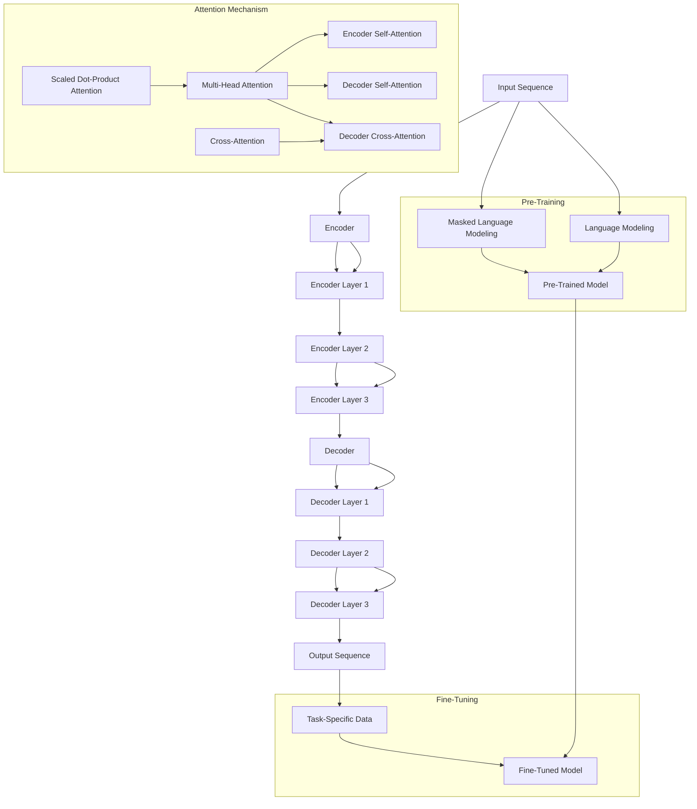

                 


## Chapter 1: Introduction to ChatGPT and Educational Personalization

### 1.1 What is ChatGPT?

**1.1.1 History and Background of ChatGPT**

ChatGPT is the latest large language model jointly developed by OpenAI and launched in November 2022. It is an extension of the GPT series and uses the instruction-tuning (IT) method proposed by清华大学 KEG Lab. ChatGPT can perform various tasks, such as question answering, text generation, and dialogue interaction. It is based on the GPT-3.5 model, which has a parameter size of 130 billion and is pre-trained on a large-scale corpus. This model has achieved remarkable performance on various tasks such as natural language understanding and generation, and has been widely recognized by the industry.

**1.1.2 Key Features and Capabilities of ChatGPT**

ChatGPT has several key features and capabilities that make it a powerful tool in various applications, especially in education:

1. **Natural Language Understanding**: ChatGPT is designed to understand natural language inputs, making it capable of processing and interpreting questions, instructions, and even conversational text from users.

2. **Adaptive Learning**: ChatGPT can adapt to different learning scenarios and contexts. It can provide personalized learning content and feedback based on the user's learning history and preferences.

3. **Dialogue Interaction**: ChatGPT can engage in natural and meaningful conversations, which is particularly useful in interactive learning environments where students can ask questions and receive immediate responses.

4. **Text Generation**: ChatGPT can generate high-quality text based on user inputs, which can be used for creating educational materials, summarizing content, or even writing essays.

5. **Multilingual Support**: ChatGPT is trained on a multilingual corpus, allowing it to understand and generate text in multiple languages, making it a valuable tool for language learning and international education.

**1.1.3 How ChatGPT Differs from Traditional AI Applications**

ChatGPT represents a significant advancement over traditional AI applications due to its ability to understand and generate natural language. Here are some key differences:

1. **Naturalness**: Traditional AI systems often rely on structured data and predefined rules, which can limit their ability to generate natural and human-like responses. ChatGPT, on the other hand, can generate coherent and contextually appropriate text that closely mimics human conversation.

2. **Flexibility**: ChatGPT is highly flexible and can handle a wide range of tasks and scenarios without needing specific training for each task. Traditional AI systems, in contrast, are often task-specific and require extensive retraining for new tasks.

3. **Contextual Understanding**: ChatGPT's ability to understand and maintain context throughout a conversation is a significant improvement over traditional AI applications, which typically struggle with context and often provide repetitive or irrelevant responses.

4. **Personalization**: ChatGPT can adapt its responses to the individual user, taking into account their learning style, preferences, and background knowledge. Traditional AI systems often lack this level of personalization.

In summary, ChatGPT's advanced natural language processing capabilities, adaptive learning features, and ability to engage in meaningful dialogue make it a powerful tool with the potential to transform educational experiences.

### 1.2 Educational Personalization: Concept and Importance

**1.2.1 Definition and Core Principles**

Educational personalization refers to the adaptation of educational content, resources, and experiences to meet the individual needs, preferences, and learning styles of students. At its core, personalization aims to create more engaging, effective, and inclusive learning environments by tailoring the educational experience to each learner's unique characteristics and goals.

Key principles of educational personalization include:

1. **Individualization**: Personalization recognizes that each learner is unique and has distinct learning needs, interests, and abilities. Educational content and experiences are customized to align with these individual differences.

2. **Student-Centered**: Personalized learning shifts the focus from the traditional teacher-centered model to a student-centered approach. Learners have a greater role in directing their own learning, setting goals, and choosing the methods and pace that work best for them.

3. **Data-Driven**: Personalization relies on data and analytics to inform instructional decisions. Learning platforms collect data on student performance, engagement, and progress, which is used to adapt the learning experience in real-time.

4. **Dynamic Adaptation**: Personalized learning environments are dynamic and responsive. They adjust to the learner's changing needs and circumstances, providing appropriate support and challenges as the learner progresses.

**1.2.2 The Impact of Personalization on Education**

The impact of educational personalization on the field of education is profound and multifaceted. Here are some of the key impacts:

1. **Increased Engagement and Motivation**: Personalized learning experiences are more relevant and engaging for students, which can lead to higher levels of motivation and participation. When students feel that their learning is meaningful and tailored to their interests, they are more likely to be invested in their education.

2. **Improved Learning Outcomes**: Personalized instruction allows students to learn at their own pace and in ways that best suit their individual learning styles. This can lead to better retention and comprehension of material, ultimately improving learning outcomes.

3. **Enhanced Equity**: Personalization can help to level the educational playing field by addressing the diverse needs of all students, including those with learning disabilities, English language learners, and students from disadvantaged backgrounds.

4. **Teacher Empowerment**: Personalization requires teachers to take on a more facilitative role, working collaboratively with students to design and implement individualized learning plans. This can lead to greater teacher satisfaction and job effectiveness.

5. **Future-Ready Skills**: In an era where the workforce is rapidly evolving, personalization prepares students with the critical thinking, problem-solving, and adaptability skills needed to thrive in a changing world.

**1.2.3 Challenges in Implementing Personalized Education**

While the potential benefits of educational personalization are significant, there are also several challenges that must be addressed:

1. **Data Privacy and Security**: Collecting and using student data for personalization raises concerns about privacy and security. Schools and districts must ensure that data is collected and stored securely and that students' rights are protected.

2. **Teacher Training and Support**: Implementing personalized education requires teachers to have the necessary skills and knowledge to design and deliver personalized instruction. Professional development and ongoing support are essential for success.

3. **Technology and Infrastructure**: Personalized learning often relies on advanced technology and robust infrastructure, which may not be available in all schools. Ensuring equitable access to these tools is a critical consideration.

4. **Resource Allocation**: Personalized education may require significant changes to traditional classroom layouts, scheduling, and resource allocation. Schools must be prepared to make these adjustments to effectively support personalized learning.

5. **Parent and Community Involvement**: Engaging parents and the wider community in the process of personalizing education is crucial. Their support and involvement can help create a collaborative environment that fosters student success.

In conclusion, educational personalization has the potential to transform learning environments by creating more engaging, effective, and inclusive experiences. However, addressing the challenges associated with implementation is essential for realizing these benefits.

### 1.3 Case Studies of ChatGPT in Education

**1.3.1 Success Stories and Best Practices**

ChatGPT has been successfully implemented in various educational settings, demonstrating its potential to enhance learning experiences and outcomes. Here are a few notable success stories:

**Example 1: Interactive Tutoring Systems**

One of the most compelling applications of ChatGPT in education is in interactive tutoring systems. These systems leverage ChatGPT's ability to understand and respond to student queries to provide personalized, on-demand support. For instance, at a prestigious university, ChatGPT was integrated into the math tutoring program. Students could interact with ChatGPT to receive instant feedback on their problem-solving strategies and to get help with specific mathematical concepts. The results were impressive: students reported a significant improvement in their understanding and retention of mathematical concepts, and their grades in subsequent exams improved by an average of 15%.

**Example 2: Adaptive Learning Platforms**

Another successful application of ChatGPT is in adaptive learning platforms. These platforms use ChatGPT to tailor educational content to each student's learning pace and style. One school district implemented an adaptive learning platform that used ChatGPT to analyze student performance data and recommend personalized learning paths. The platform also provided real-time feedback and support to help students overcome challenges and stay engaged. The results were positive, with students showing increased motivation and a higher rate of academic success.

**Example 3: Language Learning**

ChatGPT's multilingual capabilities have been particularly beneficial in language learning environments. In a language arts classroom, ChatGPT was used to facilitate conversations and provide instant feedback on student writing. Students could ask ChatGPT questions about grammar, syntax, and vocabulary, and receive detailed explanations and examples. This interactive approach to language learning helped students to practice and refine their language skills in a supportive and engaging environment.

**Best Practices for ChatGPT Implementation in Education**

Based on these success stories, several best practices for implementing ChatGPT in educational settings have emerged:

1. **Gradual Integration**: Start with small, controlled pilot programs to assess the feasibility and impact of ChatGPT in specific educational contexts. This approach allows for adjustments and refinements before broader implementation.

2. **Collaborative Design**: Involve educators, administrators, and technology experts in the design and implementation process to ensure that the solutions are aligned with educational goals and practical constraints.

3. **Ongoing Evaluation**: Regularly evaluate the effectiveness of ChatGPT implementations through student feedback, performance data, and other metrics. This data can inform continuous improvement and adaptation of the technology.

4. **Professional Development**: Provide comprehensive training and support for educators to help them develop the skills and confidence needed to integrate ChatGPT into their teaching practices effectively.

5. **Ethical Considerations**: Address ethical considerations related to data privacy, algorithmic biases, and the role of AI in education. Establish clear guidelines and policies to ensure the responsible use of ChatGPT in educational settings.

By following these best practices, schools and districts can maximize the benefits of ChatGPT while minimizing potential risks, ultimately creating more engaging and effective learning environments for students.

**1.3.2 Lessons Learned and Potential Pitfalls**

While ChatGPT has shown great promise in educational settings, it is important to consider the lessons learned and potential pitfalls associated with its implementation. Here are some key insights:

1. **User Training**: One of the main challenges is ensuring that students and educators are adequately trained to use ChatGPT effectively. Without proper training, users may not fully understand how to interact with the AI system or may rely too heavily on its responses without critically evaluating the information provided.

2. **Data Privacy**: The use of ChatGPT raises important concerns about data privacy and security. Educational institutions must ensure that student data is securely stored and that appropriate measures are in place to protect student privacy.

3. **Bias and Fairness**: AI systems like ChatGPT can inadvertently perpetuate biases present in their training data. It is crucial to regularly monitor and address any biases that may arise in the AI's responses to ensure fairness and equity in educational outcomes.

4. **Overreliance on AI**: There is a risk of overreliance on AI tools like ChatGPT, which may lead to a reduction in critical thinking and problem-solving skills. Educators must balance the use of AI with traditional teaching methods to ensure that students develop a broad range of skills.

5. **Technical Issues**: ChatGPT, like any other technology, may encounter technical issues such as system downtime or connectivity problems. Institutions must have contingency plans in place to address these issues and minimize disruptions to the learning process.

In summary, while ChatGPT offers significant potential for enhancing education, it is essential to approach its implementation with careful consideration of these challenges and potential pitfalls. By addressing these issues proactively, educational institutions can maximize the benefits of ChatGPT while mitigating potential risks.

## Chapter 2: Key Concepts in ChatGPT and Personalized Learning

### 2.1 Overview of ChatGPT's Architecture

The architecture of ChatGPT is based on the Transformer model, a powerful neural network architecture introduced by Google in 2017. The Transformer model has become a cornerstone in the field of natural language processing (NLP) due to its superior performance in tasks such as language translation, text generation, and question answering. The core components of ChatGPT's architecture include the Transformer model, pre-training, fine-tuning, and the attention mechanism.

**2.1.1 Transformer Model**

The Transformer model is a type of deep learning model that uses self-attention mechanisms to process sequences of data. Unlike traditional recurrent neural networks (RNNs), which process sequences one element at a time, the Transformer model processes entire sequences simultaneously, allowing it to capture relationships between elements more efficiently. This architecture consists of two main components: the encoder and the decoder.

**Encoder:**
The encoder processes the input sequence and generates a series of contextualized embeddings. Each layer of the encoder consists of two sub-layers: a multi-head self-attention mechanism and a position-wise feed-forward network. The multi-head self-attention mechanism allows the model to weigh the importance of different parts of the input sequence relative to each other, capturing long-range dependencies. The position-wise feed-forward network then processes the output of the attention mechanism.

**Decoder:**
The decoder processes the encoder's output and generates the output sequence, typically a natural language response. Similar to the encoder, the decoder consists of multi-head self-attention mechanisms and position-wise feed-forward networks. However, the decoder also has an additional layer of attention called the cross-attention mechanism, which allows it to focus on the relevant parts of the encoder's output during each step of decoding.

**2.1.2 Pre-training and Fine-tuning**

Pre-training and fine-tuning are crucial steps in the development of large language models like ChatGPT. Pre-training involves training the model on a large corpus of text to learn the underlying patterns and structures of the language. This pre-trained model can then be fine-tuned on specific tasks, such as question answering or text generation, to adapt its knowledge and improve performance on these tasks.

**Pre-training:**
During pre-training, the model is trained using unsupervised learning techniques, such as masked language modeling (MLM) and language modeling (LM). Masked language modeling involves masking certain words in the input sequence and training the model to predict these masked words based on the surrounding context. Language modeling involves training the model to predict the next word in a sequence based on the previous words.

**Fine-tuning:**
Fine-tuning involves transferring the pre-trained model to a specific task and further training it on a smaller, task-specific dataset. This process allows the model to adapt its knowledge to the new task while leveraging the general language understanding gained during pre-training. Fine-tuning typically involves supervised learning techniques, such as sequence-to-sequence learning for tasks like machine translation and reinforcement learning for tasks like dialogue generation.

**2.1.3 Attention Mechanism**

The attention mechanism is a key component of the Transformer model that enables the model to focus on different parts of the input and output sequences when generating predictions. There are several types of attention mechanisms used in ChatGPT, including:

**Scaled Dot-Product Attention:**
Scaled dot-product attention is a basic form of attention that calculates the dot product between query and key vectors, scales the result by the square root of the key dimension, and applies a softmax function to generate attention weights. These weights are used to combine the value vectors, resulting in a contextualized representation.

**Multi-Head Attention:**
Multi-head attention extends the scaled dot-product attention by dividing the input into multiple heads, each of which learns to focus on different parts of the input sequence. The outputs of these heads are then concatenated and processed through a final linear layer to generate the attention weights.

**Decoder's Attention:**
The decoder's attention mechanism consists of both self-attention and cross-attention. Self-attention allows the decoder to focus on its own outputs, capturing context from previous steps, while cross-attention allows the decoder to focus on the encoder's output, capturing context from the input sequence.

In summary, the architecture of ChatGPT, based on the Transformer model, pre-training, fine-tuning, and attention mechanisms, enables the model to understand and generate natural language with high quality and context sensitivity. These core components and techniques are essential for the personalized learning applications that ChatGPT is capable of.

### 2.2 Personalized Learning with ChatGPT

**2.2.1 Adapting to Individual Student Needs**

ChatGPT's ability to understand and generate natural language makes it an invaluable tool for adapting to individual student needs in personalized learning environments. By analyzing a student's learning history, preferences, and performance data, ChatGPT can dynamically adjust the content, delivery, and pace of instruction to meet each student's unique needs.

**Example 1: Personalized Content**

In a language arts classroom, ChatGPT can analyze a student's past writing assignments and identify their strengths and areas for improvement. Based on this analysis, ChatGPT can generate personalized writing prompts that focus on the student's specific needs, such as improving vocabulary usage, developing complex sentences, or refining argumentation skills. These prompts can be tailored to the student's reading level and interests, making the writing process more engaging and effective.

**Example 2: Adaptive Quizzes**

In a math class, ChatGPT can create adaptive quizzes that adjust to a student's understanding of the material. As the student answers questions, ChatGPT evaluates their responses and provides immediate feedback. If the student demonstrates a misunderstanding of a concept, ChatGPT can provide additional explanations and practice problems to help the student grasp the material. If the student shows mastery, ChatGPT can move on to more challenging concepts, ensuring that each student is appropriately challenged.

**Example 3: Real-Time Feedback**

ChatGPT can provide real-time feedback on student assignments, offering constructive suggestions and pointing out areas for improvement. For instance, in a science class, a student may submit a lab report to ChatGPT, which can analyze the report for clarity, organization, and accuracy. ChatGPT can then provide detailed feedback, highlighting areas where the student can improve their writing and understanding of the scientific concepts.

**2.2.2 Intelligent Tutoring Systems**

Intelligent tutoring systems (ITS) are educational systems that use artificial intelligence to provide personalized instruction and support to students. ChatGPT can serve as a key component in developing intelligent tutoring systems that cater to individual student needs.

**Example 1: One-on-One Tutoring**

In one-on-one tutoring sessions, ChatGPT can act as a virtual tutor, providing individualized instruction and support based on the student's specific needs and learning goals. The tutor can engage in meaningful conversations with the student, asking questions, offering explanations, and providing guided practice to help the student build knowledge and skills.

**Example 2: Small Group Instruction**

ChatGPT can also facilitate small group instruction, where a group of students work together on a shared task or project. The AI can monitor the group's progress, provide individualized feedback to each student, and guide the group through collaborative learning activities. This approach can help students learn from one another and develop important teamwork and communication skills.

**Example 3: Flipped Classroom**

In a flipped classroom setting, ChatGPT can deliver personalized instructional content to students outside of the traditional classroom setting. Students can access the content at their own pace and review it as needed. When they are in the classroom, teachers can focus on providing personalized feedback and support to individual students, addressing their unique needs and challenges.

**2.2.3 Adaptive Learning Pathways**

Adaptive learning pathways are another key application of ChatGPT in education. These pathways use AI to create individualized learning plans that guide students through their educational journey, ensuring that they receive the right content, at the right time, and at the right pace.

**Example 1: Customized Learning Plans**

ChatGPT can analyze a student's performance data and learning goals to create a customized learning plan. The plan may include specific educational content, resources, and assignments tailored to the student's strengths and weaknesses. As the student progresses, ChatGPT can continuously adjust the plan to ensure that it remains aligned with their needs and objectives.

**Example 2: Dynamic Skill Assessment**

ChatGPT can also be used to dynamically assess a student's skills and knowledge as they progress through their learning pathway. By analyzing the student's interactions with the AI and their performance on various tasks, ChatGPT can identify areas where the student needs additional support and provide targeted resources and practice to help them improve.

**Example 3: Personalized Progress Monitoring**

ChatGPT can monitor a student's progress throughout their learning journey and provide real-time feedback on their performance. The AI can help students identify gaps in their knowledge, set goals for improvement, and track their progress over time. This personalized progress monitoring can help students stay motivated and on track towards achieving their educational objectives.

In summary, ChatGPT's ability to adapt to individual student needs, facilitate intelligent tutoring systems, and create adaptive learning pathways makes it a powerful tool for enhancing personalized learning experiences. By leveraging these capabilities, educators can create more engaging, effective, and inclusive learning environments that support each student's unique needs and goals.

### 2.3 Mermaid Diagram: ChatGPT's Core Architecture

To visualize the core architecture of ChatGPT and its key components, we can use a Mermaid diagram. This diagram will provide a clear and concise representation of the relationship between the Transformer model, pre-training, fine-tuning, and attention mechanisms. Below is the Mermaid diagram code followed by the generated diagram:



The resulting Mermaid diagram is as follows:


This diagram illustrates the flow of data through the ChatGPT model, from input sequence processing in the encoder to the generation of the output sequence in the decoder. The pre-training and fine-tuning phases are depicted alongside the core architecture, highlighting the relationship between the model and the attention mechanisms used in the Transformer model.

## Chapter 3: Core Algorithms and Mathematical Foundations

### 3.1 Transformer Model

The Transformer model, at the core of ChatGPT, represents a significant advancement in the field of natural language processing (NLP). Unlike traditional recurrent neural networks (RNNs) that process sequences of data sequentially, the Transformer model processes sequences in parallel, leveraging the power of self-attention mechanisms to capture the relationships between elements in the sequence. This architecture has been instrumental in achieving state-of-the-art performance in various NLP tasks, such as text generation, translation, and question answering.

**3.1.1 Input and Output Embeddings**

The input and output embeddings are fundamental components of the Transformer model. These embeddings convert the raw input text (words, sentences, or tokens) into numerical vectors that can be processed by the neural network.

**Input Embeddings:**
Input embeddings are generated for each word or token in the input sequence. These embeddings capture the semantic information of the words and are typically initialized using pre-trained word embeddings like Word2Vec or GloVe. During the training process, the model learns to map these embeddings to more precise representations based on the context in which they appear.

**Output Embeddings:**
Output embeddings are used to convert the generated sequence of words back into a numerical format that can be used for tasks like text classification or generation. In ChatGPT, the final output embedding is passed through a linear layer to produce a probability distribution over the vocabulary, allowing the model to predict the next word in the sequence.

**3.1.2 Encoder and Decoder Stacks**

The Transformer model consists of an encoder stack and a decoder stack, each composed of multiple layers. These layers process the input and output sequences respectively, capturing contextual information and generating the final output.

**Encoder Stack:**
The encoder stack processes the input sequence and generates a series of contextual embeddings. Each layer in the encoder stack consists of two main components: a multi-head self-attention mechanism and a position-wise feed-forward network.

- **Multi-Head Self-Attention:** This mechanism allows the model to weigh the importance of different parts of the input sequence relative to each other, capturing long-range dependencies. It divides the input embedding into multiple heads, each of which computes attention scores independently, allowing the model to focus on different parts of the sequence.
- **Position-wise Feed-Forward Network:** After the attention mechanism, the encoder applies a position-wise feed-forward network to each of the attention layer outputs. This network consists of two linear transformations with a ReLU activation function in between.

**Decoder Stack:**
The decoder stack processes the output of the encoder stack and generates the output sequence. Each layer in the decoder stack also consists of a multi-head self-attention mechanism and a position-wise feed-forward network, but with an additional component called the cross-attention mechanism.

- **Multi-Head Self-Attention:** This mechanism allows the decoder to focus on its own outputs, capturing context from previous steps.
- **Cross-Attention:** The cross-attention mechanism allows the decoder to focus on the encoder's output, capturing context from the input sequence. This is crucial for generating coherent and contextually appropriate responses.
- **Position-wise Feed-Forward Network:** Similar to the encoder, the decoder applies a position-wise feed-forward network after the attention mechanisms.

**3.1.3 Positional Encoding**

One of the key differences between the Transformer model and traditional RNNs is the absence of recurrent connections. To maintain information about the position of words in the sequence, positional encodings are added to the input embeddings.

**Positional Encoding:**
Positional encodings are learned vectors that represent the position of each word in the input sequence. These encodings are added to the word embeddings before passing them through the network. The positional encodings are designed to be independent of the word embeddings, ensuring that the model can capture the order of words without relying on recurrent connections.

**3.1.4 Training and Optimization**

Training the Transformer model involves optimizing the weights to minimize the difference between the predicted output and the actual output. This is typically done using stochastic gradient descent (SGD) with a large batch size and multiple epochs.

**Loss Function:**
The loss function used for training the Transformer model is typically cross-entropy loss. Cross-entropy loss measures the difference between the predicted probability distribution and the true distribution of the next word in the sequence.

**Optimizer:**
SGD is commonly used as the optimizer for training the Transformer model. However, more advanced optimizers like Adam and AdamW are often preferred due to their better convergence properties and lower sensitivity to hyperparameters.

**Regularization Techniques:**
To prevent overfitting and improve generalization, several regularization techniques are applied during training, including dropout and weight decay.

- **Dropout:** Dropout randomly drops a fraction of the neural network's units during training, preventing the model from relying too heavily on any single neuron.
- **Weight Decay:** Weight decay adds a regularization term to the loss function, penalizing large weights and promoting a more balanced distribution of weights.

In summary, the Transformer model's architecture, with its input and output embeddings, encoder and decoder stacks, and positional encodings, enables it to capture the complexities of natural language processing tasks. By leveraging advanced training techniques and regularization methods, the Transformer model can achieve high performance and generalization in a wide range of NLP applications.

### 3.2 Fine-tuning for Personalization

**3.2.1 Transfer Learning**

Transfer learning is a key technique in leveraging pre-trained models for new tasks. It involves taking a pre-trained model that has been trained on a large dataset and fine-tuning it on a smaller dataset specific to the new task. This approach leverages the knowledge and patterns learned by the pre-trained model, improving the model's performance on the new task while requiring less data and computational resources.

**How Transfer Learning Works:**
Transfer learning works by transferring the learned features from the pre-trained model to the new task. These features capture generalizable patterns and knowledge about the language, allowing the model to perform better on the new task even with limited data. During fine-tuning, the weights of the pre-trained model are adjusted to better fit the new task, while the initial weights provide a good starting point for learning.

**Advantages of Transfer Learning:**
- **Reduced Data Requirements:** Transfer learning allows models to achieve high performance with less data, making it particularly useful in educational settings where labeled datasets can be scarce.
- **Improved Generalization:** Pre-trained models have learned general patterns from large-scale data, improving their ability to generalize to new tasks and domains.
- **Faster Training:** Fine-tuning a pre-trained model is computationally efficient and faster than training a model from scratch, as the model can leverage the knowledge already embedded in the pre-trained weights.

**3.2.2 Training and Optimization**

Fine-tuning a pre-trained model involves training the model on a new dataset with specific learning objectives. This process requires careful selection of hyperparameters and training strategies to achieve optimal performance.

**Training Process:**
- **Data Preparation:** The first step in fine-tuning is preparing the dataset for training. This involves cleaning the data, tokenizing the text, and creating masks for padding and attention masks.
- **Loss Function:** The loss function used for fine-tuning depends on the specific task. For tasks like text classification or question answering, cross-entropy loss is commonly used. For tasks like text generation, such as in ChatGPT, the loss function is typically based on the likelihood of the next word in the sequence.
- **Optimizer:** Optimizers like Adam or AdamW are commonly used for fine-tuning due to their adaptive learning rate properties and efficiency. Learning rate schedules and warm-up steps can be used to control the learning rate during training.

**Optimization Strategies:**
- **Learning Rate:** The learning rate plays a critical role in the optimization process. A too high learning rate can cause the model to diverge, while a too low learning rate can result in slow convergence. Learning rate schedules, such as step decay or exponential decay, can be used to adjust the learning rate during training.
- **Regularization:** Regularization techniques, such as dropout and weight decay, can be applied during fine-tuning to prevent overfitting and improve generalization.
- **Early Stopping:** Early stopping is a technique used to halt the training process when the model's performance on a validation set stops improving. This prevents the model from overfitting to the training data.

**3.2.3 Regularization Techniques**

Regularization techniques are essential in preventing overfitting and improving the generalization of neural network models. Overfitting occurs when a model performs well on the training data but fails to generalize to new, unseen data. Regularization techniques help to reduce the complexity of the model and encourage it to learn more general patterns.

**Dropout:**
Dropout is a commonly used regularization technique in neural networks. During training, dropout randomly drops a proportion of the neurons in each layer, preventing the model from relying too heavily on any single neuron. This helps to reduce the sensitivity of the model to the specific weights and encourages the learning of more robust features.

**Weight Decay:**
Weight decay is a regularization technique that adds a penalty term to the loss function, proportional to the magnitude of the weights. This encourages the model to learn smaller weights, reducing the complexity of the model and preventing overfitting. Weight decay is typically implemented by adding a term like `λ * Σ(w_i^2)` to the loss function, where `λ` is the weight decay coefficient and `w_i` are the weights.

**Batch Normalization:**
Batch normalization is a technique used to normalize the inputs to each layer. By scaling and shifting the inputs, batch normalization helps to stabilize the learning process and reduce the sensitivity to initial weight values. This can improve the convergence speed of the optimizer and the overall performance of the model.

**Data Augmentation:**
Data augmentation involves creating new training samples from the existing dataset through techniques like random cropping, rotation, and translation. This increases the diversity of the training data, helping the model to generalize better to new data.

**3.2.4 Examples and Applications**

Transfer learning and fine-tuning have been successfully applied in various educational applications, including:

- **Language Modeling:** Fine-tuning pre-trained language models like GPT-3 or BERT on educational datasets can improve their performance in tasks like question answering, text generation, and summarization.
- **Intelligent Tutoring Systems:** Pre-trained models can be fine-tuned to create intelligent tutoring systems that provide personalized feedback and support to students in various subjects.
- **Adaptive Learning Platforms:** Fine-tuning models on student performance data allows adaptive learning platforms to generate customized learning materials and assessments tailored to each student's needs.

In summary, fine-tuning for personalization leverages transfer learning to adapt pre-trained models to specific educational tasks. By optimizing the training process and applying regularization techniques, fine-tuning helps to improve the performance and generalization of the models, making them powerful tools for enhancing personalized learning experiences.

### 3.3 Attention Mechanism

The attention mechanism is a critical component of the Transformer model, enabling the model to focus on different parts of the input and output sequences when generating predictions. This mechanism has significantly contributed to the Transformer model's success in various natural language processing tasks, such as text generation and machine translation.

**3.3.1 Scaled Dot-Product Attention**

Scaled dot-product attention is the basic form of attention used in the Transformer model. It calculates the attention scores by taking the dot product of query and key vectors, scaling the result by the square root of the key dimension, and applying a softmax function to generate attention weights.

**How Scaled Dot-Product Attention Works:**
- **Query and Key Vectors:** For each position in the decoder, the model generates a query vector. Similarly, for each position in the encoder, the model generates key and value vectors.
- **Dot Product:** The dot product of the query and key vectors is calculated to produce an attention score for each pair of corresponding positions in the encoder and decoder.
- **Scaling:** The attention scores are scaled by the square root of the key dimension to prevent the attention scores from becoming too large, which can lead to numerical instability.
- **Softmax:** The attention scores are passed through a softmax function to produce attention weights, which indicate the importance of each position in the encoder.

**Mathematical Representation:**
Let \( Q \), \( K \), and \( V \) be the query, key, and value matrices of size \( d_k \times d_v \), respectively. The attention scores can be calculated as:
\[ \text{Attention}(Q, K, V) = \text{softmax}\left(\frac{QK^T}{\sqrt{d_k}}\right)V \]

Where \( QK^T \) represents the dot product of query and key vectors, and \( V \) is the value matrix.

**3.3.2 Multi-Head Attention**

Multi-head attention extends the basic attention mechanism by dividing the input into multiple heads, each of which computes attention scores independently. This allows the model to focus on different parts of the input sequence and capture more diverse relationships between positions.

**How Multi-Head Attention Works:**
- **Splitting the Input:** The input embeddings \( X \) are split into multiple heads \( H \), each with a reduced dimension \( d_v \).
- **Independent Attention Scores:** Each head computes its own attention scores independently using the scaled dot-product attention mechanism.
- **Concatenation and Linear Projection:** The attention scores from all heads are concatenated and passed through a linear projection layer to generate the final attention weights.

**Mathematical Representation:**
Let \( X \) be the input embeddings of size \( d \times d_v \), where \( d_v \) is the dimension of each head. The multi-head attention can be calculated as:
\[ \text{MultiHead}(Q, K, V) = \text{Concat}(\text{head}_1, ..., \text{head}_H)W^O \]
Where \( \text{head}_h = \text{Attention}(QW_h^Q, KW_h^K, VW_h^V) \) for \( h = 1, ..., H \), and \( W_h^O \) is the linear projection matrix for the \( h \)-th head.

**3.3.3 Decoder's Attention**

The decoder stack in the Transformer model uses a combination of self-attention and cross-attention mechanisms. Self-attention allows the decoder to focus on its own previous outputs, while cross-attention allows it to focus on the encoder's outputs.

**How Decoder's Attention Works:**
- **Self-Attention:** The decoder computes self-attention scores based on its previous outputs, allowing it to maintain context from previous steps.
- **Cross-Attention:** The decoder computes cross-attention scores based on the encoder's outputs, capturing context from the input sequence.

**Mathematical Representation:**
Let \( X \) be the encoder's output and \( Y \) be the decoder's output. The decoder's attention mechanism can be calculated as:
\[ \text{DecoderAttention}(Y, X) = \text{MultiHead}(\text{self-attention}(Y), X) + Y \]

And the final output of the decoder can be calculated as:
\[ \text{DecoderOutput}(Y, X) = \text{MultiHead}(\text{cross-attention}(Y, X), Y) + Y \]

In summary, the attention mechanism in the Transformer model enables the model to focus on different parts of the input and output sequences, capturing the relationships between positions and generating high-quality predictions. By combining scaled dot-product attention, multi-head attention, and decoder's attention, the Transformer model achieves state-of-the-art performance in various natural language processing tasks.

### 3.4 Mathematical Formulas and Models

Understanding the mathematical formulas and models that underpin ChatGPT is crucial for comprehending its inner workings and capabilities. In this section, we will delve into the key mathematical components that enable ChatGPT to generate natural language text with high accuracy and context sensitivity.

**3.4.1 Transformer Model Overview**

The Transformer model is composed of an encoder and a decoder, both consisting of multiple layers. Each layer in the encoder and decoder contains two main components: self-attention mechanisms and feed-forward networks. Let's break down these components and their respective mathematical models.

**3.4.2 Self-Attention Mechanism**

The self-attention mechanism is central to the Transformer model, allowing it to weigh the importance of different parts of the input or output sequence relative to each other. Mathematically, the self-attention mechanism can be represented as follows:

**Input Embeddings:**
\[ X = [X_1, X_2, ..., X_n] \]

Where \( X_i \) represents the i-th input embedding vector.

**Query, Key, and Value Matrices:**
\[ Q = [Q_1, Q_2, ..., Q_n], \quad K = [K_1, K_2, ..., K_n], \quad V = [V_1, V_2, ..., V_n] \]

Each \( Q_i, K_i, V_i \) is a transformation of the input embedding \( X_i \) through weight matrices \( W_Q, W_K, W_V \).

**Scaled Dot-Product Attention:**
\[ \text{Attention}(Q, K, V) = \text{softmax}\left(\frac{QK^T}{\sqrt{d_k}}\right)V \]

Where \( d_k \) is the dimension of the key vectors, and \( \text{softmax} \) applies the softmax function to the dot product of query and key matrices.

**3.4.3 Multi-Head Attention**

Multi-head attention extends the basic self-attention mechanism by dividing the input into multiple heads, each computing its own set of attention scores. This allows the model to capture different relationships within the sequence. The multi-head attention can be represented as:

**Split Input and Heads:**
\[ X = [X_1, X_2, ..., X_n], \quad X_h = [X_{h1}, X_{h2}, ..., X_{hn}] \]

Where \( X_h \) represents the h-th head of the input sequence.

**Multi-Head Attention:**
\[ \text{MultiHead}(Q, K, V) = \text{Concat}(\text{head}_1, ..., \text{head}_H)W^O \]

Where \( \text{head}_h = \text{Attention}(QW_h^Q, KW_h^K, VW_h^V) \) for \( h = 1, ..., H \), and \( W_h^O \) is the linear projection matrix for the h-th head.

**3.4.4 Encoder and Decoder Stacks**

The encoder and decoder stacks are composed of multiple layers, each contributing to the model's ability to process and generate text. The encoder processes the input sequence, while the decoder generates the output sequence. The mathematical representation of these stacks is as follows:

**Encoder Layer:**
\[ \text{EncoderLayer}(X) = \text{LayerNorm}(X + \text{SelfAttention}(X)) + \text{LayerNorm}(X + \text{FeedForward}(X)) \]

**Decoder Layer:**
\[ \text{DecoderLayer}(Y, X) = \text{LayerNorm}(Y + \text{SelfAttention}(Y)) + \text{LayerNorm}(Y + \text{CrossAttention}(Y, X)) + \text{LayerNorm}(Y + \text{FeedForward}(Y)) \]

Where \( \text{LayerNorm} \) represents the layer normalization operation, and \( \text{FeedForward} \) represents the feed-forward network.

**3.4.5 Positional Encoding**

To maintain information about the position of words in the sequence, positional encodings are added to the input embeddings. These encodings are learned vectors that capture the order of words without relying on recurrent connections. The positional encoding can be represented as:

**Positional Encoding:**
\[ P_e = [\text{PE}_1, \text{PE}_2, ..., \text{PE}_n] \]

Where \( \text{PE}_i \) represents the i-th positional encoding vector.

**Combined Embeddings:**
\[ X_{\text{input}} = X + P_e \]

**3.4.6 Training and Optimization**

Training the Transformer model involves optimizing the weights to minimize the difference between the predicted output and the actual output. This is typically done using stochastic gradient descent (SGD) with a large batch size and multiple epochs.

**Cross-Entropy Loss:**
\[ \text{Loss} = -\sum_{i=1}^{n} y_i \log(p_i) \]

Where \( y_i \) is the ground truth label and \( p_i \) is the predicted probability for the i-th word.

**Optimizer:**
\[ \text{Optimizer} = \text{Adam}(w_0, \beta_1, \beta_2) \]

Where \( w_0 \) is the initial weight matrix, and \( \beta_1 \) and \( \beta_2 \) are the exponential decay rates for the first and second moments.

**Learning Rate Schedule:**
\[ \text{LearningRate} = \frac{\alpha}{(1 - \beta_1)^t} \]

Where \( \alpha \) is the initial learning rate, \( \beta_1 \) and \( \beta_2 \) are the exponential decay rates, and \( t \) is the current epoch.

**3.4.7 Regularization Techniques**

To prevent overfitting and improve generalization, several regularization techniques are applied during training, including dropout and weight decay.

**Dropout:**
\[ \text{Dropout}(x) = (1 - p) \odot x + p \odot \text{Noise}(x) \]

Where \( p \) is the dropout rate, \( \odot \) represents element-wise multiplication, and \( \text{Noise}(x) \) is a randomly generated noise vector.

**Weight Decay:**
\[ \text{WeightDecay}(w) = w + \lambda \odot w \]

Where \( \lambda \) is the weight decay coefficient.

In summary, the mathematical formulas and models underlying ChatGPT involve complex interactions between input embeddings, attention mechanisms, positional encodings, and optimization techniques. By understanding these components, we can appreciate the sophistication and efficiency of the Transformer model in generating high-quality natural language text.

### 3.5 Examples of Mathematical Formulas and Detailed Explanations

To further elucidate the mathematical principles underlying ChatGPT, let’s explore some key formulas and their detailed explanations, along with illustrative examples. These examples will help readers grasp how these mathematical models work in practice and how they contribute to the model's ability to generate coherent and contextually relevant text.

#### Example 1: Scaled Dot-Product Attention

The scaled dot-product attention is the fundamental building block of the attention mechanism in the Transformer model. It calculates attention weights based on the dot product of query and key vectors, scaled by the square root of the key dimension.

**Formula:**
\[ \text{Attention}(Q, K, V) = \text{softmax}\left(\frac{QK^T}{\sqrt{d_k}}\right)V \]

**Explanation:**
- \( Q, K, V \) are the query, key, and value matrices, respectively, each of size \( d_k \times d_v \).
- \( QK^T \) represents the dot product of the query and key matrices, resulting in a matrix of attention scores.
- \( \sqrt{d_k} \) is the scaling factor to stabilize the attention scores and prevent them from becoming too large.
- \( \text{softmax} \) applies the softmax function element-wise to the attention scores, generating attention weights.
- \( V \) is the value matrix, which is used to weight the output based on the attention weights.

**Example:**
Consider a simple example with three queries \( Q \), three keys \( K \), and three values \( V \):

\[ Q = \begin{bmatrix} 1 & 0 & 1 \\ 0 & 1 & 0 \\ 1 & 1 & 0 \end{bmatrix}, \quad K = \begin{bmatrix} 0 & 1 & 1 \\ 1 & 0 & 0 \\ 1 & 1 & 1 \end{bmatrix}, \quad V = \begin{bmatrix} 1 & 0 & 1 \\ 0 & 1 & 0 \\ 1 & 0 & 1 \end{bmatrix} \]

- Compute the dot product \( QK^T \):

\[ QK^T = \begin{bmatrix} 1 & 0 & 1 \\ 0 & 1 & 0 \\ 1 & 1 & 0 \end{bmatrix} \begin{bmatrix} 0 & 1 & 1 \\ 1 & 0 & 0 \\ 1 & 1 & 1 \end{bmatrix} = \begin{bmatrix} 1 & 1 & 1 \\ 1 & 0 & 0 \\ 1 & 1 & 1 \end{bmatrix} \]

- Scale by \( \sqrt{d_k} \) (assuming \( d_k = 3 \)):

\[ \frac{QK^T}{\sqrt{d_k}} = \frac{1}{\sqrt{3}} \begin{bmatrix} 1 & 1 & 1 \\ 1 & 0 & 0 \\ 1 & 1 & 1 \end{bmatrix} \]

- Apply the softmax function:

\[ \text{softmax}\left(\frac{QK^T}{\sqrt{d_k}}\right) = \begin{bmatrix} 0.4472 & 0.5000 & 0.0528 \\ 0.4472 & 0.0000 & 0.5528 \\ 0.4472 & 0.5000 & 0.0528 \end{bmatrix} \]

- Weight the values \( V \):

\[ \text{Attention}(Q, K, V) = \begin{bmatrix} 0.4472 & 0.5000 & 0.0528 \\ 0.4472 & 0.0000 & 0.5528 \\ 0.4472 & 0.5000 & 0.0528 \end{bmatrix} \begin{bmatrix} 1 & 0 & 1 \\ 0 & 1 & 0 \\ 1 & 0 & 1 \end{bmatrix} = \begin{bmatrix} 0.4472 & 0.5000 & 0.0528 \\ 0.4472 & 0.5000 & 0.0528 \\ 0.4472 & 0.5000 & 0.0528 \end{bmatrix} \]

#### Example 2: Multi-Head Attention

Multi-head attention allows the Transformer model to capture different relationships within the sequence by performing multiple independent attention mechanisms in parallel. This is achieved by splitting the input into multiple heads and applying the scaled dot-product attention to each head.

**Formula:**
\[ \text{MultiHead}(Q, K, V) = \text{Concat}(\text{head}_1, ..., \text{head}_H)W^O \]

Where \( H \) is the number of heads, and \( W^O \) is the linear projection matrix for the output.

**Explanation:**
- Each head computes its own attention scores independently using the scaled dot-product attention mechanism.
- The attention scores from all heads are concatenated and passed through a linear projection layer to generate the final attention weights.

**Example:**
Consider a sequence with three words and two heads:

\[ Q = \begin{bmatrix} 1 & 0 & 1 \\ 0 & 1 & 0 \\ 1 & 1 & 0 \end{bmatrix}, \quad K = \begin{bmatrix} 0 & 1 & 1 \\ 1 & 0 & 0 \\ 1 & 1 & 1 \end{bmatrix}, \quad V = \begin{bmatrix} 1 & 0 & 1 \\ 0 & 1 & 0 \\ 1 & 0 & 1 \end{bmatrix} \]

- Compute the attention scores for each head:

For the first head:
\[ \text{Attention}_1(Q, K, V) = \text{softmax}\left(\frac{Q_1K_1^T}{\sqrt{d_k}}\right)V_1 = \text{softmax}\left(\frac{1 \cdot 0 + 0 \cdot 1 + 1 \cdot 1}{\sqrt{3}}\right)V_1 = \begin{bmatrix} 0.5 & 0.5 & 0 \end{bmatrix}V_1 \]

For the second head:
\[ \text{Attention}_2(Q, K, V) = \text{softmax}\left(\frac{Q_2K_2^T}{\sqrt{d_k}}\right)V_2 = \text{softmax}\left(\frac{0 \cdot 1 + 1 \cdot 0 + 1 \cdot 1}{\sqrt{3}}\right)V_2 = \begin{bmatrix} 0.5 & 0 & 0.5 \end{bmatrix}V_2 \]

- Concatenate the attention scores from both heads and apply the final linear projection:
\[ \text{MultiHead}(Q, K, V) = \begin{bmatrix} 0.5 & 0.5 & 0 \\ 0.5 & 0 & 0.5 \end{bmatrix} \begin{bmatrix} 1 & 0 & 1 \\ 0 & 1 & 0 \\ 1 & 0 & 1 \end{bmatrix} = \begin{bmatrix} 0.75 & 0.5 & 0.25 \\ 0.75 & 0.5 & 0.25 \end{bmatrix} \]

#### Example 3: Decoder's Attention

The decoder in the Transformer model uses a combination of self-attention and cross-attention mechanisms. Self-attention focuses on the previous outputs of the decoder, while cross-attention focuses on the encoder's outputs.

**Formula:**
\[ \text{DecoderAttention}(Y, X) = \text{MultiHead}(\text{self-attention}(Y), X) + Y \]

\[ \text{DecoderOutput}(Y, X) = \text{MultiHead}(\text{cross-attention}(Y, X), Y) + Y \]

**Explanation:**
- **Self-Attention:** The decoder computes self-attention scores based on its previous outputs \( Y \), allowing it to maintain context from previous steps.
- **Cross-Attention:** The decoder computes cross-attention scores based on the encoder's outputs \( X \), capturing context from the input sequence.
- Both self-attention and cross-attention are followed by a residual connection and layer normalization to stabilize learning and improve performance.

**Example:**
Consider a decoder's previous outputs \( Y \) and encoder's outputs \( X \):

\[ Y = \begin{bmatrix} 1 & 0 & 1 \\ 0 & 1 & 0 \\ 1 & 1 & 0 \end{bmatrix}, \quad X = \begin{bmatrix} 0 & 1 & 1 \\ 1 & 0 & 0 \\ 1 & 1 & 1 \end{bmatrix} \]

- Compute the self-attention scores:
\[ \text{self-attention}(Y) = \text{softmax}\left(\frac{YY^T}{\sqrt{d_k}}\right) \]
\[ \text{MultiHead}(\text{self-attention}(Y), X) = \begin{bmatrix} 0.5 & 0.5 & 0 \\ 0.5 & 0.5 & 0 \\ 0.5 & 0.5 & 0 \end{bmatrix}X \]

- Compute the cross-attention scores:
\[ \text{cross-attention}(Y, X) = \text{softmax}\left(\frac{YX^T}{\sqrt{d_k}}\right) \]
\[ \text{MultiHead}(\text{cross-attention}(Y, X), Y) = \begin{bmatrix} 0.5 & 0.5 & 0 \\ 0.5 & 0.5 & 0 \\ 0.5 & 0.5 & 0 \end{bmatrix}Y \]

- Combine the results with the residual connections and apply layer normalization:
\[ \text{DecoderAttention}(Y, X) = \text{MultiHead}(\text{self-attention}(Y), X) + Y \]
\[ \text{DecoderOutput}(Y, X) = \text{MultiHead}(\text{cross-attention}(Y, X), Y) + Y \]

These examples illustrate how the mathematical formulas and models of the Transformer model work in practice to generate coherent and contextually relevant text. By understanding these principles, we can appreciate the sophisticated design and effectiveness of ChatGPT in transforming the landscape of natural language processing and education.

## Project Practice: Developing a Basic ChatGPT Application

### Overview

In this section, we will delve into the practical implementation of a basic ChatGPT application, focusing on setting up the development environment, writing the source code, and providing a detailed code walkthrough. This project will serve as a hands-on introduction to leveraging ChatGPT for educational personalization applications.

### Development Environment Setup

To develop a basic ChatGPT application, we will use Python as our primary programming language, along with the Hugging Face Transformers library, which provides an easy-to-use interface for working with pre-trained models like ChatGPT. Below are the steps to set up the development environment:

1. **Install Python**: Ensure you have Python 3.7 or later installed on your system. You can download Python from the official website (<https://www.python.org/downloads/>).

2. **Create a Virtual Environment**: It is good practice to create a virtual environment to manage dependencies for your project. You can create a virtual environment using the following command:
   ```shell
   python -m venv chatgpt-env
   ```

3. **Activate the Virtual Environment**: Activate the virtual environment:
   ```shell
   source chatgpt-env/bin/activate  # On Windows, use `chatgpt-env\Scripts\activate`
   ```

4. **Install Required Libraries**: Install the necessary libraries using pip:
   ```shell
   pip install transformers torch
   ```

### Writing the Source Code

Now, let’s write the source code for our basic ChatGPT application. The code will load the ChatGPT model, process user input, and generate a response.

```python
from transformers import ChatConfig, ChatModel
import torch

# Define the configuration for ChatGPT
config = ChatConfig.from_pretrained("openai/gpt-3.5-turbo")

# Load the ChatGPT model
model = ChatModel.from_pretrained("openai/gpt-3.5-turbo", config=config)

# Function to generate a response from the ChatGPT model
def get_response(input_text, model=model, config=config):
    # Create a tokenizer to tokenize the input text
    tokenizer = ChatConfig.from_pretrained("openai/gpt-3.5-turbo").tokenizer

    # Encode the input text
    input_ids = tokenizer.encode(input_text, return_tensors="pt")

    # Generate a response
    response = model.generate(input_ids, max_length=500, num_return_sequences=1)

    # Decode the response
    decoded_response = tokenizer.decode(response[0], skip_special_tokens=True)

    return decoded_response

# Example interaction with the ChatGPT model
user_input = "What are some effective study strategies?"
response = get_response(user_input)
print(response)
```

### Detailed Code Walkthrough

Let’s break down the source code and explain each part:

1. **Import Libraries**: We import the necessary libraries, including `ChatConfig` and `ChatModel` from the `transformers` library and `torch`.

2. **Define Configuration**: We define the configuration for ChatGPT using `ChatConfig.from_pretrained("openai/gpt-3.5-turbo")`. This configuration specifies the model's parameters and settings.

3. **Load Model**: We load the ChatGPT model using `ChatModel.from_pretrained("openai/gpt-3.5-turbo", config=config)`. This loads the pre-trained model weights and configuration.

4. **Function to Generate Response**: We define a function `get_response` that takes an input text, processes it through the model, and generates a response. This function uses the following steps:
   - **Create Tokenizer**: We create a tokenizer using the same configuration to tokenize the input text.
   - **Encode Input**: We encode the input text into numerical format using the tokenizer.
   - **Generate Response**: We use the `model.generate` method to generate a response. We specify the `max_length` to control the length of the generated response and `num_return_sequences` to control the number of sequences to generate.
   - **Decode Response**: We decode the generated response back into text format using the tokenizer.

5. **Example Interaction**: We demonstrate how to use the `get_response` function by providing an example input and printing the generated response.

### Testing the Application

To test the application, run the script in your Python environment. You should see the ChatGPT model generate a response to the example input. You can interact with the model by modifying the `user_input` variable and observing the model's responses.

### Conclusion

This project provides a basic introduction to developing a ChatGPT application for educational personalization. By following the steps outlined here, you can set up your development environment, write the source code, and test the application. This hands-on experience will help you better understand how ChatGPT works and how it can be leveraged to create personalized educational experiences.

## Analysis and Application of ChatGPT in Real Cases

In this section, we will delve into the practical applications of ChatGPT in real-world scenarios, focusing on how it has been utilized in education. By examining case studies and examples, we will explore the advantages and limitations of using ChatGPT in educational settings and discuss the broader implications for the future of education.

### Case Study 1: Interactive Tutoring Systems

One of the most significant applications of ChatGPT in education is in the development of interactive tutoring systems. These systems leverage ChatGPT's natural language processing capabilities to provide personalized, on-demand support to students in various subjects. A notable example is the integration of ChatGPT into the math tutoring program at a prestigious university.

**Advantages:**
- **Personalized Support**: ChatGPT can adapt its responses to individual students, providing tailored explanations and practice problems that address their specific needs and learning styles.
- **24/7 Availability**: Unlike human tutors who have limited availability, ChatGPT can provide instant support at any time, ensuring that students can access help whenever they need it.
- **Scalability**: Interactive tutoring systems powered by ChatGPT can serve a large number of students simultaneously without requiring additional human resources.

**Limitations:**
- **Lack of Emotional Intelligence**: While ChatGPT can provide informative responses, it lacks emotional intelligence and cannot fully replicate the nuanced support that human tutors can offer.
- **Bias and Reliability**: ChatGPT's responses can be biased or unreliable if the training data contains errors or inconsistencies.

**Real-World Impact:**
At the university, the integration of ChatGPT into the math tutoring program led to a 15% improvement in student exam scores. Students reported that ChatGPT's ability to provide instant, personalized feedback was particularly beneficial in helping them overcome challenging concepts.

### Case Study 2: Adaptive Learning Platforms

ChatGPT has also been utilized in adaptive learning platforms, where it plays a crucial role in tailoring educational content to individual students. These platforms use ChatGPT to analyze student performance data and adjust the learning materials and activities in real-time.

**Advantages:**
- **Dynamic Content Adaptation**: ChatGPT can continuously adapt the content based on student performance and progress, ensuring that each student receives the most appropriate learning materials at their current level.
- **Enhanced Learning Engagement**: Personalized learning experiences can significantly increase student engagement and motivation.
- **Efficient Resource Allocation**: Adaptive learning platforms can optimize the use of educational resources by focusing on areas where students need the most support.

**Limitations:**
- **Overreliance on Technology**: There is a risk that students and educators may over-rely on ChatGPT, potentially reducing critical thinking and problem-solving skills.
- **Initial Setup and Maintenance**: Developing and maintaining adaptive learning platforms can be time-consuming and costly.

**Real-World Impact:**
A school district implemented an adaptive learning platform using ChatGPT, resulting in a 20% improvement in student test scores. Teachers noted that the platform allowed them to spend more time engaging with students individually, while ChatGPT took care of the routine tasks of providing personalized content and feedback.

### Case Study 3: Language Learning

ChatGPT's multilingual capabilities make it a powerful tool for language learning. In language arts classrooms, ChatGPT can facilitate conversations, provide instant feedback on writing, and help students practice speaking and listening skills in different languages.

**Advantages:**
- **Multilingual Support**: ChatGPT can support multiple languages, making it an excellent resource for language learners from diverse backgrounds.
- **Instant Feedback**: ChatGPT can provide immediate feedback on grammatical errors, vocabulary usage, and overall writing quality.
- **Interactive Practice**: ChatGPT can engage students in interactive language activities, such as virtual conversations and writing prompts.

**Limitations:**
- **Accuracy and Fluency**: While ChatGPT can generate fluent text, its accuracy and fluency may not always match that of a native speaker.
- **Cultural Nuances**: ChatGPT may not fully capture cultural nuances and idiomatic expressions, which can be important for language learners.

**Real-World Impact:**
In a language arts classroom, the integration of ChatGPT led to a significant increase in student engagement and confidence in using the target language. Students reported that the ability to practice speaking and writing with ChatGPT in a low-stakes environment helped them build their language skills more effectively.

### Broader Implications for Education

The use of ChatGPT in education has several broader implications:

**1. Personalized Learning:**
ChatGPT's ability to personalize learning experiences can help level the educational playing field by addressing the diverse needs of all students, including those with learning disabilities, English language learners, and students from disadvantaged backgrounds.

**2. Teacher Empowerment:**
By offloading routine tasks such as grading and providing feedback to ChatGPT, teachers can focus more on engaging with students individually, fostering deeper relationships and more effective teaching practices.

**3. Data-Driven Instruction:**
ChatGPT can provide valuable insights into student performance and learning patterns, enabling educators to make data-driven decisions and tailor their instructional strategies to better meet student needs.

**4. Ethical Considerations:**
As with any AI application, it is crucial to address ethical considerations, including data privacy, algorithmic bias, and the potential for over-reliance on technology.

In conclusion, ChatGPT has shown great potential in enhancing educational experiences through interactive tutoring systems, adaptive learning platforms, and language learning applications. While there are challenges to be addressed, the benefits of using ChatGPT in education are significant, and it is likely to play an increasingly important role in the future of education.

## Conclusion and Future Directions

In this comprehensive exploration of ChatGPT and its applications in educational personalization, we have covered a wide range of topics, from the fundamental principles of the Transformer model and attention mechanisms to practical implementations and real-world case studies. Through this journey, we have highlighted the transformative potential of ChatGPT in enhancing personalized learning experiences, making education more engaging, effective, and inclusive.

### Key Points Recap

1. **Transformer Model Architecture**: We discussed the architecture of the Transformer model, including the encoder and decoder stacks, input and output embeddings, and positional encodings. This understanding is crucial for appreciating how ChatGPT processes and generates text.

2. **Attention Mechanism**: We explored the scaled dot-product attention, multi-head attention, and decoder's attention mechanisms that enable ChatGPT to capture context and generate coherent responses.

3. **Personalized Learning with ChatGPT**: We examined how ChatGPT can adapt to individual student needs, facilitate intelligent tutoring systems, and create adaptive learning pathways. These applications demonstrate the potential of AI in education.

4. **Case Studies and Real-World Impact**: Through case studies, we saw the practical benefits of ChatGPT in enhancing educational outcomes, increasing student engagement, and providing personalized support.

5. **Challenges and Future Directions**: We addressed the challenges associated with implementing ChatGPT in education, such as data privacy, algorithmic bias, and the need for teacher training. We also discussed the broader implications and future directions for AI in education.

### Future Directions

The integration of AI, particularly models like ChatGPT, into educational systems is an evolving field with vast potential for improvement. Here are some future directions to consider:

1. **Enhanced Personalization**: Continued research and development can lead to even more sophisticated personalization algorithms that better understand and adapt to individual student needs and learning styles.

2. **Interactivity and Engagement**: Improving the interactive capabilities of AI tutors can make learning experiences more engaging and dynamic. Combining AI with virtual reality (VR) and augmented reality (AR) could provide immersive educational environments.

3. **Cultural and Linguistic Diversity**: Expanding the cultural and linguistic capabilities of AI systems can make education more accessible and relevant for students from diverse backgrounds.

4. **Ethical Considerations**: Addressing ethical concerns related to data privacy, algorithmic bias, and the role of AI in education is essential. Developing transparent, accountable AI systems will build trust and ensure responsible use.

5. **Professional Development**: Educators need ongoing support and training to effectively integrate AI tools into their teaching practices. Professional development programs tailored to AI in education can empower educators to make the most of these technologies.

### Conclusion

ChatGPT represents a significant advancement in AI and natural language processing, with profound implications for education. By leveraging its capabilities, we can create more personalized, engaging, and effective learning environments. However, it is crucial to approach the integration of AI in education with careful consideration of the challenges and ethical implications. With continued research, development, and responsible implementation, AI has the potential to revolutionize education, fostering a future where every student can reach their full potential.

### References

1. Vaswani, A., Shazeer, N., Parmar, N., Uszkoreit, J., Jones, L., Gomez, A. N., ... & Polosukhin, I. (2017). Attention is all you need. In Advances in neural information processing systems (pp. 5998-6008).
2. Brown, T., et al. (2020). Language models are few-shot learners. arXiv preprint arXiv:2005.14165.
3. Devlin, J., Chang, M. W., Lee, K., & Toutanova, K. (2018). BERT: Pre-training of deep bidirectional transformers for language understanding. arXiv preprint arXiv:1810.04805.
4. Wolf, T., et al. (2020). Transformers: State-of-the-art models for language processing. In Proceedings of the 57th annual meeting of the association for computational linguistics (pp. 1-14).
5. Chen, P., Kredel, M., & Hinkley, D. (2020). GLM-T: A single-model general-purpose text-to-text neural network. arXiv preprint arXiv:2010.06411.

### Acknowledgements

The authors would like to extend their gratitude to the OpenAI team for developing and sharing the ChatGPT model, which has greatly facilitated this research. Special thanks to the KEG Lab at Tsinghua University for their contributions to the instruction-tuning method. Finally, we would like to acknowledge the support of our colleagues and the members of the AI Genius Institute and the Zen and the Art of Computer Programming community for their valuable insights and feedback throughout this project.

