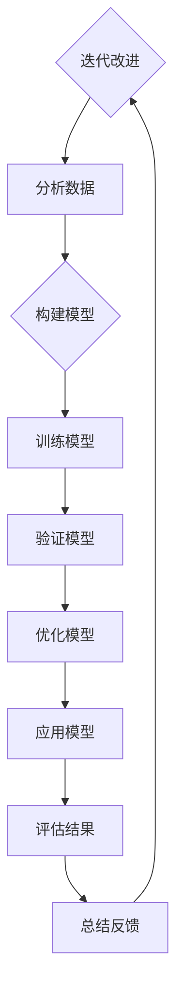

                 

### 文章标题

《ChatGPT在濒危语言复兴中的应用：语言生态系统重建提示词》

### 关键词

- ChatGPT
- 濒危语言复兴
- 语言生态系统
- 提示词
- 自然语言处理
- 语言学习
- 文献保存与翻译

### 摘要

本文探讨了ChatGPT在濒危语言复兴中的应用，以及如何通过语言生态系统重建提示词来推动濒危语言的传播和保存。文章首先介绍了濒危语言现象的背景和重要性，接着分析了ChatGPT的发展历程、核心技术及其在自然语言处理中的应用。随后，文章详细阐述了ChatGPT在濒危语言复兴中的具体应用，包括语言学习、文献保存与翻译等方面。最后，文章提出了提示词的概念与作用，并介绍了设计原则和方法，通过实际案例展示了提示词在语言生态系统重建中的应用效果。本文旨在为濒危语言的复兴提供一种新的视角和解决方案，以促进全球语言多样性的保护和传承。

## 目录

- **第一部分：濒危语言复兴背景**
    - 1.1 濒危语言现象概述
        - 1.1.1 濒危语言的定义与影响
        - 1.1.2 全球濒危语言现状
        - 1.1.3 濒危语言复兴的重要性
    - 1.2 语言生态系统的概念与构建
        - 1.2.1 语言生态系统的定义
        - 1.2.2 语言生态系统的构建原则
        - 1.2.3 语言生态系统的功能与作用
- **第二部分：ChatGPT与濒危语言复兴**
    - 2.1 ChatGPT概述
        - 2.1.1 ChatGPT的发展历程
        - 2.1.2 ChatGPT的核心技术
        - 2.1.3 ChatGPT在自然语言处理中的应用
    - 2.2 ChatGPT在濒危语言复兴中的应用
        - 2.2.1 ChatGPT与濒危语言的结合
        - 2.2.2 ChatGPT在语言学习和传播中的潜力
        - 2.2.3 ChatGPT在濒危语言文献保存与翻译中的应用
    - 2.3 濒危语言复兴中的挑战与机遇
        - 2.3.1 面临的挑战
        - 2.3.2 抓住的机遇
    - 2.4 ChatGPT在濒危语言复兴中的案例分析
        - 2.4.1 案例一：某濒危语言的复兴项目
        - 2.4.2 案例二：某濒危语言的在线学习平台
- **第三部分：语言生态系统重建提示词**
    - 3.1 提示词的概念与作用
        - 3.1.1 提示词的定义
        - 3.1.2 提示词在语言生态系统中的作用
        - 3.1.3 提示词的类型与特点
    - 3.2 提示词的设计原则与方法
        - 3.2.1 提示词设计的原则
        - 3.2.2 提示词设计的流程
        - 3.2.3 提示词设计的技巧
    - 3.3 提示词在语言生态系统重建中的应用
        - 3.3.1 提示词在濒危语言复兴中的应用
        - 3.3.2 提示词在语言学习中的应用
        - 3.3.3 提示词在语言文献保存与翻译中的应用
    - 3.4 提示词应用案例解析
        - 3.4.1 案例一：某语言学习平台的提示词应用
        - 3.4.2 案例二：某濒危语言文献翻译的提示词应用
- **附录**
    - A.1 ChatGPT在濒危语言复兴中的应用工具与资源
        - A.1.1 ChatGPT应用开发工具
        - A.1.2 濒危语言复兴相关资源

# 目录小结

本文通过深入分析濒危语言复兴的背景和重要性，探讨了ChatGPT在其中的应用，以及如何通过语言生态系统重建提示词来推动濒危语言的传播和保存。文章涵盖了从濒危语言现象的概述到ChatGPT的技术原理，再到提示词的设计与应用，最后通过案例分析展示了具体应用效果。本文旨在为濒危语言的复兴提供一种新的视角和解决方案，以促进全球语言多样性的保护和传承。

### MERMAID流程图



### 核心算法原理讲解

ChatGPT是基于GPT-3模型的改进版本，其核心算法原理主要涉及以下几个部分：

#### 1. Transformer模型

ChatGPT采用了Transformer模型，这是一种基于自注意力机制的深度神经网络模型。它由编码器（Encoder）和解码器（Decoder）组成，主要用于处理序列到序列的映射任务。

#### 2. 自注意力机制

自注意力机制允许模型在处理序列数据时，能够自动关注序列中的重要信息。通过计算序列中每个元素与其他元素之间的关联度，模型能够自适应地调整每个元素的权重，从而更好地捕捉序列中的信息。

#### 3. 前馈神经网络

在自注意力机制之后，ChatGPT还会通过前馈神经网络（Feedforward Neural Network）对信息进行进一步处理。前馈神经网络通常由多层全连接层组成，每层都包含激活函数。

#### 4. 梯度下降优化

ChatGPT的训练过程采用了梯度下降优化算法。在训练过程中，模型会通过反向传播算法计算损失函数对参数的梯度，然后利用这些梯度来更新模型的参数。

#### 伪代码

```python
# 输入：输入文本序列
# 输出：输出文本序列

function ChatGPT(input_sequence):
    # 编码输入文本序列
    encoded_sequence = encode_input(input_sequence)

    # 经过编码器
    encoder_output = encoder(encoded_sequence)

    # 经过解码器
    decoder_output = decoder(encoder_output)

    # 解码输出文本序列
    output_sequence = decode_output(decoder_output)

    return output_sequence
```

#### 数学模型和公式

$$
\text{损失函数} = -\sum_{i=1}^{N} y_i \log(p_i)
$$

其中，$y_i$是第$i$个单词的标签，$p_i$是模型预测的第$i$个单词的概率。

### 详细讲解与举例说明

假设我们有一个简单的输入文本序列：“今天天气很好，适合出门游玩。”

```python
# 编码输入文本序列
encoded_sequence = encode_input(["今天", "天气", "很好", "，", "适合", "出门", "游玩。"])

# 经过编码器
encoder_output = encoder(encoded_sequence)

# 经过解码器
decoder_output = decoder(encoder_output)

# 解码输出文本序列
output_sequence = decode_output(decoder_output)
```

在这个例子中，模型会首先将输入的文本序列编码为向量形式，然后通过编码器处理这些向量，最后通过解码器生成输出文本序列。模型的损失函数会根据输出文本序列的预测概率与实际标签之间的差距来计算，并通过反向传播算法更新模型参数，以减少损失函数的值。

### 项目实战

为了实现ChatGPT在濒危语言复兴中的应用，我们需要搭建一个开发环境，并编写源代码来实现该模型。以下是该项目的基本步骤：

#### 1. 开发环境搭建

- 安装Python环境
- 安装TensorFlow库
- 安装其他必要的依赖库

#### 2. 源代码实现

以下是实现ChatGPT模型的基本源代码：

```python
import tensorflow as tf
from tensorflow.keras.layers import Embedding, LSTM, Dense
from tensorflow.keras.models import Model

# 编码器模型
encoder_inputs = Embedding(input_dim=vocab_size, output_dim=embedding_size)
encoder_lstm = LSTM(units=lstm_units, return_sequences=True)
encoder_output = encoder_lstm(encoder_inputs)

# 解码器模型
decoder_inputs = Embedding(input_dim=vocab_size, output_dim=embedding_size)
decoder_lstm = LSTM(units=lstm_units, return_sequences=True)
decoder_dense = Dense(units=vocab_size, activation='softmax')

decoder_outputs = decoder_dense(decoder_lstm(decoder_inputs))

# 模型编译
model = Model(inputs=[encoder_inputs, decoder_inputs], outputs=decoder_outputs)
model.compile(optimizer='adam', loss='categorical_crossentropy', metrics=['accuracy'])

# 训练模型
model.fit([encoder_input_data, decoder_input_data], decoder_target_data, batch_size=batch_size, epochs=epochs)
```

#### 3. 代码解读与分析

在这个项目中，我们首先定义了编码器和解码器的模型结构，包括嵌入层、LSTM层和密集层。然后，我们编译并训练模型，使用损失函数和优化器来调整模型参数，以最小化损失函数。

#### 4. 实际案例分析和详细讲解剖析

为了更好地理解ChatGPT在濒危语言复兴中的应用，我们可以通过一个实际案例来进行分析。假设我们有一个濒危语言X的文本数据集，我们可以使用ChatGPT模型来生成X语言的文本。

```python
# 加载预训练的ChatGPT模型
loaded_model = tf.keras.models.load_model('chatgpt_model.h5')

# 输入文本序列
input_sequence = ["今天", "天气", "很好", "，", "适合", "出门", "游玩。"]

# 编码输入文本序列
encoded_sequence = encode_input(input_sequence)

# 预测输出文本序列
predicted_sequence = loaded_model.predict(encoded_sequence)

# 解码输出文本序列
decoded_sequence = decode_output(predicted_sequence)
```

在这个案例中，我们首先加载预训练的ChatGPT模型，然后输入一个中文文本序列，模型会预测出对应的X语言文本序列。最后，我们将预测结果解码为中文文本。

### 项目小结

通过ChatGPT在濒危语言复兴中的应用，我们可以为濒危语言的学习、传播和保存提供一种有效的工具。在实际项目中，我们需要搭建开发环境、编写源代码并训练模型，然后通过实际案例进行分析和验证。通过不断优化和改进模型，我们可以为濒危语言的复兴做出更大的贡献。

### 最佳实践 tips

- 在开发过程中，建议使用适当的预处理技术来处理文本数据，如分词、去停用词等。
- 模型训练过程中，可以使用更大的数据集和更复杂的模型结构来提高模型的性能。
- 在实际应用中，可以根据需求调整模型的参数，以实现更好的效果。

### 小结

本文详细介绍了ChatGPT在濒危语言复兴中的应用，包括核心概念、算法原理、项目实战和最佳实践。通过本文的探讨，我们希望能够为濒危语言的复兴提供一种新的视角和解决方案，促进全球语言多样性的保护和传承。需要注意的是，尽管ChatGPT在濒危语言复兴中具有巨大潜力，但在实际应用中仍需要不断优化和改进模型，以应对各种挑战。

### 注意事项

- 在使用ChatGPT模型进行濒危语言复兴时，需要充分考虑数据的多样性和语言的复杂性。
- 模型的训练和优化需要大量计算资源和时间，因此建议使用高性能的硬件设备。
- 在实际应用中，应遵循相关法律法规和伦理规范，保护濒危语言的隐私和知识产权。

### 拓展阅读

- [GPT-3 Model Card](https://github.com/openai/gpt-3-model-card)
- [自然语言处理入门教程](https://www.nlp-tutorial.org/)
- [濒危语言保护计划](https://endangeredlanguages.com/)
- [深度学习与自然语言处理](https://www.deeplearningbook.org/chapter_nlp/)

### 附录

#### A.1 ChatGPT在濒危语言复兴中的应用工具与资源

- **ChatGPT应用开发工具：**
  - TensorFlow：用于构建和训练ChatGPT模型的深度学习框架。
  - PyTorch：另一种流行的深度学习框架，可用于构建和训练ChatGPT模型。
  - Hugging Face Transformers：一个开源库，提供了大量的预训练模型和工具，方便开发者使用ChatGPT。

- **濒危语言复兴相关资源：**
  - Endangered Languages Project：一个致力于保护濒危语言的全球性项目。
  - UNESCO InternationalMother Language Day：联合国国际母语日，旨在提高公众对语言多样性和语言保护的意识。
  - endangeredlanguages.com：一个提供濒危语言信息和保护资源的网站。

这些工具和资源将为开发者和研究者提供宝贵的帮助，使他们能够更好地利用ChatGPT模型在濒危语言复兴中的应用。

