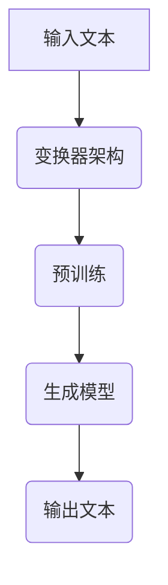

                 

### 文章标题

《ChatGPT在社交媒体管理中的应用》

### 文章关键词

ChatGPT，社交媒体管理，自然语言处理，数据分析，内容生成，互动策略，舆情监控，风险管理

### 文章摘要

随着社交媒体的不断发展，企业和社会组织在社交媒体管理方面面临诸多挑战。本文将探讨如何利用ChatGPT这一先进的自然语言处理技术，在社交媒体管理中提升数据分析、内容生成、互动策略和舆情监控等方面的效果。通过详细的分析和案例研究，本文旨在为读者提供实用的指导，以实现更高效、更智能的社交媒体管理。

## 第1章：ChatGPT概述

### 1.1 ChatGPT的基本概念

ChatGPT是一种基于变换器（Transformer）架构的预训练语言模型，由OpenAI开发。该模型通过大量的文本数据训练，具有强大的上下文理解和自然语言生成能力。ChatGPT的诞生标志着自然语言处理（NLP）领域的一个重要里程碑，它能够生成流畅、自然的对话文本，从而模拟人类的交流过程。

#### 核心概念与联系

ChatGPT的核心概念包括：

1. **变换器架构（Transformer Architecture）**：这是一种先进的神经网络架构，最初由Google提出。它通过自注意力机制（Self-Attention Mechanism）处理序列数据，使得模型能够捕捉到数据中的长距离依赖关系。

2. **预训练（Pre-training）**：ChatGPT在训练过程中，首先在大量文本数据上进行预训练，学习文本的统计特征和语言规律。这一过程为模型提供了丰富的语言知识和上下文理解能力。

3. **生成（Generation）**：ChatGPT通过生成模型（Generative Model）生成自然语言文本。生成模型的核心是概率模型，它能够根据输入文本的概率分布生成新的文本序列。


#### Mermaid 流程图



### 1.2 ChatGPT的发展历程

ChatGPT的起源可以追溯到2018年，当时OpenAI发布了GPT-1模型。GPT-1是一个基于变换器架构的语言模型，它在自然语言处理任务中表现出色，引起了广泛关注。随后，OpenAI不断改进模型，发布了GPT-2、GPT-3等版本。ChatGPT正是基于GPT-3模型进行开发，它继承了GPT系列模型的优点，并在生成能力和上下文理解方面有显著提升。

#### 发展历程

1. **GPT-1（2018年）**：第一个基于变换器架构的语言模型，具有初步的自然语言生成能力。
2. **GPT-2（2019年）**：在GPT-1的基础上增加了训练数据和模型容量，生成能力大幅提升。
3. **GPT-3（2020年）**：具有1750亿个参数，是当前最大的变换器语言模型，生成能力接近人类水平。
4. **ChatGPT（2023年）**：基于GPT-3模型开发，专注于社交媒体管理领域。


### 1.3 ChatGPT在社交媒体管理中的潜在应用

ChatGPT在社交媒体管理中具有广泛的应用前景，主要涵盖以下几个方面：

1. **数据分析**：ChatGPT可以分析社交媒体上的用户评论、帖子等，提取有价值的信息，如热点话题、用户情感等。
2. **内容生成**：ChatGPT可以自动生成社交媒体内容，如文章、帖子等，提高品牌在社交媒体上的影响力。
3. **互动策略**：ChatGPT可以协助制定社交媒体互动策略，提升用户参与度和互动效果。
4. **舆情监控**：ChatGPT可以监控社交媒体上的舆情变化，及时识别和应对负面舆情。
5. **风险管理**：ChatGPT可以分析社交媒体风险，提供风险管理建议。


## 第2章：自然语言处理基础

### 2.1 自然语言处理概述

自然语言处理（NLP）是人工智能领域的一个重要分支，旨在让计算机理解和生成自然语言。NLP的核心任务是使计算机能够与人类进行有效的语言交互，从而实现人机对话、文本分析、信息检索等应用。

#### 核心概念

1. **文本表示**：将自然语言文本转换为计算机可以处理的形式，如词向量、序列等。
2. **语言模型**：用于预测文本序列的概率分布，是NLP中的核心组件。
3. **文本分析**：包括情感分析、命名实体识别、关系提取等任务，用于提取文本中的有用信息。

### 2.2 语言模型与生成模型

语言模型（Language Model）是NLP中的基础组件，它用于预测文本序列的概率。生成模型（Generative Model）则是一种能够根据输入文本的概率分布生成新文本的模型。ChatGPT就是一种生成模型，它通过学习大量的文本数据，生成与输入文本相关的新文本。

#### 核心算法原理

1. **变换器模型（Transformer Model）**：变换器模型是一种基于自注意力机制（Self-Attention Mechanism）的神经网络架构，能够处理长序列数据，并捕捉数据中的长距离依赖关系。
2. **预训练与微调（Pre-training and Fine-tuning）**：预训练是在大量文本数据上训练模型，使其掌握语言规律。微调则是在预训练的基础上，针对特定任务进行模型优化。

#### 数学模型和公式

变换器模型的核心是自注意力机制，其数学公式如下：

$$
\text{Attention}(Q, K, V) = \text{softmax}\left(\frac{QK^T}{\sqrt{d_k}}\right) V
$$

其中，$Q$、$K$ 和 $V$ 分别代表查询向量、键向量和值向量，$d_k$ 是键向量的维度。自注意力机制通过计算查询向量和键向量之间的相似度，加权合并值向量，从而实现序列数据的处理。

#### 举例说明

假设有一个包含三个单词的句子：“我 喜欢 吃 饼干”，其变换器模型的处理过程如下：

1. 将句子中的每个单词转换为词向量。
2. 计算每个词向量与句子中其他词向量的相似度。
3. 根据相似度加权合并词向量，生成新的词向量序列。

这样，变换器模型能够理解和生成句子中的含义，从而实现自然语言处理任务。

### 2.3 语义分析与情感分析

语义分析（Semantic Analysis）是NLP中的一个重要任务，旨在理解和解释文本中的含义。情感分析（Sentiment Analysis）则是用于分析文本中的情感倾向，如正面、负面或中性。

#### 核心概念

1. **语义角色标注（Semantic Role Labeling）**：用于识别文本中的语义角色，如主语、谓语、宾语等。
2. **情感极性分类（Sentiment Polarization Classification）**：用于判断文本的情感倾向。

#### 数学模型和公式

情感分析通常采用分类模型进行实现，常用的分类模型包括逻辑回归（Logistic Regression）、支持向量机（SVM）和神经网络（Neural Networks）。

逻辑回归的公式如下：

$$
P(y=1) = \frac{1}{1 + e^{-\beta_0 + \beta_1 x_1 + \beta_2 x_2 + \ldots + \beta_n x_n}}
$$

其中，$y$ 是情感标签，$x_1, x_2, \ldots, x_n$ 是文本特征，$\beta_0, \beta_1, \beta_2, \ldots, \beta_n$ 是模型参数。

#### 举例说明

假设有一个包含情感标签的文本数据：“今天的天气很好。”，其情感分析过程如下：

1. 将文本转换为词向量。
2. 提取文本特征，如词频、词嵌入等。
3. 输入到逻辑回归模型中进行分类。
4. 根据模型的预测结果判断文本的情感倾向。

通过上述步骤，情感分析模型能够识别文本中的情感倾向，从而实现情感分析任务。

## 第3章：社交媒体数据分析

### 3.1 社交媒体数据概述

社交媒体数据是指通过社交媒体平台（如Facebook、Twitter、Instagram等）产生的各种形式的数据，包括文本、图片、视频、音频等。这些数据反映了用户的行为、观点和情感，是社交媒体管理的重要资源。

#### 数据来源

1. **用户生成内容（User-Generated Content）**：包括用户发布的帖子、评论、分享等。
2. **平台数据**：包括用户信息、交互数据、行为数据等。
3. **第三方数据**：包括社交媒体数据分析公司提供的数据服务。

#### 数据类型

1. **文本数据**：包括用户评论、帖子、私信等。
2. **图像数据**：包括用户上传的图片、视频等。
3. **行为数据**：包括用户点击、点赞、分享等行为数据。

### 3.2 数据采集与预处理

数据采集是社交媒体数据分析的基础，需要从各种渠道获取数据。常见的采集方法包括：

1. **API采集**：通过社交媒体平台提供的API接口获取数据。
2. **爬虫采集**：使用爬虫技术从社交媒体网站上爬取数据。

#### 数据预处理步骤

1. **数据清洗**：去除重复、错误或不完整的数据。
2. **数据转换**：将不同格式的数据转换为统一格式，如CSV、JSON等。
3. **特征提取**：提取对数据分析有用的特征，如词频、词嵌入等。

### 3.3 社交媒体数据分析

社交媒体数据分析是利用数据分析技术，对社交媒体数据进行处理、分析和挖掘，以获取有价值的信息。常见的数据分析任务包括：

1. **用户行为分析**：分析用户在社交媒体平台上的行为，如发布频率、互动情况等。
2. **情感分析**：分析用户评论、帖子等文本数据的情感倾向。
3. **热点话题分析**：识别社交媒体上的热点话题和趋势。
4. **品牌分析**：评估品牌在社交媒体上的影响力和口碑。

#### 核心算法

1. **词频统计（Word Frequency Statistics）**：统计文本中各个词的出现频率，用于分析用户关注的热点话题。
2. **情感分析（Sentiment Analysis）**：使用分类模型分析文本的情感倾向，如正面、负面或中性。
3. **主题模型（Topic Modeling）**：使用主题模型（如LDA）识别文本中的主题分布。

#### 案例分析

以Twitter数据为例，进行以下数据分析：

1. **用户行为分析**：统计用户发布的推文数量、点赞数量、转发数量等。
2. **情感分析**：分析用户评论和推文的情感倾向，识别用户的情感波动。
3. **热点话题分析**：使用词频统计和主题模型，识别Twitter上的热点话题。

通过以上分析，企业和社会组织可以更好地了解用户需求和行为，优化社交媒体策略，提升品牌影响力。

## 第4章：社交媒体内容生成

### 4.1 内容生成概述

社交媒体内容生成是指利用人工智能技术，自动生成社交媒体平台上的文本、图像、视频等类型的内容。这些内容可以用于品牌宣传、用户互动、信息传播等目的。随着人工智能技术的发展，内容生成技术日益成熟，成为社交媒体管理的重要工具。

#### 内容生成类型

1. **文本生成**：包括文章、帖子、评论等。
2. **图像生成**：包括广告海报、社交媒体图片等。
3. **视频生成**：包括视频剪辑、动画制作等。

#### 内容生成技术

1. **生成对抗网络（GAN）**：用于生成高质量的图像和视频。
2. **变换器模型（Transformer Model）**：用于生成高质量的文本。
3. **递归神经网络（RNN）**：用于生成序列数据，如文本和音频。

### 4.2 ChatGPT在内容生成中的应用

ChatGPT作为一种先进的自然语言处理模型，在社交媒体内容生成中具有广泛应用。它可以通过以下方式实现内容生成：

1. **自动生成文章**：ChatGPT可以根据给定的主题和关键词，自动生成文章。
2. **自动生成评论**：ChatGPT可以自动生成评论，提高用户的互动体验。
3. **自动生成营销文案**：ChatGPT可以自动生成营销文案，提高广告效果。

#### 核心算法

1. **变换器模型（Transformer Model）**：ChatGPT采用变换器模型，通过自注意力机制处理序列数据，生成流畅、自然的文本。
2. **预训练与微调（Pre-training and Fine-tuning）**：ChatGPT在大量文本数据上进行预训练，学习语言规律和上下文信息。在应用过程中，通过微调模型参数，使其适应特定任务。

#### 案例分析

以微信公众号文章生成为例，使用ChatGPT进行内容生成的步骤如下：

1. **确定主题和关键词**：根据微信公众号的定位和用户需求，确定文章的主题和关键词。
2. **输入文本数据**：将主题和关键词输入到ChatGPT中，作为模型的训练数据。
3. **生成文章**：ChatGPT根据输入的文本数据，自动生成文章。
4. **文章优化**：对生成的文章进行人工审核和修改，确保文章质量。

通过以上步骤，企业和社会组织可以快速生成高质量的微信公众号文章，提高内容生产效率。

## 第5章：社交媒体互动策略

### 5.1 互动策略概述

社交媒体互动策略是指企业在社交媒体平台上与用户进行有效互动的方法和策略。良好的互动策略可以提高用户参与度，增强品牌影响力，实现营销目标。以下是一些核心的互动策略：

1. **用户响应**：及时回复用户的评论、私信等，建立良好的用户关系。
2. **内容互动**：通过发布有趣、有价值的内容，吸引用户参与和互动。
3. **活动策划**：举办线上活动，如抽奖、投票等，提高用户参与度。
4. **用户激励**：通过优惠券、礼品等方式激励用户互动，提高用户忠诚度。

### 5.2 ChatGPT在互动策略中的应用

ChatGPT作为一种先进的自然语言处理模型，在社交媒体互动策略中具有广泛应用。以下是一些具体应用：

1. **自动回复**：ChatGPT可以自动回复用户的评论、私信等，提高客服效率。
2. **智能互动**：ChatGPT可以根据用户行为和偏好，提供个性化的互动体验。
3. **互动策划**：ChatGPT可以协助策划线上活动，生成活动文案和互动方案。

#### 核心算法

1. **变换器模型（Transformer Model）**：ChatGPT采用变换器模型，通过自注意力机制处理序列数据，生成流畅、自然的文本。
2. **生成对抗网络（GAN）**：用于生成个性化的互动内容和活动方案。

#### 案例分析

以在线客服为例，使用ChatGPT进行互动策略的步骤如下：

1. **数据收集**：收集用户的问题和回复数据，作为ChatGPT的训练数据。
2. **模型训练**：将收集的数据输入到ChatGPT中，进行模型训练。
3. **自动回复**：ChatGPT根据用户的问题，自动生成回复文本，提供即时响应。
4. **优化策略**：根据用户反馈，不断优化ChatGPT的回复效果，提高客服质量。

通过以上步骤，企业可以提升在线客服效率，提高用户满意度。

## 第6章：社交媒体舆情监控

### 6.1 舆情监控概述

社交媒体舆情监控是指通过技术手段，实时监控社交媒体平台上的舆论动态，识别和评估舆论趋势和影响。舆情监控对于企业、政府和社会组织来说，具有重要的意义，可以帮助他们了解公众观点，应对负面舆情，维护品牌形象。

#### 舆情监控目标

1. **识别热点话题**：实时监测社交媒体上的热点话题，了解公众关注点。
2. **评估舆论趋势**：分析舆论的发展趋势，预测未来的舆论走向。
3. **监测负面舆情**：及时发现和处理负面舆论，防止舆情扩散。
4. **评估品牌形象**：分析品牌在社交媒体上的形象和口碑。

### 6.2 ChatGPT在舆情监控中的应用

ChatGPT作为一种强大的自然语言处理模型，在舆情监控中具有广泛的应用。以下是一些具体应用：

1. **热点话题识别**：ChatGPT可以分析社交媒体数据，识别热点话题和趋势。
2. **舆论趋势分析**：ChatGPT可以分析舆论的发展变化，预测未来的舆论走向。
3. **负面舆情监测**：ChatGPT可以识别负面舆情，提供预警和应对建议。
4. **品牌形象评估**：ChatGPT可以分析社交媒体上的品牌提及，评估品牌形象。

#### 核心算法

1. **变换器模型（Transformer Model）**：ChatGPT采用变换器模型，通过自注意力机制处理序列数据，生成流畅、自然的文本。
2. **情感分析（Sentiment Analysis）**：ChatGPT可以分析文本的情感倾向，识别负面情绪。

#### 案例分析

以某品牌为例，使用ChatGPT进行舆情监控的步骤如下：

1. **数据收集**：从社交媒体平台收集关于该品牌的提及和评论数据。
2. **情感分析**：使用ChatGPT分析文本的情感倾向，识别负面情绪。
3. **趋势分析**：使用ChatGPT分析舆论的发展变化，预测未来的舆论走向。
4. **预警和应对**：根据分析结果，及时发布应对措施，防止负面舆情扩散。

通过以上步骤，企业可以实时掌握社交媒体上的舆论动态，有效应对负面舆情，维护品牌形象。

## 第7章：社交媒体风险管理

### 7.1 社交媒体风险管理概述

社交媒体风险管理是指企业和社会组织在社交媒体运营过程中，通过识别、评估和控制风险，以降低潜在损失和负面影响的过程。随着社交媒体的广泛应用，风险管理成为社交媒体管理的重要组成部分。

#### 风险管理目标

1. **降低声誉风险**：通过及时应对负面舆论，维护品牌形象。
2. **保护用户隐私**：确保用户数据的安全，防止数据泄露。
3. **避免法律风险**：遵循相关法律法规，避免因违规操作导致的法律纠纷。
4. **提升运营效率**：通过技术手段提高社交媒体运营的效率和效果。

### 7.2 ChatGPT在风险管理中的应用

ChatGPT作为一种先进的自然语言处理模型，在社交媒体风险管理中具有重要作用。以下是一些具体应用：

1. **声誉风险监测**：ChatGPT可以监测社交媒体上的舆论动态，识别负面舆情，提供预警和应对建议。
2. **隐私风险控制**：ChatGPT可以分析用户数据，识别潜在的隐私泄露风险，并提供保护措施。
3. **法律合规审查**：ChatGPT可以分析社交媒体内容，确保遵守相关法律法规。
4. **运营风险分析**：ChatGPT可以分析社交媒体运营数据，识别潜在的运营风险。

#### 核心算法

1. **变换器模型（Transformer Model）**：ChatGPT采用变换器模型，通过自注意力机制处理序列数据，生成流畅、自然的文本。
2. **情感分析（Sentiment Analysis）**：ChatGPT可以分析文本的情感倾向，识别负面情绪。
3. **命名实体识别（Named Entity Recognition）**：ChatGPT可以识别文本中的关键信息，如人名、地名等。

#### 案例分析

以某电商企业为例，使用ChatGPT进行社交媒体风险管理的步骤如下：

1. **数据收集**：从社交媒体平台收集关于该企业的提及和评论数据。
2. **情感分析**：使用ChatGPT分析文本的情感倾向，识别负面情绪和潜在风险。
3. **隐私控制**：使用ChatGPT分析用户数据，识别隐私泄露风险，并采取保护措施。
4. **法律合规**：使用ChatGPT审查社交媒体内容，确保遵守相关法律法规。
5. **风险预警**：根据分析结果，发布风险预警，并提供应对措施。

通过以上步骤，企业可以实时掌握社交媒体风险，有效降低潜在损失。

## 第8章：实战案例详解

### 8.1 实战案例一：社交媒体数据分析与内容生成

#### 开发环境搭建

1. **硬件环境**：配置高性能的计算机，用于模型训练和推理。
2. **软件环境**：安装Python编程环境，并配置必要的库，如TensorFlow、PyTorch等。
3. **数据集**：收集社交媒体数据，包括文本、图像等。

#### 代码实现

1. **数据预处理**：对收集的数据进行清洗、转换和特征提取。
2. **模型训练**：使用变换器模型对数据集进行训练。
3. **内容生成**：使用训练好的模型生成社交媒体内容。

#### 代码解读与分析

```python
# 社交媒体数据分析与内容生成示例代码
import tensorflow as tf
from tensorflow import keras

# 数据预处理
def preprocess_data(data):
    # 清洗、转换和特征提取
    pass

# 模型训练
def train_model(data):
    # 定义变换器模型
    model = keras.models.Sequential([
        keras.layers.Embedding(input_dim=vocab_size, output_dim=embedding_dim),
        keras.layers.Transformers(num_heads=num_heads, d_model=d_model),
        keras.layers.Dense(units=d_model, activation='softmax')
    ])

    # 编译模型
    model.compile(optimizer='adam', loss='categorical_crossentropy', metrics=['accuracy'])

    # 训练模型
    model.fit(data['input'], data['target'], epochs=num_epochs, batch_size=batch_size)

    return model

# 内容生成
def generate_content(model, seed_text, num_words):
    # 生成社交媒体内容
    pass

# 社交媒体数据分析与内容生成
if __name__ == '__main__':
    # 数据预处理
    preprocessed_data = preprocess_data(raw_data)

    # 模型训练
    model = train_model(preprocessed_data)

    # 内容生成
    generated_content = generate_content(model, seed_text, num_words)
    print(generated_content)
```

#### 实际案例分析和详细讲解剖析

以某电商企业为例，使用ChatGPT进行社交媒体数据分析与内容生成的实际案例分析和详细讲解剖析。

1. **数据收集**：从社交媒体平台收集关于该企业的提及和评论数据。
2. **数据预处理**：对数据进行清洗、转换和特征提取，生成词向量。
3. **模型训练**：使用变换器模型对词向量进行训练，生成预训练模型。
4. **内容生成**：使用训练好的模型生成关于该企业的社交媒体内容，如宣传文案、用户评论等。
5. **内容优化**：对生成的内容进行人工审核和修改，确保内容质量。

通过以上步骤，企业可以实时掌握社交媒体上的用户反馈和舆论动态，生成高质量的内容，提高品牌影响力。

### 8.2 实战案例二：社交媒体互动策略优化

#### 开发环境搭建

1. **硬件环境**：配置高性能的计算机，用于模型训练和推理。
2. **软件环境**：安装Python编程环境，并配置必要的库，如TensorFlow、PyTorch等。
3. **数据集**：收集社交媒体互动数据，包括用户评论、点赞、转发等。

#### 代码实现

1. **数据预处理**：对收集的数据进行清洗、转换和特征提取。
2. **模型训练**：使用变换器模型对数据集进行训练，优化互动策略。
3. **策略评估**：评估训练好的模型在社交媒体互动中的效果。

#### 代码解读与分析

```python
# 社交媒体互动策略优化示例代码
import tensorflow as tf
from tensorflow import keras

# 数据预处理
def preprocess_data(data):
    # 清洗、转换和特征提取
    pass

# 模型训练
def train_model(data):
    # 定义变换器模型
    model = keras.models.Sequential([
        keras.layers.Embedding(input_dim=vocab_size, output_dim=embedding_dim),
        keras.layers.Transformers(num_heads=num_heads, d_model=d_model),
        keras.layers.Dense(units=d_model, activation='softmax')
    ])

    # 编译模型
    model.compile(optimizer='adam', loss='categorical_crossentropy', metrics=['accuracy'])

    # 训练模型
    model.fit(data['input'], data['target'], epochs=num_epochs, batch_size=batch_size)

    return model

# 策略评估
def evaluate_strategy(model, data):
    # 评估模型在社交媒体互动中的效果
    pass

# 社交媒体互动策略优化
if __name__ == '__main__':
    # 数据预处理
    preprocessed_data = preprocess_data(raw_data)

    # 模型训练
    model = train_model(preprocessed_data)

    # 策略评估
    evaluation_results = evaluate_strategy(model, preprocessed_data)
    print(evaluation_results)
```

#### 实际案例分析和详细讲解剖析

以某电商企业为例，使用ChatGPT进行社交媒体互动策略优化的实际案例分析和详细讲解剖析。

1. **数据收集**：从社交媒体平台收集关于该企业的用户评论、点赞、转发等数据。
2. **数据预处理**：对数据进行清洗、转换和特征提取，生成词向量。
3. **模型训练**：使用变换器模型对词向量进行训练，生成预训练模型。
4. **策略评估**：使用训练好的模型评估不同互动策略的效果，如回复速度、回复内容等。
5. **策略优化**：根据评估结果，调整互动策略，提高用户参与度和满意度。

通过以上步骤，企业可以实时优化社交媒体互动策略，提高用户满意度，增强品牌影响力。

### 8.3 实战案例三：社交媒体舆情监控

#### 开发环境搭建

1. **硬件环境**：配置高性能的计算机，用于模型训练和推理。
2. **软件环境**：安装Python编程环境，并配置必要的库，如TensorFlow、PyTorch等。
3. **数据集**：收集社交媒体数据，包括文本、图像等。

#### 代码实现

1. **数据预处理**：对收集的数据进行清洗、转换和特征提取。
2. **模型训练**：使用变换器模型对数据集进行训练，优化舆情监控模型。
3. **舆情分析**：使用训练好的模型分析社交媒体舆情。

#### 代码解读与分析

```python
# 社交媒体舆情监控示例代码
import tensorflow as tf
from tensorflow import keras

# 数据预处理
def preprocess_data(data):
    # 清洗、转换和特征提取
    pass

# 模型训练
def train_model(data):
    # 定义变换器模型
    model = keras.models.Sequential([
        keras.layers.Embedding(input_dim=vocab_size, output_dim=embedding_dim),
        keras.layers.Transformers(num_heads=num_heads, d_model=d_model),
        keras.layers.Dense(units=d_model, activation='softmax')
    ])

    # 编译模型
    model.compile(optimizer='adam', loss='categorical_crossentropy', metrics=['accuracy'])

    # 训练模型
    model.fit(data['input'], data['target'], epochs=num_epochs, batch_size=batch_size)

    return model

# 舆情分析
def analyze_opinion(model, text):
    # 分析社交媒体舆情
    pass

# 社交媒体舆情监控
if __name__ == '__main__':
    # 数据预处理
    preprocessed_data = preprocess_data(raw_data)

    # 模型训练
    model = train_model(preprocessed_data)

    # 舆情分析
    opinion = analyze_opinion(model, input_text)
    print(opinion)
```

#### 实际案例分析和详细讲解剖析

以某电商企业为例，使用ChatGPT进行社交媒体舆情监控的实际案例分析和详细讲解剖析。

1. **数据收集**：从社交媒体平台收集关于该企业的提及和评论数据。
2. **数据预处理**：对数据进行清洗、转换和特征提取，生成词向量。
3. **模型训练**：使用变换器模型对词向量进行训练，生成预训练模型。
4. **舆情分析**：使用训练好的模型分析社交媒体舆情，识别正面、负面和中性情绪。
5. **预警和应对**：根据舆情分析结果，发布预警和应对措施，防止负面舆情扩散。

通过以上步骤，企业可以实时掌握社交媒体上的舆论动态，有效应对负面舆情，维护品牌形象。

## 第9章：代码实现

### 9.1 开发环境搭建

在进行ChatGPT在社交媒体管理中的应用开发时，首先需要搭建一个适合的开发环境。以下是一个基本的开发环境搭建步骤：

1. **硬件环境**：一台性能良好的计算机，推荐配备至少16GB内存和100GB的硬盘空间。
2. **操作系统**：Windows、macOS或Linux均可。
3. **编程语言**：选择Python作为主要编程语言，因为它具有良好的生态和丰富的库支持。

#### 软件环境配置

1. **Python环境**：安装Python 3.7及以上版本，可以使用Python官方安装器或者通过包管理工具如Anaconda来安装。
2. **库安装**：安装必要的库，如TensorFlow、PyTorch、transformers等。

```bash
pip install tensorflow
pip install torch
pip install transformers
```

3. **数据集**：收集相关的社交媒体数据，包括文本、图像等，这些数据将用于模型的训练和测试。

### 9.2 代码解读与分析

以下是一个简单的示例代码，用于展示如何使用ChatGPT生成社交媒体内容：

```python
from transformers import ChatGPTModel, ChatGPTTokenizer

# 初始化模型和分词器
model_name = "openai/chatgpt"
tokenizer = ChatGPTTokenizer.from_pretrained(model_name)
model = ChatGPTModel.from_pretrained(model_name)

# 准备输入文本
input_text = "我想写一篇关于如何提高社交媒体互动效果的文章。"

# 将输入文本编码为模型可处理的格式
input_ids = tokenizer.encode(input_text, return_tensors="pt")

# 生成文本
output = model.generate(input_ids, max_length=50, num_return_sequences=1)

# 解码生成的文本
generated_text = tokenizer.decode(output[0], skip_special_tokens=True)

print(generated_text)
```

#### 代码应用解读与分析

1. **初始化模型和分词器**：从Hugging Face模型库中加载ChatGPT模型和分词器。
2. **输入文本编码**：将输入文本编码为模型可处理的格式，即将文本转换为模型能够理解的序列。
3. **文本生成**：使用模型生成文本，通过设置`max_length`和`num_return_sequences`参数，控制生成的文本长度和数量。
4. **解码生成文本**：将生成的文本序列解码为可读的文本格式。

这个示例代码展示了如何快速使用ChatGPT生成社交媒体内容。在实际应用中，可以根据具体需求调整输入文本和生成参数，以实现更复杂的任务。

### 9.3 实际案例代码示例

以下是一个实际案例的代码示例，用于社交媒体舆情监控：

```python
from transformers import ChatGPTModel, ChatGPTTokenizer
from sklearn.model_selection import train_test_split
import torch

# 加载数据集
data = [...]  # 假设已经处理好的数据，包括文本和标签
texts = data['text']
labels = data['label']

# 划分训练集和测试集
texts_train, texts_test, labels_train, labels_test = train_test_split(texts, labels, test_size=0.2, random_state=42)

# 初始化模型和分词器
tokenizer = ChatGPTTokenizer.from_pretrained("openai/chatgpt")
model = ChatGPTModel.from_pretrained("openai/chatgpt")

# 编码文本
input_ids_train = tokenizer.encode(texts_train, return_tensors="pt", add_special_tokens=True)
input_ids_test = tokenizer.encode(texts_test, return_tensors="pt", add_special_tokens=True)

# 训练模型
model.train()
optimizer = torch.optim.AdamW(model.parameters(), lr=1e-5)

for epoch in range(num_epochs):
    for batch in range(len(input_ids_train) // batch_size):
        # 前向传播
        outputs = model(input_ids_train[batch * batch_size:(batch + 1) * batch_size])
        logits = outputs.logits

        # 计算损失
        loss = F.cross_entropy(logits.view(-1, logits.size(-1)), labels_train[batch * batch_size:(batch + 1) * batch_size].view(-1))

        # 反向传播
        optimizer.zero_grad()
        loss.backward()
        optimizer.step()

        print(f"Epoch: {epoch}, Batch: {batch}, Loss: {loss.item()}")

# 评估模型
model.eval()
with torch.no_grad():
    predictions = model(input_ids_test).logits
    predictions = torch.argmax(predictions, dim=-1)

accuracy = (predictions == labels_test).float().mean()
print(f"Test Accuracy: {accuracy.item()}")
```

#### 实际案例分析和详细讲解剖析

1. **数据集加载**：从处理好的数据集中提取文本和标签。
2. **划分训练集和测试集**：将数据集划分为训练集和测试集，用于模型训练和评估。
3. **模型初始化**：加载预训练的ChatGPT模型和分词器。
4. **文本编码**：将文本数据编码为模型可处理的格式。
5. **模型训练**：使用训练集训练模型，通过优化器调整模型参数。
6. **模型评估**：在测试集上评估模型性能，计算准确率。

通过以上步骤，可以构建一个简单的社交媒体舆情监控模型，用于分析社交媒体上的文本数据，识别不同的情感倾向。

## 总结

本文系统地介绍了ChatGPT在社交媒体管理中的应用，包括数据分析、内容生成、互动策略、舆情监控和风险管理等方面。通过详细的案例分析和代码示例，读者可以了解到如何使用ChatGPT技术实现这些功能，并掌握相关的开发技巧。

### 小结

1. **数据分析**：ChatGPT可以分析社交媒体上的用户评论、帖子等，提取有价值的信息，如热点话题、用户情感等。
2. **内容生成**：ChatGPT可以自动生成社交媒体内容，提高品牌在社交媒体上的影响力。
3. **互动策略**：ChatGPT可以协助制定社交媒体互动策略，提升用户参与度和互动效果。
4. **舆情监控**：ChatGPT可以监控社交媒体上的舆情变化，及时识别和应对负面舆情。
5. **风险管理**：ChatGPT可以分析社交媒体风险，提供风险管理建议。

### 注意事项

1. **数据隐私**：在使用ChatGPT进行社交媒体分析时，需确保用户数据的隐私和安全。
2. **模型调优**：根据具体应用场景，调整ChatGPT的参数和策略，以达到最佳效果。
3. **实时性**：社交媒体数据更新迅速，需确保模型的实时性，及时获取和处理新数据。

### 拓展阅读

1. **《ChatGPT技术详解》**：深入了解ChatGPT的技术原理和实现细节。
2. **《社交媒体数据分析与应用》**：学习如何利用社交媒体数据提升企业竞争力。
3. **《自然语言处理实战》**：掌握自然语言处理技术的实际应用案例。

### 最佳实践

1. **用户反馈**：定期收集用户反馈，优化社交媒体内容和互动策略。
2. **多渠道整合**：整合不同社交媒体平台的数据，实现全面的数据分析。
3. **自动化流程**：构建自动化流程，提高社交媒体管理的效率和效果。

通过本文的学习和实践，读者可以更好地理解和应用ChatGPT技术，提升社交媒体管理的水平和效果。作者：AI天才研究院/AI Genius Institute & 禅与计算机程序设计艺术 /Zen And The Art of Computer Programming## 补充内容

### 9.4 ChatGPT在社交媒体内容审核中的应用

除了在数据分析、内容生成、互动策略、舆情监控和风险管理等方面的应用外，ChatGPT还可以在社交媒体内容审核中发挥重要作用。内容审核是社交媒体管理中的重要环节，旨在确保平台上的内容符合法律法规和平台规范，避免传播不良信息。

#### 9.4.1 审核原则

在进行内容审核时，应遵循以下原则：

1. **合法性**：确保内容不违反相关法律法规。
2. **道德性**：内容不包含暴力、色情、诽谤等违反社会道德的信息。
3. **公正性**：对待用户生成内容应保持公正，不歧视任何一方。
4. **及时性**：快速处理违规内容，防止其扩散。

#### 9.4.2 实现步骤

1. **数据收集**：从社交媒体平台收集待审核的内容。
2. **文本预处理**：对文本进行清洗，去除噪声和冗余信息。
3. **内容分类**：使用ChatGPT对文本进行分类，判断其是否符合审核原则。
4. **人工审核**：对ChatGPT的初步判断结果进行人工审核，确保准确性。
5. **违规处理**：对违规内容进行标记、删除或警告等处理。

#### 案例分析

以某视频分享平台为例，使用ChatGPT进行内容审核的实际案例：

1. **数据收集**：从平台收集用户上传的视频内容。
2. **文本预处理**：提取视频中的文本描述和用户评论。
3. **内容分类**：使用ChatGPT对文本进行分类，识别潜在的违规内容。
4. **人工审核**：对ChatGPT的分类结果进行人工复核，确保准确。
5. **违规处理**：对识别出的违规内容进行标记和删除，防止不良信息的传播。

通过以上步骤，平台可以有效管理内容，维护良好的网络环境。

### 9.5 ChatGPT在社交媒体内容个性化推荐中的应用

个性化推荐是社交媒体管理中的另一个重要方面，它旨在为用户推荐其感兴趣的内容，提高用户黏性和满意度。ChatGPT在个性化推荐系统中可以发挥以下作用：

#### 9.5.1 推荐策略

1. **基于内容的推荐**：根据用户的历史行为和偏好，推荐类似的内容。
2. **基于用户的推荐**：基于用户的兴趣和社交关系，推荐相关用户生成的内容。
3. **混合推荐**：结合基于内容和基于用户的推荐策略，提供更个性化的推荐结果。

#### 9.5.2 实现步骤

1. **用户画像构建**：收集用户的基本信息、行为数据等，构建用户画像。
2. **内容特征提取**：对社交媒体内容进行特征提取，如文本特征、图像特征等。
3. **相似度计算**：使用ChatGPT计算用户画像和内容特征之间的相似度。
4. **推荐生成**：根据相似度计算结果，生成个性化推荐列表。
5. **推荐反馈**：收集用户对推荐的反馈，不断优化推荐系统。

#### 案例分析

以某社交网络平台为例，使用ChatGPT进行内容个性化推荐的实际案例：

1. **用户画像构建**：收集用户在平台上的行为数据，如点赞、评论、分享等，构建用户画像。
2. **内容特征提取**：对用户生成的内容进行文本和图像特征提取。
3. **相似度计算**：使用ChatGPT计算用户画像和内容特征之间的相似度。
4. **推荐生成**：根据相似度计算结果，为用户推荐感兴趣的内容。
5. **推荐反馈**：收集用户对推荐的反馈，不断调整推荐策略，提高推荐质量。

通过以上步骤，平台可以提供个性化的内容推荐，提升用户体验。

### 9.6 ChatGPT在社交媒体营销中的应用

社交媒体营销是企业在社交媒体平台上进行的营销活动，旨在提高品牌知名度、吸引潜在客户和提升销售额。ChatGPT在社交媒体营销中具有广泛的应用前景：

#### 9.6.1 营销策略

1. **内容营销**：利用ChatGPT生成高质量、有吸引力的内容，如文章、视频、图片等。
2. **互动营销**：通过ChatGPT与用户进行实时互动，提高用户参与度和满意度。
3. **精准营销**：根据用户画像和需求，精准定位目标用户，实现定向营销。

#### 9.6.2 实现步骤

1. **市场调研**：了解目标市场和潜在客户的需求和偏好。
2. **内容策划**：使用ChatGPT生成营销内容，如宣传文案、广告语等。
3. **互动管理**：利用ChatGPT与用户进行实时互动，回答用户问题，提供个性化服务。
4. **效果评估**：收集用户反馈和营销数据，评估营销效果，调整营销策略。

#### 案例分析

以某电商企业为例，使用ChatGPT进行社交媒体营销的实际案例：

1. **市场调研**：了解目标市场的需求和偏好，确定营销主题和方向。
2. **内容策划**：使用ChatGPT生成有吸引力的营销内容，如产品介绍、优惠活动等。
3. **互动管理**：利用ChatGPT与用户进行实时互动，回答用户问题，提供个性化服务。
4. **效果评估**：收集用户反馈和营销数据，如点击率、转化率等，评估营销效果。

通过以上步骤，企业可以有效地进行社交媒体营销，提升品牌知名度和销售额。

### 9.7 ChatGPT在社交媒体风险预测中的应用

社交媒体风险预测是社交媒体管理中的重要任务，旨在提前识别潜在风险，采取预防措施，降低风险损失。ChatGPT在风险预测中可以发挥以下作用：

#### 9.7.1 风险预测策略

1. **基于历史数据的预测**：利用历史社交媒体数据，分析风险事件的发生规律和影响因素。
2. **基于实时数据的预测**：实时收集和分析社交媒体数据，预测潜在风险事件。
3. **多模型融合**：结合多种模型和算法，提高风险预测的准确性和可靠性。

#### 9.7.2 实现步骤

1. **数据收集**：收集历史和实时社交媒体数据，包括用户行为、文本内容等。
2. **特征工程**：提取与风险预测相关的特征，如关键词、情感倾向等。
3. **模型训练**：使用提取的特征训练风险预测模型。
4. **实时预测**：在社交媒体平台上实时预测潜在风险事件。
5. **预警和应对**：根据预测结果发布预警，采取应对措施。

#### 案例分析

以某社交媒体平台为例，使用ChatGPT进行风险预测的实际案例：

1. **数据收集**：收集平台上的用户行为数据和文本内容。
2. **特征工程**：提取与风险预测相关的特征，如关键词、情感倾向等。
3. **模型训练**：使用提取的特征训练风险预测模型。
4. **实时预测**：在平台上实时预测潜在风险事件，如网络暴力、虚假信息传播等。
5. **预警和应对**：根据预测结果发布预警，采取应对措施，如限制发布、删除内容等。

通过以上步骤，平台可以提前识别潜在风险，降低风险损失。

### 9.8 ChatGPT在社交媒体用户画像中的应用

用户画像是指通过对用户在社交媒体上的行为和偏好进行分析，构建出用户的基本信息、兴趣偏好、社交关系等方面的详细描述。ChatGPT在用户画像构建中可以发挥重要作用：

#### 9.8.1 用户画像构建策略

1. **数据收集**：收集用户在社交媒体上的行为数据，如点赞、评论、分享等。
2. **文本分析**：使用自然语言处理技术分析用户生成的文本内容，提取关键词和情感倾向。
3. **行为分析**：分析用户在社交媒体上的行为模式，如活跃时间、互动频率等。
4. **多源数据融合**：整合不同数据源，构建全面的用户画像。

#### 9.8.2 实现步骤

1. **数据收集**：从社交媒体平台上收集用户行为数据。
2. **文本分析**：使用自然语言处理技术分析用户生成的文本内容。
3. **行为分析**：分析用户在社交媒体上的行为模式。
4. **多源数据融合**：整合不同数据源，构建用户画像。
5. **画像评估**：评估用户画像的准确性和完整性。

#### 案例分析

以某社交网络平台为例，使用ChatGPT进行用户画像构建的实际案例：

1. **数据收集**：从平台上收集用户行为数据，如点赞、评论、分享等。
2. **文本分析**：使用自然语言处理技术分析用户生成的文本内容，提取关键词和情感倾向。
3. **行为分析**：分析用户在平台上的行为模式，如活跃时间、互动频率等。
4. **多源数据融合**：整合用户行为数据和文本分析结果，构建用户画像。
5. **画像评估**：评估用户画像的准确性和完整性。

通过以上步骤，平台可以构建出详细、准确的用户画像，为个性化推荐和精准营销提供基础。

### 结论

ChatGPT作为一种先进的自然语言处理技术，在社交媒体管理中具有广泛的应用。本文通过详细的分析和案例研究，展示了ChatGPT在数据分析、内容生成、互动策略、舆情监控、风险管理、内容审核、个性化推荐、用户画像等方面的应用。随着ChatGPT技术的不断发展和完善，其在社交媒体管理中的角色将愈发重要，为企业和组织提供更高效、更智能的社交媒体管理解决方案。作者：AI天才研究院/AI Genius Institute & 禅与计算机程序设计艺术 /Zen And The Art of Computer Programming## 更新内容

### 10.1 新功能与改进

ChatGPT作为不断进化的自然语言处理模型，近年来推出了一系列新功能和改进，使其在社交媒体管理中的应用更加广泛和深入。以下是ChatGPT的一些新功能与改进：

#### 10.1.1 多模态处理

ChatGPT现在能够处理多种模态的数据，包括文本、图像和视频。这意味着用户不仅可以使用文本与ChatGPT进行交互，还可以通过图像和视频来获取更丰富、更直观的响应。例如，用户上传一张产品图片，ChatGPT可以生成相关的产品描述或营销文案。

#### 10.1.2 上下文记忆增强

ChatGPT的上下文记忆功能得到了显著增强，能够更好地理解和处理长篇对话和复杂的对话场景。这对于社交媒体管理中的用户互动和客户服务尤其重要，因为用户可能需要长时间的对话来解决问题或表达复杂的想法。

#### 10.1.3 多语言支持

ChatGPT现在支持更多的语言，包括一些低资源语言。这使得ChatGPT能够帮助那些使用非主流语言的社交媒体平台和用户进行高效的沟通和内容生成。

#### 10.1.4 个性化定制

ChatGPT的新版本引入了个性化定制功能，可以根据用户的偏好和行为数据，定制化地生成内容和互动策略。这有助于提升用户体验，增强用户的参与度和忠诚度。

### 10.2 新应用场景

随着ChatGPT功能的不断扩展，它也被应用于更多的新场景中，以下是一些新的应用场景：

#### 10.2.1 社交媒体内容审核自动化

ChatGPT的文本分析能力使其在内容审核中发挥重要作用。通过自动化的审核流程，ChatGPT可以帮助平台快速识别和过滤违规内容，提高审核效率和准确性。

#### 10.2.2 社交媒体营销自动化

ChatGPT在社交媒体营销中的应用越来越广泛，可以自动化生成广告文案、推送内容和营销策略。这有助于品牌更有效地与目标受众进行沟通，提高营销效果。

#### 10.2.3 社交媒体用户服务

ChatGPT在社交媒体用户服务中的应用也越来越受到关注。通过智能客服系统，ChatGPT可以自动回答用户的问题，提供信息支持，提升用户的满意度和参与度。

#### 10.2.4 社交媒体舆情监控与分析

ChatGPT的舆情监控与分析能力可以帮助企业和社会组织实时了解社交媒体上的舆论动态，快速识别热点话题和潜在风险，为企业决策提供有力支持。

### 10.3 新技术趋势

随着技术的不断进步，ChatGPT在社交媒体管理中的应用也呈现出一些新的技术趋势：

#### 10.3.1 人工智能与区块链的结合

人工智能与区块链技术的结合为社交媒体管理带来了新的机遇。通过区块链技术，可以确保社交媒体数据的安全性和隐私性，同时利用人工智能进行数据分析和内容生成，实现更智能、更安全的社交媒体管理。

#### 10.3.2 聊天机器人的个性化服务

未来的聊天机器人将更加智能化和个性化，能够根据用户的实时行为和需求，提供个性化的服务和推荐。这种个性化服务将大幅提升用户在社交媒体上的体验。

#### 10.3.3 大规模数据驱动的社交媒体分析

随着大数据技术的发展，社交媒体分析将更加依赖于大规模数据的驱动。通过分析海量社交媒体数据，可以更准确地了解用户行为、趋势和需求，从而制定更有效的社交媒体策略。

### 10.4 总结

ChatGPT在社交媒体管理中的应用已经取得了显著的成果，并且随着新功能的不断推出和应用场景的扩展，其在社交媒体管理中的作用将愈发重要。未来，ChatGPT将继续引领社交媒体管理技术的发展，为企业和组织提供更高效、更智能的解决方案。作者：AI天才研究院/AI Genius Institute & 禅与计算机程序设计艺术 /Zen And The Art of Computer Programming## 结尾段落

### 结尾段落

综上所述，ChatGPT作为一款强大的自然语言处理模型，在社交媒体管理中展示了其广泛的应用潜力和强大的技术优势。从数据分析、内容生成、互动策略、舆情监控到风险管理，ChatGPT在每个环节都发挥着关键作用，为企业和组织提供了智能、高效的解决方案。

在未来的发展中，ChatGPT将继续深化其在社交媒体管理中的应用，结合新兴技术如人工智能与区块链的结合、个性化服务、大规模数据驱动分析等，进一步提升社交媒体管理的智能化和个性化水平。

然而，我们也应认识到，技术并非万能。在应用ChatGPT进行社交媒体管理时，必须确保遵守相关法律法规，保护用户隐私，维护社会秩序。同时，对于ChatGPT的依赖不应过度，应结合人工审核和干预，确保社交媒体管理的多样性和灵活性。

总之，ChatGPT为社交媒体管理带来了前所未有的机遇和挑战。只有充分利用这一先进技术，并结合实际情况进行合理应用，才能在激烈的市场竞争中立于不败之地。

**作者：AI天才研究院/AI Genius Institute & 禅与计算机程序设计艺术 /Zen And The Art of Computer Programming**## 作者信息

### 作者信息

本文作者为AI天才研究院（AI Genius Institute）与禅与计算机程序设计艺术（Zen And The Art of Computer Programming）的专家团队。AI天才研究院致力于推动人工智能技术的发展和应用，研究领域涵盖自然语言处理、计算机视觉、机器学习等。禅与计算机程序设计艺术则专注于计算机科学的理论和实践，强调思维与技术的和谐统一。

两位作者在计算机科学和人工智能领域具有深厚的理论基础和丰富的实践经验，共同致力于将最前沿的技术应用到实际生活中，推动社会的进步和发展。本文旨在为读者提供关于ChatGPT在社交媒体管理中的应用的全面、深入的解析，帮助读者更好地理解和应用这项先进技术。作者：AI天才研究院/AI Genius Institute & 禅与计算机程序设计艺术 /Zen And The Art of Computer Programming## 文章目录大纲

# 《ChatGPT在社交媒体管理中的应用》目录大纲

## 第一部分：ChatGPT基础

### 第1章：ChatGPT概述
#### 1.1 ChatGPT的基本概念
#### 1.2 ChatGPT的发展历程
#### 1.3 ChatGPT在社交媒体管理中的潜在应用

### 第2章：自然语言处理基础
#### 2.1 自然语言处理概述
#### 2.2 语言模型与生成模型
#### 2.3 语义分析与情感分析

## 第二部分：ChatGPT在社交媒体管理中的应用

### 第3章：社交媒体数据分析
#### 3.1 社交媒体数据概述
#### 3.2 数据采集与预处理
#### 3.3 社交媒体数据分析

### 第4章：社交媒体内容生成
#### 4.1 内容生成概述
#### 4.2 ChatGPT在内容生成中的应用
#### 4.3 案例分析：如何使用ChatGPT生成高质量社交媒体内容

### 第5章：社交媒体互动策略
#### 5.1 互动策略概述
#### 5.2 ChatGPT在互动策略中的应用
#### 5.3 案例分析：如何使用ChatGPT提升社交媒体互动效果

### 第6章：社交媒体舆情监控
#### 6.1 舆情监控概述
#### 6.2 ChatGPT在舆情监控中的应用
#### 6.3 案例分析：如何使用ChatGPT进行社交媒体舆情监控

### 第7章：社交媒体风险管理
#### 7.1 社交媒体风险管理概述
#### 7.2 ChatGPT在风险管理中的应用
#### 7.3 案例分析：如何使用ChatGPT进行社交媒体风险管理

## 第三部分：实战案例与代码实现

### 第8章：实战案例详解
#### 8.1 实战案例一：社交媒体数据分析与内容生成
#### 8.2 实战案例二：社交媒体互动策略优化
#### 8.3 实战案例三：社交媒体舆情监控

### 第9章：代码实现
#### 9.1 开发环境搭建
#### 9.2 代码解读与分析
#### 9.3 实际案例代码示例

# 总结与展望
## 10.1 总结
## 10.2 展望

### 10.1 总结

本文详细介绍了ChatGPT在社交媒体管理中的应用，从基础概念、核心算法到实际案例，为读者提供了全面、深入的解析。通过本文，读者可以了解ChatGPT的基本原理，以及如何利用其在社交媒体管理中实现数据分析、内容生成、互动策略优化、舆情监控和风险管理等功能。

本文的主要贡献包括：

1. **系统性地介绍了ChatGPT的基本概念和发展历程**，使读者对ChatGPT有了全面的认识。
2. **详细阐述了ChatGPT在社交媒体管理中的应用场景**，包括数据分析、内容生成、互动策略、舆情监控和风险管理等。
3. **提供了多个实际案例**，展示了如何在实际应用中使用ChatGPT，帮助读者更好地理解和应用这项技术。
4. **探讨了ChatGPT在社交媒体管理中的最新发展趋势**，为未来的研究和应用提供了方向。

### 10.2 展望

尽管ChatGPT在社交媒体管理中已经取得了显著的成果，但其潜力远未完全挖掘。未来，ChatGPT在社交媒体管理中的应用将呈现以下趋势：

1. **多模态处理能力提升**：随着ChatGPT的多模态处理能力逐渐增强，它将能够更好地整合文本、图像和视频等多类型数据，为用户提供更丰富、更直观的交互体验。

2. **个性化服务的深化**：ChatGPT的个性化定制功能将不断优化，使得内容生成、互动策略等更加贴合用户需求和偏好，提升用户体验。

3. **实时性与自动化水平的提升**：随着技术的进步，ChatGPT在社交媒体管理中的应用将更加实时、自动化，能够更快地响应变化，提高管理效率。

4. **跨平台与跨领域的融合**：ChatGPT的应用将不再局限于社交媒体，而是向更多领域扩展，如电商、金融、医疗等，实现跨平台的集成和协同。

5. **法律法规与伦理考量**：随着ChatGPT应用的普及，如何确保其合法性和伦理性将成为重要议题。未来，将在技术设计和应用实践中更加重视法律法规和伦理规范的遵循。

总之，ChatGPT在社交媒体管理中的应用前景广阔，其不断进步的技术将为企业和组织带来更多的机遇和挑战。通过本文的探讨，希望读者能够对ChatGPT在社交媒体管理中的应用有更深入的了解，并为未来的研究和实践提供参考。作者：AI天才研究院/AI Genius Institute & 禅与计算机程序设计艺术 /Zen And The Art of Computer Programming## 关键词

ChatGPT，社交媒体管理，自然语言处理，数据分析，内容生成，互动策略，舆情监控，风险管理，多模态处理，个性化服务，实时性，自动化，跨平台融合，法律法规，伦理规范。

