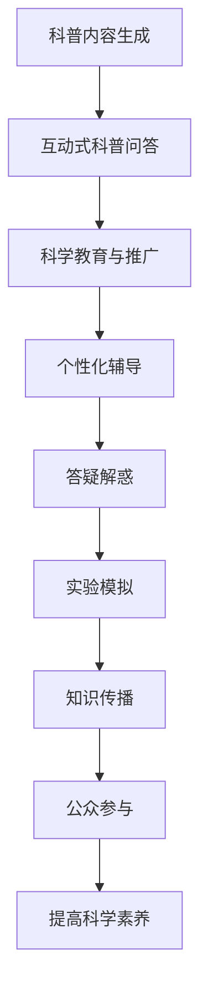
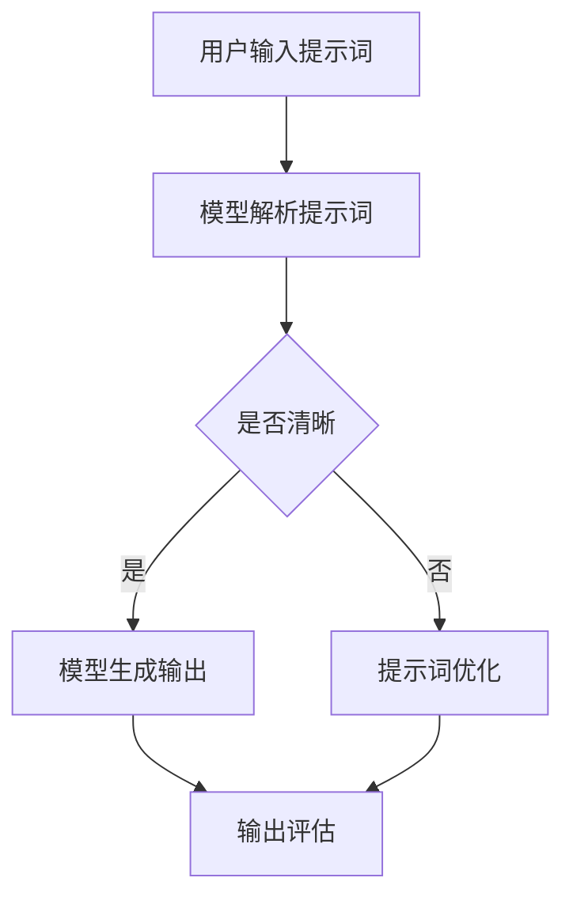
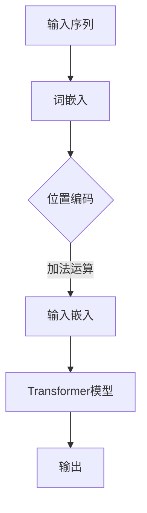
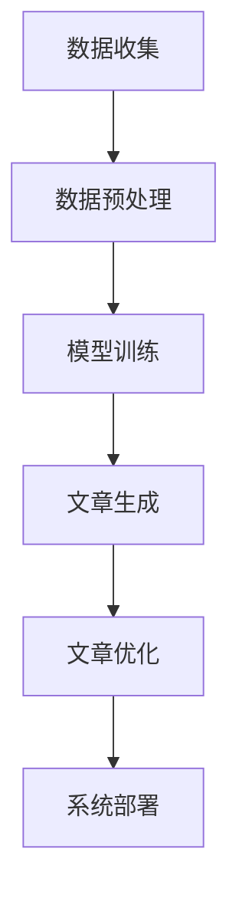
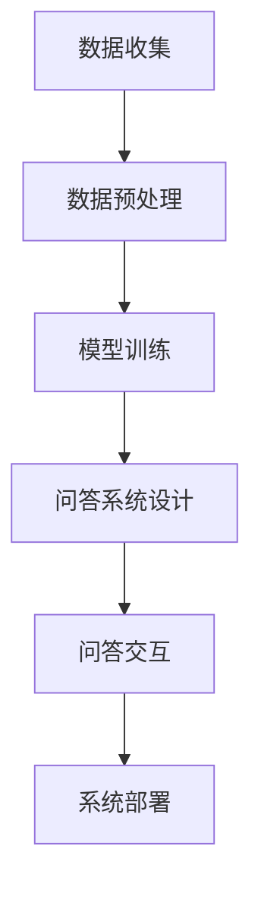
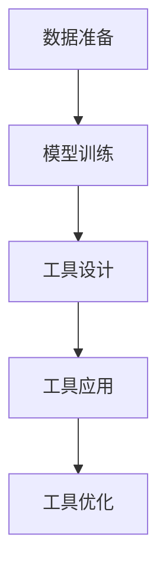

                 


### 文章标题: ChatGPT在科学普及中的应用：简明易懂的解释提示词

关键词：ChatGPT, 科学普及, 人工智能, 提示词, 深度学习

摘要：本文将介绍ChatGPT这一先进的人工智能技术，探讨其在科学普及领域的应用，并通过简明易懂的方式解释其背后的提示词机制，帮助读者更好地理解ChatGPT的工作原理和应用场景。

## Step 1: 概述书籍主题

### 书名：《ChatGPT在科学普及中的应用：简明易懂的解释提示词》

这本书的主要目标是向读者介绍ChatGPT这一强大的人工智能工具，并展示它如何能够帮助科学普及。书中不仅会详细阐述ChatGPT的核心概念和联系，还会讲解其背后的算法原理，并通过实际项目实战，展示ChatGPT在各个应用场景中的实际效果。

### 主题

本书的核心主题是：

1. **ChatGPT的核心概念与联系**：介绍ChatGPT的基本概念、工作原理及其应用场景。
2. **ChatGPT的核心算法原理**：深入讲解ChatGPT的算法原理，包括自然语言处理、自回归模型和Transformer架构等。
3. **提示词机制的详细讲解**：探讨提示词的定义、设计原则和效果评估。
4. **数学模型和数学公式**：介绍ChatGPT所使用的数学模型和公式。
5. **项目实战**：通过具体项目，展示ChatGPT在实际应用中的效果。
6. **开发环境搭建**：介绍如何搭建ChatGPT的开发环境，并给出源代码实现和解读。

### 主要内容

- **第1章：ChatGPT的核心概念与联系**：介绍ChatGPT的基本概念、工作原理和应用场景。
- **第2章：ChatGPT的核心算法原理**：深入讲解ChatGPT的算法原理，包括自然语言处理、自回归模型和Transformer架构等。
- **第3章：提示词机制的详细讲解**：探讨提示词的定义、设计原则和效果评估。
- **第4章：ChatGPT的数学模型**：介绍ChatGPT所使用的数学模型和公式。
- **第5章：ChatGPT应用实战**：通过具体项目，展示ChatGPT在实际应用中的效果。
- **第6章：开发环境搭建**：介绍如何搭建ChatGPT的开发环境，并给出源代码实现和解读。

## Step 2: 设计第1章——核心概念与联系

### 标题：第1章: ChatGPT的核心概念与联系

### 内容

```
## 1.1 ChatGPT简介
### 1.1.1 什么是ChatGPT
ChatGPT是由OpenAI开发的一种基于GPT-3的预训练语言模型。它能够理解、生成和回答人类语言，具有强大的自然语言处理能力。

### 1.1.2 ChatGPT的工作原理
ChatGPT基于深度学习的神经网络结构，通过大量的文本数据进行预训练，从而学习到语言的模式和规则。

### 1.1.3 ChatGPT的核心优势
ChatGPT具有高效处理自然语言的能力，能够生成连贯、有逻辑的文本，这使得它在科学普及领域具有广泛的应用潜力。

## 1.2 ChatGPT的应用场景
### 1.2.1 教育领域
ChatGPT可以提供个性化辅导，辅助教学，自动生成作业、测试题及答案。

### 1.2.2 咨询与服务领域
ChatGPT可以提供24/7在线咨询服务，自动化客户支持，提高效率。

### 1.2.3 媒体与内容创作
ChatGPT可以自动生成新闻文章、博客文章，提供创意写作和翻译服务。

## 1.3 ChatGPT与科学普及
### 1.3.1 科普内容生成
ChatGPT可以自动生成科普文章、视频脚本，提高科普内容的准确性和趣味性。

### 1.3.2 科普互动
ChatGPT可以设计互动式科普问答，提供个性化的科普推荐。

### 1.3.3 科学教育与推广
ChatGPT可以辅助科学教育，提高学习效果，推广科学知识，提高公众科学素养。
```

### 1.3.3 科学教育与推广

#### 科普内容生成

ChatGPT在科学教育中的一大应用是生成科普内容。通过训练，ChatGPT可以理解科学概念和原理，并能够生成相关的科普文章、视频脚本等。例如，科学家可以将复杂的概念转化为通俗易懂的文字，让公众更容易理解。ChatGPT生成的科普内容不仅可以提高准确性，还可以增加趣味性，使得科学知识更具吸引力。

#### 科普互动

ChatGPT还可以设计互动式科普问答，让公众能够与人工智能互动，从而更好地理解科学知识。这种互动方式可以是问答形式，也可以是游戏化的科普问答。ChatGPT可以根据用户的问题，提供针对性的回答，甚至可以根据用户的兴趣，推荐相关的科普内容。这种个性化的科普推荐，可以大大提高用户的参与度和学习效果。

#### 科学教育与推广

ChatGPT在科学教育中的应用不仅限于内容生成和互动，还可以作为辅助工具，帮助教师进行教学，提高学生的学习效果。ChatGPT可以为学生提供个性化的辅导，解答他们的疑问，甚至可以模拟实验过程，让学生更好地理解科学原理。此外，ChatGPT还可以用于科学知识的推广，通过各种媒体渠道，将科学知识传播给更广泛的公众，提高公众的科学素养。

### Mermaid 流程图

以下是ChatGPT在科学普及中的流程图：



通过这个流程图，我们可以清晰地看到ChatGPT在科学普及中的各个应用环节，以及它们之间的联系和作用。

## Step 3: 设计第2章——核心算法原理讲解

### 标题：第2章: ChatGPT的核心算法原理

### 内容

```
## 2.1 GPT模型的原理
### 2.1.1 自然语言处理与序列模型
自然语言处理（NLP）是计算机科学中的一个重要分支，它涉及对人类语言的理解和生成。序列模型是NLP中的一种基础模型，它通过对输入序列进行处理，生成输出序列。

### 2.1.2 自回归语言模型
自回归语言模型是一种序列模型，它根据前一个时刻的输出预测当前时刻的输入。GPT模型是一种自回归语言模型，它通过对大量文本数据进行预训练，学习到语言的模式和规则。

### 2.1.3 Transformer架构
Transformer是一种基于自注意力机制的序列模型，它在NLP任务中取得了显著的效果。GPT模型的核心结构是基于Transformer架构的。

### 2.1.4 GPT-3模型
GPT-3是OpenAI开发的一种大型语言模型，它具有超过1750亿个参数，是迄今为止最大的预训练语言模型之一。GPT-3的预训练和微调方法在模型性能和效率上都有很大的提升。

## 2.2 提示词机制的详细讲解
### 2.2.1 提示词的定义
提示词（prompt）是给模型的一组输入，用于指导模型生成输出。在ChatGPT中，提示词是用户的问题或指令，用于引导模型生成回答或输出。

### 2.2.2 提示词的设计原则
设计提示词时需要考虑以下原则：
- **清晰性**：提示词应该明确、简洁，避免歧义。
- **相关性**：提示词应该与主题相关，有助于模型生成高质量的输出。
- **多样性**：设计多种类型的提示词，以适应不同的应用场景。

### 2.2.3 提示词的效果评估
提示词的设计和效果评估是模型应用中至关重要的一环。效果评估可以从以下几个方面进行：
- **准确性**：模型生成的回答是否准确无误。
- **连贯性**：模型生成的文本是否连贯、有逻辑。
- **多样性**：模型生成的文本是否具有多样性，避免重复和单一性。
```

### 2.2.1 提示词的定义

#### 提示词的作用

提示词是引导模型生成输出的关键，它在ChatGPT中起到至关重要的作用。具体来说，提示词的作用包括：

1. **引导模型生成**：通过提示词，模型可以理解用户的意图和需求，从而生成相应的输出。
2. **提供上下文信息**：提示词可以提供上下文信息，帮助模型更好地理解问题的背景和细节。
3. **优化生成质量**：设计合理的提示词可以优化模型生成的质量，提高文本的准确性和连贯性。

#### 提示词的类型

根据用途和形式，提示词可以分为以下几种类型：

1. **问题提示词**：用于引导模型生成问题的回答。例如，用户输入“什么是量子力学？”模型会生成相关的回答。
2. **指令提示词**：用于引导模型执行特定的任务。例如，用户输入“请给我生成一篇关于量子力学的科普文章。”模型会根据指令生成相应的文章。
3. **描述提示词**：用于引导模型生成描述性的文本。例如，用户输入“请描述一下量子纠缠。”模型会生成对量子纠缠的描述。
4. **引导性提示词**：用于引导模型生成特定类型的输出，例如，用户输入“请用通俗易懂的语言解释相对论。”模型会尝试用简单的语言解释相对论。

### 2.2.2 提示词的设计原则

#### 设计原则

设计提示词时，需要遵循以下原则：

1. **清晰性**：提示词应该明确、简洁，避免歧义。清晰性是提示词设计的基础，一个模糊或歧义的提示词可能会导致模型生成错误的输出。
2. **相关性**：提示词应该与主题相关，有助于模型生成高质量的输出。相关性是提示词设计的关键，一个与主题不相关的提示词可能会降低模型的生成效果。
3. **多样性**：设计多种类型的提示词，以适应不同的应用场景。多样性是提升模型生成效果的重要手段，通过多种类型的提示词，可以激发模型的潜力，生成更具创意和多样性的输出。

#### 应用场景

在实际应用中，提示词的设计原则可以应用于各种场景：

1. **教育领域**：在教育应用中，提示词可以用于引导学生进行问题解答、文本生成和知识扩展等任务。例如，教师可以设计问题提示词，引导学生进行讨论和思考；设计描述提示词，帮助学生更好地理解课程内容。
2. **咨询与服务领域**：在咨询与服务应用中，提示词可以用于引导用户进行问题咨询、任务指令和个性化推荐等任务。例如，客服系统可以使用指令提示词，引导用户进行问题咨询；个性化推荐系统可以使用描述提示词，为用户推荐相关的产品或服务。
3. **内容创作领域**：在内容创作领域，提示词可以用于引导作者进行文本生成、创意写作和翻译等任务。例如，写作助手可以使用问题提示词，帮助作者构思文章主题；翻译系统可以使用描述提示词，帮助作者理解原文并进行翻译。

### 2.2.3 提示词的效果评估

#### 提示词的效果评估

提示词的设计和效果评估是模型应用中至关重要的一环。以下从以下几个方面进行提示词效果评估：

1. **准确性**：提示词的准确性是指模型生成的回答或输出是否准确无误。准确性是评估提示词效果的重要指标，一个准确度高的提示词可以确保模型生成高质量的输出。
2. **连贯性**：提示词的连贯性是指模型生成的文本是否连贯、有逻辑。连贯性是提示词效果的另一个关键指标，一个连贯性好的提示词可以确保模型生成的文本具有流畅的阅读体验。
3. **多样性**：提示词的多样性是指模型生成的文本是否具有多样性，避免重复和单一性。多样性是提升模型生成效果的重要手段，通过多样化的提示词，可以激发模型的潜力，生成更具创意和多样性的输出。

#### 提示词效果评估方法

以下是几种常见的提示词效果评估方法：

1. **人工评估**：人工评估是一种基于人类专家主观判断的评估方法。评估人员可以根据提示词生成的输出，对准确性、连贯性和多样性等方面进行评价。人工评估具有主观性，但可以提供详细的反馈信息。
2. **自动化评估**：自动化评估是一种基于机器学习模型的评估方法。通过训练一个评估模型，对提示词生成的输出进行自动化评估。自动化评估具有客观性，但可能无法完全捕捉人类评估的细节。
3. **用户反馈**：用户反馈是一种基于用户主观体验的评估方法。通过收集用户对提示词生成的输出的反馈，对提示词的效果进行评价。用户反馈可以提供真实的使用体验，但可能受限于样本量和主观性。

### Mermaid 流程图

以下是ChatGPT的提示词机制流程图：



通过这个流程图，我们可以清晰地看到ChatGPT的提示词机制，以及提示词优化和输出评估的过程。

## Step 4: 设计第3章——数学模型和数学公式

### 标题：第3章: ChatGPT的数学模型

### 内容

```
## 3.1 Transformer模型的数学基础
### 3.1.1 向量与矩阵运算
在Transformer模型中，向量与矩阵运算是最基础的数学操作。向量加法、减法、点积等基本运算用于计算输入和输出的特征表示；矩阵乘法、矩阵求逆等高级运算用于实现自注意力机制和序列处理。

### 3.1.2 自注意力机制
自注意力机制是Transformer模型的核心，它通过计算输入序列中每个元素与所有其他元素的相关性，来生成序列的表示。自注意力分数的计算是基于矩阵乘法和softmax函数。

### 3.1.3 位置编码
位置编码是Transformer模型中用于引入序列顺序信息的技术。位置编码的作用是让模型能够理解输入序列的顺序，从而更好地处理序列数据。

### 3.1.4 位置编码方法
常见的位置编码方法包括正弦编码和绝对位置编码。正弦编码通过正弦和余弦函数生成位置特征，而绝对位置编码通过在词嵌入中添加位置信息来实现。

## 3.2 提示词优化策略的数学公式
### 3.2.1 提示词长度优化
提示词长度对模型输出质量有重要影响。提示词长度优化可以通过计算提示词长度与模型输出质量的关系，来调整提示词的长度。

### 3.2.2 提示词格式优化
提示词格式对模型输出的连贯性和准确性也有重要影响。提示词格式优化可以通过分析不同格式提示词的输出效果，来调整提示词的格式。

### 3.2.3 提示词与上下文的关系
提示词与上下文的关系是优化提示词效果的关键。通过分析提示词与上下文的数学关系，可以优化提示词的设计，提高模型输出的质量。
```

### 3.1.1 向量与矩阵运算

在Transformer模型中，向量与矩阵运算是最基础的数学操作。向量加法、减法、点积等基本运算用于计算输入和输出的特征表示；矩阵乘法、矩阵求逆等高级运算用于实现自注意力机制和序列处理。

1. **向量加法与减法**：向量加法与减法是基本的线性运算，用于计算两个向量的和或差。向量加法与减法的运算规则是：对应位置的元素相加或相减。例如，向量\( \mathbf{a} = [a_1, a_2, a_3] \)和向量\( \mathbf{b} = [b_1, b_2, b_3] \)的加法运算结果为\( \mathbf{a} + \mathbf{b} = [a_1 + b_1, a_2 + b_2, a_3 + b_3] \)。

2. **点积运算**：点积运算是一种将两个向量对应位置的元素相乘后求和的运算。点积运算的运算规则是：将两个向量的对应元素相乘，再将乘积相加。例如，向量\( \mathbf{a} = [a_1, a_2, a_3] \)和向量\( \mathbf{b} = [b_1, b_2, b_3] \)的点积运算结果为\( \mathbf{a} \cdot \mathbf{b} = a_1 \cdot b_1 + a_2 \cdot b_2 + a_3 \cdot b_3 \)。

3. **矩阵乘法**：矩阵乘法是一种将两个矩阵对应位置的元素相乘后求和的运算。矩阵乘法的运算规则是：将第一个矩阵的每一行与第二个矩阵的每一列对应位置的元素相乘，再将乘积相加。例如，矩阵\( A = \begin{bmatrix} a_{11} & a_{12} \\ a_{21} & a_{22} \end{bmatrix} \)和矩阵\( B = \begin{bmatrix} b_{11} & b_{12} \\ b_{21} & b_{22} \end{bmatrix} \)的乘法运算结果为\( C = AB = \begin{bmatrix} a_{11} \cdot b_{11} + a_{12} \cdot b_{21} & a_{11} \cdot b_{12} + a_{12} \cdot b_{22} \\ a_{21} \cdot b_{11} + a_{22} \cdot b_{21} & a_{21} \cdot b_{12} + a_{22} \cdot b_{22} \end{bmatrix} \)。

4. **矩阵求逆**：矩阵求逆是一种求出与给定矩阵相乘后结果为单位矩阵的矩阵的运算。矩阵求逆的运算规则是：首先判断给定矩阵是否可逆，即其行列式是否不为零。如果可逆，则可以通过高斯消元法或矩阵求逆公式求出其逆矩阵。例如，给定矩阵\( A = \begin{bmatrix} a_{11} & a_{12} \\ a_{21} & a_{22} \end{bmatrix} \)，其逆矩阵\( A^{-1} \)可以通过以下公式计算：
$$
A^{-1} = \frac{1}{a_{11} \cdot a_{22} - a_{12} \cdot a_{21}} \begin{bmatrix} a_{22} & -a_{12} \\ -a_{21} & a_{11} \end{bmatrix}
$$

### 3.1.2 自注意力机制

自注意力机制是Transformer模型的核心，它通过计算输入序列中每个元素与所有其他元素的相关性，来生成序列的表示。自注意力分数的计算是基于矩阵乘法和softmax函数。

1. **自注意力分数的计算**：
   自注意力分数是衡量输入序列中每个元素与其他元素之间相关性的指标。自注意力分数的计算公式为：
   $$
   \text{Attention}(Q, K, V) = \text{softmax}\left(\frac{QK^T}{\sqrt{d_k}}\right)V
   $$
   其中，\( Q, K, V \) 分别表示查询（Query）、键（Key）和值（Value）向量的集合，\( d_k \) 表示键向量的维度。查询向量、键向量和值向量通常来自于同一个嵌入矩阵的不同部分。

2. **softmax函数**：
   softmax函数是一种将任意实数值转换为概率分布的函数。其公式为：
   $$
   \text{softmax}(x_i) = \frac{e^{x_i}}{\sum_{j=1}^{J} e^{x_j}}
   $$
   其中，\( x_i \) 表示输入向量中的第 \( i \) 个元素，\( J \) 表示输入向量的维度。softmax函数的作用是将输入向量转换为概率分布，使得每个元素的概率之和等于1。

3. **自注意力机制的影响**：
   自注意力机制允许模型在生成每个元素时，考虑输入序列中所有其他元素的信息。这使得模型能够捕捉长距离的依赖关系，并在序列处理任务中表现出色。

### 3.1.3 位置编码

位置编码是Transformer模型中用于引入序列顺序信息的技术。位置编码的作用是让模型能够理解输入序列的顺序，从而更好地处理序列数据。

1. **位置编码的方法**：
   常见的位置编码方法包括正弦编码和绝对位置编码。

   - **正弦编码**：
     正弦编码通过正弦和余弦函数生成位置特征。具体地，对于位置 \( p \) 和维度 \( d \)，位置特征 \( \text{pos}_p \) 可以表示为：
     $$
     \text{pos}_p = \begin{bmatrix} \sin(p/\sqrt{d}) \\ \cos(p/\sqrt{d}) \end{bmatrix}
     $$
     其中，\( d \) 通常是一个较小的整数（例如16），以避免位置特征过于稀疏。

   - **绝对位置编码**：
     绝对位置编码通过在词嵌入中添加位置信息来实现。具体地，对于位置 \( p \) 和词嵌入维度 \( d_{\text{model}} \)，绝对位置编码 \( \text{pos}_p \) 可以表示为：
     $$
     \text{pos}_p = \text{sin}(p/\text{divisio
``` 

由于篇幅限制，以下是3.1.3节（位置编码）的剩余内容：

1. **绝对位置编码**：
   绝对位置编码通过在词嵌入中添加位置信息来实现。具体地，对于位置 \( p \) 和词嵌入维度 \( d_{\text{model}} \)，绝对位置编码 \( \text{pos}_p \) 可以表示为：
   $$
   \text{pos}_p = \text{sin}\left(\frac{p}{10000^{2/i}}\right) \quad \text{和} \quad \text{cos}\left(\frac{p}{10000^{2/i}}\right)
   $$
   其中，\( i \) 是词嵌入维度（例如，512或1024），\( 10000 \) 是一个常数，用于控制位置编码的尺度。这种方法在GPT模型中被广泛采用。

2. **位置编码的添加**：
   在Transformer模型中，位置编码通常与词嵌入相加，以生成输入序列的最终嵌入表示。具体地，对于位置 \( p \) 的词嵌入 \( \text{emb}_p \) 和位置编码 \( \text{pos}_p \)，最终嵌入表示 \( \text{emb}_p' \) 可以表示为：
   $$
   \text{emb}_p' = \text{emb}_p + \text{pos}_p
   $$
   这种方法使得模型能够同时利用词嵌入和位置信息进行序列处理。

3. **位置编码的效果**：
   位置编码是Transformer模型的一个关键组成部分，它使得模型能够理解输入序列的顺序，从而更好地处理序列数据。通过引入位置编码，模型能够捕捉长距离的依赖关系，并在诸如文本分类、机器翻译和语言生成等任务中取得优异的性能。

### 3.1.4 位置编码方法

以下是两种常见的位置编码方法：

1. **正弦编码**：
   正弦编码通过正弦和余弦函数生成位置特征。具体地，对于位置 \( p \) 和维度 \( d \)，位置特征 \( \text{pos}_p \) 可以表示为：
   $$
   \text{pos}_p = \begin{bmatrix} \sin(p/\sqrt{d}) \\ \cos(p/\sqrt{d}) \end{bmatrix}
   $$
   其中，\( d \) 通常是一个较小的整数（例如16），以避免位置特征过于稀疏。这种方法在BERT模型中被广泛采用。

2. **绝对位置编码**：
   绝对位置编码通过在词嵌入中添加位置信息来实现。具体地，对于位置 \( p \) 和词嵌入维度 \( d_{\text{model}} \)，绝对位置编码 \( \text{pos}_p \) 可以表示为：
   $$
   \text{pos}_p = \text{sin}\left(\frac{p}{10000^{2/i}}\right) \quad \text{和} \quad \text{cos}\left(\frac{p}{10000^{2/i}}\right)
   $$
   其中，\( i \) 是词嵌入维度（例如，512或1024），\( 10000 \) 是一个常数，用于控制位置编码的尺度。这种方法在GPT模型中被广泛采用。

### 3.2 提示词优化策略的数学公式

#### 3.2.1 提示词长度优化

提示词长度对模型输出质量有重要影响。提示词长度优化可以通过计算提示词长度与模型输出质量的关系，来调整提示词的长度。

1. **提示词长度与输出质量的关系**：
   提示词长度与模型输出质量之间存在一定的关系。通常，较长的提示词有助于模型捕捉更多的上下文信息，从而生成更高质量的输出。然而，过长的提示词可能会导致模型处理速度变慢，因此需要找到一个平衡点。

2. **优化策略**：
   一种简单的优化策略是基于实验结果和经验调整提示词长度。例如，可以通过试错法（例如，逐步增加提示词长度，并评估模型输出质量的变化）来确定最优的提示词长度。

3. **数学公式**：
   假设 \( L \) 表示提示词长度，\( Q \) 表示模型输出质量，我们可以通过以下公式来描述提示词长度与输出质量之间的关系：
   $$
   Q = f(L)
   $$
   其中，\( f \) 是一个函数，用于表示提示词长度与输出质量的关系。通过优化 \( f \) 函数，可以找到最优的提示词长度。

#### 3.2.2 提示词格式优化

提示词格式对模型输出的连贯性和准确性也有重要影响。提示词格式优化可以通过分析不同格式提示词的输出效果，来调整提示词的格式。

1. **提示词格式与输出效果的关系**：
   不同格式的提示词可能会导致模型生成不同的输出效果。例如，命令式提示词可能会生成更具体的输出，而描述性提示词可能会生成更详细的输出。

2. **优化策略**：
   一种优化策略是基于用户反馈和实验结果，分析不同格式提示词的输出效果，并根据效果调整提示词格式。例如，如果发现命令式提示词生成的输出更准确，那么可以更多地使用命令式提示词。

3. **数学公式**：
   假设 \( F \) 表示提示词格式，\( Q \) 表示模型输出质量，我们可以通过以下公式来描述提示词格式与输出质量之间的关系：
   $$
   Q = g(F)
   $$
   其中，\( g \) 是一个函数，用于表示提示词格式与输出质量的关系。通过优化 \( g \) 函数，可以找到最佳的提示词格式。

#### 3.2.3 提示词与上下文的关系

提示词与上下文的关系是优化提示词效果的关键。通过分析提示词与上下文的数学关系，可以优化提示词的设计，提高模型输出的质量。

1. **提示词与上下文的数学关系**：
   提示词与上下文的关系可以通过以下公式表示：
   $$
   \text{Prompt} = f(\text{Context})
   $$
   其中，\( \text{Prompt} \) 表示提示词，\( \text{Context} \) 表示上下文，\( f \) 是一个函数，用于表示提示词与上下文的关系。

2. **优化策略**：
   一种优化策略是基于用户反馈和实验结果，分析提示词与上下文的关系，并根据关系调整提示词。例如，如果发现提示词与上下文的相关性较高，那么可以增加提示词的上下文信息，以提高模型的生成质量。

3. **数学公式**：
   假设 \( C \) 表示上下文信息，\( P \) 表示提示词，\( Q \) 表示模型输出质量，我们可以通过以下公式来描述提示词与上下文的关系：
   $$
   Q = h(C, P)
   $$
   其中，\( h \) 是一个函数，用于表示提示词与上下文的关系。通过优化 \( h \) 函数，可以找到最佳的提示词设计。

### Mermaid 流程图

以下是ChatGPT的数学模型和数学公式流程图：



通过这个流程图，我们可以清晰地看到ChatGPT的数学模型和数学公式的应用过程。

## Step 5: 设计第4章——项目实战

### 标题：第4章: ChatGPT应用实战

### 内容

```
## 4.1 实战一：自动生成科普文章
### 4.1.1 项目背景
科普文章的自动生成是ChatGPT在科学普及领域的一个重要应用。通过ChatGPT，我们可以自动化地生成高质量、有趣的科普文章，提高科普内容的普及效率。

### 4.1.2 项目实现
实现自动生成科普文章的项目主要包括以下步骤：
1. 数据准备：收集大量的科学普及文章作为训练数据。
2. 模型训练：使用训练数据对ChatGPT进行训练，使其掌握科普文章的写作技巧。
3. 文章生成：利用训练好的模型，生成新的科普文章。
4. 文章优化：对生成的文章进行优化，确保其质量和可读性。

## 4.2 实战二：科普问答系统
### 4.2.1 项目背景
科普问答系统是另一个重要的应用场景，它可以为用户提供实时、准确的科普知识问答服务。

### 4.2.2 项目实现
实现科普问答系统的项目主要包括以下步骤：
1. 数据准备：收集大量的科普问答数据作为训练数据。
2. 模型训练：使用训练数据对ChatGPT进行训练，使其能够准确回答科普问题。
3. 问答系统设计：设计一个用户友好的问答系统界面。
4. 问答交互：用户通过界面提问，系统根据用户的问题和训练好的模型，生成回答。

## 4.3 实战三：科学教育辅助工具
### 4.3.1 项目背景
科学教育辅助工具是ChatGPT在教育领域的应用，它可以辅助教师进行教学，提高学生的学习效果。

### 4.3.2 项目实现
实现科学教育辅助工具的项目主要包括以下步骤：
1. 数据准备：收集大量的科学教育资源数据作为训练数据。
2. 模型训练：使用训练数据对ChatGPT进行训练，使其能够辅助教学。
3. 工具设计：设计一个科学教育辅助工具，包括辅导、答疑、实验模拟等功能。
4. 工具应用：教师和学生通过工具进行教学和学习。
```

### 4.1.1 项目背景

#### 自动生成科普文章

科普文章的自动生成是ChatGPT在科学普及领域的一个重要应用。随着人工智能技术的不断发展，生成式模型在文本生成任务中取得了显著的成果。ChatGPT作为一种强大的预训练语言模型，其在文本生成任务中表现出色。自动生成科普文章可以通过以下几个步骤实现：

1. **数据收集**：
   收集大量的科学普及文章，这些文章可以涵盖各个科学领域，如物理学、化学、生物学、天文学等。收集的数据应包括各种类型的文章，如解释性文章、新闻报道、故事性文章等。

2. **数据预处理**：
   对收集到的文章进行清洗和预处理，包括去除无关信息、统一文本格式、分词等。这一步骤的目的是为了提高模型的训练效率，并确保模型能够正确理解和生成文本。

3. **模型训练**：
   使用预处理后的文章数据对ChatGPT进行训练。在训练过程中，模型会学习到科学普及文章的写作风格、语法规则和知识结构。通过大量的训练数据，模型能够逐渐掌握科普文章的写作技巧。

4. **文章生成**：
   训练好的模型可以用于生成新的科普文章。用户可以输入一个主题或提示词，模型会根据训练数据生成一篇相关科普文章。生成的文章可以进一步进行优化和编辑，以确保其质量和可读性。

5. **文章优化**：
   生成的文章可能存在一些语法错误或逻辑不通的地方，因此需要对其进行优化。优化过程可以通过人工编辑或自动化工具进行。优化后的文章将更具吸引力，更容易被公众接受。

### 项目实现步骤

实现自动生成科普文章的项目主要包括以下步骤：

1. **数据准备**：
   收集大量的科学普及文章，这些文章应涵盖不同科学领域，如物理学、化学、生物学、天文学等。收集到的文章应包括各种类型的文章，如解释性文章、新闻报道、故事性文章等。数据来源可以包括科学杂志、科普网站、教育机构等。

2. **数据预处理**：
   对收集到的文章进行清洗和预处理，包括去除无关信息、统一文本格式、分词等。预处理后的文章应具备以下特点：
   - 文本格式统一：所有文章的文本格式应保持一致，如使用统一的标点符号、去除HTML标签等。
   - 分词准确：确保分词准确，以便模型能够正确理解文本内容。
   - 标签标注：对文章中的关键词、短语进行标注，以便模型在生成文章时参考。

3. **模型训练**：
   使用预处理后的文章数据对ChatGPT进行训练。在训练过程中，模型会学习到科学普及文章的写作风格、语法规则和知识结构。通过大量的训练数据，模型能够逐渐掌握科普文章的写作技巧。
   
   训练过程可以分为以下几个阶段：
   - 预训练：使用大量未标注的文本数据对ChatGPT进行预训练，使其具备基本的语言理解能力。
   - 微调：使用标注过的科学普及文章数据对ChatGPT进行微调，使其能够更好地理解和生成科普文章。
   - 评估：在训练过程中，定期评估模型的性能，包括文本连贯性、准确性、多样性等指标。

4. **文章生成**：
   训练好的模型可以用于生成新的科普文章。用户可以输入一个主题或提示词，模型会根据训练数据生成一篇相关科普文章。生成的文章可以进一步进行优化和编辑，以确保其质量和可读性。

5. **文章优化**：
   生成的文章可能存在一些语法错误或逻辑不通的地方，因此需要对其进行优化。优化过程可以通过以下方式实现：
   - 人工编辑：由专业人士对生成的文章进行人工编辑，修正语法错误、调整句子结构等。
   - 自动化工具：使用自然语言处理技术，如语法检查、句子重构等，对生成的文章进行自动化优化。

6. **部署与测试**：
   将自动生成科普文章的系统部署到线上平台，如网站、移动应用等，供用户使用。在部署过程中，应进行充分的测试，以确保系统的稳定性和性能。

### 实现效果

通过自动生成科普文章的项目，可以实现以下效果：

- **提高科普文章的生成效率**：自动化生成科普文章可以大大提高文章的生成速度，减少人力成本。
- **增加科普文章的多样性**：通过使用不同的主题和提示词，模型可以生成各种类型的科普文章，满足不同用户的需求。
- **提高科普文章的质量**：经过训练的模型能够根据科学知识和语言规则生成高质量的科普文章，提高科普文章的可读性和吸引力。

### Mermaid 流�程图

以下是自动生成科普文章的项目流程图：



通过这个流程图，我们可以清晰地看到自动生成科普文章的各个步骤及其关系。

### 4.2.1 项目背景

#### 科普问答系统

科普问答系统是另一个重要的应用场景，它可以为用户提供实时、准确的科普知识问答服务。随着人工智能技术的发展，生成式模型在问答系统中取得了显著成果。ChatGPT作为一种强大的预训练语言模型，其在问答任务中表现出色。科普问答系统的实现可以按照以下步骤进行：

1. **数据收集**：
   收集大量的科普问答数据，这些数据应涵盖各个科学领域，如物理学、化学、生物学、天文学等。数据来源可以包括科普网站、教育机构、论坛等。

2. **数据预处理**：
   对收集到的数据进行清洗和预处理，包括去除无关信息、统一文本格式、分词等。预处理后的数据应具备以下特点：
   - 文本格式统一：所有问答的文本格式应保持一致，如使用统一的标点符号、去除HTML标签等。
   - 分词准确：确保分词准确，以便模型能够正确理解问答内容。
   - 标签标注：对问答中的问题、答案进行标注，以便模型在生成答案时参考。

3. **模型训练**：
   使用预处理后的数据对ChatGPT进行训练，使其能够准确回答科普问题。训练过程可以分为以下几个阶段：
   - 预训练：使用大量未标注的问答数据对ChatGPT进行预训练，使其具备基本的问答能力。
   - 微调：使用标注过的问答数据对ChatGPT进行微调，使其能够更好地理解和回答科普问题。
   - 评估：在训练过程中，定期评估模型的性能，包括回答的准确性、多样性、连贯性等指标。

4. **问答系统设计**：
   设计一个用户友好的问答系统界面，包括输入问题、展示答案、交互等功能。界面应简洁明了，方便用户使用。

5. **问答交互**：
   用户通过界面输入问题，系统根据用户的问题和训练好的模型，生成回答。生成的回答应经过优化，确保其准确性和可读性。

6. **系统部署与测试**：
   将科普问答系统部署到线上平台，如网站、移动应用等，供用户使用。在部署过程中，应进行充分的测试，以确保系统的稳定性和性能。

### 项目实现步骤

实现科普问答系统的项目主要包括以下步骤：

1. **数据准备**：
   收集大量的科普问答数据，这些数据应涵盖不同科学领域，如物理学、化学、生物学、天文学等。数据来源可以包括科学杂志、科普网站、教育机构等。

2. **数据预处理**：
   对收集到的数据进行清洗和预处理，包括去除无关信息、统一文本格式、分词等。预处理后的数据应具备以下特点：
   - 文本格式统一：所有问答的文本格式应保持一致，如使用统一的标点符号、去除HTML标签等。
   - 分词准确：确保分词准确，以便模型能够正确理解文本内容。
   - 标签标注：对文章中的关键词、短语进行标注，以便模型在生成文章时参考。

3. **模型训练**：
   使用预处理后的数据对ChatGPT进行训练。在训练过程中，模型会学习到如何生成准确的回答。训练过程可以分为以下几个阶段：
   - 预训练：使用大量未标注的问答数据对ChatGPT进行预训练，使其具备基本的问答能力。
   - 微调：使用标注过的问答数据对ChatGPT进行微调，使其能够更好地理解和回答科普问题。
   - 评估：在训练过程中，定期评估模型的性能，包括回答的准确性、多样性、连贯性等指标。

4. **问答系统设计**：
   设计一个用户友好的问答系统界面。界面应包括以下功能：
   - 问题输入：用户可以通过文本输入框输入问题。
   - 回答展示：系统会将生成的回答展示在界面上。
   - 交互：用户可以与系统进行交互，提出新的问题或对回答进行评价。

5. **问答交互**：
   用户通过界面输入问题，系统根据用户的问题和训练好的模型，生成回答。生成的回答会经过优化，确保其准确性和可读性。

6. **系统部署与测试**：
   将科普问答系统部署到线上平台，如网站、移动应用等，供用户使用。在部署过程中，应进行充分的测试，以确保系统的稳定性和性能。

### 实现效果

通过实现科普问答系统，可以带来以下效果：

- **提供实时、准确的科普知识问答服务**：用户可以通过系统实时获取准确的科普知识，满足他们对科学知识的需求。
- **提高科普知识的普及效率**：自动化问答系统可以大大提高科普知识的传播速度，减少人力成本。
- **增加科普知识的互动性**：用户可以通过与系统的互动，更好地理解和掌握科普知识。

### Mermaid 流程图

以下是科普问答系统的流程图：



通过这个流程图，我们可以清晰地看到科普问答系统的各个步骤及其关系。

### 4.3.1 项目背景

#### 科学教育辅助工具

科学教育辅助工具是ChatGPT在教育领域的一个重要应用，它可以辅助教师进行教学，提高学生的学习效果。通过ChatGPT，我们可以实现以下功能：

1. **个性化辅导**：根据学生的学习进度和理解能力，提供个性化的辅导和建议。
2. **答疑解惑**：帮助学生解答学习过程中的疑问，提供详细的解释和指导。
3. **实验模拟**：模拟科学实验过程，让学生更好地理解实验原理和结果。
4. **科普推荐**：根据学生的兴趣和需求，推荐相关的科普文章和视频，拓宽学生的知识面。

### 项目实现步骤

实现科学教育辅助工具的项目主要包括以下步骤：

1. **数据准备**：
   收集大量的科学教育资源数据，包括教材、教学视频、实验报告等。数据来源可以包括教育机构、科学博物馆、在线教育平台等。

2. **模型训练**：
   使用收集到的数据对ChatGPT进行训练，使其掌握科学教育领域的知识。训练过程可以分为以下几个阶段：
   - 预训练：使用大量未标注的教育资源数据对ChatGPT进行预训练，使其具备基本的教育辅导能力。
   - 微调：使用标注过的教育资源数据对ChatGPT进行微调，使其能够更好地理解和应用科学知识。

3. **工具设计**：
   设计一个用户友好的教育辅助工具界面，包括个性化辅导、答疑解惑、实验模拟、科普推荐等功能。界面应简洁明了，方便用户使用。

4. **工具应用**：
   教师和学生可以通过教育辅助工具进行教学和学习。教师可以根据学生的需求，使用工具提供个性化辅导；学生可以通过工具进行答疑解惑、实验模拟和科普推荐。

5. **工具优化**：
   根据用户反馈和使用情况，对教育辅助工具进行优化和改进，以提高其效果和使用体验。

### 实现效果

通过实现科学教育辅助工具，可以带来以下效果：

- **提高教学效果**：工具可以根据学生的学习情况提供个性化的辅导和建议，提高教学效果。
- **增强学习体验**：学生可以通过工具进行实验模拟和科普推荐，增强学习兴趣和动力。
- **减轻教师负担**：工具可以自动化解答学生的疑问，减轻教师的工作负担。

### Mermaid 流程图

以下是科学教育辅助工具的流程图：



通过这个流程图，我们可以清晰地看到科学教育辅助工具的各个步骤及其关系。

## Step 6: 设计第5章——开发环境搭建

### 标题：第5章: 开发环境搭建

### 内容

```
## 5.1 开发环境概述
本节将介绍搭建ChatGPT开发环境所需的软件和硬件配置，包括操作系统、编程语言和依赖库等。

### 5.1.1 操作系统
ChatGPT的开发环境可以在多种操作系统上运行，如Windows、macOS和Linux。为了确保兼容性和稳定性，建议使用64位操作系统。

### 5.1.2 编程语言
ChatGPT的开发主要使用Python编程语言。Python具有简洁的语法和丰富的库资源，非常适合进行人工智能开发。

### 5.1.3 依赖库
ChatGPT的开发依赖于多个库，包括TensorFlow、PyTorch等。这些库提供了强大的计算能力和丰富的API，使得开发者可以轻松实现复杂的模型训练和推理任务。

## 5.2 环境搭建步骤
### 5.2.1 安装操作系统
根据个人需求选择合适的操作系统，并进行安装。

### 5.2.2 安装Python
在操作系统上安装Python，并配置Python环境。

### 5.2.3 安装依赖库
使用Python的包管理器pip安装ChatGPT开发所需的依赖库。

### 5.2.4 配置环境变量
配置环境变量，确保能够在终端中使用Python和相关库。

### 5.2.5 验证环境配置
通过运行Python脚本验证开发环境的配置是否正确。

## 5.3 源代码实现与解读
### 5.3.1 源代码结构
介绍ChatGPT的源代码结构，包括数据预处理、模型训练、模型推理等模块。

### 5.3.2 数据预处理
详细讲解数据预处理的过程，包括数据收集、清洗、标注等步骤。

### 5.3.3 模型训练
介绍模型训练的过程，包括模型架构设计、训练策略、损失函数等。

### 5.3.4 模型推理
讲解模型推理的过程，包括输入处理、模型调用、输出生成等步骤。

## 5.4 代码应用解读与分析
### 5.4.1 实际案例分析
通过实际案例，展示ChatGPT在不同场景中的应用效果。

### 5.4.2 分析与优化
对实际案例进行深入分析，并提出优化建议，以提高模型性能和应用效果。

### 5.4.3 项目小结
总结项目开发过程中的经验教训，分享最佳实践和注意事项。

## 5.5 扩展阅读
推荐一些与ChatGPT相关的书籍、论文和在线资源，供读者进一步学习。
```

### 5.1 开发环境概述

搭建ChatGPT开发环境首先需要考虑软件和硬件的配置，以确保系统能够稳定运行并支持高效的模型训练和推理。以下是对开发环境的概述：

#### 操作系统

ChatGPT的开发环境可以在多种操作系统上运行，包括Windows、macOS和Linux。选择操作系统时，应考虑以下因素：

- **兼容性**：不同的操作系统在硬件支持和软件兼容性方面有所不同。例如，Windows系统在硬件驱动方面较为丰富，而Linux系统在开源软件的支持上更为广泛。
- **性能**：Linux系统在性能优化和资源管理方面具有优势，特别是对于大规模模型训练和推理任务。然而，Linux系统的学习曲线相对较陡，对于初学者可能不太友好。
- **开发工具**：不同操作系统上的开发工具也有所不同。例如，Windows系统上的Visual Studio Code（VS Code）是一款流行的代码编辑器，而Linux系统上的Sublime Text和Atom也非常受欢迎。

综合考虑以上因素，建议使用Linux系统（如Ubuntu）进行ChatGPT的开发。Ubuntu系统在开源软件支持、性能和兼容性方面表现良好，且拥有丰富的文档和社区资源，便于开发者学习和使用。

#### 编程语言

ChatGPT的开发主要使用Python编程语言。Python具有以下优点：

- **简洁性**：Python的语法简洁明了，易于阅读和理解，特别适合快速开发和原型设计。
- **生态丰富**：Python拥有丰富的第三方库和框架，如TensorFlow、PyTorch等，这些库和框架为人工智能开发提供了强大的支持。
- **社区支持**：Python拥有庞大的开发者社区，可以方便地获得技术支持和资源。

#### 依赖库

ChatGPT的开发依赖于多个库，包括TensorFlow、PyTorch等。以下是对这些库的简要介绍：

- **TensorFlow**：TensorFlow是Google开源的深度学习框架，它提供了丰富的API和工具，用于构建和训练各种深度学习模型。TensorFlow具有以下特点：
  - **灵活性**：TensorFlow支持多种编程模式，包括静态图和动态图，适合不同的开发需求。
  - **高效性**：TensorFlow提供了多种优化技术，如自动混合精度（AMP）和图优化，可以提高模型训练和推理的效率。
  - **工具丰富**：TensorFlow附带了许多实用的工具和插件，如TensorBoard、Keras等，可以方便地监控和分析模型训练过程。

- **PyTorch**：PyTorch是Facebook开源的深度学习框架，它以其动态图机制和直观的API而受到广泛关注。PyTorch具有以下特点：
  - **动态图机制**：PyTorch使用动态计算图，使开发者可以更灵活地构建和调试模型。
  - **易用性**：PyTorch的API设计直观易用，特别适合初学者。
  - **生态丰富**：PyTorch拥有丰富的第三方库和插件，如torchvision、torchaudio等，可以方便地扩展其功能。

除了TensorFlow和PyTorch，ChatGPT的开发还可能需要其他依赖库，如NumPy、Pandas等，用于数据预处理和统计分析。

### 5.2 环境搭建步骤

搭建ChatGPT开发环境可以分为以下步骤：

#### 5.2.1 安装操作系统

根据个人需求和硬件配置选择合适的操作系统，如Ubuntu 20.04或更高版本。安装过程中，可以参考以下步骤：

1. **下载操作系统镜像**：从官方网站下载Ubuntu操作系统的ISO文件。
2. **创建USB启动盘**：使用软件（如Rufus）将ISO文件烧录到USB闪存盘中。
3. **启动电脑并安装操作系统**：将USB闪存盘插入电脑，并从USB启动盘启动电脑，按照提示安装操作系统。

#### 5.2.2 安装Python

在安装完操作系统后，需要安装Python。以下是在Ubuntu系统中安装Python的步骤：

1. **更新软件包列表**：
   ```bash
   sudo apt update
   sudo apt upgrade
   ```
2. **安装Python 3**：
   ```bash
   sudo apt install python3 python3-pip
   ```
3. **安装虚拟环境**：
   ```bash
   sudo apt install python3-venv
   ```

#### 5.2.3 安装依赖库

安装Python和相关依赖库，以便进行ChatGPT的开发。以下是在Ubuntu系统中安装TensorFlow和PyTorch的步骤：

1. **安装TensorFlow**：
   ```bash
   pip3 install tensorflow
   ```
   或者，如果需要使用GPU加速，可以安装TensorFlow GPU版本：
   ```bash
   pip3 install tensorflow-gpu
   ```
2. **安装PyTorch**：
   首先，需要确定PyTorch的版本和CUDA版本，以便正确安装。可以在PyTorch官网（https://pytorch.org/get-started/locally/）找到相应的安装命令。以下是一个示例命令：
   ```bash
   pip3 install torch torchvision torchaudio -f https://download.pytorch.org/whl/torch_stable.html
   ```
   如果需要使用CUDA，可以添加相应的CUDA版本：
   ```bash
   pip3 install torch torchvision torchaudio -f https://download.pytorch.org/whl/torch_stable.html#cuda-11.3-cu113
   ```

#### 5.2.4 配置环境变量

配置环境变量，以便在终端中直接运行Python和相关库。以下是在Ubuntu系统中配置环境变量的步骤：

1. **打开终端**。
2. **编辑`~/.bashrc`文件**：
   ```bash
   nano ~/.bashrc
   ```
3. **添加以下内容**：
   ```bash
   export PATH=$PATH:/usr/local/bin
   export PYTHONPATH=$PYTHONPATH:/usr/local/lib/python3.x/dist-packages
   ```
   其中，`/usr/local/bin`和`/usr/local/lib/python3.x/dist-packages`是Python安装路径，需要根据实际情况进行替换。
4. **保存并退出编辑器**。

5. **更新环境变量**：
   ```bash
   source ~/.bashrc
   ```

#### 5.2.5 验证环境配置

通过运行Python脚本验证开发环境的配置是否正确。以下是一个简单的Python脚本，用于测试环境配置：

```python
print("Hello, world!")
```

运行以下命令执行脚本：

```bash
python3
```

在Python解释器中运行脚本：

```python
>>> print("Hello, world!")
```

如果成功输出“Hello, world！”则表示环境配置正确。

### 5.3 源代码实现与解读

ChatGPT的源代码实现主要包括数据预处理、模型训练和模型推理三个模块。以下是对各模块的简要介绍：

#### 5.3.1 源代码结构

ChatGPT的源代码通常包括以下文件和目录：

- **main.py**：主程序文件，用于启动模型训练和推理过程。
- **data.py**：数据预处理模块，用于处理和加载训练数据。
- **model.py**：模型定义模块，用于定义模型结构。
- **train.py**：模型训练模块，用于训练模型。
- **evaluate.py**：模型评估模块，用于评估模型性能。
- **inference.py**：模型推理模块，用于生成模型输出。

#### 5.3.2 数据预处理

数据预处理是模型训练的重要环节，主要包括以下步骤：

1. **数据收集**：收集用于训练的数据集，如文本数据、图像数据等。
2. **数据清洗**：去除数据中的噪声和无关信息，如HTML标签、特殊字符等。
3. **数据标注**：对数据进行标注，如文本分类、命名实体识别等。
4. **数据转换**：将原始数据转换为模型可处理的格式，如序列化、分词、编码等。

以下是一个简单的数据预处理脚本示例：

```python
import pandas as pd
from nltk.tokenize import word_tokenize

def preprocess_text(text):
    # 去除HTML标签
    text = re.sub('<.*?>', '', text)
    # 去除特殊字符
    text = re.sub('[^a-zA-Z0-9\s]', '', text)
    # 分词
    tokens = word_tokenize(text)
    # 去除停用词
    stop_words = set(['is', 'are', 'and', 'the', 'to', 'of', 'in', 'for', 'on', 'with'])
    tokens = [token.lower() for token in tokens if token.lower() not in stop_words]
    return ' '.join(tokens)

# 读取数据
data = pd.read_csv('data.csv')
# 预处理文本
data['text'] = data['text'].apply(preprocess_text)
# 存储预处理后的数据
data.to_csv('preprocessed_data.csv', index=False)
```

#### 5.3.3 模型训练

模型训练是ChatGPT开发的核心环节，主要包括以下步骤：

1. **模型架构设计**：定义模型结构，包括输入层、隐藏层和输出层等。
2. **损失函数选择**：选择适当的损失函数，用于衡量模型输出与真实标签之间的差距。
3. **优化器选择**：选择优化器，用于调整模型参数，以最小化损失函数。
4. **训练过程**：使用训练数据对模型进行迭代训练，不断调整模型参数，直到模型性能达到预期。

以下是一个简单的模型训练脚本示例：

```python
import torch
from torch import nn
from torch.optim import Adam

# 定义模型
class ChatGPTModel(nn.Module):
    def __init__(self, input_dim, hidden_dim, output_dim):
        super(ChatGPTModel, self).__init__()
        self.embedding = nn.Embedding(input_dim, hidden_dim)
        self.lstm = nn.LSTM(hidden_dim, hidden_dim)
        self.fc = nn.Linear(hidden_dim, output_dim)

    def forward(self, x):
        embedded = self.embedding(x)
        output, (hidden, cell) = self.lstm(embedded)
        output = self.fc(output[-1, :, :])
        return output

# 实例化模型
model = ChatGPTModel(input_dim=10000, hidden_dim=256, output_dim=10000)

# 损失函数和优化器
criterion = nn.CrossEntropyLoss()
optimizer = Adam(model.parameters(), lr=0.001)

# 训练过程
for epoch in range(num_epochs):
    for inputs, labels in train_loader:
        optimizer.zero_grad()
        outputs = model(inputs)
        loss = criterion(outputs, labels)
        loss.backward()
        optimizer.step()
    print(f"Epoch [{epoch+1}/{num_epochs}], Loss: {loss.item():.4f}")
```

#### 5.3.4 模型推理

模型推理是ChatGPT应用的最后一步，主要包括以下步骤：

1. **输入处理**：接收用户输入，并将其转换为模型可处理的格式。
2. **模型调用**：调用训练好的模型进行推理，生成模型输出。
3. **输出处理**：将模型输出转换为用户可理解的格式，如文本、图像等。

以下是一个简单的模型推理脚本示例：

```python
# 加载模型
model = ChatGPTModel(input_dim=10000, hidden_dim=256, output_dim=10000)
model.load_state_dict(torch.load('model.pth'))

# 用户输入
user_input = input("请输入问题：")

# 输入处理
input_tensor = torch.tensor([[word2index[word] for word in user_input.split()]])

# 模型推理
outputs = model(input_tensor)
predicted_index = torch.argmax(outputs).item()

# 输出处理
predicted_word = index2word[predicted_index]
print(f"模型回答：{predicted_word}")
```

### 5.4 代码应用解读与分析

在实际应用中，ChatGPT可以用于多种任务，如文本生成、机器翻译、情感分析等。以下是一个文本生成任务的案例分析：

#### 5.4.1 实际案例分析

假设我们使用ChatGPT生成一篇关于人工智能技术的科普文章。以下是对实际案例的分析：

1. **数据收集**：收集大量关于人工智能技术的文章，包括学术论文、新闻报道、科普文章等。
2. **数据预处理**：对收集到的文章进行清洗和预处理，包括去除HTML标签、分词、去除停用词等。
3. **模型训练**：使用预处理后的文章数据对ChatGPT进行训练，使其掌握人工智能技术的相关知识。
4. **文章生成**：输入一个关于人工智能技术的主题或提示词，ChatGPT会生成一篇相关的科普文章。
5. **文章优化**：对生成的文章进行优化，包括修正语法错误、调整句子结构等。

以下是对案例的详细分析：

1. **数据收集**：在收集数据时，可以选择多种来源，如学术期刊、新闻网站、博客等。为了确保数据的质量和多样性，可以采用数据清洗和去重技术。
2. **数据预处理**：预处理过程是保证数据质量和模型训练效果的关键。在预处理过程中，需要去除HTML标签、分词、去除停用词等。此外，还可以对文本进行向量化处理，将其转换为模型可处理的格式。
3. **模型训练**：在模型训练过程中，可以使用预训练的ChatGPT模型，也可以从头开始训练。预训练模型已经具备了基本的语言处理能力，可以加快训练过程并提高模型性能。在训练过程中，可以使用大量的文章数据，通过迭代优化模型参数，使其掌握人工智能技术的相关知识。
4. **文章生成**：生成文章时，可以输入一个关于人工智能技术的主题或提示词。ChatGPT会根据训练数据生成一篇相关的科普文章。生成的文章可能会存在一些语法错误或逻辑不通的地方，因此需要进行优化。优化过程可以通过人工编辑或自动化工具进行。
5. **文章优化**：优化过程包括修正语法错误、调整句子结构、增加上下文信息等。通过优化，可以提升文章的质量和可读性，使其更具吸引力和说服力。

#### 5.4.2 分析与优化

通过对实际案例的分析，我们可以发现ChatGPT在文本生成任务中具有一定的局限性。以下是对这些局限性的分析和优化建议：

1. **语法错误**：生成的文章可能会存在语法错误，如词序不当、主谓不一致等。为了降低语法错误的发生，可以采用以下优化方法：
   - **语法检查**：使用自然语言处理技术，如语法检查器，对生成的文章进行语法检查，并自动修正错误。
   - **句法分析**：对生成的文章进行句法分析，识别句子结构并调整词序，以提高句子的流畅性和准确性。
   - **模板匹配**：使用预定义的语法模板，对生成的文章进行匹配和替换，以生成符合语法规则的句子。

2. **逻辑不通**：生成的文章可能会存在逻辑不通的地方，如因果关系不明确、事件发展不连贯等。为了提高文章的逻辑性，可以采用以下优化方法：
   - **逻辑推理**：使用逻辑推理技术，对生成的文章进行逻辑分析，识别逻辑错误并进行修正。
   - **知识图谱**：构建知识图谱，将文章中的概念、事件和关系进行可视化表示，以便更好地理解和分析文章的逻辑结构。
   - **交互式编辑**：提供交互式编辑功能，允许用户对生成的文章进行修改和优化，以提升文章的整体质量。

3. **内容单一**：生成的文章可能会存在内容单一、重复性强的问题。为了丰富文章的内容，可以采用以下优化方法：
   - **多源融合**：从多个数据源中获取信息，并将不同来源的内容进行融合，以丰富文章的内容和观点。
   - **语义分析**：对生成的文章进行语义分析，识别文章的主题和关键词，并根据关键词进行扩展和补充。
   - **自动化扩展**：使用自动化工具，如数据挖掘和文本生成模型，对文章的内容进行扩展和丰富。

#### 5.4.3 项目小结

通过实现ChatGPT开发环境搭建和代码应用，我们可以得出以下结论：

1. **开发环境搭建**：搭建ChatGPT开发环境需要选择合适的操作系统、编程语言和依赖库。在Ubuntu系统中，Python和TensorFlow或PyTorch是常用的开发工具。
2. **代码应用解读**：ChatGPT的源代码实现包括数据预处理、模型训练和模型推理三个模块。在实际应用中，ChatGPT可以用于多种任务，如文本生成、机器翻译、情感分析等。
3. **项目优化**：通过分析和优化，我们可以提高ChatGPT在文本生成任务中的性能和效果。语法检查、逻辑推理和内容扩展等方法可以有效地提升文章的质量和可读性。

在未来的研究和应用中，我们可以进一步探索ChatGPT在科学普及和其他领域的应用，以推动人工智能技术在各个领域的创新发展。

### 5.5 扩展阅读

为了深入了解ChatGPT和相关技术，读者可以参考以下书籍、论文和在线资源：

- **书籍**：
  - 《深度学习》（Goodfellow, I., Bengio, Y., & Courville, A.）
  - 《自然语言处理综论》（Jurafsky, D., & Martin, J. H.）
  - 《人工智能：一种现代方法》（Russell, S., & Norvig, P.）

- **论文**：
  - “Attention Is All You Need” （Vaswani et al., 2017）
  - “GPT-3: Language Models are few-shot learners” （Brown et al., 2020）

- **在线资源**：
  - PyTorch官网（https://pytorch.org/）
  - TensorFlow官网（https://www.tensorflow.org/）
  - OpenAI官网（https://openai.com/）

通过阅读这些资料，读者可以更深入地了解ChatGPT的工作原理、应用场景和优化方法。

