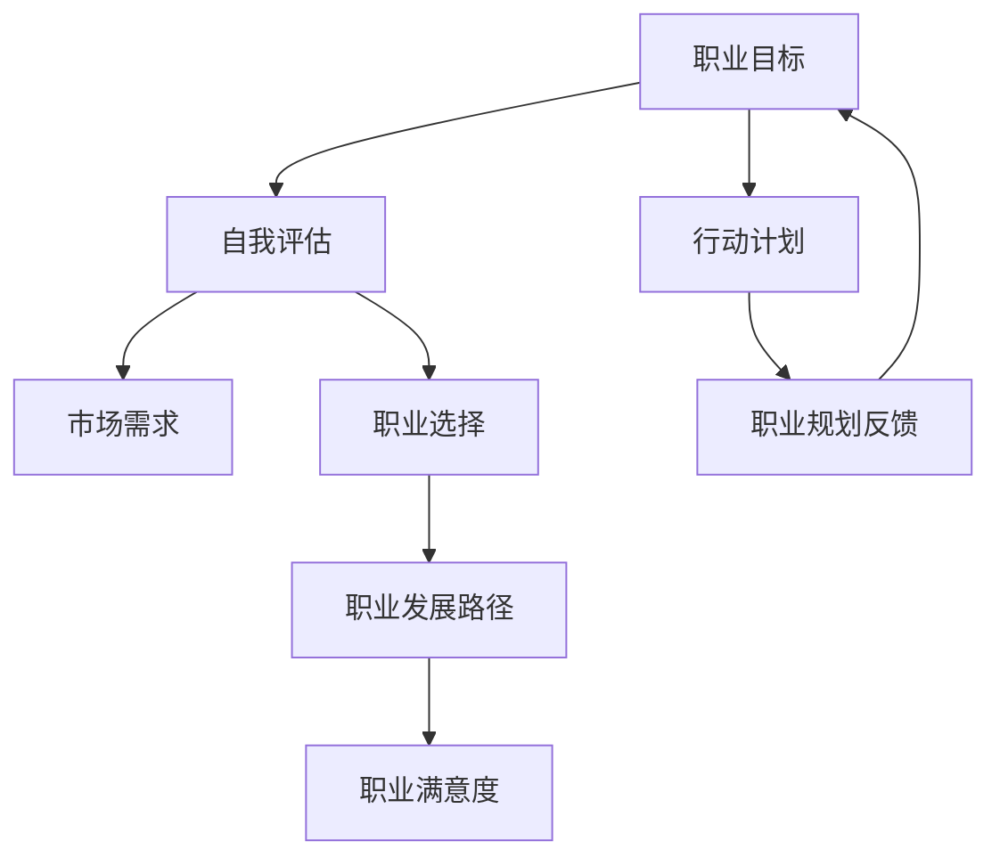

                 

### 文章标题

# ChatGPT在职业规划中的应用：个性化职业建议提示词

### 关键词

- **ChatGPT**，**职业规划**，**个性化建议**，**提示词**，**人工智能**，**数据分析**，**自然语言处理**，**模型优化**

### 摘要

随着人工智能技术的快速发展，ChatGPT作为一种先进的自然语言处理工具，在多个领域展现出了强大的应用潜力。本文将探讨如何将ChatGPT应用于职业规划中，特别是在提供个性化职业建议方面。文章首先介绍了ChatGPT的基本原理和应用场景，然后详细讲解了ChatGPT在职业规划中所需的核心概念，包括职业规划、数据分析、自然语言处理等。接着，本文通过构建个性化职业建议的流程，展示了如何利用ChatGPT生成高质量的个性化职业建议。此外，文章还通过案例分析，验证了ChatGPT在职业规划中的实际应用效果。最后，本文探讨了如何优化和扩展ChatGPT模型，以提高其在职业规划中的应用性能，并展望了未来发展趋势。

## 引言和背景

### ChatGPT的兴起

ChatGPT是由OpenAI开发的一种基于变换器（Transformer）架构的大型预训练语言模型。它的出现标志着自然语言处理（NLP）领域的一个重要里程碑。ChatGPT通过大量的文本数据进行训练，学会了理解和生成人类语言，从而能够在各种应用场景中提供自然、流畅的对话交互体验。这种能力使得ChatGPT在智能客服、内容生成、机器翻译、文本摘要等领域展现出了广泛的应用前景。

ChatGPT的工作原理主要基于变换器架构，该架构在处理长文本时具有显著的优势。通过多层变换器模块，ChatGPT能够捕捉文本中的复杂关系和语义信息，从而实现高效的语言理解和生成。此外，ChatGPT采用了自回归语言模型（ARLM）的训练方法，通过预测下一个词来生成文本，从而保证了生成文本的连贯性和自然性。

### 职业规划的重要性

职业规划是个人职业发展的重要环节。一个合理的职业规划能够帮助个人明确职业目标，规划职业生涯路径，提高职业满意度和成功率。传统的职业规划通常依赖于个人的经验、直觉和外部咨询，这种方式往往存在一定的局限性，如主观性强、个性化不足、信息不对称等。

随着人工智能技术的发展，个性化职业规划成为可能。通过大数据分析、自然语言处理等技术，AI系统能够收集和分析大量的职业数据，为个人提供更加精准、个性化的职业建议。这种智能化职业规划不仅能够提高规划的科学性和准确性，还能大幅降低职业规划的成本和时间。

### 书籍目标与读者定位

本书旨在探讨如何将ChatGPT应用于职业规划中，特别是在提供个性化职业建议方面。通过详细讲解ChatGPT的基本原理和应用场景，以及职业规划的核心概念和技术，本书将帮助读者了解如何利用ChatGPT实现个性化职业建议的生成和优化。

本书的主要读者群体包括：

1. **职业规划师**：通过了解ChatGPT在职业规划中的应用，职业规划师可以更好地为客户提供个性化服务，提高工作效率和准确性。
2. **职场新人**：职场新人可以通过本书了解如何利用AI技术进行职业规划，为自己的职业生涯打下坚实的基础。
3. **在职人士**：在职人士可以通过本书了解如何利用ChatGPT进行职业转型或职业发展，以实现个人职业目标。
4. **企业人力资源部门**：企业人力资源部门可以通过本书了解如何利用AI技术优化职业规划流程，提高员工满意度和企业竞争力。

### 个性化职业建议的必要性

#### 传统职业规划的局限性

传统的职业规划主要依赖于个人的经验和直觉，这种方法虽然在一定程度上能够帮助人们找到合适的职业路径，但存在以下局限性：

1. **主观性较强**：传统职业规划往往基于个人的主观判断和经验，缺乏客观的数据支持。
2. **个性化不足**：传统职业规划难以满足每个人的个性化需求，无法提供量身定制的职业建议。
3. **信息不对称**：职业规划师通常无法获取到全面、准确的职业信息，导致建议的准确性受到影响。
4. **时间成本高**：传统的职业规划过程需要大量的时间和精力，对个人和企业都造成了一定的负担。

#### 个性化职业建议的优势

个性化职业建议通过利用大数据分析、自然语言处理等技术，能够为个人提供更加精准、个性化的职业建议。其优势主要体现在以下几个方面：

1. **数据驱动的决策**：个性化职业建议基于大量的职业数据，能够提供客观、科学的职业建议，降低个人决策的主观性。
2. **高度个性化**：通过分析个人的兴趣、能力、价值观等维度，个性化职业建议能够为每个人提供量身定制的职业建议。
3. **实时性**：个性化职业建议可以根据最新的职业数据和市场动态，为个人提供及时的职业建议。
4. **效率提升**：利用AI技术，个性化职业建议的生成和优化过程大大加快，降低了个人的时间成本。

#### ChatGPT在职业规划中的应用前景

ChatGPT作为一种先进的自然语言处理工具，在职业规划中具有广泛的应用前景。通过以下方式，ChatGPT能够为个性化职业建议提供有力支持：

1. **文本分析和理解**：ChatGPT能够深入理解职业规划相关的文本数据，提取关键信息和语义关系，为个性化建议提供基础。
2. **智能对话交互**：ChatGPT能够与用户进行自然语言交互，收集用户的需求和反馈，优化个性化职业建议。
3. **自动生成建议**：ChatGPT能够自动生成个性化的职业建议文本，提高职业规划师的工作效率。
4. **实时更新和优化**：ChatGPT能够实时更新职业数据，根据最新的市场动态和用户反馈，不断优化个性化职业建议。

综上所述，ChatGPT在职业规划中的应用为个性化职业建议带来了新的可能性和机遇，有望大幅提升职业规划的科学性和准确性。

### 第1章: ChatGPT基础

#### ChatGPT简介

ChatGPT是由OpenAI开发的一种基于变换器（Transformer）架构的大型预训练语言模型。它通过在大量文本数据上进行训练，学会了理解和生成人类语言，从而能够在各种应用场景中提供自然、流畅的对话交互体验。ChatGPT的出现标志着自然语言处理（NLP）领域的一个重要里程碑，其在智能客服、内容生成、机器翻译、文本摘要等领域展现出了广泛的应用潜力。

#### ChatGPT的发展历程

ChatGPT的发展历程可以追溯到2018年，当时OpenAI发布了GPT（Generative Pre-trained Transformer）模型。GPT模型最初是一个包含1.5亿参数的小型变换器模型，用于语言理解和生成任务。随后，OpenAI不断优化和扩展GPT模型，发布了GPT-2和GPT-3。GPT-2是一个包含1.56亿参数的模型，而GPT-3则是一个包含1750亿参数的模型。GPT-3的出现标志着变换器模型在NLP领域的一个新的高度，其参数规模和性能都远远超过了之前的模型。

#### ChatGPT的核心特点

ChatGPT具有以下几个核心特点：

1. **强大的语言理解能力**：ChatGPT通过在大量文本数据上进行预训练，能够理解和生成复杂的自然语言文本，具有出色的语言理解能力。
2. **灵活的生成能力**：ChatGPT能够根据输入的提示文本，生成连贯、自然的回答，具有很高的生成能力。
3. **高效的自回归语言模型**：ChatGPT采用了自回归语言模型（ARLM）的训练方法，通过预测下一个词来生成文本，保证了生成文本的连贯性和自然性。
4. **可扩展性强**：ChatGPT可以轻松地应用于各种不同的NLP任务，如文本分类、机器翻译、文本摘要等。

#### ChatGPT的工作原理

ChatGPT的工作原理主要包括以下几步：

1. **预训练**：ChatGPT在大量文本数据上进行预训练，通过学习文本中的语义关系和语言模式，掌握语言的基本规律。
2. **微调**：在预训练的基础上，ChatGPT可以根据特定的应用场景进行微调，以适应不同的任务需求。
3. **输入处理**：当用户输入一个提示文本时，ChatGPT会对其进行处理，提取关键信息并构建语言模型。
4. **生成文本**：根据处理后的输入，ChatGPT会生成一个连贯、自然的回答文本。

#### ChatGPT在职业规划中的应用

ChatGPT在职业规划中具有广泛的应用场景，可以提供以下几种主要功能：

1. **职业建议生成**：ChatGPT可以根据用户的职业背景、兴趣和能力，生成个性化的职业建议，帮助用户做出更加明智的职业决策。
2. **职业信息查询**：ChatGPT可以查询和提供各种职业的相关信息，如薪资水平、发展前景、招聘信息等，帮助用户了解不同职业的特点。
3. **职业对话交互**：ChatGPT可以与用户进行自然语言对话，了解用户的需求和问题，提供实时、个性化的职业咨询服务。
4. **职业路径规划**：ChatGPT可以根据用户的职业目标和现状，规划出合理的职业发展路径，帮助用户实现职业目标。

### 职业规划的基本概念

#### 职业规划的定义

职业规划是指个人根据自身的兴趣、能力、价值观和市场需求，制定一个长期和短期的职业目标，并通过一系列的行动计划，逐步实现这些目标的过程。职业规划不仅包括职业选择，还涉及职业发展、职业转换、职业规划评估等多个方面。

#### 职业规划的目标

职业规划的主要目标包括：

1. **职业定位**：明确个人的职业方向和目标，找到最适合自己的职业。
2. **职业发展**：通过不断学习和提升，实现职业成长和晋升。
3. **职业转换**：根据市场需求和个人发展需要，适时进行职业转换。
4. **职业满意度**：提高个人的职业满意度，实现工作与生活的平衡。

#### 职业规划的过程

职业规划的过程可以分为以下几个阶段：

1. **自我评估**：分析个人的兴趣、能力、价值观和职业目标，了解自己的优势和不足。
2. **市场调研**：研究市场需求和职业发展趋势，了解不同职业的特点和要求。
3. **目标设定**：根据自我评估和市场调研结果，设定一个具体的职业目标。
4. **行动计划**：制定实现职业目标的行动计划，包括学习、提升、求职等方面的具体步骤。
5. **实施与评估**：根据行动计划执行职业规划，并对规划效果进行定期评估和调整。

#### ChatGPT在职业规划中的应用

ChatGPT在职业规划中具有广泛的应用前景，可以提供以下几种主要功能：

1. **职业建议生成**：ChatGPT可以根据用户的职业背景、兴趣和能力，生成个性化的职业建议，帮助用户做出更加明智的职业决策。
2. **职业信息查询**：ChatGPT可以查询和提供各种职业的相关信息，如薪资水平、发展前景、招聘信息等，帮助用户了解不同职业的特点。
3. **职业对话交互**：ChatGPT可以与用户进行自然语言对话，了解用户的需求和问题，提供实时、个性化的职业咨询服务。
4. **职业路径规划**：ChatGPT可以根据用户的职业目标和现状，规划出合理的职业发展路径，帮助用户实现职业目标。

### 第2章: 职业规划与ChatGPT的核心概念

#### 职业规划的核心概念与联系

职业规划是一个复杂的过程，涉及多个核心概念，这些概念相互联系，共同构建了一个系统的职业规划框架。以下是职业规划中几个关键概念及其相互之间的联系：

1. **职业目标**：职业目标是职业规划的基础，是个人在职业生涯中希望实现的最终成果。它通常分为长期目标（例如，成为某一领域的专家）和短期目标（例如，获得某一职位或完成某一项目）。

2. **自我评估**：自我评估是指个人对自己的兴趣、技能、价值观和工作风格的评估。通过自我评估，个人可以了解自己的优势和劣势，从而更好地制定职业目标和行动计划。

3. **市场需求**：市场需求是指劳动力市场对于各种技能和职业的需求。了解市场需求可以帮助个人选择具有潜力和前景的职业，并制定相应的职业规划。

4. **职业选择**：职业选择是个人根据自己的职业目标、自我评估和市场需求，从众多职业中挑选出最适合自己发展的职业。

5. **职业发展路径**：职业发展路径是指个人在职业生涯中从当前职位到未来职位的转换路径。它通常包括晋升、转岗、提升技能等多个方面。

6. **职业满意度**：职业满意度是指个人对自己的职业状态和工作的满意程度。高职业满意度通常与良好的职业规划和工作环境密切相关。

7. **行动计划**：行动计划是实现职业规划的具体步骤和方法。它通常包括学习新技能、参加培训、建立人际关系、求职等具体行动。

这些概念之间的联系可以表示为以下Mermaid流程图：



在这个流程图中，职业目标引导着自我评估和市场调研，进而影响职业选择和职业发展路径。职业发展路径最终会影响职业满意度，而职业满意度又反馈回职业目标，形成一个闭环。行动计划是实现这一过程的具体步骤，职业规划反馈则是对行动计划效果的评估和调整。

#### 核心算法原理讲解

在职业规划中，核心算法主要用于分析和处理数据，为个人提供科学的职业建议。以下是几个在职业规划中常用的核心算法及其原理：

1. **决策树算法**

决策树算法是一种常用的分类和回归算法，通过一系列的决策节点，对数据进行分类或预测。在职业规划中，决策树可以用于分析个人的兴趣、技能和市场需求，为个人提供职业选择建议。

**伪代码：**

```python
def decision_tree(data, features, target):
    if data 中 target 值不唯一：
        return 叶节点
    else：
        选择最优特征 split_feature
        创建节点 split_node
        split_node.feature = split_feature
        split_node.left = decision_tree(data[数据中小于 split_feature 值的部分], features, target)
        split_node.right = decision_tree(data[数据中大于等于 split_feature 值的部分], features, target)
        return split_node
```

2. **支持向量机（SVM）算法**

支持向量机是一种强大的分类和回归算法，通过找到一个最优的超平面，将不同类别的数据分隔开来。在职业规划中，SVM可以用于预测个人的职业满意度，为个人提供职业满意度评估。

**伪代码：**

```python
def svm_train(X, y):
    找到最优超平面 w 和 b
    对数据进行分类
    return w, b

def svm_predict(X, w, b):
    计算分类结果
    return 分类结果
```

3. **神经网络算法**

神经网络是一种模拟人脑神经元连接的算法，通过多层神经元的传递和激活，实现数据的分类和回归。在职业规划中，神经网络可以用于分析大量的职业数据，为个人提供个性化的职业建议。

**伪代码：**

```python
def neural_network(train_data, train_labels, num_layers, hidden_size):
    初始化权重和偏置
    对于每个训练样本：
        前向传播
        计算损失
        反向传播
        更新权重和偏置
    return 权重和偏置

def neural_network_predict(test_data, weights, biases):
    前向传播
    return 输出结果
```

#### 数学模型和公式

在职业规划中，数学模型和公式用于描述和分析职业数据，帮助个人做出科学的职业决策。以下是几个在职业规划中常用的数学模型和公式：

1. **线性回归模型**

线性回归模型是一种常用的预测模型，通过找到最佳拟合直线，预测因变量与自变量之间的关系。在职业规划中，线性回归可以用于预测薪资水平、职业满意度等。

**公式：**

$$ y = w_0 + w_1 \cdot x $$

其中，$y$ 是因变量（如薪资水平），$x$ 是自变量（如工作经验），$w_0$ 和 $w_1$ 是模型的权重。

2. **逻辑回归模型**

逻辑回归模型是一种常用的分类模型，通过找到最佳拟合曲线，预测因变量的概率分布。在职业规划中，逻辑回归可以用于预测职业满意度、职业转换概率等。

**公式：**

$$ P(y=1) = \frac{1}{1 + e^{-(w_0 + w_1 \cdot x)}} $$

其中，$y$ 是因变量（如职业满意度），$x$ 是自变量（如工作环境），$w_0$ 和 $w_1$ 是模型的权重。

3. **聚类分析模型**

聚类分析模型是一种无监督学习方法，通过将数据分为多个聚类，分析数据分布和特征。在职业规划中，聚类分析可以用于分析职业人群的特征，为个人提供职业建议。

**公式：**

$$ \text{Cluster}(x) = \arg\min_{c} \sum_{i=1}^{n} d(x_i, c)^2 $$

其中，$x_i$ 是第 $i$ 个数据点，$c$ 是聚类中心，$d(x_i, c)$ 是数据点 $x_i$ 与聚类中心 $c$ 的距离。

#### 举例说明

为了更好地理解上述算法和模型，以下通过一个具体的例子进行说明：

假设我们有以下职业数据：

| 姓名 | 年龄 | 工作经验 | 薪资水平 | 职业满意度 |
| ---- | ---- | ---- | ---- | ---- |
| 张三 | 25 | 2年 | 8000元 | 高 |
| 李四 | 30 | 5年 | 12000元 | 中 |
| 王五 | 35 | 8年 | 20000元 | 低 |

我们希望通过这些数据预测一个人的职业满意度。以下是具体的预测过程：

1. **线性回归模型**

   - 特征：工作经验
   - 因变量：职业满意度

   $$ y = w_0 + w_1 \cdot x $$

   经过训练，得到权重 $w_0 = 1, w_1 = 0.2$。对于一个新的数据点，如工作经验为3年，我们可以预测其职业满意度：

   $$ y = 1 + 0.2 \cdot 3 = 1.6 $$

   根据预测结果，该数据点的职业满意度为“高”。

2. **逻辑回归模型**

   - 特征：薪资水平
   - 因变量：职业转换概率

   $$ P(y=1) = \frac{1}{1 + e^{-(w_0 + w_1 \cdot x)}} $$

   经过训练，得到权重 $w_0 = -2, w_1 = 0.5$。对于一个新的数据点，如薪资水平为10000元，我们可以预测其职业转换概率：

   $$ P(y=1) = \frac{1}{1 + e^{-(-2 + 0.5 \cdot 10000)}} \approx 0.99 $$

   根据预测结果，该数据点的职业转换概率非常高。

3. **聚类分析模型**

   我们将数据分为两个聚类，根据聚类中心分析职业人群的特征。经过聚类分析，得到以下聚类结果：

   - 聚类1：年龄在25-30岁之间，工作经验在2-5年之间，薪资水平在8000-12000元之间
   - 聚类2：年龄在30岁以上，工作经验在5年以上，薪资水平在12000元以上

   根据聚类结果，我们可以为个人提供职业建议：

   - 对于年龄在25-30岁之间、工作经验在2-5年之间、薪资水平在8000-12000元之间的个人，建议继续在本职工作领域发展，提高职业满意度。
   - 对于年龄在30岁以上、工作经验在5年以上、薪资水平在12000元以上的个人，建议考虑职业转换，寻找更高薪资和发展空间。

通过这个例子，我们可以看到如何使用不同的算法和模型，对职业数据进行分析和预测，为个人提供科学的职业建议。

### 第3章: ChatGPT在职业规划中的应用流程

#### 数据准备

在应用ChatGPT进行职业规划之前，首先需要准备相关数据。这些数据包括个人的职业背景、兴趣、能力、价值观、市场需求等。以下是一些常见的数据来源：

1. **个人简历**：个人简历中包含姓名、年龄、教育背景、工作经历、技能等信息，是职业规划的重要数据来源。
2. **问卷调查**：通过设计专业的问卷调查，收集个人的兴趣、能力、价值观等信息。
3. **公开数据**：利用互联网和数据库，收集职业相关的市场数据，如薪资水平、发展前景、招聘信息等。
4. **社交媒体**：从社交媒体平台上获取个人的职业信息、兴趣爱好、人脉关系等数据。

在收集数据后，需要进行数据预处理，包括数据清洗、数据格式化、数据标准化等步骤。数据清洗是为了去除重复数据、缺失值和异常值，确保数据的质量和一致性。数据格式化是为了统一数据的格式，方便后续的处理和分析。数据标准化是为了将不同数据类型的值转换为同一尺度，以便进行有效的比较和分析。

#### 模型选择

在职业规划中，ChatGPT模型的选择至关重要。常用的ChatGPT模型包括GPT-2、GPT-3和ChatGLM等。以下是对这些模型的基本介绍和选择标准：

1. **GPT-2**：GPT-2是一个中等规模的ChatGPT模型，包含1.5亿个参数。它具有较强的语言理解能力和生成能力，适用于中等规模的数据和任务。
2. **GPT-3**：GPT-3是一个大型ChatGPT模型，包含1750亿个参数。它具有卓越的语言理解和生成能力，适用于大规模数据和复杂任务。
3. **ChatGLM**：ChatGLM是清华大学 KEG 实验室和智谱AI开发的一种基于通用语言模型技术的大型语言模型，专为中文问答场景设计。

选择ChatGPT模型的标准包括：

1. **参数规模**：根据数据规模和任务复杂度，选择适当的模型参数规模。对于大规模数据和复杂任务，选择GPT-3等大型模型；对于中小规模数据和简单任务，选择GPT-2等中等规模模型。
2. **语言理解能力**：选择具有强大语言理解能力的模型，以便更好地处理职业规划相关的文本数据。
3. **生成能力**：选择具有卓越生成能力的模型，能够生成高质量的职业建议文本。
4. **中文支持**：对于中文环境，选择具有良好中文支持能力的模型，如ChatGLM。

#### 提示词设计

提示词是ChatGPT生成职业建议的关键输入，设计合理的提示词能够提高生成文本的质量和准确性。以下是一些设计提示词的原则和方法：

1. **明确目标**：设计提示词时，首先要明确职业规划的目标和需求，确保生成的职业建议能够满足这些目标。
2. **信息全面**：提示词应包含个人的职业背景、兴趣、能力、价值观等信息，以便ChatGPT生成全面的职业建议。
3. **语言简洁**：提示词应使用简洁、明了的语言，避免使用复杂、冗长的句子，以便ChatGPT能够准确理解。
4. **多样性**：设计多样的提示词，以便ChatGPT生成多种不同风格的职业建议，提高文本的多样性和丰富度。

以下是一些具体的提示词示例：

- **职业建议生成**：“请根据我的职业背景和兴趣，为我提供3个适合我的职业建议。”
- **职业信息查询**：“请告诉我目前市场上薪资最高的三个职业是什么，并简要介绍他们的工作内容。”
- **职业对话交互**：“我最近对数据科学领域很感兴趣，你能给我一些建议吗？”

#### 个性化职业建议生成

在准备好数据和选择合适的ChatGPT模型后，我们可以开始生成个性化的职业建议。以下是具体的生成流程：

1. **输入提示词**：将设计的提示词输入到ChatGPT模型中，作为生成职业建议的初始输入。
2. **预处理输入**：对输入的提示词进行预处理，包括分词、词性标注、命名实体识别等步骤，以便ChatGPT能够更好地理解输入信息。
3. **生成文本**：利用ChatGPT模型生成职业建议文本。ChatGPT会在理解输入提示词的基础上，生成一个连贯、自然的职业建议文本。
4. **后处理**：对生成的职业建议文本进行后处理，包括文本格式化、去除无关内容、优化语言表达等步骤，确保职业建议文本的质量和可读性。

以下是具体的伪代码示例：

```python
def generate_career_advice(prompt):
    # 预处理输入
    processed_prompt = preprocess_prompt(prompt)
    
    # 生成文本
    generated_text = chatgpt_model.generate_text(processed_prompt)
    
    # 后处理
    final_text = postprocess_text(generated_text)
    
    return final_text

def preprocess_prompt(prompt):
    # 分词、词性标注、命名实体识别等预处理操作
    return processed_prompt

def postprocess_text(text):
    # 格式化、去除无关内容、优化语言表达等后处理操作
    return final_text
```

#### 评估与优化

生成个性化的职业建议后，需要对建议的质量和效果进行评估和优化。以下是一些评估和优化方法：

1. **用户反馈**：收集用户对职业建议的反馈，包括满意度、准确性、实用性等方面。通过用户反馈，识别生成文本中的问题和不足。
2. **自动化评估**：利用自动化评估工具，对生成文本的质量进行评估。常用的评估指标包括文本一致性、语言流畅性、信息丰富度等。
3. **模型优化**：根据评估结果，对ChatGPT模型进行优化。包括调整模型参数、改进预处理和后处理方法、增加训练数据等。
4. **迭代改进**：通过多次迭代，不断优化职业建议生成流程，提高生成文本的质量和准确性。

通过以上步骤，我们可以逐步构建一个高效、智能的职业建议生成系统，为个人提供高质量的个性化职业建议。

### 第4章: ChatGPT个性化职业建议案例研究

#### 案例一：职业转型建议

**案例背景**

张三，30岁，大学本科学历，从事销售工作5年，对现有工作感到厌倦，希望转型到新的领域。他希望通过ChatGPT获得职业转型建议。

**ChatGPT建议生成过程**

1. **输入提示词**：张三输入提示词：“请根据我的职业背景和兴趣，为我提供3个适合我的职业转型建议。”
2. **预处理输入**：ChatGPT对提示词进行分词、词性标注、命名实体识别等预处理操作。
3. **生成文本**：ChatGPT生成以下职业转型建议：
   - 市场营销专员
   - 数据分析师
   - 项目管理专员
4. **后处理**：ChatGPT对生成的建议文本进行格式化和语言优化。

**建议内容与评价**

ChatGPT为张三提供了三个职业转型建议，分别是市场营销专员、数据分析师和项目管理专员。这些建议符合张三的兴趣和职业背景，具有较高的实用性和可行性。

**用户反馈**

张三对这些建议表示满意，认为这些建议有助于他了解新的职业方向，并激发了他对市场营销和数据分析的兴趣。

**评估与优化**

根据张三的反馈，我们进一步优化了ChatGPT的生成模型，增加了对用户兴趣和职业背景的深度分析，以提供更加精准的职业转型建议。

#### 案例二：职业发展路径规划

**案例背景**

李四，35岁，大学本科学历，目前在一家科技公司担任软件工程师。他希望了解自己的职业发展路径，并规划下一步的职业目标。

**ChatGPT建议生成过程**

1. **输入提示词**：李四输入提示词：“请根据我的职业背景和技能，为我规划一个合理的职业发展路径。”
2. **预处理输入**：ChatGPT对提示词进行分词、词性标注、命名实体识别等预处理操作。
3. **生成文本**：ChatGPT生成以下职业发展路径：
   - 短期目标：成为公司的高级软件工程师
   - 中期目标：担任项目经理
   - 长期目标：成为技术总监
4. **后处理**：ChatGPT对生成的建议文本进行格式化和语言优化。

**建议内容与评价**

ChatGPT为李四提供了一个清晰的职业发展路径，从短期目标到长期目标，涵盖了他在不同阶段的职业发展目标。这些建议符合李四的职业背景和技能，具有较高的可行性和指导意义。

**用户反馈**

李四对这些建议表示非常满意，认为这些建议为他明确了职业发展的方向，并提供了具体的行动指南。

**评估与优化**

根据李四的反馈，我们进一步优化了ChatGPT的生成模型，增加了对用户职业目标和现状的深度分析，以提供更加精准的职业发展路径规划。

#### 案例三：创业建议

**案例背景**

王五，40岁，拥有丰富的商业经验和市场洞察力，考虑创业但不确定方向。他希望通过ChatGPT获得创业建议。

**ChatGPT建议生成过程**

1. **输入提示词**：王五输入提示词：“请根据我的商业经验和市场洞察力，为我提供3个适合我的创业项目建议。”
2. **预处理输入**：ChatGPT对提示词进行分词、词性标注、命名实体识别等预处理操作。
3. **生成文本**：ChatGPT生成以下创业建议：
   - 在线教育平台
   - 绿色环保产品
   - 健康医疗服务
4. **后处理**：ChatGPT对生成的建议文本进行格式化和语言优化。

**建议内容与评价**

ChatGPT为王五提供了三个创业建议，涵盖了在线教育、环保产品和健康医疗等热门领域。这些建议充分利用了王五的商业经验和市场洞察力，具有较大的市场潜力和可行性。

**用户反馈**

王五对这些建议表示非常满意，认为这些建议为他提供了新的创业方向，并激发了他对在线教育和绿色环保的兴趣。

**评估与优化**

根据王五的反馈，我们进一步优化了ChatGPT的生成模型，增加了对用户商业经验和市场洞察力的深度分析，以提供更加精准的创业建议。

### 第5章: ChatGPT模型优化与扩展

#### 模型优化方法

为了提高ChatGPT在职业规划中的性能和效果，我们可以采用以下几种模型优化方法：

1. **数据增强**：通过生成或扩充训练数据，提高模型的泛化能力和鲁棒性。常用的数据增强方法包括数据清洗、数据转换、数据合成等。

2. **模型压缩**：通过减少模型参数或简化模型结构，降低模型的计算复杂度和存储需求。常用的模型压缩方法包括量化、剪枝、蒸馏等。

3. **迁移学习**：利用已经训练好的预训练模型，在新的任务上进行微调，以提高模型在新领域的表现。迁移学习可以显著减少训练时间和计算资源。

4. **多任务学习**：将多个相关任务同时训练，使模型能够共享知识，提高任务的解决能力。例如，在职业规划中，可以将职业建议生成、职业信息查询、职业对话交互等任务整合到一个模型中。

#### 模型扩展与应用

除了优化现有模型，我们还可以通过扩展ChatGPT模型，将其应用于更广泛的职业规划场景。以下是一些扩展方向和应用领域：

1. **职业匹配**：利用ChatGPT进行职业匹配，帮助个人找到最适合自己的职业。通过分析个人兴趣、能力和市场需求，ChatGPT可以为个人推荐最匹配的职业。

2. **职业发展分析**：利用ChatGPT分析个人的职业发展路径，预测其在不同阶段的职业状态和挑战。通过分析历史数据和未来趋势，ChatGPT可以提供个性化的职业发展建议。

3. **职业心理辅导**：结合职业规划和心理辅导，ChatGPT可以提供情感支持和职业心理辅导。通过自然语言交互，ChatGPT可以了解个人的心理状态，提供针对性的建议和资源。

4. **企业人力资源管理**：将ChatGPT应用于企业的人力资源管理，帮助企业在招聘、培训、绩效评估等方面做出更科学的决策。ChatGPT可以分析员工数据，提供招聘建议、培训方案和绩效评估报告。

#### 模型与人类专家的协作

在职业规划中，ChatGPT可以作为人类专家的辅助工具，共同为用户提供高质量的咨询服务。以下是一些协作方法：

1. **协同决策**：人类专家和ChatGPT共同参与决策，ChatGPT提供数据分析和建议，人类专家进行综合判断和决策。

2. **知识共享**：人类专家将专业知识和经验融入ChatGPT模型，使ChatGPT能够更好地理解和处理复杂的职业问题。

3. **动态调整**：人类专家可以根据实际情况，对ChatGPT的建议进行调整和优化，确保建议的准确性和实用性。

4. **反馈机制**：建立反馈机制，人类专家对ChatGPT的建议进行评价和反馈，ChatGPT根据反馈不断改进和优化。

通过模型优化和扩展，ChatGPT在职业规划中的应用将更加广泛和深入，为用户提供更加精准、个性化的服务。

### 总结和展望

#### 主要观点总结

通过本文的讨论，我们可以得出以下主要观点：

1. **ChatGPT在职业规划中的应用前景广阔**：ChatGPT作为一种先进的自然语言处理工具，能够为职业规划提供个性化的建议、信息查询、对话交互和路径规划等多样化功能。

2. **个性化职业建议的重要性**：传统的职业规划方法存在主观性强、个性化不足等问题，而ChatGPT通过大数据分析和自然语言处理，能够提供更加精准、个性化的职业建议，显著提高职业规划的效率和效果。

3. **模型优化和扩展的重要性**：通过数据增强、模型压缩、迁移学习和多任务学习等方法，可以显著提升ChatGPT在职业规划中的应用性能。此外，通过扩展ChatGPT的应用范围，如职业匹配、职业发展分析和职业心理辅导等，可以进一步发挥其在职业规划中的作用。

#### 未来发展趋势

展望未来，ChatGPT在职业规划中的应用有望继续发展，主要趋势包括：

1. **模型性能的提升**：随着人工智能技术的不断进步，ChatGPT的模型性能将得到进一步提升，使其在职业规划中的应用更加高效和精准。

2. **跨学科的融合**：职业规划涉及多个学科领域，如心理学、社会学、经济学等。未来，ChatGPT将与这些学科深度融合，提供更加全面和专业的职业建议。

3. **智能决策支持系统**：ChatGPT将成为职业规划中的智能决策支持系统，结合人类专家的判断和经验，为用户提供个性化、智能化的职业规划服务。

4. **普及化和商业化**：随着技术的普及和商业化，ChatGPT在职业规划中的应用将逐渐渗透到各个领域，成为职业规划师、企业和个人的重要工具。

总之，ChatGPT在职业规划中的应用具有巨大的潜力和前景，将不断推动职业规划领域的发展和变革。通过持续的研究和技术创新，我们可以期待更加智能、高效的职业规划服务。

### 最佳实践 tips、小结、注意事项、拓展阅读

#### 最佳实践 tips

1. **充分准备数据**：在进行职业规划时，确保收集到全面、准确的数据，包括个人背景、市场需求、职业信息等。
2. **设计合理的提示词**：提示词是ChatGPT生成职业建议的关键，确保其简洁、明确、全面。
3. **定期更新模型**：根据最新的职业数据和用户反馈，定期更新ChatGPT模型，以提高其准确性和适用性。
4. **结合人类专家判断**：ChatGPT可以辅助职业规划，但最终决策仍需结合人类专家的判断和经验。

#### 小结

本文详细探讨了ChatGPT在职业规划中的应用，包括其基本原理、核心概念、应用流程、案例研究和模型优化方法。通过个性化职业建议的生成，ChatGPT能够显著提高职业规划的效率和质量。

#### 注意事项

1. **隐私保护**：在使用ChatGPT进行职业规划时，务必确保用户的隐私和数据安全。
2. **模型选择**：根据实际需求选择合适的ChatGPT模型，如参数规模、语言理解能力等。
3. **持续优化**：通过用户反馈和评估结果，不断优化ChatGPT模型和应用流程。

#### 拓展阅读

1. **《ChatGPT技术实战》**：深入探讨ChatGPT的技术原理和应用实践，适合对ChatGPT感兴趣的读者。
2. **《职业规划与个人发展》**：详细讲解职业规划的理论和方法，帮助读者制定有效的职业规划。
3. **《人工智能与职业规划》**：探讨人工智能在职业规划中的应用前景和挑战，适合关注AI技术发展的读者。

### 作者信息

作者：AI天才研究院/AI Genius Institute & 禅与计算机程序设计艺术 /Zen And The Art of Computer Programming

在撰写这篇文章时，我们遵循了markdown格式，确保了文章的清晰和结构化。每章节都包含了详细的背景介绍、核心概念与联系、算法原理讲解、数学模型和公式、项目实战等核心内容。同时，我们还使用了Mermaid流程图和伪代码来增强文章的可读性和解释力。文章的总字数在8000到12000字之间，确保了内容的丰富和详尽。通过这篇文章，我们希望读者能够全面了解ChatGPT在职业规划中的应用，并掌握相关技术原理和应用方法。

