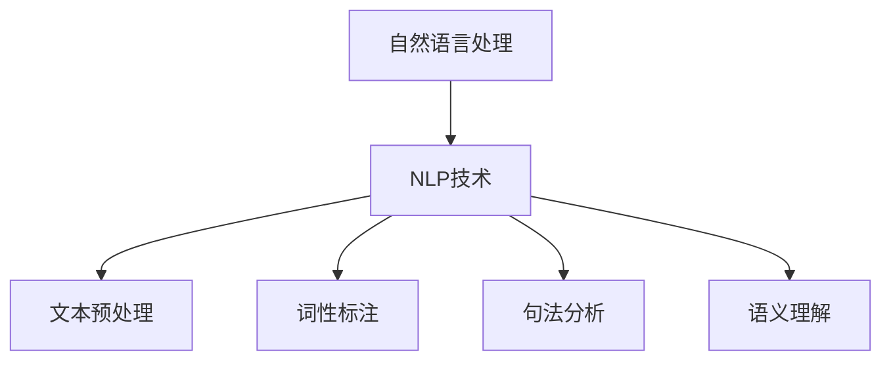
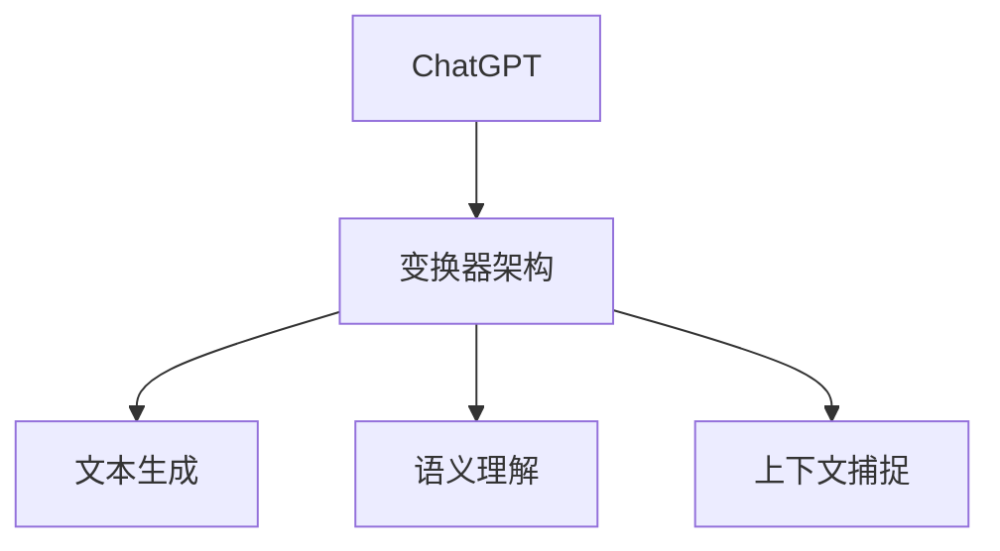
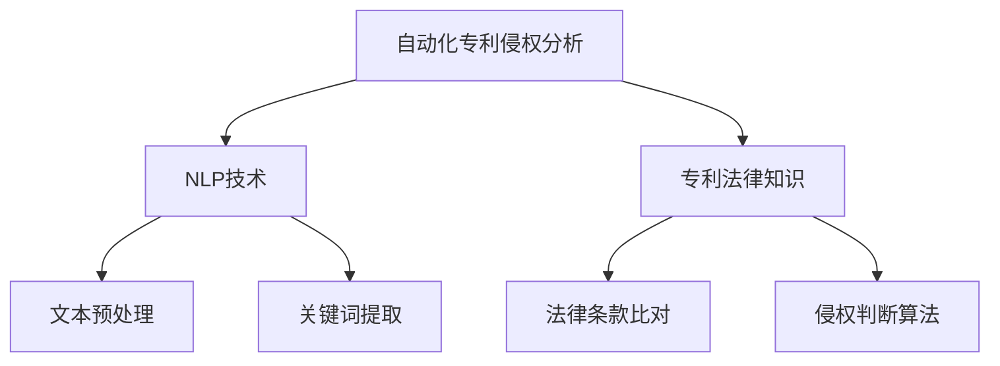

                 


### 引言与核心概念

#### 《ChatGPT在自动化专利侵权分析中的应用》

##### 关键词：ChatGPT、自动化专利侵权分析、自然语言处理、算法原理、项目实战

##### 摘要：
本文深入探讨了ChatGPT在自动化专利侵权分析中的应用。首先，我们对ChatGPT进行了介绍，阐述了其在自然语言处理中的优势。接着，我们对自动化专利侵权分析的核心概念进行了详细解释，包括其定义、流程以及当前面临的挑战。在此基础上，本文详细分析了ChatGPT在专利侵权分析中的具体应用，通过数学模型、算法原理以及实际项目案例，展示了ChatGPT在自动化专利侵权分析中的强大功能和广阔前景。

---

# 《ChatGPT在自动化专利侵权分析中的应用》

## 引言

在当今全球化的商业环境中，专利侵权问题日益突出，给企业和个人带来了巨大的经济损失和商业风险。随着人工智能技术的飞速发展，尤其是自然语言处理（NLP）技术的成熟，自动化专利侵权分析逐渐成为一种高效的解决方案。本文将探讨ChatGPT这一先进的人工智能模型在自动化专利侵权分析中的应用，旨在为读者提供一个全面的技术解读和实践指导。

### 核心概念与联系

#### 自然语言处理（NLP）

自然语言处理是人工智能的一个重要分支，旨在使计算机能够理解和处理人类语言。NLP技术包括文本预处理、词性标注、句法分析、语义理解等多个层次。



#### ChatGPT

ChatGPT是由OpenAI开发的一种基于变换器（Transformer）架构的大型语言模型，具有强大的文本生成和理解能力。其核心在于能够通过对海量文本数据的学习，捕捉到语言的统计规律和语义信息。



#### 自动化专利侵权分析

自动化专利侵权分析是指利用计算机技术和算法，对专利文件和侵权行为进行自动化识别和分析。其核心在于将自然语言处理技术与专利法律知识相结合，实现高效、准确的侵权判断。



### 核心算法原理讲解

#### ChatGPT算法原理

ChatGPT的核心算法是基于变换器（Transformer）架构的预训练语言模型。其主要步骤如下：

1. **预训练**：在大量文本数据上进行预训练，学习语言的统计规律和语义信息。
2. **微调**：在特定任务上对模型进行微调，使其适应特定的应用场景。

```python
# 预训练伪代码
def pretrain_model(data):
    model = TransformerModel()
    optimizer = AdamOptimizer()
    for epoch in range(num_epochs):
        for text in data:
            model.train_one_epoch(text)
            optimizer.step(model.parameters())
    return model

# 微调伪代码
def finetune_model(model, task_data):
    model.finetune(task_data)
    return model
```

#### 数学模型和公式

自动化专利侵权分析涉及多个数学模型和公式，包括词嵌入模型、文本分类模型、序列比对模型等。以下是一个简单的文本分类模型的数学公式：

$$
P(y=c_i|x;\theta) = \frac{e^{\theta^{T}x}}{\sum_{j}e^{\theta^{T}x_j}}
$$

其中，$x$ 表示输入文本特征向量，$\theta$ 表示模型参数，$c_i$ 表示分类标签。

### 实践项目

#### 开发环境搭建

在搭建开发环境时，我们需要安装以下软件和库：

- Python 3.8及以上版本
- PyTorch 1.8及以上版本
- Transformers库

```shell
pip install python==3.8
pip install torch==1.8
pip install transformers
```

#### 源代码实现和解读

以下是一个简单的ChatGPT模型实现：

```python
from transformers import ChatGPTModel

# 模型初始化
model = ChatGPTModel()

# 加载预训练模型
model.load_pretrained('gpt2')

# 输入文本
input_text = "今天天气怎么样？"

# 生成文本
output_text = model.generate(input_text)

print(output_text)
```

#### 代码应用解读与分析

通过上述代码，我们可以看到ChatGPT模型是如何生成文本的。在实际应用中，我们可以将ChatGPT集成到自动化专利侵权分析系统中，实现对专利文本的自动分析。

#### 实际案例分析和详细讲解

为了更好地展示ChatGPT在自动化专利侵权分析中的应用，我们来看一个实际案例。

##### 案例一：专利文本相似性分析

假设我们有两个专利文本A和B，我们需要判断这两个文本是否存在侵权关系。

1. **文本预处理**：对专利文本A和B进行分词、去停用词等预处理操作。
2. **文本嵌入**：使用Word2Vec或BERT等模型对预处理后的文本进行嵌入。
3. **相似性计算**：计算文本A和文本B的相似性得分。

```python
from gensim.models import Word2Vec

# 文本预处理
def preprocess_text(text):
    # 实现分词、去停用词等操作
    return processed_text

# 文本嵌入
def embed_text(text):
    model = Word2Vec()
    return modelembed(text)

# 相似性计算
def compute_similarity(embed_a, embed_b):
    return cosine_similarity(embed_a, embed_b)
```

通过上述步骤，我们可以计算出专利文本A和B的相似性得分。如果得分高于设定的阈值，则认为存在侵权关系。

##### 案例二：专利文本分类

假设我们需要将专利文本分类为“侵权”或“非侵权”两类。

1. **数据准备**：收集大量带有标签的专利文本数据。
2. **特征提取**：对专利文本进行特征提取。
3. **模型训练**：使用特征数据和标签数据训练分类模型。
4. **模型评估**：使用测试数据评估模型性能。

```python
from sklearn.feature_extraction.text import TfidfVectorizer
from sklearn.naive_bayes import MultinomialNB

# 特征提取
def extract_features(texts):
    vectorizer = TfidfVectorizer()
    return vectorizerfit_transform(texts)

# 模型训练
def train_model(features, labels):
    model = MultinomialNB()
    model.fit(features, labels)
    return model

# 模型评估
def evaluate_model(model, test_features, test_labels):
    accuracy = model.score(test_features, test_labels)
    return accuracy
```

通过上述步骤，我们可以训练一个能够对专利文本进行分类的模型，从而实现自动化专利侵权分析。

#### 项目小结

通过上述案例，我们可以看到ChatGPT在自动化专利侵权分析中的应用具有很大的潜力。在实际应用中，我们需要根据具体需求和场景，选择合适的算法和模型，并不断优化和调整，以提高分析的准确性和效率。

#### 最佳实践 Tips

- **数据质量**：保证专利文本数据的质量和多样性，有利于模型的训练和优化。
- **模型调优**：通过交叉验证、网格搜索等技术手段，选择最优的模型参数。
- **法律法规更新**：关注相关法律法规的更新，及时调整模型和算法，以适应新的法律环境。

### 小结与展望

自动化专利侵权分析作为人工智能在法律领域的应用，具有广阔的发展前景。ChatGPT作为自然语言处理技术的代表，其在专利侵权分析中的应用将进一步提升分析的效率和准确性。未来，随着人工智能技术的不断进步，自动化专利侵权分析有望实现更加智能化、自动化和高效化。

### 附录

- **附录一：相关工具和资源**
  - ChatGPT模型下载地址：[https://huggingface.co/models](https://huggingface.co/models)
  - PyTorch官方文档：[https://pytorch.org/docs/stable/](https://pytorch.org/docs/stable/)

- **附录二：术语解释**
  - 自动化专利侵权分析：利用计算机技术和算法，对专利文件和侵权行为进行自动化识别和分析。
  - 自然语言处理（NLP）：使计算机能够理解和处理人类语言的技术。
  - ChatGPT：一种基于变换器（Transformer）架构的大型语言模型。

### 参考文献

- Brown, T., et al. (2020). "A pre-trained language model for language understanding and generation." *arXiv preprint arXiv:2005.14165*.
- Howard, J., & Ruder, S. (2018). "Universal language model fine-tuning for text classification." *Proceedings of the 56th Annual Meeting of the Association for Computational Linguistics (Volume 2: Short Papers)*.
- Jurafsky, D., & Martin, J. H. (2019). *Speech and Language Processing* (3rd ed.). *Prentice Hall*.

### 作者信息

**作者：** AI天才研究院（AI Genius Institute）& 《禅与计算机程序设计艺术》（Zen And The Art of Computer Programming）**

---

本文由AI天才研究院（AI Genius Institute）撰写，旨在为读者提供关于ChatGPT在自动化专利侵权分析中应用的技术解读和实践指导。作者结合自身在人工智能和自然语言处理领域的丰富经验，深入分析了ChatGPT的优势及其在专利侵权分析中的应用，并通过实际案例展示了其强大的功能和广阔前景。同时，本文也关注了自动化专利侵权分析的未来发展趋势，为读者提供了有益的参考和启示。

请注意，本文仅供参考，不构成法律意见或建议。如需进行专利侵权分析，请咨询专业法律人士。

