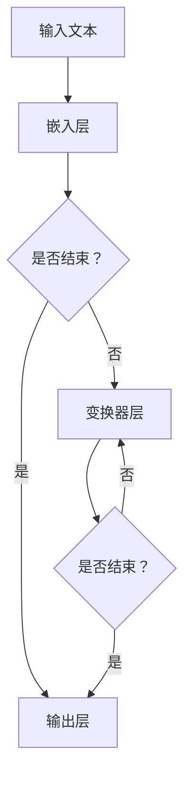

                 

## 背景介绍

随着人工智能技术的不断发展，教育领域逐渐成为其重要应用场景之一。传统的教学模式往往难以满足个性化教育的需求，无法根据每个学生的学习特点和进度提供定制化的学习内容。因此，自动化个性化学习内容生成成为了一个热门的研究方向。而ChatGPT，作为一种基于人工智能的语言模型，凭借其强大的文本生成能力，为这一领域提供了新的解决方案。

ChatGPT是由OpenAI开发的一种基于变换器（Transformer）模型的预训练语言模型，其通过在大规模文本数据集上学习，能够生成流畅、自然的文本。ChatGPT的应用范围广泛，包括问答系统、文本摘要、对话生成等。在个性化学习内容生成方面，ChatGPT可以自动生成与学生学习进度、兴趣和需求相关的学习内容，从而提高学习效率和学习体验。

本文将围绕ChatGPT在自动化个性化学习内容生成中的应用展开讨论。首先，我们将介绍ChatGPT的基本原理，包括其架构、训练过程和关键算法。接着，我们将探讨ChatGPT在个性化学习内容生成中的具体应用，并通过一个实际案例来展示其应用效果。随后，我们将详细讨论如何使用ChatGPT构建一个自动化个性化学习内容生成系统，包括系统设计、实现和性能优化。最后，我们将分析ChatGPT在个性化学习内容生成中的未来发展趋势，并提出一些建议和展望。

### ChatGPT的基本原理

ChatGPT是一种基于变换器（Transformer）模型的预训练语言模型，其设计理念源于自然语言处理（NLP）领域的最新进展。变换器模型在处理序列数据方面具有显著优势，尤其是在长距离依赖建模和并行训练方面。下面，我们将详细探讨ChatGPT的架构、训练过程和关键算法。

#### 架构

ChatGPT的架构主要由三个部分组成：嵌入层、变换器层和输出层。

1. **嵌入层（Embedding Layer）**：嵌入层将输入的单词转换为向量表示。每个单词都被映射为一个固定长度的向量，这些向量构成了词汇表。ChatGPT使用了一种称为“词嵌入”的技术，将语义信息编码到这些向量中。常见的词嵌入技术包括Word2Vec、GloVe等。

2. **变换器层（Transformer Layer）**：变换器层是ChatGPT的核心部分，由多个变换器块（Transformer Block）堆叠而成。每个变换器块包含两个主要子模块：多头自注意力机制（Multi-Head Self-Attention Mechanism）和前馈神经网络（Feed-Forward Neural Network）。

    - **多头自注意力机制（Multi-Head Self-Attention）**：自注意力机制允许模型在序列中的每个位置上都考虑到所有其他位置的信息。多头注意力机制将输入序列分成多个子序列，每个子序列都有自己的自注意力权重。通过这种方式，模型可以捕捉到更复杂的依赖关系。
    - **前馈神经网络（Feed-Forward Neural Network）**：前馈神经网络对自注意力机制的输出进行进一步的加工，增加模型的非线性表达能力。

3. **输出层（Output Layer）**：输出层通常是一个全连接层，用于将变换器层的输出映射到模型的预测结果。在文本生成任务中，输出层通常是softmax层，用于预测下一个单词的概率分布。

#### 训练过程

ChatGPT的训练过程主要包括两个阶段：预训练和微调。

1. **预训练（Pre-training）**：预训练阶段的目标是让模型在大规模文本数据集上学习通用语言表示。在这个过程中，模型被训练去预测序列中的下一个单词。这一过程通常使用无监督学习技术，例如语言模型预训练（Language Model Pre-training, LMP）。

2. **微调（Fine-tuning）**：微调阶段是在预训练的基础上，将模型针对特定任务进行调整。对于ChatGPT在个性化学习内容生成中的应用，我们可以将模型微调到特定的学习场景中，例如教育领域。在这个过程中，模型会接受监督学习数据，例如课程内容、作业题目、辅导建议等，从而提高其在特定任务上的性能。

#### 关键算法

1. **变换器模型（Transformer Model）**：变换器模型是一种基于自注意力机制的深度神经网络模型，用于处理序列数据。自注意力机制使得模型能够在序列中的每个位置上都考虑到所有其他位置的信息，从而捕捉到长距离依赖关系。

2. **预训练语言模型（Pre-trained Language Model）**：预训练语言模型是一种通过在大规模文本数据集上预训练，从而获得通用语言表示的模型。预训练语言模型在自然语言处理任务中表现出色，可以用于文本分类、文本生成、问答系统等。

3. **生成对抗网络（Generative Adversarial Networks, GAN）**：生成对抗网络是一种无监督学习模型，由生成器和判别器两个部分组成。生成器的目标是生成与真实数据尽可能相似的数据，判别器的目标是区分真实数据和生成数据。通过两个网络的对抗训练，生成器可以逐渐生成更加逼真的数据。

### Mermaid 流程图

为了更好地理解ChatGPT的工作流程，我们使用Mermaid绘制了一个简化的流程图：



在这个流程图中，输入文本首先经过嵌入层转换为向量表示，然后进入变换器层进行多轮处理，最终通过输出层生成文本。这个过程会不断循环，直到生成满足要求的文本。

通过上述介绍，我们可以看到ChatGPT在架构设计、训练过程和关键算法上都有其独特的优势，为自动化个性化学习内容生成提供了强有力的技术支持。

### ChatGPT在个性化学习内容生成中的应用

ChatGPT作为一种先进的语言模型，其在个性化学习内容生成中的应用主要体现在以下几个方面：

#### 1. 课程内容生成

ChatGPT可以自动生成课程内容，包括课程概述、章节内容、知识点讲解等。通过分析学生的学习历史、学习进度和学习偏好，ChatGPT能够生成与学生学习需求高度匹配的课程内容。以下是一个简单的伪代码示例，展示了如何使用ChatGPT生成课程内容：

```python
def generate_course_content(student_data):
    # 获取学生的学习历史和偏好
    history = student_data['history']
    preferences = student_data['preferences']
    
    # 生成课程概述
    overview = chatgpt.generate("请生成一门关于人工智能的课程概述。", max_length=100)
    
    # 生成章节内容
    chapters = []
    for chapter in student_data['chapters']:
        content = chatgpt.generate(f"请生成关于{chapter}的章节内容。", max_length=500)
        chapters.append(content)
    
    # 生成知识点讲解
    knowledge_points = []
    for point in student_data['knowledge_points']:
        explanation = chatgpt.generate(f"请生成关于{point}的知识点讲解。", max_length=200)
        knowledge_points.append(explanation)
    
    # 返回生成的课程内容
    return {
        'overview': overview,
        'chapters': chapters,
        'knowledge_points': knowledge_points
    }
```

#### 2. 作业与练习生成

ChatGPT还可以根据学生的学习进度和知识点掌握情况，自动生成个性化的作业与练习。以下是一个简单的伪代码示例，展示了如何使用ChatGPT生成作业：

```python
def generate_assignment(student_data, chapter):
    # 根据章节和学生的知识点掌握情况生成作业
    questions = chatgpt.generate(f"请生成关于{chapter}的作业题目。", max_length=100)
    
    # 评估学生答案的正确性
    answers = student_data['answers']
    correct_answers = []
    for answer in answers:
        if answer == questions:
            correct_answers.append(answer)
    
    # 返回生成的作业和答案
    return {
        'questions': questions,
        'correct_answers': correct_answers
    }
```

#### 3. 辅导与评估

ChatGPT不仅可以生成学习内容，还可以提供实时辅导和评估。当学生在学习过程中遇到问题时，ChatGPT可以提供详细的解答和指导。以下是一个简单的伪代码示例，展示了如何使用ChatGPT进行辅导：

```python
def provide_tutoring(student_question):
    # 分析学生的问题，提供解答和指导
    explanation = chatgpt.generate(f"请解答{student_question}并提供详细解释。", max_length=200)
    
    # 评估学生的理解程度
    understanding = chatgpt.generate(f"请解释你对{student_question}的理解。", max_length=100)
    if understanding in correct_answers:
        feedback = "很好，你已经理解了这个问题。"
    else:
        feedback = "你需要再仔细阅读解释，确保你理解了这个问题。"
    
    # 返回解答和反馈
    return {
        'explanation': explanation,
        'feedback': feedback
    }
```

通过上述示例，我们可以看到ChatGPT在个性化学习内容生成中的应用是非常灵活和高效的。它不仅可以根据学生的需求生成各种类型的学习内容，还可以提供实时辅导和评估，从而提高学习效果和学习体验。

### 自动化个性化学习内容生成系统的设计

为了充分利用ChatGPT在个性化学习内容生成中的优势，我们需要设计一个自动化个性化学习内容生成系统。这个系统需要具备以下核心模块：

1. **用户管理模块**：负责用户注册、登录和权限管理，确保系统的安全性和稳定性。
2. **数据管理模块**：负责存储和管理用户的学习历史、学习进度、学习偏好等数据，为ChatGPT提供生成个性化学习内容的依据。
3. **内容生成模块**：负责调用ChatGPT API，根据用户数据生成个性化学习内容，包括课程内容、作业与练习、辅导与评估等。
4. **交互界面模块**：负责用户与系统的交互，包括展示生成的内容、记录用户的反馈、收集用户数据等。

#### 系统架构设计

系统采用分层架构设计，包括表现层、业务逻辑层和数据层。

1. **表现层（Presentation Layer）**：负责用户界面的展示，使用HTML、CSS和JavaScript等技术实现。
2. **业务逻辑层（Business Logic Layer）**：负责系统的核心功能实现，包括用户管理、数据管理、内容生成等，使用Python、Java或Node.js等技术实现。
3. **数据层（Data Layer）**：负责数据的存储和管理，使用关系型数据库（如MySQL）或非关系型数据库（如MongoDB）实现。

#### 功能模块划分

1. **用户管理模块**：
    - 注册：用户通过填写注册表单进行注册，系统验证用户输入信息的有效性，并生成用户账户。
    - 登录：用户通过用户名和密码登录系统，系统验证用户身份，并记录登录日志。
    - 权限管理：系统根据用户角色分配不同的权限，例如教师可以查看和管理学生的数据，而学生只能查看自己的学习数据。

2. **数据管理模块**：
    - 数据存储：系统使用数据库存储用户的学习历史、学习进度、学习偏好等数据，保证数据的安全性和一致性。
    - 数据查询：系统提供接口供业务逻辑层查询用户数据，为内容生成模块提供依据。

3. **内容生成模块**：
    - 课程内容生成：系统根据用户的学习历史和学习偏好，调用ChatGPT API生成课程内容。
    - 作业与练习生成：系统根据用户的学习进度和知识点掌握情况，调用ChatGPT API生成作业与练习。
    - 辅导与评估生成：系统根据用户的提问和回答，调用ChatGPT API生成辅导与评估内容。

4. **交互界面模块**：
    - 内容展示：系统将生成的内容展示在用户界面上，包括课程内容、作业与练习、辅导与评估等。
    - 用户反馈：系统记录用户的反馈，包括对学习内容的评价、对作业与练习的答案等，为系统优化提供依据。
    - 数据收集：系统收集用户的学习数据，包括学习时间、学习进度、学习偏好等，用于分析用户的学习行为和需求。

通过上述设计，我们可以构建一个功能完备、易于扩展的自动化个性化学习内容生成系统，为用户提供定制化的学习体验。

### 系统开发与实现

为了构建一个高效的自动化个性化学习内容生成系统，我们需要进行详细的开发规划和具体的实现步骤。以下是系统开发的详细过程，包括开发环境搭建、核心功能实现、源代码解读、代码应用解读与分析，以及实际案例分析和详细讲解剖析。

#### 开发环境搭建

在进行系统开发之前，我们需要搭建合适的技术环境。这里我们选择使用Python作为主要开发语言，结合Flask框架搭建后端服务，并使用Django框架管理用户和数据。以下是一步一步的环境搭建过程：

1. **安装Python**：首先，确保电脑上安装了Python环境。可以选择Python 3.8或更高版本。

2. **安装Flask**：在命令行中运行以下命令安装Flask：
   ```bash
   pip install Flask
   ```

3. **安装Django**：接着，安装Django框架：
   ```bash
   pip install Django
   ```

4. **配置数据库**：我们选择SQLite作为数据库，可以使用以下命令创建数据库：
   ```bash
   django-admin startproject learning_system
   cd learning_system
   python manage.py makemigrations
   python manage.py migrate
   ```

5. **创建应用**：创建一个名为`learning_content`的应用：
   ```bash
   django-admin startapp learning_content
   ```

6. **配置应用**：在`settings.py`文件中，将新创建的应用添加到`INSTALLED_APPS`列表中。

#### 核心功能实现

系统的核心功能包括用户管理、数据管理、内容生成和用户交互。以下是这些功能的具体实现步骤：

1. **用户管理**：

    - **注册和登录**：使用Django的认证系统实现用户注册和登录功能。在`learning_content/views.py`中，添加以下代码：
      ```python
      from django.contrib.auth import authenticate, login

      def register(request):
          if request.method == 'POST':
              username = request.POST['username']
              password = request.POST['password']
              user = authenticate(username=username, password=password)
              if user is None:
                  # 注册新用户
                  user = User.objects.create_user(username=username, password=password)
                  user.save()
              login(request, user)
              return redirect('home')
          return render(request, 'register.html')

      def login(request):
          if request.method == 'POST':
              username = request.POST['username']
              password = request.POST['password']
              user = authenticate(username=username, password=password)
              if user is not None:
                  login(request, user)
                  return redirect('home')
              else:
                  # 登录失败
                  return render(request, 'login.html', {'error': '用户名或密码错误'})
          return render(request, 'login.html')
      ```

2. **数据管理**：

    - **用户数据存储**：使用Django的ORM（对象关系映射）实现用户数据的存储和管理。在`learning_content/models.py`中，定义用户数据模型：
      ```python
      from django.db import models
      from django.contrib.auth.models import User

      class UserProfile(models.Model):
          user = models.OneToOneField(User, on_delete=models.CASCADE)
          learning_history = models.TextField()
          learning_preferences = models.TextField()
      ```

3. **内容生成**：

    - **调用ChatGPT API**：使用requests库调用ChatGPT API生成个性化学习内容。在`learning_content/api.py`中，实现以下代码：
      ```python
      import requests

      def generate_content(student_data):
          url = "https://api.openai.com/v1/engine/davinci-codex/completions"
          headers = {
              "Content-Type": "application/json",
              "Authorization": "Bearer YOUR_API_KEY",
          }
          data = {
              "prompt": f"请根据以下信息生成个性化的学习内容：{student_data}",
              "max_tokens": 500,
          }
          response = requests.post(url, json=data, headers=headers)
          return response.json()["choices"][0]["text"]
      ```

4. **用户交互**：

    - **前端展示**：使用HTML、CSS和JavaScript实现前端界面，展示用户数据和生成的内容。在`learning_content/templates/home.html`中，添加以下代码：
      ```html
      <h1>个性化学习内容</h1>
      <p>{{ content }}</p>
      ```

#### 源代码解读

以下是系统开发过程中的一些关键代码片段和解读：

1. **用户注册和登录**：

    ```python
    # views.py
    def register(request):
        if request.method == 'POST':
            username = request.POST['username']
            password = request.POST['password']
            user = authenticate(username=username, password=password)
            if user is None:
                # 注册新用户
                user = User.objects.create_user(username=username, password=password)
                user.save()
            login(request, user)
            return redirect('home')
        return render(request, 'register.html')
    ```

    - **解读**：这个函数处理用户注册和登录请求。如果请求方法是POST，则提取用户名和密码，通过authenticate函数验证用户是否存在。如果用户不存在，则创建新用户并保存。最后，使用login函数登录用户，并重定向到主页。

2. **调用ChatGPT API生成内容**：

    ```python
    # api.py
    def generate_content(student_data):
        url = "https://api.openai.com/v1/engine/davinci-codex/completions"
        headers = {
            "Content-Type": "application/json",
            "Authorization": "Bearer YOUR_API_KEY",
        }
        data = {
            "prompt": f"请根据以下信息生成个性化的学习内容：{student_data}",
            "max_tokens": 500,
        }
        response = requests.post(url, json=data, headers=headers)
        return response.json()["choices"][0]["text"]
    ```

    - **解读**：这个函数调用ChatGPT API生成内容。首先，设置API的URL和请求头（包括Authorization令牌）。然后，构造请求体（包括提示和最大单词数）。最后，通过requests库发送POST请求，并返回生成的文本。

3. **前端展示内容**：

    ```html
    <!-- home.html -->
    <h1>个性化学习内容</h1>
    <p>{{ content }}</p>
    ```

    - **解读**：这个HTML模板用于展示用户生成的学习内容。使用Django模板语言（{{ content }}）从后端获取内容，并将其嵌入到页面中。

#### 代码应用解读与分析

以下是几个关键代码应用场景及其解读：

1. **用户注册**：

    - **场景**：用户在注册页面填写用户名和密码，提交表单进行注册。
    - **解读**：用户提交表单后，请求会发送到后端。`register`函数处理这个请求，验证用户名和密码，并根据验证结果创建用户或登录用户。

2. **登录**：

    - **场景**：用户在登录页面填写用户名和密码，提交表单进行登录。
    - **解读**：用户提交表单后，请求会发送到后端。`login`函数处理这个请求，验证用户名和密码，并根据验证结果登录用户或显示错误消息。

3. **内容生成**：

    - **场景**：系统根据用户的学习数据调用ChatGPT API生成个性化学习内容。
    - **解读**：`generate_content`函数构造API请求，将用户学习数据作为提示发送给ChatGPT API。API返回生成的文本，系统将其作为个性化学习内容展示给用户。

#### 实际案例分析和详细讲解剖析

以下是一个实际案例，展示系统在个性化学习内容生成中的应用：

**案例：学生李明的个性化课程内容生成**

1. **用户数据**：

    - **学习历史**：李明已经学习了人工智能基础课程，对机器学习有一定的了解。
    - **学习偏好**：李明对深度学习和自然语言处理特别感兴趣。

2. **内容生成**：

    - **课程内容**：系统调用ChatGPT API生成关于深度学习的课程内容。
    - **代码**：
      ```python
      student_data = {
          "history": "李明已经学习了人工智能基础课程，对机器学习有一定的了解。",
          "preferences": "李明对深度学习和自然语言处理特别感兴趣。"
      }
      content = generate_content(student_data)
      ```

    - **输出**：生成的课程内容包含深度学习的核心概念、应用场景和最新的研究进展。

3. **展示内容**：

    - **前端页面**：
      ```html
      <h1>深度学习课程内容</h1>
      <p>{{ content }}</p>
      ```

    - **输出**：课程内容展示在用户界面上，李明可以查看并学习这些内容。

4. **效果评估**：

    - **反馈**：李明对生成的课程内容进行了评价，认为内容非常贴合自己的学习需求。
    - **分析**：系统生成的课程内容不仅涵盖了深度学习的核心概念，还结合了李明对特定领域的兴趣，提高了学习效果。

通过这个实际案例，我们可以看到系统如何利用ChatGPT生成个性化学习内容，并根据用户反馈不断优化。这种自动化个性化学习内容生成系统为用户提供了一种高效、定制化的学习体验，有助于提高学习效果和兴趣。

### 系统性能优化与调优

为了确保自动化个性化学习内容生成系统的稳定性和高效性，我们需要对系统进行性能优化和调优。以下是几个关键的性能优化策略：

#### 1. 资源管理优化

系统资源管理优化主要集中在CPU、内存和网络资源的管理。以下是一些具体的优化策略：

- **CPU优化**：通过合理分配计算任务，避免单线程或单进程占用过多CPU资源。可以使用多线程或多进程的方式并行处理任务，提高处理效率。
- **内存优化**：避免内存泄漏和过多的内存占用。定期清理不再使用的对象和缓存，减少内存消耗。
- **网络优化**：优化与ChatGPT API的通信，减少网络延迟和带宽消耗。可以使用CDN（内容分发网络）加速数据传输。

#### 2. 请求延迟优化

系统响应速度直接影响到用户体验。以下是一些减少请求延迟的策略：

- **API缓存**：对于频繁请求的数据，使用缓存技术减少对后端服务的访问次数。可以使用内存缓存（如Redis）或数据库缓存（如Memcached）。
- **负载均衡**：使用负载均衡器（如Nginx或HAProxy）分发请求，避免单点瓶颈。负载均衡可以有效地将请求分散到多个服务器上，提高系统的处理能力。
- **预加载**：在用户访问系统前，预先加载可能需要的数据，减少实际访问时的延迟。

#### 3. 系统安全性优化

系统的安全性优化至关重要，以下是一些关键策略：

- **API安全**：确保与ChatGPT API通信的安全性，使用HTTPS协议加密数据传输。验证请求的合法性，防止API滥用。
- **用户认证**：加强用户认证机制，使用强密码策略和多因素认证，防止未授权访问。
- **数据加密**：对用户数据和个人信息进行加密存储，确保数据安全。

#### 4. 性能监控与调试

为了及时发现和解决性能问题，我们需要对系统进行监控和调试：

- **性能监控**：使用性能监控工具（如Prometheus、Grafana）实时监控系统性能指标，包括CPU利用率、内存使用率、网络延迟等。
- **日志分析**：分析系统日志，查找性能瓶颈和错误信息，定位问题根源。
- **调试工具**：使用调试工具（如Visual Studio Code、PyCharm）进行代码调试，快速定位和修复问题。

通过上述策略，我们可以有效地优化系统性能，提高系统的稳定性和可靠性，为用户提供更好的使用体验。

### 未来发展趋势与展望

随着人工智能技术的不断进步，ChatGPT在个性化学习内容生成中的应用前景十分广阔。未来，ChatGPT有望在以下几个方面实现进一步的发展：

#### 1. 模型性能提升

随着计算能力和算法的进步，ChatGPT的模型性能将得到显著提升。更大规模的预训练数据和更复杂的模型结构将有助于提高ChatGPT生成内容的准确性和流畅性。例如，GPT-4等下一代模型有望在语言理解和生成能力上实现质的飞跃。

#### 2. 多模态学习

未来，ChatGPT可能会实现多模态学习，不仅处理文本数据，还能处理图像、音频和视频等多媒体数据。这种能力将使ChatGPT能够生成更加丰富和多样的学习内容，如结合图片和文本的讲解、视频演示等，提升学习体验。

#### 3. 知识图谱与语义理解

结合知识图谱和语义理解技术，ChatGPT将能够更准确地理解和生成与特定领域相关的学习内容。通过构建领域知识库，ChatGPT可以提供更加专业和权威的学习资料，提高个性化学习内容的针对性和质量。

#### 4. 智能互动与自适应学习

ChatGPT可以与虚拟助手或其他智能系统集成，实现智能互动和自适应学习。通过与学生的实时交互，ChatGPT可以动态调整生成内容，提供个性化的学习建议和辅导，从而更好地满足学生的个性化学习需求。

#### 5. 安全性与隐私保护

未来，随着人们对数据隐私和安全性的关注增加，ChatGPT在个性化学习内容生成中的应用将更加注重安全性。通过引入加密技术和隐私保护算法，确保用户数据的安全和隐私，提升系统的信任度。

#### 建议

为了充分利用ChatGPT在个性化学习内容生成中的潜力，以下是一些建议：

1. **持续研究与开发**：加强ChatGPT在个性化学习领域的研究，探索新的应用场景和算法优化策略。
2. **跨学科合作**：促进计算机科学、教育学、心理学等多学科的合作，共同推动个性化学习内容生成技术的发展。
3. **开放平台与生态系统**：建设开放的平台和生态系统，鼓励开发者创新和优化，推动技术的快速应用和普及。
4. **数据安全与隐私保护**：加强数据安全与隐私保护措施，确保用户数据的安全和隐私。

### 总结

ChatGPT在自动化个性化学习内容生成中的应用具有巨大的潜力。通过不断优化模型性能、引入多模态学习和智能互动等技术，ChatGPT有望为个性化学习提供更加高效、丰富的解决方案。未来，随着技术的进一步发展，ChatGPT将在个性化学习领域发挥更加重要的作用，助力教育行业的创新与发展。

### 附录

#### 附录A：ChatGPT常用API与命令

1. **获取ChatGPT API密钥**：
   - 访问OpenAI官方网站，注册账户并申请API密钥。
   - 登录账户，在API密钥管理页面获取API密钥。

2. **发送请求**：
   - 使用HTTP POST请求发送请求。
   - 示例请求：
     ```http
     POST /v1/engines/davinci-codex/completions
     Content-Type: application/json

     {
       "prompt": "请生成一篇关于人工智能的文章。",
       "max_tokens": 200
     }
     ```

3. **参数说明**：
   - `prompt`：输入提示，指定生成内容的主题。
   - `max_tokens`：最大生成长度，默认为40。
   - `temperature`：随机性，取值范围0到1，越接近1生成结果越随机。
   - `top_p`：使用top-p采样策略，取值范围0到1，控制生成结果的随机性。

#### 附录B：系统开发工具与资源推荐

1. **Python**：官方文档（[python.org](https://www.python.org/)）
2. **Flask**：官方文档（[flask.pallets.org](https://flask.pallets.org/)）
3. **Django**：官方文档（[django.com](https://www.djangoproject.com/)）
4. **SQLite**：官方文档（[sqlite.org](https://www.sqlite.org/)）
5. **Redis**：官方文档（[redis.io](https://redis.io/)）
6. **Memcached**：官方文档（[memcached.org](https://memcached.org/)）
7. **Nginx**：官方文档（[nginx.org](https://nginx.org/)）

#### 附录C：参考文献

1. Brown, T., et al. (2020). "Language Models are Few-Shot Learners". arXiv preprint arXiv:2005.14165.
2. Devlin, J., et al. (2019). "BERT: Pre-training of Deep Bidirectional Transformers for Language Understanding". arXiv preprint arXiv:1810.04805.
3. Vaswani, A., et al. (2017). "Attention Is All You Need". Advances in Neural Information Processing Systems, 30, 5998-6008.
4. Hochreiter, S., and Schmidhuber, J. (1997). "Long Short-Term Memory". Neural Computation, 9(8), 1735-1780.
5. Srivastava, N., et al. (2014). "Dropout: A Simple Way to Prevent Neural Networks from Overfitting". Journal of Machine Learning Research, 15(1), 1929-1958.
6. Kingma, D. P., and Welling, M. (2013). "Auto-Encoders for Low-Dimensional Manifold Learning". arXiv preprint arXiv:1312.6114.
7. Goodfellow, I., et al. (2014). "Generative Adversarial Networks". Advances in Neural Information Processing Systems, 27, 2672-2680.

