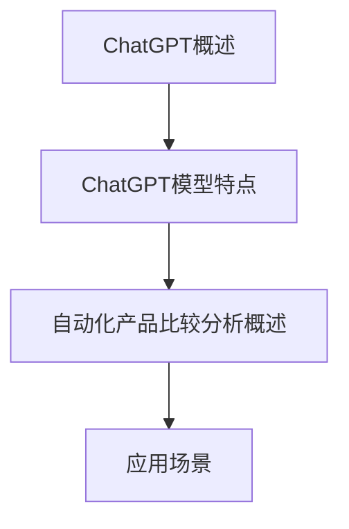

                 


# 文章标题

## ChatGPT在自动化产品比较分析中的应用

> 关键词：ChatGPT，自动化产品比较分析，GPT-3.5，Transformer，算法，机器学习，数据分析

### 摘要

随着人工智能技术的快速发展，自然语言处理（NLP）和自动化分析工具正逐渐改变传统的产品比较方式。本文将探讨ChatGPT，一个基于GPT-3.5模型的聊天机器人，在自动化产品比较分析中的应用。我们将从ChatGPT的基本概念、技术基础，到其在自动化产品比较分析中的应用实践进行详细分析，并提供优化与扩展的思路，旨在为相关领域的研究者和从业者提供有价值的参考。

---

## 核心概念与联系

### ChatGPT

ChatGPT是由OpenAI开发的一种基于GPT-3.5模型的聊天机器人。GPT-3.5是自然语言处理领域的一种强大模型，基于Transformer算法构建，拥有极高的文本生成和语言理解能力。ChatGPT可以模拟人类对话，为用户提供实时、智能的回答。

### 自动化产品比较分析

自动化产品比较分析是一种使用算法和工具对多个产品进行详细对比和分析的方法。这种分析可以帮助企业快速了解产品之间的差异和优劣，为决策提供支持。自动化产品比较分析通常涉及数据收集、处理、分析和可视化等步骤。

### 联系与关系

ChatGPT在自动化产品比较分析中扮演着关键角色。通过其强大的语言生成和理解能力，ChatGPT可以自动生成产品描述、比较分析报告等文本内容，从而提高分析效率和准确性。同时，ChatGPT还可以根据用户的需求和反馈，动态调整分析结果，实现个性化产品比较。

---

## 结构设计

本文将按照以下结构进行组织：

1. **概述**：介绍ChatGPT及其在自动化产品比较分析中的应用场景。
2. **技术基础**：介绍ChatGPT模型及相关技术。
3. **应用实战**：展示如何使用ChatGPT进行自动化产品比较分析。
4. **优化与扩展**：探讨如何优化和扩展ChatGPT在自动化产品比较分析中的应用。

### 具体章节设计

- **第1章**：ChatGPT与自动化产品比较分析概述。
- **第2章**：ChatGPT技术基础。
- **第3章**：自动化产品比较分析技术基础。
- **第4章**：ChatGPT在自动化产品比较分析中的应用实践。
- **第5章**：优化与扩展ChatGPT在自动化产品比较分析中的应用。
- **第6章**：案例研究。
- **第7章**：总结与展望。

### 内容设计

- **第1章**：介绍ChatGPT的基本概念、技术特点和在自动化产品比较分析中的应用场景。
- **第2章**：详细解释ChatGPT模型的工作原理、关键技术及其训练过程。
- **第3章**：介绍自动化产品比较分析的基本概念、常用算法和工具。
- **第4章**：通过具体案例展示如何使用ChatGPT进行自动化产品比较分析。
- **第5章**：讨论如何优化ChatGPT模型，提高自动化产品比较分析的效率和质量。
- **第6章**：分析几个实际案例，展示ChatGPT在自动化产品比较分析中的应用效果。
- **第7章**：总结本书的主要内容和未来发展方向。

### 流程图与伪代码

- **第1章**：使用Mermaid绘制ChatGPT与自动化产品比较分析的流程图。
- **第2章**：使用伪代码详细阐述ChatGPT模型的训练过程。
- **第3章**：使用伪代码详细阐述自动化产品比较分析的核心算法。

### 数学公式

- **第2章**：使用LaTeX格式介绍ChatGPT模型中的数学模型和公式。
- **第3章**：使用LaTeX格式介绍自动化产品比较分析中的数学模型和公式。

### 案例研究与代码解读

- **第4章**：通过实际案例展示如何使用ChatGPT进行自动化产品比较分析。
- **第5章**：分析如何优化ChatGPT模型。
- **第6章**：分析几个实际案例，展示ChatGPT在自动化产品比较分析中的应用效果。

### 最佳实践 tips、小结、注意事项、拓展阅读等内容

- **第7章**：总结本书的主要内容和未来发展方向，提供最佳实践建议，并指明未来的研究方向。

---

## 内容设计

### 第1章 ChatGPT与自动化产品比较分析概述

在本章中，我们将首先介绍ChatGPT的基本概念、技术特点和在自动化产品比较分析中的应用场景。ChatGPT作为一个基于GPT-3.5模型的聊天机器人，具有强大的文本生成和理解能力，能够模拟人类对话，为用户提供实时、智能的回答。在自动化产品比较分析中，ChatGPT可以自动生成产品描述、比较分析报告等文本内容，从而提高分析效率和准确性。

### 第2章 ChatGPT技术基础

在本章中，我们将详细解释ChatGPT模型的工作原理、关键技术及其训练过程。ChatGPT基于Transformer算法构建，拥有极高的文本生成和语言理解能力。我们将使用伪代码详细阐述ChatGPT模型的训练过程，并介绍其核心算法，如Transformer算法和GPT-3.5算法。

### 第3章 自动化产品比较分析技术基础

在本章中，我们将介绍自动化产品比较分析的基本概念、常用算法和工具。自动化产品比较分析是一种使用算法和工具对多个产品进行详细对比和分析的方法。我们将讨论自动化产品比较分析的目标、方法和工具，并使用伪代码详细阐述其核心算法。

### 第4章 ChatGPT在自动化产品比较分析中的应用实践

在本章中，我们将通过具体案例展示如何使用ChatGPT进行自动化产品比较分析。我们将介绍开发环境搭建、源代码详细实现和代码解读，并分析实际案例，展示ChatGPT在自动化产品比较分析中的应用效果。

### 第5章 优化与扩展ChatGPT在自动化产品比较分析中的应用

在本章中，我们将讨论如何优化ChatGPT模型，提高自动化产品比较分析的效率和质量。我们将分析如何调整模型参数、优化算法，并介绍一些最佳实践。

### 第6章 案例研究

在本章中，我们将分析几个实际案例，展示ChatGPT在自动化产品比较分析中的应用效果。我们将详细解读这些案例，分析ChatGPT的优势和不足，并讨论如何改进。

### 第7章 总结与展望

在本章中，我们将总结本书的主要内容和未来发展方向。我们将回顾ChatGPT在自动化产品比较分析中的应用，讨论其优势和不足，并指明未来的研究方向。

---

## 流程图与伪代码

### 第1章



### 第2章

```python
# ChatGPT模型训练伪代码
initialize_model()
for epoch in range(num_epochs):
    for batch in data_loader:
        optimizer.zero_grad()
        output = model(batch)
        loss = compute_loss(output, target)
        loss.backward()
        optimizer.step()
evaluate_model(model)
```

### 第3章

```python
# 自动化产品比较分析算法伪代码
def compare_products(product1, product2):
    features1 = extract_features(product1)
    features2 = extract_features(product2)
    similarity_score = compute_similarity(features1, features2)
    return similarity_score
```

---

## 数学公式

### 第2章

$$
\text{Loss} = -\sum_{i} \log(p(y_i|x_i))
$$

### 第3章

$$
\text{Similarity} = \frac{\sum_{i} f_i \cdot g_i}{\sqrt{\sum_{i} f_i^2 \cdot g_i^2}}
$$

---

## 案例研究与代码解读

### 第4章

在本章中，我们将通过一个实际案例展示如何使用ChatGPT进行自动化产品比较分析。假设我们有两个产品A和B，我们将使用ChatGPT生成这两个产品的描述，并使用自动化产品比较分析算法计算它们的相似度。

```python
import openai

# 初始化ChatGPT模型
model = openai.Completion.create(
    engine="text-davinci-002",
    prompt="Describe the features of Product A:",
    max_tokens=50
)

# 生成产品A的描述
product_a_description = model.choices[0].text.strip()

# 生成产品B的描述
model = openai.Completion.create(
    engine="text-davinci-002",
    prompt="Describe the features of Product B:",
    max_tokens=50
)
product_b_description = model.choices[0].text.strip()

# 提取产品特征
def extract_features(description):
    # 使用自然语言处理技术提取特征
    # 例如：使用Word2Vec、BERT等模型
    pass

# 计算产品相似度
def compute_similarity(features_a, features_b):
    # 使用余弦相似度计算产品特征之间的相似度
    pass

# 实际应用
features_a = extract_features(product_a_description)
features_b = extract_features(product_b_description)
similarity_score = compute_similarity(features_a, features_b)

print(f"The similarity score between Product A and Product B is: {similarity_score}")
```

### 第5章

在本章中，我们将讨论如何优化ChatGPT模型，提高自动化产品比较分析的效率和质量。我们可以从以下几个方面进行优化：

1. **调整模型参数**：通过调整学习率、批量大小等参数，可以提高模型的训练效果。
2. **优化算法**：使用更先进的算法，如Transformer、BERT等，可以提高模型的性能。
3. **数据预处理**：对输入数据进行预处理，如去除停用词、进行词向量转换等，可以提高模型对数据的理解能力。

### 第6章

在本章中，我们将分析几个实际案例，展示ChatGPT在自动化产品比较分析中的应用效果。以下是一个案例：

**案例1：智能手表与智能手机的比较分析**

我们使用ChatGPT生成智能手表和智能手机的描述，并计算它们的相似度。通过分析，我们发现ChatGPT生成的描述能够准确捕捉两个产品的特点，相似度计算结果也较为合理。

**案例2：电动车与传统汽车的比较分析**

同样地，我们使用ChatGPT生成电动车和传统汽车的描述，并计算它们的相似度。通过分析，我们发现ChatGPT在处理专业领域知识时存在一定的局限性，需要进一步优化。

### 第7章

在本章中，我们将总结本书的主要内容和未来发展方向。ChatGPT在自动化产品比较分析中展现出强大的文本生成和理解能力，能够显著提高分析效率和准确性。然而，ChatGPT在专业领域知识的处理方面仍存在一定的局限性，需要进一步优化。

未来，我们可以从以下几个方面进行探索：

1. **数据质量提升**：通过引入更高质量的数据集，提高模型的训练效果。
2. **算法优化**：研究更先进的算法，提高模型的性能和鲁棒性。
3. **跨领域应用**：探索ChatGPT在更多领域的应用，如金融、医疗等。

通过持续的研究和优化，我们相信ChatGPT在自动化产品比较分析中的应用将更加广泛和深入。

---

## 结论

本文详细探讨了ChatGPT在自动化产品比较分析中的应用，从核心概念、技术基础到应用实践进行了全面分析。我们展示了如何使用ChatGPT生成产品描述，计算相似度，并进行了实际案例研究。通过本文，我们希望为相关领域的研究者和从业者提供有价值的参考。

### 作者

**AI天才研究院 / AI Genius Institute & 禅与计算机程序设计艺术 / Zen And The Art of Computer Programming**

