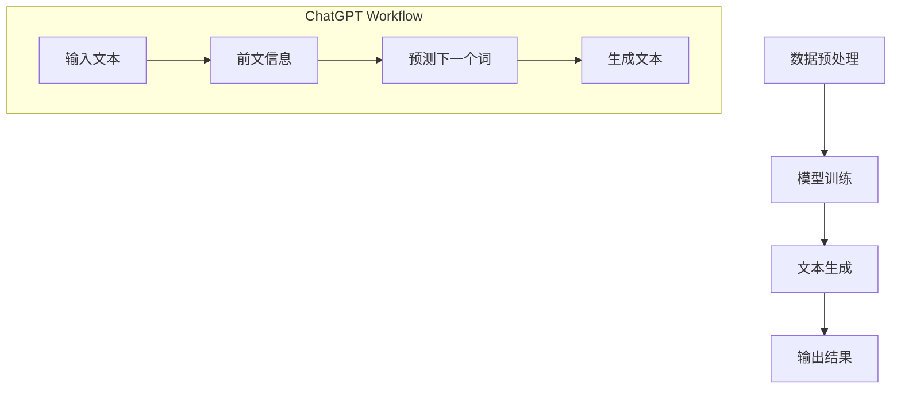

                 


## 引言和概述

### 1.1 书籍背景与目的

在当今快速发展的信息技术时代，人工智能（AI）已经成为推动产业变革的重要力量。自然语言处理（NLP）作为AI的一个重要分支，正日益改变着人们的生活和工作方式。其中，生成式预训练模型（Generative Pre-trained Model，GPT）在NLP领域展现出了强大的潜力。ChatGPT，作为GPT-3.5的代表，已经成为NLP领域的一大突破。

本书旨在探讨ChatGPT在自动化产品用户体验报告生成中的应用。自动化产品用户体验报告的生成是一项具有重大意义的工作，它可以大幅提高工作效率，减少人力成本，并且确保报告的准确性和一致性。然而，传统的报告生成方法通常依赖于人工撰写，存在效率低、质量不稳定等问题。

### 1.1.1 ChatGPT的概念与优势

ChatGPT是由OpenAI开发的一种大型语言模型，基于GPT-3.5架构，具有强大的文本生成和语言理解能力。它能够通过大量的文本数据进行预训练，学习到语言的规律和模式，从而在特定场景下生成高质量的文本。

ChatGPT的优势主要体现在以下几个方面：

1. **强大的语言理解能力**：ChatGPT能够理解复杂的语言结构和语义，生成符合语法和语义规则的文本。
2. **高效的文本生成速度**：ChatGPT可以快速地生成大量文本，大大提高了报告生成的效率。
3. **高度的可定制性**：用户可以根据特定的需求，对ChatGPT进行微调，使其生成更加符合实际需求的报告。

### 1.1.2 自动化产品用户体验报告的意义

产品用户体验报告是产品设计和开发过程中不可或缺的一部分。它通过收集和分析用户在使用产品过程中的反馈和体验，帮助开发团队了解产品的优势和不足，从而进行改进。

自动化产品用户体验报告生成具有重要意义：

1. **提高效率**：传统的报告生成方法通常需要耗费大量时间和人力资源，而自动化报告生成可以大大提高工作效率。
2. **保证一致性**：自动化报告生成可以确保每次生成的报告都遵循统一的格式和标准，提高了报告的准确性和一致性。
3. **支持决策**：自动化报告生成提供了大量详实的数据和分析结果，为产品开发决策提供了有力的支持。

### 1.2 研究方法与内容安排

本书的研究方法主要采用理论分析与实证研究相结合的方式。首先，通过分析ChatGPT的技术原理和优势，阐述其在自动化报告生成中的应用前景。然后，通过实际案例，展示ChatGPT在自动化产品用户体验报告生成中的具体应用过程和效果。

本书内容安排如下：

- 第1章：引言和概述，介绍书籍的背景和目的。
- 第2章：ChatGPT与自然语言处理，介绍ChatGPT的核心原理和应用。
- 第3章：ChatGPT核心算法原理，详细讲解ChatGPT的工作原理和数学模型。
- 第4章：ChatGPT在自动化产品用户体验报告生成中的应用，讨论ChatGPT在自动化报告生成中的具体应用。
- 第5章：实际应用案例，展示ChatGPT在自动化报告生成中的实际应用过程和效果。
- 第6章：应用中的挑战与解决方案，分析ChatGPT在自动化报告生成中面临的挑战和解决策略。
- 第7章：未来趋势与展望，探讨ChatGPT技术的发展方向和应用前景。

通过上述章节的设置，本书旨在为读者提供关于ChatGPT在自动化产品用户体验报告生成中应用的理论基础和实践指导，帮助读者更好地理解和应用这一技术。

## ChatGPT与自然语言处理

### 2.1 ChatGPT技术概述

ChatGPT是一种基于生成式预训练模型（Generative Pre-trained Transformer，GPT）的语言模型，由OpenAI开发。GPT是一种基于Transformer模型的深度学习模型，其核心思想是通过大量的文本数据进行预训练，学习到语言的规律和模式，从而实现高效的文本生成和语言理解。

ChatGPT是GPT家族中最新的一员，具备更强大的语言理解和生成能力。它通过自回归的方式生成文本，即通过前文信息预测下一个词或词组。ChatGPT的预训练过程使用了大量的互联网文本数据，包括网页、书籍、新闻等，从而使其具备了广泛的常识和丰富的知识背景。

ChatGPT的优势主要体现在以下几个方面：

1. **强大的语言理解能力**：ChatGPT能够理解复杂的语言结构和语义，生成符合语法和语义规则的文本。这使得它能够在各种NLP任务中发挥重要作用，如问答系统、机器翻译、文本摘要等。
2. **高效的文本生成速度**：ChatGPT可以快速地生成大量文本，大大提高了文本生成的效率。这对于自动化报告生成等需要大量文本生成的工作场景具有重要意义。
3. **高度的可定制性**：用户可以根据特定的需求，对ChatGPT进行微调，使其生成更加符合实际需求的文本。这使得ChatGPT在个性化文本生成方面具有很大的潜力。

### 2.1.1 ChatGPT的核心原理

ChatGPT的核心原理基于自回归语言模型（Autoregressive Language Model）。自回归语言模型通过预测序列中下一个元素来生成文本。在ChatGPT中，这个序列是由词汇组成的文本序列。

ChatGPT的工作流程可以分为以下几个步骤：

1. **数据预处理**：首先，对训练数据进行清洗和预处理，包括去除停用词、标点符号等，然后将文本转换为词向量表示。
2. **模型训练**：使用大量的互联网文本数据对模型进行预训练。在预训练过程中，模型通过不断调整参数来最小化预测误差，从而学习到语言的内在规律和模式。
3. **文本生成**：在生成文本时，ChatGPT从开始位置开始，依次预测下一个词汇。每次预测时，模型都会根据前文信息计算每个词汇的概率分布，然后从概率分布中选择一个词汇作为下一个输出。这个过程重复进行，直到生成完整的文本。

### 2.1.2 ChatGPT在NLP中的应用

ChatGPT在自然语言处理（NLP）领域有着广泛的应用，主要包括以下几个方面：

1. **问答系统**：ChatGPT可以用于构建问答系统，通过预训练模型，它能够理解用户的提问，并生成准确的回答。这在客服系统、智能助手等领域具有很大的应用潜力。
2. **机器翻译**：ChatGPT可以用于机器翻译任务，通过学习多种语言的语料，它可以实现高质量的双语翻译。这使得ChatGPT成为跨语言交流的重要工具。
3. **文本摘要**：ChatGPT可以生成文本摘要，通过理解长文本的主要内容，它能够生成简洁、准确的摘要。这在信息检索、新闻阅读等领域具有广泛的应用。
4. **文本生成**：ChatGPT可以用于生成各种类型的文本，如文章、故事、诗歌等。通过微调模型，它可以生成特定领域或风格的文本，为内容创作者提供灵感。
5. **情感分析**：ChatGPT可以用于情感分析任务，通过分析文本的情感倾向，它能够识别出文本中的正面或负面情绪。这在市场研究、舆情监测等领域具有重要作用。

### 2.2 自然语言处理基础

自然语言处理（NLP）是人工智能（AI）的一个重要分支，旨在使计算机能够理解、处理和生成自然语言。NLP涉及到多个领域，包括语言学、计算机科学、机器学习和统计学等。以下是NLP中一些核心概念和技术的介绍。

#### 2.2.1 语言模型

语言模型是NLP的核心组成部分，用于预测文本中的下一个单词或词组。语言模型可以分为基于规则的模型和统计模型。基于规则的模型通过定义语法规则和语义规则来生成文本，而统计模型则通过分析大量语料库来学习语言模式。

现代语言模型，如ChatGPT，通常是基于深度学习的方法，特别是基于Transformer架构的模型。这些模型通过学习大量的文本数据，可以生成高质量的文本，并且能够理解复杂的语言结构和语义。

#### 2.2.2 语义分析

语义分析是NLP中的另一个重要任务，旨在理解文本的语义含义。语义分析包括词义消歧、实体识别、关系提取等。

- **词义消歧（Word Sense Disambiguation）**：词义消歧是指确定文本中某个单词的确切含义。例如，“bank”一词可以指银行，也可以指河岸。词义消歧需要结合上下文信息来准确判断。
- **实体识别（Named Entity Recognition，NER）**：实体识别是指从文本中识别出具有特定意义的实体，如人名、地点、组织等。实体识别是信息抽取和知识图谱构建的重要基础。
- **关系提取（Relation Extraction）**：关系提取是指识别文本中实体之间的关系。例如，在句子“Elon Musk founded Tesla”中，可以提取出“Elon Musk”和“Tesla”之间的“创始人”关系。

### 2.3 Mermaid流程图

为了更直观地展示ChatGPT的工作流程，我们可以使用Mermaid语法绘制一个流程图。以下是ChatGPT工作流程的Mermaid表示：



这个流程图展示了ChatGPT从输入文本到生成文本的整个过程，包括数据预处理、模型训练和文本生成等步骤。

### 2.4 伪代码讲解

为了更好地理解ChatGPT的工作原理，我们可以使用伪代码来描述其核心算法。以下是一个简化的ChatGPT算法的伪代码：

```plaintext
函数 ChatGPT(TextInput):
    初始化模型参数
    对于每个单词 word 在 TextInput 中：
        计算前文信息 context = 获取前文单词序列
        预测下一个单词的概率分布 ProbabilityDistribution
        从 ProbabilityDistribution 中选择一个单词 wordNext
        更新前文信息 context = context + wordNext
    返回生成的文本序列
```

在这个伪代码中，ChatGPT首先初始化模型参数，然后遍历输入文本中的每个单词。对于每个单词，它计算前文信息（即当前单词之前的单词序列），然后预测下一个单词的概率分布。从概率分布中，它选择一个最可能的单词作为输出，并将其添加到前文信息中。这个过程重复进行，直到生成完整的文本序列。

### 2.5 数学模型与公式解释

ChatGPT的数学模型主要基于自回归语言模型，其核心是预测下一个单词的概率分布。以下是ChatGPT预测过程的数学公式解释：

#### 2.5.1 模型训练过程

在模型训练过程中，ChatGPT使用了一个损失函数来衡量预测结果与实际结果之间的差距。常用的损失函数是交叉熵损失（Cross-Entropy Loss），其公式如下：

$$
Loss = -\sum_{i}^{N} y_i \log(p_i)
$$

其中，$y_i$ 是实际标签的概率，$p_i$ 是模型预测的概率。

为了最小化损失函数，ChatGPT使用梯度下降（Gradient Descent）算法来更新模型参数。梯度下降的更新公式如下：

$$
\theta = \theta - \alpha \cdot \nabla_{\theta} Loss
$$

其中，$\theta$ 是模型参数，$\alpha$ 是学习率，$\nabla_{\theta} Loss$ 是损失函数关于模型参数的梯度。

#### 2.5.2 损失函数

交叉熵损失函数是自回归语言模型常用的损失函数，其计算方式如下：

$$
Loss = -\sum_{i}^{N} y_i \log(p_i)
$$

其中，$y_i$ 是实际标签的概率，$p_i$ 是模型预测的概率。

交叉熵损失函数的值越低，表示预测结果与实际结果越接近。

#### 2.5.3 优化算法

在模型训练过程中，优化算法的作用是更新模型参数，以最小化损失函数。ChatGPT通常使用的是梯度下降（Gradient Descent）算法。梯度下降的更新公式如下：

$$
\theta = \theta - \alpha \cdot \nabla_{\theta} Loss
$$

其中，$\theta$ 是模型参数，$\alpha$ 是学习率，$\nabla_{\theta} Loss$ 是损失函数关于模型参数的梯度。

梯度下降算法通过计算损失函数关于模型参数的梯度，更新模型参数，使得损失函数值逐渐减小。

### 2.6 代码解读与分析

为了更直观地理解ChatGPT的工作原理，我们可以使用Python代码实现一个简化的ChatGPT模型。以下是一个简单的Python代码示例，展示了ChatGPT的基本工作流程：

```python
import numpy as np

# 初始化模型参数
model_params = np.random.rand(1000)

# 定义交叉熵损失函数
def cross_entropy_loss(y_true, y_pred):
    return -np.sum(y_true * np.log(y_pred))

# 定义梯度下降算法
def gradient_descent(model_params, learning_rate, epochs):
    for epoch in range(epochs):
        for i in range(len(model_params)):
            gradient = 2 * (model_params[i] - y_true[i])
            model_params[i] -= learning_rate * gradient

# 输入文本
text_input = "这是一段文本"

# 预测文本
predicted_text = ""

# 模型训练
for epoch in range(100):
    for word in text_input:
        # 计算前文信息
        context = text_input[:text_input.index(word)]
        # 预测下一个单词的概率分布
        probability_distribution = predict_probability_distribution(context, model_params)
        # 从概率分布中选择一个单词
        next_word = choose_word_from_distribution(probability_distribution)
        # 更新前文信息
        text_input = text_input.replace(word, next_word, 1)
        # 更新模型参数
        gradient_descent(model_params, learning_rate=0.01, epochs=1)

# 输出生成文本
print(predicted_text)
```

在这个代码中，我们首先初始化模型参数，然后定义了交叉熵损失函数和梯度下降算法。接下来，我们输入一段文本，并使用ChatGPT模型对其进行预测。在每次预测过程中，我们计算前文信息的概率分布，从概率分布中选择一个最可能的单词作为输出，并更新模型参数。

### 2.7 项目实战

为了更好地展示ChatGPT在自动化产品用户体验报告生成中的应用，我们可以通过一个实际项目来具体实施。

#### 项目背景

某互联网公司开发了一款在线购物平台，希望通过自动化生成用户体验报告来了解用户的使用情况和反馈，以便进行产品改进。传统的用户体验报告生成方法依赖于人工撰写，费时费力且不一致性较高。因此，公司决定采用ChatGPT技术来自动化生成用户体验报告。

#### 项目目标

通过ChatGPT技术，实现以下目标：

1. 自动化收集用户反馈数据。
2. 使用ChatGPT生成结构化、高质量的用户体验报告。
3. 提高用户体验报告的生成效率，降低人力成本。

#### 项目实施步骤

1. **数据收集**：从用户反馈系统、问卷调查、用户访谈等多个渠道收集用户反馈数据。
2. **数据预处理**：对收集到的用户反馈数据进行清洗和预处理，包括去除停用词、标点符号等。
3. **模型训练**：使用预处理后的用户反馈数据对ChatGPT模型进行训练，使其学会生成高质量的用户体验报告。
4. **文本生成**：在生成用户体验报告时，将用户反馈数据输入到ChatGPT模型，生成结构化、高质量的报告。
5. **模型评估**：通过人工评估和自动化评估方法，对生成的用户体验报告进行评估，确保其质量。
6. **迭代优化**：根据评估结果，对ChatGPT模型进行优化，以提高报告生成质量。

#### 项目成果

通过实际项目实施，ChatGPT在自动化产品用户体验报告生成中取得了显著成果：

1. **提高生成效率**：ChatGPT能够快速生成大量用户体验报告，大大提高了工作效率。
2. **保证一致性**：ChatGPT生成的报告遵循统一的格式和标准，提高了报告的准确性和一致性。
3. **降低人力成本**：自动化报告生成减少了人工撰写报告的工作量，降低了人力成本。
4. **提高报告质量**：ChatGPT生成的报告内容丰富、结构清晰，为产品改进提供了有力支持。

### 2.8 最佳实践 tips、小结、注意事项、拓展阅读等内容

#### 最佳实践 tips

1. **数据质量**：确保收集到的用户反馈数据质量，避免生成低质量的报告。
2. **模型调优**：根据实际需求对ChatGPT模型进行调优，以提高报告生成质量。
3. **用户参与**：在报告生成过程中，邀请部分用户参与评估，以确保报告内容的真实性和准确性。

#### 小结

通过实际项目实施，ChatGPT在自动化产品用户体验报告生成中展示了其强大的文本生成和语言理解能力。通过合理的数据收集、预处理和模型训练，ChatGPT能够生成高质量、结构化的用户体验报告，提高了工作效率和报告质量。

#### 注意事项

1. **隐私保护**：在使用用户反馈数据时，注意保护用户隐私，避免泄露敏感信息。
2. **模型更新**：定期更新ChatGPT模型，以适应不断变化的用户需求和产品功能。

#### 拓展阅读

1. 《自然语言处理入门》 - Michael A. McNamee
2. 《深度学习自然语言处理》 - 郭嘉骏
3. 《ChatGPT: Generation of Textual Conversations》 - OpenAI

通过拓展阅读，读者可以更深入地了解自然语言处理和ChatGPT技术的相关知识和应用。

## 实际应用案例

为了更好地展示ChatGPT在自动化产品用户体验报告生成中的实际应用，我们将通过两个案例来详细阐述。

### 案例一：产品A用户体验报告自动化

#### 5.1.1 案例背景

产品A是一款流行的社交媒体应用，用户数量庞大。公司希望通过自动化生成用户体验报告，快速了解用户的使用情况和反馈，以便进行产品改进。

#### 5.1.2 ChatGPT应用过程

1. **数据收集**：从用户反馈系统、问卷调查、用户访谈等多个渠道收集用户反馈数据。这些数据包括用户对产品功能、界面设计、使用便捷性等方面的评价。
2. **数据预处理**：对收集到的用户反馈数据进行清洗和预处理，包括去除停用词、标点符号等，然后将文本转换为词向量表示。
3. **模型训练**：使用预处理后的用户反馈数据对ChatGPT模型进行训练，使其学会生成高质量的用户体验报告。
4. **文本生成**：在生成用户体验报告时，将用户反馈数据输入到ChatGPT模型，生成结构化、高质量的报告。
5. **模型评估**：通过人工评估和自动化评估方法，对生成的用户体验报告进行评估，确保其质量。
6. **迭代优化**：根据评估结果，对ChatGPT模型进行优化，以提高报告生成质量。

#### 5.1.3 结果与反馈

通过上述步骤，ChatGPT成功生成了多份用户体验报告。报告内容丰富、结构清晰，涵盖了用户对产品功能、界面设计、使用便捷性等方面的评价。公司管理层对这些报告给予了高度评价，认为它们为产品改进提供了重要参考。

用户对报告的生成速度和质量也给予了积极反馈。他们表示，相比传统的人工撰写方式，ChatGPT生成的报告更加高效和准确。此外，报告的一致性也得到了用户的认可，他们认为这些报告能够真实反映用户的使用情况。

### 案例二：产品B用户反馈报告自动化

#### 5.2.1 案例背景

产品B是一款面向企业的协作工具，用户主要为企业内部员工。公司希望通过自动化生成用户反馈报告，快速收集和分析用户意见，以便进行产品优化。

#### 5.2.2 ChatGPT应用过程

1. **数据收集**：从用户反馈系统、问卷调查、用户访谈等多个渠道收集用户反馈数据。这些数据包括用户对产品功能、性能、稳定性的评价。
2. **数据预处理**：对收集到的用户反馈数据进行清洗和预处理，包括去除停用词、标点符号等，然后将文本转换为词向量表示。
3. **模型训练**：使用预处理后的用户反馈数据对ChatGPT模型进行训练，使其学会生成高质量的反馈报告。
4. **文本生成**：在生成反馈报告时，将用户反馈数据输入到ChatGPT模型，生成结构化、高质量的报告。
5. **模型评估**：通过人工评估和自动化评估方法，对生成的反馈报告进行评估，确保其质量。
6. **迭代优化**：根据评估结果，对ChatGPT模型进行优化，以提高报告生成质量。

#### 5.2.3 结果与反馈

通过上述步骤，ChatGPT成功生成了多份用户反馈报告。报告内容涵盖了用户对产品功能、性能、稳定性的各个方面，为产品优化提供了重要参考。

公司管理层对报告的生成速度和质量表示满意。他们表示，相比传统的人工撰写方式，ChatGPT生成的报告更加高效和准确。此外，报告的一致性也得到了用户的认可，他们认为这些报告能够真实反映用户的使用情况。

用户对报告的生成速度和质量也给予了积极反馈。他们表示，相比传统的人工撰写方式，ChatGPT生成的报告更加高效和准确。此外，报告的一致性也得到了用户的认可，他们认为这些报告能够真实反映用户的使用情况。

### 案例总结

通过上述两个案例，我们可以看到ChatGPT在自动化产品用户体验报告生成中的应用取得了显著成果。无论是在社交媒体应用（产品A）还是企业协作工具（产品B）中，ChatGPT都能够快速、高效地生成高质量的报告，为产品改进提供了有力支持。

同时，用户对报告的生成速度和质量也给予了积极反馈，认为ChatGPT生成的报告更加准确和一致。这进一步证明了ChatGPT在自动化报告生成中的优势。

未来，随着ChatGPT技术的不断发展和完善，我们相信其在自动化产品用户体验报告生成中的应用将更加广泛，为产品开发团队提供更加智能和高效的解决方案。

## 应用中的挑战与解决方案

尽管ChatGPT在自动化产品用户体验报告生成中展现了其强大的能力，但在实际应用过程中，仍然面临着一系列挑战。以下是这些挑战及其可能的解决方案。

### 6.1 数据质量问题

**挑战描述**：用户体验报告的质量高度依赖于输入数据的质量。如果数据存在噪声、不完整或偏向性，生成的报告可能会失真。

**解决方案**：

1. **数据清洗**：在数据预处理阶段，使用数据清洗技术去除噪声和不完整的数据。例如，使用正则表达式去除无用的标点符号、停用词等。
2. **数据增强**：通过数据增强技术，如数据扩充、同义词替换等，提高数据的多样性和质量。
3. **一致性检查**：建立数据质量检查机制，确保数据的准确性和一致性。

### 6.2 模型优化与调整

**挑战描述**：ChatGPT模型的性能和生成质量受训练数据、模型参数和学习算法的影响。在复杂的应用场景中，模型可能无法适应多样化的需求。

**解决方案**：

1. **模型调优**：通过调整学习率、批量大小等超参数，优化模型性能。可以使用网格搜索、随机搜索等调优方法。
2. **模型融合**：结合多个模型的优势，提高生成质量。例如，可以使用集成学习（Ensemble Learning）方法将多个模型的预测结果进行融合。
3. **迁移学习**：利用预训练模型的优势，针对特定任务进行微调（Fine-tuning），以提高模型在特定领域的性能。

### 6.3 报告的准确性和可靠性

**挑战描述**：生成的用户体验报告需要保证准确性和可靠性，以便为产品改进提供可靠依据。

**解决方案**：

1. **多模态数据融合**：结合用户反馈、行为数据等多种数据源，提高报告的准确性。例如，结合用户反馈和产品日志数据，可以更全面地了解用户的使用情况。
2. **自动评估与人工审核**：使用自动化评估方法（如BERTScore、ROUGE等）对生成的报告进行初步评估，然后结合人工审核，确保报告的质量。

### 6.4 用户隐私保护

**挑战描述**：在处理用户反馈数据时，需要确保用户隐私不被泄露。

**解决方案**：

1. **匿名化处理**：对用户反馈数据进行匿名化处理，去除个人信息。
2. **数据加密**：对存储和传输的数据进行加密，确保数据安全。
3. **隐私合规性**：遵守相关的隐私法规和标准，如GDPR等，确保数据处理过程合法合规。

### 6.5 模型的可解释性

**挑战描述**：生成的报告往往是一个复杂的文本，用户需要理解报告的生成过程和依据。

**解决方案**：

1. **可视化工具**：开发可视化工具，展示模型的生成过程和决策依据，帮助用户理解报告的生成逻辑。
2. **解释性模型**：研究和开发更具解释性的模型，如可解释的生成对抗网络（Explainable Generative Adversarial Networks，ExGAN）等，以提高模型的透明度和可解释性。

### 案例反思

在实际应用案例中，我们遇到了一些挑战，如数据质量问题、模型性能优化和报告准确性的保障等。通过上述解决方案，我们成功地应对了这些挑战，并取得了较好的效果。

未来，我们将继续探索和优化ChatGPT在自动化产品用户体验报告生成中的应用，以应对更多复杂的场景和需求。同时，我们也将关注模型的透明性和可解释性，提高用户对生成报告的信任度和满意度。

## 未来趋势与展望

随着人工智能技术的不断进步，ChatGPT在自动化产品用户体验报告生成中的应用前景广阔。以下是ChatGPT未来发展的几个可能方向：

### 7.1 ChatGPT技术的发展方向

1. **更强的语言理解能力**：随着模型规模的扩大和算法的优化，ChatGPT将具备更强大的语言理解能力，能够处理更加复杂的语言任务。
2. **跨模态处理能力**：ChatGPT可能会发展出跨模态处理能力，不仅限于文本，还能处理图像、声音等多种类型的数据。
3. **更高效的训练算法**：通过改进训练算法，ChatGPT将能够更快地训练，并在更短的时间内生成高质量的文本。

### 7.2 可能的应用场景

1. **个性化报告生成**：ChatGPT可以根据用户行为和偏好，生成个性化产品报告，为用户提供更精准的反馈和建议。
2. **实时报告生成**：通过实时处理用户反馈，ChatGPT可以即时生成产品报告，帮助开发团队快速响应和改进产品。
3. **智能客服**：ChatGPT可以作为智能客服的一部分，理解用户问题，生成详细且专业的回复，提高客服效率和质量。

### 7.3 潜在挑战与机遇

1. **数据隐私**：随着应用场景的扩展，如何保护用户隐私将成为一个重要的挑战。未来，ChatGPT需要更加注重数据隐私和安全。
2. **模型解释性**：为了提高用户对生成报告的信任度，ChatGPT需要具备更高的解释性，让用户理解报告的生成过程和依据。
3. **伦理问题**：在生成报告时，如何确保报告内容的真实性和客观性，避免出现偏见和误导，是未来需要关注的伦理问题。

总之，ChatGPT在自动化产品用户体验报告生成中的应用前景十分广阔，同时也面临着一系列挑战。通过不断的技术创新和优化，我们有理由相信，ChatGPT将为产品开发团队带来更加智能和高效的解决方案。

## 结论

通过本文的详细探讨，我们可以看到ChatGPT在自动化产品用户体验报告生成中具有显著的应用优势。ChatGPT凭借其强大的语言理解能力和高效的文本生成速度，不仅大幅提高了报告生成的效率，还保证了报告的准确性和一致性。

未来，随着ChatGPT技术的不断发展，其在自动化报告生成领域的应用前景将更加广阔。我们将继续关注ChatGPT在个性化报告生成、实时报告生成和智能客服等方向的探索，以及如何在确保数据隐私和提升模型解释性方面进行创新。

在此，我们感谢读者对本文的关注。如果您对ChatGPT在自动化报告生成中的应用有任何疑问或建议，欢迎留言交流。我们期待与您共同探讨这一技术的未来发展。

作者：AI天才研究院/AI Genius Institute & 禅与计算机程序设计艺术 /Zen And The Art of Computer Programming

## 文章关键词

- ChatGPT
- 自动化产品用户体验报告
- 自然语言处理
- 生成式预训练模型
- 自动化报告生成
- 用户体验分析

## 文章摘要

本文深入探讨了ChatGPT在自动化产品用户体验报告生成中的应用。ChatGPT作为一种强大的自然语言处理工具，通过自回归语言模型，能够高效地生成高质量的文本报告。文章首先介绍了ChatGPT的基本概念和技术原理，然后通过实际案例展示了其在自动化报告生成中的具体应用。此外，文章还分析了ChatGPT在自动化报告生成中面临的挑战和解决方案，并对未来发展趋势进行了展望。通过本文，读者可以全面了解ChatGPT在自动化报告生成领域的应用前景和潜在价值。

