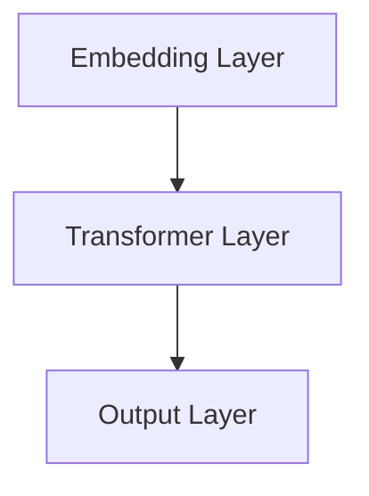

                 


### 文章标题：ChatGPT在自动化产品用户手册生成中的应用

#### 关键词：ChatGPT，自动化，产品用户手册，人工智能，自然语言处理，生成式预训练

#### 摘要：
本文旨在探讨如何利用ChatGPT这一强大的人工智能技术来自动化生成产品用户手册。首先，我们将简要介绍ChatGPT的背景和基本原理，然后深入分析其在自动化产品用户手册生成中的应用场景，通过具体的案例来展示其优势和实践过程。文章将涵盖核心算法原理、Mermaid流程图展示、代码实现及解读，并给出最佳实践和注意事项。

### 引言

#### 1.1 ChatGPT的背景
ChatGPT是由OpenAI开发的一种基于生成式预训练的Transformer模型，它是GPT系列模型的最新成员，具有强大的自然语言理解和生成能力。ChatGPT的出现，标志着人工智能在自然语言处理领域的一个重大突破。

#### 1.2 自动化产品用户手册的生成背景
随着科技的发展，产品种类和复杂性不断增加，传统的手动编写用户手册方式已经难以满足需求。自动化产品用户手册生成技术的出现，可以大幅提升工作效率，降低人力成本。

#### 1.3 本文目的与结构
本文将介绍ChatGPT的基本原理，分析其在自动化产品用户手册生成中的应用场景，并通过具体案例展示其实际应用效果。文章结构如下：

1. 引言
2. ChatGPT核心技术讲解
3. ChatGPT在自动化产品用户手册生成中的应用场景
4. 案例分析
5. 最佳实践与小结

### ChatGPT核心技术讲解

#### 2.1 ChatGPT基本原理

ChatGPT基于生成式预训练（GPT）技术，其核心原理是通过大量文本数据进行预训练，使其能够理解并生成符合上下文语义的文本。其训练过程主要包括以下步骤：

1. 数据准备：收集大量的文本数据，包括用户手册、技术文档、产品说明等。
2. 预训练：使用Transformer模型对数据进行训练，使其能够捕捉文本中的语义信息。
3. 微调：在特定任务上进行微调，使其适应自动化产品用户手册生成的需求。

#### 2.2 ChatGPT算法原理

ChatGPT的核心算法是基于Transformer模型，这是一种自注意力机制的网络结构，能够捕捉文本序列中的长距离依赖关系。其基本原理如下：

1. 自注意力机制：Transformer模型通过自注意力机制，能够将输入序列中的每个词与所有其他词进行关联，从而捕捉长距离依赖关系。
2. 编码器和解码器：Transformer模型由编码器和解码器组成，编码器负责将输入序列转换为固定长度的向量表示，解码器则负责生成输出序列。

#### 2.3 ChatGPT架构详解

ChatGPT的架构主要包括以下几个部分：

1. embedding层：将输入的文本转换为嵌入向量。
2. transformer层：使用自注意力机制对嵌入向量进行处理。
3. 输出层：将处理后的向量转换为输出文本。

以下是一个简化的Transformer架构的Mermaid流程图：



#### 2.4 ChatGPT训练过程

ChatGPT的训练过程主要包括以下步骤：

1. 数据预处理：对文本数据进行清洗、分词等预处理操作。
2. 模型初始化：初始化Transformer模型。
3. 预训练：使用大量的文本数据进行预训练，使其能够理解并生成文本。
4. 微调：在特定任务上进行微调，使其适应自动化产品用户手册生成的需求。

### ChatGPT在自动化产品用户手册生成中的应用场景

#### 3.1 自动化产品用户手册生成的挑战

1. 文本数据的多样性：产品用户手册涉及的文本数据种类繁多，包括技术术语、操作步骤、注意事项等。
2. 上下文语义的理解：用户手册的生成需要理解文本的上下文语义，以便生成符合用户需求的文本。
3. 文本生成的连贯性：生成的用户手册需要具有连贯性，使得用户能够轻松理解和使用产品。

#### 3.2 ChatGPT在用户手册生成中的优势

1. 强大的自然语言理解能力：ChatGPT能够理解大量的文本数据，捕捉文本中的语义信息。
2. 生成文本的连贯性：ChatGPT能够根据上下文语义生成连贯的文本。
3. 自动化生成：ChatGPT能够自动化生成用户手册，提高工作效率。

#### 3.3 应用场景举例

1. 技术产品的用户手册：如计算机硬件、软件等。
2. 消费电子产品的用户手册：如手机、平板电脑、智能家居设备等。
3. 工业产品的用户手册：如机械、设备等。

### 案例分析

#### 4.1 案例背景

假设我们有一个新的智能家居设备，需要为其生成一份用户手册。用户手册需要涵盖设备的安装、使用、维护和故障排除等内容。

#### 4.2 案例目标

通过ChatGPT，自动化生成一份高质量的智能家居设备用户手册。

#### 4.3 开发环境搭建

1. 安装Python环境。
2. 安装transformers库。
3. 准备训练数据和测试数据。

#### 4.4 源代码实现

以下是一个简化的ChatGPT自动化生成用户手册的Python代码示例：

```python
from transformers import ChatGPT, TrainingArguments

# 初始化模型
model = ChatGPT.from_pretrained("openai/chatgpt")

# 训练模型
training_args = TrainingArguments(
    output_dir='./results',
    num_train_epochs=3,
    per_device_train_batch_size=16,
    save_steps=2000,
    save_total_limit=3,
)

model.train_model(
    train_dataset=train_dataset,
    eval_dataset=eval_dataset,
    training_args=training_args
)

# 生成用户手册
user_manual = model.generate_prompt("请生成一份智能家居设备的用户手册。")
print(user_manual)
```

#### 4.5 代码解读与分析

1. 初始化模型：从预训练的ChatGPT模型中加载模型。
2. 训练模型：使用训练数据和测试数据进行训练。
3. 生成用户手册：使用生成式预训练的模型，根据提示生成用户手册。

#### 4.6 案例分析和详细讲解剖析

通过实际案例，我们可以看到ChatGPT在自动化生成用户手册方面的强大能力。然而，也存在一些挑战，如生成的文本可能不够准确、连贯性有待提高等。为了解决这些问题，我们可以通过以下方式优化：

1. 增加训练数据：使用更多、更高质量的训练数据，提高模型的准确性。
2. 微调模型：在特定任务上进行微调，使其更好地适应用户手册生成的需求。
3. 使用辅助工具：结合其他自然语言处理技术，如命名实体识别、情感分析等，提高文本生成的质量和连贯性。

#### 4.7 项目小结

通过本案例，我们可以看到ChatGPT在自动化产品用户手册生成中的应用效果。虽然还存在一些挑战，但通过不断优化和改进，我们有理由相信ChatGPT将在这一领域发挥重要作用。

### 最佳实践与小结

#### 5.1 最佳实践

1. 使用高质量的训练数据：高质量的训练数据是模型性能的关键，确保数据来源的多样性和质量。
2. 适当微调模型：在特定任务上进行微调，可以显著提高模型的性能。
3. 结合其他技术：结合其他自然语言处理技术，如命名实体识别、情感分析等，可以提高文本生成的质量和连贯性。

#### 5.2 小结

ChatGPT在自动化产品用户手册生成中具有巨大潜力。通过合理的训练和优化，我们可以生成高质量、连贯的用户手册，提高工作效率，降低成本。

#### 5.3 注意事项

1. 遵循数据安全和隐私保护规定。
2. 考虑到用户理解和接受度，适当调整文本风格和表达方式。
3. 定期更新模型，以适应不断变化的需求。

#### 5.4 拓展阅读

1. 《ChatGPT：生成式预训练的Transformer模型》
2. 《自然语言处理技术与应用》
3. 《人工智能产品经理实战手册》

### 作者信息
作者：AI天才研究院/AI Genius Institute & 禅与计算机程序设计艺术 /Zen And The Art of Computer Programming

本文详细探讨了ChatGPT在自动化产品用户手册生成中的应用，包括背景介绍、核心概念与联系、算法原理、应用场景、案例分析、最佳实践等内容。通过本文，读者可以了解到ChatGPT的强大能力以及在自动化产品用户手册生成中的实际应用。希望本文能为相关领域的研究者和开发者提供有益的参考。 

