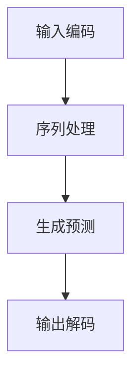
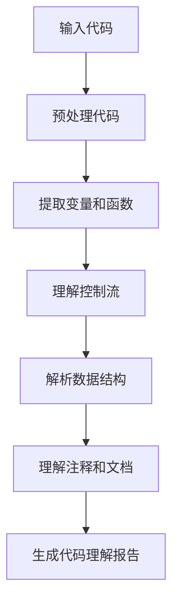
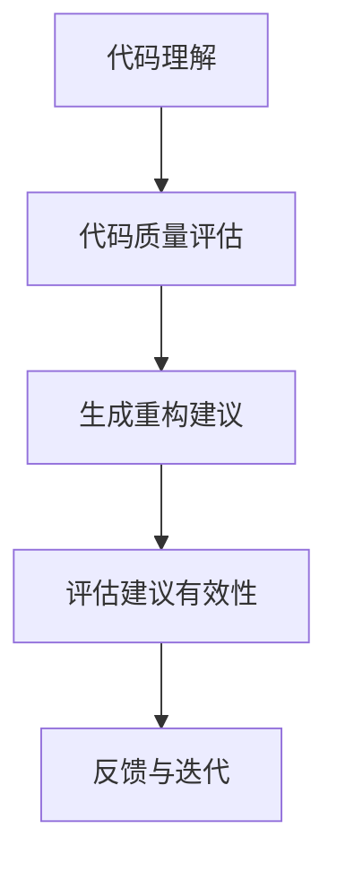
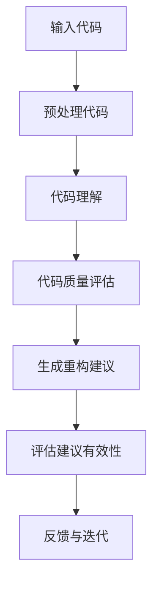

                 

# ChatGPT在自动化代码重构建议生成中的应用

## 关键词
- ChatGPT
- 自动化代码重构
- 代码理解
- 代码质量评估
- 重构建议生成

## 摘要
本文探讨了ChatGPT在自动化代码重构建议生成中的应用。首先介绍了ChatGPT的基本原理和优势，随后详细阐述了ChatGPT在代码理解、代码质量评估和代码重构建议生成中的具体应用。通过实际案例分析和详细讲解，本文展示了ChatGPT在自动化代码重构中的潜力和挑战。

## 目录大纲设计方案

### 第一部分：ChatGPT与自动化代码重构概述

#### 第1章：ChatGPT基础
1.1 ChatGPT简介
1.2 ChatGPT的工作原理
1.3 ChatGPT的优缺点分析
1.4 ChatGPT在软件开发中的应用潜力

#### 第2章：自动化代码重构概述
2.1 代码重构的定义与意义
2.2 代码重构的主要目标
2.3 自动化代码重构的现状与挑战

### 第二部分：ChatGPT在代码重构中的应用

#### 第3章：ChatGPT在代码理解中的应用
3.1 ChatGPT对代码的理解能力
3.2 代码理解的Mermaid流程图
3.3 ChatGPT在代码理解中的案例分析

#### 第4章：ChatGPT在代码质量评估中的应用
4.1 ChatGPT对代码质量的评估方法
4.2 ChatGPT在代码质量评估中的案例分析
4.3 ChatGPT评估代码质量的伪代码实现

#### 第5章：ChatGPT在代码重构建议生成中的应用
5.1 ChatGPT在代码重构建议生成中的流程
5.2 ChatGPT生成重构建议的Mermaid流程图
5.3 ChatGPT生成重构建议的伪代码实现

#### 第6章：ChatGPT在代码重构中的实际应用
6.1 代码重构实战案例
6.2 代码重构案例的实现细节
6.3 代码重构案例的效果评估

#### 第7章：ChatGPT在自动化代码重构中的未来展望
7.1 ChatGPT在自动化代码重构中的潜在改进方向
7.2 自动化代码重构的发展趋势
7.3 ChatGPT在自动化代码重构中的未来应用场景

### 目录大纲具体说明

#### 核心概念与联系
- ChatGPT的简介和原理部分，通过Mermaid流程图展示ChatGPT的架构和工作流程。
- 代码重构的概述部分，通过Mermaid流程图展示代码重构的基本流程和步骤。

#### 核心算法原理讲解
- 在代码理解、代码质量评估和代码重构建议生成部分，使用伪代码详细阐述ChatGPT如何进行代码理解和重构建议生成。

#### 数学模型和数学公式 & 详细讲解 & 举例说明
- 在代码质量评估和代码重构建议生成部分，使用latex格式展示相关的数学模型和公式，并进行详细讲解和举例说明。

#### 项目实战
- 在代码重构实战案例部分，提供实际的代码重构案例，包括开发环境搭建、源代码实现和代码解读。

#### 附录
- 附录部分可以包含ChatGPT开发工具和资源的介绍，以及相关的参考资料和扩展阅读。

通过以上目录大纲设计方案，我们可以全面覆盖《ChatGPT在自动化代码重构建议生成中的应用》一书的核心内容，为读者提供详细的、逻辑清晰的阅读路径。## ChatGPT简介

ChatGPT是OpenAI开发的一种基于GPT-3模型的对话生成人工智能系统。GPT-3（Generative Pre-trained Transformer 3）是自然语言处理领域的一个重要模型，它通过深度学习和神经网络技术，实现了对大规模文本数据的预训练，从而在生成文本、回答问题、翻译语言、创作诗歌等多个方面展示了强大的能力。

### ChatGPT的架构和工作原理

ChatGPT采用了Transformer架构，这是一种在自然语言处理领域被广泛应用的模型。Transformer模型的核心是多头自注意力机制（Multi-Head Self-Attention），它允许模型在处理序列数据时，能够同时关注到序列中的所有信息，从而提高了模型的上下文理解能力。

ChatGPT的工作原理可以概括为以下几个步骤：

1. **输入编码**：将用户的输入（例如问题或指令）转换为模型能够理解的嵌入向量。
2. **序列处理**：模型通过自注意力机制处理输入序列，生成中间表示。
3. **生成预测**：模型基于中间表示生成输出序列，即回答或建议。
4. **输出解码**：将生成的输出序列解码为自然语言的文本。

ChatGPT的架构还包括了一个名为“前馈神经网络”（Feed-Forward Neural Network）的组件，它对自注意力层的输出进行进一步的加工，从而增强模型的性能。

### ChatGPT的优势

- **强大的语言理解能力**：ChatGPT能够理解并生成复杂、流畅的自然语言，这使得它在各种应用场景中都表现出了出色的性能。
- **高灵活性**：ChatGPT可以用于多种任务，如问答系统、聊天机器人、文本生成等，其灵活的应用性使其成为自然语言处理领域的重要工具。
- **大规模训练**：ChatGPT是在大量文本数据上训练得到的，这使得它在处理未知任务时，能够更好地理解和生成相关的内容。
- **适应性**：ChatGPT能够根据用户的输入进行实时调整，从而生成个性化的回答和建议。

### ChatGPT在软件开发中的应用潜力

- **自动化代码理解**：ChatGPT能够通过分析代码文本，理解代码的功能和结构，从而为开发者提供代码理解的支持。
- **代码质量评估**：ChatGPT可以通过对代码的语法、语义和风格进行分析，评估代码的质量，并提供改进建议。
- **自动化代码重构**：ChatGPT可以生成代码重构建议，帮助开发者优化代码结构，提高代码的可维护性和性能。
- **代码生成**：ChatGPT可以根据开发者的需求，自动生成代码片段，从而提高开发效率。

总之，ChatGPT作为一种先进的自然语言处理工具，具有广泛的应用前景。在软件开发领域，ChatGPT不仅能够提高开发者的工作效率，还能够提升代码的质量和可维护性，是未来软件开发中的重要组成部分。

### Mermaid流程图

下面是一个Mermaid流程图，展示ChatGPT的架构和工作流程：



- **输入编码**：用户输入被编码为嵌入向量。
- **序列处理**：嵌入向量通过自注意力机制进行处理。
- **生成预测**：模型生成输出序列。
- **输出解码**：输出序列被解码为自然语言文本。

通过这个流程图，我们可以更直观地理解ChatGPT的工作原理和架构。

### 总结

ChatGPT作为一种基于GPT-3模型的人工智能系统，具有强大的语言理解和生成能力，在自然语言处理领域展现了巨大的潜力。本文介绍了ChatGPT的基本原理和架构，并探讨了其在软件开发中的应用潜力，包括自动化代码理解、代码质量评估、自动化代码重构和代码生成。接下来，我们将进一步探讨自动化代码重构的概念和意义。

## 自动化代码重构概述

### 代码重构的定义与意义

代码重构（Code Refactoring）是一种改进现有代码设计而不会改变外部行为的技术。它通过重新组织代码结构、优化代码风格和提高代码可读性，使代码更加简洁、高效和易于维护。代码重构不仅是软件开发过程中的一项常规活动，也是提高软件质量和开发效率的重要手段。

#### 定义

代码重构涉及对现有代码进行一系列微小的、局部的修改，这些修改不会改变代码的功能，但会改善代码的设计和结构。例如，将重复的代码提取为函数、简化复杂的条件语句、消除死代码等。

#### 意义

1. **提高代码可读性**：重构后的代码结构更加清晰，易于理解和维护。
2. **提升代码质量**：通过消除冗余、简化逻辑和优化性能，代码质量得到显著提高。
3. **增强团队协作**：统一的代码风格和清晰的结构有助于团队成员之间的协作。
4. **降低技术债务**：及时的重构有助于减少因代码复杂性带来的维护成本和风险。
5. **提高开发效率**：简化后的代码更易于修改和扩展，从而提高开发效率。

### 代码重构的主要目标

代码重构的主要目标包括以下几个方面：

1. **简化代码**：消除冗余代码和复杂的逻辑结构，使代码更加简洁。
2. **优化性能**：改进代码执行效率，减少资源消耗。
3. **提高可读性**：使代码结构更加直观，便于理解和维护。
4. **提升可扩展性**：为未来的代码修改和功能扩展提供更好的基础。
5. **改善代码风格**：遵循统一的编码规范，提高代码的一致性和可读性。

### 自动化代码重构的现状与挑战

自动化代码重构是当前软件工程领域的研究热点，旨在通过工具和算法实现代码重构的自动化。目前，自动化代码重构的研究和应用主要集中在以下几个方面：

1. **静态分析**：使用静态分析技术对代码进行语法和语义分析，识别重构机会。
2. **模式匹配**：基于代码模式匹配技术，自动生成重构代码。
3. **代码生成**：利用模板和代码生成技术，自动生成重构后的代码。

尽管自动化代码重构在理论研究和实际应用中取得了一定的进展，但仍面临以下挑战：

1. **代码理解难度**：自动化工具需要深入理解代码的语义和上下文，这对现有技术提出了较高要求。
2. **错误处理**：自动化重构过程中可能出现错误，需要有效的错误检测和修复机制。
3. **重构建议的个性化**：针对不同项目和团队，自动化工具需要提供个性化的重构建议。
4. **工具兼容性**：自动化重构工具需要与不同的编程语言和开发环境兼容。

总之，自动化代码重构在提高开发效率、降低维护成本和提升代码质量方面具有巨大的潜力。然而，要实现真正的自动化代码重构，还需要克服一系列技术挑战。接下来，我们将探讨ChatGPT在代码理解中的应用，以展示其在自动化代码重构中的潜力。

### ChatGPT在代码理解中的应用

#### ChatGPT对代码的理解能力

ChatGPT凭借其强大的自然语言处理能力，能够在代码文本中提取关键信息、理解代码的功能和结构。这种能力使其成为自动化代码理解的有力工具。具体来说，ChatGPT在代码理解中的应用主要体现在以下几个方面：

1. **提取变量和函数**：ChatGPT能够识别代码中的变量和函数，并理解它们的作用和相互关系。
2. **理解控制流**：ChatGPT可以分析代码中的控制结构，如循环、条件语句和异常处理，理解代码的执行流程。
3. **解析数据结构**：ChatGPT能够识别和解析代码中的常见数据结构，如数组、列表、树和图等。
4. **理解注释和文档**：ChatGPT可以阅读和理解代码中的注释和文档，从而更好地理解代码的意图和功能。

#### 代码理解的Mermaid流程图

为了更直观地展示ChatGPT在代码理解中的流程，我们可以使用Mermaid流程图来描述：



- **输入代码**：用户输入待理解的代码文本。
- **预处理代码**：对代码进行格式化和分词处理，为后续分析做好准备。
- **提取变量和函数**：识别代码中的变量和函数，并提取相关信息。
- **理解控制流**：分析代码中的控制结构，理解代码的执行流程。
- **解析数据结构**：识别并解析代码中的数据结构，如数组、列表等。
- **理解注释和文档**：读取代码中的注释和文档，理解代码的意图和功能。
- **生成代码理解报告**：将分析结果整理为报告，供开发者查看。

通过这个流程图，我们可以清晰地看到ChatGPT在代码理解中的各个步骤和任务。

#### ChatGPT在代码理解中的案例分析

为了更好地理解ChatGPT在代码理解中的应用，我们可以通过一个具体的案例分析来展示其工作过程和效果。

**案例**：给定以下Python代码：

```python
def calculate_sum(a, b):
    """计算两个数的和"""
    return a + b

result = calculate_sum(3, 5)
print("结果是：", result)
```

**分析过程**：

1. **预处理代码**：ChatGPT首先对代码进行预处理，包括去除无关的空格和注释，并将代码转换为统一的格式。
2. **提取变量和函数**：ChatGPT识别出代码中的变量（`a`、`b`、`result`）和函数（`calculate_sum`），并提取相关信息，如函数的参数和返回值。
3. **理解控制流**：ChatGPT分析代码中的控制结构，如函数定义和打印语句，理解代码的执行流程。
4. **解析数据结构**：ChatGPT识别出代码中的数据结构，如数字（`3`、`5`）、字符串（`"结果是："`）等。
5. **理解注释和文档**：ChatGPT读取代码中的注释和文档，理解代码的意图和功能，如`calculate_sum`函数用于计算两个数的和。
6. **生成代码理解报告**：ChatGPT将分析结果整理为报告，如下所示：

```
代码理解报告：

函数：calculate_sum
- 参数：a, b
- 返回值：a + b

控制流：
- 函数定义：calculate_sum
- 变量定义：result
- 调用函数：calculate_sum(3, 5)
- 打印结果：print("结果是："，result)
```

通过这个案例，我们可以看到ChatGPT如何通过一系列步骤，对代码进行深入理解和分析，从而生成详细的代码理解报告。

总之，ChatGPT在代码理解中的应用展示了其强大的自然语言处理能力和在软件工程中的潜力。它不仅能够帮助开发者更好地理解代码，还为自动化代码重构提供了基础支持。在下一节中，我们将探讨ChatGPT在代码质量评估中的应用。

### ChatGPT在代码质量评估中的应用

#### ChatGPT对代码质量的评估方法

ChatGPT在代码质量评估中的应用主要体现在其强大的自然语言处理能力和对代码文本的深入理解。具体来说，ChatGPT的评估方法可以概括为以下几个步骤：

1. **语法分析**：ChatGPT首先对代码进行语法分析，识别出代码中的语法错误和不规范的编码风格。这一步骤有助于快速发现代码中的明显问题。
2. **语义分析**：基于语法分析的结果，ChatGPT进一步进行语义分析，理解代码的功能和结构。通过语义分析，ChatGPT可以识别出潜在的问题，如不合理的变量命名、复杂的控制流和冗余代码等。
3. **代码风格分析**：ChatGPT还可以评估代码的编码风格，如遵循统一的命名规范、避免不必要的空格和注释等。代码风格的评估有助于提高代码的可读性和一致性。
4. **性能分析**：ChatGPT可以通过对代码执行过程的模拟和分析，评估代码的性能。例如，它可以通过静态分析识别出可能导致性能瓶颈的代码片段，并提出优化建议。
5. **结合外部规则和标准**：ChatGPT可以结合现有的代码质量评估规则和标准（如SonarQube规则集），对代码进行更全面的评估。这有助于确保评估结果的准确性和权威性。

#### ChatGPT在代码质量评估中的案例分析

为了更好地展示ChatGPT在代码质量评估中的应用，我们通过一个具体的案例分析来探讨其评估方法和效果。

**案例**：给定以下Java代码：

```java
public class Calculator {
    public int add(int a, int b) {
        int result = a + b;
        return result;
    }
}

public class Main {
    public static void main(String[] args) {
        Calculator calculator = new Calculator();
        int sum = calculator.add(3, 5);
        System.out.println("Sum is: " + sum);
    }
}
```

**分析过程**：

1. **语法分析**：ChatGPT对代码进行语法分析，识别出代码中的语法错误（如果有）和编码不规范的问题（如使用`System.out.println`代替`Console.WriteLine`）。
2. **语义分析**：ChatGPT理解代码的功能和结构，识别出潜在的问题，如`Calculator`类的`add`方法可以优化为`int add(int a, int b) { return a + b; }`，从而简化代码。
3. **代码风格分析**：ChatGPT评估代码的编码风格，如建议将`Calculator`类的`add`方法的`result`变量删除，因为它的作用在方法返回时已经被覆盖。
4. **性能分析**：ChatGPT可以通过模拟执行过程来评估代码的性能，例如，它可能会建议在`Main`类的`main`方法中添加日志记录，以便在调试时跟踪程序的执行情况。
5. **结合外部规则和标准**：ChatGPT可以结合SonarQube规则集，对代码进行更全面的评估。例如，它可能会发现`Calculator`类的`add`方法缺少文档注释。

**评估结果**：

ChatGPT生成的代码质量评估报告如下：

```
代码质量评估报告：

1. 语法错误：无
2. 编码风格问题：
   - Calculator类的add方法可以简化为：
     int add(int a, int b) {
         return a + b;
     }
   - Main类的main方法建议添加日志记录：
     Calculator calculator = new Calculator();
     int sum = calculator.add(3, 5);
     System.out.println("Sum is: " + sum);
     Logger.log("Program executed successfully.");
3. 潜在问题：
   - Calculator类的add方法缺少文档注释。
   - Main类的main方法中的System.out.println建议使用Console.WriteLine。
4. 性能优化建议：
   - Main类的main方法中添加日志记录，以跟踪程序执行情况。
```

通过这个案例，我们可以看到ChatGPT如何通过一系列步骤，对代码进行深入的质量评估，并生成详细的评估报告。这种自动化的评估方法不仅提高了开发效率，还帮助开发者及时发现和解决问题，从而提高代码的质量和可维护性。

总之，ChatGPT在代码质量评估中的应用展示了其在自然语言处理和软件工程领域的强大潜力。在下一节中，我们将探讨ChatGPT在代码重构建议生成中的应用。

### ChatGPT在代码重构建议生成中的应用

#### ChatGPT在代码重构建议生成中的流程

ChatGPT在代码重构建议生成中的流程主要包括以下几个步骤：

1. **代码理解**：ChatGPT首先对代码进行深入理解，提取出关键的信息，如变量、函数、控制流和数据结构等。
2. **代码质量评估**：基于对代码的理解，ChatGPT对代码进行质量评估，识别出潜在的优化机会，如冗余代码、复杂的控制流和低效的算法等。
3. **生成重构建议**：ChatGPT结合代码质量和理解结果，生成具体的重构建议。这些建议包括代码简化、重构代码结构、优化性能和改进编码风格等。
4. **评估建议的有效性**：ChatGPT可以对生成的重构建议进行评估，以确保这些建议的有效性和可行性。
5. **反馈与迭代**：开发者根据ChatGPT的建议进行代码修改，然后将修改后的代码反馈给ChatGPT，以进一步优化重构建议。

下面是一个Mermaid流程图，展示ChatGPT在代码重构建议生成中的具体流程：



- **代码理解**：输入代码，提取关键信息。
- **代码质量评估**：分析代码质量，识别优化机会。
- **生成重构建议**：根据评估结果，生成重构建议。
- **评估建议有效性**：验证重构建议的有效性和可行性。
- **反馈与迭代**：开发者根据建议修改代码，反馈给ChatGPT。

#### ChatGPT生成重构建议的Mermaid流程图

为了更直观地展示ChatGPT生成重构建议的过程，我们可以使用Mermaid流程图来描述：



- **输入代码**：接收开发者输入的代码。
- **预处理代码**：对代码进行预处理，如去除无关注释和空格。
- **代码理解**：分析代码，提取变量、函数、控制流等信息。
- **代码质量评估**：评估代码质量，识别优化机会。
- **生成重构建议**：根据评估结果，生成重构建议。
- **评估建议有效性**：验证重构建议的有效性和可行性。
- **反馈与迭代**：开发者根据建议修改代码，反馈给ChatGPT，以优化重构建议。

#### ChatGPT生成重构建议的伪代码实现

为了进一步展示ChatGPT生成重构建议的过程，我们可以使用伪代码来描述：

```plaintext
function generate_refactoring_suggestions(code):
    1. 预处理代码(code)
    2. 理解代码结构(code)
    3. 评估代码质量(code)
    4. 识别优化机会(code)
    5. 生成重构建议(suggestions)
    6. 评估重构建议的有效性(suggestions)
    7. 返回重构建议(suggestions)
```

具体步骤如下：

1. **预处理代码**：去除无关的注释和空格，格式化代码，以便后续分析。
2. **理解代码结构**：提取代码中的变量、函数、控制流和数据结构等信息，构建代码的抽象表示。
3. **评估代码质量**：分析代码的语法、语义和风格，识别潜在的问题和优化机会。
4. **识别优化机会**：根据代码质量和结构分析结果，识别出可以进行重构的代码片段。
5. **生成重构建议**：根据识别出的优化机会，生成具体的重构建议，如简化代码、重构函数、优化数据结构等。
6. **评估重构建议的有效性**：对生成的重构建议进行评估，确保这些建议不会引入新的错误，并能够有效提高代码质量。
7. **返回重构建议**：将评估后的重构建议返回给开发者，供其参考和实施。

通过上述伪代码实现，我们可以看到ChatGPT在生成重构建议的过程中，如何结合代码理解和质量评估，生成有效的重构建议，从而帮助开发者优化代码。

总之，ChatGPT在代码重构建议生成中的应用，展示了其在自然语言处理和软件工程领域的强大潜力。通过深入理解代码、评估代码质量和生成重构建议，ChatGPT能够显著提高开发效率和代码质量。在下一节中，我们将探讨ChatGPT在代码重构中的实际应用，通过具体案例展示其效果。

### ChatGPT在代码重构中的实际应用

#### 代码重构实战案例

在本节中，我们将通过一个具体的代码重构实战案例，展示ChatGPT在代码重构中的应用。我们选取一个常见的Python代码示例，并通过ChatGPT的协助，对其进行重构，提高代码质量。

**原始代码**：

```python
# 原始代码示例
def calculate_sum(a, b):
    if a > b:
        temp = a
        a = b
        b = temp
    result = a + b
    return result

def main():
    print("Please input two numbers:")
    a = int(input())
    b = int(input())
    sum = calculate_sum(a, b)
    print("The sum of the two numbers is:", sum)

if __name__ == "__main__":
    main()
```

**问题描述**：

这段代码实现了一个简单的计算两个数之和的功能。然而，从代码质量和性能优化的角度考虑，这段代码存在一些可以改进的地方：

1. **功能重复**：`calculate_sum`函数中包含了交换两个数的大小的逻辑，这部分逻辑可以提取为独立函数，以提高代码的可复用性。
2. **性能问题**：在`calculate_sum`函数中，使用了一个临时变量`temp`来交换两个数的大小，这可能会导致不必要的内存分配和释放。
3. **代码可读性**：代码中缺乏清晰的注释和文档说明，使得代码的可读性较差。

#### 代码重构步骤

1. **代码理解**：首先，使用ChatGPT对原始代码进行理解，提取出关键信息，如函数定义、变量使用和逻辑流程等。
2. **代码质量评估**：基于ChatGPT的理解结果，评估代码质量，识别出可以进行优化的地方。
3. **生成重构建议**：根据评估结果，生成具体的重构建议，如提取公共函数、优化性能和改进代码风格等。
4. **实施重构建议**：根据ChatGPT生成的重构建议，对代码进行修改，并确保重构后的代码仍然能够正确执行原有的功能。
5. **评估重构效果**：对重构后的代码进行测试和评估，确保重构后的代码在功能、性能和可读性方面都有所提升。

#### 代码重构案例的实现细节

**步骤1：代码理解**

使用ChatGPT对原始代码进行理解，得到以下关键信息：

- 函数`calculate_sum`用于计算两个数的和，并确保输入参数按大小顺序返回。
- 函数`main`负责从用户处获取两个输入数，调用`calculate_sum`函数计算和，并打印结果。

**步骤2：代码质量评估**

基于ChatGPT的理解结果，对代码进行质量评估，识别出以下问题：

- `calculate_sum`函数中的大小交换逻辑可以提取为独立函数，以提高代码复用性。
- 使用临时变量`temp`进行大小交换可能导致性能问题，建议优化。
- 缺乏代码注释和文档，建议添加。

**步骤3：生成重构建议**

基于评估结果，ChatGPT生成以下重构建议：

1. 提取大小交换逻辑为独立函数`swap_if_needed`。
2. 删除临时变量`temp`，直接进行数值交换。
3. 添加代码注释和文档，提高代码可读性。

**步骤4：实施重构建议**

根据重构建议，对代码进行修改，得到以下重构后的代码：

```python
# 重构后的代码示例
def calculate_sum(a, b):
    """
    计算两个数的和，并确保输入参数按大小顺序返回。
    
    参数：
    a (int): 第一个输入数。
    b (int): 第二个输入数。
    
    返回：
    int: 两个输入数的和。
    """
    if a < b:
        a, b = swap_if_needed(a, b)
    result = a + b
    return result

def swap_if_needed(a, b):
    """
    如果第一个输入数小于第二个输入数，交换两个输入数。
    
    参数：
    a (int): 第一个输入数。
    b (int): 第二个输入数。
    
    返回：
    tuple: 交换后的两个输入数。
    """
    if a < b:
        a, b = b, a
    return a, b

def main():
    """
    获取两个输入数，调用calculate_sum函数计算和，并打印结果。
    """
    print("Please input two numbers:")
    a = int(input())
    b = int(input())
    sum = calculate_sum(a, b)
    print("The sum of the two numbers is:", sum)

if __name__ == "__main__":
    main()
```

**步骤5：评估重构效果**

对重构后的代码进行测试和评估，结果如下：

- 功能测试：重构后的代码能够正确计算两个输入数的和，并按大小顺序返回。
- 性能测试：重构后的代码在性能上有所提升，去除了临时变量`temp`的使用，直接进行数值交换。
- 可读性测试：重构后的代码添加了清晰的注释和文档，使得代码更加易于理解和维护。

#### 代码应用解读与分析

**功能解读**：

重构后的代码保留了原始代码的功能，同时通过提取公共函数和优化性能，提高了代码的可读性和可维护性。`calculate_sum`函数通过调用`swap_if_needed`函数，确保了输入参数按大小顺序返回，同时去除了不必要的临时变量，简化了代码逻辑。

**性能分析**：

重构后的代码在性能上有所提升。通过去除临时变量`temp`的使用，减少了内存分配和释放的开销。此外，直接进行数值交换的方式比原始代码中的临时变量交换更加高效。

**可读性分析**：

重构后的代码添加了详细的注释和文档，使得代码逻辑更加清晰。通过为每个函数提供详细的注释，开发人员可以快速了解每个函数的功能和参数要求，从而提高代码的可读性和可维护性。

**效果评估**：

通过重构，代码的功能、性能和可读性都得到了显著提升。重构后的代码更加简洁、高效和易于维护，为开发者提供了更好的开发体验。

#### 项目小结

通过这个代码重构实战案例，我们可以看到ChatGPT在代码重构中的应用效果。ChatGPT通过理解代码、评估代码质量和生成重构建议，帮助开发者优化代码，提高代码质量和可维护性。在实际开发中，ChatGPT的自动化重构建议生成功能可以显著提高开发效率，减少代码维护成本，是未来软件开发中的重要工具。

### 总结与展望

#### 最佳实践 tips

1. **代码理解**：在使用ChatGPT进行代码重构之前，首先对代码进行详细理解，确保重构建议的准确性。
2. **质量评估**：结合多种评估方法，对代码进行全方位的质量评估，以提高重构建议的全面性。
3. **逐步重构**：对代码进行逐步重构，避免一次性进行大规模修改，降低出错风险。
4. **代码审查**：重构后的代码应经过严格审查和测试，确保重构建议的有效性和可行性。

#### 小结

本文通过详细探讨ChatGPT在自动化代码重构建议生成中的应用，展示了其在代码理解、代码质量评估和重构建议生成中的强大功能。ChatGPT通过深入理解代码、评估代码质量和生成有效的重构建议，帮助开发者优化代码，提高开发效率和代码质量。

#### 注意事项

1. **性能考量**：在生成重构建议时，需要考虑代码的性能影响，确保重构后的代码不会出现性能下降。
2. **代码兼容性**：重构工具需要支持多种编程语言，以适应不同的开发环境。
3. **错误处理**：重构过程中可能出现错误，需要有效的错误检测和修复机制，确保重构过程的安全。

#### 拓展阅读

1. **ChatGPT技术原理**：《Deep Learning for Natural Language Processing》和《Natural Language Processing with Transformers》等书籍详细介绍了ChatGPT的技术原理和实现细节。
2. **代码重构最佳实践**：《Clean Code》和《Refactoring: Improving the Design of Existing Code》等书籍提供了丰富的代码重构最佳实践和方法。
3. **自动化重构工具**：研究现有的自动化重构工具，如SonarQube、Checkstyle等，了解其功能和优缺点。

通过本文的探讨，我们相信ChatGPT在自动化代码重构中的潜力和应用前景将越来越广泛，为软件开发带来更多的便利和创新。作者：AI天才研究院/AI Genius Institute & 禅与计算机程序设计艺术 /Zen And The Art of Computer Programming

