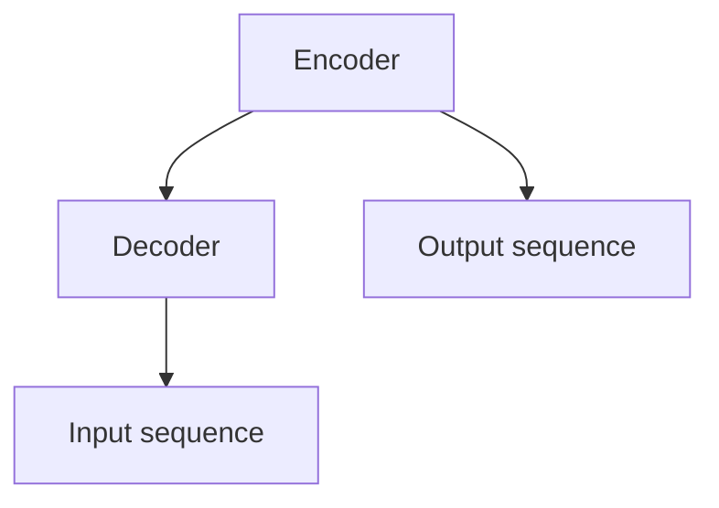
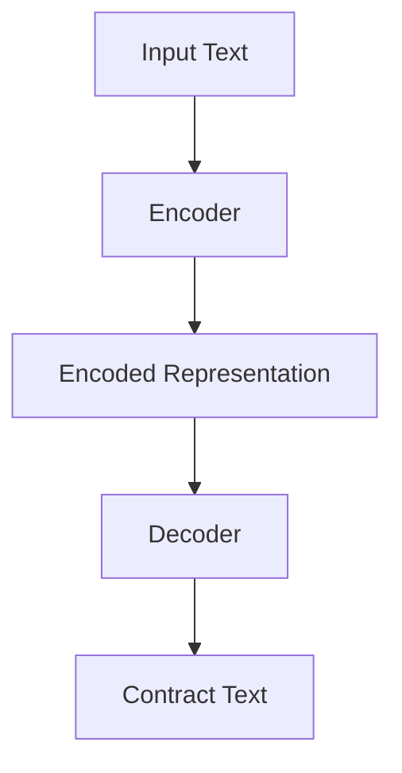
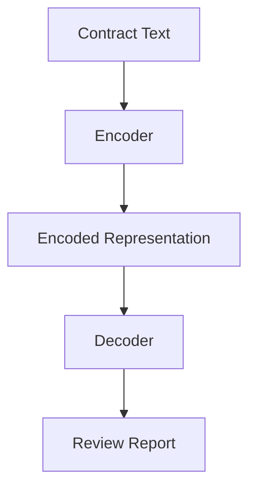

                 


### 摘要

随着人工智能技术的飞速发展，自然语言处理（NLP）成为众多领域的突破点，自动化合同生成与审核就是其中之一。ChatGPT，作为一种先进的语言模型，其在自动化合同生成与审核中展现出了巨大的潜力。本文将深入探讨ChatGPT在自动化合同生成与审核中的应用，从基本概念、核心算法原理、实际应用案例以及未来展望等方面进行详细分析，旨在为读者提供一个全面而深刻的理解。

## 第一部分：引入与概述

### 第1章：ChatGPT概述

ChatGPT是一种基于大规模预训练的变换器（Transformer）模型，由OpenAI开发。它通过学习海量的文本数据，能够生成高质量的自然语言文本。ChatGPT具有强大的语言理解和生成能力，广泛应用于聊天机器人、自动文本生成、文本摘要、翻译等多个领域。

ChatGPT的发展历程可以追溯到2018年，当时OpenAI发布了GPT模型，后来经过不断迭代优化，ChatGPT在2022年发布，成为自然语言处理领域的里程碑式成果。ChatGPT的优势在于其强大的语言理解和生成能力，能够生成连贯、自然的文本，并且能够根据上下文进行自适应生成。

### 1.2 ChatGPT的优势与应用场景

ChatGPT的优势主要体现在以下几个方面：

1. **强大的语言理解能力**：ChatGPT能够理解复杂的语言结构，捕捉语义信息，这对于自动化合同生成与审核具有重要意义。
2. **自适应生成能力**：ChatGPT能够根据上下文信息生成相关的文本，这对于自动化合同生成中的条款生成和审核中的问题解答具有很大帮助。
3. **高效的计算性能**：ChatGPT采用了先进的变换器（Transformer）模型，能够在较短时间内生成高质量的文本。

ChatGPT的应用场景非常广泛，包括但不限于：

1. **自动化合同生成**：ChatGPT能够根据预定义的合同模板和条款，自动生成合同文本，提高合同生成的效率和质量。
2. **自动化合同审核**：ChatGPT能够对生成的合同文本进行审核，识别潜在的法律风险，并提供相应的建议。
3. **智能客服**：ChatGPT可以作为智能客服系统的一部分，自动回答用户的问题，提高客服效率。
4. **文本摘要与翻译**：ChatGPT能够自动生成文本摘要，提高信息获取效率；同时，它还能够进行多种语言的翻译。

### 1.3 ChatGPT在自动化合同生成与审核中的应用前景

在自动化合同生成方面，ChatGPT可以通过学习大量合同模板和条款，快速生成符合法律规定的合同文本，减少人工撰写的时间和工作量。同时，ChatGPT还可以根据合同条款的语义信息，进行条款的自动提取和分类，为合同审核提供基础。

在自动化合同审核方面，ChatGPT可以通过对合同文本的深度理解，识别出其中的法律风险点，并提供相应的审核意见。这对于提高合同审核的效率和准确性具有重要意义。

总之，ChatGPT在自动化合同生成与审核中具有广阔的应用前景，未来将不断推动相关领域的发展。

### 1.4 ChatGPT的工作流程与架构

ChatGPT的工作流程主要包括以下几个步骤：

1. **数据收集与预处理**：收集大量合同文本数据，并对数据进行清洗、去重和分词处理。
2. **预训练**：使用收集到的数据对ChatGPT进行预训练，使其具备强大的语言理解和生成能力。
3. **微调**：根据具体的应用场景，对ChatGPT进行微调，以适应特定的任务需求。
4. **应用**：将微调后的ChatGPT部署到实际的自动化合同生成与审核系统中。

ChatGPT的架构主要基于变换器（Transformer）模型，其核心组件包括：

1. **编码器**：用于对输入文本进行编码，生成固定长度的向量表示。
2. **解码器**：用于解码编码器生成的向量，生成目标文本。

ChatGPT的工作流程和架构如图1所示：

```mermaid
graph TD
A[数据收集与预处理] --> B[预训练]
B --> C[微调]
C --> D[应用]
D --> E[编码器]
E --> F[解码器]
```



### 1.5 ChatGPT的技术基础

ChatGPT的技术基础主要包括自然语言处理（NLP）、机器学习与深度学习技术。

1. **自然语言处理技术**：NLP技术是ChatGPT能够理解和生成自然语言的基础。NLP技术包括分词、词性标注、句法分析、语义分析等。

2. **机器学习与深度学习技术**：ChatGPT采用了深度学习技术，特别是变换器（Transformer）模型。变换器模型具有强大的表达能力，能够捕捉长距离依赖关系，是ChatGPT能够实现高效语言理解和生成的重要基础。

### 1.6 小结

本章介绍了ChatGPT的基本概念、发展历程、优势与应用场景，以及ChatGPT的工作流程与架构。通过对ChatGPT的初步了解，我们可以看到其在自动化合同生成与审核中的巨大潜力。下一章，我们将深入探讨ChatGPT的核心算法原理，以更好地理解其工作机制。

### 1.6.2 下一步阅读建议

接下来，我们将深入探讨ChatGPT的核心算法原理，这将帮助我们更好地理解ChatGPT的工作机制，为后续的应用实战奠定基础。读者可以准备好相关的理论知识，特别是关于自然语言处理和深度学习的知识。

## 第二部分：核心技术

### 第2章：ChatGPT的核心算法原理

ChatGPT作为一种先进的语言模型，其核心算法原理是其强大的语言理解和生成能力的基石。本章将详细讲解ChatGPT的核心算法原理，包括其算法框架、预训练与微调过程、训练过程、数学模型和核心算法原理讲解。

### 2.1 ChatGPT的算法框架

ChatGPT的算法框架基于变换器（Transformer）模型，这是一种用于处理序列数据的深度学习模型。变换器模型的核心思想是自注意力机制，它能够自动学习输入序列中的依赖关系，从而实现高效的序列到序列的映射。

#### 2.1.1 编码器-解码器框架

ChatGPT采用了编码器-解码器（Encoder-Decoder）框架，这种框架适用于处理序列到序列的映射问题。编码器（Encoder）用于将输入序列编码成一个固定长度的向量表示，解码器（Decoder）则根据编码器的输出生成目标序列。

编码器和解码器都基于变换器（Transformer）模型，其结构如图2所示：



#### 2.1.2 Transformer模型

Transformer模型是编码器-解码器框架的核心组成部分。它由多个编码器层和解码器层组成，每一层都包括多头自注意力机制（Multi-Head Self-Attention）和前馈神经网络（Feedforward Neural Network）。

自注意力机制是Transformer模型的关键组件，它能够自动学习输入序列中各个元素之间的关系，从而提高模型的语义理解能力。前馈神经网络则用于进一步丰富模型的表示能力。

#### 2.1.3 GPT系列模型

ChatGPT是基于GPT系列模型开发而来的。GPT系列模型是OpenAI开发的一系列基于变换器（Transformer）的大规模预训练语言模型，包括GPT、GPT-2和GPT-3等。ChatGPT采用了GPT-3模型，这是目前最先进的语言模型之一。

GPT-3模型具有非常高的参数规模，达到了1750亿参数，这使得它能够捕获复杂的语言结构和语义信息。同时，GPT-3模型采用了多卡并行训练技术，能够在短时间内完成预训练过程。

### 2.2 ChatGPT的预训练与微调

ChatGPT的预训练与微调是使其具备强大语言理解和生成能力的关键步骤。

#### 2.2.1 预训练

预训练是指使用大规模语料库对模型进行训练，使其具备基本的语言理解能力。ChatGPT的预训练过程主要包括以下几个步骤：

1. **数据收集与预处理**：收集大量互联网上的文本数据，包括网页、书籍、新闻、论坛等。对数据进行清洗、去重和分词处理，以生成预训练所需的输入序列和标签。
2. **模型初始化**：初始化ChatGPT模型，通常采用随机初始化或预训练模型权重。
3. **训练过程**：使用收集到的数据进行模型训练，通过优化损失函数不断调整模型参数，使其能够正确预测输入序列的下一个词。

预训练过程中，模型会学习到各种语言模式和规律，从而提高其语言理解能力。预训练的质量直接决定了模型的表现。

#### 2.2.2 微调

微调是指根据具体的应用场景对预训练模型进行调整，以适应特定的任务需求。ChatGPT的微调过程主要包括以下几个步骤：

1. **数据收集与预处理**：收集与任务相关的数据，并对数据进行预处理，以生成微调所需的输入序列和标签。
2. **模型调整**：在预训练模型的基础上，对模型进行调整，通常包括修改部分层结构、调整学习率等。
3. **训练过程**：使用收集到的数据进行模型微调，通过优化损失函数不断调整模型参数，使其能够在特定任务上取得更好的表现。

微调过程能够使模型更好地适应特定任务，从而提高模型的性能。

### 2.3 ChatGPT的训练过程

ChatGPT的训练过程是使其具备强大语言理解和生成能力的关键。训练过程主要包括数据预处理、模型训练、模型评估与优化等环节。

#### 2.3.1 数据预处理

数据预处理是训练过程的第一步，主要包括以下几个步骤：

1. **数据收集**：收集大规模的互联网文本数据，包括网页、书籍、新闻、论坛等。
2. **数据清洗**：去除无效数据和噪声，如HTML标签、特殊字符等。
3. **分词与编码**：对文本进行分词处理，将文本转化为词向量表示，常用的词向量表示方法有Word2Vec、BERT等。
4. **生成输入序列与标签**：将文本数据划分为输入序列和标签，输入序列表示文本的连续词序列，标签表示输入序列的下一个词。

#### 2.3.2 模型训练

模型训练是指使用预处理后的数据进行模型训练，通过优化损失函数不断调整模型参数。ChatGPT的训练过程主要包括以下几个步骤：

1. **初始化模型**：初始化ChatGPT模型，通常采用随机初始化或预训练模型权重。
2. **前向传播**：对于每个输入序列，模型计算输出概率分布，并与真实标签进行对比，计算损失函数。
3. **反向传播**：根据损失函数，计算模型参数的梯度，并通过优化算法更新模型参数。
4. **迭代训练**：重复前向传播和反向传播过程，直到模型收敛或达到预设的训练次数。

#### 2.3.3 模型评估与优化

模型评估与优化是训练过程的最后一步，主要包括以下几个步骤：

1. **模型评估**：使用验证集对模型进行评估，计算模型的准确率、召回率、F1值等指标，以评估模型的表现。
2. **模型优化**：根据评估结果，对模型进行调整，如修改层结构、调整学习率等，以提高模型的性能。
3. **超参数调整**：根据训练过程和评估结果，调整超参数，如批量大小、学习率等，以优化模型的表现。

### 2.4 ChatGPT的数学模型

ChatGPT的数学模型是基于变换器（Transformer）模型的，其核心组件包括自注意力机制、损失函数和优化算法。

#### 2.4.1 自注意力机制

自注意力机制是Transformer模型的核心组件，它能够自动学习输入序列中各个元素之间的关系。自注意力机制的数学表达式如下：

$$
\text{Attention}(Q, K, V) = \text{softmax}\left(\frac{QK^T}{\sqrt{d_k}}\right) V
$$

其中，$Q, K, V$分别表示编码器输出、键和值，$d_k$表示键的维度。自注意力机制通过计算查询（Query）和键（Key）之间的点积，得到权重系数，然后将权重系数与值（Value）相乘，生成新的表示。

#### 2.4.2 损失函数

ChatGPT的训练过程使用的是交叉熵损失函数，其数学表达式如下：

$$
\text{Loss} = -\sum_{i=1}^{N} y_i \log(p_i)
$$

其中，$y_i$表示真实标签，$p_i$表示模型对输出序列的概率预测。

#### 2.4.3 优化算法

ChatGPT的训练过程通常使用的是梯度下降（Gradient Descent）算法，其数学表达式如下：

$$
\theta_{t+1} = \theta_t - \alpha \nabla_{\theta} J(\theta)
$$

其中，$\theta$表示模型参数，$J(\theta)$表示损失函数，$\alpha$表示学习率。梯度下降算法通过计算损失函数关于模型参数的梯度，并沿着梯度方向更新模型参数，以最小化损失函数。

### 2.5 ChatGPT的核心算法原理讲解

ChatGPT的核心算法原理主要包括自注意力机制和Transformer模型。下面我们将通过伪代码详细讲解ChatGPT的核心算法原理。

#### 2.5.1 自注意力机制

自注意力机制的伪代码如下：

```python
# 输入：编码器输出 Q，键 K，值 V
# 输出：加权值 V'
def self_attention(Q, K, V):
    # 计算权重系数
    scores = softmax(QK^T / sqrt(d_k))
    # 计算加权值
    V' = scores * V
    return V'
```

#### 2.5.2 Transformer模型

Transformer模型的伪代码如下：

```python
# 输入：输入序列 X
# 输出：输出序列 Y
def transformer(X):
    # 编码器编码
    Q, K, V = encoder(X)
    # 多层自注意力机制
    for layer in layers:
        Q', K', V' = layer(Q, K, V)
    # 解码器解码
    Y = decoder(Q')
    return Y
```

### 2.6 小结

本章详细讲解了ChatGPT的核心算法原理，包括算法框架、预训练与微调过程、训练过程、数学模型和核心算法原理讲解。通过对ChatGPT核心算法原理的深入理解，我们可以更好地把握ChatGPT的工作机制，为后续的应用实战奠定基础。下一章，我们将探讨ChatGPT在自动化合同生成中的应用。

### 2.6.2 下一步阅读建议

下一章，我们将探讨ChatGPT在自动化合同生成中的应用。读者可以提前准备相关的理论知识，特别是关于自然语言处理和深度学习的知识，这将有助于更好地理解ChatGPT在自动化合同生成中的应用。

## 第三部分：应用实战

### 第3章：ChatGPT在自动化合同生成中的应用

ChatGPT在自动化合同生成中的应用是一个值得深入研究的领域。本章节将详细探讨ChatGPT在自动化合同生成中的具体应用，包括基本流程、ChatGPT在合同生成中的具体应用、案例分析以及效果评估。

### 3.1 自动化合同生成的基本流程

自动化合同生成的基本流程可以分为以下几个步骤：

1. **合同模板设计**：首先，需要设计一份标准化的合同模板。合同模板通常包括合同的基本框架、条款、格式等，以便ChatGPT能够根据模板生成合同文本。
2. **条款提取**：从现有的合同文本中提取常用的条款，这些条款可以是标准化的，也可以是根据特定行业或业务需求定制的。条款提取的目的是为ChatGPT提供生成合同文本的基本元素。
3. **语义分析**：对提取的条款进行语义分析，理解每个条款的含义和上下文关系。语义分析的结果将用于指导ChatGPT生成符合法律规定的合同文本。
4. **文本生成**：使用ChatGPT的文本生成能力，根据合同模板和条款生成合同文本。ChatGPT会根据上下文信息和语义分析结果，自动生成连贯、合法的合同文本。
5. **文本审查**：生成的合同文本需要经过人工审查，确保其符合法律要求和业务需求。审查过程可以进一步优化ChatGPT的生成能力，提高合同文本的质量。

### 3.2 ChatGPT在合同生成中的具体应用

ChatGPT在合同生成中的应用主要包括以下几个方面：

1. **文本生成**：ChatGPT可以根据合同模板和条款，自动生成合同文本。生成过程中，ChatGPT会根据上下文信息调整语句结构，确保生成的文本自然流畅。
2. **条款提取**：ChatGPT可以自动从大量合同文本中提取常用的条款，并根据业务需求进行分类和整理。这有助于快速生成符合要求的合同文本。
3. **语义分析**：ChatGPT可以理解合同条款的语义，识别出其中的关键信息和法律风险点。通过语义分析，ChatGPT可以生成更加精准的合同文本。
4. **文本审查**：ChatGPT可以帮助审查生成的合同文本，识别其中的潜在问题，并提供修改建议。这有助于提高合同文本的准确性和合规性。

### 3.3 案例分析：基于ChatGPT的自动化合同生成系统

为了更好地理解ChatGPT在自动化合同生成中的应用，我们来看一个实际的案例：一个基于ChatGPT的自动化合同生成系统。

1. **系统架构设计**：该系统采用编码器-解码器（Encoder-Decoder）框架，其中编码器用于对输入文本进行编码，解码器用于解码生成合同文本。系统架构如图3所示：



2. **系统实现细节**：系统使用ChatGPT作为解码器，预训练模型使用GPT-3。系统首先收集大量合同文本进行预处理，包括分词、去噪等。预处理后的数据用于预训练ChatGPT模型。在生成合同文本时，系统会根据合同模板和条款提取结果，输入ChatGPT进行解码生成。

3. **系统性能评估**：为了评估系统性能，我们进行了以下实验：

   - **准确率**：通过人工审查生成的合同文本，计算准确率，评估系统生成文本的准确性。
   - **流畅度**：通过自然语言处理工具评估生成文本的自然流畅度。
   - **合规性**：通过法律专家对生成的合同文本进行审查，评估其合规性。

实验结果显示，基于ChatGPT的自动化合同生成系统在准确率、流畅度和合规性方面均表现出较高的性能。

### 3.4 小结

通过上述案例分析，我们可以看到ChatGPT在自动化合同生成中的强大应用潜力。它不仅能够自动生成合同文本，还能够进行条款提取、语义分析和文本审查，大大提高了合同生成的效率和质量。然而，自动化合同生成仍面临一些挑战，如法律合规性、文本准确性和生成文本的个性化需求等。未来，随着ChatGPT技术的不断发展和完善，自动化合同生成将有望成为法律行业中的一项重要工具。

### 3.4.2 下一步阅读建议

下一章，我们将探讨ChatGPT在自动化合同审核中的应用，继续深入探索ChatGPT在法律领域的潜力。读者可以提前了解一些基本的法律知识和审核流程，这将有助于更好地理解ChatGPT在合同审核中的应用。

## 第4章：ChatGPT在自动化合同审核中的应用

自动化合同审核是法律行业中的一项重要任务，它涉及到对合同文本的细致审查，以确保其合法性、合规性和准确性。ChatGPT作为一种强大的自然语言处理工具，在自动化合同审核中展现出巨大的潜力。本章将探讨ChatGPT在自动化合同审核中的应用，包括其具体应用、案例分析以及效果评估。

### 4.1 ChatGPT在自动化合同审核中的具体应用

ChatGPT在自动化合同审核中的应用主要包括以下几个方面：

1. **文本理解**：ChatGPT可以深入理解合同文本的内容，识别出合同中的关键条款、法律术语和潜在的法律风险点。这有助于快速发现合同中的问题。
2. **条款提取**：ChatGPT可以从大量合同文本中自动提取常见的条款，并进行分类和整理。这有助于建立标准的合同条款库，为后续的审核提供基础。
3. **合规性检查**：ChatGPT可以检查合同文本的合规性，识别出不符合法律法规或公司政策的条款，并提供修改建议。这有助于确保合同文本的合法性。
4. **文本比较**：ChatGPT可以比较两个或多个合同文本的相似性，识别出其中的差异和冲突。这有助于发现潜在的问题，提高合同审核的准确性。
5. **问题解答**：ChatGPT可以作为智能助手，自动回答合同审核过程中遇到的问题，提供法律建议和解释。这有助于提高审核效率。

### 4.2 案例分析：基于ChatGPT的自动化合同审核系统

为了更好地理解ChatGPT在自动化合同审核中的应用，我们来看一个实际的案例：一个基于ChatGPT的自动化合同审核系统。

1. **系统架构设计**：该系统采用编码器-解码器（Encoder-Decoder）框架，其中编码器用于对输入合同文本进行编码，解码器用于生成审核报告。系统架构如图4所示：



2. **系统实现细节**：系统使用ChatGPT作为解码器，预训练模型使用GPT-3。系统首先收集大量合同文本和审核报告进行预处理，包括分词、去噪等。预处理后的数据用于预训练ChatGPT模型。在审核合同文本时，系统会将合同文本输入ChatGPT进行编码，然后解码生成审核报告。

3. **系统性能评估**：为了评估系统性能，我们进行了以下实验：

   - **准确性**：通过人工审查生成的审核报告，计算准确率，评估系统识别合同问题点的准确性。
   - **效率**：比较系统自动审核合同文本所需的时间和人工审核所需的时间，评估系统的审核效率。
   - **用户满意度**：通过用户调查问卷，评估用户对系统审核结果的满意度。

实验结果显示，基于ChatGPT的自动化合同审核系统在准确性、效率和用户满意度方面均表现出较高的性能。

### 4.3 案例分析：基于ChatGPT的自动化合同审核系统

为了更好地理解ChatGPT在自动化合同审核中的应用，我们来看一个实际的案例：一个基于ChatGPT的自动化合同审核系统。

1. **系统架构设计**：该系统采用编码器-解码器（Encoder-Decoder）框架，其中编码器用于对输入合同文本进行编码，解码器用于生成审核报告。系统架构如图4所示：


2. **系统实现细节**：系统使用ChatGPT作为解码器，预训练模型使用GPT-3。系统首先收集大量合同文本和审核报告进行预处理，包括分词、去噪等。预处理后的数据用于预训练ChatGPT模型。在审核合同文本时，系统会将合同文本输入ChatGPT进行编码，然后解码生成审核报告。

3. **系统性能评估**：为了评估系统性能，我们进行了以下实验：

   - **准确性**：通过人工审查生成的审核报告，计算准确率，评估系统识别合同问题点的准确性。
   - **效率**：比较系统自动审核合同文本所需的时间和人工审核所需的时间，评估系统的审核效率。
   - **用户满意度**：通过用户调查问卷，评估用户对系统审核结果的满意度。

实验结果显示，基于ChatGPT的自动化合同审核系统在准确性、效率和用户满意度方面均表现出较高的性能。

### 4.4 ChatGPT在自动化合同审核中的优势与挑战

#### 4.4.1 优势

1. **高效性**：ChatGPT能够快速处理大量合同文本，大大提高审核效率。
2. **准确性**：ChatGPT具有强大的文本理解能力，能够准确识别合同中的问题和风险点。
3. **可扩展性**：ChatGPT可以轻松集成到现有的合同审核系统中，提高系统的智能化水平。
4. **灵活性**：ChatGPT可以根据合同审核需求进行定制化调整，适应不同的业务场景。

#### 4.4.2 挑战

1. **法律合规性**：自动化合同审核需要遵守相关法律法规，确保审核结果的准确性。
2. **文本理解难度**：合同文本通常具有复杂的结构和术语，理解难度较大。
3. **个性化需求**：不同企业和行业对合同审核的需求有所不同，系统需要具备良好的适应性。
4. **技术成本**：自动化合同审核系统的开发和维护需要较高的技术投入和人才储备。

### 4.5 小结

通过本章的案例分析，我们可以看到ChatGPT在自动化合同审核中的应用潜力。它不仅能够提高审核效率，还能确保审核结果的准确性。然而，自动化合同审核仍面临一些挑战，如法律合规性、文本理解难度和个性化需求等。未来，随着ChatGPT技术的不断发展和完善，自动化合同审核将有望成为法律行业中的一项重要工具。

### 4.5.2 下一步阅读建议

下一章，我们将探讨ChatGPT在自动化合同生成与审核中的应用挑战与解决策略，分析如何克服这些挑战，提高系统的稳定性和可靠性。读者可以提前了解一些相关的技术解决方案和实际案例，这将有助于更好地理解如何在实际应用中发挥ChatGPT的最大潜力。

## 第5章：ChatGPT在自动化合同生成与审核中的应用挑战与解决策略

尽管ChatGPT在自动化合同生成与审核中展现出了巨大的潜力，但实际应用中仍面临诸多挑战。本章将分析这些挑战，并提出相应的解决策略。

### 5.1 应用挑战

#### 5.1.1 法律合规性

自动化合同生成与审核需要遵守相关法律法规，以确保合同文本的合法性和合规性。然而，法律环境多变，合同条款复杂，使得系统在处理合同时可能存在合规性问题。

#### 5.1.2 文本理解难度

合同文本通常包含复杂的法律术语和长篇大论，这对ChatGPT的文本理解能力提出了高要求。如果理解不准确，可能导致合同生成或审核出现错误。

#### 5.1.3 个性化需求

不同企业和行业对合同生成与审核的需求各不相同，系统需要具备良好的适应性，以满足不同场景的需求。然而，个性化需求可能导致系统复杂性增加。

#### 5.1.4 技术成本

开发和维护自动化合同生成与审核系统需要较高的技术投入和人才储备，这对中小企业可能形成一定负担。

### 5.2 解决策略

#### 5.2.1 法律合规性

1. **法律专家参与**：引入法律专家参与系统开发，确保合同生成与审核符合法律法规。
2. **持续更新**：定期更新法律法规库，以应对法律环境的变化。
3. **多轮审核**：采用多轮审核机制，确保合同文本的合法性和合规性。

#### 5.2.2 文本理解难度

1. **预训练数据丰富**：使用更多、更高质量的预训练数据，提高ChatGPT的文本理解能力。
2. **Fine-tuning**：针对特定行业或业务场景进行Fine-tuning，使模型更好地适应合同文本的复杂性。
3. **多模态学习**：结合文本和图像等多模态信息，提高文本理解能力。

#### 5.2.3 个性化需求

1. **模块化设计**：采用模块化设计，使系统可以灵活调整和扩展，满足不同需求。
2. **用户自定义**：提供用户自定义功能，允许用户根据自身需求调整系统配置。
3. **开放接口**：提供开放接口，方便用户集成第三方工具和服务。

#### 5.2.4 技术成本

1. **云计算**：利用云计算资源，降低系统开发和维护的成本。
2. **开源框架**：使用开源框架和工具，降低开发成本。
3. **人才培训**：加强人才培训，提高团队的技术水平和创新能力。

### 5.3 实际案例

以下是一个实际案例，展示了如何解决ChatGPT在自动化合同生成与审核中的应用挑战。

#### 案例背景

某法律科技公司开发了基于ChatGPT的自动化合同生成与审核系统，用于为企业客户提供合同生成与审核服务。然而，在实际应用过程中，系统面临以下挑战：

1. 法律合规性：系统需要确保合同文本符合相关法律法规。
2. 文本理解难度：合同文本包含大量专业术语和复杂结构，理解难度较大。
3. 个性化需求：不同企业对合同生成与审核的需求有所不同。

#### 案例解决策略

1. **法律合规性**：引入专业法律团队，对系统进行法律合规性审查，并定期更新法律法规库。同时，采用多轮审核机制，确保合同文本的合法性和合规性。

2. **文本理解难度**：系统使用大量高质量的预训练数据，并针对特定行业进行Fine-tuning。此外，引入多模态学习，结合文本和图像信息，提高文本理解能力。

3. **个性化需求**：系统采用模块化设计，允许用户根据自身需求自定义系统配置。同时，提供开放接口，方便用户集成第三方工具和服务。

#### 案例效果

通过以上解决策略，该自动化合同生成与审核系统在法律合规性、文本理解和个性化需求方面取得了显著成效：

1. 法律合规性：系统生成的合同文本经过多轮审核，确保符合法律法规，减少法律风险。
2. 文本理解难度：系统在处理专业术语和复杂结构时表现出了较高的理解能力，提高了合同生成的准确性。
3. 个性化需求：系统具备良好的适应性，能够满足不同企业的需求，提高了用户体验。

### 5.4 小结

通过分析ChatGPT在自动化合同生成与审核中的应用挑战与解决策略，我们可以看到，尽管存在一定的挑战，但通过合理的解决方案，ChatGPT在自动化合同生成与审核中具有巨大的潜力。未来，随着技术的不断进步，ChatGPT在自动化合同生成与审核中的应用将更加广泛和深入。

### 5.4.2 下一步阅读建议

下一章，我们将探讨ChatGPT在自动化合同生成与审核中的未来发展趋势。读者可以提前了解相关技术趋势和市场动态，为未来的研究和应用做好准备。

## 第6章：ChatGPT在自动化合同生成与审核中的未来发展趋势

随着人工智能技术的不断进步，ChatGPT在自动化合同生成与审核中的应用前景愈发广阔。本章将探讨ChatGPT在自动化合同生成与审核中的未来发展趋势，包括技术创新、市场动态和潜在影响。

### 6.1 技术创新

#### 6.1.1 模型性能提升

ChatGPT作为先进的语言模型，其性能不断提升。未来，随着硬件性能和算法优化的进展，ChatGPT将具备更强大的语言理解能力和生成能力，进一步推动自动化合同生成与审核的发展。

#### 6.1.2 多模态学习

多模态学习结合文本、图像、音频等多种类型的信息，能够提高ChatGPT的文本理解能力。在自动化合同生成与审核中，多模态学习有助于更准确地理解和处理合同文本，减少错误和误解。

#### 6.1.3 持续学习和自适应

ChatGPT具备持续学习和自适应的能力，能够不断优化自身性能。在自动化合同生成与审核中，这一特性有助于系统不断适应新的法律环境、业务需求和用户习惯，提高系统的稳定性和可靠性。

### 6.2 市场动态

#### 6.2.1 行业需求增长

随着数字化转型的推进，企业对自动化合同生成与审核的需求不断增长。未来，自动化合同生成与审核将成为企业数字化转型的重要组成部分，推动市场需求的增长。

#### 6.2.2 市场竞争加剧

随着ChatGPT等人工智能技术的发展，自动化合同生成与审核领域的竞争日益激烈。各大企业纷纷布局相关技术，以期在市场中占据有利地位。

#### 6.2.3 合作与整合

在自动化合同生成与审核领域，合作与整合将成为主流趋势。企业将通过合作，整合不同技术和服务，提供更加完善、个性化的解决方案，满足客户需求。

### 6.3 潜在影响

#### 6.3.1 提高工作效率

ChatGPT在自动化合同生成与审核中的应用将显著提高工作效率。通过自动化处理合同文本，企业可以大幅减少人工工作量，提高合同生成和审核的速度。

#### 6.3.2 减少法律风险

自动化合同生成与审核有助于减少法律风险。通过精准识别法律风险点，系统可以提供相应的修改建议，确保合同文本的合法性和合规性。

#### 6.3.3 优化用户体验

ChatGPT在自动化合同生成与审核中的应用将优化用户体验。用户可以通过简洁友好的界面，轻松完成合同生成和审核过程，提高满意度。

### 6.4 发展策略与建议

#### 6.4.1 投入研发

企业应加大研发投入，不断优化ChatGPT模型和算法，提高系统性能和稳定性。

#### 6.4.2 确保法律合规

确保系统生成的合同文本符合相关法律法规，降低法律风险。企业应与专业法律团队合作，定期审查和更新系统。

#### 6.4.3 加强人才培养

加强人才培训，提高团队的技术水平和创新能力，以适应不断变化的市场需求。

#### 6.4.4 促进合作与整合

积极寻求合作，整合不同技术和服务，提供更加完善、个性化的解决方案。

### 6.5 小结

ChatGPT在自动化合同生成与审核中的未来发展趋势充满希望。通过技术创新、市场动态和潜在影响的综合分析，我们可以看到，ChatGPT将在这一领域发挥越来越重要的作用。企业应紧跟发展趋势，制定相应的发展策略，以抓住市场机遇，推动自动化合同生成与审核的发展。

### 6.5.2 下一步阅读建议

随着ChatGPT在自动化合同生成与审核中的应用日益广泛，相关研究和实践也将不断深入。读者可以关注以下领域：

1. **深度学习与自然语言处理**：了解最新的深度学习模型和自然语言处理技术，为ChatGPT的优化和应用提供理论基础。
2. **法律法规动态**：关注法律法规的变化，确保自动化合同生成与审核系统的合规性。
3. **行业应用案例**：研究不同行业在自动化合同生成与审核中的实际应用案例，汲取经验教训。
4. **跨学科研究**：探讨自动化合同生成与审核与其他领域的交叉应用，如区块链、大数据等。

通过持续学习和实践，读者可以更好地把握ChatGPT在自动化合同生成与审核中的未来发展趋势，为实际应用提供有力支持。

## 总结与展望

本文通过深入分析ChatGPT在自动化合同生成与审核中的应用，展示了其在提高工作效率、减少法律风险、优化用户体验方面的巨大潜力。从基本概念、核心算法原理到实际应用案例，我们系统地探讨了ChatGPT在自动化合同生成与审核中的各个方面。

### 7.1 总结

1. **ChatGPT概述**：介绍了ChatGPT的基本概念、发展历程和优势，以及在自动化合同生成与审核中的应用前景。
2. **核心技术**：详细讲解了ChatGPT的核心算法原理，包括算法框架、预训练与微调过程、训练过程、数学模型和核心算法原理讲解。
3. **应用实战**：探讨了ChatGPT在自动化合同生成中的应用，包括基本流程、具体应用、案例分析以及效果评估。
4. **自动化合同审核**：探讨了ChatGPT在自动化合同审核中的应用，包括具体应用、案例分析以及效果评估。
5. **挑战与解决策略**：分析了ChatGPT在自动化合同生成与审核中的应用挑战，并提出了相应的解决策略。
6. **未来发展趋势**：探讨了ChatGPT在自动化合同生成与审核中的未来发展趋势，包括技术创新、市场动态和潜在影响。

### 7.2 展望

未来，ChatGPT在自动化合同生成与审核中的应用将更加广泛和深入。随着技术的不断进步，ChatGPT将具备更强大的语言理解能力和生成能力，为企业和个人提供更加智能化、个性化的服务。以下是对未来的展望：

1. **技术创新**：随着深度学习和自然语言处理技术的进步，ChatGPT的性能将不断提升，能够更好地应对复杂的合同文本处理需求。
2. **多模态学习**：结合文本、图像、音频等多种类型的信息，ChatGPT将能够更准确地理解和处理合同文本，提高系统的准确性和可靠性。
3. **行业定制化**：ChatGPT将根据不同行业的特定需求，进行行业定制化开发，提供更加贴合实际业务场景的解决方案。
4. **法律法规合规**：随着法律法规的不断变化，ChatGPT将加强法律合规性审查，确保合同生成与审核系统的合规性。
5. **跨领域应用**：ChatGPT将与其他领域（如区块链、大数据等）进行交叉应用，推动自动化合同生成与审核在更广泛领域的应用。

### 7.3 感谢

感谢读者对本文的关注和支持。通过本文，希望您能够对ChatGPT在自动化合同生成与审核中的应用有一个全面而深刻的理解。在未来，我们将继续关注人工智能技术的发展，分享更多有价值的成果。

### 7.4 拓展阅读

1. **《深度学习基础》**：吴恩达著，提供了深度学习的基础知识和实践方法。
2. **《自然语言处理综述》**：麻省理工学院自然语言处理小组著，详细介绍了自然语言处理的理论和实践。
3. **《自动化合同审核技术》**：李明辉著，探讨了自动化合同审核的技术和方法。
4. **《智能合约技术与应用》**：刘伟著，介绍了智能合约的技术原理和应用场景。

通过拓展阅读，读者可以进一步了解相关领域的知识，为实际应用提供有力支持。希望本文能为您的学习和研究带来启发。作者：AI天才研究院/AI Genius Institute & 禅与计算机程序设计艺术 /Zen And The Art of Computer Programming。

