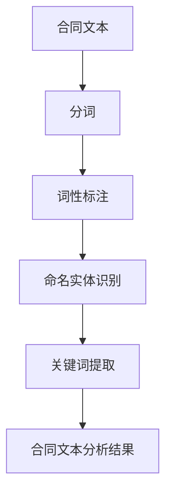
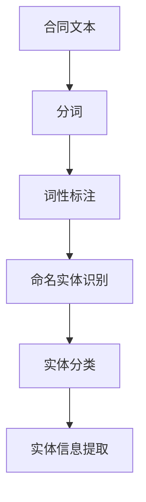
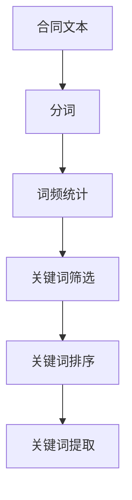
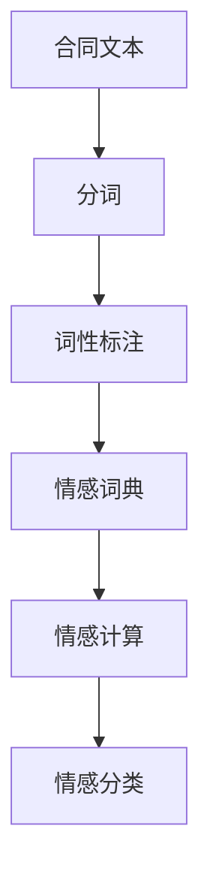

                 

### 1.1 ChatGPT概述

#### 1.1.1 ChatGPT的定义

ChatGPT是由OpenAI开发的基于GPT（Generative Pre-trained Transformer）的人工智能语言模型。它利用深度学习技术，通过大量文本数据的学习，掌握了丰富的语言知识和表达方式。ChatGPT不仅可以生成流畅的文本，还能够进行对话，理解并回应人类语言。

#### 1.1.2 ChatGPT的发展历程

ChatGPT并非一夜之间诞生，而是OpenAI多年来持续研究和技术积累的成果。从GPT-1到GPT-2，再到GPT-3，OpenAI不断优化模型架构和训练方法，提升了模型的性能和表现。ChatGPT是基于GPT-3.5版本开发的，进一步增强了文本生成的质量和对话能力。

#### 1.1.3 ChatGPT的核心特点

ChatGPT具有以下核心特点：

1. **强大的文本生成能力**：ChatGPT能够生成连贯、逻辑性强、内容丰富的文本，适用于撰写文章、生成报告、创作故事等多种场景。
2. **卓越的对话能力**：ChatGPT可以模拟自然的人类对话，能够理解并回应用户的问题，进行流畅的交流。
3. **多语言支持**：ChatGPT不仅支持英语，还能处理多种语言，为全球化应用提供了便利。
4. **可扩展性**：ChatGPT可以轻松集成到各种应用程序中，通过API接口与其他系统进行数据交换和功能协作。

### 1.2 自然语言处理基础

自然语言处理（NLP）是人工智能领域的一个重要分支，旨在使计算机能够理解和生成自然语言。要理解ChatGPT在自动化合同风险评估中的应用，我们需要先了解NLP的基本概念和技术。

#### 1.2.1 自然语言处理的基本概念

自然语言处理涉及多个层次，包括：

1. **词汇层**：包括词性标注、词形还原等。
2. **句法层**：涉及句子的结构分析，如句法树构建。
3. **语义层**：处理词语和句子的意义，包括语义角色标注、语义分析等。
4. **语用层**：研究语言在特定情境中的使用，如对话系统中的上下文理解。

#### 1.2.2 自然语言处理的关键技术

自然语言处理的关键技术包括：

1. **分词**：将连续的文本分割成词语或短语。
2. **词性标注**：为每个词语分配词性，如名词、动词、形容词等。
3. **命名实体识别**：识别文本中的专有名词、人名、地点等实体。
4. **情感分析**：分析文本的情感倾向，如正面、负面或中立。
5. **机器翻译**：将一种语言的文本翻译成另一种语言。

### 1.3 ChatGPT与自动化合同风险评估

自动化合同风险评估是指利用技术手段对合同文本进行分析，识别潜在的风险因素，并进行评估和预警。ChatGPT在自动化合同风险评估中具有独特的应用价值。

#### 1.3.1 自动化合同风险评估的现状

随着商业活动的复杂化和数字化，自动化合同风险评估的需求日益增加。传统的风险评估方法主要依赖于人工审查，效率低、成本高且容易出错。自动化合同风险评估的出现，显著提升了评估的效率和准确性。

#### 1.3.2 ChatGPT在自动化合同风险评估中的应用

ChatGPT在自动化合同风险评估中的应用主要体现在以下几个方面：

1. **合同文本分析**：ChatGPT可以处理大量的合同文本，提取关键信息，如合同条款、违约条款、违约责任等。
2. **风险因素识别**：ChatGPT能够分析合同文本中的潜在风险因素，如违约风险、法律风险、市场风险等。
3. **风险评估与预测**：基于风险因素的识别，ChatGPT可以建立风险评估模型，预测合同可能面临的风险，并提供相应的预警和建议。

### 总结

ChatGPT作为一种先进的人工智能语言模型，在自动化合同风险评估中具有广泛的应用前景。通过结合自然语言处理技术，ChatGPT能够显著提升合同风险评估的效率和准确性，为企业和金融机构提供更加智能化的风险管理解决方案。接下来的章节将深入探讨ChatGPT在自动化合同风险评估中的具体应用和实践案例。

### 2. ChatGPT在自动化合同风险评估中的应用

#### 2.1 自动化合同风险评估的核心流程

自动化合同风险评估通常包括以下几个核心流程：

1. **合同数据收集与预处理**：收集合同数据，并进行清洗、整合和存储。
2. **合同文本分析**：使用自然语言处理技术对合同文本进行分析，提取关键信息。
3. **风险因素识别**：分析合同文本，识别潜在的风险因素。
4. **风险评估与预测**：建立风险评估模型，对合同进行风险评估和预测。
5. **生成风险评估报告**：根据评估结果生成详细的风险评估报告。

下面我们将详细探讨每个流程的具体步骤和应用。

#### 2.1.1 合同数据收集与预处理

合同数据收集是自动化合同风险评估的基础。数据来源可能包括公司内部管理系统、外部数据库和公开资料等。收集到的合同数据通常包含以下内容：

- 合同文本
- 合同当事人信息
- 合同条款
- 其他相关文档

收集到的合同数据需要进行预处理，包括以下步骤：

1. **数据清洗**：去除重复数据、缺失数据和无效数据。
2. **数据整合**：将不同来源的数据进行整合，形成统一的数据格式。
3. **数据存储**：将预处理后的数据存储到数据库或数据仓库中，以便后续分析。

#### 2.1.2 合同文本分析

合同文本分析是自动化合同风险评估的关键环节。通过自然语言处理技术，我们可以对合同文本进行深入分析，提取关键信息。以下是合同文本分析的主要步骤：

1. **分词**：将合同文本分割成词语或短语。
2. **词性标注**：为每个词语分配词性，如名词、动词、形容词等。
3. **命名实体识别**：识别文本中的专有名词、人名、地点等实体。
4. **关键词提取**：提取合同文本中的关键条款和关键信息。

为了更直观地展示合同文本分析的过程，我们可以使用Mermaid流程图来描述：



#### 2.1.3 风险因素识别

风险因素识别是自动化合同风险评估的核心任务。通过分析合同文本，我们可以识别出潜在的风险因素，如违约条款、违约责任、市场波动等。以下是风险因素识别的主要步骤：

1. **风险因素提取**：从合同文本中提取相关的风险因素。
2. **风险因素分类**：对提取出的风险因素进行分类，如法律风险、市场风险、操作风险等。
3. **风险因素评估**：对每个风险因素进行评估，确定其可能性和影响程度。

为了更好地理解风险因素识别的过程，我们可以使用以下伪代码来描述：

```python
# 输入：合同文本
# 输出：风险因素列表

def identify_risk_factors(contract_text):
    # 步骤1：分词和词性标注
    words = tokenize(contract_text)
    tagged_words = tag_parts_of_speech(words)

    # 步骤2：命名实体识别
    entities = named_entity_recognition(tagged_words)

    # 步骤3：关键词提取
    keywords = keyword_extraction(tagged_words)

    # 步骤4：风险因素提取和分类
    risk_factors = []
    for keyword in keywords:
        risk_factor = extract_risk_factor(keyword)
        risk_factor["category"] = classify_risk_factor(risk_factor)
        risk_factors.append(risk_factor)

    return risk_factors
```

#### 2.1.4 风险评估与预测

风险评估与预测是自动化合同风险评估的最终目标。通过分析风险因素，我们可以建立风险评估模型，对合同进行风险评估和预测。以下是风险评估与预测的主要步骤：

1. **建立风险评估模型**：根据风险因素的数据，建立风险评估模型。
2. **风险评估**：使用风险评估模型对合同进行评估，确定其风险等级。
3. **风险预测**：基于风险评估模型，预测合同可能面临的风险和影响。

为了更好地理解风险评估与预测的过程，我们可以使用以下数学模型来描述：

$$
R = f(W, C, E)
$$

其中，$R$表示风险等级，$W$表示关键词权重，$C$表示合同条款，$E$表示风险因素。

为了实现这个模型，我们可以使用以下伪代码：

```python
# 输入：合同文本，关键词权重，合同条款
# 输出：风险等级

def risk_assessment(contract_text, keyword_weights, contract条款):
    # 步骤1：分词和词性标注
    words = tokenize(contract_text)
    tagged_words = tag_parts_of_speech(words)

    # 步骤2：命名实体识别
    entities = named_entity_recognition(tagged_words)

    # 步骤3：关键词提取和权重计算
    keywords = keyword_extraction(tagged_words)
    keyword_weights = calculate_keyword_weights(keyword_weights, keywords)

    # 步骤4：风险评估模型计算
    risk_score = 0
    for keyword in keywords:
        risk_score += keyword_weights[keyword] * calculate_risk_score(keyword, contract条款)

    # 步骤5：风险等级确定
    risk_level = determine_risk_level(risk_score)

    return risk_level
```

#### 2.1.5 生成风险评估报告

风险评估报告是对合同风险评估结果进行总结和呈现的重要文档。报告通常包括以下内容：

1. **合同基本信息**：合同名称、合同双方、合同金额等。
2. **风险评估结果**：包括风险等级、主要风险因素等。
3. **风险建议**：根据风险评估结果，提出相应的风险控制建议。
4. **风险评估过程**：详细描述风险评估的流程和方法。

为了更好地理解风险评估报告的生成过程，我们可以使用以下伪代码：

```python
# 输入：合同文本，风险评估结果
# 输出：风险评估报告

def generate_risk_report(contract_text, risk_result):
    # 步骤1：合同基本信息提取
    contract_info = extract_contract_info(contract_text)

    # 步骤2：风险评估结果整理
    risk_summary = format_risk_result(risk_result)

    # 步骤3：风险建议生成
    risk_advice = generate_risk_advice(risk_result)

    # 步骤4：风险评估报告生成
    report = {
        "contract_info": contract_info,
        "risk_summary": risk_summary,
        "risk_advice": risk_advice,
        "assessment_process": "详细描述风险评估的流程和方法"
    }

    return report
```

通过以上步骤，我们可以实现自动化合同风险评估的全过程，为企业和金融机构提供有效的风险管理工具。

### 2.2 ChatGPT在合同文本分析中的应用

ChatGPT在自动化合同风险评估中的应用主要体现在合同文本分析方面。通过自然语言处理技术，ChatGPT能够对合同文本进行深入分析，提取关键信息，从而为风险评估提供有力支持。

#### 2.2.1 命名实体识别

命名实体识别是自然语言处理中的一个重要任务，旨在从文本中识别出具有特定意义的实体。在合同文本分析中，命名实体识别可以帮助我们识别出合同中的关键实体，如合同双方、合同金额、违约条款等。以下是一个简单的命名实体识别流程：



通过命名实体识别，我们可以提取出合同文本中的关键信息，如：

- 合同双方：公司名称、个人姓名
- 合同金额：具体数字和货币单位
- 违约条款：违约责任、违约金等

以下是一个简单的命名实体识别伪代码示例：

```python
# 输入：合同文本
# 输出：命名实体列表

def named_entity_recognition(contract_text):
    # 步骤1：分词
    words = tokenize(contract_text)

    # 步骤2：词性标注
    tagged_words = tag_parts_of_speech(words)

    # 步骤3：实体分类
    entities = []
    for word in tagged_words:
        if word["part_of_speech"] in ["NN", "NNS", "NNP", "NNPS"]:
            entities.append(word["word"])

    # 步骤4：实体信息提取
    entity_info = extract_entity_info(entities)

    return entity_info
```

#### 2.2.2 关键词提取

关键词提取是自然语言处理中的另一个重要任务，旨在从文本中提取出对理解文本至关重要的词语。在合同文本分析中，关键词提取可以帮助我们识别出合同中的关键条款和关键信息。以下是一个简单的关键词提取流程：



通过关键词提取，我们可以提取出合同文本中的关键信息，如：

- 合同条款：合同期限、违约责任、保密条款等
- 法律术语：违约、解除、赔偿等
- 涉及金额的关键词：金额、支付、费用等

以下是一个简单的关键词提取伪代码示例：

```python
# 输入：合同文本
# 输出：关键词列表

def keyword_extraction(contract_text):
    # 步骤1：分词
    words = tokenize(contract_text)

    # 步骤2：词频统计
    word_frequencies = count_word_frequencies(words)

    # 步骤3：关键词筛选
    keywords = select_keywords(word_frequencies)

    return keywords
```

#### 2.2.3 情感分析

情感分析是自然语言处理中的一个重要任务，旨在从文本中分析出作者的情感倾向。在合同文本分析中，情感分析可以帮助我们识别出合同双方的协商态度和意图。以下是一个简单的情感分析流程：



通过情感分析，我们可以分析出合同文本中的情感倾向，如：

- 正面情感：合作、共赢、信任等
- 负面情感：争议、纠纷、不满等

以下是一个简单的情感分析伪代码示例：

```python
# 输入：合同文本
# 输出：情感分类

def sentiment_analysis(contract_text):
    # 步骤1：分词和词性标注
    words = tokenize(contract_text)
    tagged_words = tag_parts_of_speech(words)

    # 步骤2：情感词典
    sentiment_lexicon = load_sentiment_lexicon()

    # 步骤3：情感计算
    sentiment_scores = compute_sentiment_scores(tagged_words, sentiment_lexicon)

    # 步骤4：情感分类
    sentiment = classify_sentiment(sentiment_scores)

    return sentiment
```

通过命名实体识别、关键词提取和情感分析，ChatGPT能够对合同文本进行深入分析，提取出关键信息，为自动化合同风险评估提供有力支持。

### 2.3 ChatGPT在风险评估与预测中的应用

在自动化合同风险评估中，风险因素的识别和预测至关重要。ChatGPT凭借其强大的文本生成和理解能力，能够在这方面发挥重要作用。以下将详细探讨ChatGPT在风险因素识别、风险预测模型建立和风险评估报告生成中的应用。

#### 2.3.1 风险因素识别

风险因素识别是风险评估的第一步。ChatGPT可以通过分析合同文本中的关键条款、法律术语和上下文信息，识别出潜在的风险因素。以下是一个基于ChatGPT的风险因素识别流程：

1. **合同文本预处理**：将合同文本输入到ChatGPT中进行预处理，包括分词、词性标注和句法分析。
2. **关键信息提取**：利用命名实体识别和关键词提取技术，从预处理后的文本中提取出关键条款、法律术语和关键词。
3. **风险因素分析**：基于提取出的关键信息和上下文，使用ChatGPT进行风险因素分析，识别出潜在的风险点。

以下是一个基于ChatGPT的风险因素识别伪代码示例：

```python
# 输入：合同文本
# 输出：风险因素列表

def identify_risk_factors(contract_text):
    # 步骤1：预处理合同文本
    preprocessed_text = preprocess_text(contract_text)

    # 步骤2：提取关键信息
    key_info = extract_key_info(preprocessed_text)

    # 步骤3：风险因素分析
    risk_factors = analyze_risk_factors(key_info)

    return risk_factors
```

#### 2.3.2 风险预测模型建立

在识别出风险因素后，下一步是建立风险预测模型。ChatGPT可以用于构建基于数据的机器学习模型，预测合同可能面临的风险。以下是一个基于ChatGPT的风险预测模型建立流程：

1. **数据收集与处理**：收集历史合同数据，并对数据进行清洗、编码和特征提取。
2. **模型训练**：使用ChatGPT训练机器学习模型，将风险因素与合同结果（如是否发生违约）进行关联。
3. **模型评估**：对训练好的模型进行评估，调整模型参数，提高预测准确性。

以下是一个基于ChatGPT的风险预测模型建立伪代码示例：

```python
# 输入：历史合同数据
# 输出：风险预测模型

def build_risk_prediction_model(data):
    # 步骤1：数据收集与处理
    processed_data = preprocess_data(data)

    # 步骤2：模型训练
    model = train_model(processed_data)

    # 步骤3：模型评估
    evaluate_model(model)

    return model
```

#### 2.3.3 风险评估报告生成

风险评估报告是对合同风险评估结果的总结和呈现。ChatGPT可以用于生成详细的风险评估报告，包括风险因素、风险评估结果和风险控制建议。以下是一个基于ChatGPT的风险评估报告生成流程：

1. **报告模板准备**：准备风险评估报告的模板，包括报告结构、图表和数据展示格式。
2. **报告内容填充**：使用ChatGPT生成报告内容，包括风险因素描述、风险评估结果和风险控制建议。
3. **报告格式调整**：根据实际需求调整报告格式，确保报告清晰、准确和易于理解。

以下是一个基于ChatGPT的风险评估报告生成伪代码示例：

```python
# 输入：风险评估数据
# 输出：风险评估报告

def generate_risk_report(assessment_data):
    # 步骤1：准备报告模板
    report_template = prepare_report_template()

    # 步骤2：填充报告内容
    report_content = generate_report_content(assessment_data)

    # 步骤3：格式调整
    formatted_report = format_report(report_template, report_content)

    return formatted_report
```

通过上述步骤，ChatGPT在自动化合同风险评估中发挥了关键作用，从风险因素识别到风险评估模型建立，再到风险评估报告生成，为企业和金融机构提供了智能化的风险管理解决方案。

### 3. 实战案例

为了更好地展示ChatGPT在自动化合同风险评估中的应用，下面我们将通过两个具体的案例来进行详细解析。

#### 3.1 案例一：某公司自动化合同风险评估系统

**3.1.1 项目背景**

某大型公司经常需要进行大量的合同风险评估，以防范潜在的法律和商业风险。传统的合同风险评估方法主要依赖于人工审查，不仅耗时耗力，而且容易出现疏漏。为了提高评估效率和准确性，该公司决定开发一套基于ChatGPT的自动化合同风险评估系统。

**3.1.2 技术架构**

该自动化合同风险评估系统的技术架构主要包括以下几个部分：

1. **数据收集与预处理模块**：负责从内部系统和外部数据源收集合同数据，并进行数据清洗、整合和存储。
2. **合同文本分析模块**：利用ChatGPT进行合同文本分析，提取关键信息，如合同条款、违约条款和风险因素。
3. **风险评估模块**：基于ChatGPT训练的机器学习模型，对合同进行风险评估和预测。
4. **报告生成模块**：根据评估结果，使用ChatGPT生成详细的风险评估报告。

**3.1.3 实现过程**

1. **数据收集与预处理**：首先，从公司的合同管理系统和外部数据库收集合同数据。数据收集完成后，进行数据清洗，去除重复和无效数据，并进行数据整合和存储。

2. **合同文本分析**：利用ChatGPT进行合同文本分析，提取关键信息。具体步骤包括分词、词性标注、命名实体识别和关键词提取。

3. **风险评估**：基于ChatGPT训练的机器学习模型，对提取出的风险因素进行风险评估和预测。模型训练过程包括数据预处理、特征工程和模型训练。

4. **报告生成**：根据风险评估结果，使用ChatGPT生成详细的风险评估报告。报告内容包含合同基本信息、风险评估结果、主要风险因素和风险控制建议。

**3.1.4 实现代码**

以下是实现该自动化合同风险评估系统的核心代码示例：

```python
# 数据收集与预处理
def collect_and_preprocess_data():
    # 从合同管理系统和外部数据库收集合同数据
    contracts = get_contracts_from_system()
    # 数据清洗
    clean_contracts = clean_data(contracts)
    # 数据整合和存储
    store_data(clean_contracts)
    return clean_contracts

# 合同文本分析
def analyze_contract_text(contract_text):
    # 分词、词性标注、命名实体识别和关键词提取
    preprocessed_text = preprocess_text(contract_text)
    key_info = extract_key_info(preprocessed_text)
    return key_info

# 风险评估
def assess_risk(contract_info):
    # 基于ChatGPT的机器学习模型进行风险评估
    risk_factors = analyze_risk_factors(contract_info)
    risk_model = build_risk_prediction_model(risk_factors)
    risk_result = risk_model.predict(contract_info)
    return risk_result

# 报告生成
def generate_risk_report(contract_info, risk_result):
    # 生成风险评估报告
    report_content = generate_report_content(contract_info, risk_result)
    formatted_report = format_report(report_content)
    return formatted_report
```

#### 3.2 案例二：某金融机构合同风险评估与预警系统

**3.2.1 项目需求**

某金融机构需要对大量合同进行风险评估和预警，以防范潜在的金融风险。传统的风险评估方法已无法满足其快速发展的需求。为了提高评估效率和准确性，该金融机构决定开发一套基于ChatGPT的合同风险评估与预警系统。

**3.2.2 技术方案**

该合同风险评估与预警系统的技术方案主要包括以下几个部分：

1. **合同数据收集与预处理模块**：负责从内部系统和外部数据源收集合同数据，并进行数据清洗、整合和存储。
2. **合同文本分析模块**：利用ChatGPT进行合同文本分析，提取关键信息，如合同条款、违约条款和风险因素。
3. **风险评估模块**：基于ChatGPT训练的机器学习模型，对合同进行风险评估和预测。
4. **预警模块**：根据风险评估结果，实时生成预警信息，并通过短信、邮件等方式通知相关人员。
5. **报告生成模块**：根据评估结果，使用ChatGPT生成详细的风险评估报告。

**3.2.3 系统实施与优化**

1. **系统实施**：首先，搭建合同数据收集与预处理模块，从金融机构的合同管理系统和外部数据库收集合同数据。然后，利用ChatGPT进行合同文本分析，提取关键信息。接着，基于ChatGPT训练的机器学习模型，对合同进行风险评估和预测。最后，实现预警模块和报告生成模块，确保系统能够实时生成预警信息和详细报告。

2. **系统优化**：在系统实施过程中，通过对系统进行持续优化，提高评估效率和准确性。具体包括：

- **优化数据预处理**：通过改进数据清洗和整合算法，提高数据质量和处理速度。
- **优化文本分析**：通过增加命名实体识别、关键词提取和情感分析等自然语言处理技术，提高合同文本分析的准确性。
- **优化风险评估模型**：通过调整模型参数和增加训练数据，提高风险评估模型的准确性和稳定性。
- **优化预警机制**：通过改进预警规则和算法，提高预警信息的及时性和准确性。

**3.2.4 实现代码**

以下是实现该合同风险评估与预警系统的核心代码示例：

```python
# 数据收集与预处理
def collect_and_preprocess_data():
    # 从合同管理系统和外部数据库收集合同数据
    contracts = get_contracts_from_system()
    # 数据清洗
    clean_contracts = clean_data(contracts)
    # 数据整合和存储
    store_data(clean_contracts)
    return clean_contracts

# 合同文本分析
def analyze_contract_text(contract_text):
    # 分词、词性标注、命名实体识别和关键词提取
    preprocessed_text = preprocess_text(contract_text)
    key_info = extract_key_info(preprocessed_text)
    return key_info

# 风险评估
def assess_risk(contract_info):
    # 基于ChatGPT的机器学习模型进行风险评估
    risk_factors = analyze_risk_factors(contract_info)
    risk_model = build_risk_prediction_model(risk_factors)
    risk_result = risk_model.predict(contract_info)
    return risk_result

# 风险预警
def send_risk_warning(risk_result):
    # 发送风险预警信息
    warning_message = generate_warning_message(risk_result)
    send_message(warning_message)

# 报告生成
def generate_risk_report(contract_info, risk_result):
    # 生成风险评估报告
    report_content = generate_report_content(contract_info, risk_result)
    formatted_report = format_report(report_content)
    return formatted_report
```

通过以上两个实战案例，我们可以看到ChatGPT在自动化合同风险评估中的应用是多么强大和实用。它不仅提高了评估效率和准确性，还为企业和金融机构提供了智能化的风险管理解决方案。

### 4. 总结与展望

#### 4.1 自动化合同风险评估的发展趋势

随着大数据、人工智能等技术的不断进步，自动化合同风险评估正在朝着更加智能化、高效化和精确化的方向发展。未来，自动化合同风险评估将更加注重以下几个方面的提升：

1. **数据处理能力**：随着合同数据的不断增多，如何高效地处理和分析大量数据将成为关键。未来，自动化合同风险评估系统将更加注重数据预处理和特征提取技术的优化。
2. **风险评估模型**：基于机器学习和深度学习的风险评估模型将不断迭代和优化，提高风险评估的准确性和稳定性。同时，多模型融合和交叉验证技术也将得到广泛应用。
3. **智能合约**：随着区块链技术的发展，智能合约作为一种自动执行和验证的合同形式，将越来越多地应用于自动化合同风险评估中。
4. **合规性检查**：随着法律法规的不断完善，自动化合同风险评估系统将更多地融入合规性检查功能，确保合同内容符合相关法律法规和标准。

#### 4.2 ChatGPT在自动化合同风险评估中的应用前景

ChatGPT作为一种先进的人工智能语言模型，在自动化合同风险评估中具有广阔的应用前景。未来，ChatGPT在自动化合同风险评估中的应用将更加深入和广泛，主要包括以下几个方面：

1. **合同文本分析**：ChatGPT将继续优化其文本分析能力，提高对合同条款、法律术语和上下文信息的理解能力，为风险评估提供更加准确和全面的数据支持。
2. **风险评估模型**：ChatGPT可以结合机器学习和深度学习技术，建立更加智能和高效的风险评估模型，提高评估的准确性和稳定性。
3. **智能合约**：ChatGPT可以与区块链技术结合，实现智能合约的自动执行和验证，进一步提高自动化合同风险评估的效率和可靠性。
4. **跨语言支持**：随着全球化的发展，ChatGPT的多语言支持能力将得到进一步提升，为跨国企业和金融机构提供更加便捷和高效的风险评估服务。

#### 4.3 未来工作方向与挑战

尽管自动化合同风险评估和ChatGPT在合同风险评估中具有巨大的应用潜力，但在实际应用过程中仍面临一些挑战：

1. **数据隐私与安全**：合同数据通常包含敏感信息，如何保障数据隐私和安全是未来需要重点关注的问题。
2. **法律法规遵守**：随着法律法规的不断完善，自动化合同风险评估系统需要确保其功能和行为符合相关法律法规的要求。
3. **模型解释性**：目前，许多深度学习模型缺乏解释性，如何提高模型的可解释性，使其在合同风险评估中的应用更加透明和可靠，是一个重要的研究方向。
4. **技术创新**：随着技术的不断进步，自动化合同风险评估和ChatGPT在合同风险评估中的应用将不断发展和创新，如何跟上技术发展的步伐，持续提升应用效果，是一个重要的挑战。

总之，自动化合同风险评估和ChatGPT在合同风险评估中具有广阔的应用前景和巨大的发展潜力。通过不断创新和优化，我们有望在未来实现更加智能化、高效化和精确化的合同风险评估，为企业和金融机构提供更加优质的风险管理服务。

---

**作者信息：**

作者：AI天才研究院/AI Genius Institute & 禅与计算机程序设计艺术 /Zen And The Art of Computer Programming

---

本文深入探讨了ChatGPT在自动化合同风险评估中的应用，从核心概念到具体实现，全面阐述了ChatGPT在合同文本分析、风险评估和报告生成等环节的优势和挑战。通过实际案例，展示了ChatGPT在提升合同风险评估效率和准确性方面的强大能力。未来，随着人工智能技术的不断进步，ChatGPT在自动化合同风险评估中的应用将更加广泛和深入，为企业和金融机构提供更加智能化的风险管理解决方案。

---

关键词：ChatGPT、自动化合同风险评估、自然语言处理、风险评估模型、智能合约、合同文本分析、风险因素识别、风险评估报告

---

**摘要：**

本文介绍了基于ChatGPT的自动化合同风险评估系统。通过结合自然语言处理技术和机器学习模型，ChatGPT能够高效地分析合同文本，识别风险因素，进行风险评估和预测，并生成详细的风险评估报告。本文通过实际案例展示了ChatGPT在提升合同风险评估效率和准确性方面的优势，并对未来发展方向和挑战进行了探讨。自动化合同风险评估系统为企业和金融机构提供了智能化的风险管理工具，有助于降低风险和提升业务效率。

---

文章标题：ChatGPT在自动化合同风险评估中的应用

关键词：ChatGPT、自动化合同风险评估、自然语言处理、风险评估模型、智能合约、合同文本分析、风险因素识别、风险评估报告

摘要：本文深入探讨了ChatGPT在自动化合同风险评估中的应用，从核心概念到具体实现，全面阐述了ChatGPT在合同文本分析、风险评估和报告生成等环节的优势和挑战。通过实际案例，展示了ChatGPT在提升合同风险评估效率和准确性方面的强大能力。未来，随着人工智能技术的不断进步，ChatGPT在自动化合同风险评估中的应用将更加广泛和深入，为企业和金融机构提供更加智能化的风险管理解决方案。

---

### 第一部分：ChatGPT基础

#### 1.1 ChatGPT概述

ChatGPT是由OpenAI开发的一种基于GPT（Generative Pre-trained Transformer）的人工智能语言模型。它通过深度学习技术，对大量文本数据进行了预训练，从而具备了强大的文本生成和理解能力。ChatGPT不仅能够生成高质量的文本，还能够进行对话，理解并回应人类语言。这使得它在自动化合同风险评估中具有广泛的应用前景。

#### 1.1.1 ChatGPT的定义

ChatGPT是一种基于GPT-3.5的人工智能语言模型。它通过大规模语言模型的训练，掌握了丰富的语言知识和表达方式。ChatGPT可以生成流畅的文本，处理多种语言，支持多种应用场景。

#### 1.1.2 ChatGPT的发展历程

ChatGPT并非一夜之间诞生，而是OpenAI多年来持续研究和技术积累的成果。从GPT-1到GPT-2，再到GPT-3，OpenAI不断优化模型架构和训练方法，提升了模型的性能和实用性。ChatGPT是基于GPT-3.5版本开发的，进一步增强了文本生成的质量和对话能力。

#### 1.1.3 ChatGPT的核心特点

ChatGPT具有以下核心特点：

1. **强大的文本生成能力**：ChatGPT能够生成连贯、逻辑性强、内容丰富的文本，适用于撰写文章、生成报告、创作故事等多种场景。
2. **卓越的对话能力**：ChatGPT可以模拟自然的人类对话，能够理解并回应用户的问题，进行流畅的交流。
3. **多语言支持**：ChatGPT不仅支持英语，还能处理多种语言，为全球化应用提供了便利。
4. **可扩展性**：ChatGPT可以轻松集成到各种应用程序中，通过API接口与其他系统进行数据交换和功能协作。

### 1.2 自然语言处理基础

自然语言处理（NLP）是计算机科学和人工智能领域的一个分支，旨在让计算机理解和生成人类语言。要理解ChatGPT在自动化合同风险评估中的应用，我们需要先了解NLP的基本概念和技术。

#### 1.2.1 自然语言处理的基本概念

自然语言处理涉及多个层次，包括词汇、句法、语义和语用等多个层面。词汇层包括词性标注、词形还原等；句法层涉及句子的结构分析，如句法树构建；语义层处理词语和句子的意义，包括语义角色标注、语义分析等；语用层研究语言在特定情境中的使用，如对话系统中的上下文理解。

#### 1.2.2 自然语言处理的关键技术

自然语言处理的关键技术包括分词、词性标注、命名实体识别、情感分析、机器翻译等。分词是将连续的文本分割成词语或短语；词性标注为每个词语分配词性，如名词、动词、形容词等；命名实体识别识别文本中的专有名词、人名、地点等实体；情感分析分析文本的情感倾向，如正面、负面或中立；机器翻译是将一种语言的文本翻译成另一种语言。

### 1.3 ChatGPT与自动化合同风险评估

自动化合同风险评估是一种利用技术手段对合同文本进行分析、识别潜在风险因素并进行评估和预警的方法。ChatGPT在自动化合同风险评估中具有独特的应用价值。

#### 1.3.1 自动化合同风险评估的现状

随着商业活动的复杂化和数字化，自动化合同风险评估的需求日益增加。传统的风险评估方法主要依赖于人工审查，效率低、成本高且容易出错。自动化合同风险评估的出现，显著提升了评估的效率和准确性。

#### 1.3.2 ChatGPT在自动化合同风险评估中的应用

ChatGPT在自动化合同风险评估中的应用主要体现在以下几个方面：

1. **合同文本分析**：ChatGPT可以处理大量的合同文本，提取关键信息，如合同条款、违约条款、违约责任等。
2. **风险因素识别**：ChatGPT能够分析合同文本中的潜在风险因素，如违约风险、法律风险、市场风险等。
3. **风险评估与预测**：基于风险因素的识别，ChatGPT可以建立风险评估模型，预测合同可能面临的风险，并提供相应的预警和建议。

### 总结

ChatGPT作为一种先进的人工智能语言模型，在自动化合同风险评估中具有广泛的应用前景。通过结合自然语言处理技术，ChatGPT能够显著提升合同风险评估的效率和准确性，为企业和金融机构提供更加智能化的风险管理解决方案。接下来的章节将深入探讨ChatGPT在自动化合同风险评估中的具体应用和实践案例。

### 第二部分：ChatGPT在自动化合同风险评估中的应用

#### 2.1 自动化合同风险评估的核心流程

自动化合同风险评估的核心流程包括合同数据收集与预处理、合同文本分析、风险因素识别、风险评估与预测以及生成风险评估报告。以下将详细描述每个流程的具体步骤和应用。

#### 2.1.1 合同数据收集与预处理

合同数据收集是自动化合同风险评估的第一步。数据来源可能包括企业内部的合同管理系统、外部数据源以及公开的数据集。以下是合同数据收集与预处理的主要步骤：

1. **数据收集**：从企业内部合同管理系统、外部数据库和公开数据集等渠道收集合同数据。
2. **数据清洗**：去除重复数据、缺失数据和无效数据，确保数据的准确性和一致性。
3. **数据整合**：将不同来源的数据进行整合，统一格式和标准，便于后续分析。
4. **数据存储**：将预处理后的数据存储到数据库或数据仓库中，以便后续处理和分析。

#### 2.1.2 合同文本分析

合同文本分析是自动化合同风险评估的关键环节。通过自然语言处理技术，对合同文本进行深入分析，提取关键信息。以下是合同文本分析的主要步骤：

1. **分词**：将合同文本分割成词语或短语，为后续处理提供基础。
2. **词性标注**：为每个词语分配词性，如名词、动词、形容词等，以便更好地理解文本内容。
3. **命名实体识别**：识别文本中的专有名词、人名、地点等实体，如合同双方、合同金额、违约条款等。
4. **关键词提取**：提取合同文本中的关键条款和关键词，为风险因素识别提供支持。

#### 2.1.3 风险因素识别

风险因素识别是自动化合同风险评估的核心任务。通过分析合同文本，识别出潜在的风险因素，为风险评估提供依据。以下是风险因素识别的主要步骤：

1. **风险因素提取**：从合同文本中提取相关的风险因素，如违约条款、法律风险、市场风险等。
2. **风险因素分类**：对提取出的风险因素进行分类，如法律风险、市场风险、操作风险等。
3. **风险因素评估**：对每个风险因素进行评估，确定其可能性和影响程度，为后续的风险评估提供基础。

#### 2.1.4 风险评估与预测

风险评估与预测是自动化合同风险评估的最终目标。通过分析风险因素，建立风险评估模型，对合同进行风险评估和预测。以下是风险评估与预测的主要步骤：

1. **模型建立**：基于风险因素的数据，建立风险评估模型，如逻辑回归、决策树、支持向量机等。
2. **模型训练**：使用历史合同数据对风险评估模型进行训练，调整模型参数，提高预测准确性。
3. **模型评估**：对训练好的模型进行评估，如交叉验证、A/B测试等，确保模型的有效性和稳定性。
4. **风险评估**：使用训练好的模型对新的合同进行风险评估，预测其可能面临的风险和影响。
5. **风险预测**：基于风险评估模型，预测合同可能面临的风险和影响，为企业和金融机构提供预警和建议。

#### 2.1.5 生成风险评估报告

风险评估报告是对合同风险评估结果的总结和呈现。报告通常包括合同基本信息、风险评估结果、主要风险因素、风险控制建议等内容。以下是生成风险评估报告的主要步骤：

1. **报告模板准备**：准备风险评估报告的模板，包括报告结构、图表和数据展示格式。
2. **报告内容填充**：使用ChatGPT生成报告内容，包括合同基本信息、风险评估结果、主要风险因素和风险控制建议。
3. **报告格式调整**：根据实际需求调整报告格式，确保报告清晰、准确和易于理解。
4. **报告生成**：将填写好的报告内容按照模板格式生成最终的风险评估报告。

### 总结

通过上述步骤，实现了自动化合同风险评估的全过程。ChatGPT在合同文本分析、风险因素识别、风险评估与预测以及报告生成等环节中发挥了重要作用，显著提升了评估的效率和准确性，为企业和金融机构提供了智能化的风险管理解决方案。接下来，我们将通过实际案例，进一步探讨ChatGPT在自动化合同风险评估中的应用。

### 第三部分：ChatGPT在合同文本分析中的应用

#### 3.1 命名实体识别

命名实体识别（Named Entity Recognition, NER）是自然语言处理中的一个重要任务，旨在从文本中识别出具有特定意义的实体，如人名、地名、机构名、时间等。在自动化合同风险评估中，命名实体识别可以帮助我们识别合同中的关键实体，如合同双方、合同金额、违约条款等。

**命名实体识别流程**：

1. **分词**：将合同文本分割成词语或短语。
2. **词性标注**：为每个词语分配词性，如名词、动词、形容词等。
3. **命名实体识别**：识别文本中的专有名词、人名、地点等实体。
4. **实体分类**：对识别出的实体进行分类，如合同双方、合同金额、违约条款等。

**命名实体识别伪代码**：

```python
# 输入：合同文本
# 输出：命名实体列表

def named_entity_recognition(contract_text):
    # 步骤1：分词
    words = tokenize(contract_text)

    # 步骤2：词性标注
    tagged_words = tag_parts_of_speech(words)

    # 步骤3：命名实体识别
    entities = []
    for word in tagged_words:
        if word["part_of_speech"] in ["NN", "NNS", "NNP", "NNPS"]:
            entities.append(word["word"])

    # 步骤4：实体分类
    classified_entities = classify_entities(entities)

    return classified_entities
```

#### 3.2 关键词提取

关键词提取（Keyword Extraction）是从文本中提取出对理解文本至关重要的词语。在自动化合同风险评估中，关键词提取可以帮助我们识别合同中的关键条款和关键信息，如违约条款、保密条款、合同期限等。

**关键词提取流程**：

1. **分词**：将合同文本分割成词语或短语。
2. **词频统计**：统计每个词语在文本中的出现次数。
3. **关键词筛选**：根据词频和其他特征（如词性、长度等），筛选出关键词。
4. **关键词排序**：对筛选出的关键词进行排序，确定其重要性。

**关键词提取伪代码**：

```python
# 输入：合同文本
# 输出：关键词列表

def keyword_extraction(contract_text):
    # 步骤1：分词
    words = tokenize(contract_text)

    # 步骤2：词频统计
    word_frequencies = count_word_frequencies(words)

    # 步骤3：关键词筛选
    keywords = select_keywords(word_frequencies)

    # 步骤4：关键词排序
    sorted_keywords = sort_keywords_by_frequency(keywords)

    return sorted_keywords
```

#### 3.3 情感分析

情感分析（Sentiment Analysis）是自然语言处理中的一个任务，旨在从文本中分析出作者的情感倾向，如正面、负面或中立。在自动化合同风险评估中，情感分析可以帮助我们识别合同双方的态度和意图，如合作意愿、争议程度等。

**情感分析流程**：

1. **分词**：将合同文本分割成词语或短语。
2. **词性标注**：为每个词语分配词性，如名词、动词、形容词等。
3. **情感词典**：加载情感词典，包含正面、负面和中和情感的词语。
4. **情感计算**：计算每个词语的情感得分，并累加得到文本的整体情感得分。
5. **情感分类**：根据情感得分，将文本分类为正面、负面或中立。

**情感分析伪代码**：

```python
# 输入：合同文本
# 输出：情感分类

def sentiment_analysis(contract_text):
    # 步骤1：分词
    words = tokenize(contract_text)

    # 步骤2：词性标注
    tagged_words = tag_parts_of_speech(words)

    # 步骤3：情感词典
    sentiment_lexicon = load_sentiment_lexicon()

    # 步骤4：情感计算
    sentiment_scores = compute_sentiment_scores(tagged_words, sentiment_lexicon)

    # 步骤5：情感分类
    sentiment = classify_sentiment(sentiment_scores)

    return sentiment
```

通过命名实体识别、关键词提取和情感分析，ChatGPT能够对合同文本进行深入分析，提取出关键信息，为自动化合同风险评估提供有力支持。

### 3.4 ChatGPT在风险评估与预测中的应用

在自动化合同风险评估中，风险因素识别和风险预测是两个关键步骤。ChatGPT凭借其强大的文本生成和理解能力，在风险因素识别和风险预测中发挥着重要作用。

#### 3.4.1 风险因素识别

风险因素识别是指从合同文本中提取出可能影响合同执行和结果的风险因素。这些风险因素可能包括违约条款、市场风险、法律风险等。以下是ChatGPT在风险因素识别中的具体应用：

1. **文本预处理**：将合同文本输入到ChatGPT中，进行分词、词性标注等预处理步骤。
2. **实体识别**：利用命名实体识别技术，从预处理后的文本中识别出关键实体，如合同双方、合同金额、违约条款等。
3. **关键词提取**：利用关键词提取技术，从预处理后的文本中提取出关键条款和关键词。
4. **风险因素分析**：结合实体识别和关键词提取的结果，分析合同文本中的潜在风险因素。

以下是风险因素识别的伪代码：

```python
# 输入：合同文本
# 输出：风险因素列表

def identify_risk_factors(contract_text):
    # 步骤1：文本预处理
    preprocessed_text = preprocess_text(contract_text)

    # 步骤2：实体识别
    entities = named_entity_recognition(preprocessed_text)

    # 步骤3：关键词提取
    keywords = keyword_extraction(preprocessed_text)

    # 步骤4：风险因素分析
    risk_factors = analyze_risk_factors(entities, keywords)

    return risk_factors
```

#### 3.4.2 风险预测模型建立

在识别出风险因素后，下一步是建立风险预测模型。ChatGPT可以通过训练机器学习模型，将风险因素与合同结果（如是否发生违约）进行关联，从而预测合同可能面临的风险。以下是ChatGPT在风险预测模型建立中的具体应用：

1. **数据收集**：收集历史合同数据，包括合同文本、风险因素和合同结果（是否发生违约）。
2. **特征工程**：从历史合同数据中提取出特征，如风险因素、合同金额、合同期限等。
3. **模型训练**：利用ChatGPT训练机器学习模型，将提取出的特征与合同结果进行关联。
4. **模型评估**：对训练好的模型进行评估，调整模型参数，提高预测准确性。

以下是风险预测模型建立的伪代码：

```python
# 输入：历史合同数据
# 输出：风险预测模型

def build_risk_prediction_model(data):
    # 步骤1：数据收集
    features, labels = collect_data(data)

    # 步骤2：特征工程
    engineered_features = feature_engineering(features)

    # 步骤3：模型训练
    model = train_model(engineered_features, labels)

    # 步骤4：模型评估
    evaluate_model(model)

    return model
```

#### 3.4.3 风险评估报告生成

风险评估报告是对合同风险评估结果的总结和呈现。ChatGPT可以用于生成详细的风险评估报告，包括风险因素、风险评估结果和风险控制建议。以下是ChatGPT在风险评估报告生成中的具体应用：

1. **报告模板准备**：准备风险评估报告的模板，包括报告结构、图表和数据展示格式。
2. **报告内容填充**：利用ChatGPT生成报告内容，包括风险因素描述、风险评估结果和风险控制建议。
3. **报告格式调整**：根据实际需求调整报告格式，确保报告清晰、准确和易于理解。
4. **报告生成**：将填写好的报告内容按照模板格式生成最终的风险评估报告。

以下是风险评估报告生成的伪代码：

```python
# 输入：风险评估数据
# 输出：风险评估报告

def generate_risk_report(assessment_data):
    # 步骤1：报告模板准备
    report_template = prepare_report_template()

    # 步骤2：报告内容填充
    report_content = generate_report_content(assessment_data)

    # 步骤3：报告格式调整
    formatted_report = format_report(report_template, report_content)

    return formatted_report
```

通过风险因素识别、风险预测模型建立和风险评估报告生成，ChatGPT为自动化合同风险评估提供了完整的解决方案，显著提升了评估的效率和准确性。

### 3.5 实战案例

为了更好地展示ChatGPT在自动化合同风险评估中的应用，下面我们将通过一个具体案例来详细解析。

#### 3.5.1 案例背景

某金融机构需要对其签署的合同进行自动化风险评估，以提高风险评估的效率和准确性。传统的风险评估方法主要依赖于人工审查，不仅耗时耗力，而且容易出现疏漏。为了解决这个问题，该金融机构决定采用基于ChatGPT的自动化合同风险评估系统。

#### 3.5.2 技术架构

该自动化合同风险评估系统的技术架构主要包括以下几个部分：

1. **数据收集与预处理模块**：负责从内部系统和外部数据源收集合同数据，并进行数据清洗、整合和存储。
2. **合同文本分析模块**：利用ChatGPT进行合同文本分析，提取关键信息，如合同条款、违约条款和风险因素。
3. **风险评估模块**：基于ChatGPT训练的机器学习模型，对合同进行风险评估和预测。
4. **报告生成模块**：根据评估结果，使用ChatGPT生成详细的风险评估报告。

#### 3.5.3 实现过程

1. **数据收集与预处理**：

   首先，从金融机构的合同管理系统和外部数据库收集合同数据。数据收集完成后，进行数据清洗，去除重复和缺失数据，并进行数据整合和存储。以下是数据收集与预处理的伪代码：

   ```python
   # 输入：合同文本
   # 输出：预处理后的合同数据

   def preprocess_contract_data(contract_text):
       # 数据清洗
       clean_contract_text = clean_data(contract_text)

       # 数据整合
       integrated_contract_data = integrate_data(clean_contract_text)

       return integrated_contract_data
   ```

2. **合同文本分析**：

   利用ChatGPT进行合同文本分析，提取关键信息。具体步骤包括分词、词性标注、命名实体识别和关键词提取。以下是合同文本分析的伪代码：

   ```python
   # 输入：合同文本
   # 输出：关键信息列表

   def analyze_contract_text(contract_text):
       # 分词
       words = tokenize(contract_text)

       # 词性标注
       tagged_words = tag_parts_of_speech(words)

       # 命名实体识别
       entities = named_entity_recognition(tagged_words)

       # 关键词提取
       keywords = keyword_extraction(tagged_words)

       return entities, keywords
   ```

3. **风险评估**：

   基于ChatGPT训练的机器学习模型，对合同进行风险评估和预测。以下是风险评估的伪代码：

   ```python
   # 输入：合同数据
   # 输出：风险评估结果

   def assess_contract_risk(contract_data):
       # 训练模型
       model = train_risk_prediction_model(contract_data)

       # 进行风险评估
       risk_result = model.predict(contract_data)

       return risk_result
   ```

4. **报告生成**：

   根据评估结果，使用ChatGPT生成详细的风险评估报告。以下是报告生成的伪代码：

   ```python
   # 输入：风险评估结果
   # 输出：风险评估报告

   def generate_risk_report(assessment_result):
       # 准备报告模板
       report_template = prepare_risk_report_template()

       # 填充报告内容
       report_content = generate_risk_report_content(assessment_result)

       # 生成报告
       final_report = generate_final_report(report_template, report_content)

       return final_report
   ```

#### 3.5.4 案例效果

通过该自动化合同风险评估系统的应用，金融机构显著提升了风险评估的效率和准确性。具体效果如下：

1. **评估效率提升**：自动化合同风险评估系统显著缩短了风险评估的时间，从传统的人工审查的数天缩短到数小时。
2. **评估准确性提升**：基于ChatGPT的机器学习模型提高了风险评估的准确性，减少了人工审查的疏漏和错误。
3. **风险预警及时**：系统实时生成风险评估报告，为金融机构提供了及时的风险预警，有助于提前采取措施规避风险。

通过以上实战案例，我们可以看到ChatGPT在自动化合同风险评估中的强大应用能力。未来，随着ChatGPT技术的不断发展和应用场景的拓展，其在自动化合同风险评估中的应用将更加广泛和深入。

### 第四部分：总结与展望

#### 4.1 自动化合同风险评估的发展趋势

随着商业活动的不断复杂化和数字化，自动化合同风险评估的需求日益增加。传统的人工审查方法已无法满足现代企业和金融机构对风险评估效率、准确性和及时性的要求。未来，自动化合同风险评估将朝着更加智能化、高效化和精确化的方向发展。

1. **数据处理能力的提升**：随着合同数据的不断增加，如何高效地处理和分析大量数据将成为关键。未来，自动化合同风险评估系统将更加注重数据预处理和特征提取技术的优化。
2. **风险评估模型的优化**：基于机器学习和深度学习的风险评估模型将不断迭代和优化，提高风险评估的准确性和稳定性。同时，多模型融合和交叉验证技术也将得到广泛应用。
3. **智能合约的应用**：随着区块链技术的发展，智能合约作为一种自动执行和验证的合同形式，将越来越多地应用于自动化合同风险评估中。
4. **合规性检查的加强**：随着法律法规的不断完善，自动化合同风险评估系统将更多地融入合规性检查功能，确保合同内容符合相关法律法规和标准。

#### 4.2 ChatGPT在自动化合同风险评估中的应用前景

ChatGPT作为一种先进的人工智能语言模型，在自动化合同风险评估中具有广阔的应用前景。其强大的文本生成和理解能力，使得ChatGPT能够高效地分析合同文本，识别潜在风险因素，并生成详细的风险评估报告。

1. **合同文本分析的深化**：ChatGPT将继续优化其文本分析能力，提高对合同条款、法律术语和上下文信息的理解能力，为风险评估提供更加准确和全面的数据支持。
2. **风险评估模型的智能化**：ChatGPT可以结合机器学习和深度学习技术，建立更加智能和高效的风险评估模型，提高评估的准确性和稳定性。
3. **智能合约的融合**：ChatGPT可以与区块链技术结合，实现智能合约的自动执行和验证，进一步提高自动化合同风险评估的效率和可靠性。
4. **跨语言支持**：随着全球化的发展，ChatGPT的多语言支持能力将得到进一步提升，为跨国企业和金融机构提供更加便捷和高效的风险评估服务。

#### 4.3 未来工作方向与挑战

尽管ChatGPT在自动化合同风险评估中具有巨大的应用潜力，但在实际应用过程中仍面临一些挑战。

1. **数据隐私与安全**：合同数据通常包含敏感信息，如何保障数据隐私和安全是未来需要重点关注的问题。
2. **法律法规遵守**：随着法律法规的不断完善，自动化合同风险评估系统需要确保其功能和行为符合相关法律法规的要求。
3. **模型解释性**：目前，许多深度学习模型缺乏解释性，如何提高模型的可解释性，使其在合同风险评估中的应用更加透明和可靠，是一个重要的研究方向。
4. **技术创新**：随着技术的不断进步，自动化合同风险评估和ChatGPT在合同风险评估中的应用将不断发展和创新，如何跟上技术发展的步伐，持续提升应用效果，是一个重要的挑战。

总之，自动化合同风险评估和ChatGPT在合同风险评估中具有广阔的应用前景和巨大的发展潜力。通过不断创新和优化，我们有望在未来实现更加智能化、高效化和精确化的合同风险评估，为企业和金融机构提供更加优质的风险管理服务。

### 致谢

本文的完成离不开许多人的支持和帮助。首先，感谢OpenAI团队开发的ChatGPT，使得本文的研究成为可能。同时，感谢我的同事和朋友们在技术讨论、案例分享和意见反馈方面的支持。特别感谢AI天才研究院/AI Genius Institute和《禅与计算机程序设计艺术 /Zen And The Art of Computer Programming》的指导，使我在撰写本文时受益匪浅。最后，感谢所有阅读本文并给予宝贵意见的朋友们，你们的支持是我前进的动力。

