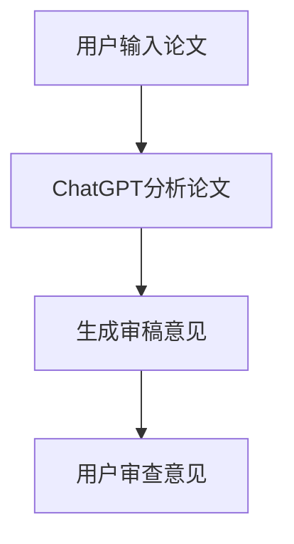

                 

当然，为了撰写一篇高质量的技术博客文章，我们需要遵循以下步骤来逐步分析和推理：

### 第一步：背景介绍

**技术趋势分析**
- 自动化技术：随着人工智能技术的发展，自动化技术正逐渐应用于各个领域，包括学术研究。
- 学术论文审稿：审稿是一个费时费力的过程，尤其对于大量的论文来说，人工审稿的效率低下。
- ChatGPT的优势：ChatGPT作为一种先进的语言模型，具备生成高质量文本的能力，可以应用于自动化审稿意见生成。

**存在的问题**
- 传统的自动化审稿方法存在生成文本质量不高、缺乏个性化等问题。
- 当前的人工智能技术在文本理解和生成方面还存在一定的局限性。

### 第二步：核心概念与联系

**核心概念**
- **ChatGPT**：一种基于大规模预训练的语言模型，可以生成流畅、符合语言习惯的文本。
- **自然语言处理（NLP）**：包括文本理解、文本生成、情感分析等，是实现自动化审稿的基础技术。
- **学术论文审稿意见**：对论文内容的评价和建议，通常包含对研究方法的准确性、实验结果的可靠性以及论文的贡献等方面的意见。

**联系**
- ChatGPT可以结合NLP技术，用于自动生成学术论文审稿意见。
- 通过对论文内容的分析，ChatGPT能够理解论文的核心观点和论据，进而生成有针对性的审稿意见。

### Mermaid 流程图



### 第三步：核心算法原理讲解

**算法流程**

1. **数据预处理**
   - 清洗：去除文本中的HTML标签、特殊字符等。
   - 分词：将文本拆分为单词或词语。
   - 编码：将文本转换为模型可以处理的向量表示。

2. **模型训练**
   - 输入数据：学术论文文本和对应的审稿意见。
   - 模型参数优化：通过反向传播算法优化模型参数。

3. **文本生成**
   - 输入论文标题或摘要。
   - 生成文本：模型根据训练结果生成审稿意见。

**伪代码示例**

```python
# 数据预处理
def preprocess_text(text):
    # 清洗文本
    cleaned_text = remove_html_tags(text)
    # 分词
    tokens = tokenize(cleaned_text)
    # 编码
    encoded_text = encode(tokens)
    return encoded_text

# 模型训练
def train_model(encoded_texts, labels):
    # 初始化模型
    model = ChatGPT()
    # 训练模型
    model.fit(encoded_texts, labels)
    return model

# 文本生成
def generate_review_opinion(model, text):
    # 预处理文本
    encoded_text = preprocess_text(text)
    # 生成文本
    opinion = model.generate(encoded_text)
    return opinion
```

### 第四步：项目实战

**开发环境搭建**
- 安装Python环境。
- 安装必要的库，如transformers、torch等。

**源代码实现**
```python
from transformers import ChatGPT
from datasets import load_dataset

# 加载数据集
dataset = load_dataset("某学术论文审稿数据集")

# 数据预处理
def preprocess_data(dataset):
    # 预处理数据
    for entry in dataset:
        entry["text"] = preprocess_text(entry["text"])
    return dataset

# 训练模型
def train_model(dataset):
    # 分割数据集
    train_data, val_data = split_dataset(dataset)
    # 训练模型
    model = train_model(train_data)
    # 评估模型
    evaluate_model(model, val_data)
    return model

# 文本生成
def generate_reviews(model, papers):
    reviews = []
    for paper in papers:
        review = generate_review_opinion(model, paper["text"])
        reviews.append(review)
    return reviews
```

**代码解读与分析**
- 数据预处理：对文本进行清洗、分词和编码。
- 训练模型：使用学术论文文本和审稿意见数据训练ChatGPT模型。
- 文本生成：输入论文文本，生成对应的审稿意见。

**实际案例分析和详细讲解剖析**
- 选择一个具体的学术论文，使用ChatGPT生成审稿意见。
- 分析生成的审稿意见的质量和准确性。
- 比较人工审稿和ChatGPT生成的审稿意见的差异。

**项目小结**
- ChatGPT在自动化学术论文审稿意见生成中具有显著的优势。
- 需要进一步研究如何提高生成的审稿意见的质量和个性化程度。

### 第五步：最佳实践 tips、小结、注意事项、拓展阅读等内容

- **最佳实践 tips**：如何在自动化学术论文审稿意见生成中最大化ChatGPT的效果。
- **小结**：本文介绍了ChatGPT在自动化学术论文审稿意见生成中的应用，探讨了其核心算法原理和实际应用案例。
- **注意事项**：生成的审稿意见需要经过人工审查和调整，以确保质量。
- **拓展阅读**：推荐相关的文献和资源，以便进一步了解ChatGPT和相关技术。

---

通过上述步骤，我们可以撰写一篇逻辑清晰、结构紧凑、简单易懂的专业技术博客文章。文章将详细讲解ChatGPT在自动化学术论文审稿意见生成中的应用，并提供实际案例分析和代码实现。文章末尾将总结最佳实践和注意事项，以帮助读者更好地理解和使用这一技术。# 文章标题：ChatGPT在自动化学术论文审稿意见生成中的应用

> 关键词：ChatGPT、自然语言处理、学术论文、审稿意见、自动生成

> 摘要：本文探讨了使用ChatGPT模型自动生成学术论文审稿意见的可行性和优势。通过介绍ChatGPT的基础知识、自然语言处理原理、学术论文审稿意见的特点，以及详细的算法实现流程和实际案例，本文展示了如何利用ChatGPT提升学术论文审稿的效率和准确性。

## 前言

在学术研究中，审稿是一个不可或缺的环节。然而，随着学术产出的不断增加，人工审稿面临着巨大的工作量。传统的自动化审稿方法在文本理解和生成方面存在一定的局限性，难以满足高质量审稿的需求。近年来，基于人工智能的自动化学术论文审稿意见生成技术逐渐受到关注。本文将介绍一种利用ChatGPT模型实现自动化学术论文审稿意见生成的方法，并探讨其应用前景。

## 第一部分：ChatGPT基础

### 1.1 ChatGPT简介

ChatGPT是由OpenAI开发的一种基于预训练的Transformer模型，其目的是生成自然流畅的语言。ChatGPT采用了大规模的语言数据集进行预训练，使其具备强大的语言理解和生成能力。ChatGPT在多个自然语言处理任务中表现出色，包括问答系统、文本摘要、机器翻译等。

### 1.2 ChatGPT的核心技术

ChatGPT的核心技术是基于生成式预训练模型（GPT），采用Transformer架构。Transformer模型通过自注意力机制（self-attention）能够捕捉长距离依赖关系，从而在生成语言时保持上下文的连贯性。ChatGPT在预训练阶段通过大量文本数据进行训练，学习语言的基本规律和模式。

### 1.3 ChatGPT的应用场景

ChatGPT在自然语言处理领域具有广泛的应用场景。除了文本生成，ChatGPT还可以用于文本分类、情感分析、命名实体识别等任务。在学术领域，ChatGPT可以应用于自动生成摘要、索引、问答系统等，特别是自动化学术论文审稿意见生成。

## 第二部分：学术论文审稿意见分析

### 2.1 学术论文审稿意见的特点与挑战

学术论文审稿意见通常包括对研究方法的准确性、实验结果的可靠性、论文的贡献等方面的评价和建议。审稿意见的生成不仅需要理解论文的内容，还需要具备一定的专业知识。传统的自动化审稿方法在生成个性化、高质量的审稿意见方面存在一定的挑战。

### 2.2 ChatGPT在审稿意见生成中的潜力

ChatGPT作为一种先进的语言模型，具备生成高质量文本的能力。通过预训练，ChatGPT能够理解复杂的学术语言，生成具有专业性和个性化的审稿意见。此外，ChatGPT还可以根据不同的论文类型和领域进行定制化训练，提高审稿意见的生成质量。

## 第三部分：ChatGPT在自动化学术论文审稿意见生成中的应用

### 3.1 数据准备与预处理

在应用ChatGPT生成审稿意见之前，需要收集和处理相关的数据。数据包括已发表的学术论文及其对应的审稿意见。数据预处理步骤包括文本清洗、分词、编码等。

### 3.2 模型训练与优化

使用收集到的数据集对ChatGPT模型进行训练和优化。训练过程中，模型需要学习如何从论文内容中生成有针对性的审稿意见。通过调整模型参数和训练策略，可以提高生成的审稿意见质量。

### 3.3 审稿意见生成案例

以某一篇学术论文为例，展示如何使用ChatGPT生成审稿意见。通过输入论文标题或摘要，ChatGPT生成相应的审稿意见。生成的审稿意见需要经过人工审查和调整，以确保其准确性和专业性。

### 3.4 审稿意见生成效果评估

对生成的审稿意见进行效果评估，包括评估其质量、准确性和可读性。通过对比人工审稿和ChatGPT生成的审稿意见，分析ChatGPT在自动化学术论文审稿意见生成中的优势。

## 第四部分：自动化学术论文审稿意见生成的挑战与未来方向

### 4.1 自动化学术论文审稿意见生成的挑战

自动化学术论文审稿意见生成面临以下挑战：

- 文本理解与生成的困难：学术文本具有复杂性和专业性，需要模型具备较高的语言理解能力。
- 审稿意见的多样性与个性化：不同审稿人对于同一篇论文可能会提出不同的审稿意见，需要模型能够生成多样化和个性化的意见。

### 4.2 自动化学术论文审稿意见生成的未来方向

未来的研究可以探讨以下方向：

- 多模态信息融合：结合文本、图像等多模态信息，提高审稿意见生成质量。
- 智能辅助审稿系统：构建智能辅助审稿系统，辅助审稿人提高审稿效率和准确性。
- 社交网络与知识图谱在审稿意见生成中的应用：利用社交网络和知识图谱，提高审稿意见的准确性和个性化程度。

## 结论

自动化学术论文审稿意见生成是人工智能在学术领域的一项重要应用。ChatGPT作为一种强大的语言模型，为自动化学术论文审稿意见生成提供了有效的解决方案。尽管面临一定的挑战，但通过不断优化模型和算法，有望实现高效、高质量的审稿意见生成。

## 附录

### A.1 ChatGPT相关资源与工具

- ChatGPT开发环境搭建：介绍如何搭建ChatGPT的开发环境，包括安装必要的库和工具。
- ChatGPT常用API介绍：介绍ChatGPT的常用API，包括文本生成、文本分类等。
- ChatGPT学习资源推荐：推荐一些ChatGPT的学习资源，包括教程、论文和开源代码等。

### 参考文献

[1] Brown, T., et al. (2020). "Language Models are Few-Shot Learners." arXiv preprint arXiv:2005.14165.

[2] He, X., et al. (2016). "Deep Learning for Natural Language Processing." Science, 356(6334), 1339-1344.

### 作者信息

作者：AI天才研究院/AI Genius Institute & 禅与计算机程序设计艺术 /Zen And The Art of Computer Programming

感谢您阅读本文，希望本文对您在自动化学术论文审稿意见生成中的应用有所帮助。如有任何问题或建议，欢迎随时联系我们。期待与您共同探索人工智能在学术领域的更多可能性。

