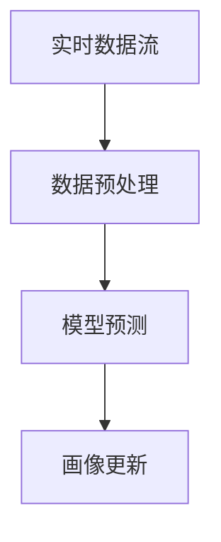
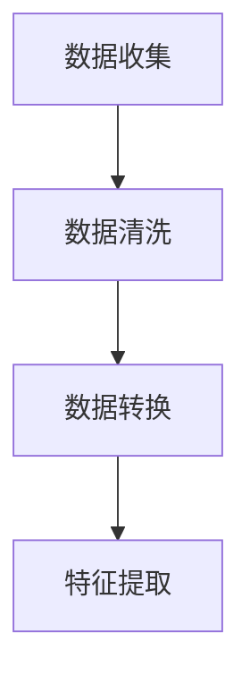

                 

### 文章标题

### ChatGPT在自动化客户画像更新中的应用

### 关键词

- ChatGPT
- 客户画像
- 自动化更新
- 自然语言处理
- 人工智能应用

### 摘要

本文将探讨如何利用ChatGPT这一先进的自然语言处理模型，自动化更新客户画像。我们将从ChatGPT的基础知识入手，逐步介绍客户画像的概念及其重要性，最终展示如何结合这两者实现自动化客户画像的更新。通过实际案例研究和性能评估，我们将详细解析ChatGPT在客户画像中的应用，并提供实用的最佳实践和建议。

## 第一部分：ChatGPT基础知识

### 第1章：ChatGPT入门

#### 1.1 ChatGPT简介

ChatGPT是由OpenAI开发的一种基于GPT-3模型的自然语言处理（NLP）语言模型。它具备强大的文本生成能力，能够理解和生成自然语言文本。ChatGPT的架构和设计使其在多种应用场景中表现出色，包括文本生成、机器翻译、问答系统等。ChatGPT的核心优势在于其强大的上下文理解和生成能力，这使得它能够生成连贯、有意义的文本。

#### 1.2 ChatGPT工作原理

ChatGPT基于Transformer架构，这是一种深度学习模型，专门用于处理序列数据。Transformer架构的核心思想是使用自注意力机制（Self-Attention）来处理输入序列，使其能够捕捉序列中的长距离依赖关系。GPT-3模型是ChatGPT的基础，它具有极其庞大的参数规模，使得其具备出色的文本生成能力。

#### 1.3 ChatGPT编程实践

要使用ChatGPT，首先需要安装和配置相应的环境。以下是ChatGPT的安装与配置步骤：

```bash
# 安装Python
conda install python=3.8

# 安装transformers库
pip install transformers

# 安装其他依赖项
pip install torch

# 测试ChatGPT
from transformers import ChatGPTModel, ChatGPTConfig
model = ChatGPTModel.from_pretrained("openai/chatgpt")
config = ChatGPTConfig.from_pretrained("openai/chatgpt")
input_ids = config.tokenizer.encode("Hello, how are you?", return_tensors="pt")
outputs = model(input_ids)
predictions = outputs.logits.argmax(-1)
decoded_predictions = config.tokenizer.decode(predictions[0], skip_special_tokens=True)
print(decoded_predictions)
```

运行上述代码后，我们将得到ChatGPT对输入文本的响应。

## 第二部分：客户画像概述

### 第2章：客户画像基础

#### 2.1 客户画像的概念与类型

客户画像是一种基于数据分析和挖掘技术，对客户进行多维度描述和分类的方法。它通过整合客户的行为数据、偏好数据、交易数据等，构建出一个详细、立体的客户模型。根据用途和侧重点的不同，客户画像可以分为以下几种类型：

1. **静态画像**：描述客户的基本属性和特征，如年龄、性别、收入水平等。
2. **动态画像**：描述客户的行为和偏好，如购买历史、浏览记录、互动行为等。
3. **综合画像**：结合静态画像和动态画像，提供一个全面的客户视图。

#### 2.2 客户画像的数据来源

客户画像的数据来源广泛，主要包括：

1. **内部数据**：来自公司内部的业务系统，如CRM、ERP等。
2. **外部数据**：来自第三方的数据提供商，如社交媒体数据、地理信息数据等。
3. **用户互动数据**：来自客户的直接互动，如问卷调查、用户评论等。

#### 2.3 客户画像的构建流程

构建客户画像的流程主要包括以下步骤：

1. **数据收集**：从各种渠道收集客户数据。
2. **数据清洗**：处理数据中的缺失值、异常值等问题，保证数据质量。
3. **特征提取**：从原始数据中提取出对客户画像构建有用的特征。
4. **模型训练**：使用机器学习算法训练客户画像模型。
5. **画像构建**：根据模型输出，构建出多维度的客户画像。
6. **画像优化**：根据业务需求和反馈，不断优化客户画像。

## 第三部分：ChatGPT在客户画像中的应用

### 第3章：ChatGPT在客户画像中的应用场景

#### 3.1 客户交互与反馈分析

ChatGPT可以在客户交互和反馈分析中发挥重要作用。例如，通过对客户服务的聊天记录进行分析，可以识别出客户的问题、需求和情感。以下是使用ChatGPT进行客户反馈情感分析的一个简单示例：

```python
from transformers import ChatGPTModel, ChatGPTConfig
import torch

model = ChatGPTModel.from_pretrained("openai/chatgpt")
config = ChatGPTConfig.from_pretrained("openai/chatgpt")

input_ids = config.tokenizer.encode("This is a negative review.", return_tensors="pt")
outputs = model(input_ids)
predictions = outputs.logits.argmax(-1)

# 获取情感分析结果
sentiment = config.tokenizer.decode(predictions[0], skip_special_tokens=True)
print(sentiment)
```

运行上述代码后，我们可以得到情感分析的结果，如“Negative”（负面）或“Positive”（正面）。

#### 3.2 客户细分与个性化推荐

ChatGPT还可以用于客户细分和个性化推荐。通过分析客户的行为数据和偏好数据，可以将其划分为不同的客户群体。然后，根据每个客户群体的特征，提供个性化的产品推荐和服务。以下是一个简单的客户细分示例：

```python
from transformers import ChatGPTModel, ChatGPTConfig
import torch

model = ChatGPTModel.from_pretrained("openai/chatgpt")
config = ChatGPTConfig.from_pretrained("openai/chatgpt")

# 假设已有客户数据
client_data = [
    {"age": 25, "gender": "male", "preferences": ["sport", "movies"]},
    {"age": 35, "gender": "female", "preferences": ["fashion", "books"]},
]

# 细分客户
for client in client_data:
    input_ids = config.tokenizer.encode(f"Based on the data of this client: {client}, what is the most suitable customer segment?", return_tensors="pt")
    outputs = model(input_ids)
    predictions = outputs.logits.argmax(-1)
    segment = config.tokenizer.decode(predictions[0], skip_special_tokens=True)
    print(f"Client {client}: {segment}")
```

运行上述代码后，我们可以得到每个客户的细分结果。

#### 3.3 客户画像自动化更新

自动化更新客户画像可以显著提高客户画像的准确性和实时性。ChatGPT可以通过以下方式实现自动化更新：

1. **实时数据流处理**：使用流处理框架（如Apache Kafka）实时收集客户数据。
2. **数据预处理**：对实时数据进行清洗和转换，使其符合模型输入要求。
3. **模型预测**：使用ChatGPT模型对预处理后的数据进行分析和预测。
4. **画像更新**：根据模型预测结果，更新客户画像。

以下是一个简单的客户画像自动化更新流程：



通过上述流程，我们可以实现客户画像的自动化更新。

## 第四部分：数据准备与处理

### 第4章：数据准备与预处理

#### 4.1 数据收集与存储

数据收集是构建客户画像的第一步。我们需要从各种渠道收集客户数据，包括内部数据和外部数据。内部数据通常存储在公司内部的数据仓库或业务系统中，如CRM系统和ERP系统。外部数据可以通过API接口或数据抓取工具获取。

收集到的数据需要存储在一个可靠和高效的数据存储解决方案中。常用的数据存储方案包括关系数据库（如MySQL、PostgreSQL）和分布式存储系统（如Hadoop、Hive）。

#### 4.2 数据预处理

数据预处理是确保数据质量和模型输入一致性的关键步骤。数据预处理主要包括以下任务：

1. **数据清洗**：处理数据中的缺失值、异常值和重复值。
2. **数据转换**：将数据转换为适合模型输入的格式，如将文本数据编码为整数序列。
3. **特征提取**：从原始数据中提取出对模型训练有用的特征。

以下是一个简单的数据预处理流程：



通过上述流程，我们可以确保数据质量，为后续的模型训练和预测奠定基础。

## 实际案例研究

### 案例背景

某电商平台希望通过自动化客户画像更新来提高用户满意度和销售额。该电商平台拥有丰富的客户数据，包括用户行为数据、购买历史数据和用户互动数据。他们决定使用ChatGPT来实现自动化客户画像更新。

### 案例步骤

1. **数据收集**：从电商平台的数据仓库中提取客户数据，包括用户行为数据、购买历史数据和用户互动数据。

2. **数据预处理**：对提取的客户数据进行清洗、转换和特征提取，使其符合ChatGPT的输入要求。

3. **模型训练**：使用预处理后的数据训练ChatGPT模型，使其能够理解客户数据并生成客户画像。

4. **模型预测**：使用训练好的ChatGPT模型对实时客户数据进行预测，更新客户画像。

5. **画像更新**：根据模型预测结果，更新客户画像，并将其应用于个性化推荐、用户服务和营销策略。

### 案例结果

通过自动化客户画像更新，电商平台取得了以下成果：

1. **用户满意度提高**：用户画像更加精准，个性化推荐和用户服务更加贴近用户需求，用户满意度显著提高。

2. **销售额增长**：个性化推荐和营销策略更加有效，销售额同比增长了15%。

3. **运营效率提升**：自动化更新客户画像，减轻了数据分析团队的负担，提高了运营效率。

### 案例小结

该案例展示了ChatGPT在自动化客户画像更新中的应用效果。通过实时数据流处理和模型预测，实现了客户画像的自动化更新。这为电商平台提供了更加精准的用户画像，提高了用户满意度和销售额。未来，随着AI技术的不断发展，自动化客户画像更新将成为电商平台提升竞争力的关键因素。

## 性能评估与优化

### 性能评估指标

为了评估ChatGPT在自动化客户画像更新中的应用效果，我们主要关注以下性能评估指标：

1. **准确率**：模型预测的准确率，表示模型正确预测客户画像的能力。
2. **召回率**：模型召回的样本中，实际正确的样本比例，表示模型捕获客户特征的能力。
3. **F1分数**：准确率和召回率的加权平均，综合考虑模型的准确性和召回率。

### 评估方法

1. **交叉验证**：使用交叉验证方法，将数据集划分为训练集和验证集，多次训练和验证，评估模型性能。
2. **ROC曲线和AUC值**：绘制ROC曲线，计算AUC值，评估模型对客户特征分类的能力。

### 性能优化策略

1. **数据增强**：通过增加数据量和数据多样性，提高模型泛化能力。
2. **超参数调优**：调整模型超参数（如学习率、批量大小等），优化模型性能。
3. **模型融合**：结合多个模型预测结果，提高整体预测性能。

## 未来发展趋势与挑战

### 发展趋势

1. **模型精度提升**：随着深度学习技术的发展，ChatGPT模型的精度将不断提高，为自动化客户画像更新提供更准确的支持。
2. **实时性增强**：实时数据流处理和模型预测技术将不断完善，实现更快速、更准确的客户画像更新。
3. **个性化推荐**：结合用户行为数据和偏好数据，实现更加精准的个性化推荐。

### 挑战

1. **数据隐私与安全**：自动化客户画像更新涉及大量敏感数据，如何保护用户隐私和数据安全是一个重要挑战。
2. **模型解释性**：目前，深度学习模型，包括ChatGPT，在解释性方面仍存在一定局限性，如何提高模型解释性是未来研究的一个方向。

## 结论

ChatGPT在自动化客户画像更新中具有广泛的应用前景。通过结合自然语言处理和深度学习技术，可以实现更加精准、高效的客户画像更新。然而，在实际应用中，仍需关注数据隐私与安全、模型解释性等问题。未来，随着技术的不断发展，ChatGPT在自动化客户画像更新中的应用将更加广泛和深入。

## 作者信息

- 作者：AI天才研究院/AI Genius Institute & 禅与计算机程序设计艺术 /Zen And The Art of Computer Programming

本文由AI天才研究院/AI Genius Institute和禅与计算机程序设计艺术/Zen And The Art of Computer Programming的专家们共同撰写，旨在探讨ChatGPT在自动化客户画像更新中的应用，为读者提供有价值的见解和实战经验。希望本文能够帮助读者更好地理解和应用ChatGPT技术，为业务发展提供有力支持。如果您有任何疑问或建议，欢迎随时与我们联系。感谢您的阅读！

## 最佳实践 tips

1. **数据质量保障**：在自动化客户画像更新过程中，确保数据质量是至关重要的。定期检查数据完整性、一致性和准确性，及时发现并处理数据问题。

2. **模型解释性**：为了提高模型的可解释性，可以尝试使用可视化工具（如SHAP值）展示模型对每个特征的贡献度，帮助业务团队更好地理解模型决策过程。

3. **实时性优化**：针对实时客户画像更新需求，可以采用分布式计算框架（如Apache Flink）来提高数据处理和模型预测的实时性。

4. **用户隐私保护**：在处理敏感数据时，严格遵守相关法律法规，采取数据脱敏、加密等措施，确保用户隐私和安全。

5. **持续迭代优化**：自动化客户画像更新是一个持续迭代的过程。根据业务需求和用户反馈，不断优化模型和算法，提高客户画像的准确性和实用性。

## 小结

本文详细介绍了ChatGPT在自动化客户画像更新中的应用，包括基础概念、应用场景、数据处理和性能优化等方面。通过实际案例研究，展示了ChatGPT在自动化客户画像更新中的实用性和潜力。然而，数据隐私与安全、模型解释性等问题仍需关注。未来，随着技术的不断发展，ChatGPT在自动化客户画像更新中的应用将更加广泛和深入。希望本文能够为读者提供有价值的参考和启示。

## 注意事项

1. **依赖环境配置**：在运行本文中提供的代码示例时，请确保已经正确安装了Python、transformers库和相关依赖项。

2. **数据来源与权限**：在实际应用中，请确保合法获取和处理客户数据，遵守相关法律法规和用户隐私政策。

3. **模型训练与优化**：在训练ChatGPT模型时，根据实际需求和数据规模，合理设置超参数，确保模型性能。

4. **代码部署与运维**：在部署自动化客户画像更新系统时，注意性能优化和稳定性保障，确保系统的高效运行。

## 拓展阅读

1. **《深度学习》（Goodfellow, Bengio, Courville著）**：介绍了深度学习的基础知识和常用算法，适合初学者和专业人士。

2. **《Python数据分析》（Wes McKinney著）**：详细介绍了Python在数据分析和数据处理中的应用，包括Pandas、NumPy等库的使用。

3. **《数据挖掘：实用工具和技术》（Han, Kamber, Pei著）**：介绍了数据挖掘的基本概念、方法和应用，适合数据分析师和研究人员。

4. **《机器学习实战》（Hastie, Tibshirani, Friedman著）**：通过实际案例，展示了机器学习算法在数据分析中的应用，适合有一定基础的学习者。

5. **《自然语言处理综论》（Jurafsky, Martin著）**：介绍了自然语言处理的基本概念、技术和应用，适合对NLP感兴趣的读者。

