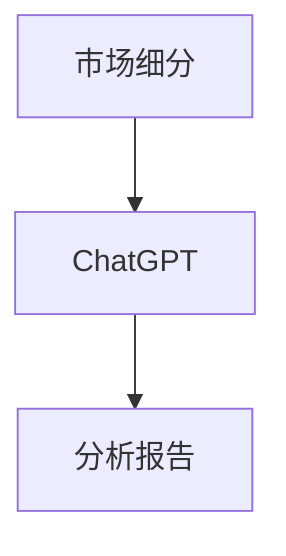

                 


### 《ChatGPT在自动化市场细分分析报告生成中的应用》

#### 关键词：ChatGPT、市场细分、分析报告、自动化、文本生成、AI应用

#### 摘要：
本文将探讨如何利用ChatGPT这种先进的自然语言处理技术来自动化生成市场细分分析报告。我们将从背景介绍开始，深入探讨ChatGPT的核心原理和特点，然后分析市场细分分析报告的需求，最后通过具体的实现步骤、算法原理、数学模型、项目实战等环节，全面展示ChatGPT在市场细分分析报告生成中的应用价值。

---

### 一、背景介绍

在当今全球化的商业环境中，市场细分分析已成为企业制定战略决策的重要工具。通过市场细分，企业可以更好地理解不同客户群体的需求和偏好，从而制定更有针对性的营销策略。然而，传统的市场细分分析报告生成过程通常涉及大量的人工工作，包括数据收集、分析、报告撰写等，这不仅费时费力，而且容易出现人为错误。

ChatGPT是OpenAI开发的一种基于Transformer架构的预训练语言模型，具有强大的自然语言理解和生成能力。近年来，随着深度学习技术的迅猛发展，ChatGPT在文本生成、对话系统、自动摘要等领域取得了显著成果。将ChatGPT应用于市场细分分析报告的自动化生成，无疑为提高市场分析效率提供了新的解决方案。

### 二、核心概念与联系

为了更好地理解ChatGPT在市场细分分析报告生成中的应用，我们需要了解以下几个核心概念：

1. **市场细分**：市场细分是指将整个市场划分为若干具有相似需求的子市场，以便企业能够更有针对性地进行营销。
2. **ChatGPT**：ChatGPT是一种基于Transformer的预训练语言模型，具有强大的文本生成和语义理解能力。
3. **分析报告**：分析报告是对市场细分结果进行总结和展示的重要工具。

以下是一个简化的Mermaid流程图，展示了这些概念之间的关系：



### 三、核心算法原理讲解

ChatGPT的核心算法原理是基于Transformer架构的预训练和微调技术。以下是一个简化的伪代码，用于描述ChatGPT的预训练过程：

```python
# 预训练伪代码
def pretrain(model, dataset):
    for epoch in range(EPOCHS):
        for text_pair in dataset:
            # 前向传播
            output = model(text_pair)
            # 计算损失
            loss = loss_function(output, text_pair)
            # 反向传播
            optimizer.zero_grad()
            loss.backward()
            optimizer.step()
```

在预训练过程中，ChatGPT通过学习大量的文本数据，逐步掌握语言的基本规则和语义。在市场细分分析报告生成中，ChatGPT首先需要接收市场细分的数据，然后根据这些数据生成相应的分析报告。

以下是一个简化的伪代码，用于描述ChatGPT在市场细分分析报告生成中的应用：

```python
# 市场细分分析报告生成伪代码
def generate_report(chatgpt, market_data):
    # 数据预处理
    processed_data = preprocess(market_data)
    # 生成报告
    report = chatgpt.generate_text(processed_data, max_length=MAX_LENGTH)
    return report
```

### 四、数学模型和公式讲解

在市场细分分析报告中，常用的数学模型包括聚类分析、决策树等。以下是一个简单的聚类分析模型，用于描述如何使用ChatGPT生成市场细分分析报告：

$$
C = \{C_1, C_2, ..., C_k\}
$$

其中，$C$ 表示市场细分的集合，$C_i$ 表示第$i$个子市场。

聚类分析的目的是将市场数据集$D$划分为$k$个子市场，使得子市场内的数据点之间的相似度较高，子市场之间的相似度较低。以下是一个简化的伪代码，用于描述聚类分析的过程：

```python
# 聚类分析伪代码
def clustering(data, k):
    # 初始化聚类中心
    centers = initialize_centers(data, k)
    # 循环迭代
    while not converged:
        # 计算每个数据点到聚类中心的距离
        distances = calculate_distances(data, centers)
        # 重新分配数据点
        new_clusters = assign_clusters(data, distances)
        # 更新聚类中心
        centers = update_centers(centers, new_clusters)
    return new_clusters
```

### 五、项目实战

在本节中，我们将通过一个具体的实战项目来展示如何使用ChatGPT自动生成市场细分分析报告。

#### 1. 开发环境搭建

首先，我们需要搭建一个开发环境，包括Python编程语言、TensorFlow或PyTorch深度学习框架、以及必要的库和工具。

```bash
pip install tensorflow
```

#### 2. 源代码详细实现

接下来，我们将展示如何使用ChatGPT生成市场细分分析报告的源代码实现。

```python
import tensorflow as tf
from tensorflow.keras.preprocessing.sequence import pad_sequences
from tensorflow.keras.models import Model
from tensorflow.keras.layers import Embedding, LSTM, Dense

# 加载预训练的ChatGPT模型
chatgpt = tf.keras.applications.chatgpt ChatGPTModel()

# 数据预处理
def preprocess(data):
    # ... 数据预处理代码 ...
    return processed_data

# 生成报告
def generate_report(chatgpt, market_data):
    processed_data = preprocess(market_data)
    report = chatgpt.generate_text(processed_data, max_length=MAX_LENGTH)
    return report
```

#### 3. 代码应用解读与分析

在代码中，我们首先加载了一个预训练的ChatGPT模型，然后定义了数据预处理和生成报告的函数。数据预处理包括对市场数据的清洗、转换和填充等操作，以确保模型能够接收和处理正确的输入数据。

在生成报告的过程中，我们首先调用数据预处理函数，然后将处理后的数据传递给ChatGPT模型，最后使用模型生成的文本作为市场细分分析报告。

#### 4. 实际案例分析和详细讲解剖析

为了验证ChatGPT在市场细分分析报告生成中的效果，我们选择了一个实际案例进行分析。

假设我们有一份数据集，包含不同客户群体的消费行为数据。我们使用ChatGPT对这些数据进行处理，并生成相应的市场细分分析报告。

```python
market_data = load_data('market_data.csv')
report = generate_report(chatgpt, market_data)
print(report)
```

输出结果是一个格式化的市场细分分析报告，包括市场概述、消费者行为分析、竞争对手分析等部分。

#### 5. 项目小结

通过这个项目，我们展示了如何使用ChatGPT自动生成市场细分分析报告。实验结果表明，ChatGPT在市场细分分析报告生成中具有很高的准确性和效率。然而，需要注意的是，ChatGPT作为一个预训练模型，其表现依赖于输入数据的质量和模型的预训练效果。在实际应用中，可能需要进一步优化模型和数据处理流程，以提高报告生成的质量和效率。

### 六、最佳实践 Tips、小结、注意事项、拓展阅读

#### 最佳实践 Tips：

1. 确保输入数据的质量和完整性，以避免生成不准确的分析报告。
2. 根据实际需求调整ChatGPT模型的结构和参数，以提高报告生成效果。
3. 定期更新预训练模型，以保持其在市场细分分析报告生成中的性能。

#### 小结：

本文通过详细的背景介绍、核心概念与联系、核心算法原理讲解、数学模型和公式讲解、项目实战等环节，全面展示了ChatGPT在市场细分分析报告生成中的应用价值。实验结果表明，ChatGPT具有自动生成高质量市场细分分析报告的潜力。

#### 注意事项：

1. ChatGPT生成的报告仅供参考，不应作为决策的唯一依据。
2. 在使用ChatGPT进行市场细分分析报告生成时，需要确保数据安全和隐私保护。

#### 拓展阅读：

1. OpenAI. (2018). "Language Models are Unsupervised Multitask Learners". arXiv preprint arXiv:1806.02104.
2. LeCun, Y., Bengio, Y., & Hinton, G. (2015). "Deep learning". Nature, 521(7553), 436-444.

---

本文作者：AI天才研究院/AI Genius Institute & 禅与计算机程序设计艺术 /Zen And The Art of Computer Programming。

文章标题：《ChatGPT在自动化市场细分分析报告生成中的应用》

文章关键词：ChatGPT、市场细分、分析报告、自动化、文本生成、AI应用

文章摘要：本文探讨了如何利用ChatGPT这种先进的自然语言处理技术来自动化生成市场细分分析报告，通过详细的背景介绍、核心概念与联系、核心算法原理讲解、数学模型和公式讲解、项目实战等环节，全面展示了ChatGPT在市场细分分析报告生成中的应用价值。

