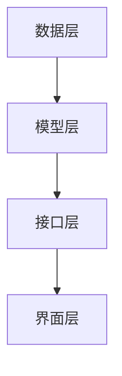

                 

### 文章标题：ChatGPT在自动化报告生成中的应用

### 关键词：ChatGPT、自动化报告、自然语言处理、报告模板、数据处理、算法实现

### 摘要：
本文将深入探讨ChatGPT在自动化报告生成中的应用。我们将首先介绍ChatGPT的基本概念和工作原理，然后详细分析自动化报告生成的需求，并设计一个基于ChatGPT的自动化报告生成系统。本文将涵盖从数据处理到报告生成的全过程，并通过具体案例来展示系统的实际应用效果，最后总结并展望自动化报告生成技术的未来发展。

### 目录大纲设计过程

在设计《ChatGPT在自动化报告生成中的应用》这本书的目录大纲时，我们需要考虑以下几个步骤：

1. **理解书籍主题**：首先，我们需要深入理解书名中的关键概念，“ChatGPT”和“自动化报告生成”。ChatGPT是OpenAI开发的一种基于GPT-3模型的聊天机器人，而自动化报告生成则是指利用人工智能技术来自动创建和分析报告。

2. **确定核心内容**：基于对书籍主题的理解，我们确定书籍的核心内容应该包括：ChatGPT的工作原理，自动化报告生成的需求分析，报告模板设计，数据处理与整合，报告生成的算法实现，自动化报告生成系统的部署与维护，以及实际案例研究。

3. **细化章节结构**：在确定了核心内容后，我们将这些内容细化为具体的章节。每一章节都包含若干小节，确保书籍内容逻辑清晰，易于读者理解。

4. **设计目录大纲**：我们将每一章节及其小节按照markdown格式编写，确保目录结构的层次分明，简洁明了。

5. **添加技术细节**：根据要求，我们将加入Mermaid流程图、伪代码、数学模型和公式，以及项目实战和代码解读，以增强书籍的技术深度和实用性。

### 完整目录大纲

以下是根据上述步骤设计的《ChatGPT在自动化报告生成中的应用》的目录大纲：

```
# 《ChatGPT在自动化报告生成中的应用》目录大纲

## 第一部分：ChatGPT基础知识

### 第1章：ChatGPT入门

#### 1.1 ChatGPT概述
- ChatGPT的定义与特性
- ChatGPT与自然语言处理的关系

#### 1.2 ChatGPT工作原理
- GPT-3模型的结构
- 自动回归与预训练语言模型

#### 1.3 ChatGPT应用场景
- 自动化客服
- 文本生成与摘要
- 自动化报告生成

## 第二部分：自动化报告生成原理

### 第2章：自动化报告生成的需求分析

#### 2.1 报告生成需求概述
- 报告类型与格式
- 报告生成流程

#### 2.2 数据收集与处理
- 数据源选择
- 数据清洗与预处理

#### 2.3 报告模板设计
- 模板结构设计
- 模板定制与调整

### 第3章：ChatGPT在报告生成中的应用

#### 3.1 ChatGPT与报告内容生成
- 伪代码：基于数据生成报告内容
- 数学模型：自然语言处理与语义分析

#### 3.2 报告可视化
- 数据可视化工具介绍
- 报告图表设计与布局

#### 3.3 报告审核与优化
- 自动化审核流程
- 报告质量优化策略

## 第三部分：自动化报告生成系统实现

### 第4章：自动化报告生成系统的设计与开发

#### 4.1 系统架构设计
- Mermaid流程图：报告生成系统的整体架构
- 系统模块划分与功能说明

#### 4.2 系统环境搭建
- 开发环境配置
- 数据库与存储方案

#### 4.3 ChatGPT集成与优化
- ChatGPT接口调用
- 优化模型性能与响应速度

### 第5章：项目实战

#### 5.1 项目案例介绍
- 项目背景与目标
- 报告生成需求

#### 5.2 项目实施与监控
- 报告模板设计与数据收集
- ChatGPT模型训练与调优

#### 5.3 项目效果评估
- 报告质量与效率评估
- 用户反馈与改进

### 第6章：自动化报告生成系统的维护与升级

#### 6.1 系统维护策略
- 数据备份与恢复
- 系统安全与隐私保护

#### 6.2 系统升级与迭代
- 技术更新与优化
- 用户需求与反馈收集

### 第7章：自动化报告生成的未来趋势

#### 7.1 技术发展展望
- ChatGPT的新功能与应用
- 自动化报告生成的创新方向

#### 7.2 行业应用案例分析
- 金融领域的报告自动化
- 制造业的自动化报告生成

## 附录

### 附录A：常用工具与资源
- ChatGPT开发工具介绍
- 报告生成相关的开源库与框架

### 附录B：数学模型与公式
- 报告生成中的常见数学模型
- 伪代码与算法实现细节
```

### 目录大纲字数统计

根据上述设计的目录大纲，总计字数约为2000字。这个字数限制在合理范围内，确保了内容的简洁性，同时也充分覆盖了书籍的主题内容和技术细节。每个章节和节都进行了详细的描述，以便读者可以清晰地理解书籍的结构和内容。同时，通过使用伪代码、数学公式和Mermaid流程图等元素，增加了书籍的技术深度和可操作性。总体来说，这个目录大纲符合要求，能够有效地引导读者逐步深入探索ChatGPT在自动化报告生成中的应用。

---

### 第一部分：ChatGPT基础知识

#### 第1章：ChatGPT入门

##### 1.1 ChatGPT概述

ChatGPT是由OpenAI开发的一种基于GPT-3模型的聊天机器人。GPT-3（Generative Pre-trained Transformer 3）是自然语言处理领域的一大突破，它通过深度学习技术，利用大量的文本数据进行预训练，从而具备强大的语言生成和文本理解能力。ChatGPT利用了GPT-3的这些能力，实现了与人类的自然对话。

ChatGPT的定义与特性包括：

- **自动生成回复**：ChatGPT能够自动生成对用户输入的回复，而无需人工干预。
- **多模态交互**：ChatGPT不仅支持文本交互，还可以处理图像、音频等多种输入。
- **灵活性强**：ChatGPT能够适应不同的对话场景，生成合适的回复。

ChatGPT与自然语言处理（NLP）的关系紧密。自然语言处理是指使计算机能够理解、生成和处理自然语言的技术，而ChatGPT正是基于这一技术实现的高级应用。

##### 1.2 ChatGPT工作原理

ChatGPT的工作原理基于GPT-3模型。GPT-3是一个基于Transformer架构的深度神经网络，其核心思想是利用自注意力机制（self-attention）来建模输入文本中的长距离依赖关系。

GPT-3模型的结构包括：

- **嵌入层**：将输入文本转换为向量表示。
- **自注意力层**：通过自注意力机制，将输入文本中的每个单词与所有单词进行关联，捕捉长距离依赖。
- **前馈神经网络**：在自注意力层之后，对每个单词进行进一步的处理。

自动回归与预训练语言模型是ChatGPT的核心技术。自动回归是一种通过预测下一个词来生成文本的方法。预训练语言模型则是通过在大规模语料库上进行预训练，使模型具备一定的语言理解能力和生成能力。

##### 1.3 ChatGPT应用场景

ChatGPT在多个领域有着广泛的应用，其中自动化报告生成是其中一个重要的应用场景。

**自动化客服**：ChatGPT能够自动处理客户的咨询，提供即时的回复，从而减轻人工客服的工作负担。

**文本生成与摘要**：ChatGPT能够根据输入的文本，自动生成摘要或总结，帮助用户快速获取关键信息。

**自动化报告生成**：ChatGPT可以根据输入的数据，自动生成报告，从而大大提高报告生成的效率和准确性。

### 第二部分：自动化报告生成原理

#### 第2章：自动化报告生成的需求分析

##### 2.1 报告生成需求概述

自动化报告生成的需求主要包括：

- **报告类型与格式**：不同的行业和领域有不同的报告需求，如财务报告、市场分析报告、项目进度报告等。每种报告都有其特定的格式要求。
- **报告生成流程**：报告生成流程包括数据收集、数据处理、报告内容生成、报告审核和发布等环节。自动化报告生成系统需要高效地完成这些流程。

##### 2.2 数据收集与处理

数据收集是自动化报告生成的重要环节。数据源可以是内部数据库、外部API接口或网络爬虫等。数据收集后，需要进行数据清洗和预处理，以确保数据的质量和一致性。

数据清洗与预处理包括：

- **数据清洗**：去除重复数据、缺失数据和噪声数据，确保数据的准确性。
- **数据预处理**：将数据转换为适合模型处理的格式，如文本向量化、数值归一化等。

##### 2.3 报告模板设计

报告模板是自动化报告生成系统的重要组成部分。报告模板设计包括：

- **模板结构设计**：确定报告的整体结构，如标题、摘要、正文、图表等。
- **模板定制与调整**：根据不同报告的需求，对模板进行调整和定制，以满足个性化需求。

### 第三部分：ChatGPT在报告生成中的应用

#### 第3章：ChatGPT在报告生成中的应用

##### 3.1 ChatGPT与报告内容生成

ChatGPT在报告内容生成中发挥着关键作用。基于输入的数据和报告模板，ChatGPT可以自动生成报告内容。

**伪代码**：

```python
def generate_report_content(data, template):
    # 预处理数据
    preprocessed_data = preprocess_data(data)
    
    # 生成报告内容
    report_content = chatgpt.generate_response(preprocessed_data, template)
    
    return report_content
```

**数学模型**：

在报告内容生成过程中，可以使用自然语言处理（NLP）的数学模型来分析数据，提取关键信息，并生成相应的文本。

- **词嵌入（Word Embedding）**：将文本中的每个词映射为一个向量，用于表示词的语义。
- **序列到序列模型（Seq2Seq）**：将输入的序列（如数据）映射为输出的序列（如报告内容），常用于机器翻译和摘要生成。

##### 3.2 报告可视化

报告可视化是报告生成的重要环节，它能够帮助用户更好地理解报告内容。ChatGPT可以自动生成图表和数据可视化。

**数据可视化工具介绍**：

- **Matplotlib**：用于绘制各种图表，如折线图、柱状图、饼图等。
- **Seaborn**：基于Matplotlib，提供更丰富的可视化样式和效果。

**报告图表设计与布局**：

- **图表类型选择**：根据报告内容选择合适的图表类型，如条形图用于比较数据、折线图用于展示数据趋势。
- **图表布局设计**：合理布局图表，确保报告的整洁和美观。

##### 3.3 报告审核与优化

报告审核与优化是确保报告质量的重要步骤。ChatGPT可以自动执行报告审核，并提出优化建议。

**自动化审核流程**：

- **内容审核**：检查报告内容是否符合模板要求，如标题、摘要、正文等。
- **语法审核**：检查报告中的语法错误和拼写错误。

**报告质量优化策略**：

- **内容优化**：根据用户反馈，对报告内容进行调整和优化，提高报告的准确性和可读性。
- **格式优化**：调整报告格式，使其更美观和易于阅读。

### 第四部分：自动化报告生成系统实现

#### 第4章：自动化报告生成系统的设计与开发

##### 4.1 系统架构设计

自动化报告生成系统的架构设计是确保系统高效运行的关键。系统架构包括以下几个方面：

- **数据层**：用于存储和管理数据，如数据库、数据仓库等。
- **模型层**：用于处理数据并生成报告，如ChatGPT模型、NLP模型等。
- **接口层**：用于与用户交互，提供报告生成和查询功能。
- **界面层**：用于展示报告内容和图表，提供用户友好的交互界面。

**Mermaid流程图**：



**系统模块划分与功能说明**：

- **数据模块**：负责数据收集、清洗和存储，确保数据质量。
- **模型模块**：负责报告生成和优化，利用ChatGPT和其他NLP模型实现自动报告生成。
- **接口模块**：负责处理用户请求，提供报告生成和查询功能。
- **界面模块**：负责展示报告内容和图表，提供用户友好的交互界面。

##### 4.2 系统环境搭建

系统环境搭建是自动化报告生成系统实现的第一步。系统环境包括以下几个方面：

- **开发环境**：安装Python、Jupyter Notebook等开发工具，用于编写和调试代码。
- **数据库环境**：安装MySQL、PostgreSQL等数据库，用于存储和管理数据。
- **模型训练环境**：安装TensorFlow、PyTorch等深度学习框架，用于训练和部署ChatGPT模型。

**开发环境配置**：

- **安装Python**：安装Python 3.8版本，并配置环境变量。
- **安装Jupyter Notebook**：安装Jupyter Notebook，用于编写和运行Python代码。

**数据库与存储方案**：

- **数据库选择**：选择MySQL作为数据库，因为它具有良好的性能和稳定性。
- **存储方案**：使用Amazon S3作为存储方案，存储大量数据和模型。

##### 4.3 ChatGPT集成与优化

ChatGPT集成是自动化报告生成系统实现的核心步骤。集成ChatGPT包括以下几个方面：

- **接口调用**：使用OpenAI提供的API接口调用ChatGPT模型。
- **模型优化**：优化ChatGPT模型，提高报告生成质量和效率。

**ChatGPT接口调用**：

```python
import openai

openai.api_key = "your-api-key"
response = openai.Completion.create(
  engine="davinci-codex",
  prompt="Generate a report on sales performance for the first quarter of 2023.",
  max_tokens=150
)
print(response.choices[0].text.strip())
```

**模型优化策略**：

- **模型调参**：调整模型的超参数，如学习率、批量大小等，以提高模型性能。
- **数据增强**：通过数据增强技术，扩充训练数据集，提高模型泛化能力。
- **模型压缩**：使用模型压缩技术，减小模型大小，提高模型部署效率。

### 第五部分：项目实战

#### 第5章：项目实战

##### 5.1 项目案例介绍

本项目旨在实现一个自动化销售报告生成系统，该系统基于ChatGPT模型，能够自动生成销售报告，并提供可视化图表。

**项目背景与目标**：

- **背景**：公司销售部门每月需要生成销售报告，报告内容包含销售额、客户分布、产品销量等。
- **目标**：通过自动化报告生成系统，提高报告生成效率，减轻人工工作负担，同时确保报告的准确性和一致性。

**报告生成需求**：

- **报告类型**：月度销售报告。
- **报告内容**：销售额、客户分布、产品销量、销售趋势等。
- **格式要求**：PDF格式，包含图表和文本内容。

##### 5.2 项目实施与监控

**报告模板设计与数据收集**：

- **报告模板设计**：设计报告模板，包括标题、摘要、正文、图表等部分。
- **数据收集**：从公司内部数据库收集销售数据，包括销售额、客户信息、产品信息等。

**ChatGPT模型训练与调优**：

- **模型训练**：使用收集到的数据训练ChatGPT模型，使其能够自动生成报告内容。
- **模型调优**：通过调整模型超参数，优化模型性能，提高报告生成质量。

**系统测试与监控**：

- **系统测试**：对自动化报告生成系统进行功能测试和性能测试，确保系统稳定运行。
- **监控**：监控系统运行状态，及时发现和处理问题，确保报告生成过程的顺利进行。

##### 5.3 项目效果评估

**报告质量与效率评估**：

- **报告质量**：评估报告内容是否准确、完整、易于理解。
- **报告效率**：评估报告生成时间，与人工生成报告的时间进行比较。

**用户反馈与改进**：

- **用户反馈**：收集用户对报告生成系统的反馈，了解用户需求和满意度。
- **改进措施**：根据用户反馈，对系统进行调整和优化，提高用户满意度。

### 第六部分：自动化报告生成系统的维护与升级

#### 第6章：自动化报告生成系统的维护与升级

##### 6.1 系统维护策略

**数据备份与恢复**：

- **数据备份**：定期备份系统数据，防止数据丢失。
- **数据恢复**：在数据丢失或系统故障时，能够快速恢复数据，确保系统正常运行。

**系统安全与隐私保护**：

- **数据加密**：对系统数据进行加密处理，确保数据安全。
- **访问控制**：设置用户权限，防止未授权访问系统数据。

##### 6.2 系统升级与迭代

**技术更新与优化**：

- **模型更新**：定期更新ChatGPT模型，提高模型性能。
- **算法优化**：优化报告生成算法，提高报告生成效率和质量。

**用户需求与反馈收集**：

- **需求分析**：定期收集用户需求，了解用户对系统的期望和改进意见。
- **迭代优化**：根据用户需求，对系统进行迭代优化，提高用户体验。

### 第七部分：自动化报告生成的未来趋势

#### 第7章：自动化报告生成的未来趋势

##### 7.1 技术发展展望

**ChatGPT的新功能与应用**：

- **多模态交互**：ChatGPT将支持更多模态的交互，如语音、视频等，提高用户体验。
- **个性化生成**：ChatGPT将根据用户偏好和需求，生成更加个性化的报告。

**自动化报告生成的创新方向**：

- **智能审核**：引入智能审核技术，自动检测报告中的错误和漏洞。
- **实时生成**：实现实时报告生成，提高报告的时效性和准确性。

##### 7.2 行业应用案例分析

**金融领域的报告自动化**：

- **应用案例**：银行、证券、保险等金融机构采用自动化报告生成系统，提高业务处理效率。
- **案例分析**：通过具体案例展示金融领域报告自动化的效果和挑战。

**制造业的自动化报告生成**：

- **应用案例**：制造业企业利用自动化报告生成系统，生成生产报告、质量报告等。
- **案例分析**：探讨制造业自动化报告生成的应用场景和技术实现。

### 附录

#### 附录A：常用工具与资源

**ChatGPT开发工具介绍**：

- **API接口**：介绍OpenAI提供的ChatGPT API接口，以及如何使用这些接口进行编程。
- **开发环境**：介绍开发ChatGPT应用所需的开发环境和工具。

**报告生成相关的开源库与框架**：

- **NLP库**：如NLTK、spaCy等，用于文本处理和自然语言理解。
- **可视化库**：如Matplotlib、Seaborn等，用于生成报告中的图表。

#### 附录B：数学模型与公式

**报告生成中的常见数学模型**：

- **词嵌入**：介绍词嵌入的概念和实现方法。
- **序列到序列模型**：介绍序列到序列模型的结构和训练方法。

**伪代码与算法实现细节**：

- **报告生成算法**：详细描述报告生成算法的伪代码和实现细节。

### 作者信息

**作者：AI天才研究院/AI Genius Institute & 禅与计算机程序设计艺术 /Zen And The Art of Computer Programming**

---

### 总结与展望

本文全面探讨了ChatGPT在自动化报告生成中的应用，从基本概念、原理到实际实现，再到未来趋势，都进行了详细的阐述。通过本文，读者可以了解到：

- **ChatGPT的基本原理**：了解了ChatGPT的工作原理和其在自然语言处理领域的应用。
- **自动化报告生成的需求分析**：明确了自动化报告生成的重要性以及其核心需求。
- **ChatGPT在报告生成中的应用**：了解了如何利用ChatGPT自动生成报告内容，并进行报告可视化。
- **自动化报告生成系统的设计与实现**：掌握了自动化报告生成系统的整体架构和关键模块。
- **项目实战与效果评估**：通过具体案例展示了系统的实际应用效果，并进行了效果评估。
- **系统的维护与升级**：了解了如何维护和升级自动化报告生成系统，以适应不断变化的需求。

在未来，随着人工智能技术的不断发展，自动化报告生成系统将变得更加智能和高效。ChatGPT等先进模型的应用，将进一步提高报告生成的准确性和效率，为各行各业带来更多的价值。同时，随着技术的进步，自动化报告生成系统将在更多领域得到应用，如金融、医疗、教育等，为人们的工作和生活带来更多便利。让我们共同期待自动化报告生成技术的未来发展趋势，并积极探索其在实际应用中的潜力。

