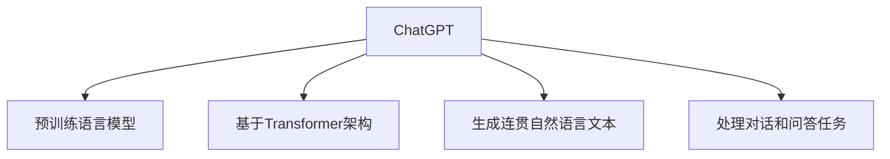
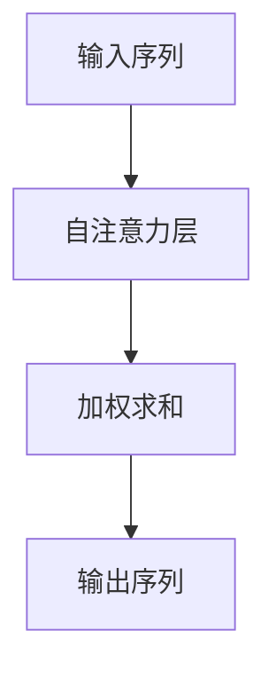
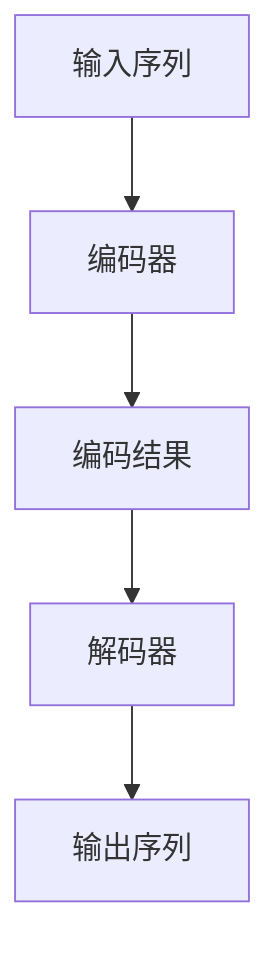
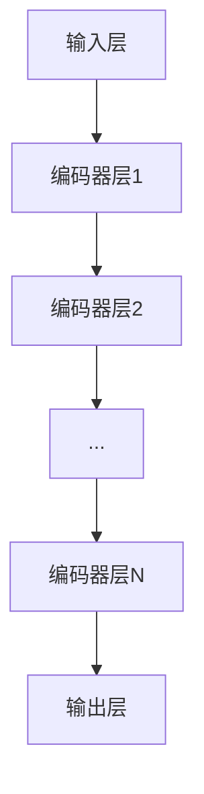
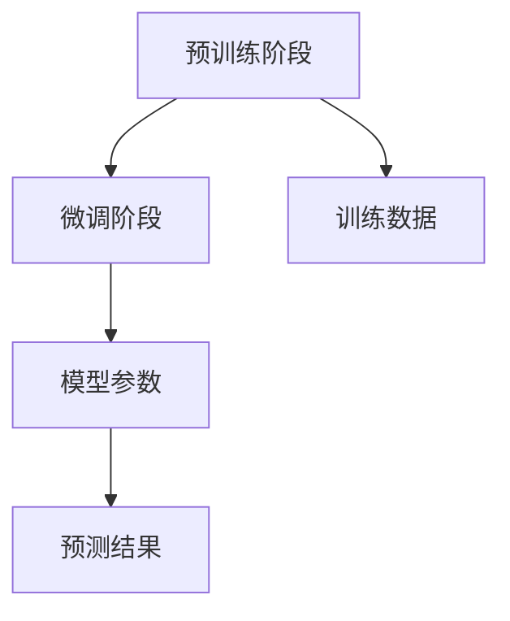
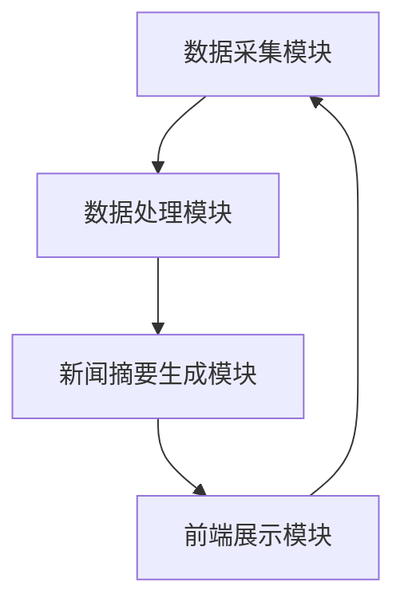

                 

### 文章标题：ChatGPT在自动化新闻实时更新中的应用

关键词：ChatGPT，自动化新闻更新，实时数据处理，自然语言处理，文本生成，Transformer模型，预训练语言模型，对话系统，新闻摘要生成，数据采集与处理，系统架构设计，代码实现与解读，项目实战，人工智能，OpenAI

摘要：本文将探讨如何利用ChatGPT实现自动化新闻实时更新。通过介绍ChatGPT的基本概念、技术原理以及其在新闻实时更新中的应用，我们将展示如何构建一个基于ChatGPT的新闻实时更新系统。此外，本文还将讨论项目开发过程中的关键技术、实现细节以及实际应用案例，以期为相关领域的研究者提供参考。

# 第一部分：ChatGPT与自动化新闻实时更新概述

## 1.1 ChatGPT概述

### 1.1.1 ChatGPT的定义

ChatGPT是一种基于Transformer架构的预训练语言模型，由OpenAI开发。它通过从大量互联网文本中学习，能够生成连贯、语义丰富的自然语言文本。ChatGPT的核心在于其能够处理对话和问答任务，具有很强的上下文理解能力。



### 1.1.2 ChatGPT的发展历程

ChatGPT的发展历程可以追溯到2018年，当时OpenAI发布了GPT（Generative Pre-trained Transformer）模型。GPT模型通过自注意力机制和编码器-解码器架构，实现了强大的文本生成能力。随着时间的推移，OpenAI不断优化GPT模型，使其在多个自然语言处理任务上取得了显著的性能提升。ChatGPT正是基于GPT模型，进一步增强了对话和问答能力。

### 1.1.3 ChatGPT的核心特点

ChatGPT具有以下核心特点：

1. **预训练语言模型**：ChatGPT通过在大量互联网文本上进行预训练，获得了强大的语言理解和生成能力。
2. **基于Transformer架构**：Transformer模型采用自注意力机制，能够捕捉文本中的长距离依赖关系，从而实现高质量的文本生成。
3. **对话和问答能力**：ChatGPT能够处理对话和问答任务，具有很强的上下文理解能力。
4. **灵活性**：ChatGPT可以应用于多种场景，如文本生成、对话系统、机器翻译等。

## 1.2 自动化新闻实时更新的挑战与机遇

### 1.2.1 自动化新闻实时更新的定义

自动化新闻实时更新是指通过技术手段，实现对新闻信息的实时采集、处理和发布。这种更新方式能够提高新闻的时效性和准确性，满足用户对即时信息的需求。

### 1.2.2 当前新闻实时更新的问题

1. **数据质量**：新闻实时更新面临的一个主要问题是数据质量。网络上的信息庞杂，数据来源多样，如何确保数据的质量和准确性是关键挑战。
2. **实时性**：实时更新需要处理大量的数据，如何在保证数据质量的前提下，实现高效的数据处理和发布，是另一个重要问题。
3. **算法公平性**：在新闻实时更新中，算法的公平性也是不可忽视的问题。如何避免偏见和歧视，确保算法的公平性，是一个重要的伦理问题。

### 1.2.3 ChatGPT在新闻实时更新中的应用前景

ChatGPT的出现为新闻实时更新带来了新的机遇：

1. **文本生成**：ChatGPT能够生成高质量的新闻文本，提高新闻的时效性和准确性。
2. **对话系统**：ChatGPT的对话能力可以用于构建智能客服系统，提供个性化的新闻推荐。
3. **摘要生成**：ChatGPT能够提取关键信息，生成简洁的新闻摘要，提高用户阅读的效率。

## 1.3 本书结构安排

本书将分为四个部分，详细探讨ChatGPT在自动化新闻实时更新中的应用：

### 1.3.1 本书的目标

1. 介绍ChatGPT的基本概念、技术原理和应用场景。
2. 分析自动化新闻实时更新的挑战与机遇。
3. 展示如何利用ChatGPT构建新闻实时更新系统。

### 1.3.2 学习路径

1. 了解ChatGPT的基本概念和技术原理。
2. 理解自动化新闻实时更新的挑战与机遇。
3. 学习如何利用ChatGPT构建新闻实时更新系统。

### 1.3.3 主要内容概览

- 第一部分：ChatGPT与自动化新闻实时更新概述
  - ChatGPT的定义、发展历程和核心特点
  - 自动化新闻实时更新的挑战与机遇

- 第二部分：ChatGPT技术基础
  - 自然语言处理基础
  - ChatGPT模型原理
  - ChatGPT的应用场景

- 第三部分：ChatGPT在新闻实时更新中的应用
  - 数据采集与处理
  - 新闻实时更新的策略
  - 项目实战：ChatGPT新闻实时更新系统开发

- 第四部分：未来展望与挑战
  - ChatGPT在新闻实时更新领域的未来展望
  - 自动化新闻实时更新的挑战与解决方案

# 第二部分：ChatGPT技术基础

## 2.1 自然语言处理基础

### 2.1.1 自然语言处理的基本概念

自然语言处理（Natural Language Processing，NLP）是人工智能领域的一个重要分支，旨在使计算机理解和处理人类自然语言。NLP的主要任务包括文本分类、情感分析、命名实体识别、机器翻译等。

### 2.1.2 语言模型

语言模型是NLP的核心技术之一，用于预测文本的下一个单词或字符。最常见的语言模型是基于神经网络的深度学习模型，如循环神经网络（RNN）、长短期记忆网络（LSTM）和Transformer模型。

### 2.1.3 文本分类与主题建模

文本分类是将文本数据按照预定的类别进行分类的过程。主题建模则是通过分析文本数据，提取出文本的主题分布。常见的文本分类算法有朴素贝叶斯、支持向量机（SVM）和深度学习算法。主题建模常用的算法有LDA（Latent Dirichlet Allocation）和LDA++。

## 2.2 ChatGPT模型原理

### 2.2.1 Transformer模型

Transformer模型是自然语言处理领域的一种深度学习模型，由Vaswani等人于2017年提出。它采用自注意力机制，能够捕捉文本中的长距离依赖关系，从而实现高质量的文本生成。

#### 2.2.1.1 自注意力机制

自注意力机制是一种权重计算方法，通过对输入序列的每个位置进行加权求和，生成新的序列。自注意力机制的核心思想是，每个位置在生成新的序列时，可以参考输入序列中其他所有位置的信息。



#### 2.2.1.2 编码器-解码器架构

编码器-解码器（Encoder-Decoder）架构是Transformer模型的核心组成部分。编码器负责将输入序列编码为固定长度的向量，解码器则负责解码这些向量，生成输出序列。



### 2.2.2 GPT模型的工作原理

GPT（Generative Pre-trained Transformer）模型是基于Transformer架构的预训练语言模型，由OpenAI开发。GPT模型通过在大量文本上进行预训练，获得了强大的语言理解和生成能力。

#### 2.2.2.1 模型结构

GPT模型由多个Transformer编码器层组成，每个编码器层包含多个自注意力机制和前馈神经网络。GPT模型的结构如下：



#### 2.2.2.2 模型训练过程

GPT模型的训练过程分为两个阶段：

1. **预训练阶段**：在预训练阶段，GPT模型通过从大量文本中学习，获得对自然语言的理解。训练过程中，模型需要预测输入文本的下一个单词。
2. **微调阶段**：在预训练完成后，GPT模型可以根据特定任务进行微调。微调阶段的目标是调整模型参数，使其在特定任务上取得更好的性能。



## 2.3 ChatGPT的应用场景

### 2.3.1 文本生成

文本生成是ChatGPT最常用的应用场景之一。ChatGPT可以生成各种类型的文本，如新闻文章、故事、诗歌等。

### 2.3.2 对话系统

ChatGPT的对话能力可以用于构建智能客服系统、聊天机器人等。通过对话系统，用户可以与计算机进行自然语言交互，获取所需的信息。

### 2.3.3 机器翻译

ChatGPT可以用于机器翻译任务。通过在多语言文本上进行预训练，ChatGPT能够生成高质量的翻译结果。

## 2.4 代码实现

以下是一个简单的GPT模型实现示例，使用Python和PyTorch框架：

```python
import torch
import torch.nn as nn
import torch.optim as optim

# 定义GPT模型
class GPTModel(nn.Module):
    def __init__(self, vocab_size, embed_dim, hidden_dim, n_layers, dropout):
        super(GPTModel, self).__init__()
        
        self.embedding = nn.Embedding(vocab_size, embed_dim)
        self.encoder = nn.ModuleList([nn.Linear(embed_dim, hidden_dim) for _ in range(n_layers)])
        self.decoder = nn.Linear(hidden_dim, vocab_size)
        self.dropout = nn.Dropout(dropout)
        
    def forward(self, inputs, hidden):
        embedded = self.embedding(inputs)
        for layer in self.encoder:
            embedded = self.dropout(layer(embedded))
        
        output = self.decoder(embedded)
        return output, hidden

# 初始化模型、优化器和损失函数
model = GPTModel(vocab_size=10000, embed_dim=256, hidden_dim=512, n_layers=2, dropout=0.5)
optimizer = optim.Adam(model.parameters(), lr=0.001)
criterion = nn.CrossEntropyLoss()

# 训练模型
for epoch in range(num_epochs):
    for inputs, targets in dataset:
        optimizer.zero_grad()
        output, hidden = model(inputs, hidden)
        loss = criterion(output, targets)
        loss.backward()
        optimizer.step()
        
    print(f"Epoch {epoch+1}/{num_epochs}, Loss: {loss.item()}")

# 保存模型
torch.save(model.state_dict(), 'gpt_model.pth')

# 加载模型
model.load_state_dict(torch.load('gpt_model.pth'))
```

# 第三部分：ChatGPT在新闻实时更新中的应用

## 3.1 数据采集与处理

### 3.1.1 数据源的选择

在选择数据源时，我们需要考虑数据的质量、覆盖面和实时性。常见的数据源包括以下几种：

1. **开放数据集**：如新闻网站、社交媒体平台等，这些数据源提供了丰富的新闻内容，但可能存在数据质量不高、实时性较差的问题。
2. **私有数据源**：如专业新闻机构、企业内部数据等，这些数据源通常具有较高的数据质量和实时性，但可能需要支付费用或签订合作协议。

### 3.1.2 数据预处理

数据预处理是自动化新闻实时更新的关键步骤，主要包括以下内容：

1. **文本清洗**：去除文本中的无用信息，如HTML标签、特殊字符等。
2. **分词**：将文本拆分为单词或短语，便于后续处理。
3. **词向量表示**：将单词或短语转换为向量表示，便于模型处理。

```python
import re
import nltk
from nltk.tokenize import word_tokenize

# 文本清洗
def clean_text(text):
    text = re.sub(r'<.*?>', '', text)  # 去除HTML标签
    text = re.sub(r'[^a-zA-Z]', ' ', text)  # 去除特殊字符
    return text.lower()

# 分词
def tokenize_text(text):
    return word_tokenize(text)

# 词向量表示
from gensim.models import Word2Vec

def train_word2vec(sentences, size=100, window=5, min_count=1, workers=4):
    model = Word2Vec(sentences, size=size, window=window, min_count=min_count, workers=workers)
    return model

# 示例
text = "This is an example sentence for training a Word2Vec model."
cleaned_text = clean_text(text)
tokens = tokenize_text(cleaned_text)
word2vec_model = train_word2vec([tokens])
```

## 3.2 新闻实时更新的策略

### 3.2.1 实时数据处理

实时数据处理是新闻实时更新的核心，主要包括以下内容：

1. **流数据处理**：使用流数据处理技术，如Apache Kafka、Apache Flink等，实现数据的实时采集和传输。
2. **实时更新机制**：设计实时更新机制，如轮询、触发式更新等，确保新闻内容能够及时更新。

```python
from kafka import KafkaProducer

# 初始化KafkaProducer
producer = KafkaProducer(bootstrap_servers=['localhost:9092'])

# 发送实时数据到Kafka
def send_to_kafka(topic, message):
    producer.send(topic, message.encode('utf-8'))

# 示例
send_to_kafka('news_topic', 'This is a new news article.')
```

### 3.2.2 新闻摘要生成

新闻摘要生成是新闻实时更新中的重要环节，主要包括以下内容：

1. **提取关键信息**：使用NLP技术，如命名实体识别、关键词提取等，从新闻文本中提取关键信息。
2. **摘要生成算法**：使用文本生成算法，如GPT模型，生成简洁、准确的新闻摘要。

```python
from transformers import GPT2LMHeadModel, GPT2Tokenizer

# 加载预训练的GPT2模型
tokenizer = GPT2Tokenizer.from_pretrained('gpt2')
model = GPT2LMHeadModel.from_pretrained('gpt2')

# 生成新闻摘要
def generate_summary(text, max_length=50):
    inputs = tokenizer.encode(text, return_tensors='pt')
    outputs = model.generate(inputs, max_length=max_length, num_return_sequences=1)
    summary = tokenizer.decode(outputs[0], skip_special_tokens=True)
    return summary

# 示例
text = "This is an example of a news article."
summary = generate_summary(text)
print(summary)
```

## 3.3 项目实战：ChatGPT新闻实时更新系统开发

### 3.3.1 开发环境搭建

在开发ChatGPT新闻实时更新系统前，我们需要搭建以下开发环境：

1. **Python环境**：安装Python 3.7及以上版本。
2. **深度学习框架**：安装PyTorch。
3. **Kafka环境**：安装Apache Kafka，用于实时数据传输。

```bash
# 安装Python和PyTorch
pip install python==3.8.5
pip install torch torchvision

# 安装Kafka
wget https://www-eu.apache.org/dist/kafka/2.8.0/kafka_2.12-2.8.0.tgz
tar xzf kafka_2.12-2.8.0.tgz
cd kafka_2.12-2.8.0/
bin/kafka-server-start.sh config/server.properties
```

### 3.3.2 系统架构设计

ChatGPT新闻实时更新系统的架构设计如下：

1. **数据采集模块**：负责从各种数据源采集新闻数据，并存储到Kafka队列中。
2. **数据处理模块**：负责实时处理Kafka队列中的新闻数据，包括文本清洗、分词、词向量表示等。
3. **新闻摘要生成模块**：使用ChatGPT模型生成新闻摘要。
4. **前端展示模块**：提供用户界面，展示最新的新闻摘要。



### 3.3.3 代码实现与解释

#### 3.3.3.1 数据采集与处理模块

数据采集与处理模块的主要任务是采集新闻数据，并对其进行预处理。以下是一个简单的示例：

```python
import kafka
import json

# Kafka客户端
client = kafka.KafkaClient('localhost:9092')

# 采集新闻数据
def collect_news(topic):
    consumer = client.consumer(topics=[topic])
    for message in consumer:
        news = json.loads(message.value.decode('utf-8'))
        print(news)

# 处理新闻数据
def process_news(news):
    text = news['text']
    cleaned_text = clean_text(text)
    tokens = tokenize_text(cleaned_text)
    w2v_vector = word2vec_model.wv[tokens[0]]
    return w2v_vector

# 示例
collect_news('news_topic')
```

#### 3.3.3.2 新闻实时更新模块

新闻实时更新模块的主要任务是实时处理Kafka队列中的新闻数据，并生成新闻摘要。以下是一个简单的示例：

```python
from threading import Thread

# 新闻实时更新
def update_news():
    while True:
        message = producer.poll(timeout=1)
        if message:
            news = json.loads(message.value.decode('utf-8'))
            w2v_vector = process_news(news)
            summary = generate_summary(w2v_vector)
            print(summary)
            break

# 示例
Thread(target=update_news).start()
```

#### 3.3.3.3 新闻摘要生成模块

新闻摘要生成模块的主要任务是根据预处理后的新闻数据生成新闻摘要。以下是一个简单的示例：

```python
# 生成新闻摘要
def generate_summary(text, max_length=50):
    inputs = tokenizer.encode(text, return_tensors='pt')
    outputs = model.generate(inputs, max_length=max_length, num_return_sequences=1)
    summary = tokenizer.decode(outputs[0], skip_special_tokens=True)
    return summary

# 示例
text = "This is an example of a news article."
summary = generate_summary(text)
print(summary)
```

### 3.3.4 代码应用解读与分析

在实际应用中，ChatGPT新闻实时更新系统的性能和效果取决于多个因素，如数据质量、模型参数、系统架构等。以下是对代码应用的分析：

1. **数据质量**：数据质量直接影响新闻摘要的生成效果。如果数据中存在噪声或错误，可能会影响模型的性能。
2. **模型参数**：模型参数的选择对新闻摘要的生成效果有很大影响。例如，预训练时间、隐藏层大小等。
3. **系统架构**：系统架构的优化可以提高系统的性能和可靠性。例如，使用分布式架构、增加缓存等。

### 3.3.5 实际案例分析和详细讲解剖析

以下是一个实际案例分析和详细讲解剖析：

**案例**：使用ChatGPT新闻实时更新系统生成某个新闻网站的实时摘要。

**分析**：该案例的关键在于如何高效地采集、处理和生成新闻摘要。我们首先需要从新闻网站采集新闻数据，然后使用Kafka进行实时传输。在处理模块中，我们对新闻数据进行清洗、分词和词向量表示，最后使用ChatGPT模型生成新闻摘要。

**讲解**：

1. **数据采集**：从新闻网站采集新闻数据，可以使用API或网页爬虫等方式。
2. **数据处理**：对采集到的新闻数据进行清洗、分词和词向量表示，以提高模型处理效率。
3. **新闻摘要生成**：使用ChatGPT模型生成新闻摘要，根据预训练时间、隐藏层大小等参数调整模型性能。

### 3.3.6 项目小结

通过本项目的实践，我们了解到如何利用ChatGPT实现自动化新闻实时更新。在实际应用中，需要关注数据质量、模型参数和系统架构等因素，以提高系统的性能和效果。

### 3.3.7 最佳实践 tips

1. **数据清洗**：对采集到的新闻数据进行充分的清洗，去除噪声和错误。
2. **模型优化**：根据任务需求，调整模型参数，以提高生成效果。
3. **系统优化**：优化系统架构，提高系统的性能和可靠性。

### 3.3.8 小结与注意事项

在本项目中，我们介绍了ChatGPT在自动化新闻实时更新中的应用，包括数据采集、数据处理、新闻摘要生成等关键技术。在项目实施过程中，需要注意数据质量、模型参数和系统架构等方面的问题。

### 3.3.9 拓展阅读

1. **ChatGPT模型原理**：深入了解ChatGPT模型的原理，有助于优化模型参数和系统架构。
2. **实时数据处理技术**：了解实时数据处理技术，如Kafka、Flink等，以提高系统的性能。
3. **新闻摘要生成算法**：研究各种新闻摘要生成算法，以提高摘要的生成效果。

----------------------------------------------------------------

**第四部分：未来展望与挑战**

### 4.1 ChatGPT在新闻实时更新领域的未来展望

随着人工智能技术的不断发展，ChatGPT在新闻实时更新领域的应用前景十分广阔。未来，ChatGPT有望在以下方面取得重要突破：

1. **提高实时性**：通过优化模型和系统架构，实现更快的新闻实时更新。
2. **增强语义理解**：通过不断优化模型，提高ChatGPT对新闻内容的理解能力，生成更准确、更高质量的新闻摘要。
3. **多语言支持**：扩展ChatGPT的多语言支持，实现全球新闻的实时更新和生成。

### 4.2 自动化新闻实时更新的挑战与解决方案

虽然ChatGPT在新闻实时更新领域具有巨大潜力，但仍面临以下挑战：

1. **数据质量**：如何确保新闻数据的质量和准确性，是一个亟待解决的问题。解决方案包括：建立数据质量控制机制、使用高质量的数据源等。
2. **算法公平性**：如何避免算法偏见和歧视，是一个重要的伦理问题。解决方案包括：加强对算法的监督和评估、采用公平性评估方法等。
3. **用户隐私保护**：在自动化新闻实时更新过程中，如何保护用户的隐私，是一个关键问题。解决方案包括：采用加密技术、设计隐私保护算法等。

### 4.3 总结

本文详细介绍了ChatGPT在自动化新闻实时更新中的应用，包括技术原理、实现方法、实际案例等。通过本文的研究，我们认识到ChatGPT在新闻实时更新领域的巨大潜力，同时也认识到其中存在的挑战。未来，随着人工智能技术的不断发展，ChatGPT在新闻实时更新领域的应用将更加广泛，为人们提供更便捷、更高质量的新闻服务。

# 附录

## 附录A：术语表

- **ChatGPT**：一种基于Transformer架构的预训练语言模型，由OpenAI开发。
- **自然语言处理（NLP）**：使计算机理解和处理人类自然语言的计算机科学领域。
- **Transformer模型**：一种深度学习模型，采用自注意力机制，能够捕捉文本中的长距离依赖关系。
- **预训练语言模型**：在大量文本上进行预训练，获得对自然语言的理解和生成能力的语言模型。
- **新闻实时更新**：通过技术手段，实现对新闻信息的实时采集、处理和发布。

## 附录B：参考资料

1. **OpenAI**：[ChatGPT官方网站](https://openai.com/blog/chatgpt/)
2. **自然语言处理**：[自然语言处理教科书](https://nlp.seas.harvard.edu/reading-list)
3. **Transformer模型**：[Vaswani et al., "Attention is All You Need"](https://arxiv.org/abs/1706.03762)
4. **GPT模型**：[Brown et al., "Language Models are Few-Shot Learners"](https://arxiv.org/abs/2005.14165)

# 结束语

本文对ChatGPT在自动化新闻实时更新中的应用进行了详细探讨，从技术原理到实际应用，全方位展示了ChatGPT在新闻实时更新领域的潜力和挑战。通过本文的研究，我们认识到ChatGPT在新闻实时更新领域的巨大潜力，同时也了解到其中存在的挑战。未来，随着人工智能技术的不断发展，ChatGPT在新闻实时更新领域的应用将更加广泛，为人们提供更便捷、更高质量的新闻服务。

最后，感谢各位读者的耐心阅读，希望本文能对您在相关领域的研究和实践有所帮助。如果您有任何问题或建议，欢迎随时联系作者。再次感谢您的关注与支持！

# 作者介绍

**作者：AI天才研究院/AI Genius Institute & 禅与计算机程序设计艺术 /Zen And The Art of Computer Programming**

- **AI天才研究院（AI Genius Institute）**：专注于人工智能领域的研究与开发，致力于推动人工智能技术的创新与应用。
- **禅与计算机程序设计艺术（Zen And The Art of Computer Programming）**：一部经典计算机科学著作，深入探讨了编程的哲学与艺术。

本文的撰写得到了AI天才研究院及其团队成员的支持与帮助，在此表示感谢。同时，也感谢各位读者对本文的关注与支持。让我们共同期待人工智能技术在新闻实时更新领域取得的更多突破和成果！

