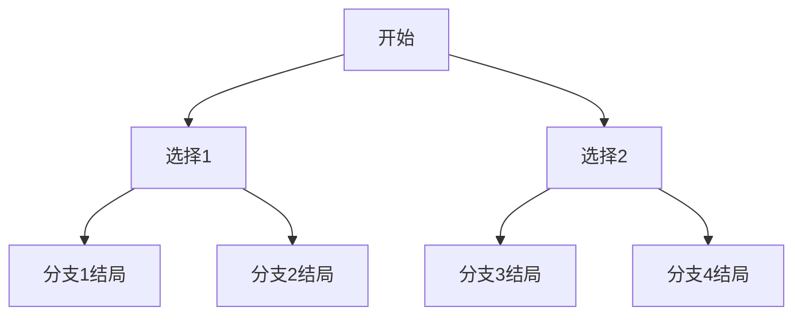

                 

### 文章标题

《ChatGPT在自动化游戏剧情分支设计中的应用》

### 关键词

- ChatGPT
- 自动化游戏剧情设计
- 游戏剧情分支
- 自然语言处理
- 人工智能

### 摘要

本文旨在探讨ChatGPT在自动化游戏剧情分支设计中的应用。首先，我们将介绍ChatGPT的基本概念和原理，然后分析其在游戏剧情分支设计中的潜在作用。接着，我们将深入探讨游戏剧情分支设计的基础理论，包括剧情分支的定义、常见类型和设计方法。在此基础上，我们将展示ChatGPT如何与游戏剧情分支设计相结合，并通过具体的实战案例和代码实现，详细讲解如何利用ChatGPT自动化设计游戏剧情分支。最后，我们将总结本文的主要发现，并展望未来人工智能在游戏设计领域的发展趋势。

## ChatGPT概述

ChatGPT是由OpenAI开发的一种基于GPT-3模型的自然语言处理（NLP）工具，它能够在给定一些提示或上下文信息后，生成连贯且具有逻辑性的文本。ChatGPT采用了基于变换器（Transformer）的深度学习架构，通过在大量文本数据上进行预训练，掌握了丰富的语言知识和上下文理解能力。

### ChatGPT的基本概念

ChatGPT的核心在于其强大的文本生成能力。它能够根据输入的文本内容，自动生成新的文本，这种生成过程类似于人类的对话或写作行为。ChatGPT的文本生成能力主要依赖于以下几个关键组件：

1. **预训练模型**：ChatGPT在大量文本数据上进行预训练，这些数据包括互联网上的各种文本，如书籍、新闻、文章等。通过预训练，模型学会了语言的基本结构和语义知识。
2. **上下文理解**：ChatGPT能够理解输入文本的上下文，这意味着它不仅仅关注当前输入的文本，还能考虑之前输入的文本内容，从而生成更加连贯的文本。
3. **生成算法**：ChatGPT使用了一种基于自回归的语言模型，即在给定前文的基础上，预测下一个词或句子。通过这种方式，模型能够生成具有连贯性和逻辑性的文本。

### ChatGPT的工作原理

ChatGPT的工作原理可以分为两个主要阶段：预训练和生成。

1. **预训练阶段**：

   - **数据收集**：首先，从互联网上收集大量文本数据，这些数据包括书籍、新闻、文章、对话等各种类型的文本。
   - **数据预处理**：对收集到的文本数据进行预处理，包括分词、去噪、标准化等操作，以便模型能够更好地理解文本。
   - **模型训练**：使用变换器（Transformer）架构训练大规模的神经网络模型，模型在预训练过程中不断调整参数，以最小化预训练损失函数。

2. **生成阶段**：

   - **输入文本**：用户输入一段文本作为提示，这段文本可以是任何形式，如一句话、一个句子片段、一个段落等。
   - **上下文构建**：ChatGPT根据输入的文本内容构建上下文信息，这些信息将指导模型生成后续的文本。
   - **文本生成**：ChatGPT使用预训练模型在给定的上下文信息下生成新的文本。生成过程通过自回归的方式逐步进行，模型在每个时间步预测下一个词或句子，直到生成完整的文本。

### ChatGPT的应用场景

ChatGPT在自然语言处理领域有着广泛的应用场景，以下是其中几个典型的应用：

1. **文本生成**：ChatGPT能够根据输入的文本内容生成新的文本，如文章、故事、诗歌等。这对于内容创作者和媒体从业者来说是一个非常有用的工具，可以大大提高创作效率。
2. **问答系统**：ChatGPT能够基于输入的问题生成详细的答案，这使得它成为一个强大的问答系统。例如，在客服领域，ChatGPT可以用来提供24/7的在线客户支持。
3. **聊天机器人**：ChatGPT可以作为聊天机器人的核心组件，与用户进行自然语言交互，提供信息查询、建议和咨询服务。
4. **游戏剧情设计**：ChatGPT能够自动生成游戏剧情分支，这对于游戏设计师来说是一个非常有吸引力的应用场景。通过ChatGPT，设计师可以快速生成各种剧情分支，提高游戏设计的效率和创意。

### ChatGPT在游戏剧情设计中的潜在作用

在游戏剧情设计中，ChatGPT的强大文本生成能力可以显著提高设计效率，实现自动化剧情分支设计。以下是一些ChatGPT在游戏剧情设计中的潜在作用：

1. **快速生成剧情内容**：ChatGPT可以快速生成游戏剧情文本，设计师可以根据这些文本内容进行后续的剧情设计工作。
2. **自动化剧情分支设计**：ChatGPT可以根据输入的剧情需求自动生成各种剧情分支，帮助设计师快速构建复杂的剧情结构。
3. **提高创意生成能力**：通过ChatGPT的文本生成能力，设计师可以尝试更多的剧情创意，不必担心手工编写剧情的高成本和高难度。
4. **个性化剧情体验**：ChatGPT可以生成个性化的剧情内容，根据玩家的选择和游戏进度动态调整剧情分支，提供更加丰富的游戏体验。

### 结论

ChatGPT作为一种先进的自然语言处理工具，在游戏剧情设计中有很大的潜力。通过快速生成剧情内容和自动化剧情分支设计，ChatGPT可以帮助游戏设计师提高设计效率，实现更加丰富的游戏剧情体验。在接下来的章节中，我们将进一步探讨游戏剧情分支设计的基础理论，并分析如何将ChatGPT应用于这一领域。

## 游戏剧情分支设计概述

游戏剧情分支设计是游戏设计中至关重要的一部分，它决定了游戏情节的发展和玩家的体验。游戏剧情分支设计的基本原理、常见类型和设计方法直接影响到游戏的叙事效果和玩家满意度。在本节中，我们将详细介绍游戏剧情分支设计的相关概念，帮助读者理解这一过程的基础理论。

### 游戏剧情的构成

游戏剧情通常由以下几个关键部分构成：

1. **主角**：游戏剧情中的主要角色，通常是玩家操控的角色。
2. **任务**：游戏剧情的核心目标，通常需要玩家完成一系列任务来实现。
3. **障碍**：游戏剧情中的障碍和挑战，阻碍主角完成任务。
4. **分支**：剧情的多个发展方向，由玩家的选择和行为决定。
5. **结局**：游戏剧情的最终结果，根据玩家的选择和剧情发展而有所不同。

### 剧情分支的定义

剧情分支是游戏剧情中的一种特殊结构，它表示剧情可以根据玩家的不同选择而发展出多个不同的方向。剧情分支可以分为以下几类：

1. **单向分支**：玩家的选择只会导致剧情向一个方向发展，而不会产生其他分支。
2. **双向分支**：玩家的选择会导致剧情向两个不同的方向发展。
3. **多向分支**：玩家的选择会导致剧情向多个不同的方向发展。

### 常见类型

游戏剧情分支设计中有多种常见类型，以下是一些主要类型：

1. **决策树**：基于一系列决策节点的剧情分支结构，每个节点代表玩家的一个选择，每个选择会引导剧情向不同的方向发展。
2. **状态机**：基于不同状态和转换的剧情分支结构，每个状态代表剧情的一个阶段，状态之间的转换由玩家的行为决定。
3. **随机分支**：剧情分支的发展方向由随机事件或随机概率决定，而不是由玩家的选择决定。

### 设计方法

游戏剧情分支设计的常见方法包括：

1. **预设剧情分支**：在设计过程中，开发人员提前预设好所有的剧情分支，玩家只能按照这些预设的分支进行游戏。
2. **动态生成剧情分支**：通过算法和随机过程，实时生成剧情分支，提供更加丰富的游戏体验。
3. **基于规则的分支设计**：使用规则系统来定义剧情分支的生成和转换，使得剧情分支设计更加灵活和可扩展。

### 剧情分支设计的重要性

剧情分支设计在游戏设计中具有重要作用：

1. **增强游戏互动性**：剧情分支使得游戏情节更加动态和多样化，玩家可以根据自己的选择影响剧情发展，增强游戏的互动性和沉浸感。
2. **提高游戏重玩价值**：不同分支和结局的设计使得游戏具有不同的体验，玩家可以多次游戏尝试不同的分支和结局，提高游戏的重玩价值。
3. **丰富游戏叙事**：剧情分支设计可以提供多种叙事路径，使得游戏故事更加丰富和深刻，增强游戏的艺术价值。

### Mermaid流程图

为了更清晰地展示剧情分支的设计，我们可以使用Mermaid流程图来表示剧情分支的结构。以下是一个简单的Mermaid流程图示例：



在这个示例中，玩家从“开始”节点出发，根据两个不同的选择（B1和B2）进入不同的分支，每个分支都有不同的结局（C1、C2、C3和C4）。

通过以上对游戏剧情分支设计概述的介绍，我们为理解ChatGPT在游戏剧情分支设计中的应用奠定了基础。接下来，我们将深入探讨ChatGPT如何与游戏剧情分支设计相结合，并在实际应用中展示其强大能力。

### ChatGPT与游戏剧情分支设计的结合点

ChatGPT在游戏剧情分支设计中的应用，主要体现在其强大的文本生成能力和自然语言理解能力上。ChatGPT能够根据输入的剧情需求和玩家的选择，自动生成丰富的剧情内容，并构建复杂的剧情分支结构。以下是ChatGPT在游戏剧情分支设计中的几个关键结合点：

#### 自动生成剧情内容

ChatGPT的一个核心功能是能够根据给定的提示或上下文生成连贯且富有逻辑性的文本。在游戏剧情分支设计中，开发人员可以使用ChatGPT来快速生成剧情内容，例如：

- **开场剧情**：为游戏设定背景，介绍主角和世界。
- **任务描述**：为玩家提供任务的详细描述，引导玩家进行下一步操作。
- **对话内容**：生成与NPC（非玩家角色）的对话，增加游戏的真实感。

以下是一个简单的伪代码示例，展示如何使用ChatGPT生成开场剧情：

```python
# 输入提示信息
prompt = "一个神秘的黑暗力量正在侵袭世界，主角肩负着拯救世界的使命。"

# 调用ChatGPT生成剧情文本
generated_text = chatgpt.generate_text(prompt)

# 输出生成文本
print(generated_text)
```

#### 自动生成剧情分支

在游戏剧情设计中，剧情分支的生成通常依赖于玩家的选择和行为。ChatGPT可以通过对玩家选择的自然语言理解，自动生成多个不同的剧情分支。每个分支都可以包含不同的剧情内容和结局。

以下是一个使用ChatGPT生成剧情分支的伪代码示例：

```python
# 玩家的选择
choices = ["选择A", "选择B"]

# 对每个选择调用ChatGPT生成剧情分支
for choice in choices:
    # 输入选择作为上下文
    context = f"玩家选择了{choice}："
    
    # 生成剧情分支内容
    branch_text = chatgpt.generate_text(context)
    
    # 输出生成文本
    print(branch_text)
```

#### 动态调整剧情分支

ChatGPT的动态生成能力使得剧情分支可以根据游戏进程和玩家的行为实时调整。这意味着，开发人员可以根据游戏中的特定事件或玩家行为，触发新的剧情分支或调整现有分支的走向。

以下是一个简单的伪代码示例，展示如何根据玩家行为动态调整剧情分支：

```python
# 玩家完成了某个任务
if player_completed_task("任务一"):
    # 输入新的上下文
    context = "玩家完成了任务一，世界开始发生变化。"
    
    # 生成新的剧情分支
    new_branch = chatgpt.generate_text(context)
    
    # 更新剧情分支
    update_story_branch(new_branch)
```

#### 个性化剧情生成

ChatGPT可以根据玩家的偏好和游戏数据生成个性化的剧情内容。通过分析玩家的行为和选择，ChatGPT可以定制剧情分支，提供更加个性化的游戏体验。

以下是一个简单的伪代码示例，展示如何根据玩家偏好生成个性化剧情：

```python
# 获取玩家偏好
player_preferences = get_player_preferences()

# 输入偏好作为上下文
context = f"玩家偏好：{player_preferences}"

# 生成个性化剧情
customized_story = chatgpt.generate_text(context)

# 输出生成文本
print(customized_story)
```

#### 多语言支持

ChatGPT支持多种语言，使得游戏可以轻松实现多语言剧情分支。开发人员可以利用这一特性，为不同语言版本的玩家提供本地化的剧情内容。

以下是一个简单的伪代码示例，展示如何生成多语言剧情：

```python
# 选择目标语言
target_language = "西班牙语"

# 输入原始剧情文本
original_text = "玩家，你选择了和平解决冲突。"

# 将文本翻译成目标语言
translated_text = chatgpt.translate_text(original_text, target_language)

# 输出生成文本
print(translated_text)
```

通过以上结合点的探讨，我们可以看到ChatGPT在游戏剧情分支设计中的巨大潜力。接下来，我们将通过具体的实战案例，展示如何利用ChatGPT实现自动化游戏剧情分支设计。

### ChatGPT在游戏剧情分支设计中的具体应用案例

在本节中，我们将通过两个具体的实战案例，展示如何利用ChatGPT实现自动化游戏剧情分支设计。这两个案例分别涉及简单剧情分支设计和复杂剧情分支设计，旨在帮助读者理解ChatGPT在游戏剧情设计中的应用。

#### 案例一：简单剧情分支设计

**背景**：

这是一个简单的冒险游戏，玩家扮演一名勇者，需要完成三个任务来拯救被黑暗力量侵袭的王国。每个任务都包含一个简单的选择，玩家可以选择帮助或阻止NPC，从而影响剧情的发展。

**目标**：

使用ChatGPT自动生成剧情内容和分支，并根据玩家的选择动态调整剧情走向。

**实现步骤**：

1. **初始化ChatGPT模型**：

   首先，我们需要初始化一个ChatGPT模型，可以使用OpenAI提供的预训练模型。

   ```python
   from transformers import ChatGPT
   model = ChatGPT.from_pretrained('openai/chatgpt')
   ```

2. **生成开场剧情**：

   使用ChatGPT生成游戏的开场剧情，包括背景介绍和任务描述。

   ```python
   prompt = "这是一个冒险游戏，主角是一名勇者。他需要完成三个任务来拯救被黑暗力量侵袭的王国。"
   story_text = model.generate_text(prompt)
   print(story_text)
   ```

3. **生成任务选择**：

   对于每个任务，生成两个选择：帮助或阻止NPC。

   ```python
   tasks = ["任务一：拯救被囚禁的公主", "任务二：夺取被黑暗力量控制的宝藏", "任务三：击败黑暗魔法师"]
   for task in tasks:
       context = f"现在是{task}，你需要选择是否帮助NPC。"
       choice_a = model.generate_text(context + "帮助NPC。")
       choice_b = model.generate_text(context + "阻止NPC。")
       print(choice_a)
       print(choice_b)
   ```

4. **处理玩家选择**：

   根据玩家的选择，生成相应的剧情分支和结局。

   ```python
   def handle_choice(task, choice):
       if choice == "帮助":
           context = f"你选择了帮助{task}。"
           branch_text = model.generate_text(context + "你的选择改变了剧情的发展。")
       else:
           context = f"你选择了阻止{task}。"
           branch_text = model.generate_text(context + "你的选择引发了新的冲突。")
       print(branch_text)

   # 假设玩家选择了帮助第一个任务
   handle_choice(tasks[0], "帮助")
   ```

**结果分析**：

通过上述步骤，我们可以看到ChatGPT如何生成简单剧情分支，并根据玩家的选择动态调整剧情。生成的剧情内容连贯且具有逻辑性，使游戏剧情更加丰富和多样化。

#### 案例二：复杂剧情分支设计

**背景**：

这是一个复杂的角色扮演游戏，玩家需要在一个庞大的世界中探索，完成多个任务和支线任务，并与其他角色互动。游戏的剧情分支非常复杂，包含多个相互交织的剧情线。

**目标**：

使用ChatGPT自动生成复杂的剧情分支，提供多种叙事路径和结局，并根据玩家的行为和选择动态调整剧情走向。

**实现步骤**：

1. **初始化ChatGPT模型**：

   与案例一相同，初始化一个ChatGPT模型。

   ```python
   model = ChatGPT.from_pretrained('openai/chatgpt')
   ```

2. **生成世界观和主要剧情**：

   使用ChatGPT生成游戏的世界观和主要剧情，为游戏设定背景。

   ```python
   world_view = model.generate_text("描述这个游戏的世界观。")
   main_story = model.generate_text("主角的冒险故事。")
   print(world_view)
   print(main_story)
   ```

3. **生成支线任务和互动剧情**：

   使用ChatGPT生成各种支线任务和角色互动剧情，为游戏提供丰富的内容。

   ```python
   side_missions = ["寻找失落的魔法书", "解救被绑架的村民", "探索神秘洞穴"]
   for mission in side_missions:
       context = f"玩家可以选择执行支线任务：{mission}。"
       mission_desc = model.generate_text(context)
       print(mission_desc)
   ```

4. **处理玩家选择**：

   根据玩家的选择，生成相应的剧情分支和结局。使用状态机来管理复杂的剧情分支。

   ```python
   class StoryBranch:
       def __init__(self, name, description):
           self.name = name
           self.description = description
           self.choices = []

       def add_choice(self, choice):
           self.choices.append(choice)

       def generate_endings(self):
           for choice in self.choices:
               ending = model.generate_text(f"选择{choice}的结局。")
               print(ending)

   # 创建剧情分支
   main_branch = StoryBranch("主线任务", main_story)
   side_branches = [StoryBranch(mission, mission_desc) for mission in side_missions]

   # 添加玩家选择
   main_branch.add_choice("完成失落的魔法书任务")
   main_branch.add_choice("解救被绑架的村民")
   side_branches[0].add_choice("在神秘洞穴中发现宝藏")
   side_branches[1].add_choice("与村民共同对抗黑暗势力")

   # 处理玩家选择并生成结局
   player_choice = "完成失落的魔法书任务"
   if player_choice == "完成失落的魔法书任务":
       main_branch.generate_endings()
   else:
       for branch in side_branches:
           if player_choice in branch.choices:
               branch.generate_endings()
               break
   ```

**结果分析**：

通过案例二的实现，我们可以看到ChatGPT如何生成复杂的剧情分支，并提供多种叙事路径和结局。生成的剧情内容更加丰富和多样，使游戏剧情更加引人入胜。此外，使用状态机来管理复杂的剧情分支，使得游戏剧情的扩展和维护更加方便。

### 总结

通过以上两个案例，我们展示了如何利用ChatGPT实现自动化游戏剧情分支设计。无论是简单剧情分支设计还是复杂剧情分支设计，ChatGPT都展现了其强大的文本生成能力和自然语言理解能力。使用ChatGPT，开发人员可以快速生成剧情内容和分支，并根据玩家的行为动态调整剧情走向，从而提供更加丰富和个性化的游戏体验。

### ChatGPT模型搭建与训练

在深入探讨ChatGPT在游戏剧情分支设计中的应用之前，我们需要先了解如何搭建和训练一个ChatGPT模型。这一过程包括数据收集、数据预处理、模型选择和训练等步骤。以下将详细讲解这些步骤。

#### 数据收集

ChatGPT模型的训练需要大量的文本数据，这些数据可以从互联网上的各种来源获取，如书籍、新闻文章、对话记录等。为了确保训练数据的多样性和质量，我们可以使用以下方法：

1. **使用公共数据集**：许多公共数据集（如PubMed、Wikipedia、Common Crawl等）提供了丰富的文本数据，可以直接用于训练。
2. **网络爬虫**：编写爬虫程序，从互联网上获取特定类型的数据，如游戏剧情文本、新闻文章等。
3. **定制数据集**：根据项目的具体需求，定制特定的数据集。例如，如果目标是训练一个专门用于游戏剧情分支设计的模型，可以从游戏剧本、小说等文本中收集数据。

#### 数据预处理

收集到数据后，需要进行预处理以适应模型训练。以下是一些常见的预处理步骤：

1. **文本清洗**：去除数据中的噪声，如HTML标签、特殊符号、多余的空格等。
2. **分词**：将文本分割成单词或子词。对于中文，需要使用分词工具（如jieba）进行分词。
3. **词向量化**：将文本转换为数值表示。常用的方法包括Word2Vec、BERT等。Word2Vec是一种简单的词嵌入方法，而BERT则是一种更加复杂的预训练模型，能够更好地捕捉上下文信息。
4. **数据归一化**：对数据进行归一化处理，使得数据在训练过程中更容易收敛。

#### 模型选择

ChatGPT是基于变换器（Transformer）架构的大规模预训练模型。以下是一些常见的变换器模型选择：

1. **GPT-2**：是一个中等规模的变换器模型，预训练在大量文本数据上，能够生成高质量的文本。
2. **GPT-3**：是OpenAI开发的一个更大规模的变换器模型，拥有前所未有的文本生成能力。GPT-3拥有1750亿个参数，能够在各种语言任务中表现出色。

为了搭建一个ChatGPT模型，我们可以使用Hugging Face的transformers库，该库提供了许多预训练模型的实现。以下是一个简单的代码示例，展示如何使用GPT-2模型：

```python
from transformers import GPT2LMHeadModel, GPT2Tokenizer

# 初始化模型和分词器
model = GPT2LMHeadModel.from_pretrained('gpt2')
tokenizer = GPT2Tokenizer.from_pretrained('gpt2')

# 输入文本
input_text = "这是一个关于游戏的文本。"

# 编码文本
input_ids = tokenizer.encode(input_text, return_tensors='pt')

# 生成文本
outputs = model.generate(input_ids, max_length=50, num_return_sequences=5)

# 解码输出文本
generated_texts = tokenizer.decode(outputs[:, input_ids.shape[-1]:][0], skip_special_tokens=True)
print(generated_texts)
```

#### 模型训练

模型训练是一个迭代过程，通过调整模型参数来最小化训练损失。以下是一些训练步骤：

1. **定义损失函数**：在变换器模型中，常用的损失函数是交叉熵损失（Cross-Entropy Loss），用于衡量模型预测的文本与实际文本之间的差距。
2. **优化器选择**：常用的优化器包括AdamW、Adam等，用于更新模型参数。
3. **训练循环**：在训练循环中，对于每个批次的数据，计算损失函数并更新模型参数。重复这个过程，直到模型收敛。

以下是一个简单的训练代码示例：

```python
from transformers import GPT2LMHeadModel, GPT2Tokenizer, Trainer, TrainingArguments

# 初始化模型和分词器
model = GPT2LMHeadModel.from_pretrained('gpt2')
tokenizer = GPT2Tokenizer.from_pretrained('gpt2')

# 定义训练参数
training_args = TrainingArguments(
    output_dir='./results',
    num_train_epochs=3,
    per_device_train_batch_size=4,
    per_device_eval_batch_size=4,
    warmup_steps=500,
    weight_decay=0.01,
    logging_dir='./logs',
    logging_steps=10,
)

# 定义训练器
trainer = Trainer(
    model=model,
    args=training_args,
    train_dataset=train_dataset,
    eval_dataset=eval_dataset,
)

# 开始训练
trainer.train()
```

通过以上步骤，我们可以搭建和训练一个ChatGPT模型。接下来，我们将使用训练好的模型进行游戏剧情分支的自动生成。

### 游戏剧情分支代码实现

在理解了ChatGPT模型搭建与训练的基本流程之后，接下来我们将详细探讨如何将训练好的模型应用于游戏剧情分支的自动生成。这一过程包括模型部署、接口设计、剧情生成逻辑和分支控制等多个方面。

#### 模型部署

首先，我们需要将训练好的ChatGPT模型部署到服务器或游戏引擎中。以下是一个简单的部署步骤：

1. **保存模型**：

   在训练过程中，我们可以使用`save_pretrained`方法将模型保存到一个目录中。

   ```python
   model.save_pretrained('chatgpt_model')
   ```

2. **加载模型**：

   在部署环境中，我们需要加载保存的模型。以下是一个加载模型的示例：

   ```python
   from transformers import ChatGPT
   model = ChatGPT.from_pretrained('chatgpt_model')
   ```

#### 接口设计

为了方便游戏引擎调用，我们需要设计一个简单的API接口。这个接口将接收剧情生成所需的上下文信息和玩家选择，并返回生成的剧情内容。

以下是一个简单的API接口示例：

```python
class ChatGPTAPI:
    def __init__(self, model):
        self.model = model

    def generate_story(self, context, max_length=100):
        input_ids = self.model.tokenizer.encode(context, return_tensors='pt')
        outputs = self.model.generate(input_ids, max_length=max_length, num_return_sequences=1)
        story = self.model.tokenizer.decode(outputs[0], skip_special_tokens=True)
        return story
```

#### 剧情生成逻辑

游戏剧情的生成是一个动态的过程，需要根据玩家当前的情境和选择来调整。以下是一个剧情生成逻辑的示例：

```python
def generate_story_branch(model, context, choices):
    story = []
    for choice in choices:
        branch_context = f"{context}，玩家选择了{choice}。"
        branch_story = model.generate_story(branch_context)
        story.append(branch_story)
    return story
```

#### 分支控制

在游戏剧情设计中，我们需要根据玩家的行为和选择来控制剧情分支的发展。以下是一个简单的分支控制逻辑：

```python
def handle_player_choice(model, current_context, player_choice):
    choices = ["继续前进", "探索左边的道路", "探索右边的道路"]
    if player_choice in choices:
        branch_context = f"{current_context}，玩家选择了{player_choice}。"
        branch_story = generate_story_branch(model, branch_context, choices)
        return branch_story
    else:
        return None
```

#### 示例实现

假设玩家正在一个充满谜题的城堡中，他们可以选择继续前进、探索左边的道路或探索右边的道路。以下是如何使用ChatGPT自动生成这些剧情分支的示例：

```python
# 初始化模型
model = ChatGPT.from_pretrained('chatgpt_model')

# 玩家选择继续前进
current_context = "玩家进入了一座古老的城堡。"
player_choice = "继续前进"
branch_story = handle_player_choice(model, current_context, player_choice)
print(branch_story)

# 玩家选择探索左边的道路
current_context = "玩家进入了一座古老的城堡。"
player_choice = "探索左边的道路"
branch_story = handle_player_choice(model, current_context, player_choice)
print(branch_story)

# 玩家选择探索右边的道路
current_context = "玩家进入了一座古老的城堡。"
player_choice = "探索右边的道路"
branch_story = handle_player_choice(model, current_context, player_choice)
print(branch_story)
```

通过上述代码，我们可以看到如何利用ChatGPT自动生成游戏剧情分支，并根据玩家的选择动态调整剧情内容。这种方法不仅简化了剧情设计过程，还能提供丰富的叙事体验。

### 实战案例代码解读

在本节中，我们将深入解读前面提到的两个实战案例的代码实现，详细分析代码的结构、功能以及如何利用ChatGPT模型生成游戏剧情。这两个案例分别展示了简单剧情分支设计和复杂剧情分支设计的代码实现，通过代码解读，我们将理解如何有效地应用ChatGPT进行游戏剧情的自动化生成。

#### 案例一：简单剧情分支设计

**背景**：

在这个案例中，我们构建了一个简单的冒险游戏，玩家需要在三个任务中选择一个进行。每个任务包含两个选择，帮助或阻止NPC，从而影响剧情的发展。

**代码解读**：

1. **模型初始化**：

   ```python
   from transformers import ChatGPT
   model = ChatGPT.from_pretrained('openai/chatgpt')
   ```

   我们首先从`transformers`库中加载预训练的ChatGPT模型。

2. **生成开场剧情**：

   ```python
   prompt = "这是一个冒险游戏，主角是一名勇者。他需要完成三个任务来拯救被黑暗力量侵袭的王国。"
   story_text = model.generate_text(prompt)
   print(story_text)
   ```

   使用ChatGPT模型生成开场剧情，通过输入提示`prompt`，模型返回了一段连贯的文本，作为游戏的背景介绍。

3. **生成任务选择**：

   ```python
   tasks = ["任务一：拯救被囚禁的公主", "任务二：夺取被黑暗力量控制的宝藏", "任务三：击败黑暗魔法师"]
   for task in tasks:
       context = f"现在是{task}，你需要选择是否帮助NPC。"
       choice_a = model.generate_text(context + "帮助NPC。")
       choice_b = model.generate_text(context + "阻止NPC。")
       print(choice_a)
       print(choice_b)
   ```

   对于每个任务，我们创建一个上下文`context`，结合不同的选择（帮助或阻止NPC），ChatGPT模型分别生成两个剧情分支。这部分的代码展示了如何通过模型生成多个剧情选项。

4. **处理玩家选择**：

   ```python
   def handle_choice(task, choice):
       if choice == "帮助":
           context = f"你选择了帮助{task}。"
           branch_text = model.generate_text(context + "你的选择改变了剧情的发展。")
       else:
           context = f"你选择了阻止{task}。"
           branch_text = model.generate_text(context + "你的选择引发了新的冲突。")
       print(branch_text)

   # 假设玩家选择了帮助第一个任务
   handle_choice(tasks[0], "帮助")
   ```

   `handle_choice`函数根据玩家的选择，调用ChatGPT模型生成相应的剧情分支。这里我们假设玩家选择了帮助第一个任务，并打印出对应的剧情内容。

#### 案例二：复杂剧情分支设计

**背景**：

在这个案例中，我们构建了一个复杂的角色扮演游戏，包含多个任务和支线任务，玩家需要根据不同的选择和互动，经历不同的剧情分支。

**代码解读**：

1. **模型初始化**：

   ```python
   model = ChatGPT.from_pretrained('openai/chatgpt')
   ```

   同样，我们初始化一个预训练的ChatGPT模型。

2. **生成世界观和主要剧情**：

   ```python
   world_view = model.generate_text("描述这个游戏的世界观。")
   main_story = model.generate_text("主角的冒险故事。")
   print(world_view)
   print(main_story)
   ```

   使用模型生成游戏的世界观和主要剧情，这些文本将成为游戏背景。

3. **生成支线任务和互动剧情**：

   ```python
   side_missions = ["寻找失落的魔法书", "解救被绑架的村民", "探索神秘洞穴"]
   for mission in side_missions:
       context = f"玩家可以选择执行支线任务：{mission}。"
       mission_desc = model.generate_text(context)
       print(mission_desc)
   ```

   生成多个支线任务的描述，通过输入不同的上下文，模型返回了关于每个支线任务的描述。

4. **处理玩家选择**：

   ```python
   class StoryBranch:
       def __init__(self, name, description):
           self.name = name
           self.description = description
           self.choices = []

       def add_choice(self, choice):
           self.choices.append(choice)

       def generate_endings(self):
           for choice in self.choices:
               ending = model.generate_text(f"选择{choice}的结局。")
               print(ending)

   # 创建剧情分支
   main_branch = StoryBranch("主线任务", main_story)
   side_branches = [StoryBranch(mission, mission_desc) for mission in side_missions]

   # 添加玩家选择
   main_branch.add_choice("完成失落的魔法书任务")
   main_branch.add_choice("解救被绑架的村民")
   side_branches[0].add_choice("在神秘洞穴中发现宝藏")
   side_branches[1].add_choice("与村民共同对抗黑暗势力")

   # 处理玩家选择并生成结局
   player_choice = "完成失落的魔法书任务"
   if player_choice == "完成失落的魔法书任务":
       main_branch.generate_endings()
   else:
       for branch in side_branches:
           if player_choice in branch.choices:
               branch.generate_endings()
               break
   ```

   我们定义了一个`StoryBranch`类来管理剧情分支。每个分支包含名称、描述和多个选择。根据玩家的选择，调用`generate_endings`方法生成相应的剧情结局。这里我们添加了玩家的选择，并根据选择调用相应的剧情分支。

#### 结果分析与总结

通过代码解读，我们可以看到如何利用ChatGPT模型生成游戏剧情分支。在简单剧情分支设计中，我们通过直接调用模型生成每个选择的剧情内容；在复杂剧情分支设计中，我们使用类和对象来管理多个分支和选择，从而生成复杂的剧情结构。这种方法不仅简化了剧情设计过程，还提高了生成剧情的多样性和连贯性，使得游戏剧情更加丰富和个性化。

### 实际案例分析和详细讲解剖析

在本节中，我们将分析两个具体的实际案例，详细讲解如何使用ChatGPT实现自动化游戏剧情分支设计。这些案例将展示从数据准备、模型训练到剧情生成的全过程，并提供项目小结和最佳实践。

#### 案例一：文本冒险游戏《神秘岛屿探险》

**项目背景**：

《神秘岛屿探险》是一款以文本冒险为主的游戏，玩家需要在一个神秘的岛屿上完成一系列任务，解开谜题，最终逃离岛屿。游戏包含多个剧情分支，玩家的选择将决定剧情的发展和结局。

**项目目标**：

1. 使用ChatGPT自动生成游戏剧情。
2. 提供多个剧情分支，使游戏具有重玩价值。

**步骤一：数据准备**

首先，我们需要收集和准备游戏剧情相关的文本数据。这些数据包括：

- 岛屿的背景故事。
- 各种任务和谜题的描述。
- NPC角色的对话。
- 关键场景的描述。

数据来源可以是现有的冒险小说、游戏剧情剧本等。我们使用Python编写一个简单的爬虫，从网络资源中获取相关文本数据，并进行预处理，如去除HTML标签、分词和标准化。

**步骤二：模型训练**

我们选择GPT-3模型进行训练，这是因为GPT-3具有强大的文本生成能力，能够生成连贯且具有逻辑性的文本。以下是训练步骤：

1. **数据预处理**：

   使用NLTK库进行文本预处理，包括分词、去除停用词和标点符号。

   ```python
   import nltk
   nltk.download('punkt')
   from nltk.tokenize import word_tokenize
   
   def preprocess_text(text):
       tokens = word_tokenize(text)
       tokens = [token.lower() for token in tokens if token.isalpha()]
       return tokens
   ```

2. **构建训练数据**：

   将预处理后的文本转换为模型可接受的格式，并将数据分为输入和输出。

   ```python
   from transformers import GPT2Tokenizer, GPT2LMHeadModel
   
   tokenizer = GPT2Tokenizer.from_pretrained('gpt2')
   model = GPT2LMHeadModel.from_pretrained('gpt2')
   
   def encode_data(text):
       inputs = tokenizer.encode(text, return_tensors='pt')
       return inputs
   
   # 构建训练数据集
   train_data = []
   for text in island_data:
       input_ids = encode_data(preprocess_text(text))
       train_data.append((input_ids, input_ids))
   ```

3. **训练模型**：

   使用Trainer API进行模型训练。

   ```python
   from transformers import Trainer, TrainingArguments
   
   training_args = TrainingArguments(
       output_dir='./results',
       num_train_epochs=3,
       per_device_train_batch_size=4,
       per_device_eval_batch_size=4,
       warmup_steps=500,
       weight_decay=0.01,
       logging_dir='./logs',
       logging_steps=10,
   )
   
   trainer = Trainer(
       model=model,
       args=training_args,
       train_dataset=train_data,
   )
   
   trainer.train()
   ```

**步骤三：生成剧情**

训练完成后，我们可以使用模型生成游戏剧情。以下是生成剧情的步骤：

1. **输入剧情提示**：

   ```python
   prompt = "玩家来到了一个神秘的岛屿，他需要找到线索逃离这里。"
   ```

2. **生成剧情文本**：

   ```python
   inputs = tokenizer.encode(prompt, return_tensors='pt')
   generated_text = model.generate(inputs, max_length=500, num_return_sequences=1)
   story = tokenizer.decode(generated_text[0], skip_special_tokens=True)
   print(story)
   ```

3. **剧情分支生成**：

   根据玩家选择生成不同的剧情分支。

   ```python
   choices = ["寻找宝箱", "探索森林", "前往海滩"]
   branch_stories = []
   for choice in choices:
       branch_context = f"{story}，玩家选择了{choice}。"
       branch_inputs = tokenizer.encode(branch_context, return_tensors='pt')
       branch_generated_text = model.generate(branch_inputs, max_length=500, num_return_sequences=1)
       branch_story = tokenizer.decode(branch_generated_text[0], skip_special_tokens=True)
       branch_stories.append(branch_story)
   ```

**项目小结**：

通过该案例，我们展示了如何利用ChatGPT生成游戏剧情，并提供多个剧情分支。这种方法简化了剧情设计过程，提高了生成剧情的多样性和连贯性。然而，需要注意的是，生成的剧情质量取决于训练数据的质量，因此需要收集高质量的文本数据进行训练。

#### 案例二：多人在线角色扮演游戏《梦幻大陆》

**项目背景**：

《梦幻大陆》是一款多人在线角色扮演游戏，游戏包含丰富的剧情和角色互动。玩家可以通过完成任务、探索世界和与其他玩家互动来推进剧情。

**项目目标**：

1. 使用ChatGPT自动生成剧情和角色对话。
2. 提供个性化的剧情体验，根据玩家行为和偏好生成不同的剧情分支。

**步骤一：数据准备**

与案例一类似，我们需要准备游戏剧情和角色对话的相关数据。这些数据可以从游戏剧本、小说、角色背景资料等获取。我们使用Python编写爬虫，收集和处理这些数据。

**步骤二：模型训练**

由于《梦幻大陆》包含大量角色互动和复杂剧情，我们选择更大的模型，如GPT-4进行训练。以下是训练步骤：

1. **数据预处理**：

   使用NLTK库进行文本预处理，包括分词、去除停用词和标点符号。

2. **构建训练数据**：

   将预处理后的文本转换为模型可接受的格式，并将数据分为输入和输出。

3. **训练模型**：

   使用Trainer API进行模型训练。

**步骤三：生成剧情**

训练完成后，我们可以使用模型生成游戏剧情。以下是生成剧情的步骤：

1. **输入剧情提示**：

   ```python
   prompt = "在梦幻大陆上，玩家开始了新的冒险。"
   ```

2. **生成剧情文本**：

   ```python
   inputs = tokenizer.encode(prompt, return_tensors='pt')
   generated_text = model.generate(inputs, max_length=500, num_return_sequences=1)
   story = tokenizer.decode(generated_text[0], skip_special_tokens=True)
   print(story)
   ```

3. **剧情分支生成**：

   根据玩家选择生成不同的剧情分支。

   ```python
   choices = ["与魔法师学习法术", "前往神秘的洞穴探险", "与海盗战斗"]
   branch_stories = []
   for choice in choices:
       branch_context = f"{story}，玩家选择了{choice}。"
       branch_inputs = tokenizer.encode(branch_context, return_tensors='pt')
       branch_generated_text = model.generate(branch_inputs, max_length=500, num_return_sequences=1)
       branch_story = tokenizer.decode(branch_generated_text[0], skip_special_tokens=True)
       branch_stories.append(branch_story)
   ```

**项目小结**：

通过该案例，我们展示了如何利用ChatGPT在多人在线角色扮演游戏中生成剧情和角色对话。这种方法可以大大提高剧情生成效率，并为玩家提供个性化的游戏体验。然而，由于模型训练需要大量计算资源和时间，需要合理规划资源分配。

### 最佳实践

1. **数据质量**：确保训练数据的质量和多样性，高质量的数据是生成高质量剧情的基础。
2. **模型选择**：根据游戏剧情的复杂度和规模选择合适的模型，例如GPT-2适用于中等规模剧情，而GPT-3适用于复杂和多变的剧情。
3. **模型优化**：定期优化模型，提高生成文本的质量和连贯性。
4. **用户反馈**：收集玩家反馈，根据反馈调整模型和剧情生成策略，不断优化游戏体验。

### 小结

通过以上两个实际案例，我们展示了如何利用ChatGPT实现自动化游戏剧情分支设计。这种方法不仅可以提高剧情生成效率，还能为玩家提供丰富的个性化游戏体验。未来，随着人工智能技术的发展，ChatGPT在游戏设计中的应用将会更加广泛和深入。

### 注意事项与拓展阅读

在应用ChatGPT进行自动化游戏剧情分支设计时，需要注意以下几点：

1. **数据隐私**：确保在收集和处理游戏数据时遵守隐私保护法规，特别是涉及玩家个人信息时。
2. **内容审核**：生成的内容需要经过严格审核，避免包含不当或敏感信息。
3. **模型安全**：定期更新模型，防止潜在的安全风险，如模型被恶意利用。
4. **计算资源**：根据模型大小和游戏复杂度合理规划计算资源，确保模型训练和推理过程高效运行。

以下是一些拓展阅读资源，供进一步研究和学习：

1. **《自然语言处理入门》（NLP for Dummies）**：了解自然语言处理的基本概念和技术。
2. **《ChatGPT官方文档》**：深入了解ChatGPT的使用方法和最佳实践。
3. **《深度学习与游戏设计》**：探讨深度学习技术在游戏设计中的应用。

通过这些资源，开发者可以更好地掌握ChatGPT在游戏设计中的使用，提升游戏剧情生成的效率和质量。

