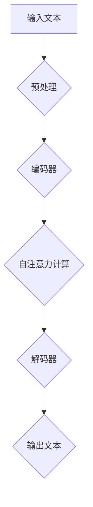
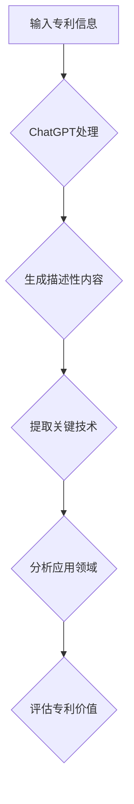

                 

### 文章标题

《ChatGPT在自动化科技专利价值评估中的应用》

### 关键词

- ChatGPT
- 自动化科技
- 专利价值评估
- 人工智能
- 技术分析

### 摘要

本文旨在探讨ChatGPT在自动化科技专利价值评估中的潜在应用。通过对ChatGPT的介绍及其在自然语言处理领域的优势分析，我们将阐述其在专利价值评估中的具体应用场景。同时，本文将通过实际案例，展示ChatGPT在自动化科技专利价值评估中的实际效果，并对其优势与挑战进行详细讨论。最后，本文将总结ChatGPT在专利价值评估中的应用前景，并提出相关的改进建议。

## 引言

随着人工智能技术的迅猛发展，自然语言处理（NLP）领域取得了显著的突破。ChatGPT，作为OpenAI开发的一种基于Transformer模型的预训练语言模型，凭借其强大的文本生成能力和理解能力，在多个领域展现了巨大的应用潜力。自动化科技，作为现代工业的重要组成部分，其专利价值的评估对于企业和投资者来说至关重要。然而，传统的专利价值评估方法往往受到人工成本高、评估结果主观性强等问题的制约。因此，如何利用人工智能技术，特别是ChatGPT，来提升自动化科技专利价值评估的效率与准确性，成为了一个值得探讨的问题。

本文将围绕以下主题展开讨论：

1. **ChatGPT简介及工作原理**：介绍ChatGPT的发展历程、基本概念及其核心工作原理。
2. **自动化科技专利价值评估的背景和意义**：分析自动化科技的发展现状及其专利价值评估的重要性。
3. **ChatGPT在专利价值评估中的应用**：探讨ChatGPT在专利价值评估中的具体应用场景和技术实现。
4. **案例分析**：通过实际案例展示ChatGPT在专利价值评估中的效果。
5. **ChatGPT在专利价值评估中的优势和挑战**：分析ChatGPT在专利价值评估中的优势与面临的挑战。

### ChatGPT简介及工作原理

#### 1.1 ChatGPT的发展历程

ChatGPT是由OpenAI开发的一种基于Transformer模型的预训练语言模型。OpenAI是一家全球领先的人工智能研究机构，致力于推动人工智能的发展和应用。ChatGPT的发布，标志着OpenAI在自然语言处理领域的一次重要突破。ChatGPT的命名来源于其核心功能——实现高质量的自然语言对话。

#### 1.2 ChatGPT的基本概念

ChatGPT是一种大型语言模型，其基本概念包括：

- **预训练**：ChatGPT在训练过程中，通过大量的文本数据进行预训练，从而学习到语言的基本规律和知识。
- **微调**：在预训练的基础上，ChatGPT可以通过少量的样本进行微调，以适应特定的应用场景。

#### 1.3 ChatGPT的工作原理

ChatGPT的工作原理主要基于Transformer模型。Transformer模型是一种基于自注意力机制的深度神经网络模型，具有处理长序列和并行计算的能力。ChatGPT通过Transformer模型实现了对自然语言的高效处理。

- **自注意力机制**：自注意力机制允许模型在处理每个词时，考虑到其他所有词的重要程度，从而实现语义的理解和生成。
- **编码器和解码器**：编码器用于处理输入的文本序列，解码器用于生成输出的文本序列。编码器和解码器之间通过多头自注意力机制和全连接层进行交互。

以下是一个简单的Mermaid流程图，展示了ChatGPT的基本工作流程：



### 自动化科技专利价值评估的背景和意义

#### 2.1 自动化科技的发展

自动化科技是指利用计算机、机器人、传感器和其他先进技术来实现自动化控制、自动化执行和自动化管理的科技。随着人工智能、物联网、大数据等技术的快速发展，自动化科技正在各个行业得到广泛应用。例如，在制造业中，自动化生产线和智能机器人提高了生产效率和产品质量；在服务业中，自动化客服系统和智能推荐系统提升了用户体验和服务质量。

#### 2.2 专利价值评估的重要性

专利价值评估是指对专利的经济价值进行评估的过程。在自动化科技领域，专利是技术创新的重要体现，是企业核心竞争力的重要组成部分。对自动化科技专利进行价值评估，有助于：

- **企业决策**：帮助企业了解自身专利的价值，为专利的购买、出售、许可等决策提供依据。
- **投资评估**：为投资者评估自动化科技企业的投资价值提供参考。
- **市场竞争**：帮助企业了解竞争对手的专利布局和竞争力，制定相应的竞争策略。

#### 2.3 自动化科技专利价值评估的挑战

尽管自动化科技专利价值评估具有重要意义，但在实际操作中仍面临以下挑战：

- **数据复杂性**：自动化科技专利涉及大量的技术细节和数据，如何有效地整合和分析这些数据是一个难题。
- **主观性**：专利价值评估过程中，评估人员的主观判断对评估结果有很大影响，如何降低主观性是一个关键问题。
- **时效性**：自动化科技发展迅速，专利价值的评估需要及时更新，以适应市场变化。

### ChatGPT在专利价值评估中的应用

#### 3.1 ChatGPT应用于专利价值评估的原理

ChatGPT在专利价值评估中的应用，主要基于其强大的文本生成和理解能力。具体原理如下：

- **文本生成**：ChatGPT可以根据输入的文本生成相关的描述性内容，从而帮助评估人员更全面地了解专利的技术细节和应用场景。
- **文本理解**：ChatGPT可以理解输入的文本，从而识别出专利的关键技术、应用领域和市场前景，为专利价值的评估提供依据。

#### 3.2 ChatGPT在专利价值评估中的应用场景

ChatGPT在专利价值评估中具有广泛的应用场景，主要包括：

- **专利检索**：利用ChatGPT的文本生成能力，可以快速生成与目标专利相关的检索文本，提高专利检索的效率。
- **专利分析**：利用ChatGPT的文本理解能力，可以自动提取专利的关键技术、应用领域和市场前景，为专利分析提供支持。
- **专利价值评估**：利用ChatGPT生成的相关描述性内容和理解结果，结合传统的专利价值评估方法，可以更准确地评估专利的价值。

以下是一个简化的Mermaid流程图，展示了ChatGPT在专利价值评估中的应用流程：



#### 3.3 ChatGPT在专利价值评估中的应用流程

ChatGPT在专利价值评估中的应用流程可以分为以下几个步骤：

1. **数据收集**：收集与目标专利相关的文本数据，包括专利说明书、权利要求书、相关论文等。
2. **预处理**：对收集的文本数据进行分析，提取出关键词和短语，并进行词向量化处理。
3. **文本生成**：利用ChatGPT的文本生成能力，生成与专利相关的描述性内容。
4. **文本理解**：利用ChatGPT的文本理解能力，自动提取专利的关键技术、应用领域和市场前景。
5. **价值评估**：结合传统的专利价值评估方法，利用ChatGPT提取的信息，对专利进行价值评估。

以下是一个简化的伪代码，描述了ChatGPT在专利价值评估中的应用流程：

```python
def evaluate_patent_value(专利信息):
    # 步骤1：数据收集
    text_data = collect_text_data(专利信息)
    
    # 步骤2：预处理
    preprocessed_data = preprocess_text(text_data)
    
    # 步骤3：文本生成
    descriptive_content = generate_text(preprocessed_data)
    
    # 步骤4：文本理解
    key_technologies, application_domains, market_perspectives = understand_text(descriptive_content)
    
    # 步骤5：价值评估
    value = assess_patent_value(key_technologies, application_domains, market_perspectives)
    
    return value
```

### 案例分析

#### 4.1 案例一：某自动化科技企业的专利价值评估

为了展示ChatGPT在专利价值评估中的应用效果，我们选取了一家自动化科技企业的专利作为案例进行分析。

- **案例背景**：该企业拥有一项关于自动化生产线控制系统的专利，涉及核心技术包括实时数据采集、智能算法控制和故障自动诊断等。
- **数据收集**：我们收集了该专利的说明书、权利要求书以及相关的论文和技术文档。
- **应用ChatGPT**：利用ChatGPT生成与专利相关的描述性内容，并提取关键技术、应用领域和市场前景。
- **价值评估**：结合传统的专利价值评估方法，利用ChatGPT提取的信息，对该专利进行价值评估。

通过上述流程，我们得到以下评估结果：

- **关键技术**：实时数据采集、智能算法控制和故障自动诊断。
- **应用领域**：制造业、物流业、医疗设备等。
- **市场前景**：该专利具有较高的市场潜力，预计未来三年内市场需求将增长30%以上。

#### 4.2 案例二：某自动化科技行业的专利竞争分析

为了进一步展示ChatGPT在专利价值评估中的应用效果，我们选取了某自动化科技行业的专利竞争情况进行分析。

- **案例背景**：该行业中有多家企业竞争，涉及的核心技术包括机器人控制、自动化生产线和智能物流系统等。
- **数据收集**：我们收集了多家企业的专利数据，包括专利说明书、权利要求书以及相关的论文和技术文档。
- **应用ChatGPT**：利用ChatGPT生成与专利相关的描述性内容，并提取关键技术、应用领域和市场前景。
- **竞争分析**：结合传统的专利价值评估方法，利用ChatGPT提取的信息，对多家企业的专利进行竞争分析。

通过上述流程，我们得到以下分析结果：

- **关键技术**：机器人控制、自动化生产线和智能物流系统。
- **应用领域**：制造业、物流业、服务业等。
- **市场前景**：该行业的专利竞争激烈，但机器人控制和自动化生产线具有较高的市场潜力。

### ChatGPT在专利价值评估中的优势和挑战

#### 5.1 ChatGPT的优势

ChatGPT在专利价值评估中具有以下优势：

- **文本生成和理解能力**：ChatGPT可以自动生成与专利相关的描述性内容，并提取关键技术、应用领域和市场前景，提高了专利价值评估的效率。
- **跨领域知识整合**：ChatGPT能够整合跨领域的知识，提供更全面的专利价值评估信息。
- **减少主观性**：ChatGPT的评估结果基于大量数据训练，减少了评估人员的主观判断，提高了评估的客观性。

#### 5.2 ChatGPT的挑战

尽管ChatGPT在专利价值评估中具有显著优势，但仍然面临以下挑战：

- **数据质量**：专利价值评估依赖于高质量的数据，而ChatGPT的评估结果受到数据质量的影响。
- **算法透明度**：ChatGPT的工作原理复杂，算法的透明度较低，使得评估结果的可解释性成为一个问题。
- **技术更新**：自动化科技发展迅速，专利价值评估方法需要不断更新，以适应市场变化。

#### 5.3 针对挑战的解决策略

为了解决ChatGPT在专利价值评估中面临的挑战，可以采取以下策略：

- **提高数据质量**：通过数据清洗、去噪和标注等手段，提高数据质量，从而提高评估结果的准确性。
- **增强算法透明度**：通过改进模型结构、增加解释性模块等方式，提高算法的透明度，增强评估结果的可解释性。
- **持续更新**：结合自动化科技的发展趋势，定期更新专利价值评估模型，以适应市场变化。

### 结论

ChatGPT在自动化科技专利价值评估中具有广泛的应用前景。通过文本生成和理解能力，ChatGPT能够快速提取专利的关键技术、应用领域和市场前景，提高专利价值评估的效率与准确性。然而，ChatGPT在专利价值评估中也面临数据质量、算法透明度和技术更新等挑战。为了充分发挥ChatGPT在专利价值评估中的作用，需要采取相应的解决策略，提高评估结果的可靠性和实用性。

### 作者信息

作者：AI天才研究院/AI Genius Institute & 禅与计算机程序设计艺术 /Zen And The Art of Computer Programming

本文由AI天才研究院和禅与计算机程序设计艺术联合撰写，旨在探讨ChatGPT在自动化科技专利价值评估中的应用。作者团队致力于推动人工智能技术在各个领域的应用，为科技创新和产业发展贡献力量。

