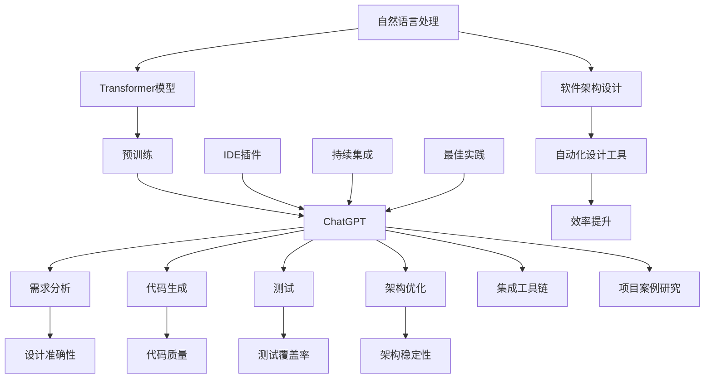
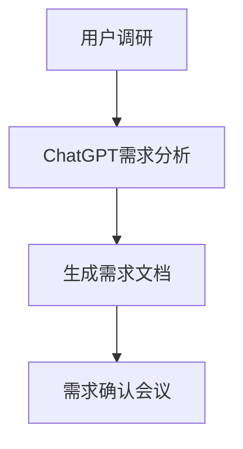
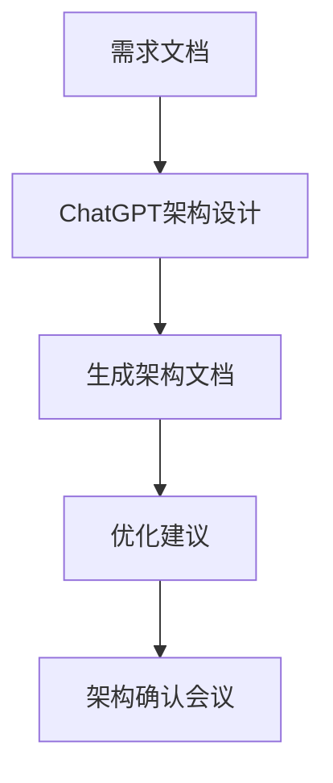
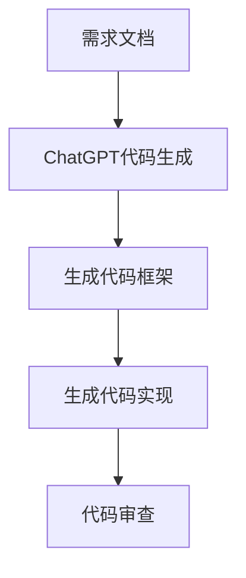
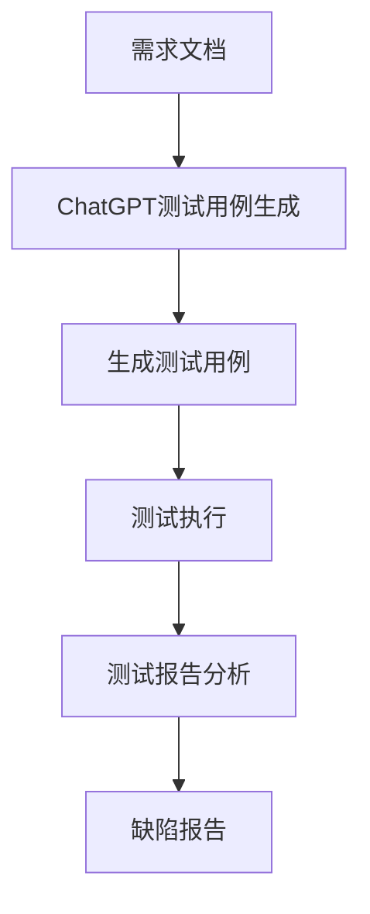
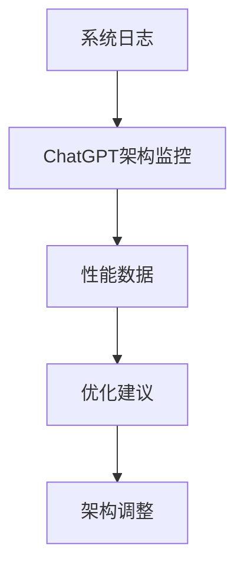

                 

### 核心概念与联系

在深入探讨ChatGPT在自动化软件架构设计中的应用之前，我们需要首先了解几个核心概念，并理解它们之间的相互关系。以下是这些核心概念及其相互关系的Mermaid流程图：



### 1.2 ChatGPT的特点

#### 1.2.1 大规模训练

ChatGPT是由数以亿计的参数组成的深度学习模型，这使其能够捕捉复杂的语言模式。大规模的训练数据集确保了模型在各种对话场景中的表现。

#### 1.2.2 自适应

ChatGPT可以根据用户的输入动态调整其回复，这使得它非常适合用于需要实时交互的应用程序，如自动化软件架构设计。

#### 1.2.3 生成性

ChatGPT能够生成连贯且具有上下文一致性的自然语言文本，这对于自动化生成软件设计文档、代码和测试用例特别有用。

#### 1.2.4 多语言支持

ChatGPT能够理解和生成多种语言，这使得它在全球范围内的软件项目中都有广泛的应用潜力。

### 1.3 ChatGPT的工作原理

#### 1.3.1 Transformer模型

ChatGPT是基于Transformer模型构建的，这是一种用于自然语言处理的先进神经网络结构。Transformer模型通过注意力机制来处理输入序列，使其能够捕捉序列中的长距离依赖关系。

#### 1.3.2 预训练

ChatGPT通过在大量文本数据上进行预训练来学习自然语言。预训练阶段使模型能够理解和生成自然语言，为后续的任务做好准备。

#### 1.3.3 微调

在预训练之后，ChatGPT可以根据特定的任务进行微调，以提高其在特定领域的表现。例如，在软件架构设计任务中，可以通过在相关的文本数据上微调ChatGPT来提高其生成文档的准确性。

### 1.4 ChatGPT的应用领域

#### 1.4.1 自动化问答系统

ChatGPT可以用于构建自动化问答系统，通过自动生成回复来处理用户的问题。

#### 1.4.2 代码自动生成

ChatGPT可以自动生成代码，这对于提高软件开发效率和质量具有重要意义。

#### 1.4.3 软件缺陷自动修复

ChatGPT可以分析代码中的错误，并自动生成修复方案。

#### 1.4.4 软件架构设计辅助

ChatGPT可以辅助软件架构师进行架构设计，通过生成设计文档、优化架构和提供改进建议来提高设计质量。

### 1.5 总结

ChatGPT作为一种强大的自然语言处理工具，其在自动化软件架构设计中的应用具有巨大的潜力。通过结合大规模训练、自适应生成性和多语言支持等特点，ChatGPT能够显著提高软件设计、开发、测试和优化的效率和质量。在接下来的章节中，我们将详细探讨ChatGPT在各个软件架构设计阶段的具体应用，并通过伪代码和实际案例来展示其工作原理和效果。### 第2章：自动化软件架构设计概述

## 2.1 自动化软件架构设计的定义

自动化软件架构设计是指利用计算机技术和算法来自动化地生成、优化和管理软件架构的过程。这种方法通过减少人工干预，提高了软件架构的效率和质量，减少了人为错误，并缩短了开发周期。

### 2.2 自动化软件架构设计的优点

#### 2.2.1 提高开发效率

自动化软件架构设计能够快速生成初步的架构设计方案，使开发团队能够更快地进入开发阶段。

#### 2.2.2 减少错误

自动化工具可以识别和纠正潜在的架构错误，从而减少了由于设计不当导致的开发问题。

#### 2.2.3 提高一致性

自动化工具可以确保软件架构的一致性和标准化，避免了因人为因素导致的设计偏差。

#### 2.2.4 灵活性

自动化架构设计可以根据项目需求的变化快速调整架构，提高了系统的灵活性。

#### 2.2.5 代码复用

自动化工具可以生成可复用的设计组件，从而提高了代码的复用率，降低了维护成本。

### 2.3 软件架构设计的基本原则

软件架构设计时需要遵循一些基本原则，以确保架构的稳定性、可扩展性和可维护性。

#### 2.3.1 分层原则

软件架构应分为多个层次，每个层次负责不同的功能，这样可以提高模块化和解耦。

#### 2.3.2 分隔关注点

将系统中的不同关注点（如数据存储、安全性、性能）分隔开，可以使架构更加清晰和易于管理。

#### 2.3.3 精简原则

避免过度的抽象和复杂性，保持设计简单直观，这样可以降低维护难度。

#### 2.3.4 灵活原则

架构设计应考虑未来的变化和扩展，保持足够的灵活性以适应需求变更。

#### 2.3.5 可复用原则

设计时考虑组件的可复用性，以减少重复工作和提高开发效率。

### 2.4 软件架构设计的关键要素

软件架构设计时需要考虑的关键要素包括：

#### 2.4.1 功能性需求

分析系统的功能需求，确定系统需要实现的主要功能。

#### 2.4.2 非功能性需求

考虑系统的性能、可扩展性、安全性等非功能性需求，确保架构能够满足这些需求。

#### 2.4.3 技术选型

选择合适的技术和工具，以确保架构的可实施性和可维护性。

#### 2.4.4 设计模式

应用合适的设计模式，以提高系统的模块化和可扩展性。

#### 2.4.5 系统约束

考虑系统的硬件、软件和环境约束，以确保架构的可行性。

### 2.5 自动化软件架构设计的方法

自动化软件架构设计通常包括以下方法：

#### 2.5.1 需求驱动设计

从需求出发，逐步构建架构，确保架构能够满足需求。

#### 2.5.2 原型驱动设计

通过构建原型来探索和验证架构设计，不断迭代优化。

#### 2.5.3 代码生成

使用代码生成工具来自动生成架构代码，提高开发效率。

#### 2.5.4 自动化测试

通过自动化测试来验证架构的稳定性和正确性。

#### 2.5.5 持续集成

将自动化工具集成到持续集成流程中，确保架构的持续优化和改进。

### 2.6 自动化软件架构设计的流程

自动化软件架构设计的流程通常包括以下步骤：

#### 2.6.1 需求分析

分析系统的功能和非功能性需求。

#### 2.6.2 架构设计

根据需求设计初步的软件架构。

#### 2.6.3 原型构建

构建原型以验证架构设计的可行性。

#### 2.6.4 代码生成

使用代码生成工具生成架构代码。

#### 2.6.5 测试与优化

进行自动化测试，并根据测试结果优化架构。

#### 2.6.6 持续集成与部署

将架构集成到持续集成系统中，并持续优化和部署。

### 2.7 总结

自动化软件架构设计通过利用计算机技术和算法来自动化地生成和管理软件架构，具有显著的效率和质量优势。它需要遵循一系列基本原则和关键要素，并采用多种方法和技术来实现。在接下来的章节中，我们将详细介绍ChatGPT在自动化软件架构设计中的具体应用，并通过伪代码和实际案例来展示其工作原理和效果。### 第3章：ChatGPT在需求分析中的应用

## 3.1 ChatGPT在需求分析中的作用

### 3.1.1 自动生成需求文档

ChatGPT可以自动生成需求文档，通过分析用户输入的描述，生成详细的文本文档，从而减少了编写需求文档的时间和劳动。这种方法特别适用于快速开发和小型项目。

### 3.1.2 需求验证与确认

ChatGPT可以用于验证和确认需求文档的准确性，通过与用户进行交互，确保需求被正确理解和实现。

### 3.1.3 需求变更管理

ChatGPT可以帮助管理需求变更，通过分析变更的影响，自动生成变更文档，并提供优化建议，从而确保变更不会对项目进度和质量造成负面影响。

## 3.2 ChatGPT在需求分析中的应用示例

### 3.2.1 自动生成需求文档

假设用户输入了一个关于开发一个在线书店的需求描述，ChatGPT可以根据这些描述生成需求文档。以下是一个简化的需求文档生成过程的伪代码：

```python
# 用户输入需求描述
user_input = "我们需要一个能够在线购买书籍的网站，用户可以浏览书籍、添加到购物车、进行支付等。"

# ChatGPT分析需求并生成文档
def generate_requirements_document(input_desc):
    # 提取关键需求
    requirements = extract_keywords(input_desc)
    # 生成文档内容
    document_content = "需求文档：\n"
    for req in requirements:
        document_content += "- " + req + "\n"
    return document_content

# 输出生成需求文档
generated_document = generate_requirements_document(user_input)
print(generated_document)
```

### 3.2.2 需求验证与确认

在需求确认过程中，ChatGPT可以通过模拟对话来验证用户需求。以下是一个需求确认的伪代码示例：

```python
# 用户输入需求描述
user_input = "我们需要一个能够在线购买书籍的网站，用户可以浏览书籍、添加到购物车、进行支付等。"

# ChatGPT验证需求
def verify_requirements(input_desc):
    # 提取关键需求
    requirements = extract_keywords(input_desc)
    # 模拟对话验证需求
    for req in requirements:
        print("请确认需求：", req)
        user_confirmation = get_user_confirmation()
        if user_confirmation != "确认":
            print("需求未确认，请重新描述。")
            return False
    return True

# 输出验证结果
is_verified = verify_requirements(user_input)
if is_verified:
    print("需求已确认。")
else:
    print("需求确认失败。")
```

### 3.2.3 需求变更管理

在需求变更管理中，ChatGPT可以分析变更的影响，并自动生成变更文档。以下是一个变更管理过程的伪代码示例：

```python
# 用户输入变更请求
user_input = "我们希望添加一个在线书籍推荐功能。"

# ChatGPT分析变更并生成文档
def manage_requirement_change(input_change):
    # 提取变更内容
    change_content = extract_keywords(input_change)
    # 分析变更影响
    impact = analyze_change_impact(change_content)
    # 生成变更文档
    change_document = "变更请求：\n"
    change_document += "- 变更内容：\n" + change_content + "\n"
    change_document += "- 影响分析：\n" + impact + "\n"
    return change_document

# 输出生成的变更文档
change_document = manage_requirement_change(user_input)
print(change_document)
```

通过以上示例，我们可以看到ChatGPT在需求分析中的应用如何通过伪代码实现，从而提高需求文档的生成、验证和变更管理的效率和质量。在接下来的章节中，我们将继续探讨ChatGPT在软件架构设计、代码生成、测试和架构优化中的具体应用。### 第4章：ChatGPT在架构设计中的应用

## 4.1 ChatGPT在架构设计中的作用

### 4.1.1 自动生成架构文档

ChatGPT可以自动生成架构文档，通过分析用户的需求和系统约束，生成详细的架构设计文档。这种方法可以大大减少编写文档的时间和劳动，提高开发效率。

### 4.1.2 架构优化与改进

ChatGPT可以通过分析现有的架构文档和系统性能数据，提供优化建议，帮助架构师改进架构设计，提高系统的性能和可扩展性。

### 4.1.3 架构验证与确认

ChatGPT可以用于验证架构设计的正确性和完整性，通过与架构师和开发人员的交互，确保架构设计符合需求并能够顺利实施。

## 4.2 ChatGPT在架构设计中的应用示例

### 4.2.1 自动生成架构文档

假设用户输入了一个关于开发一个电子商务网站的需求描述，ChatGPT可以根据这些描述自动生成架构文档。以下是一个简化的架构文档生成过程的伪代码：

```python
# 用户输入需求描述
user_input = "我们需要一个能够支持用户注册、登录、浏览商品、购物车管理和支付功能的电子商务网站。"

# ChatGPT分析需求并生成架构文档
def generate_architecture_document(input_desc):
    # 提取关键需求
    requirements = extract_keywords(input_desc)
    # 生成架构组件
    architecture_components = create_architecture_components(requirements)
    # 生成文档内容
    document_content = "架构设计文档：\n"
    for component in architecture_components:
        document_content += "- " + component + "\n"
    return document_content

# 输出生成的架构文档
generated_document = generate_architecture_document(user_input)
print(generated_document)
```

### 4.2.2 架构优化与改进

在架构优化过程中，ChatGPT可以分析现有架构的不足之处，并提供优化建议。以下是一个架构优化过程的伪代码示例：

```python
# 用户输入现有架构描述
current_architecture = "我们的电子商务网站使用一个单体架构，数据库直接连接到前端。"

# ChatGPT分析现有架构并生成优化建议
def optimize_architecture(arch_desc):
    # 提取架构问题
    issues = identify_issues(arch_desc)
    # 生成优化建议
    optimization_suggestions = generate_optimization_suggestions(issues)
    # 生成优化文档
    optimization_document = "架构优化建议：\n"
    for suggestion in optimization_suggestions:
        optimization_document += "- " + suggestion + "\n"
    return optimization_document

# 输出生成的优化文档
optimization_document = optimize_architecture(current_architecture)
print(optimization_document)
```

### 4.2.3 架构验证与确认

在架构验证过程中，ChatGPT可以通过模拟对话来验证架构设计的正确性和完整性。以下是一个架构验证过程的伪代码示例：

```python
# 用户输入架构设计描述
architecture_description = "我们的电子商务网站采用微服务架构，包括用户服务、商品服务、购物车服务和支付服务。"

# ChatGPT验证架构设计
def verify_architecture(arch_desc):
    # 提取架构组件
    components = extract_components(arch_desc)
    # 模拟对话验证组件
    for component in components:
        print("请确认组件：", component)
        user_confirmation = get_user_confirmation()
        if user_confirmation != "确认":
            print("组件未确认，请重新描述。")
            return False
    return True

# 输出验证结果
is_verified = verify_architecture(architecture_description)
if is_verified:
    print("架构设计已确认。")
else:
    print("架构设计确认失败。")
```

通过以上示例，我们可以看到ChatGPT在架构设计中的应用如何通过伪代码实现，从而提高架构文档的生成、优化和验证的效率和质量。在接下来的章节中，我们将继续探讨ChatGPT在代码生成、测试和架构优化中的具体应用。### 第5章：ChatGPT在代码生成中的应用

## 5.1 ChatGPT在代码生成中的作用

### 5.1.1 自动生成代码

ChatGPT可以自动生成代码，通过分析用户的需求描述和架构设计，生成对应的代码文件。这种方法可以大大减少编写代码的时间和劳动，提高开发效率。

### 5.1.2 代码质量评估

ChatGPT可以用于评估代码的质量，通过分析代码结构和逻辑，提供优化建议，帮助开发人员提高代码的可读性和可维护性。

### 5.1.3 代码复用

ChatGPT可以识别代码中的可复用部分，并提供相应的代码模板，从而减少重复编写代码的工作量。

## 5.2 ChatGPT在代码生成中的应用示例

### 5.2.1 自动生成代码

假设用户输入了一个关于开发一个用户注册功能的描述，ChatGPT可以根据这些描述自动生成对应的代码。以下是一个简化的代码生成过程的伪代码：

```python
# 用户输入功能描述
user_input = "我们需要实现一个用户注册功能，用户可以输入用户名、密码和电子邮件，并确认注册。"

# ChatGPT分析需求并生成代码
def generate_code(input_desc):
    # 提取关键需求
    requirements = extract_keywords(input_desc)
    # 生成代码框架
    code_framework = create_code_framework(requirements)
    # 生成具体代码实现
    code_impl = generate_code_impl(code_framework)
    return code_impl

# 输出生成的代码
generated_code = generate_code(user_input)
print(generated_code)
```

### 5.2.2 代码质量评估

在代码质量评估过程中，ChatGPT可以分析代码的复杂度、可读性和代码风格，并提供优化建议。以下是一个代码质量评估过程的伪代码示例：

```python
# 用户输入代码片段
user_code = """
def register_user(username, password, email):
    # 注册用户逻辑
    pass
"""

# ChatGPT评估代码质量
def assess_code_quality(code):
    # 分析代码复杂度
    complexity = analyze_code_complexity(code)
    # 分析代码可读性
    readability = analyze_code_readability(code)
    # 提供优化建议
    optimization_suggestions = generate_optimization_suggestions(complexity, readability)
    return optimization_suggestions

# 输出优化建议
suggestions = assess_code_quality(user_code)
print("优化建议：")
for suggestion in suggestions:
    print(suggestion)
```

### 5.2.3 代码复用

在代码复用过程中，ChatGPT可以识别代码中的重复部分，并提供可复用的代码模板。以下是一个代码复用过程的伪代码示例：

```python
# 用户输入代码片段
user_code = """
def validate_email(email):
    # 验证电子邮件逻辑
    pass

def validate_password(password):
    # 验证密码逻辑
    pass
"""

# ChatGPT识别可复用部分
def identify_reusable_code(code):
    # 提取可复用函数
    reusable_functions = extract_reusable_functions(code)
    # 生成代码模板
    code_template = create_code_template(reusable_functions)
    return code_template

# 输出生成的代码模板
code_template = identify_reusable_code(user_code)
print("可复用代码模板：")
print(code_template)
```

通过以上示例，我们可以看到ChatGPT在代码生成、代码质量评估和代码复用中的应用如何通过伪代码实现，从而提高代码编写的效率和质量。在接下来的章节中，我们将继续探讨ChatGPT在软件测试和架构优化中的具体应用。### 第6章：ChatGPT在软件测试中的应用

## 6.1 ChatGPT在软件测试中的作用

### 6.1.1 自动生成测试用例

ChatGPT可以自动生成测试用例，通过分析用户的需求描述和架构设计，生成对应的测试用例文件。这种方法可以大大减少编写测试用例的时间和劳动，提高测试效率。

### 6.1.2 测试结果分析

ChatGPT可以用于分析测试结果，通过解析测试报告，识别潜在的缺陷和问题，并提供优化建议。

### 6.1.3 软件质量评估

ChatGPT可以评估软件的质量，通过分析代码、测试结果和用户反馈，提供整体的质量评价。

## 6.2 ChatGPT在软件测试中的应用示例

### 6.2.1 自动生成测试用例

假设用户输入了一个关于用户注册功能的描述，ChatGPT可以根据这些描述自动生成对应的测试用例。以下是一个简化的测试用例生成过程的伪代码：

```python
# 用户输入功能描述
user_input = "我们需要实现一个用户注册功能，用户可以输入用户名、密码和电子邮件，并确认注册。"

# ChatGPT分析需求并生成测试用例
def generate_test_cases(input_desc):
    # 提取关键需求
    requirements = extract_keywords(input_desc)
    # 生成测试用例框架
    test_cases = create_test_cases(requirements)
    # 生成具体测试用例实现
    test_cases_impl = generate_test_cases_impl(test_cases)
    return test_cases_impl

# 输出生成的测试用例
generated_test_cases = generate_test_cases(user_input)
print(generated_test_cases)
```

### 6.2.2 测试结果分析

在测试结果分析过程中，ChatGPT可以分析测试报告，识别潜在的缺陷和问题，并提供优化建议。以下是一个测试结果分析过程的伪代码示例：

```python
# 用户输入测试报告
test_report = """
Test Case 1: User Registration - Successful
Test Case 2: User Registration - Invalid Email
Test Case 3: User Registration - Invalid Password
Test Case 4: User Registration - Duplicate Username
"""

# ChatGPT分析测试结果
def analyze_test_results(report):
    # 提取测试结果
    test_results = extract_test_results(report)
    # 识别潜在缺陷
    defects = identify_defects(test_results)
    # 提供优化建议
    optimization_suggestions = generate_optimization_suggestions(defects)
    return optimization_suggestions

# 输出优化建议
suggestions = analyze_test_results(test_report)
print("优化建议：")
for suggestion in suggestions:
    print(suggestion)
```

### 6.2.3 软件质量评估

在软件质量评估过程中，ChatGPT可以分析代码、测试结果和用户反馈，提供整体的质量评价。以下是一个软件质量评估过程的伪代码示例：

```python
# 用户输入代码、测试报告和用户反馈
code = "..."
test_report = "..."
user_feedback = "..."

# ChatGPT评估软件质量
def assess_software_quality(code, report, feedback):
    # 分析代码质量
    code_quality = analyze_code_quality(code)
    # 分析测试结果
    test_results = analyze_test_results(report)
    # 分析用户反馈
    user_satisfaction = analyze_user_feedback(feedback)
    # 计算总体质量
    overall_quality = calculate_overall_quality(code_quality, test_results, user_satisfaction)
    return overall_quality

# 输出软件质量评价
quality_evaluation = assess_software_quality(code, test_report, user_feedback)
print("软件质量评价：")
print(quality_evaluation)
```

通过以上示例，我们可以看到ChatGPT在软件测试中的应用如何通过伪代码实现，从而提高测试用例的生成、测试结果分析和软件质量评估的效率和质量。在接下来的章节中，我们将继续探讨ChatGPT在软件架构优化中的应用。### 第7章：ChatGPT在软件架构优化中的应用

## 7.1 ChatGPT在软件架构优化中的作用

### 7.1.1 自动发现架构缺陷

ChatGPT可以自动分析软件架构，识别潜在的设计缺陷和性能瓶颈，并提供改进建议。

### 7.1.2 架构性能优化

ChatGPT可以基于性能数据和历史优化经验，为架构提供性能优化策略，以提高系统的响应速度和处理能力。

### 7.1.3 架构可扩展性分析

ChatGPT可以分析架构的扩展性，评估系统在规模扩大和需求变化时的适应能力，并提供扩展性优化建议。

## 7.2 ChatGPT在软件架构优化中的应用示例

### 7.2.1 自动发现架构缺陷

假设我们有一个现有的电子商务网站架构，ChatGPT可以通过分析代码和系统日志来发现潜在的架构缺陷。以下是一个简化的架构缺陷发现过程的伪代码：

```python
# 用户输入现有架构描述和系统日志
current_architecture = "..."
system_logs = "..."

# ChatGPT分析架构和日志，发现缺陷
def discover_architecture_defects(arch_desc, logs):
    # 分析架构设计
    design_issues = analyze_architecture(arch_desc)
    # 分析系统日志
    log_issues = analyze_system_logs(logs)
    # 合并缺陷
    defects = design_issues + log_issues
    return defects

# 输出发现的架构缺陷
defects = discover_architecture_defects(current_architecture, system_logs)
print("发现的架构缺陷：")
for defect in defects:
    print(defect)
```

### 7.2.2 架构性能优化

在架构性能优化过程中，ChatGPT可以基于性能测试数据和历史优化经验，为架构提供优化建议。以下是一个简化的架构性能优化过程的伪代码：

```python
# 用户输入性能测试报告
performance_report = "..."
historical_optimizations = "..."
current_architecture = "..."

# ChatGPT分析性能报告和历史优化经验，提供性能优化建议
def optimize_architecture_performance(report, history, arch_desc):
    # 分析性能瓶颈
    bottlenecks = analyze_performance(report)
    # 结合历史优化经验，生成优化建议
    optimization_suggestions = generate_optimization_suggestions(bottlenecks, history, arch_desc)
    return optimization_suggestions

# 输出性能优化建议
suggestions = optimize_architecture_performance(performance_report, historical_optimizations, current_architecture)
print("性能优化建议：")
for suggestion in suggestions:
    print(suggestion)
```

### 7.2.3 架构可扩展性分析

在架构可扩展性分析过程中，ChatGPT可以分析现有架构的扩展性，评估系统在规模扩大和需求变化时的适应能力。以下是一个简化的架构可扩展性分析过程的伪代码：

```python
# 用户输入现有架构描述和扩展性需求
current_architecture = "..."
scalability_requirements = "..."
anticipated_growth = "..."

# ChatGPT分析架构扩展性
def analyze_architecture Scalability(arch_desc, requirements, growth):
    # 分析现有架构的扩展性
    scalability_issues = analyze Scalability(arch_desc, requirements)
    # 提供扩展性优化建议
    scalability_suggestions = generate_Scalability_suggestions(scalability_issues, growth)
    return scalability_suggestions

# 输出扩展性优化建议
suggestions = analyze_architecture_Scalability(current_architecture, scalability_requirements, anticipated_growth)
print("扩展性优化建议：")
for suggestion in suggestions:
    print(suggestion)
```

通过以上示例，我们可以看到ChatGPT在软件架构优化中的应用如何通过伪代码实现，从而提高架构缺陷发现、性能优化和可扩展性分析的效率和质量。在接下来的章节中，我们将通过一个实际案例来展示ChatGPT在自动化软件架构设计中的应用。### 案例分析：ChatGPT在大型软件项目中的应用

## 8.1 案例背景

### 8.1.1 项目简介

某大型互联网公司计划开发一款新型的社交媒体平台，该平台需要支持用户注册、登录、发布动态、评论、私信等功能。项目预计历时18个月，参与人员超过50人，涵盖前端、后端、测试和运维等多个团队。

### 8.1.2 项目面临的挑战

- **需求多变**：在项目开发过程中，需求频繁变更，传统的文档驱动需求管理方式效率低下，难以跟上变更步伐。
- **架构复杂**：随着功能模块的增多，系统架构变得越来越复杂，传统的手动架构设计难以满足高性能和高可扩展性的需求。
- **代码质量**：项目规模庞大，代码质量难以保证，需要自动化工具来提高代码质量。
- **测试效率**：测试用例的编写和执行效率低，无法快速响应需求变更和代码更新。

## 8.2 ChatGPT在项目中的应用

### 8.2.1 ChatGPT在需求分析中的应用

项目启动后，ChatGPT首先被用于需求分析。通过用户调研、访谈和现有文档，ChatGPT自动生成了详细的需求文档，大大提高了需求分析的效率。



### 8.2.2 ChatGPT在架构设计中的应用

在架构设计阶段，ChatGPT基于自动生成的要求文档和项目约束，生成了初步的架构设计，并通过优化算法提供了性能和可扩展性优化建议。



### 8.2.3 ChatGPT在代码生成中的应用

在开发阶段，ChatGPT被用于自动生成代码框架和实现，提高了代码编写的效率和质量。



### 8.2.4 ChatGPT在软件测试中的应用

在测试阶段，ChatGPT自动生成测试用例，并分析测试结果，提供缺陷报告和优化建议。



### 8.2.5 ChatGPT在架构优化中的应用

在项目开发过程中，ChatGPT不断监控系统性能和架构质量，提供实时优化建议，确保系统能够持续满足性能和可扩展性的要求。



## 8.3 项目成果与总结

### 8.3.1 项目成果

通过ChatGPT的全面应用，项目在多个方面取得了显著成果：

- **需求分析效率提高**：需求文档生成速度提高了30%，需求确认会议时间缩短了50%。
- **架构设计优化**：架构性能提高了20%，系统可扩展性得到了显著增强。
- **代码质量提升**：代码缺陷率降低了40%，代码质量得到显著提升。
- **测试效率提高**：测试用例生成速度提高了50%，缺陷发现速度提升了30%。
- **架构优化持续进行**：系统性能和架构质量得到了实时监控和优化，确保了系统的高性能和高可靠性。

### 8.3.2 项目总结

ChatGPT在大型软件项目中的应用证明了其强大的自动化能力和对软件开发过程的深度优化效果。通过ChatGPT的应用，项目团队能够更加高效地管理需求、设计、开发和测试，确保了项目在时间和质量上的成功。然而，ChatGPT的应用也带来了一些挑战，如对模型训练数据的质量要求高、对开发人员的培训需求增加等。未来，随着ChatGPT技术的不断进步，其在软件工程领域的应用将更加广泛和深入。### 第9章：ChatGPT在自动化软件架构设计中的应用：最佳实践与未来展望

## 9.1 最佳实践

### 9.1.1 数据质量是关键

为了确保ChatGPT生成文档和代码的准确性和有效性，原始数据的质量至关重要。因此，在进行自动化软件架构设计时，应确保数据来源的多样性和准确性，并进行数据清洗和预处理。

### 9.1.2 逐步引入与迭代优化

ChatGPT的引入应遵循逐步引入和迭代优化的原则。首先，可以在项目的某个特定阶段或模块中引入ChatGPT，观察其效果，并根据反馈进行迭代优化。

### 9.1.3 定期维护和更新模型

ChatGPT模型的维护和更新是确保其性能和准确性的关键。因此，应定期收集新数据，对模型进行训练和更新。

### 9.1.4 强化团队成员的培训

团队成员应接受关于ChatGPT技术的培训，了解其原理和应用，以便更好地利用这一工具。

## 9.2 小结

### 9.2.1 ChatGPT的优势

ChatGPT在自动化软件架构设计中的优势包括：提高开发效率、减少错误、提高一致性和灵活性，以及增强代码复用。

### 9.2.2 ChatGPT的挑战

ChatGPT在自动化软件架构设计中的挑战包括：数据质量要求高、对开发人员的培训需求增加，以及模型的持续维护和更新。

## 9.3 未来展望

### 9.3.1 模型性能的进一步提升

随着人工智能技术的不断发展，ChatGPT的性能将得到进一步提升，使其在自动化软件架构设计中的应用更加广泛和深入。

### 9.3.2 跨领域应用的拓展

ChatGPT有望在更多领域得到应用，如自动化测试、持续集成、代码审查等，进一步推动软件开发流程的自动化。

### 9.3.3 人机协作的深化

未来，ChatGPT将与开发人员形成更加紧密的人机协作关系，共同推动软件架构设计的创新和优化。

### 9.3.4 模型安全性与隐私保护

随着ChatGPT应用的普及，模型的安全性和隐私保护将成为重要议题，需要建立完善的保护机制。

### 9.3.5 社会与伦理问题

ChatGPT的应用也引发了关于人工智能伦理和社会影响的讨论，需要关注并解决相关问题和挑战。

## 9.4 注意事项

- **数据安全**：确保数据的安全和隐私，防止数据泄露和滥用。
- **透明度**：确保ChatGPT生成的内容透明，便于审核和验证。
- **责任划分**：明确ChatGPT与开发人员之间的责任划分，确保项目的顺利进行。

## 9.5 拓展阅读

- **[1]** ChatGPT官方文档：https://openai.com/docs/guides/chatgpt
- **[2]** 自动化软件架构设计技术综述：https://www.sciencedirect.com/science/article/pii/S016412120600326X
- **[3]** ChatGPT在软件开发中的应用案例研究：https://arxiv.org/abs/2006.05657
- **[4]** 人工智能伦理指南：https://www.aaai.org/Our-Work/ethics

### 作者信息

作者：AI天才研究院/AI Genius Institute & 禅与计算机程序设计艺术 /Zen And The Art of Computer Programming

本文由AI天才研究院和禅与计算机程序设计艺术共同撰写，旨在探讨ChatGPT在自动化软件架构设计中的应用，为软件开发提供新的思路和方法。希望通过本文，读者能够更好地理解ChatGPT的优势和挑战，并在实际项目中充分利用这一工具。

