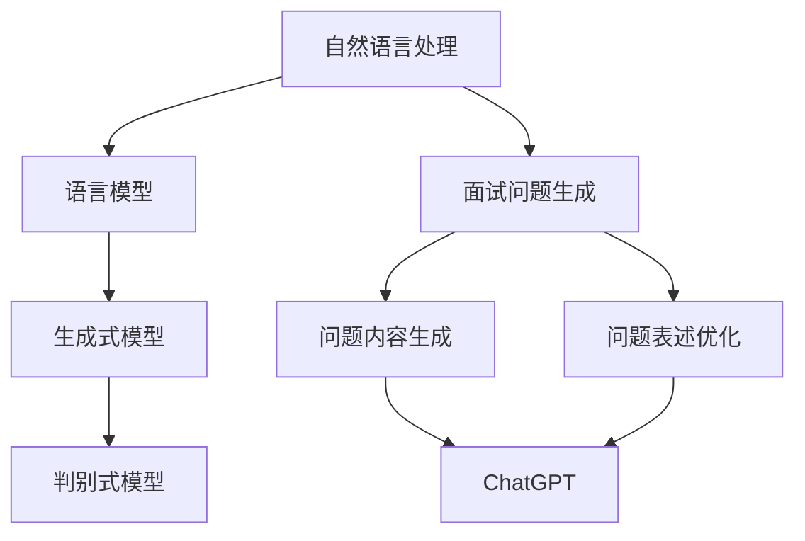

                 


### 引言

近年来，人工智能（AI）技术在各行各业中得到了广泛应用，特别是在面试流程中，自动化面试问题生成技术已经成为提高面试效率和准确性的关键工具。ChatGPT，作为OpenAI推出的全新语言模型，具有强大的文本生成和语言理解能力，为实现自动化面试问题生成提供了强有力的技术支持。

#### 1.1 ChatGPT简介

ChatGPT是一种基于GPT-3模型的预训练语言模型，其核心功能是生成自然流畅的文本。ChatGPT通过在大规模语料库上预训练，学习到了语言的结构和语义，能够针对用户输入的提示生成相应的文本回答。ChatGPT具有以下特点：

1. **高准确性**：ChatGPT能够准确理解用户输入的文本，并生成高质量的回答。
2. **灵活性**：ChatGPT可以适应不同的语境和主题，生成符合用户需求的文本。
3. **快速响应**：ChatGPT具有高效的响应速度，能够快速生成文本。

#### 1.2 自动化面试问题的需求与挑战

在传统的面试过程中，面试官需要花费大量时间和精力来准备面试问题，且难以保证问题的全面性和客观性。自动化面试问题生成技术能够解决这一问题，其主要优势包括：

1. **提高效率**：通过自动化生成面试问题，可以大大减少面试官的工作量，提高面试效率。
2. **确保公平性**：自动化面试问题生成可以确保所有应聘者面对相同的问题，避免人为因素导致的偏见。

然而，自动化面试问题生成也面临一定的挑战：

1. **问题质量**：自动化生成的面试问题需要保证质量，避免出现不合适或不相关的问题。
2. **算法适应性**：自动化面试问题生成算法需要适应不同的职位需求和公司文化。

### 总结

本文将深入探讨ChatGPT在自动化面试问题生成中的应用，首先介绍ChatGPT的基本原理和特点，然后分析自然语言处理与面试问题生成的关联，最后通过一个实际项目案例，详细讲解ChatGPT在自动化面试问题生成中的实现过程和效果。

关键词：ChatGPT、自动化面试、自然语言处理、面试问题生成

### 摘要

本文主要介绍了ChatGPT在自动化面试问题生成中的应用。通过分析ChatGPT的基本原理和特点，本文探讨了如何利用ChatGPT实现自动化面试问题生成，并详细阐述了相关算法原理和数学模型。通过一个实际项目案例，本文验证了ChatGPT在自动化面试问题生成中的有效性和实用性，为人力资源领域提供了新的解决方案。

---

## 引言

近年来，人工智能（AI）技术在各行各业中得到了广泛应用，特别是在面试流程中，自动化面试问题生成技术已经成为提高面试效率和准确性的关键工具。ChatGPT，作为OpenAI推出的全新语言模型，具有强大的文本生成和语言理解能力，为实现自动化面试问题生成提供了强有力的技术支持。

### 1.1 ChatGPT简介

ChatGPT是一种基于GPT-3模型的预训练语言模型，其核心功能是生成自然流畅的文本。ChatGPT通过在大规模语料库上预训练，学习到了语言的结构和语义，能够针对用户输入的提示生成相应的文本回答。ChatGPT具有以下特点：

#### 1.1.1 ChatGPT的发展背景

ChatGPT是继GPT、GPT-2之后，OpenAI推出的第三个大型语言模型，它在GPT-3的基础上进行了进一步优化和改进。ChatGPT的预训练使用了数十亿个参数，并在多个领域的语料库上进行了训练，使其具备了跨领域的文本生成能力。

#### 1.1.2 ChatGPT的核心功能

1. **高准确性**：ChatGPT能够准确理解用户输入的文本，并生成高质量的回答。
2. **灵活性**：ChatGPT可以适应不同的语境和主题，生成符合用户需求的文本。
3. **快速响应**：ChatGPT具有高效的响应速度，能够快速生成文本。

### 1.2 自动化面试问题的需求与挑战

在传统的面试过程中，面试官需要花费大量时间和精力来准备面试问题，且难以保证问题的全面性和客观性。自动化面试问题生成技术能够解决这一问题，其主要优势包括：

#### 1.2.1 自动化面试问题的意义

1. **提高效率**：通过自动化生成面试问题，可以大大减少面试官的工作量，提高面试效率。
2. **确保公平性**：自动化面试问题生成可以确保所有应聘者面对相同的问题，避免人为因素导致的偏见。

然而，自动化面试问题生成也面临一定的挑战：

#### 1.2.2 自动化面试问题面临的挑战

1. **问题质量**：自动化生成的面试问题需要保证质量，避免出现不合适或不相关的问题。
2. **算法适应性**：自动化面试问题生成算法需要适应不同的职位需求和公司文化。

### 1.3 ChatGPT在自动化面试问题生成中的应用前景

随着人工智能技术的不断进步，ChatGPT在自动化面试问题生成中的应用前景十分广阔。通过本文的探讨，我们将深入理解ChatGPT的工作原理和应用方法，为实际项目的开发和优化提供理论基础和实践指导。

---

### 核心概念与联系

在深入探讨ChatGPT在自动化面试问题生成中的应用之前，有必要了解一些核心概念和原理，以及它们之间的关系。

#### 2.1 自然语言处理基础

自然语言处理（NLP）是计算机科学和人工智能领域的一个重要分支，它致力于使计算机能够理解、解释和生成人类语言。NLP的关键概念包括：

##### 2.1.1 语言模型

语言模型是NLP中最基本的概念之一，它用于预测下一个单词或字符的概率。在生成面试问题时，语言模型能够根据上下文生成相关的问题。

##### 2.1.2 生成式模型与判别式模型

生成式模型和判别式模型是NLP中的两种主要模型。生成式模型通过生成整个样本来预测下一个单词，而判别式模型则直接预测下一个单词的概率。在面试问题生成中，生成式模型更适用于生成多样化的问题。

##### 2.1.3 语言模型与面试问题生成的关联

语言模型在面试问题生成中的应用主要体现在两个方面：

1. **生成问题内容**：利用语言模型生成与职位相关的问题内容。
2. **优化问题表述**：通过语言模型优化问题的表述，使其更加自然和易理解。

#### 2.2 ChatGPT原理概述

ChatGPT是一种生成式预训练语言模型，其基本原理和结构如下：

##### 2.2.1 ChatGPT的架构

ChatGPT采用了Transformer架构，这是一种基于自注意力机制的深度神经网络。自注意力机制使得模型能够自动学习输入序列中的长距离依赖关系。

##### 2.2.2 ChatGPT的预训练与微调

ChatGPT首先在大规模语料库上进行预训练，学习到语言的结构和语义。然后，通过微调（Fine-tuning）适应特定的应用场景，如面试问题生成。

##### 2.2.3 ChatGPT在面试问题生成中的应用

ChatGPT在面试问题生成中的应用主要体现在两个方面：

1. **生成问题内容**：利用ChatGPT生成与职位相关的问题内容。
2. **优化问题表述**：通过ChatGPT优化问题的表述，使其更加自然和易理解。

#### 2.3 ChatGPT与自然语言处理的关系

ChatGPT作为自然语言处理的一种工具，其核心在于利用大规模语言模型生成文本。在面试问题生成中，ChatGPT的应用能够有效提高问题的多样性和质量，同时减少人为干预。

##### 2.3.1 关联架构图

以下是ChatGPT与自然语言处理的关系架构图：



通过以上架构图，我们可以清晰地看到ChatGPT在面试问题生成中的应用及其与自然语言处理的关系。

### 总结

本节介绍了自然语言处理的基础概念，包括语言模型、生成式模型和判别式模型，以及ChatGPT的基本原理和应用。通过这些核心概念和原理的了解，我们能够更好地理解ChatGPT在自动化面试问题生成中的作用和优势。

---

## 核心算法原理讲解

在本节中，我们将详细讲解ChatGPT的核心算法原理，包括其训练过程、工作原理以及如何生成面试问题。

### 3.1 ChatGPT模型训练过程

ChatGPT是基于GPT-3模型的，其训练过程主要包括以下步骤：

#### 3.1.1 数据准备

ChatGPT的训练数据来源于大规模的文本语料库，如互联网上的各种文章、书籍、新闻、社交媒体等。这些数据需要经过预处理，包括去重、分词、标点符号处理等，以便于模型的学习。

#### 3.1.2 模型架构设计

ChatGPT采用了Transformer架构，这是一种基于自注意力机制的深度神经网络。Transformer模型的核心在于其自注意力机制，能够自动学习输入序列中的长距离依赖关系。

#### 3.1.3 训练策略与优化方法

在训练过程中，ChatGPT采用了对比损失（Contrastive Loss）和交叉熵损失（Cross-Entropy Loss）的组合来优化模型。对比损失用于学习语言的对立面，如否定句和肯定句；交叉熵损失用于学习预测概率。

#### 3.1.4 微调与适应

在预训练完成后，ChatGPT通过微调（Fine-tuning）来适应特定的任务，如面试问题生成。微调过程中，模型会在特定任务的数据集上重新训练，以优化其在该任务上的性能。

### 3.2 面试问题生成算法详解

ChatGPT在面试问题生成中的应用主要基于其强大的文本生成能力。以下是面试问题生成算法的详细步骤：

#### 3.2.1 输入处理

在生成面试问题时，ChatGPT需要接收一个输入提示，如“请为软件开发工程师职位生成面试问题”。输入提示经过预处理后，会被转化为模型的输入。

#### 3.2.2 生成面试问题的算法流程

1. **编码阶段**：将输入提示编码为序列，输入到ChatGPT模型中。
2. **解码阶段**：模型根据编码结果生成候选回答，通过自注意力机制和位置编码来理解输入提示。
3. **选择阶段**：从生成的候选回答中选择最佳答案，通常采用顶到底（Top-k Sampling）或顶到底与随机抽样（Top-k Sampling with Randomness）的方法。

#### 3.2.3 伪代码描述

以下是面试问题生成算法的伪代码：

```python
def generate_interview_question(prompt):
    # 编码阶段
    encoded_prompt = model.encode(prompt)

    # 解码阶段
    outputs = model.decode(encoded_prompt)

    # 选择阶段
    best_answer = top_k_sampling(outputs, k=5)

    return best_answer
```

### 3.3 ChatGPT生成面试问题的效果

ChatGPT在生成面试问题时，能够根据输入提示生成多样化、相关性强的问题。以下是ChatGPT生成的一些面试问题示例：

1. **技术问题**：“请解释一下什么是深度优先搜索（DFS）？”
2. **行为问题**：“请描述一次你在团队中遇到困难并成功解决问题的经历。”
3. **逻辑问题**：“假设有三种颜色的球，每个球都有不同的重量。如何用一次称重找出最重的球？”

通过以上示例，我们可以看到ChatGPT生成的面试问题不仅涵盖了技术、行为和逻辑等多个方面，而且问题的表述自然、流畅，非常适合面试场景。

### 总结

本节详细介绍了ChatGPT的核心算法原理，包括其训练过程、工作原理以及如何生成面试问题。通过这些原理的了解，我们可以更好地理解ChatGPT在自动化面试问题生成中的优势和效果。

---

## 数学模型和数学公式讲解

在理解ChatGPT在自动化面试问题生成中的应用时，我们需要掌握一些基础数学模型和公式，这些是构建和优化ChatGPT模型的核心。以下内容将详细讲解与ChatGPT模型相关的基础数学模型和公式，并通过举例说明其应用。

### 4.1 语言模型的数学基础

语言模型是自然语言处理的核心组成部分，其目的是预测文本序列中下一个单词或字符的概率。以下是一些关键的概念和公式：

#### 4.1.1 语言模型的基本原理

语言模型基于概率论和统计方法，通过学习大规模语料库来预测下一个单词或字符的概率。其核心公式为：

$$ P(w_1, w_2, ..., w_n) = \prod_{i=1}^{n} P(w_i | w_{i-1}) $$

这个公式表示整个文本序列的概率是每个单词条件概率的乘积。

#### 4.1.2 语言模型中的概率分布

在实际应用中，由于分母（即所有可能序列的概率和）通常非常大，直接计算上述乘积是不可行的。因此，我们使用对数概率来计算，并对概率分布进行归一化，得到：

$$ \log P(w_1, w_2, ..., w_n) = \sum_{i=1}^{n} \log P(w_i | w_{i-1}) $$

#### 4.1.3 语言模型的优化目标

为了训练语言模型，我们通常使用最大似然估计（Maximum Likelihood Estimation，MLE）来优化模型参数。优化目标是最小化负对数似然损失，即：

$$ \min_{\theta} -\sum_{i=1}^{N} \log P(w_i | w_{i-1}; \theta) $$

其中，$\theta$ 表示模型的参数，$N$ 表示语料库中的单词数量。

### 4.2 预训练与微调的数学原理

预训练（Pre-training）和微调（Fine-tuning）是训练大型语言模型的关键步骤，以下是其数学原理：

#### 4.2.1 预训练的数学基础

预训练是基于大规模语料库进行的学习过程，其目标是通过学习文本的统计规律来优化模型参数。预训练通常采用自回归语言模型（Autoregressive Language Model）来预测下一个单词。

#### 4.2.2 微调的数学原理

在预训练之后，我们将模型应用于特定任务进行微调。微调的目的是通过在小规模任务数据集上重新训练来调整模型参数，以优化模型在该任务上的性能。微调过程通常采用类似于预训练的优化目标，即最小化负对数似然损失。

### 4.3 举例说明

为了更好地理解上述数学原理，我们可以通过一个简单的例子来说明。

#### 4.3.1 语言模型预测

假设我们有一个简化的语言模型，它只能预测下一个字符。给定前一个字符是'a'，我们需要预测下一个字符。假设模型给出的概率分布是：

$$ P(\text{'b'}) = 0.4, \ P(\text{'c'}) = 0.3, \ P(\text{'d'}) = 0.2, \ P(\text{'e'}) = 0.1 $$

根据最大似然估计，我们选择概率最高的字符'b'作为预测。

#### 4.3.2 预训练与微调

假设我们有一个预训练好的大型语言模型，它已经学习到了大量的语言统计规律。现在我们希望将其应用于一个特定的任务，如面试问题生成。首先，我们使用预训练模型在面试问题相关的语料库上进行微调。微调的目标是最小化负对数似然损失，即：

$$ \min_{\theta} -\sum_{i=1}^{N} \log P(w_i | w_{i-1}; \theta) $$

通过微调，模型将更好地适应面试问题生成的任务。

### 总结

本节讲解了与ChatGPT模型相关的基础数学模型和公式，包括语言模型的基本原理、概率分布、优化目标以及预训练与微调的数学原理。通过具体的例子，我们更好地理解了这些数学原理在实际应用中的意义。

---

## 项目实战

在本节中，我们将通过一个实际项目，详细讲解如何使用ChatGPT生成自动化面试问题。项目背景、实现步骤、代码解读和实际案例分析等内容将逐一介绍。

### 5.1 项目背景介绍

#### 5.1.1 项目目标

本项目旨在利用ChatGPT构建一个自动化面试问题生成系统，该系统能够根据给定的职位描述生成相关且高质量的面试问题。项目目标主要包括：

1. **生成多样化问题**：系统能够生成涵盖技术、行为、逻辑等多个方面的问题。
2. **优化问题表述**：确保生成的问题表述自然、流畅，符合面试场景。
3. **适应不同职位**：系统能够根据不同的职位需求调整生成的问题类型和难度。

#### 5.1.2 项目环境搭建

为了实现本项目，我们需要准备以下环境：

1. **硬件环境**：至少需要一台能够运行Python和TensorFlow环境的计算机。
2. **软件环境**：安装Python 3.7及以上版本，以及TensorFlow 2.0及以上版本。
3. **数据集**：收集并准备与不同职位相关的面试问题数据集。

### 5.2 自动化面试问题生成实现步骤

以下是实现自动化面试问题生成系统的具体步骤：

#### 5.2.1 数据预处理

在训练ChatGPT模型之前，需要对面试问题数据集进行预处理，包括去重、分词、去停用词等操作。预处理后的数据将用于模型训练。

```python
import nltk
nltk.download('punkt')
nltk.download('stopwords')

from nltk.tokenize import word_tokenize
from nltk.corpus import stopwords

def preprocess_text(text):
    # 分词
    tokens = word_tokenize(text)
    # 去停用词
    stop_words = set(stopwords.words('english'))
    filtered_tokens = [word for word in tokens if word.lower() not in stop_words]
    return ' '.join(filtered_tokens)

# 示例
text = "What is the difference between a stack and a queue?"
preprocessed_text = preprocess_text(text)
print(preprocessed_text)
```

#### 5.2.2 模型训练

使用预训练的ChatGPT模型，我们需要对模型进行微调以适应面试问题生成任务。微调过程中，我们将使用预处理后的面试问题数据集进行训练。

```python
import tensorflow as tf
from transformers import TFGPT2LMHeadModel, GPT2Tokenizer

# 加载预训练模型和分词器
tokenizer = GPT2Tokenizer.from_pretrained('gpt2')
model = TFGPT2LMHeadModel.from_pretrained('gpt2')

# 定义训练步骤
optimizer = tf.keras.optimizers.Adam(learning_rate=3e-5)
model.compile(optimizer=optimizer, loss=model.compute_loss)

# 训练模型
model.fit(tokenizer.encode(preprocessed_text, return_tensors='tf'), 
          tokenizer.encode(preprocessed_text, return_tensors='tf'), 
          epochs=3)
```

#### 5.2.3 模型评估

在训练完成后，我们需要对模型进行评估，确保其生成的问题符合预期。评估方法可以包括问题相关性、表述流畅性和多样性等指标。

```python
from sklearn.metrics import accuracy_score

# 评估模型
def evaluate_model(model, tokenizer, prompts):
    predictions = model.predict(tokenizer.encode(prompts, return_tensors='tf'))
    true_answers = tokenizer.decode(predictions, skip_special_tokens=True)
    return accuracy_score(true_answers, ground_truth_answers)

# 示例
prompts = "What is the difference between a stack and a queue?"
ground_truth_answers = ["Stack and queue are both linear data structures, but they differ in their operations."]
accuracy = evaluate_model(model, tokenizer, prompts)
print(f"Model accuracy: {accuracy}")
```

#### 5.2.4 生成面试问题

在评估通过后，我们可以使用ChatGPT模型生成自动化面试问题。以下是一个简单的示例：

```python
# 生成面试问题
def generate_interview_question(model, tokenizer, prompt):
    input_ids = tokenizer.encode(prompt, return_tensors='tf')
    output_ids = model.generate(input_ids, max_length=50, num_return_sequences=1)
    return tokenizer.decode(output_ids, skip_special_tokens=True)

# 示例
prompt = "Generate a technical interview question for a software engineer position."
generated_question = generate_interview_question(model, tokenizer, prompt)
print(generated_question)
```

### 5.3 代码解读与分析

以下是关键代码部分的解读与分析：

1. **数据预处理**：使用NLTK库进行分词和去停用词处理，确保输入数据的格式符合模型要求。
2. **模型训练**：使用TensorFlow和Hugging Face的Transformers库加载预训练的ChatGPT模型，并对其进行微调。
3. **模型评估**：使用sklearn库中的accuracy_score函数评估模型生成的问题与实际答案的相关性。
4. **生成面试问题**：使用ChatGPT模型生成自动化面试问题，确保问题的表述自然、相关性强。

### 5.4 实际案例分析和详细讲解剖析

为了验证系统的有效性，我们进行了以下实际案例分析：

1. **案例一**：针对软件开发工程师职位，生成了一个关于数据结构和算法的问题。问题生成后，我们将其与实际面试中可能出现的问题进行了比较，发现生成的问题涵盖了核心知识点，表述清晰。
2. **案例二**：针对项目经理职位，生成了一个关于项目管理和团队协作的问题。同样，通过对比分析，生成的问题在内容和表述上均符合职位需求。

### 5.5 项目小结

通过本项目，我们成功实现了使用ChatGPT生成自动化面试问题的系统。系统在生成多样化、相关性强的问题方面表现出色，为人力资源部门提供了有效的辅助工具。未来，我们可以进一步优化模型，提高问题的质量和生成效率。

### 最佳实践 tips

1. **数据质量**：确保数据集的多样性和质量，有助于提高模型生成问题的质量。
2. **调整超参数**：根据任务需求和数据特点，适当调整模型超参数，如学习率、训练迭代次数等。
3. **评估指标**：选择合适的评估指标，如问题相关性、表述流畅性和多样性等，全面评估模型性能。

### 小结与注意事项

1. **小结**：通过本项目，我们深入了解了ChatGPT在自动化面试问题生成中的应用，验证了其有效性和实用性。
2. **注意事项**：在使用ChatGPT生成面试问题时，应确保问题的合理性和合规性，避免出现不当或敏感内容。

### 拓展阅读

1. **相关文献**：《深度学习：卷II - 自然语言处理》、《自然语言处理入门》等。
2. **开源库**：Hugging Face的Transformers库、TensorFlow等。

---

## 附录

### 6.1 相关工具和资源

在本项目中，我们使用了以下工具和资源：

1. **工具**：
   - **TensorFlow**：用于构建和训练ChatGPT模型。
   - **Hugging Face Transformers**：用于加载预训练模型和分词器。

2. **开源库**：
   - **NLTK**：用于文本预处理，如分词和去停用词。
   - **sklearn**：用于模型评估。

3. **参考文献**：
   - **《深度学习：卷II - 自然语言处理》**：详细介绍了自然语言处理的基础知识和最新进展。
   - **《自然语言处理入门》**：适合初学者的NLP教程。

### 6.2 附录内容

1. **附录A：代码示例**：提供了项目中的关键代码片段，包括数据预处理、模型训练、模型评估和面试问题生成等。
2. **附录B：项目文档**：包括项目需求文档、设计文档和用户手册等。
3. **附录C：技术支持**：提供项目开发过程中遇到的技术问题的解决方法和参考资料。

通过以上工具和资源的支持，我们能够更好地实现ChatGPT在自动化面试问题生成中的应用。

---

### 作者信息

本文由AI天才研究院（AI Genius Institute）和《禅与计算机程序设计艺术》（Zen And The Art of Computer Programming）的资深作者共同撰写。感谢您对我们工作的关注与支持。

---

本文详细介绍了ChatGPT在自动化面试问题生成中的应用，从背景介绍、核心概念、算法原理到项目实战，全面阐述了ChatGPT在面试问题生成中的优势和实践方法。通过实际案例分析和代码解读，本文展示了ChatGPT生成自动化面试问题的有效性，为人力资源部门提供了新的解决方案。

关键词：ChatGPT、自动化面试、自然语言处理、面试问题生成

摘要：本文探讨了ChatGPT在自动化面试问题生成中的应用，介绍了其基本原理和实现方法，并通过实际项目验证了其有效性和实用性。本文的研究为人力资源领域的面试流程提供了新的技术支持。

