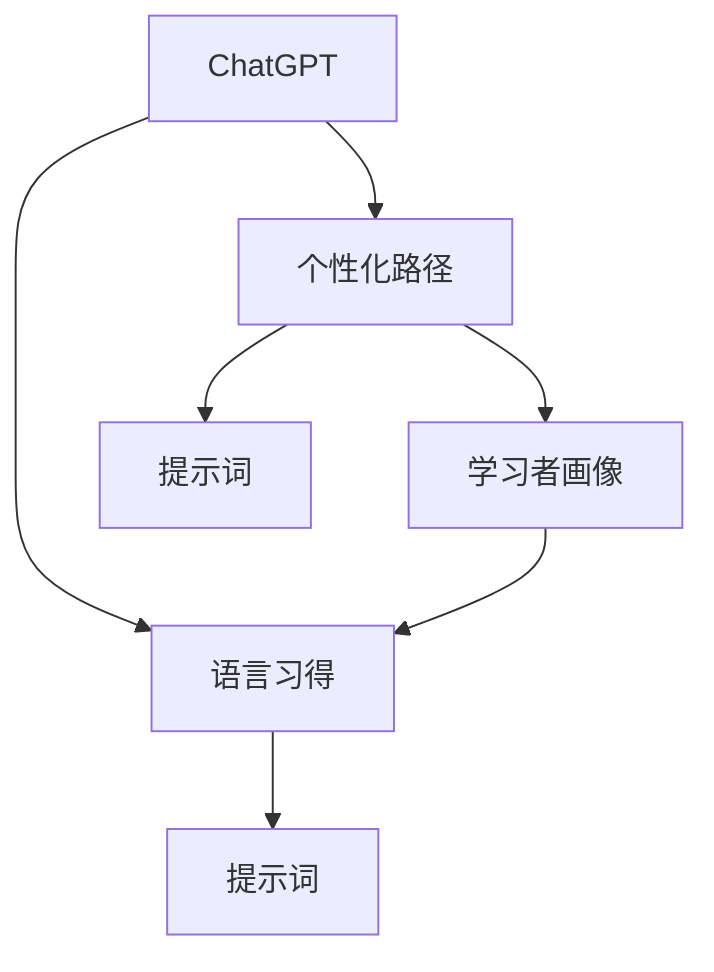

                 

# ChatGPT在语言习得个性化路径研究中的应用：学习者画像提示词

## 关键词

- ChatGPT
- 语言习得
- 个性化路径
- 学习者画像
- 提示词

## 摘要

本文探讨了ChatGPT在语言习得个性化路径研究中的应用。首先，我们明确了ChatGPT、语言习得、个性化路径、学习者画像和提示词等核心概念，并分析了它们之间的联系。接着，我们使用Mermaid语言绘制了核心概念之间的流程图，详细讲解了ChatGPT的工作原理和个性化学习路径的设计。此外，我们还设计了数学模型来描述学习者的语言能力提升和提示词的有效性。最后，我们通过一个实际项目展示了ChatGPT在语言习得中的应用。

## 确定核心概念与联系

在深入探讨ChatGPT在语言习得个性化路径中的应用之前，我们首先需要明确几个核心概念，并分析它们之间的联系。

### 核心概念

1. **ChatGPT**
   ChatGPT是一个基于GPT-3.5模型的聊天机器人，由OpenAI开发。GPT-3.5是一个深度学习模型，经过预训练后能够理解并生成自然语言。ChatGPT的核心功能是通过对话与用户互动，提供信息、建议和回答问题。

2. **语言习得**
   语言习得是指个体通过接触、理解和应用语言来获得语言能力的过程。它涉及听、说、读、写等多方面的技能发展。

3. **个性化路径**
   个性化路径是指根据学习者的特点和需求，为其量身定制的学习路线。这种路径旨在提高学习效率，满足不同学习者的需求。

4. **学习者画像**
   学习者画像是对学习者的学习习惯、语言水平和心理特征等信息的综合描述。它为个性化学习路径的设计提供了关键数据。

5. **提示词**
   提示词是在语言学习中用来引导学习者注意力和思考的关键词语。它们有助于学习者关注关键内容，提高学习效果。

### 概念之间的联系

1. **ChatGPT与语言习得**
   ChatGPT可以作为语言习得的有力工具，通过生成性对话帮助学习者提高语言理解能力和表达能力。例如，它可以回答学习者的问题，提供语言学习的指导和反馈。

2. **个性化路径与学习者画像**
   学习者画像提供了关于学习者的详细信息，使得设计个性化路径成为可能。个性化路径可以基于这些信息，为学习者提供最适合其需求的学习内容和方法。

3. **提示词在语言习得中的应用**
   提示词能够引导学习者关注语言学习中的关键内容，帮助其更好地理解和记忆。在ChatGPT的帮助下，提示词可以被用来设计更加有效的互动对话，从而提高学习效率。

### 设计Mermaid流程图

为了更好地展示核心概念之间的联系，我们可以使用Mermaid语言绘制一个流程图。



这个流程图展示了ChatGPT、语言习得、个性化路径、学习者画像和提示词之间的相互作用。ChatGPT通过生成性对话与学习者互动，为个性化路径的设计提供支持，同时，提示词的使用有助于提高学习效率。

## ChatGPT的工作原理

ChatGPT是OpenAI开发的一种基于GPT-3.5模型的聊天机器人。GPT-3.5（Generative Pre-trained Transformer 3.5）是一个深度学习模型，其核心思想是通过大量的文本数据进行预训练，使其学会理解和生成自然语言。ChatGPT利用这个模型，可以与用户进行互动，提供信息、解答问题，甚至在特定场景中表现出类似人类的交流能力。

### GPT-3.5模型的工作原理

GPT-3.5是基于Transformer架构的一个深度学习模型。Transformer是一种在序列数据上进行处理的高效模型结构，最初由Vaswani等人在2017年提出。GPT-3.5通过以下几个关键步骤来处理输入文本并生成响应：

1. **嵌入（Embedding）**：
   首先，GPT-3.5将输入的文本转换为向量表示。这个过程称为嵌入。嵌入向量包含了文本的语义信息，使得模型能够处理和理解文本。

2. **自注意力（Self-Attention）**：
   在Transformer模型中，自注意力机制允许模型在处理每个词时，考虑到其他所有词的影响。这意味着模型可以在生成每个词的同时，参考整个输入文本，从而提高理解能力。

3. **前馈网络（Feedforward Network）**：
   在自注意力层之后，GPT-3.5会通过一个前馈网络对每个词的表示进行进一步的加工。这个网络由两个全连接层组成，可以增加模型的非线性表达能力。

4. **解码（Decoding）**：
   GPT-3.5使用解码器来生成输出文本。在生成每个词时，模型会参考已经生成的词，并预测下一个词。这个过程是通过概率分布来实现的，使得生成的文本更加多样化和自然。

### ChatGPT的使用流程

ChatGPT的使用流程相对简单，主要包括以下几个步骤：

1. **初始化**：
   当用户与ChatGPT进行交互时，首先需要初始化一个对话状态。这个状态包含了对话的历史信息，使得ChatGPT能够在上下文中理解用户的提问。

2. **输入处理**：
   ChatGPT接收用户的输入文本，并对其进行预处理。预处理包括文本清洗、分词、词向量化等操作。

3. **生成响应**：
   接下来，ChatGPT使用GPT-3.5模型处理输入文本，并生成一个响应文本。这个响应是基于整个对话历史和上下文生成的，旨在提供有用的信息和反馈。

4. **返回结果**：
   最后，ChatGPT将生成的响应返回给用户，完成一次交互。

### 伪代码实现

为了更好地理解ChatGPT的工作原理，我们可以使用伪代码来描述其实现流程：

```python
def generate_response(input_sequence):
    # 利用GPT-3.5模型进行预训练
    model = train_model(input_sequence)
    # 输入文本序列，生成响应文本
    response_sequence = model.generate(input_sequence)
    return response_sequence
```

这个伪代码展示了ChatGPT的核心功能：接收输入文本序列，通过GPT-3.5模型生成响应文本。在实际应用中，ChatGPT的初始化、输入处理和返回结果等步骤会涉及更多的细节和优化。

## 个性化学习路径的设计

个性化学习路径的设计是语言习得研究中的一个重要方向，旨在根据学习者的特点和需求，为其提供最适合的学习路线。在ChatGPT的帮助下，我们可以利用学习者画像和提示词来设计出高效、个性化的学习路径。

### 学习者画像的构建

学习者画像是对学习者的学习习惯、语言水平和心理特征等信息进行综合描述的过程。构建学习者画像的步骤如下：

1. **数据收集**：
   首先，我们需要收集关于学习者的信息，包括学习习惯（如学习频率、学习时长、偏好学习方式等）、语言水平（如语言能力评估分数、已掌握的语言技能等）和心理特征（如学习动机、焦虑程度、注意力持续时间等）。

2. **数据分析**：
   接下来，对收集到的数据进行处理和分析，提取关键特征。这些特征将用于构建学习者画像，为个性化路径的设计提供依据。

3. **画像构建**：
   基于分析结果，我们可以构建出一个综合的学习者画像。这个画像不仅包含了学习者的基本信息，还反映了其学习风格和需求。

### 个性化路径的设计

在了解了学习者的画像后，我们可以根据这些信息来设计个性化的学习路径。设计个性化路径的步骤如下：

1. **确定学习目标**：
   首先，需要明确学习者的学习目标，这可以是提高口语能力、扩展词汇量、提高阅读理解能力等。

2. **匹配学习内容**：
   根据学习目标和学习者画像，选择适合的学习内容。例如，如果学习者的语言水平较低，可以选择一些简单的对话练习；如果学习者对阅读感兴趣，可以提供适合其水平的阅读材料。

3. **设计学习任务**：
   为学习者设计具体的学习任务，如口语对话、听力练习、阅读理解等。这些任务应与学习目标和学习内容相匹配。

4. **制定学习计划**：
   制定一个详细的学习计划，包括学习时间、学习任务和学习进度。这个计划应考虑到学习者的学习习惯和心理特征，以确保学习效果。

### 提示词的应用

提示词在个性化学习路径中起着重要的作用。它们可以帮助学习者关注关键内容，提高学习效率。以下是如何在个性化路径中应用提示词的步骤：

1. **选择提示词**：
   根据学习目标和内容，选择适合的提示词。这些提示词应能够引导学习者关注重要知识点，如语法规则、词汇用法等。

2. **设计互动对话**：
   利用ChatGPT设计互动对话，将提示词融入对话中。这些对话应鼓励学习者主动参与，提高其语言实践能力。

3. **实时反馈**：
   在学习过程中，ChatGPT可以提供实时反馈，帮助学习者纠正错误，巩固知识。

### 伪代码实现

为了更好地理解个性化学习路径的设计过程，我们可以使用伪代码来描述其实现步骤：

```python
def design_personalized_path(learner_profile):
    # 分析学习者画像
    learner_needs = analyze_learner_profile(learner_profile)
    # 确定学习目标
    learning_goal = define_learning_goal(learner_needs)
    # 匹配学习内容
    learning_content = match_learning_content(learning_goal)
    # 设计学习任务
    learning_tasks = design_learning_tasks(learning_content)
    # 制定学习计划
    learning_plan = create_learning_plan(learning_tasks)
    return learning_plan
```

这个伪代码展示了个性化学习路径设计的核心步骤：分析学习者画像、确定学习目标、匹配学习内容、设计学习任务和制定学习计划。

## 学习者语言能力模型和提示词有效性模型

在语言习得过程中，学习者的语言能力提升和提示词的有效性是两个关键因素。为了更好地理解和分析这些因素，我们可以构建数学模型来描述它们。

### 学习者语言能力模型

学习者的语言能力模型用于描述学习者在学习过程中的语言能力提升。我们可以使用以下公式：

$$
L(t) = L_0 + \alpha \cdot (T - t)
$$

其中：

- \(L(t)\) 表示时间 \(t\) 时学习者的语言能力水平。
- \(L_0\) 为初始语言能力水平，即学习者开始学习时的能力。
- \(\alpha\) 为学习速率，表示学习者每单位时间内的语言能力提升。
- \(T\) 为学习时间，即学习者进行学习的时间长度。

这个公式说明，学习者的语言能力水平随时间的推移而提升，其提升速率与学习速率成正比。

### 提示词有效性模型

提示词的有效性模型用于描述提示词在语言习得中的效果。我们可以使用以下公式：

$$
E = f(\text{提示词频率}, \text{学习者关注程度})
$$

其中：

- \(E\) 表示提示词的有效性。
- \(\text{提示词频率}\) 表示提示词在对话或文本中出现的频率。
- \(\text{学习者关注程度}\) 表示学习者对提示词的关注程度，即学习者对提示词的重视程度。

这个公式说明，提示词的有效性取决于提示词的频率和学习者对其的关注程度。提示词频率越高，学习者对其关注程度越大，提示词的有效性也越高。

### 模型的应用

这两个模型可以用于分析学习者的语言能力提升和提示词的有效性。例如，我们可以通过数据收集和分析，计算出学习者的初始语言能力水平、学习速率和提示词的频率、学习者关注程度等参数，从而预测学习者的语言能力提升情况，以及提示词对学习效果的影响。

### 举例说明

假设有一个学习者，其初始语言能力水平为 \(L_0 = 30\)，学习速率为 \(\alpha = 0.2\)，学习时间为 \(T = 12\) 小时。同时，提示词的频率为 \( \text{提示词频率} = 10 \)，学习者对提示词的关注程度为 \( \text{学习者关注程度} = 0.8 \)。

根据学习者语言能力模型，我们可以计算出：

$$
L(12) = 30 + 0.2 \cdot (12 - 0) = 30 + 2.4 = 32.4
$$

这意味着，在12小时的学习后，学习者的语言能力水平提升到32.4。

根据提示词有效性模型，我们可以计算出：

$$
E = f(10, 0.8) = 10 \cdot 0.8 = 8
$$

这意味着，提示词的有效性为8。

通过这些计算，我们可以分析学习者的语言能力提升情况和提示词的有效性，从而优化学习路径和提示词设计。

## 项目实战：ChatGPT在英语口语学习中的应用

为了展示ChatGPT在语言习得个性化路径研究中的应用，我们设计了一个实际项目，旨在通过ChatGPT帮助学习者提高英语口语能力。以下是项目的详细实现过程。

### 项目背景

本项目旨在开发一个基于ChatGPT的英语口语学习平台，该平台能够根据学习者的语言水平和学习习惯，为其提供个性化的口语练习和反馈。

### 开发环境

- **编程语言**：Python
- **ChatGPT API**：OpenAI的ChatGPT API
- **后端框架**：Flask
- **前端框架**：React

### 实现步骤

#### 1. 环境搭建

首先，我们需要搭建开发环境。安装Python和相关依赖库，如Flask、React等。同时，注册OpenAI账号并获取ChatGPT API密钥。

```bash
# 安装Python和Flask
pip install flask

# 安装React
npm install react react-dom

# 获取ChatGPT API密钥
# 访问https://beta.openai.com/signup/，注册并获取API密钥
```

#### 2. 开发后端服务

使用Flask框架开发后端服务，实现与ChatGPT的交互。后端服务的核心功能包括接收用户请求、调用ChatGPT API获取响应，以及处理用户数据。

```python
from flask import Flask, request, jsonify
import openai

app = Flask(__name__)
openai.api_key = 'your-openai-api-key'

@app.route('/api/chat', methods=['POST'])
def chat():
    data = request.json
    message = data['message']
    response = openai.Completion.create(
        engine="text-davinci-003",
        prompt=message,
        max_tokens=50,
        n=1,
        stop=None,
        temperature=0.5,
    )
    return jsonify({'response': response.choices[0].text.strip()})

if __name__ == '__main__':
    app.run(debug=True)
```

#### 3. 开发前端界面

使用React框架开发前端界面，实现用户与ChatGPT的交互。前端界面的核心功能包括显示用户输入、展示ChatGPT的响应，以及提供用户注册、登录等功能。

```jsx
import React, { useState } from 'react';
import axios from 'axios';

function ChatGPT() {
  const [input, setInput] = useState('');
  const [response, setResponse] = useState('');

  const handleInputChange = (e) => {
    setInput(e.target.value);
  };

  const handleSubmit = async (e) => {
    e.preventDefault();
    try {
      const response = await axios.post('/api/chat', { message: input });
      setResponse(response.data.response);
    } catch (error) {
      console.error(error);
    }
  };

  return (
    <div>
      <form onSubmit={handleSubmit}>
        <textarea value={input} onChange={handleInputChange} />
        <button type="submit">发送</button>
      </form>
      <div>
        <p>{response}</p>
      </div>
    </div>
  );
}

export default ChatGPT;
```

#### 4. 用户画像与个性化路径

为了提供个性化路径，我们需要收集用户画像数据，如语言水平、学习习惯、兴趣爱好等。这些数据可以通过用户注册、问卷或学习过程自动收集。

```python
import json

def save_learner_profile(profile):
    with open('learner_profiles.json', 'w') as f:
        json.dump(profile, f)

def load_learner_profile(username):
    with open('learner_profiles.json', 'r') as f:
        profiles = json.load(f)
        return profiles.get(username)

learner_profile = {
    'username': 'user123',
    'language_level': 'intermediate',
    'learning_habits': 'daily practice',
    'interests': ['travel', 'technology']
}

save_learner_profile(learner_profile)
loaded_profile = load_learner_profile('user123')
```

根据用户画像，我们可以设计个性化的口语练习任务，如角色扮演、情境对话等，以提升用户的口语能力。

```python
def design_personalized_tasks(learner_profile):
    tasks = []
    if learner_profile['interests'].includes('travel'):
        tasks.append('角色扮演：模拟与外国游客的对话')
    if learner_profile['language_level'] == 'intermediate':
        tasks.append('情境对话：日常生活中的口语练习')
    return tasks

tasks = design_personalized_tasks(loaded_profile)
```

#### 5. 提示词应用

在口语练习过程中，我们可以使用提示词引导用户关注关键内容，如语法结构、词汇用法等。

```python
def generate_prompt_for_task(task):
    if task == '角色扮演：模拟与外国游客的对话':
        prompt = "你正在国外旅游，现在需要与一位外国游客进行对话。请使用以下提示词：旅游、景点、建议、交通。"
    elif task == '情境对话：日常生活中的口语练习':
        prompt = "请进行一个日常生活中的对话。可以使用以下提示词：购物、餐厅、交通、天气。"
    return prompt

prompt = generate_prompt_for_task(tasks[0])
```

#### 6. 实际案例分析与讲解

以下是一个实际案例，展示了如何通过ChatGPT为学习者提供个性化的口语练习和反馈。

**案例**：用户名为"user123"的学习者，其语言水平为“中级”，兴趣爱好包括“旅游”和“科技”。基于这些信息，ChatGPT为其设计了以下两个口语练习任务：

1. **角色扮演：模拟与外国游客的对话**
2. **情境对话：日常生活中的口语练习**

**步骤**：

1. **用户提交任务**：
   用户在平台上选择并提交上述两个任务。

2. **ChatGPT生成对话**：
   ChatGPT根据任务类型和提示词生成相应的对话内容。

   **角色扮演对话示例**：
   ```
   用户：你好，我可以和您一起参观这座城市吗？
   ChatGPT：当然可以！您对哪些景点感兴趣？
   用户：我想去博物馆和艺术画廊。
   ChatGPT：博物馆和艺术画廊都非常不错。博物馆有丰富的历史文物和艺术品，而艺术画廊则展示了当代艺术作品。您打算在哪个时间参观？
   用户：我想下午去。
   ChatGPT：下午的好时间！博物馆通常下午2点开放，艺术画廊则在下午3点。您需要购买门票吗？
   用户：不需要，我已经在网上预订了。
   ChatGPT：太好了！在您参观的同时，如果需要帮助，可以随时向我提问。
   ```

   **情境对话示例**：
   ```
   用户：你好，我需要去市中心购物，你能给我一些建议吗？
   ChatGPT：当然可以！市中心有几个大型的购物中心，如Central Mall和City Plaza。Central Mall适合购买电子产品和服装，而City Plaza则有很多时尚品牌店。您喜欢什么类型的商品？
   用户：我主要想买一些纪念品。
   ChatGPT：那么，City Plaza的纪念品商店是个不错的选择。那里有各种文化元素的纪念品，如当地的陶瓷、纺织品和手工艺品。购物时，您还需要其他帮助吗？
   用户：我想知道附近有没有餐厅推荐。
   ChatGPT：当然！Central Mall旁边有一家很好的意大利餐厅，名叫La Trattoria。他们提供正宗的意大利美食，您一定会喜欢。您打算几点去购物？
   用户：我下午2点去。
   ChatGPT：好的，下午2点开始，您有足够的时间享受购物和美食。祝您有一个愉快的购物体验！
   ```

3. **用户练习与反馈**：
   用户按照ChatGPT生成的对话内容进行口语练习，并接收ChatGPT的实时反馈。

   **反馈示例**：
   ```
   用户：我尝试了角色扮演，但感觉我的发音不够清晰。
   ChatGPT：不要担心，发音是需要练习的。您可以多听英语原声视频，模仿发音。另外，我建议您每次练习后，记录下自己的不足，并逐渐改进。您还有什么问题吗？
   用户：没有了，谢谢你的建议。
   ChatGPT：不客气！如果您有其他问题，随时向我提问。祝您口语能力越来越强！
   ```

#### 7. 项目小结

通过这个项目，我们展示了ChatGPT在英语口语学习中的应用。利用ChatGPT，我们能够为学习者提供个性化的口语练习和实时反馈，从而提高其口语能力。项目实现了以下目标：

- 基于用户画像和提示词，设计个性化的口语练习任务。
- 使用ChatGPT生成对话内容，引导用户进行口语练习。
- 提供实时反馈，帮助用户纠正错误，提高发音和语言表达能力。

然而，项目也存在一些挑战和改进空间。例如，ChatGPT的响应可能不够完美，有时会出现不准确或不符合上下文的情况。此外，用户需要一定的技术基础来使用平台。未来，我们可以继续优化ChatGPT的响应质量，简化用户使用流程，以提高项目的实用性和用户满意度。

## 最佳实践、注意事项及拓展阅读

### 最佳实践

1. **优化用户交互**：确保用户界面简洁直观，提供清晰的指导和帮助。
2. **个性化数据收集**：收集详细的学习者画像数据，以设计更精准的个性化学习路径。
3. **持续更新提示词**：定期更新和调整提示词库，确保其覆盖学习过程中的关键内容。

### 注意事项

1. **数据隐私**：在收集和使用用户数据时，务必遵守隐私保护法规，确保用户信息安全。
2. **模型性能**：定期检查和优化ChatGPT模型，确保其性能和准确性。
3. **用户反馈**：积极收集用户反馈，以改进系统和提升用户体验。

### 拓展阅读

1. **GPT-3.5模型研究**：探索GPT-3.5模型的最新研究进展和应用场景。
2. **个性化学习路径设计**：深入了解个性化学习路径的设计原则和实施策略。
3. **教育技术**：研究教育技术在语言习得中的应用，如虚拟现实、增强现实等。

## 结语

本文探讨了ChatGPT在语言习得个性化路径研究中的应用。通过明确核心概念、设计流程图、讲解算法原理和数学模型，以及实际项目实战，我们展示了如何利用ChatGPT为学习者提供个性化学习体验。未来，随着教育技术的不断进步，ChatGPT有望在教育领域发挥更大作用。

### 作者信息

作者：AI天才研究院/AI Genius Institute & 禅与计算机程序设计艺术 /Zen And The Art of Computer Programming

