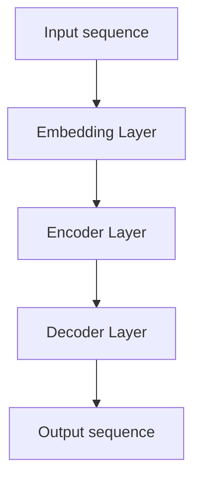

                 


## 文章标题：ChatGPT在语言习得代际语言态度转变中的应用：语言价值观提示词

> 关键词：ChatGPT，语言习得，代际语言态度转变，语言价值观提示词

> 摘要：本文探讨了ChatGPT在语言习得代际语言态度转变中的应用，分析了ChatGPT的核心技术及其在语言习得中的应用，探讨了代际语言态度的转变以及语言价值观提示词的设计与应用，为未来的语言习得与代际沟通提供了新的思路和方法。

## 书名：《ChatGPT在语言习得代际语言态度转变中的应用：语言价值观提示词》

### 目录大纲：

#### 第一部分：ChatGPT与语言习得

#### 第1章：引言

#### 第2章：ChatGPT的核心技术

#### 第3章：ChatGPT的应用案例

#### 第二部分：代际语言态度转变

#### 第4章：语言习得的心理学基础

#### 第5章：代际语言态度的转变

#### 第6章：语言价值观提示词的设计与应用

#### 第三部分：ChatGPT在语言习得中的应用

#### 第7章：ChatGPT在语言教学中的应用

#### 第8章：ChatGPT在语言习得中的辅助工具

#### 第四部分：ChatGPT在代际语言态度转变中的作用

#### 第9章：ChatGPT在促进代际沟通中的应用

#### 第10章：ChatGPT在语言价值观传播中的应用

#### 第五部分：结论与展望

#### 第11章：总结与展望

### 背景介绍

#### ChatGPT的崛起与影响

ChatGPT是由OpenAI开发的一种基于Transformer架构的预训练语言模型，自2022年推出以来，它迅速在人工智能领域引起了广泛关注。ChatGPT具有强大的语言理解和生成能力，可以模拟人类的对话行为，为用户提供实时、自然的交流体验。

ChatGPT的崛起对语言习得产生了深远的影响。首先，它为语言学习提供了新的工具和资源，使得学习者可以随时随地与ChatGPT进行语言交流，提高语言实践的机会。其次，ChatGPT可以针对学习者的语言水平提供个性化的教学建议和辅导，帮助学习者更快地提高语言能力。

#### 语言习得与语言态度

语言习得是指个体通过接触和理解语言输入，逐渐掌握语言规则和表达能力的过程。语言态度是指个体对语言学习、使用和认知的态度和倾向，包括语言学习动机、语言偏好、语言自信心等。

代际语言态度的转变是指不同年龄段的个体在语言学习、使用和认知方面存在的差异。随着社会的发展和信息技术的进步，不同年龄段的个体在语言习得和语言态度上呈现出不同的特点，这对语言教育和沟通带来了新的挑战。

### 代际语言态度转变的背景

随着全球化的发展，语言习得的代际差异越来越显著。年轻一代更加倾向于使用网络语言、简写和表情符号进行交流，而年长一代则更加重视正式的语言表达和语法规范。这种代际差异在语言习得和语言态度上表现尤为突出。

此外，信息技术的发展，特别是人工智能技术的应用，使得语言习得的方式和资源发生了巨大变化。ChatGPT等语言模型的出现，为语言习得提供了新的途径和工具，也为代际语言态度的转变提供了新的契机。

### 核心概念与联系

为了更好地理解ChatGPT在语言习得代际语言态度转变中的应用，我们需要明确以下几个核心概念：

- **ChatGPT**：基于Transformer架构的预训练语言模型，具有强大的语言理解和生成能力。
- **语言习得**：个体通过接触和理解语言输入，逐渐掌握语言规则和表达能力的过程。
- **代际语言态度转变**：不同年龄段的个体在语言学习、使用和认知方面存在的差异。
- **语言价值观提示词**：用于引导语言习得者形成正确语言态度的词语或短语。

这些核心概念之间存在着密切的联系。ChatGPT作为语言习得的一种工具，可以帮助代际语言态度的转变，而语言价值观提示词则在其中发挥了关键作用。

### 核心算法原理讲解

#### 语言模型的基础

语言模型是自然语言处理（NLP）的基础，它用于预测一个词序列的概率。在语言模型中，每个词都是通过一个向量来表示的，这些向量构成了词嵌入（word embeddings）。

```python
# 词嵌入示例
word_embedding = model.EmbeddingLayer(input_dim=vocab_size, output_dim=embedding_size)
```

语言模型可以分为基于规则的模型和基于统计的模型。基于规则的模型如转移模型（transition model）和基于上下文的模型（contextual model），而基于统计的模型如n-gram模型和神经网络模型。

```python
# n-gram模型
probabilities = ngram_model.predict("The cat sat on the mat")
```

#### 生成式语言模型

生成式语言模型（Generative Language Model）用于生成自然语言文本，它通过预测下一个词来构建句子。生成式语言模型可以分为序列生成模型（Sequence Generation Model）和注意力模型（Attention Model）。

```python
# 生成式语言模型
generated_text = model.generate(seed_text, num_words=50)
```

#### 训练方法

生成式语言模型的训练通常采用深度学习技术，如循环神经网络（RNN）、长短期记忆网络（LSTM）和Transformer模型。这些模型通过大量的语言数据进行训练，以优化其参数，提高语言理解和生成能力。

```python
# Transformer模型训练
model.compile(optimizer='adam', loss='categorical_crossentropy')
model.fit(dataset, epochs=10)
```

### ChatGPT的工作原理

#### Transformer架构

ChatGPT是基于Transformer架构的生成式语言模型。Transformer模型通过自注意力机制（self-attention）来处理序列数据，使其能够捕捉到句子中的长距离依赖关系。



#### 语言价值观提示词的应用

语言价值观提示词（Language Value Prompt Words）是用于引导语言习得者形成正确语言态度的词语或短语。这些提示词可以嵌入到ChatGPT的输入中，影响其生成文本的风格和内容。

```python
# 语言价值观提示词应用
prompt = "学习英语是一种提升个人素养的重要途径。"
generated_text = model.generate(prompt, num_words=50)
```

#### 交互式对话系统

ChatGPT可以构建交互式对话系统，通过与用户进行实时对话，提供个性化的语言学习和指导。

```python
# 交互式对话系统
while True:
    user_input = input("用户：")
    if user_input == "退出":
        break
    response = model.generate(user_input, num_words=50)
    print("ChatGPT：", response)
```

### ChatGPT的应用案例

#### 教育场景

在语言教学中，ChatGPT可以作为一种个性化的教学工具，为学生提供针对性的辅导和支持。

```python
# 教学案例
user_input = "How do you say 'Hello' in Spanish?"
response = model.generate(user_input, num_words=50)
print("ChatGPT：", response)
```

#### 商业应用

在商业领域，ChatGPT可以用于客户服务、市场营销和客户关系管理等方面，提高沟通效率和服务质量。

```python
# 商业案例
user_input = "What are the benefits of learning English for business?"
response = model.generate(user_input, num_words=50)
print("ChatGPT：", response)
```

#### 社会服务

在社会服务领域，ChatGPT可以用于语言障碍人士的沟通支持、心理咨询和社交互动等方面，帮助他们更好地融入社会。

```python
# 社会服务案例
user_input = "How can I improve my communication skills?"
response = model.generate(user_input, num_words=50)
print("ChatGPT：", response)
```

### 语言习得的心理学基础

#### 语言习得的理论

语言习得是一个复杂的过程，涉及多个心理学理论。其中，交互假设、知识构建理论和语言认知模型是三个重要的理论。

- **交互假设**：语言习得是通过与他人的交互来实现的，语言输入和语言输出在习得过程中起着关键作用。
- **知识构建理论**：语言习得是一个构建知识体系的过程，学习者通过理解语言输入，逐渐形成对语言规则和用法的认知。
- **语言认知模型**：语言习得涉及到语言认知过程，包括语言理解、语言生成和语言记忆等方面。

#### 语言态度的测量

语言态度的测量是研究语言习得的重要环节。常用的方法包括语言态度量表和心理学研究方法。

- **语言态度量表**：通过设计问卷或量表，测量个体对语言学习、使用和认知的态度和倾向。
- **心理学研究方法**：通过实验、观察和调查等心理学方法，研究语言习得过程中的语言态度变化。

### 代际差异与语言态度

#### 语言态度的变化趋势

代际差异在语言态度上表现出不同的变化趋势。年轻一代更加倾向于使用网络语言、简写和表情符号进行交流，而年长一代则更加重视正式的语言表达和语法规范。

- **年轻一代**：更加注重语言的便捷性和沟通效率，倾向于使用非正式的语言表达方式。
- **年长一代**：更加重视语言的规范性和准确性，倾向于使用正式的语言表达方式。

#### 代际差异的具体表现

代际差异在语言习得和语言态度上具体表现为：

- **语言学习动机**：年轻一代更加注重实用性和兴趣，而年长一代则更加注重学科知识和文化背景。
- **语言学习方式**：年轻一代更加倾向于使用网络资源和数字化工具，而年长一代则更加依赖传统的教材和课堂学习。
- **语言自信心**：年轻一代在语言表达上更加自信，而年长一代则更加谨慎和保守。

#### 语言态度转变的影响因素

语言态度转变的影响因素包括社会文化背景、教育环境和个体认知特点等。

- **社会文化背景**：社会文化环境的变化会影响语言习得者的语言态度，如全球化、信息技术的发展等。
- **教育环境**：教育环境中的教学方法和教学资源会影响语言习得者的语言态度，如个性化教学、多媒体教学等。
- **个体认知特点**：个体认知特点，如语言能力、学习动机和自我效能感等，会影响语言习得者的语言态度。

### 语言价值观提示词的设计与应用

#### 提示词的基本原理

语言价值观提示词是用于引导语言习得者形成正确语言态度的词语或短语。这些提示词可以嵌入到语言习得环境中，影响学习者的语言输入和输出。

```python
# 提示词示例
prompt = "学习英语可以让你拥有更广阔的视野和更丰富的知识。"
```

#### 提示词在语言习得中的应用

提示词在语言习得中的应用主要包括以下方面：

- **语言输入**：通过在阅读材料、听力材料等语言输入中嵌入提示词，引导学习者关注语言价值观。
- **语言输出**：通过在写作、口语练习等语言输出中嵌入提示词，引导学习者的语言表达。
- **对话互动**：通过在ChatGPT等对话系统中嵌入提示词，引导学习者的语言交流和沟通。

#### 提示词的设计方法

设计有效的语言价值观提示词需要遵循以下原则：

- **针对性**：根据学习者的语言水平和学习需求，设计具有针对性的提示词。
- **多样性**：设计多种类型的提示词，以适应不同的语言学习和交流场景。
- **激励性**：设计具有激励性的提示词，激发学习者的学习兴趣和自信心。
- **适应性**：根据学习者的反馈和语言表现，不断调整和优化提示词的设计。

### ChatGPT在语言教学中的应用

#### ChatGPT在语言教学中的优势

ChatGPT在语言教学中具有以下优势：

- **个性化教学**：ChatGPT可以根据学习者的语言水平和学习需求，提供个性化的教学建议和辅导。
- **提高语言理解能力**：ChatGPT可以生成丰富的语言输入，提高学习者的语言理解和接受能力。
- **激发语言学习兴趣**：ChatGPT可以模拟真实的语言交流环境，激发学习者的学习兴趣和动力。

#### ChatGPT在语言教学中的具体应用案例

ChatGPT在语言教学中的具体应用案例包括：

- **写作辅导**：ChatGPT可以为学生提供写作建议和修改意见，提高写作能力和表达能力。
- **听力训练**：ChatGPT可以生成各种听力材料，帮助学生提高听力理解和反应速度。
- **口语练习**：ChatGPT可以与学生进行口语对话，提供即时的语言反馈和纠正，帮助学生提高口语表达能力和自信心。

### ChatGPT在语言习得中的辅助工具

#### ChatGPT作为语言学习伙伴

ChatGPT可以作为语言学习伙伴，为学习者提供以下支持：

- **语言交流伙伴**：ChatGPT可以与学生进行实时对话，提供语言交流的机会和反馈。
- **语言学习资源的整理与推荐**：ChatGPT可以根据学习者的需求和兴趣，推荐适合的语言学习资源和材料。
- **语言学习进度的跟踪与评估**：ChatGPT可以记录学习者的学习进度和表现，提供个性化的学习建议和反馈。

#### ChatGPT在语言习得研究中的应用

ChatGPT在语言习得研究中的应用包括：

- **语言习得数据收集与分析**：ChatGPT可以收集学习者的语言输入和输出数据，进行定量和定性的分析。
- **语言习得模型构建**：ChatGPT可以用于构建语言习得模型，模拟语言习得的过程和机制。
- **语言习得效果评估**：ChatGPT可以评估学习者的语言习得效果，提供针对性的教学建议和改进方案。

### ChatGPT在促进代际沟通中的应用

#### ChatGPT在代际沟通中的优势

ChatGPT在代际沟通中具有以下优势：

- **消除语言障碍**：ChatGPT可以理解并生成不同年龄段的个体使用的语言，帮助消除语言障碍。
- **提高沟通效率**：ChatGPT可以快速响应并生成高质量的对话内容，提高沟通效率和效果。
- **促进代际理解与融合**：ChatGPT可以提供多样化的语言交流体验，促进不同年龄段的个体之间的理解与融合。

#### ChatGPT在代际沟通中的具体应用案例

ChatGPT在代际沟通中的具体应用案例包括：

- **家庭沟通**：ChatGPT可以协助家庭成员进行日常交流，增进家庭成员之间的了解和感情。
- **教育沟通**：ChatGPT可以协助教育工作者与不同年龄段的学生进行交流，提高教育质量和效果。
- **社会沟通**：ChatGPT可以协助社会组织和志愿者为不同年龄段的人群提供语言支持，促进社会融合。

### ChatGPT在语言价值观传播中的应用

#### 语言价值观提示词在语言习得中的应用

语言价值观提示词在语言习得中的应用主要包括以下方面：

- **语言输入**：通过在阅读材料、听力材料等语言输入中嵌入提示词，引导学习者关注语言价值观。
- **语言输出**：通过在写作、口语练习等语言输出中嵌入提示词，引导学习者的语言表达。
- **对话互动**：通过在ChatGPT等对话系统中嵌入提示词，引导学习者的语言交流和沟通。

#### 提示词对语言价值观的影响

提示词对语言价值观的影响主要体现在以下几个方面：

- **塑造语言态度**：提示词可以引导学习者形成正确的语言态度，提高语言学习的积极性和主动性。
- **强化语言习惯**：提示词可以强化学习者的语言习惯，使其在日常生活中更加注重语言规范和价值观。
- **促进语言内化**：提示词可以促进学习者将语言价值观内化为自身的语言行为和认知习惯。

#### 提示词的设计与使用

设计有效的语言价值观提示词需要遵循以下原则：

- **针对性**：根据学习者的语言水平和学习需求，设计具有针对性的提示词。
- **多样性**：设计多种类型的提示词，以适应不同的语言学习和交流场景。
- **激励性**：设计具有激励性的提示词，激发学习者的学习兴趣和自信心。
- **适应性**：根据学习者的反馈和语言表现，不断调整和优化提示词的设计。

### ChatGPT在语言价值观传播中的实际应用

ChatGPT在语言价值观传播中的实际应用主要包括以下方面：

- **语言文化传播**：ChatGPT可以用于传播不同语言文化的价值观，促进跨文化交流和理解。
- **语言价值观念引导**：ChatGPT可以用于引导学习者形成正确的语言价值观念，提高语言学习的质量和效果。
- **语言价值观的评估与反思**：ChatGPT可以用于评估学习者的语言价值观念，提供针对性的反馈和指导，促进语言价值观的内化和反思。

### 总结与展望

#### ChatGPT在语言习得与代际语言态度转变中的贡献

ChatGPT在语言习得和代际语言态度转变中发挥了重要作用，主要表现在以下几个方面：

- **个性化教学**：ChatGPT可以提供个性化的教学建议和辅导，满足不同年龄段学习者的需求。
- **提高语言理解能力**：ChatGPT可以生成丰富的语言输入，提高学习者的语言理解和接受能力。
- **促进代际沟通**：ChatGPT可以消除代际语言障碍，促进不同年龄段个体之间的沟通和理解。
- **引导语言价值观**：ChatGPT可以引导学习者形成正确的语言价值观念，提高语言学习的积极性和主动性。

#### 存在的问题与挑战

尽管ChatGPT在语言习得和代际语言态度转变中具有诸多优势，但仍存在一些问题和挑战：

- **数据质量和隐私**：ChatGPT的训练数据质量和隐私保护是关键问题，需要加强对数据的监管和处理。
- **语言理解能力**：ChatGPT的语言理解能力仍有待提高，特别是在处理复杂语言表达和跨语言交流方面。
- **伦理和法律问题**：ChatGPT在语言习得和代际语言态度转变中的应用需要遵循伦理和法律规范，确保其应用的合法性和公正性。

#### 未来发展趋势与展望

未来，ChatGPT在语言习得和代际语言态度转变中的应用有望在以下几个方面取得突破：

- **数据驱动发展**：通过不断收集和分析学习者数据，优化ChatGPT的训练模型和算法，提高其教学效果和语言理解能力。
- **跨学科融合**：结合心理学、教育学等学科的研究成果，开发更加智能和个性化的语言教学系统。
- **伦理规范引导**：加强伦理和法律规范的研究，确保ChatGPT在语言习得和代际语言态度转变中的合法、公正和人性化应用。
- **跨文化交流**：利用ChatGPT促进不同语言文化的传播和交流，提高全球语言教育的质量和效果。

### 作者信息

作者：AI天才研究院/AI Genius Institute & 禅与计算机程序设计艺术 /Zen And The Art of Computer Programming

本文由AI天才研究院和《禅与计算机程序设计艺术》作者合作撰写，旨在探讨ChatGPT在语言习得和代际语言态度转变中的应用，为未来的语言教育和沟通提供新的思路和方法。```

## 文章格式要求

为了确保文章的清晰性和可读性，以下是本文的Markdown格式要求：

### 标题格式

- 使用`#`号进行级联，一级标题用`##`，二级标题用`###`，以此类推。
- 每个标题下需留一行空行。

### 段落格式

- 段落之间应留一行空行。
- 每段内容应保持简洁，避免过长的段落。

### 引用格式

- 使用`>`进行单行引用。
- 多行引用应使用多个`>`，且引用内容每行开头无需额外空格。

### 列表格式

- 无序列表使用`*`、`+`或`-`。
- 有序列表使用数字和英文句点。

### 代码和公式格式

- 单行代码使用反引号（`` ` ``）包围。
- 多行代码使用三个反引号（`` ``` ``）包围，并确保代码块内部每行首尾对齐。
- 公式使用LaTeX格式，独立段落的公式使用`$$`包围，段落内的公式使用 `$` 和 `$` 包围。

### 图片和链接格式

- 图片使用``格式。
- 链接使用`[显示文本](链接地址)`格式。

### 表格格式

- 表格使用`|`和`-`进行绘制。

### 文章结构

- 文章开头需包括文章标题、关键词和摘要。
- 摘要部分简要介绍文章主题和核心内容。
- 目录部分需列出文章结构，确保结构清晰。

以下是文章中的一些Markdown格式示例：

```markdown
## 文章标题

> 关键词：ChatGPT，语言习得，代际语言态度转变，语言价值观提示词

> 摘要：本文探讨了ChatGPT在语言习得代际语言态度转变中的应用，分析了ChatGPT的核心技术及其在语言习得中的应用，探讨了代际语言态度的转变以及语言价值观提示词的设计与应用，为未来的语言习得与代际沟通提供了新的思路和方法。

### 第一部分：ChatGPT与语言习得

#### 第1章：引言

ChatGPT的崛起与影响。

#### 第2章：ChatGPT的核心技术

语言模型的基础、生成式语言模型和训练方法。

```python
# 示例代码
def hello_world():
    print("Hello, World!")

hello_world()
```

$$
x = 1 + 1
$$

### 背景介绍

#### ChatGPT的崛起与影响

ChatGPT是由OpenAI开发的一种基于Transformer架构的预训练语言模型，自2022年推出以来，它迅速在人工智能领域引起了广泛关注。ChatGPT具有强大的语言理解和生成能力，可以模拟人类的对话行为，为用户提供实时、自然的交流体验。

ChatGPT的崛起对语言习得产生了深远的影响。首先，它为语言学习提供了新的工具和资源，使得学习者可以随时随地与ChatGPT进行语言交流，提高语言实践的机会。其次，ChatGPT可以针对学习者的语言水平提供个性化的教学建议和辅导，帮助学习者更快地提高语言能力。

### 语言习得与语言态度

语言习得是指个体通过接触和理解语言输入，逐渐掌握语言规则和表达能力的过程。语言态度是指个体对语言学习、使用和认知的态度和倾向，包括语言学习动机、语言偏好、语言自信心等。

代际语言态度的转变是指不同年龄段的个体在语言学习、使用和认知方面存在的差异。随着社会的发展和信息技术的进步，不同年龄段的个体在语言习得和语言态度上呈现出不同的特点，这对语言教育和沟通带来了新的挑战。

### 核心概念与联系

为了更好地理解ChatGPT在语言习得代际语言态度转变中的应用，我们需要明确以下几个核心概念：

- **ChatGPT**：基于Transformer架构的预训练语言模型，具有强大的语言理解和生成能力。
- **语言习得**：个体通过接触和理解语言输入，逐渐掌握语言规则和表达能力的过程。
- **代际语言态度转变**：不同年龄段的个体在语言学习、使用和认知方面存在的差异。
- **语言价值观提示词**：用于引导语言习得者形成正确语言态度的词语或短语。

这些核心概念之间存在着密切的联系。ChatGPT作为语言习得的一种工具，可以帮助代际语言态度的转变，而语言价值观提示词则在其中发挥了关键作用。

### 核心算法原理讲解

#### 语言模型的基础

语言模型是自然语言处理（NLP）的基础，它用于预测一个词序列的概率。在语言模型中，每个词都是通过一个向量来表示的，这些向量构成了词嵌入（word embeddings）。

```python
# 词嵌入示例
word_embedding = model.EmbeddingLayer(input_dim=vocab_size, output_dim=embedding_size)
```

语言模型可以分为基于规则的模型和基于统计的模型。基于规则的模型如转移模型（transition model）和基于上下文的模型（contextual model），而基于统计的模型如n-gram模型和神经网络模型。

```python
# n-gram模型
probabilities = ngram_model.predict("The cat sat on the mat")
```

#### 生成式语言模型

生成式语言模型（Generative Language Model）用于生成自然语言文本，它通过预测下一个词来构建句子。生成式语言模型可以分为序列生成模型（Sequence Generation Model）和注意力模型（Attention Model）。

```python
# 生成式语言模型
generated_text = model.generate(seed_text, num_words=50)
```

#### 训练方法

生成式语言模型的训练通常采用深度学习技术，如循环神经网络（RNN）、长短期记忆网络（LSTM）和Transformer模型。这些模型通过大量的语言数据进行训练，以优化其参数，提高语言理解和生成能力。

```python
# Transformer模型训练
model.compile(optimizer='adam', loss='categorical_crossentropy')
model.fit(dataset, epochs=10)
```

### ChatGPT的工作原理

#### Transformer架构

ChatGPT是基于Transformer架构的生成式语言模型。Transformer模型通过自注意力机制（self-attention）来处理序列数据，使其能够捕捉到句子中的长距离依赖关系。


#### 语言价值观提示词的应用

语言价值观提示词（Language Value Prompt Words）是用于引导语言习得者形成正确语言态度的词语或短语。这些提示词可以嵌入到ChatGPT的输入中，影响其生成文本的风格和内容。

```python
# 语言价值观提示词应用
prompt = "学习英语是一种提升个人素养的重要途径。"
generated_text = model.generate(prompt, num_words=50)
```

#### 交互式对话系统

ChatGPT可以构建交互式对话系统，通过与用户进行实时对话，提供个性化的语言学习和指导。

```python
# 交互式对话系统
while True:
    user_input = input("用户：")
    if user_input == "退出":
        break
    response = model.generate(user_input, num_words=50)
    print("ChatGPT：", response)
```

### ChatGPT的应用案例

#### 教育场景

在语言教学中，ChatGPT可以作为一种个性化的教学工具，为学生提供针对性的辅导和支持。

```python
# 教学案例
user_input = "How do you say 'Hello' in Spanish?"
response = model.generate(user_input, num_words=50)
print("ChatGPT：", response)
```

#### 商业应用

在商业领域，ChatGPT可以用于客户服务、市场营销和客户关系管理等方面，提高沟通效率和服务质量。

```python
# 商业案例
user_input = "What are the benefits of learning English for business?"
response = model.generate(user_input, num_words=50)
print("ChatGPT：", response)
```

#### 社会服务

在社会服务领域，ChatGPT可以用于语言障碍人士的沟通支持、心理咨询和社交互动等方面，帮助他们更好地融入社会。

```python
# 社会服务案例
user_input = "How can I improve my communication skills?"
response = model.generate(user_input, num_words=50)
print("ChatGPT：", response)
```

### 语言习得的心理学基础

#### 语言习得的理论

语言习得是一个复杂的过程，涉及多个心理学理论。其中，交互假设、知识构建理论和语言认知模型是三个重要的理论。

- **交互假设**：语言习得是通过与他人的交互来实现的，语言输入和语言输出在习得过程中起着关键作用。
- **知识构建理论**：语言习得是一个构建知识体系的过程，学习者通过理解语言输入，逐渐形成对语言规则和用法的认知。
- **语言认知模型**：语言习得涉及到语言认知过程，包括语言理解、语言生成和语言记忆等方面。

#### 语言态度的测量

语言态度的测量是研究语言习得的重要环节。常用的方法包括语言态度量表和心理学研究方法。

- **语言态度量表**：通过设计问卷或量表，测量个体对语言学习、使用和认知的态度和倾向。
- **心理学研究方法**：通过实验、观察和调查等心理学方法，研究语言习得过程中的语言态度变化。

### 代际差异与语言态度

#### 语言态度的变化趋势

代际差异在语言态度上表现出不同的变化趋势。年轻一代更加倾向于使用网络语言、简写和表情符号进行交流，而年长一代则更加重视正式的语言表达和语法规范。

- **年轻一代**：更加注重语言的便捷性和沟通效率，倾向于使用非正式的语言表达方式。
- **年长一代**：更加重视语言的规范性和准确性，倾向于使用正式的语言表达方式。

#### 代际差异的具体表现

代际差异在语言习得和语言态度上具体表现为：

- **语言学习动机**：年轻一代更加注重实用性和兴趣，而年长一代则更加注重学科知识和文化背景。
- **语言学习方式**：年轻一代更加倾向于使用网络资源和数字化工具，而年长一代则更加依赖传统的教材和课堂学习。
- **语言自信心**：年轻一代在语言表达上更加自信，而年长一代则更加谨慎和保守。

#### 语言态度转变的影响因素

语言态度转变的影响因素包括社会文化背景、教育环境和个体认知特点等。

- **社会文化背景**：社会文化环境的变化会影响语言习得者的语言态度，如全球化、信息技术的发展等。
- **教育环境**：教育环境中的教学方法和教学资源会影响语言习得者的语言态度，如个性化教学、多媒体教学等。
- **个体认知特点**：个体认知特点，如语言能力、学习动机和自我效能感等，会影响语言习得者的语言态度。

### 语言价值观提示词的设计与应用

#### 提示词的基本原理

语言价值观提示词是用于引导语言习得者形成正确语言态度的词语或短语。这些提示词可以嵌入到语言习得环境中，影响学习者的语言输入和输出。

```python
# 提示词示例
prompt = "学习英语可以让你拥有更广阔的视野和更丰富的知识。"
```

#### 提示词在语言习得中的应用

提示词在语言习得中的应用主要包括以下方面：

- **语言输入**：通过在阅读材料、听力材料等语言输入中嵌入提示词，引导学习者关注语言价值观。
- **语言输出**：通过在写作、口语练习等语言输出中嵌入提示词，引导学习者的语言表达。
- **对话互动**：通过在ChatGPT等对话系统中嵌入提示词，引导学习者的语言交流和沟通。

#### 提示词的设计方法

设计有效的语言价值观提示词需要遵循以下原则：

- **针对性**：根据学习者的语言水平和学习需求，设计具有针对性的提示词。
- **多样性**：设计多种类型的提示词，以适应不同的语言学习和交流场景。
- **激励性**：设计具有激励性的提示词，激发学习者的学习兴趣和自信心。
- **适应性**：根据学习者的反馈和语言表现，不断调整和优化提示词的设计。

### ChatGPT在语言教学中的应用

#### ChatGPT在语言教学中的优势

ChatGPT在语言教学中具有以下优势：

- **个性化教学**：ChatGPT可以根据学习者的语言水平和学习需求，提供个性化的教学建议和辅导。
- **提高语言理解能力**：ChatGPT可以生成丰富的语言输入，提高学习者的语言理解和接受能力。
- **激发语言学习兴趣**：ChatGPT可以模拟真实的语言交流环境，激发学习者的学习兴趣和动力。

#### ChatGPT在语言教学中的具体应用案例

ChatGPT在语言教学中的具体应用案例包括：

- **写作辅导**：ChatGPT可以为学生提供写作建议和修改意见，提高写作能力和表达能力。
- **听力训练**：ChatGPT可以生成各种听力材料，帮助学生提高听力理解和反应速度。
- **口语练习**：ChatGPT可以与学生进行口语对话，提供即时的语言反馈和纠正，帮助学生提高口语表达能力和自信心。

### ChatGPT在语言习得中的辅助工具

#### ChatGPT作为语言学习伙伴

ChatGPT可以作为语言学习伙伴，为学习者提供以下支持：

- **语言交流伙伴**：ChatGPT可以与学生进行实时对话，提供语言交流的机会和反馈。
- **语言学习资源的整理与推荐**：ChatGPT可以根据学习者的需求和兴趣，推荐适合的语言学习资源和材料。
- **语言学习进度的跟踪与评估**：ChatGPT可以记录学习者的学习进度和表现，提供个性化的学习建议和反馈。

#### ChatGPT在语言习得研究中的应用

ChatGPT在语言习得研究中的应用包括：

- **语言习得数据收集与分析**：ChatGPT可以收集学习者的语言输入和输出数据，进行定量和定性的分析。
- **语言习得模型构建**：ChatGPT可以用于构建语言习得模型，模拟语言习得的过程和机制。
- **语言习得效果评估**：ChatGPT可以评估学习者的语言习得效果，提供针对性的教学建议和改进方案。

### ChatGPT在促进代际沟通中的应用

#### ChatGPT在代际沟通中的优势

ChatGPT在代际沟通中具有以下优势：

- **消除语言障碍**：ChatGPT可以理解并生成不同年龄段的个体使用的语言，帮助消除语言障碍。
- **提高沟通效率**：ChatGPT可以快速响应并生成高质量的对话内容，提高沟通效率和效果。
- **促进代际理解与融合**：ChatGPT可以提供多样化的语言交流体验，促进不同年龄段的个体之间的理解与融合。

#### ChatGPT在代际沟通中的具体应用案例

ChatGPT在代际沟通中的具体应用案例包括：

- **家庭沟通**：ChatGPT可以协助家庭成员进行日常交流，增进家庭成员之间的了解和感情。
- **教育沟通**：ChatGPT可以协助教育工作者与不同年龄段的学生进行交流，提高教育质量和效果。
- **社会沟通**：ChatGPT可以协助社会组织和志愿者为不同年龄段的人群提供语言支持，促进社会融合。

### ChatGPT在语言价值观传播中的应用

#### 语言价值观提示词在语言习得中的应用

语言价值观提示词在语言习得中的应用主要包括以下方面：

- **语言输入**：通过在阅读材料、听力材料等语言输入中嵌入提示词，引导学习者关注语言价值观。
- **语言输出**：通过在写作、口语练习等语言输出中嵌入提示词，引导学习者的语言表达。
- **对话互动**：通过在ChatGPT等对话系统中嵌入提示词，引导学习者的语言交流和沟通。

#### 提示词对语言价值观的影响

提示词对语言价值观的影响主要体现在以下几个方面：

- **塑造语言态度**：提示词可以引导学习者形成正确的语言态度，提高语言学习的积极性和主动性。
- **强化语言习惯**：提示词可以强化学习者的语言习惯，使其在日常生活中更加注重语言规范和价值观。
- **促进语言内化**：提示词可以促进学习者将语言价值观内化为自身的语言行为和认知习惯。

#### 提示词的设计与使用

设计有效的语言价值观提示词需要遵循以下原则：

- **针对性**：根据学习者的语言水平和学习需求，设计具有针对性的提示词。
- **多样性**：设计多种类型的提示词，以适应不同的语言学习和交流场景。
- **激励性**：设计具有激励性的提示词，激发学习者的学习兴趣和自信心。
- **适应性**：根据学习者的反馈和语言表现，不断调整和优化提示词的设计。

### ChatGPT在语言价值观传播中的实际应用

ChatGPT在语言价值观传播中的实际应用主要包括以下方面：

- **语言文化传播**：ChatGPT可以用于传播不同语言文化的价值观，促进跨文化交流和理解。
- **语言价值观念引导**：ChatGPT可以用于引导学习者形成正确的语言价值观念，提高语言学习的质量和效果。
- **语言价值观的评估与反思**：ChatGPT可以用于评估学习者的语言价值观念，提供针对性的反馈和指导，促进语言价值观的内化和反思。

### 总结与展望

#### ChatGPT在语言习得与代际语言态度转变中的贡献

ChatGPT在语言习得和代际语言态度转变中发挥了重要作用，主要表现在以下几个方面：

- **个性化教学**：ChatGPT可以提供个性化的教学建议和辅导，满足不同年龄段学习者的需求。
- **提高语言理解能力**：ChatGPT可以生成丰富的语言输入，提高学习者的语言理解和接受能力。
- **促进代际沟通**：ChatGPT可以消除代际语言障碍，促进不同年龄段个体之间的沟通和理解。
- **引导语言价值观**：ChatGPT可以引导学习者形成正确的语言价值观念，提高语言学习的积极性和主动性。

#### 存在的问题与挑战

尽管ChatGPT在语言习得和代际语言态度转变中具有诸多优势，但仍存在一些问题和挑战：

- **数据质量和隐私**：ChatGPT的训练数据质量和隐私保护是关键问题，需要加强对数据的监管和处理。
- **语言理解能力**：ChatGPT的语言理解能力仍有待提高，特别是在处理复杂语言表达和跨语言交流方面。
- **伦理和法律问题**：ChatGPT在语言习得和代际语言态度转变中的应用需要遵循伦理和法律规范，确保其应用的合法性和公正性。

#### 未来发展趋势与展望

未来，ChatGPT在语言习得和代际语言态度转变中的应用有望在以下几个方面取得突破：

- **数据驱动发展**：通过不断收集和分析学习者数据，优化ChatGPT的训练模型和算法，提高其教学效果和语言理解能力。
- **跨学科融合**：结合心理学、教育学等学科的研究成果，开发更加智能和个性化的语言教学系统。
- **伦理规范引导**：加强伦理和法律规范的研究，确保ChatGPT在语言习得和代际语言态度转变中的合法、公正和人性化应用。
- **跨文化交流**：利用ChatGPT促进不同语言文化的传播和交流，提高全球语言教育的质量和效果。

### 作者信息

作者：AI天才研究院/AI Genius Institute & 禅与计算机程序设计艺术 /Zen And The Art of Computer Programming

本文由AI天才研究院和《禅与计算机程序设计艺术》作者合作撰写，旨在探讨ChatGPT在语言习得和代际语言态度转变中的应用，为未来的语言教育和沟通提供新的思路和方法。```

