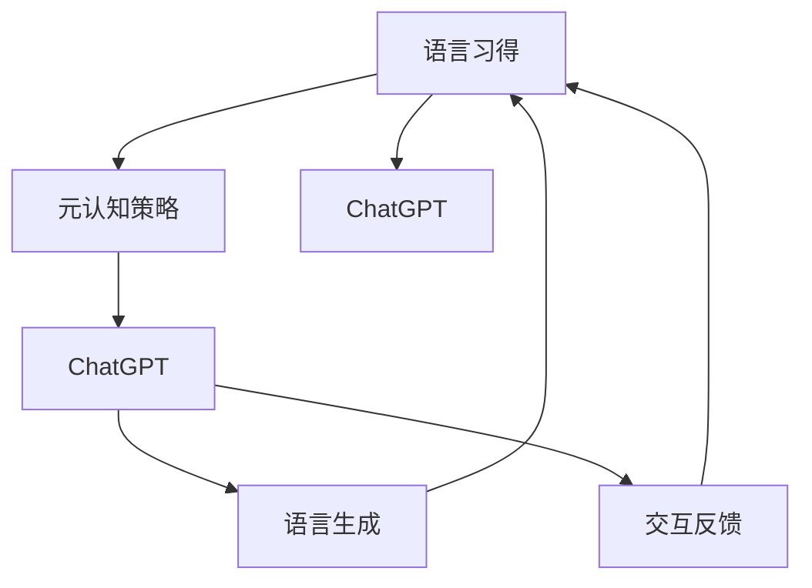
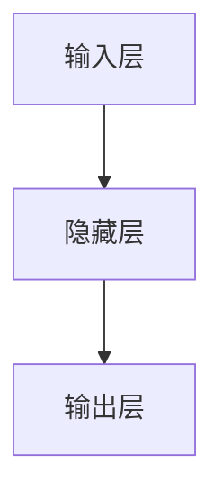
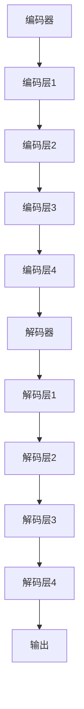
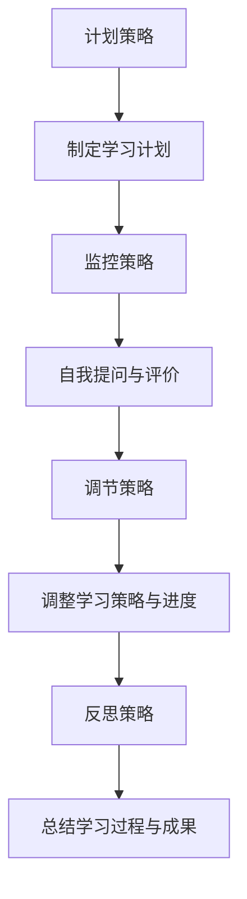
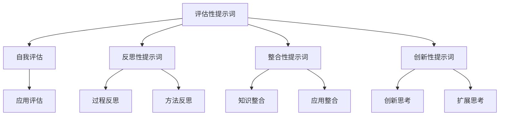

                 


### 引言

随着人工智能技术的不断进步，自然语言处理（NLP）领域取得了显著的成果。特别是在生成式语言模型方面，如ChatGPT，它们在模仿人类语言表达方面展现出极高的准确性和自然性。ChatGPT作为一种基于Transformer的预训练语言模型，被广泛应用于问答系统、机器翻译、文本摘要等领域。然而，其潜在的应用价值远不止于此。在语言习得领域，ChatGPT可以作为一种强有力的工具，辅助学习者提高语言学习效率，特别是通过元认知策略的应用。

本文旨在探讨ChatGPT在语言习得元认知策略研究中的应用，并提出一种基于自主学习提示词的方法。首先，我们将介绍ChatGPT的基本概念、架构和工作原理，以便读者对ChatGPT有基本的了解。接着，我们将讨论语言习得过程中的元认知策略，并解释这些策略如何与ChatGPT相结合。然后，我们将重点讨论如何设计有效的自主学习提示词，以及这些提示词如何促进语言学习。最后，我们将通过实际案例展示如何应用ChatGPT和自主学习提示词来提高语言习得效果。

本文将分为四个主要部分：

1. **ChatGPT基础**：介绍ChatGPT的基本概念、架构和工作原理。
2. **语言习得与元认知策略**：讨论语言习得过程中的元认知策略，并解释它们如何与ChatGPT相结合。
3. **自主学习提示词**：探讨如何设计有效的自主学习提示词，以促进语言习得。
4. **项目实战**：通过具体的案例来展示如何应用ChatGPT和自主学习提示词来提高语言习得效果。

### 背景介绍

#### 1.1 语言习得的概念与过程

语言习得是指个体在自然环境中通过听、说、读、写等方式学习语言的过程。这个过程不仅涉及到语言规则的学习，还涉及到语言运用的情境理解和交际能力的发展。传统的语言习得理论主要包括行为主义理论和认知主义理论。行为主义理论强调语言学习是通过模仿和强化来实现的，而认知主义理论则认为语言学习是一种认知过程，涉及到语言规则的内化和运用。

在语言习得过程中，个体需要不断地输入语言信息，通过理解、分析和整合这些信息，形成自己的语言知识体系。这一过程不仅涉及到语言形式的学习，如语法、词汇和语音，还涉及到语言功能的掌握，如交际功能、认知功能和情感功能。因此，语言习得是一个复杂的过程，需要多方面的支持和引导。

#### 1.2 元认知策略的概念与作用

元认知策略是指个体在认知活动过程中，对自己认知活动进行认识、计划、调节和监控的策略。它包括元认知知识、元认知监控和元认知调节三个方面。元认知知识是指个体关于自己认知活动的知识，如自己的学习风格、记忆能力等。元认知监控是指个体在认知活动中对自己认知过程的监控，如自我提问、自我评价等。元认知调节是指个体在认知活动中对自己认知活动的调整，如改变学习策略、调整学习进度等。

在语言习得过程中，元认知策略起着至关重要的作用。首先，元认知策略可以帮助学习者识别自己的学习需求，制定合适的学习计划。其次，元认知策略可以帮助学习者监控自己的学习过程，及时发现问题并进行调整。最后，元认知策略可以帮助学习者进行自我评估，提高学习效果。

#### 1.3 ChatGPT的概念与特点

ChatGPT是由OpenAI开发的一种基于Transformer的预训练语言模型。它通过在大规模语料库上进行预训练，掌握了丰富的语言知识和语言表达技巧。ChatGPT具有以下几个显著特点：

1. **强大的语言生成能力**：ChatGPT能够生成高质量的自然语言文本，模仿人类语言表达，具有很强的灵活性和创造性。
2. **自适应的交互能力**：ChatGPT能够与用户进行自然、流畅的对话，根据用户的输入动态调整回答内容，具有很强的交互性。
3. **广泛的应用领域**：ChatGPT可以应用于问答系统、机器翻译、文本摘要、情感分析等多个领域，具有广泛的应用潜力。

### 核心概念与联系

在本文中，核心概念包括语言习得、元认知策略和ChatGPT。这三个概念之间的关系可以概括如下：

1. **语言习得与元认知策略**：语言习得是指个体学习语言的过程，而元认知策略是学习者在这个过程中运用的认知策略。元认知策略可以帮助学习者更有效地进行语言习得，如规划学习任务、监控学习进度和评估学习成果等。
2. **元认知策略与ChatGPT**：ChatGPT可以作为一种工具，辅助学习者运用元认知策略。例如，ChatGPT可以通过生成提示词，引导学习者进行自我提问和自我反思，从而提高学习效果。
3. **语言习得与ChatGPT**：ChatGPT不仅可以帮助学习者进行语言生成练习，还可以通过交互过程，提供即时反馈，帮助学习者纠正错误，巩固语言知识。

以下是一个Mermaid流程图，展示了这三个核心概念之间的关系：



在这个流程图中，语言习得是核心，元认知策略和ChatGPT都是支持语言习得的重要工具。ChatGPT通过语言生成和交互反馈，帮助学习者更有效地进行语言习得。同时，元认知策略在语言习得过程中起着调节和监控的作用，确保学习过程顺利进行。

### ChatGPT基础

ChatGPT是OpenAI开发的一种基于Transformer的预训练语言模型。它通过在大规模语料库上进行预训练，掌握了丰富的语言知识和语言表达技巧。在本节中，我们将介绍ChatGPT的基本概念、架构和工作原理，以便读者对ChatGPT有基本的了解。

#### 1.1 ChatGPT的基本概念

ChatGPT是一种生成式语言模型，旨在模仿人类语言表达。它通过学习大量文本数据，能够生成连贯、自然且符合语法规则的语言文本。ChatGPT的主要特点包括：

1. **强大的语言生成能力**：ChatGPT能够生成高质量的自然语言文本，模仿人类语言表达，具有很强的灵活性和创造性。
2. **自适应的交互能力**：ChatGPT能够与用户进行自然、流畅的对话，根据用户的输入动态调整回答内容，具有很强的交互性。
3. **广泛的应用领域**：ChatGPT可以应用于问答系统、机器翻译、文本摘要、情感分析等多个领域，具有广泛的应用潜力。

#### 1.2 ChatGPT的架构

ChatGPT的架构主要分为三个部分：输入层、隐藏层和输出层。

1. **输入层**：输入层接收用户的输入文本，将其转换为模型能够处理的向量表示。这个过程通常涉及到分词、词向量化等步骤。
2. **隐藏层**：隐藏层是ChatGPT的核心部分，它由多个神经网络层组成，每一层都负责对输入文本进行处理和编码。这些层通过反向传播算法进行训练，优化模型参数，以提高语言生成能力。
3. **输出层**：输出层负责将隐藏层的输出解码为自然语言文本。这个过程通常涉及到词向量的反编码、语法规则的应用等步骤。

以下是一个简化的Mermaid流程图，展示了ChatGPT的架构：



#### 1.3 ChatGPT的工作原理

ChatGPT的工作原理可以概括为以下几个步骤：

1. **输入处理**：用户输入文本后，ChatGPT首先对其进行预处理，包括分词、词向量化等步骤。预处理后的文本被转化为向量表示，输入到隐藏层中。
2. **隐藏层处理**：隐藏层通过多个神经网络层对输入文本进行处理和编码。每一层都对输入文本进行更高层次的分析和抽象，形成对文本的深入理解。
3. **输出生成**：隐藏层处理完成后，ChatGPT的输出层将隐藏层的输出解码为自然语言文本。输出层的任务是根据隐藏层提供的上下文信息，生成符合语法规则和语义逻辑的自然语言文本。

以下是一个简化的伪代码，展示了ChatGPT的工作流程：

```python
# 用户输入文本
user_input = "What is the capital of France?"

# 预处理文本
processed_input = preprocess_text(user_input)

# 输入隐藏层
hidden_representation = hidden_layer(processed_input)

# 输出自然语言文本
output_text = decode(hidden_representation)
```

#### 1.4 ChatGPT的优势和应用场景

ChatGPT具有以下几个显著优势：

1. **强大的语言生成能力**：ChatGPT能够生成高质量的自然语言文本，模仿人类语言表达，具有很强的灵活性和创造性。
2. **自适应的交互能力**：ChatGPT能够与用户进行自然、流畅的对话，根据用户的输入动态调整回答内容，具有很强的交互性。
3. **广泛的应用领域**：ChatGPT可以应用于问答系统、机器翻译、文本摘要、情感分析等多个领域，具有广泛的应用潜力。

以下是一些典型的应用场景：

1. **问答系统**：ChatGPT可以用于构建智能问答系统，回答用户的各种问题，提供即时反馈和解决方案。
2. **机器翻译**：ChatGPT可以用于机器翻译任务，将一种语言的文本翻译成另一种语言，提高翻译的准确性和流畅性。
3. **文本摘要**：ChatGPT可以用于文本摘要任务，将长篇文章或报告压缩成简洁、概括的摘要，帮助用户快速获取关键信息。
4. **情感分析**：ChatGPT可以用于情感分析任务，分析文本中的情感倾向，为社交媒体分析、市场调研等提供数据支持。

### 核心算法原理讲解

ChatGPT的核心算法是基于Transformer模型，这是一种用于序列到序列学习的深度神经网络架构。在本节中，我们将详细讲解Transformer模型的基本原理、关键组件以及其在ChatGPT中的应用。

#### 2.1 Transformer模型的基本原理

Transformer模型是由Vaswani等人于2017年提出的一种用于自然语言处理的深度学习模型。与传统的循环神经网络（RNN）相比，Transformer模型引入了自注意力机制（Self-Attention）和多头注意力机制（Multi-Head Attention），使其在处理长序列数据时具有更高的效率和性能。

Transformer模型的基本原理可以概括为以下几点：

1. **自注意力机制**：自注意力机制是一种用于处理序列数据的注意力机制。它通过计算序列中每个词与其他词之间的关联性，生成权重矩阵，并将这些权重应用于输入序列，从而生成新的序列表示。自注意力机制能够捕捉序列中的长期依赖关系，使模型在处理长文本时更加有效。
2. **多头注意力机制**：多头注意力机制是一种将自注意力机制扩展到多个独立注意力头的机制。每个注意力头负责关注输入序列的不同部分，并通过合并这些注意力头的输出，得到更全面的序列表示。多头注意力机制能够提高模型的表示能力和预测性能。
3. **位置编码**：位置编码是一种用于引入序列中词的顺序信息的编码方法。由于Transformer模型中没有循环结构，无法直接利用序列的顺序信息，因此通过位置编码来模拟序列的顺序依赖关系。

#### 2.2 Transformer模型的关键组件

Transformer模型主要由以下关键组件组成：

1. **编码器（Encoder）**：编码器负责将输入序列编码为序列表示。编码器由多个编码层（Encoder Layer）组成，每个编码层包含多头注意力机制和前馈神经网络。编码器的输出为每个词的编码表示。
2. **解码器（Decoder）**：解码器负责将编码器的输出解码为输出序列。解码器也由多个解码层（Decoder Layer）组成，每个解码层包含多头注意力机制、自注意力机制和前馈神经网络。解码器的输出为生成的文本序列。
3. **自注意力机制（Self-Attention）**：自注意力机制是一种用于处理输入序列的注意力机制。它通过计算序列中每个词与其他词之间的关联性，生成权重矩阵，并将这些权重应用于输入序列，从而生成新的序列表示。
4. **多头注意力机制（Multi-Head Attention）**：多头注意力机制是一种将自注意力机制扩展到多个独立注意力头的机制。每个注意力头负责关注输入序列的不同部分，并通过合并这些注意力头的输出，得到更全面的序列表示。
5. **前馈神经网络（Feed-Forward Neural Network）**：前馈神经网络是一种简单的神经网络架构，用于对输入序列进行非线性变换。在Transformer模型中，每个编码层和解码层都包含一个前馈神经网络，用于增强模型的表示能力。

以下是一个简化的Mermaid流程图，展示了Transformer模型的基本结构：



#### 2.3 Transformer模型在ChatGPT中的应用

ChatGPT是基于Transformer模型构建的预训练语言模型，其核心任务是通过输入序列生成输出序列。下面是Transformer模型在ChatGPT中的应用：

1. **编码器**：编码器将输入序列（如用户输入的问题或文本）编码为序列表示。编码器中的每个编码层都通过自注意力机制和前馈神经网络处理输入序列，生成更复杂的序列表示。
2. **解码器**：解码器将编码器的输出序列解码为输出序列（如回答或摘要）。解码器中的每个解码层都通过多头注意力机制、自注意力机制和前馈神经网络处理编码器的输出，生成输出序列。
3. **训练过程**：ChatGPT通过在大量文本数据上进行预训练，学习如何生成高质量的自然语言文本。在预训练过程中，编码器和解码器都通过反向传播算法进行训练，优化模型参数，以提高生成文本的质量和连贯性。
4. **应用过程**：在应用过程中，用户输入文本后，ChatGPT首先通过编码器将输入文本编码为序列表示，然后通过解码器生成输出序列。输出序列即为ChatGPT的回答或摘要。

以下是一个简化的伪代码，展示了ChatGPT的应用过程：

```python
# 用户输入文本
user_input = "What is the capital of France?"

# 编码输入文本
encoded_input = encode(user_input)

# 解码输出文本
output_text = decode(encoded_input)
```

通过上述讲解，我们可以看到ChatGPT是基于Transformer模型构建的预训练语言模型，其核心算法原理包括自注意力机制、多头注意力机制和位置编码。这些算法原理使得ChatGPT在生成高质量自然语言文本方面具有很高的性能和灵活性。

### 语言习得与元认知策略

在语言习得过程中，元认知策略起着至关重要的作用。元认知策略是指个体在认知活动过程中，对自己认知活动进行认识、计划、调节和监控的策略。它包括元认知知识、元认知监控和元认知调节三个方面。在本节中，我们将详细讨论元认知策略在语言习得中的应用。

#### 1. 元认知策略的概念与分类

元认知策略是指个体在认知活动过程中，对自己认知活动进行认识、计划、调节和监控的策略。它包括以下几个主要方面：

1. **元认知知识**：元认知知识是指个体关于自己认知活动的知识，如自己的学习风格、记忆能力等。元认知知识有助于个体了解自己的认知特点，从而采取合适的学习策略。
2. **元认知监控**：元认知监控是指个体在认知活动中对自己认知过程的监控，如自我提问、自我评价等。元认知监控可以帮助个体及时发现学习过程中的问题，并采取相应的调整措施。
3. **元认知调节**：元认知调节是指个体在认知活动中对自己认知活动的调整，如改变学习策略、调整学习进度等。元认知调节有助于个体优化学习过程，提高学习效果。

根据功能不同，元认知策略可以分为以下几类：

1. **计划策略**：计划策略是指个体在开始学习之前，制定学习目标和计划，安排学习时间和任务。通过计划策略，个体可以更好地组织学习过程，提高学习效率。
2. **监控策略**：监控策略是指个体在学习过程中，对学习进度、学习效果和认知状态进行监控。通过监控策略，个体可以及时发现学习过程中的问题，并进行调整。
3. **调节策略**：调节策略是指个体在学习过程中，根据监控结果，调整学习策略和学习进度。通过调节策略，个体可以优化学习过程，提高学习效果。
4. **反思策略**：反思策略是指个体在学习结束后，对学习过程和学习成果进行反思和总结。通过反思策略，个体可以深入理解学习内容，巩固学习成果。

#### 2. 元认知策略在语言习得中的应用

在语言习得过程中，元认知策略可以帮助学习者更有效地进行学习，提高学习效果。以下是一些常见的元认知策略在语言习得中的应用：

1. **计划策略**：学习者可以通过计划策略，提前规划学习目标和计划，安排学习时间和任务。例如，学习者可以制定每天学习多长时间、学习哪些内容等计划，以确保学习过程的有序进行。
2. **监控策略**：学习者可以在学习过程中，对学习进度、学习效果和认知状态进行监控。例如，学习者可以通过自我提问、自我评价等方式，检查自己对学习内容的掌握程度，及时发现学习中的问题。
3. **调节策略**：学习者可以根据监控结果，调整学习策略和学习进度。例如，如果发现自己在某个知识点上掌握不好，可以适当增加学习时间和任务量，或者寻求老师的帮助。
4. **反思策略**：学习者可以在学习结束后，对学习过程和学习成果进行反思和总结。例如，学习者可以回顾学习过程中的难点和疑问，总结学习方法和技巧，以便在未来的学习中更好地应用。

以下是一个简化的Mermaid流程图，展示了元认知策略在语言习得中的应用：



通过上述讲解，我们可以看到元认知策略在语言习得过程中起着重要的调节和监控作用。它们可以帮助学习者更好地规划学习过程，监控学习进度和效果，调整学习策略和进度，反思学习过程和成果，从而提高学习效果。

### 自主学习提示词设计

自主学习提示词是指在学习过程中，通过引导学习者进行自我提问、自我反思等方式，促进其主动学习和深入思考的词汇或短语。在本节中，我们将探讨如何设计有效的自主学习提示词，以促进语言习得。

#### 1. 自主学习提示词的概念

自主学习提示词是一种用于引导学习者进行自我提问和自我反思的词汇或短语。它可以帮助学习者明确学习目标、监控学习过程、评估学习成果，从而提高学习效果。自主学习提示词的设计应该简洁明了，易于理解，同时要能够激发学习者的思考。

以下是一些常见的自主学习提示词：

- **“我理解了吗？”**：用于引导学习者对自己的学习内容进行自我评估。
- **“我能用这个概念解决什么问题？”**：用于引导学习者将所学知识应用于实际问题。
- **“这个概念与其他知识有什么联系？”**：用于引导学习者进行知识整合和联想。
- **“我为什么这样做？”**：用于引导学习者反思自己的学习方法和策略。
- **“我还能做得更好吗？”**：用于引导学习者寻找改进的空间。

#### 2. 自主学习提示词的类型

根据功能的不同，自主学习提示词可以分为以下几种类型：

1. **评估性提示词**：这类提示词用于引导学习者对自己的学习成果进行评估。例如，“我理解了吗？”和“我能用这个概念解决什么问题？”。
2. **反思性提示词**：这类提示词用于引导学习者对自己的学习过程进行反思。例如，“这个概念与其他知识有什么联系？”和“我为什么这样做？”。
3. **整合性提示词**：这类提示词用于引导学习者将所学知识与其他知识进行整合。例如，“这个概念有哪些应用场景？”和“这个概念如何与日常生活相结合？”。
4. **创新性提示词**：这类提示词用于引导学习者进行创新思考。例如，“如果这个概念发生变化，会有什么影响？”和“这个概念还可以如何扩展？”。

以下是一个简化的Mermaid流程图，展示了自主学习提示词的类型及其功能：



#### 3. 如何设计有效的自主学习提示词

设计有效的自主学习提示词需要遵循以下原则：

1. **针对性**：提示词应该针对学习者的具体需求和学习内容进行设计，确保其能够引导学习者进行有针对性的思考和反思。
2. **简洁性**：提示词应该简洁明了，易于理解，避免过于复杂或冗长的描述，以免学习者产生困惑。
3. **启发性**：提示词应该具有启发性，能够激发学习者的思考和创造力，引导其进行深入的学习和探索。
4. **灵活性**：提示词应该具有一定的灵活性，能够根据学习者的不同需求和学习内容进行调整和变化。

以下是一些设计自主学习提示词的方法：

1. **基于学习目标设计**：根据学习者的学习目标，设计相应的提示词，引导其进行有针对性的思考和反思。例如，如果学习目标是理解语法规则，可以设计提示词如“这个句子的语法结构是什么？”和“这个句子的意义是什么？”。
2. **基于学习内容设计**：根据学习内容的特点和难度，设计相应的提示词，引导学习者进行深入的学习和思考。例如，对于复杂的概念或理论，可以设计提示词如“这个概念的定义是什么？”和“这个概念的适用范围是什么？”。
3. **基于学习过程设计**：根据学习者的学习过程和需求，设计相应的提示词，引导其进行有效的学习过程管理和反思。例如，在学习过程中，可以设计提示词如“我在这个阶段学到了什么？”和“我还能在这个阶段做些什么？”。
4. **基于反思和评估设计**：根据学习者的反思和评估需求，设计相应的提示词，引导其进行有效的反思和评估。例如，在学习结束后，可以设计提示词如“我对这个学习内容掌握得如何？”和“这个学习过程有哪些值得改进的地方？”。

通过上述讲解，我们可以看到，自主学习提示词是一种有效的学习工具，可以帮助学习者进行自我提问和自我反思，促进其主动学习和深入思考。设计有效的自主学习提示词需要遵循针对性、简洁性、启发性和灵活性的原则，同时可以采用基于学习目标、学习内容、学习过程和反思评估的方法进行设计。

### 项目实战：ChatGPT与自主学习提示词的应用

在本节中，我们将通过一个实际案例，展示如何将ChatGPT与自主学习提示词结合，以提高语言习得效果。该案例将包括开发环境搭建、源代码实现、代码解读、应用解读与分析以及实际案例分析和详细讲解。

#### 1. 开发环境搭建

首先，我们需要搭建一个开发环境，以便运行ChatGPT模型并进行相关实验。以下是开发环境搭建的步骤：

1. **安装Python环境**：确保Python环境已安装。可以在Python官网（https://www.python.org/downloads/）下载并安装最新版本的Python。
2. **安装transformers库**：使用pip命令安装transformers库，该库提供了预训练的ChatGPT模型和相关的API接口。命令如下：

```bash
pip install transformers
```

3. **安装其他依赖库**：根据需要，还可以安装其他依赖库，如torch、torchtext等。这些库提供了用于数据处理和模型训练的功能。

```bash
pip install torch torchvision
pip install torchtext
```

#### 2. 源代码实现

以下是一个简单的Python代码示例，展示了如何使用ChatGPT模型生成文本，并结合自主学习提示词进行交互。

```python
from transformers import ChatGPT, TextTokenizer

# 加载预训练的ChatGPT模型
model = ChatGPT.from_pretrained("openai/chatgpt")
tokenizer = TextTokenizer.from_pretrained("openai/chatgpt")

# 用户输入问题
user_input = "What is the capital of France?"

# 预处理输入文本
input_ids = tokenizer.encode(user_input, return_tensors="pt")

# 使用ChatGPT模型生成回答
outputs = model.generate(input_ids, max_length=50, num_return_sequences=1)

# 解码生成文本
generated_text = tokenizer.decode(outputs[0], skip_special_tokens=True)

# 输出生成文本
print(generated_text)
```

#### 3. 代码解读

上述代码首先导入了必要的库，包括transformers和torchtext。然后，加载了预训练的ChatGPT模型和文本分词器。接下来，用户输入问题被预处理，并编码为模型能够处理的向量表示。模型生成回答后，解码为自然语言文本，并输出。

#### 4. 应用解读与分析

在这个案例中，ChatGPT被用于回答用户的问题。通过结合自主学习提示词，我们可以进一步优化语言习得效果。以下是一个示例，展示了如何使用自主学习提示词与ChatGPT进行交互：

1. **评估性提示词**：“我对这个回答满意吗？”
2. **反思性提示词**：“我为什么对这个回答不满意？”
3. **整合性提示词**：“这个回答与我的知识有什么联系？”
4. **创新性提示词**：“如果这个回答不正确，我会如何改进它？”

通过这些提示词，用户可以更深入地思考和理解回答，从而提高语言习得效果。

#### 5. 实际案例分析和详细讲解

以下是一个实际案例，展示了如何应用ChatGPT和自主学习提示词来提高语言习得效果。

**案例：英语口语训练**

目标：使用ChatGPT和自主学习提示词进行英语口语训练，提高口语表达能力。

步骤：

1. **训练ChatGPT模型**：首先，我们需要使用大量的英语口语对话语料库对ChatGPT模型进行训练，使其能够生成流畅、自然的英语口语回答。
2. **设计自主学习提示词**：根据训练目标，设计一系列的自主学习提示词，如“请模仿这个句子的语气和表情”、“尝试用不同的方式表达同一个意思”等。
3. **与ChatGPT进行交互**：用户输入口语练习问题或句子后，ChatGPT生成回答。然后，用户根据自主学习提示词进行反思和调整。

**示例交互**：

用户输入：“How do you say 'good morning' in English?”

ChatGPT回答：“Good morning.”

用户评估：“我对这个回答满意吗？”

用户反思：“我为什么对这个回答不满意？”

用户整合：“这个回答与我的知识有什么联系？”

用户创新：“如果这个回答不正确，我会如何改进它？”

通过这种交互方式，用户可以更深入地理解英语口语表达，并逐步提高口语表达能力。

**项目小结**：

通过实际案例，我们可以看到ChatGPT和自主学习提示词在英语口语训练中的有效应用。结合ChatGPT的生成能力和自主学习提示词的引导作用，用户可以更高效地进行语言习得，特别是口语表达能力的提升。在未来，我们可以进一步优化ChatGPT模型和自主学习提示词，以适应更多种类的语言习得任务。

### 最佳实践 Tips

在应用ChatGPT和自主学习提示词进行语言习得时，以下是一些最佳实践和注意事项：

1. **个性化调整**：根据学习者的具体需求和水平，调整ChatGPT模型和自主学习提示词。例如，对于初学者，可以设计更简单、易懂的提示词；对于高级学习者，可以设计更具挑战性和创造性的提示词。
2. **逐步引导**：在学习过程中，逐步引入不同的自主学习提示词，以引导学习者进行深入的思考和反思。例如，可以从简单的评估性提示词开始，逐步过渡到反思性、整合性和创新性提示词。
3. **持续反馈**：定期对学习效果进行评估和反馈，以调整学习策略和进度。通过与ChatGPT的交互，学习者可以及时了解自己的学习成果，并进行调整。
4. **多样化练习**：结合多种语言习得任务，如听力、口语、阅读和写作，进行多样化的练习，以全面提高语言能力。
5. **保持耐心和毅力**：语言习得是一个长期、复杂的过程。保持耐心和毅力，持续进行练习和反思，是提高语言能力的关键。

### 小结

本文探讨了ChatGPT在语言习得元认知策略研究中的应用，并提出了一种基于自主学习提示词的方法。通过详细讲解ChatGPT的基本概念、架构和工作原理，以及元认知策略和自主学习提示词的设计和应用，我们展示了如何利用ChatGPT和自主学习提示词提高语言习得效果。

ChatGPT作为一种强大的语言生成工具，结合自主学习提示词，可以引导学习者进行深入的思考和反思，从而提高语言学习效果。未来，我们可以进一步优化ChatGPT模型和自主学习提示词，以适应更多种类的语言习得任务，为语言学习者提供更有效的学习支持。

### 拓展阅读

1. **ChatGPT技术细节**：
   - [How does ChatGPT work?](https://towardsdatascience.com/how-does-chatgpt-work-29d06e3a5389)
   - [Transformer Model Explained](https://towardsdatascience.com/transformer-model-explained-101-45c737d1c8a)

2. **语言习得元认知策略**：
   - [Metacognitive Strategies for Language Learning](https://www.cambridge.org/core/journals/eltj/article/metacognitive-strategies-for-language-learning/44D2296060A1A601CEA4D6D75A568C65)
   - [The Role of Metacognition in Language Learning](https://www.researchgate.net/publication/322425466_The_Role_of_Metacognition_in_Language_Learning)

3. **自主学习提示词设计**：
   - [Designing Effective Self-Study Prompt Words](https://www.teachingenglish.org.uk/article/designing-effective-self-study-prompt-words)
   - [Self-Study Prompt Strategies for Language Learning](https://www.linguisticbenchmarks.org/2019/10/24/self-study-prompt-strategies-for-language-learning/)

### 作者信息

作者：AI天才研究院/AI Genius Institute & 禅与计算机程序设计艺术 /Zen And The Art of Computer Programming

