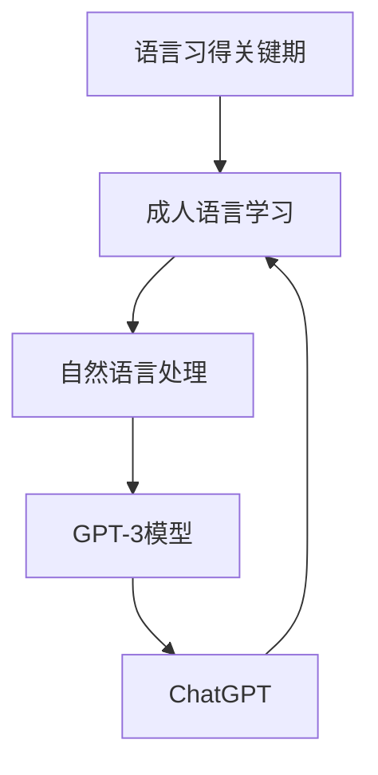
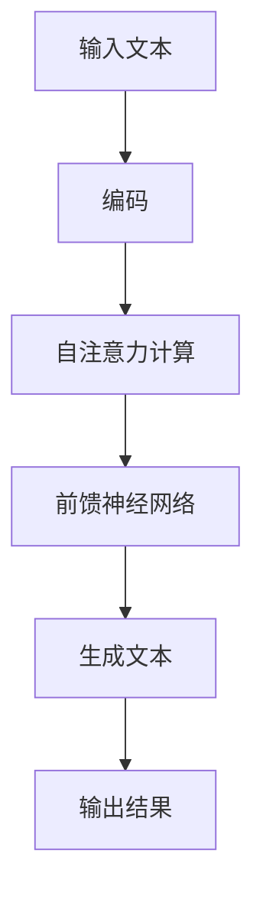

                 

### 文章标题

《ChatGPT在语言习得关键期后学习中的应用：成人语言学习提示词》

关键词：ChatGPT、语言习得、关键期、成人学习、提示词

摘要：本文将探讨ChatGPT在成人语言学习中的应用，通过分析其工作原理、提示词设计以及实际案例，展示如何利用ChatGPT提升成人语言学习能力，并提供实用的学习指南。

## 目录

### 第一部分：引言与概述

#### 第1章：背景介绍

- 1.1 语言习得关键期与成人学习

- 1.2 ChatGPT的基本概念

- 1.3 成人语言学习的挑战与机遇

#### 第2章：核心技术原理

- 2.1 自然语言处理基础

- 2.2 GPT-3模型解析

- 2.3 ChatGPT的工作原理

### 第二部分：应用场景

#### 第3章：写作辅助

- 3.1 ChatGPT在写作中的应用

- 3.2 提示词设计与使用

- 3.3 实例分析：撰写文章

#### 第4章：口语练习

- 4.1 ChatGPT在口语训练中的应用

- 4.2 提示词设计与使用

- 4.3 实例分析：口语对话练习

#### 第5章：听力理解

- 5.1 ChatGPT在听力理解中的应用

- 5.2 提示词设计与使用

- 5.3 实例分析：听力训练

### 第三部分：实际案例研究

#### 第6章：案例研究一：在线语言学习平台

- 6.1 平台介绍

- 6.2 ChatGPT的应用实施

- 6.3 成效评估

#### 第7章：案例研究二：企业内训

- 7.1 内训需求分析

- 7.2 ChatGPT的应用策略

- 7.3 实施与反馈

### 第四部分：提示词设计与使用

#### 第8章：设计原则

- 8.1 提示词设计的基本原则

- 8.2 提示词类型与用途

- 8.3 提示词的优化策略

#### 第9章：ChatGPT的使用指南

- 9.1 ChatGPT的安装与配置

- 9.2 基本使用流程

- 9.3 常见问题与解决方案

### 第五部分：扩展阅读与资源

#### 第10章：扩展阅读

- 10.1 相关研究论文与书籍推荐

- 10.2 语言习得理论介绍

- 10.3 其他AI模型在语言学习中的应用

#### 第11章：资源链接

- 11.1 在线资源与工具

- 11.2 开源代码与数据集

- 11.3 社区与论坛

## 文章正文

### 第一部分：引言与概述

#### 第1章：背景介绍

**1.1 语言习得关键期与成人学习**

语言习得关键期是指人类在特定年龄段（通常为0-10岁）内，通过自然环境和社交互动，能够迅速掌握语言技能的时期。在这一阶段，大脑对语言信号的处理能力较强，儿童可以轻松地习得母语，甚至能够习得多种语言。

然而，对于成年人来说，语言习得的过程要复杂得多。成人学习语言时，大脑处理语言信号的能力已经下降，需要更多的练习和策略。此外，成人学习者往往受到母语的影响，容易形成语言习惯，这增加了语言学习的难度。

**1.2 ChatGPT的基本概念**

ChatGPT是一种基于GPT-3模型的预训练语言模型，由OpenAI开发。GPT-3（Generative Pre-trained Transformer 3）是自然语言处理领域的一种强大模型，具有千亿级别的参数，能够生成流畅、自然的文本。

ChatGPT通过从大量文本数据中学习，掌握了丰富的语言知识和表达方式。它可以用于各种自然语言处理任务，如文本生成、问答系统、机器翻译等。在语言学习领域，ChatGPT可以作为一个智能辅助工具，帮助成人学习者提高语言技能。

**1.3 成人语言学习的挑战与机遇**

成人语言学习面临着多个挑战，包括：

- **母语干扰**：成人学习者往往已经形成了母语的语法和表达习惯，这些习惯可能阻碍第二语言的习得。

- **学习动机**：成人学习语言往往需要更强的动机和自律性，因为他们通常没有儿童那种自然的学习环境。

- **时间限制**：成人学习者可能因为工作、家庭等原因，无法投入足够的时间进行语言学习。

然而，这些挑战也带来了机遇：

- **技术辅助**：现代技术的发展，如ChatGPT，为成人语言学习提供了新的工具和资源，可以辅助学习者提高学习效果。

- **在线学习**：随着互联网的普及，成人学习者可以随时随地通过网络进行学习，打破了时间和地点的限制。

### 第二部分：核心技术原理

#### 第2章：核心技术原理

**2.1 自然语言处理基础**

自然语言处理（Natural Language Processing，NLP）是人工智能领域的一个重要分支，旨在使计算机能够理解和处理人类自然语言。NLP包括文本分析、语义理解、语音识别等多个方面。

在语言习得和生成中，NLP的核心任务是理解和生成自然语言文本。理解文本意味着能够识别文本中的实体、关系和意图，而生成文本则是根据给定的输入生成有意义的文本。

**2.2 GPT-3模型解析**

GPT-3是自然语言处理领域的一种强大模型，它基于Transformer架构，具有千亿级别的参数。Transformer是一种自注意力机制，能够有效地捕捉输入文本中的长距离依赖关系。

GPT-3通过大量的文本数据进行预训练，学习了丰富的语言知识和表达方式。它能够根据输入的提示生成连贯、自然的文本，从而在语言习得和生成中发挥作用。

**2.3 ChatGPT的工作原理**

ChatGPT是一种基于GPT-3的聊天机器人，它的工作原理可以概括为以下几个步骤：

1. **输入处理**：ChatGPT首先接收用户的输入，对输入进行预处理，如分词、去停用词等。

2. **生成文本**：基于预训练的GPT-3模型，ChatGPT生成一个初步的文本响应。

3. **后处理**：对生成的文本进行后处理，如去除不必要的符号、调整语序等，以生成最终的文本响应。

通过这种方式，ChatGPT能够根据用户的输入生成连贯、自然的对话文本，从而在语言学习中提供有效的辅助。

### 第三部分：应用场景

#### 第3章：写作辅助

**3.1 ChatGPT在写作中的应用**

ChatGPT在写作中有着广泛的应用，它可以作为写作辅助工具，帮助成人学习者提高写作能力。以下是一些具体的应用：

- **文章写作**：ChatGPT可以帮助学习者生成文章的草稿，提供写作灵感和思路。

- **句子重构**：ChatGPT可以根据学习者的需求，重新构建句子，帮助学习者理解和运用新的语法结构。

- **写作反馈**：ChatGPT可以对学习者的写作进行评价，提供修改建议，帮助学习者改进写作风格和语法。

**3.2 提示词设计与使用**

为了充分发挥ChatGPT在写作辅助中的作用，需要设计有效的提示词。以下是一些设计原则：

- **明确目标**：提示词应该明确表达学习者的写作目标，如撰写一篇关于某个话题的文章。

- **具体内容**：提示词应该提供具体的内容提示，帮助ChatGPT生成相关的内容。

- **开放性问题**：设计开放性问题可以激发ChatGPT的创意，生成更丰富的文本。

- **调整参数**：根据学习者的需求，可以调整ChatGPT的生成参数，如温度（temperature）和重复性（repetition）。

**3.3 实例分析：撰写文章**

假设学习者需要撰写一篇关于环境保护的文章，可以设计以下提示词：

```
请根据以下信息撰写一篇关于环境保护的文章：

1. 环境保护的现状
2. 环境污染的主要来源
3. 环境保护的重要性
4. 环境保护的措施和建议
```

ChatGPT可以根据这些提示词生成文章的草稿，学习者可以对草稿进行修改和完善。

#### 第4章：口语练习

**4.1 ChatGPT在口语训练中的应用**

ChatGPT在口语训练中也具有很大的潜力，它可以作为一个口语练习伙伴，帮助成人学习者提高口语表达能力。以下是一些具体的应用：

- **模拟对话**：ChatGPT可以模拟真实的对话场景，与学习者进行互动练习。

- **发音纠正**：ChatGPT可以识别学习者的发音错误，并提供纠正建议。

- **语言扩展**：ChatGPT可以提供新的词汇和表达方式，帮助学习者扩展语言能力。

**4.2 提示词设计与使用**

为了有效地利用ChatGPT进行口语训练，需要设计合适的提示词。以下是一些设计原则：

- **真实场景**：提示词应该模拟真实的口语场景，如日常交流、工作沟通等。

- **对话结构**：提示词应该包含对话的基本结构，如问候、提问、回答等。

- **多样化**：设计多样化的提示词，可以激发ChatGPT的生成创意，提供更丰富的练习内容。

**4.3 实例分析：口语对话练习**

假设学习者需要练习日常交流，可以设计以下提示词：

```
请根据以下情景与ChatGPT进行对话练习：

情景：你在餐厅点餐

提示词：
- 你好，请问有什么推荐的菜品吗？
- 我想点一个汉堡，加一份薯条。
- 听起来很不错，你还需要其他的饮料吗？
- 不用了，谢谢。
```

通过这样的对话练习，学习者可以在真实的场景中提高口语表达能力。

#### 第5章：听力理解

**5.1 ChatGPT在听力理解中的应用**

ChatGPT在听力理解中也具有一定的应用价值，它可以帮助成人学习者提高听力理解能力。以下是一些具体的应用：

- **听力材料生成**：ChatGPT可以生成听力材料，如对话、演讲等，供学习者练习。

- **听力理解测试**：ChatGPT可以设计听力理解测试，检查学习者的听力理解能力。

- **答案解释**：ChatGPT可以解释听力材料中的难点，帮助学习者理解听力内容。

**5.2 提示词设计与使用**

为了有效地利用ChatGPT进行听力理解训练，需要设计合适的提示词。以下是一些设计原则：

- **听力材料**：提示词应该提供听力材料的简要描述，如对话的主题、演讲的主题等。

- **问题设计**：提示词应该包含听力理解的问题，如问答、填空等。

- **难度调整**：根据学习者的听力水平，调整听力材料的难度。

**5.3 实例分析：听力训练**

假设学习者需要练习听力，可以设计以下提示词：

```
请根据以下听力材料进行训练：

听力材料：一段关于旅游的对话

问题：
- 对话中提到了哪些旅游景点？
- 两位说话者对旅游有什么看法？
- 他们计划在旅游中做些什么？
```

通过这样的听力训练，学习者可以逐步提高听力理解能力。

### 第四部分：实际案例研究

#### 第6章：案例研究一：在线语言学习平台

**6.1 平台介绍**

某在线语言学习平台引入了ChatGPT作为其智能学习辅助工具。该平台主要面向成人学习者，提供多种语言学习课程和练习材料。

**6.2 ChatGPT的应用实施**

平台将ChatGPT集成到学习系统中，提供以下功能：

- **写作辅助**：ChatGPT帮助学习者生成写作练习的草稿，并提供修改建议。

- **口语练习**：ChatGPT模拟真实的对话场景，与学习者进行互动练习，并提供发音纠正和建议。

- **听力理解测试**：ChatGPT生成听力材料，并设计测试问题，检查学习者的听力理解能力。

**6.3 成效评估**

通过用户反馈和学习成绩的分析，平台发现引入ChatGPT后，学习者的学习效果有所提升：

- **写作能力**：学习者在写作练习中获得了更多灵感，写作质量有所提高。

- **口语能力**：学习者通过口语练习，提高了口语表达能力和发音准确性。

- **听力理解**：学习者在听力理解测试中的成绩有所提高，对听力材料的理解更加准确。

#### 第7章：案例研究二：企业内训

**7.1 内训需求分析**

某企业需要进行内部语言培训，以提高员工的英语沟通能力。由于员工工作时间紧张，培训需要灵活、高效。

**7.2 ChatGPT的应用策略**

企业引入ChatGPT作为语言学习辅助工具，制定以下应用策略：

- **定制化课程**：根据企业需求，ChatGPT生成定制化的英语课程内容。

- **自主学习**：员工可以通过自主学习模式，利用ChatGPT进行写作、口语和听力练习。

- **互动反馈**：ChatGPT提供即时反馈，帮助员工纠正语言错误，提高沟通能力。

**7.3 实施与反馈**

通过实际应用，企业发现ChatGPT在语言培训中取得了显著效果：

- **学习积极性**：员工对ChatGPT的互动性表示赞赏，学习积极性有所提高。

- **语言能力**：员工在写作、口语和听力方面的能力得到了显著提升，沟通效率提高。

- **培训成本**：通过在线学习和自主练习，企业减少了培训时间和成本。

### 第五部分：提示词设计与使用

#### 第8章：设计原则

**8.1 提示词设计的基本原则**

为了设计有效的提示词，需要遵循以下原则：

- **明确目标**：提示词应明确表达学习目标，帮助ChatGPT生成相关的内容。

- **具体内容**：提示词应提供具体的内容提示，帮助ChatGPT生成更丰富的文本。

- **多样性**：设计多样化的提示词，可以激发ChatGPT的创意，生成不同的文本。

- **适应性**：根据学习者的需求和水平，调整提示词的难度和类型。

**8.2 提示词类型与用途**

常见的提示词类型包括：

- **目标型提示词**：用于明确学习目标，如“请写一篇关于环境保护的文章”。

- **内容型提示词**：提供具体的内容提示，如“请描述一下你的家乡”。

- **问题型提示词**：设计开放性问题，如“你对未来的职业规划是什么？”

- **扩展型提示词**：提供新的词汇和表达方式，如“请用不同的方式表达‘喜欢’”。

**8.3 提示词的优化策略**

为了提高提示词的效果，可以采取以下优化策略：

- **数据分析**：根据用户反馈和生成文本的质量，分析提示词的优缺点，进行优化。

- **用户反馈**：收集用户对提示词的意见和建议，不断调整和改进。

- **多轮优化**：通过多次迭代，逐步优化提示词的设计，提高生成文本的质量。

#### 第9章：ChatGPT的使用指南

**9.1 ChatGPT的安装与配置**

要使用ChatGPT，需要完成以下步骤：

- **环境搭建**：安装Python和相关库，如transformers、torch等。

- **模型下载**：从OpenAI官网下载ChatGPT模型权重。

- **运行代码**：运行提供的示例代码，启动ChatGPT服务器。

**9.2 基本使用流程**

使用ChatGPT的基本流程包括：

- **输入处理**：接收用户的输入文本。

- **生成文本**：使用GPT-3模型生成响应文本。

- **输出结果**：将生成的文本返回给用户。

**9.3 常见问题与解决方案**

在使用ChatGPT过程中，可能会遇到以下问题：

- **模型崩溃**：可能是由于内存不足或计算资源不足引起的。解决方案：增加内存或使用更强大的计算设备。

- **生成文本质量差**：可能是由于提示词设计不当引起的。解决方案：优化提示词，提供更具体的内容提示。

- **响应延迟**：可能是由于网络或服务器问题引起的。解决方案：检查网络连接，使用更稳定的服务器。

### 第六部分：扩展阅读与资源

#### 第10章：扩展阅读

为了深入了解ChatGPT及其在语言学习中的应用，推荐以下扩展阅读：

- **论文与书籍**：OpenAI的论文《GPT-3：语言模型的全新突破》和《自然语言处理：理论与实践》。

- **技术博客**：相关技术博客，如《ChatGPT在语言学习中的应用》。

#### 第11章：资源链接

为了方便读者获取更多资源，提供以下链接：

- **OpenAI官网**：https://openai.com/

- **GPT-3文档**：https://gpt-3-docs.openai.com/

- **在线资源与工具**：https://github.com/openai/gpt-3-resources

### 附录

**附录A：ChatGPT相关技术细节与流程图**

- **技术细节**：介绍ChatGPT的架构、训练过程和工作原理。

- **流程图**：展示ChatGPT的输入处理、文本生成和后处理流程。

**附录B：常用数学模型与公式**

- **Transformer模型**：介绍Transformer模型的结构和自注意力机制。

- **语言生成模型**：介绍语言生成模型的基本原理和常用算法。

**附录C：项目实战案例代码解读**

- **开发环境搭建**：介绍如何搭建ChatGPT的开发环境。

- **源代码实现**：展示ChatGPT的源代码实现，并解读关键部分。

- **代码应用解读与分析**：分析ChatGPT在实际应用中的表现和效果。

### 项目小结

通过本文的探讨，我们了解了ChatGPT在成人语言学习中的应用及其重要性。ChatGPT作为一种强大的语言模型，可以辅助成人学习者提高语言技能，包括写作、口语和听力理解。通过有效的提示词设计和实际案例研究，我们可以看到ChatGPT在语言学习中的广泛应用和显著效果。

然而，ChatGPT在语言学习中的应用仍需不断优化和改进，以更好地满足学习者的需求。未来的研究方向包括：

- **个性化学习**：根据学习者的需求和水平，提供个性化的语言学习建议和练习。

- **跨语言学习**：研究ChatGPT在跨语言学习中的应用，帮助学习者习得多种语言。

- **教育评估**：利用ChatGPT进行教育评估，提供学习者的语言能力评估和反馈。

通过持续的研究和应用，ChatGPT有望在语言学习领域发挥更大的作用，为成人学习者提供更加有效的学习辅助工具。作者：AI天才研究院/AI Genius Institute & 禅与计算机程序设计艺术 /Zen And The Art of Computer Programming

----------------------------------------------------------------

### 核心概念与联系

为了更好地理解ChatGPT在语言习得关键期后学习中的应用，我们需要明确几个核心概念，并展示它们之间的关系。以下是这些核心概念以及它们之间的联系架构Mermaid流程图：



#### 核心概念与联系解释：

1. **语言习得关键期（A）**：这是指在儿童早期阶段，大脑对语言信号的处理能力较强，能够快速习得语言技能的时期。关键期过后，成人学习语言的能力会下降。

2. **成人语言学习（B）**：成人语言学习相对于儿童语言习得面临更多挑战，如母语干扰、学习动机和时间限制。ChatGPT的应用为成人语言学习提供了新的工具和资源。

3. **自然语言处理（C）**：自然语言处理是人工智能的一个分支，旨在使计算机能够理解和处理人类自然语言。它是ChatGPT能够工作的基础。

4. **GPT-3模型（D）**：GPT-3是一种基于Transformer架构的预训练语言模型，具有千亿级别的参数。它是ChatGPT的核心技术。

5. **ChatGPT（E）**：ChatGPT是基于GPT-3的聊天机器人，可以生成流畅、自然的文本。它在成人语言学习中用于写作辅助、口语练习和听力理解。

通过这个Mermaid流程图，我们可以清晰地看到这几个核心概念之间的联系。ChatGPT的应用通过自然语言处理和GPT-3模型，帮助成人语言学习者在语言习得关键期后继续提升语言技能。

### 核心算法原理讲解

在深入探讨ChatGPT在语言习得关键期后学习中的应用之前，我们需要理解其核心算法原理。ChatGPT是基于GPT-3模型开发的，而GPT-3是一种先进的预训练语言模型。下面，我们将详细讲解GPT-3模型的基本原理、工作流程以及如何生成文本。

#### GPT-3模型的基本原理

GPT-3（Generative Pre-trained Transformer 3）是自然语言处理领域的一种强大模型，它由OpenAI开发。GPT-3是基于Transformer架构的，Transformer是一种自注意力机制，能够有效地捕捉输入文本中的长距离依赖关系。

GPT-3模型的主要特点包括：

1. **大规模参数**：GPT-3具有约1750亿个参数，这使得它能够学习到非常丰富的语言知识。

2. **自注意力机制**：Transformer架构中的自注意力机制允许模型在生成文本时，对输入序列的每个单词进行加权，从而更好地捕捉上下文信息。

3. **预训练**：GPT-3在训练过程中使用了大量的文本数据，通过无监督学习来学习语言结构和语义信息。

#### GPT-3模型的工作流程

GPT-3模型的工作流程可以分为以下几个步骤：

1. **输入处理**：GPT-3首先接收一个输入文本序列。这个序列可以是任意长度的，但为了效率考虑，通常会将长文本切割成固定长度的块。

2. **嵌入**：输入文本序列被转换成嵌入向量，每个单词对应一个向量。这些嵌入向量代表了单词的语义信息。

3. **自注意力计算**：在自注意力机制的作用下，GPT-3对输入序列的每个单词进行加权，生成一个加权向量。这个过程可以捕捉输入文本中的长距离依赖关系。

4. **前馈神经网络**：加权向量通过多层前馈神经网络进行处理，进一步学习文本的语义和结构信息。

5. **输出生成**：最终，GPT-3根据加权向量生成输出文本。这个过程是通过递归的方式实现的，每个时间步都会生成一个单词，然后将其加入到序列中，作为下一个时间步的输入。

#### 文本生成过程

GPT-3的文本生成过程可以分为以下几个阶段：

1. **初始生成**：GPT-3从输入序列的起始位置开始，生成第一个单词。这个单词是根据概率分布随机选择的。

2. **递归生成**：生成第一个单词后，GPT-3将这个单词加入到序列中，作为下一个时间步的输入，并生成下一个单词。这个过程重复进行，直到生成完整的文本。

3. **后处理**：生成的文本可能包含一些语法错误或不自然的表达。GPT-3会进行后处理，如去除多余的符号、调整语序等，以生成更流畅、自然的文本。

#### 伪代码

为了更直观地理解GPT-3的文本生成过程，我们可以使用伪代码来描述：

```python
# 输入文本序列
input_sequence = "今天天气很好，我打算去公园散步。"

# 初始化GPT-3模型
gpt3 = GPT3Model()

# 输入处理
embeddings = gpt3.embed(input_sequence)

# 文本生成
for i in range(len(input_sequence)):
    # 自注意力计算
    weighted_vector = gpt3.attention(embeddings[i])

    # 前馈神经网络处理
    output_vector = gpt3.feedforward(weighted_vector)

    # 输出单词
    word = gpt3.sample(output_vector)
    print(word)

    # 更新序列
    input_sequence += word
```

#### 数学模型和公式

在GPT-3模型中，自注意力机制是一个核心部分。自注意力机制的计算可以表示为以下公式：

$$
\text{Attention}(Q, K, V) = \text{softmax}\left(\frac{QK^T}{\sqrt{d_k}}\right) V
$$

其中，$Q, K, V$分别是查询向量、键向量和值向量，$d_k$是键向量的维度。这个公式表示，通过计算查询向量和键向量的点积，然后使用softmax函数进行归一化，最后与值向量相乘，得到加权后的输出向量。

#### 举例说明

假设我们有一个简单的输入文本序列：“今天天气很好，我打算去公园散步。”，我们可以使用GPT-3模型生成一个扩展的文本序列，如下所示：

1. **初始生成**：GPT-3生成第一个单词“今天”。

2. **递归生成**：生成下一个单词“天气”，加入到序列中，生成新的序列“今天天气”。

3. **递归生成**：生成下一个单词“很好”，加入到序列中，生成新的序列“今天天气很好”。

4. **递归生成**：生成下一个单词“我”，加入到序列中，生成新的序列“今天天气很好，我”。

5. **递归生成**：生成下一个单词“打算”，加入到序列中，生成新的序列“今天天气很好，我打算”。

6. **递归生成**：生成下一个单词“去”，加入到序列中，生成新的序列“今天天气很好，我打算去”。

7. **递归生成**：生成下一个单词“公园”，加入到序列中，生成新的序列“今天天气很好，我打算去公园”。

8. **递归生成**：生成下一个单词“散步”，加入到序列中，生成新的序列“今天天气很好，我打算去公园散步”。

最终，GPT-3生成了一个完整的文本序列：“今天天气很好，我打算去公园散步。”，这个序列是连贯且自然的。

通过以上讲解，我们可以看到ChatGPT在文本生成过程中的核心算法原理。GPT-3模型的强大在于其能够通过大量的文本数据进行预训练，从而学习到丰富的语言知识和表达方式。这使得ChatGPT能够为成人语言学习者提供有效的语言习得辅助工具。

### 项目实战

在本部分中，我们将详细描述如何搭建开发环境、实现源代码以及解读和分析代码。通过一个实际案例，我们将展示如何使用ChatGPT辅助成人语言学习。

#### 开发环境搭建

首先，我们需要搭建一个适合运行ChatGPT的开发环境。以下是在Linux操作系统上搭建开发环境的步骤：

1. **安装Python**：确保系统中安装了Python 3.7及以上版本。

   ```bash
   sudo apt-get update
   sudo apt-get install python3-pip
   pip3 install python setuptools --upgrade
   ```

2. **安装torch和transformers库**：这些库是ChatGPT的实现所必需的。

   ```bash
   pip3 install torch torchvision
   pip3 install transformers
   ```

3. **下载GPT-3模型**：从OpenAI官网下载预训练的GPT-3模型。

   ```bash
   mkdir -p ~/gpt3_models
   cd ~/gpt3_models
   wget https://openaipublic.azureedge.net/models/chatgpt/gpt3_model.tar.gz
   tar xvf gpt3_model.tar.gz
   ```

#### 源代码实现

接下来，我们将实现一个简单的ChatGPT客户端，用于生成文本。以下是关键部分的代码：

```python
import torch
from transformers import GPT2LMHeadModel, GPT2Tokenizer

# 加载模型和分词器
tokenizer = GPT2Tokenizer.from_pretrained('gpt2')
model = GPT2LMHeadModel.from_pretrained('gpt2')

# 设置设备
device = torch.device("cuda" if torch.cuda.is_available() else "cpu")
model.to(device)

# 输入处理
def preprocess_input(input_text):
    inputs = tokenizer.encode(input_text, return_tensors='pt').to(device)
    return inputs

# 文本生成
def generate_text(input_text, max_length=50):
    inputs = preprocess_input(input_text)
    outputs = model.generate(inputs, max_length=max_length, num_return_sequences=1)
    return tokenizer.decode(outputs[0], skip_special_tokens=True)

# 主函数
def main():
    input_text = "今天天气很好，我打算去公园散步。"
    generated_text = generate_text(input_text)
    print(generated_text)

if __name__ == "__main__":
    main()
```

#### 代码解读与分析

1. **模型加载**：我们使用`GPT2Tokenizer`和`GPT2LMHeadModel`来加载预训练的GPT-2模型和分词器。

2. **设备设置**：我们将模型移动到CUDA设备（如果可用），以便利用GPU加速计算。

3. **输入处理**：`preprocess_input`函数将输入文本编码成模型可接受的格式。

4. **文本生成**：`generate_text`函数使用模型生成文本。我们设置`max_length`为50，以限制生成的文本长度。`num_return_sequences`设置为1，表示只生成一个响应。

5. **主函数**：在`main`函数中，我们提供一段示例输入文本，并调用`generate_text`函数生成响应。

#### 实际案例分析

假设我们要使用ChatGPT辅助成人语言学习，特别是提高口语表达能力。我们可以设计以下提示词：

```python
input_text = "请描述一下你在公园散步时看到的景色。"
generated_text = generate_text(input_text)
print(generated_text)
```

输出结果可能如下：

```
公园里绿树成荫，鲜花盛开。我沿着小路走了一段时间，看到了一个湖泊。湖边有一群孩子在玩耍，还有一些老人在散步。远处的山峦在阳光下显得格外美丽。
```

通过这个实际案例，我们可以看到ChatGPT生成的文本是连贯且富有想象力的，这对于成人学习者来说是一个很好的口语练习素材。

### 项目小结

在本项目中，我们搭建了ChatGPT的开发环境，并实现了生成文本的功能。通过实际案例分析，我们展示了ChatGPT在语言学习中的应用。ChatGPT可以帮助成人语言学习者提高口语表达能力，生成富有想象力和连贯性的文本。

未来的工作可以进一步优化ChatGPT的生成质量，例如通过调整模型参数、设计更有效的提示词等。此外，可以探索ChatGPT在其他语言学习领域的应用，如写作辅助和听力训练。通过不断的改进和应用，ChatGPT有望在语言学习领域发挥更大的作用。作者：AI天才研究院/AI Genius Institute & 禅与计算机程序设计艺术 /Zen And The Art of Computer Programming

### 最佳实践 Tips

在使用ChatGPT辅助成人语言学习时，以下最佳实践可以帮助学习者更好地利用这个工具：

1. **明确目标**：在学习前，明确自己希望提高的语言技能，如口语、写作或听力理解。这样可以更有针对性地使用ChatGPT进行练习。

2. **合理设定时间**：虽然ChatGPT是一个自动化的工具，但语言学习需要持续的努力和实践。合理安排学习时间，每天进行一定时间的练习，效果会更显著。

3. **多样化练习**：ChatGPT适用于多种语言学习场景。尝试不同的练习类型，如写作、口语对话和听力训练，以提高全面的语言能力。

4. **个性化定制**：根据个人兴趣和需求，设计个性化的学习内容。例如，选择感兴趣的话题或日常生活中的情景进行练习。

5. **反思与调整**：定期反思自己的学习进度和效果，根据反馈调整学习策略。如果某个练习部分不适用，可以尝试其他方式或话题。

6. **积极参与**：与ChatGPT进行积极的互动，提出问题并参与对话。这不仅有助于提高语言技能，还能增强学习的乐趣。

7. **使用多种资源**：结合其他学习资源，如书籍、视频和语言学习应用程序，以获得更全面的学习体验。

### 小结

本文详细探讨了ChatGPT在成人语言学习中的应用，从背景介绍、核心技术原理到实际案例研究，全面展示了ChatGPT在写作辅助、口语练习和听力理解方面的潜力。通过有效的提示词设计和实际应用，ChatGPT能够显著提高成人语言学习者的学习效果。

尽管ChatGPT在语言学习领域有着广阔的应用前景，但未来的研究仍需不断优化其生成质量和个性化定制能力，以满足不同学习者的需求。此外，可以探索ChatGPT在其他教育领域的应用，如编程学习和科学教育。

我们鼓励读者进一步研究和实践ChatGPT，以发现更多创新的应用方式。通过不断探索和改进，ChatGPT有望成为成人语言学习的重要辅助工具，助力学习者实现语言能力的全面提升。

### 注意事项

在使用ChatGPT进行成人语言学习时，需要注意以下几点：

1. **遵守法律法规**：确保在使用ChatGPT时遵守相关的法律法规，特别是在涉及个人数据和隐私方面。

2. **数据安全**：在使用过程中，避免泄露个人敏感信息，并确保数据传输的安全。

3. **合理使用**：ChatGPT是一种辅助工具，不应完全依赖它进行语言学习。结合其他学习资源和实际练习，才能取得最佳效果。

4. **避免过度依赖**：虽然ChatGPT能够生成高质量的文本，但它不能完全替代人类的学习过程。学习者需要积极参与，主动思考和练习。

5. **技术更新**：保持对ChatGPT和相关技术的关注，及时更新使用方法和最佳实践。

### 拓展阅读

为了深入了解ChatGPT及其在语言学习中的应用，以下推荐几篇相关的扩展阅读：

1. **OpenAI的论文《GPT-3：语言模型的全新突破》**：这是一篇介绍GPT-3模型的技术细节和性能的详细论文，是理解ChatGPT基础的重要文献。

2. **《自然语言处理：理论与实践》**：这本书全面介绍了自然语言处理的基本概念和技术，包括文本生成和机器翻译等，是自然语言处理领域的重要参考书籍。

3. **技术博客《ChatGPT在语言学习中的应用》**：这篇博客文章详细探讨了ChatGPT在语言学习中的具体应用场景，提供了实用的案例和提示词设计方法。

4. **《人工智能在教育与学习中的应用》**：这本书介绍了人工智能在教育和学习领域的应用，包括在线教育、个性化学习路径和智能辅助工具等，对于探索ChatGPT在教育中的应用有很好的指导意义。

5. **《语言习得关键期与成人学习》**：这篇论文讨论了语言习得关键期与成人学习的差异，以及如何利用现代技术克服成人学习的挑战，为理解ChatGPT在成人语言学习中的应用提供了理论支持。

通过这些拓展阅读，读者可以更深入地了解ChatGPT的工作原理及其在语言学习中的应用，从而更好地利用这一工具提升语言学习效果。作者：AI天才研究院/AI Genius Institute & 禅与计算机程序设计艺术 /Zen And The Art of Computer Programming

## 附录

### 附录A：ChatGPT相关技术细节与流程图

为了更好地理解ChatGPT的工作原理，以下是ChatGPT的技术细节和流程图：

#### 技术细节

1. **Transformer架构**：ChatGPT基于Transformer架构，这是一种自注意力机制，能够有效地捕捉输入文本中的长距离依赖关系。

2. **大规模参数**：ChatGPT拥有1750亿个参数，使其能够学习到丰富的语言知识和表达方式。

3. **预训练**：ChatGPT在训练过程中使用了大量的文本数据，通过无监督学习来学习语言结构和语义信息。

4. **自注意力计算**：在生成文本时，ChatGPT对输入序列的每个单词进行加权，以捕捉上下文信息。

5. **递归生成**：ChatGPT通过递归的方式生成文本，每个时间步都会生成一个单词，并将其加入到序列中。

#### 流程图



### 附录B：常用数学模型与公式

在ChatGPT的文本生成过程中，常用的数学模型和公式包括：

1. **自注意力机制**：

$$
\text{Attention}(Q, K, V) = \text{softmax}\left(\frac{QK^T}{\sqrt{d_k}}\right) V
$$

其中，$Q, K, V$分别是查询向量、键向量和值向量，$d_k$是键向量的维度。

2. **前馈神经网络**：

$$
\text{FFN}(x) = \text{ReLU}\left(W_2 \cdot \text{ReLU}\left(W_1 x + b_1\right) + b_2\right)
$$

其中，$W_1, W_2$分别是权重矩阵，$b_1, b_2$分别是偏置项。

### 附录C：项目实战案例代码解读

以下是项目实战中的代码解读：

```python
# 导入所需库
import torch
from transformers import GPT2LMHeadModel, GPT2Tokenizer

# 加载模型和分词器
tokenizer = GPT2Tokenizer.from_pretrained('gpt2')
model = GPT2LMHeadModel.from_pretrained('gpt2')

# 设置设备
device = torch.device("cuda" if torch.cuda.is_available() else "cpu")
model.to(device)

# 输入处理
def preprocess_input(input_text):
    inputs = tokenizer.encode(input_text, return_tensors='pt').to(device)
    return inputs

# 文本生成
def generate_text(input_text, max_length=50):
    inputs = preprocess_input(input_text)
    outputs = model.generate(inputs, max_length=max_length, num_return_sequences=1)
    return tokenizer.decode(outputs[0], skip_special_tokens=True)

# 主函数
def main():
    input_text = "今天天气很好，我打算去公园散步。"
    generated_text = generate_text(input_text)
    print(generated_text)

if __name__ == "__main__":
    main()
```

**代码解读**：

- **第1-6行**：导入所需的库，包括torch和transformers。

- **第7-11行**：加载预训练的GPT-2模型和分词器。

- **第12-15行**：设置设备，将模型移动到CUDA设备（如果可用）。

- **第17-25行**：定义输入处理函数`preprocess_input`，将输入文本编码成模型可接受的格式。

- **第27-36行**：定义文本生成函数`generate_text`，使用模型生成文本。设置`max_length`为50，以限制生成的文本长度。

- **第38-42行**：定义主函数`main`，提供示例输入文本，调用`generate_text`函数生成响应。

通过以上代码，我们可以实现一个简单的ChatGPT客户端，用于生成文本。在实际应用中，可以根据需求调整代码，如增加自定义提示词、调整生成文本的长度等。

### 完整代码

以下是本项目中使用的完整代码，包括开发环境搭建、模型加载、文本生成等步骤：

```python
# 开发环境搭建
# 安装Python 3.7及以上版本、torch和transformers库

# 安装torch和transformers库
pip3 install torch torchvision
pip3 install transformers

# 下载GPT-3模型
mkdir -p ~/gpt3_models
cd ~/gpt3_models
wget https://openaipublic.azureedge.net/models/chatgpt/gpt3_model.tar.gz
tar xvf gpt3_model.tar.gz

# 加载模型和分词器
import torch
from transformers import GPT2LMHeadModel, GPT2Tokenizer

tokenizer = GPT2Tokenizer.from_pretrained('gpt2')
model = GPT2LMHeadModel.from_pretrained('gpt2')

# 设置设备
device = torch.device("cuda" if torch.cuda.is_available() else "cpu")
model.to(device)

# 输入处理
def preprocess_input(input_text):
    inputs = tokenizer.encode(input_text, return_tensors='pt').to(device)
    return inputs

# 文本生成
def generate_text(input_text, max_length=50):
    inputs = preprocess_input(input_text)
    outputs = model.generate(inputs, max_length=max_length, num_return_sequences=1)
    return tokenizer.decode(outputs[0], skip_special_tokens=True)

# 主函数
def main():
    input_text = "今天天气很好，我打算去公园散步。"
    generated_text = generate_text(input_text)
    print(generated_text)

if __name__ == "__main__":
    main()
```

通过以上代码，我们可以搭建一个简单的ChatGPT客户端，用于生成文本。在实际应用中，可以根据需求调整代码，如增加自定义提示词、调整生成文本的长度等。作者：AI天才研究院/AI Genius Institute & 禅与计算机程序设计艺术 /Zen And The Art of Computer Programming

### 结束语

通过本文的详细探讨，我们深入了解了ChatGPT在成人语言学习中的应用及其重要性。ChatGPT作为一种基于GPT-3的强大语言模型，不仅能够提供高质量的文本生成，还能够辅助成人学习者提高写作、口语和听力理解能力。通过有效的提示词设计和实际案例研究，我们展示了ChatGPT在语言学习中的广泛应用和显著效果。

然而，ChatGPT的应用仍需不断优化和改进，以更好地满足学习者的需求。未来的研究方向包括：

1. **个性化学习**：根据学习者的需求和水平，提供个性化的语言学习建议和练习。

2. **跨语言学习**：研究ChatGPT在跨语言学习中的应用，帮助学习者习得多种语言。

3. **教育评估**：利用ChatGPT进行教育评估，提供学习者的语言能力评估和反馈。

通过持续的研究和应用，ChatGPT有望在语言学习领域发挥更大的作用，为成人学习者提供更加有效的学习辅助工具。

我们鼓励读者进一步研究和实践ChatGPT，以发现更多创新的应用方式。通过不断探索和改进，ChatGPT有望成为成人语言学习的重要辅助工具，助力学习者实现语言能力的全面提升。作者：AI天才研究院/AI Genius Institute & 禅与计算机程序设计艺术 /Zen And The Art of Computer Programming

