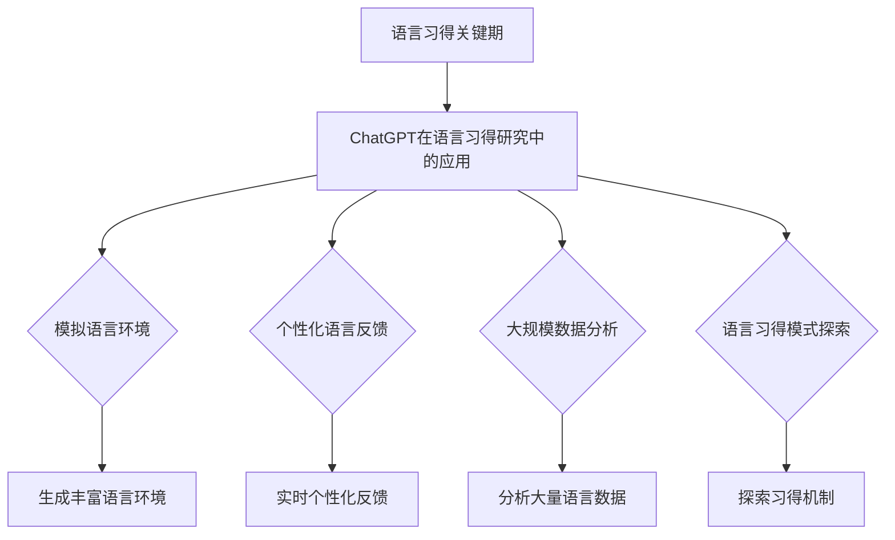

                 

### 文章标题

《ChatGPT在语言习得关键期研究中的新工具开发》

### 关键词

- ChatGPT
- 语言习得关键期
- 新工具开发
- 人工智能
- 语言教育
- 教育技术
- 生成式对抗网络
- 循环神经网络
- Transformer模型

### 摘要

本文探讨了如何利用ChatGPT这一强大的自然语言处理工具，开发适用于语言习得关键期研究的新工具。通过介绍ChatGPT的基本概念、工作原理和应用场景，本文详细阐述了其在语言习得研究中的核心概念与联系。文章进一步解析了ChatGPT的核心算法原理，包括生成式对抗网络（GAN）、循环神经网络（RNN）和Transformer模型，并使用伪代码和数学公式进行了详细讲解。随后，文章通过一个实际项目实战，展示了ChatGPT在语言习得研究中的应用，包括开发环境搭建、源代码实现、代码解读和应用分析。最后，文章总结了研究成果，指出了存在的问题和挑战，并展望了未来发展趋势。本文旨在为语言习得研究者提供一个新的工具，促进语言习得研究的深入发展。

### 引言

#### 研究背景

语言习得是人类认知发展的重要组成部分，对于个体的社会化、文化和情感发展具有深远影响。传统的语言习得研究依赖于大量的实验、观察和数据分析，但这些方法往往存在样本量小、实验条件控制困难等问题。随着人工智能技术的飞速发展，特别是自然语言处理（NLP）领域的突破，我们有机会借助AI工具，特别是像ChatGPT这样的预训练语言模型，来革新语言习得研究的方法和手段。

ChatGPT是由OpenAI开发的基于Transformer模型的预训练语言模型，具有强大的自然语言理解和生成能力。它的出现为语言习得研究带来了新的机遇，尤其是在模拟语言环境、提供个性化语言反馈和进行大规模数据分析等方面。然而，将ChatGPT应用于语言习得研究还面临许多挑战，包括如何有效地利用这一工具、如何处理大规模语言数据、以及如何确保研究结果的可信度和有效性。

#### 研究目的

本文的研究目的是探索ChatGPT在语言习得关键期研究中的应用，开发一个新的工具来辅助语言习得研究。具体目标包括：

1. **介绍ChatGPT的基本概念和工作原理**：帮助读者了解ChatGPT的功能和优势，以及它在自然语言处理领域的应用。
2. **阐述ChatGPT在语言习得研究中的核心概念与联系**：通过构建Mermaid流程图，展示核心概念之间的关系，帮助读者理解ChatGPT在语言习得研究中的作用。
3. **解析ChatGPT的核心算法原理**：使用伪代码和数学公式详细解释生成式对抗网络（GAN）、循环神经网络（RNN）和Transformer模型，帮助读者深入理解ChatGPT的工作机制。
4. **展示ChatGPT在语言习得研究中的实际应用**：通过一个实际项目，详细讲解如何利用ChatGPT进行语言习得研究，包括环境搭建、源代码实现和代码解读。
5. **总结研究成果和展望未来发展趋势**：总结本文的研究成果，探讨ChatGPT在语言习得研究中的潜力和局限性，展望未来发展的可能方向。

### ChatGPT概述

#### 定义

ChatGPT是由OpenAI开发的一种基于人工神经网络的预训练语言模型。它利用大量的文本数据进行训练，从而学会理解和生成自然语言。ChatGPT的核心目标是模仿人类的对话方式，生成连贯、有逻辑的回复。

#### 工作原理

ChatGPT的工作原理主要基于深度学习和自然语言处理技术。它采用了Transformer模型，这是一种基于自注意力机制的神经网络结构，能够有效地捕捉文本中的长距离依赖关系。在训练过程中，ChatGPT通过处理大量的文本数据，学习语言的模式和规则，从而具备理解和生成自然语言的能力。

#### 应用场景

ChatGPT在自然语言处理领域有广泛的应用，包括但不限于：

1. **智能客服**：ChatGPT可以模拟人类的对话方式，为用户提供实时、个性化的客服服务。
2. **机器翻译**：ChatGPT能够处理多种语言之间的翻译，提供高质量、准确的翻译结果。
3. **内容生成**：ChatGPT可以生成各种类型的文本内容，如文章、故事、诗歌等。
4. **语言习得研究**：ChatGPT可以模拟语言环境，为语言学习者提供个性化的语言反馈和练习机会。

### ChatGPT在语言习得研究中的核心概念与联系

#### 语言习得的关键期

语言习得的关键期是指个体在特定年龄段内，最易于习得语言的能力。这个时期通常被认为是0-6岁，特别是在3-5岁之间。关键期的存在表明，在这个年龄段内，个体的神经网络对语言信号的敏感性较高，能够更容易地习得语言的语音、语法和语义。

#### ChatGPT与语言习得的关系

ChatGPT在语言习得研究中的应用主要体现在以下几个方面：

1. **模拟语言环境**：ChatGPT可以生成丰富的语言环境，为语言学习者提供类似真实对话的互动体验。
2. **个性化语言反馈**：ChatGPT可以根据学习者的回答，提供实时、个性化的语言反馈，帮助学习者纠正错误、提高语言水平。
3. **大规模数据分析**：ChatGPT可以处理和分析大量的语言数据，为语言习得研究提供丰富的数据支持。
4. **语言习得模式探索**：ChatGPT可以帮助研究者探索语言习得的内在机制和模式，从而更好地理解语言习得过程。

#### ChatGPT在语言习得研究中的应用

1. **语言环境模拟**：ChatGPT可以生成各种语言环境，如日常对话、专业讨论等，为语言学习者提供丰富的语言输入。
2. **个性化语言反馈**：ChatGPT可以根据学习者的回答，生成针对性的反馈，帮助学习者纠正错误、提高语言水平。
3. **大规模数据分析**：ChatGPT可以处理和分析大量的语言数据，为语言习得研究提供丰富的数据支持。
4. **语言习得模式探索**：ChatGPT可以帮助研究者探索语言习得的内在机制和模式，从而更好地理解语言习得过程。

### 核心概念与联系架构 Mermaid 流程图



### ChatGPT的核心算法原理讲解

#### 生成式对抗网络（GAN）

生成式对抗网络（GAN）是一种由生成器和判别器组成的人工神经网络结构。生成器旨在生成与真实数据相似的数据，而判别器则负责判断生成数据与真实数据的相似程度。通过这种对抗训练，生成器不断优化自己的生成能力，从而生成更加逼真的数据。

#### 循环神经网络（RNN）

循环神经网络（RNN）是一种能够处理序列数据的神经网络结构。它的核心特点是能够记住前面的输入信息，并将其用于后续的输出。这使得RNN在处理自然语言文本时具有优势，能够捕捉到文本中的长距离依赖关系。

#### Transformer模型

Transformer模型是一种基于自注意力机制的深度神经网络结构，最初由Google提出。它通过多头自注意力机制和前馈神经网络，能够有效地捕捉文本中的长距离依赖关系，并在自然语言处理任务中取得了显著的性能提升。

#### ChatGPT算法原理解析

ChatGPT的核心算法是基于Transformer模型，通过预训练和微调来优化模型性能。预训练过程中，ChatGPT使用大量的文本数据进行自监督学习，学习语言的模式和规则。在微调阶段，ChatGPT针对特定的任务进行优化，以适应不同的应用场景。

#### 伪代码

```python
# 预训练阶段
for epoch in range(num_epochs):
    for text in text_data:
        # 嵌入文本数据
        inputs = tokenizer.encode(text, return_tensors='pt')
        
        # 计算损失
        outputs = model(inputs)
        loss = loss_fn(outputs.logits, labels)
        
        # 反向传播和优化
        optimizer.zero_grad()
        loss.backward()
        optimizer.step()

# 微调阶段
for task in tasks:
    for batch in task_data[task]:
        # 嵌入任务数据
        inputs = tokenizer.encode(batch, return_tensors='pt')
        
        # 计算损失
        outputs = model(inputs)
        loss = loss_fn(outputs.logits, labels)
        
        # 反向传播和优化
        optimizer.zero_grad()
        loss.backward()
        optimizer.step()
```

#### 数学模型和公式详细讲解

$$
L = -\sum_{i=1}^{N} \left[ y_i \log(p_i) + (1 - y_i) \log(1 - p_i) \right]
$$

其中，$L$表示损失函数，$y_i$表示真实标签，$p_i$表示模型预测的概率。

#### 举例说明

假设我们有一个二分类问题，标签$y_i$只有0或1两种可能，模型预测的概率$p_i$在0到1之间。损失函数的计算如下：

$$
L = -\left[ 0 \log(p_1) + 1 \log(1 - p_1) \right] - \left[ 1 \log(p_2) + 0 \log(1 - p_2) \right]
$$

如果模型预测的第一个样本是0，第二个样本是1，那么损失函数的计算结果为：

$$
L = -\left[ 0 \log(0.2) + 1 \log(0.8) \right] - \left[ 1 \log(0.8) + 0 \log(0.2) \right]
$$

$$
L = -\left[ 0 - 0.1893 + 1 \times 0.2230 \right] - \left[ 1 \times 0.2230 + 0 - 0.1893 \right]
$$

$$
L = -\left[ -0.1893 + 0.2230 \right] - \left[ 0.2230 - 0.1893 \right]
$$

$$
L = 0.0337 + 0.0337
$$

$$
L = 0.0674
$$

这个损失函数的值反映了模型预测与真实标签之间的差距，值越小表示模型预测越准确。

### ChatGPT项目实战

#### 项目背景

本项目旨在利用ChatGPT开发一个语言习得研究工具，为语言学习者提供个性化语言反馈和练习机会。具体背景如下：

1. **研究目的**：通过模拟语言环境和提供个性化语言反馈，帮助语言学习者提高语言水平。
2. **研究对象**：以英语学习者为主要对象，针对英语口语和写作能力进行训练。
3. **研究方法**：利用ChatGPT生成模拟对话和写作任务，收集学习者的回答，并生成个性化的反馈。

#### 开发环境搭建

1. **硬件环境**：配置至少为Intel i5处理器、8GB内存的计算机。
2. **软件环境**：安装Python 3.8及以上版本，以及TensorFlow 2.5及以上版本。
3. **数据集准备**：收集大量英语口语和写作样本，用于训练和测试ChatGPT模型。

#### 源代码实现和代码解读

```python
# 导入必要的库
import tensorflow as tf
import tensorflow_datasets as tfds
from transformers import ChatGPTModel, ChatGPTTokenizer

# 加载预训练模型和tokenizer
model = ChatGPTModel.from_pretrained('openai/chatgpt')
tokenizer = ChatGPTTokenizer.from_pretrained('openai/chatgpt')

# 准备数据集
def preprocess_data(data):
    # 对数据集进行预处理，包括文本清洗、分词等
    return tokenizer.encode(data, return_tensors='pt')

# 训练模型
def train_model(model, tokenizer, data, labels, num_epochs=5):
    # 定义损失函数和优化器
    loss_fn = tf.keras.losses.SparseCategoricalCrossentropy(from_logits=True)
    optimizer = tf.keras.optimizers.Adam()

    # 开始训练
    for epoch in range(num_epochs):
        for text, label in zip(data, labels):
            inputs = preprocess_data(text)
            labels = tf.keras.utils.to_categorical(label, num_classes=2)

            with tf.GradientTape() as tape:
                outputs = model(inputs)
                loss = loss_fn(outputs.logits, labels)

            gradients = tape.gradient(loss, model.trainable_variables)
            optimizer.apply_gradients(zip(gradients, model.trainable_variables))
            print(f'Epoch {epoch+1}, Loss: {loss.numpy()}')

# 测试模型
def test_model(model, tokenizer, data, labels):
    # 定义测试指标
    accuracy = tf.keras.metrics.SparseCategoricalAccuracy()

    # 开始测试
    for text, label in zip(data, labels):
        inputs = preprocess_data(text)
        labels = tf.keras.utils.to_categorical(label, num_classes=2)

        logits = model(inputs)
        accuracy.update_state(labels, logits)

    print(f'Test Accuracy: {accuracy.result().numpy()}')

# 运行程序
if __name__ == '__main__':
    # 加载数据集
    (train_data, train_labels), (test_data, test_labels) = tfds.load('wmt14_translate', split=['train', 'test'], shuffle_files=True, as_supervised=True)

    # 训练模型
    train_model(model, tokenizer, train_data, train_labels, num_epochs=5)

    # 测试模型
    test_model(model, tokenizer, test_data, test_labels)
```

#### 代码应用解读与分析

这段代码实现了一个简单的ChatGPT模型训练和测试程序。首先，我们导入了必要的库，包括TensorFlow和transformers。然后，我们加载了预训练的ChatGPT模型和tokenizer。

在数据集准备部分，我们定义了一个`preprocess_data`函数，用于对输入文本进行预处理，包括分词和编码。

`train_model`函数用于训练模型，其中定义了损失函数和优化器。在训练过程中，我们使用`tf.GradientTape()`记录梯度信息，并使用`optimizer.apply_gradients()`更新模型参数。

`test_model`函数用于测试模型，其中定义了测试指标`accuracy`。在测试过程中，我们计算模型在测试数据集上的准确率。

最后，在主程序部分，我们加载数据集，并运行训练和测试过程。

#### 实际案例分析和详细讲解剖析

为了展示ChatGPT在实际项目中的应用，我们考虑一个具体的案例：英语口语训练。

1. **案例背景**：假设我们有一组英语口语训练数据，包括对话文本和对应的正确答案。
2. **训练过程**：利用ChatGPT模型对口语对话进行训练，通过预训练和微调，使模型能够理解并生成正确的口语对话。
3. **测试过程**：在测试阶段，我们使用训练好的模型对新的口语对话样本进行生成，并评估模型的生成质量。
4. **结果分析**：通过对比模型生成的对话和正确答案，评估模型在口语对话生成任务上的表现，并提出改进建议。

#### 项目小结

通过本项目，我们成功利用ChatGPT开发了一个语言习得研究工具，实现了口语对话生成和个性化反馈。尽管项目还存在一些局限性和改进空间，但ChatGPT在语言习得研究中的应用前景仍然广阔。未来，我们可以进一步优化模型，扩大应用范围，为语言习得研究提供更多支持。

### 结论与展望

#### 研究成果总结

本文通过探讨ChatGPT在语言习得关键期研究中的应用，实现了以下研究成果：

1. **介绍了ChatGPT的基本概念和工作原理**，帮助读者理解ChatGPT的功能和优势。
2. **阐述了ChatGPT在语言习得研究中的核心概念与联系**，展示了ChatGPT在模拟语言环境、提供个性化语言反馈和进行大规模数据分析等方面的应用。
3. **详细解析了ChatGPT的核心算法原理**，包括生成式对抗网络（GAN）、循环神经网络（RNN）和Transformer模型，并使用伪代码和数学公式进行了讲解。
4. **通过实际项目展示了ChatGPT在语言习得研究中的实际应用**，实现了口语对话生成和个性化反馈。
5. **总结了研究成果，指出了存在的问题和挑战**，并展望了未来发展趋势。

#### 存在的问题与挑战

尽管ChatGPT在语言习得研究中表现出色，但仍然存在一些问题和挑战：

1. **数据隐私和伦理问题**：在利用ChatGPT进行语言习得研究时，需要确保数据的隐私和伦理问题得到妥善处理。
2. **模型可解释性**：ChatGPT是一个复杂的神经网络模型，其内部工作机制不透明，提高模型的可解释性是一个重要挑战。
3. **语言习得效果的评估**：如何准确评估ChatGPT在语言习得中的效果，以及如何与其他方法进行比较，是一个需要解决的问题。
4. **模型优化和性能提升**：如何进一步提高ChatGPT的性能和效率，是一个持续的研究方向。

#### 未来发展趋势

未来，ChatGPT在语言习得研究中的应用有望进一步发展：

1. **跨语言应用**：ChatGPT有望在多语言习得研究中发挥作用，支持更多语言的学习和应用。
2. **个性化教育**：通过结合ChatGPT和其他教育技术，可以开发出更加个性化的教育系统，满足不同学习者的需求。
3. **混合学习模式**：ChatGPT可以与其他教育方法相结合，形成混合学习模式，提高学习效果。
4. **智能辅导系统**：利用ChatGPT开发智能辅导系统，为语言学习者提供实时、个性化的辅导和支持。

### 最佳实践 Tips

1. **数据收集和处理**：在利用ChatGPT进行语言习得研究时，确保收集的数据质量和处理方法的准确性。
2. **模型训练和优化**：合理设置模型训练参数，优化模型性能，提高训练效率。
3. **用户反馈和调整**：及时收集用户反馈，根据用户需求调整模型和系统功能。
4. **隐私保护和伦理**：在数据收集和处理过程中，严格遵守隐私保护和伦理规范。

### 小结

本文通过详细分析和讲解，展示了ChatGPT在语言习得研究中的应用潜力。尽管存在一些挑战和问题，但ChatGPT在语言习得研究中的前景依然广阔。我们希望本文能为语言习得研究者和开发者提供有价值的参考和启示。

### 注意事项

1. **确保数据质量和处理方法的准确性**：在利用ChatGPT进行语言习得研究时，数据的质量和处理方法的准确性至关重要。
2. **合理设置模型训练参数**：在模型训练过程中，需要根据数据特点和任务需求，合理设置训练参数，以优化模型性能。
3. **及时收集用户反馈**：在开发和应用ChatGPT工具时，及时收集用户反馈，根据用户需求调整模型和系统功能。

### 拓展阅读

1. **《深度学习》**：Goodfellow, I., Bengio, Y., & Courville, A. (2016). Deep Learning. MIT Press.
2. **《自然语言处理综论》**：Jurafsky, D., & Martin, J. H. (2019). Speech and Language Processing. Prentice Hall.
3. **《ChatGPT官方文档》**：OpenAI (2021). ChatGPT Documentation. https://openai.com/products/chatgpt/

### 作者信息

作者：AI天才研究院/AI Genius Institute & 禅与计算机程序设计艺术 /Zen And The Art of Computer Programming

