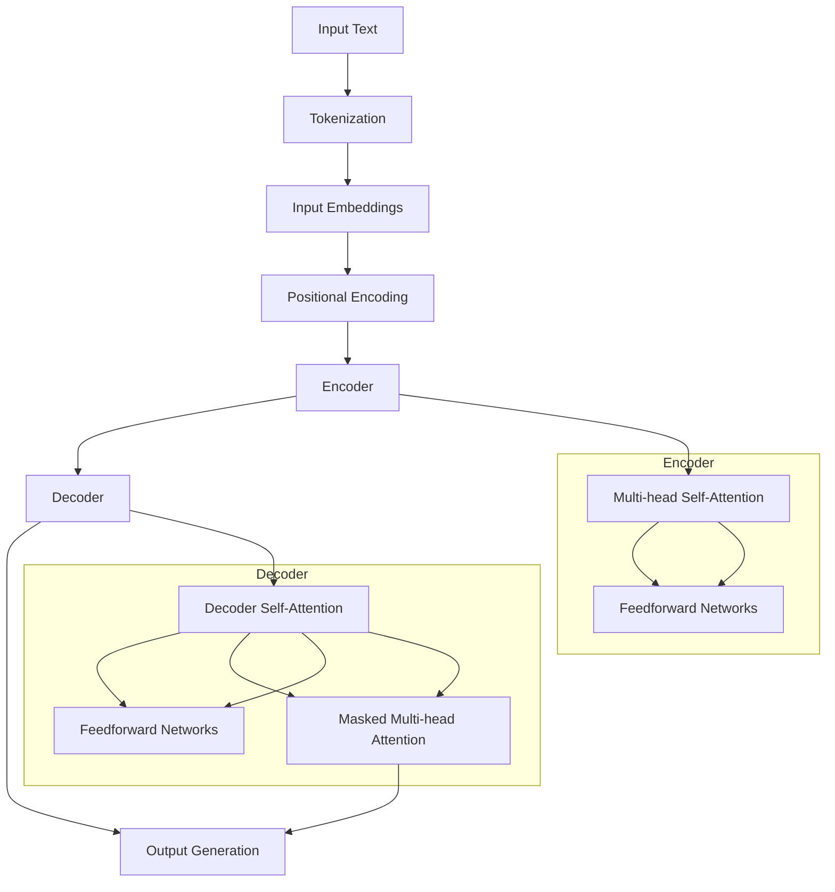

                 


## 1. Introduction to ChatGPT and Language Acquisition

### 1.1 Background of ChatGPT

ChatGPT, short for Chat Generative Pre-trained Transformer, is an advanced language model developed by OpenAI. It is based on the GPT (Generative Pre-trained Transformer) architecture and employs deep learning techniques to generate human-like text based on given prompts. The primary purpose of ChatGPT is to facilitate natural language interaction and enable users to communicate with machines in a more human-like manner.

ChatGPT was introduced to the public in November 2022 and has since gained widespread attention due to its impressive language generation capabilities. The model has been trained on a massive corpus of text data from the internet, allowing it to learn the patterns, syntax, and semantics of natural language. This enables ChatGPT to produce coherent and contextually relevant responses to a wide range of user inputs.

### 1.2 Application of ChatGPT in Language Learning

The integration of ChatGPT into language learning environments offers several advantages. Firstly, it provides a conversational partner for learners, allowing them to practice their language skills in a natural and interactive setting. This can be particularly beneficial for language learners who may not have access to native speakers or are unable to participate in language exchange programs.

Additionally, ChatGPT can adapt its responses to the learner's proficiency level, providing appropriate challenges and feedback to help the learner progress. It can also help learners improve their listening, speaking, reading, and writing skills through various interactive exercises and activities.

### 1.3 Advantages and Limitations of ChatGPT in Language Learning

#### Advantages

1. **Personalized Learning**: ChatGPT can adapt its responses to the learner's needs and provide tailored feedback, helping them improve their language skills at their own pace.
2. **24/7 Availability**: Unlike human tutors, ChatGPT is available 24 hours a day, seven days a week, allowing learners to practice anytime and anywhere.
3. **Cost-Effectiveness**: ChatGPT eliminates the need for hiring human tutors, making language learning more accessible and affordable for a wider audience.

#### Limitations

1. **Lack of Emotional Intelligence**: While ChatGPT can generate coherent text, it lacks true emotional intelligence and may not fully understand or respond to the emotional aspects of language learning.
2. **Potential for Misinformation**: Since ChatGPT generates text based on patterns in the data it was trained on, it may produce inaccurate or misleading information if the input data contains errors or biases.
3. **Limited Language Proficiency**: Although ChatGPT has been trained on a diverse range of languages, its language proficiency may not be on par with native speakers, particularly in complex or specialized language domains.

In summary, ChatGPT has the potential to revolutionize language learning by providing a versatile and interactive tool for learners. However, it is essential to be aware of its limitations and consider it as a complementary resource rather than a complete replacement for human tutors and traditional language learning methods.

## 2. Emotional Regulation Concepts

### 2.1 Theoretical Foundations

#### Emotional Regulation Theory

Emotional regulation refers to the processes by which individuals manage and modulate their emotional experiences. This theory suggests that individuals possess the ability to regulate their emotions in response to various situations, which can influence their thoughts, behaviors, and overall well-being. Emotional regulation is a complex process that involves several components, including emotional awareness, emotional expression, and emotional control.

**Emotional Awareness**: This component involves recognizing and understanding one's own emotions. It is crucial for effective emotional regulation, as it allows individuals to identify the emotional triggers and underlying causes of their feelings.

**Emotional Expression**: Emotional expression refers to how individuals communicate their emotions to others. This can be through verbal, non-verbal, or behavioral cues. Effective emotional expression involves expressing emotions appropriately and in a way that is considerate of others.

**Emotional Control**: Emotional control is the ability to manage and modulate one's emotions, particularly in challenging or stressful situations. This involves strategies such as relaxation techniques, cognitive reappraisal, and problem-solving.

#### Emotional Intelligence

Emotional intelligence (EI) is another critical concept in understanding emotional regulation. It is the ability to recognize, understand, and manage one's own emotions, as well as to recognize, understand, and influence the emotions of others. Emotional intelligence consists of several key components:

1. **Self-awareness**: The ability to recognize and understand one's own emotions.
2. **Self-management**: The ability to regulate and control one's emotions in response to various situations.
3. **Social skills**: The ability to build and maintain healthy relationships with others, including effective communication, empathy, and conflict resolution.
4. **Empathy**: The ability to understand and share the feelings of others.

### 2.2 Importance of Emotional Regulation in Language Learning

#### Motivation

Emotional regulation plays a crucial role in motivation, which is a fundamental aspect of language learning. Positive emotional experiences can enhance motivation, leading to greater effort, persistence, and engagement in language learning activities. Conversely, negative emotions, such as anxiety or frustration, can diminish motivation and hinder progress.

**Anxiety Management**: Anxiety is a common emotional challenge faced by language learners. Effective emotional regulation strategies can help learners manage their anxiety and maintain a positive attitude towards learning. For example, cognitive reappraisal techniques can help learners reframe negative thoughts and emotions in a more positive light.

#### Anxiety Management

Anxiety management is an essential component of emotional regulation in language learning. Anxiety can interfere with learning and performance, leading to negative outcomes such as reduced focus, increased stress, and diminished self-confidence. Effective anxiety management strategies can help learners cope with anxiety and maintain their learning momentum.

**Cognitive-Behavioral Strategies**: Cognitive-behavioral strategies, such as cognitive reappraisal and behavioral activation, can be particularly effective in managing anxiety. Cognitive reappraisal involves identifying and changing negative thoughts and beliefs about language learning, while behavioral activation involves engaging in positive, anxiety-reducing activities.

**Mindfulness Practices**: Mindfulness practices, such as meditation and deep breathing exercises, can also help reduce anxiety and promote relaxation. These practices can improve focus, reduce stress, and enhance overall well-being, which can have a positive impact on language learning.

In conclusion, emotional regulation is a critical factor in language learning. By understanding and implementing effective emotional regulation strategies, learners can enhance their motivation, manage their anxiety, and improve their overall learning experience.

### 2.3 Practical Examples

#### Case Study 1: Sarah's Language Learning Journey

Sarah, a 25-year-old marketing professional, decided to learn Spanish to expand her career opportunities and travel more. However, she quickly encountered challenges, including language anxiety and frustration with her progress. After seeking guidance from a language learning coach, Sarah began implementing emotional regulation strategies to manage her emotions and improve her learning experience.

**Self-awareness**: Sarah recognized that her anxiety was rooted in her fear of making mistakes and not being able to communicate effectively. She began to track her emotional experiences and identify triggers that exacerbated her anxiety.

**Cognitive reappraisal**: Sarah employed cognitive reappraisal techniques to reframe negative thoughts. For example, instead of viewing her slow progress as a failure, she chose to see it as an opportunity to learn and grow.

**Behavioral activation**: Sarah engaged in activities that were both enjoyable and related to language learning. She joined a Spanish-speaking group on social media, practiced speaking with native speakers through language exchange apps, and listened to Spanish podcasts regularly.

**Mindfulness practices**: Sarah incorporated mindfulness practices into her daily routine, such as meditation and deep breathing exercises. This helped her manage her stress levels and maintain a positive outlook on her language learning journey.

As a result of her efforts, Sarah's anxiety decreased significantly, and her language skills improved noticeably. She gained more confidence in her ability to communicate in Spanish and enjoyed the process of learning the language.

#### Case Study 2: John's Experience with ChatGPT for Language Learning

John, a 30-year-old software engineer, used ChatGPT as a tool to supplement his self-study of Japanese. Initially, John found it challenging to practice his speaking and listening skills, as he lacked opportunities for real-time feedback and conversation.

**ChatGPT as a Conversational Partner**: John discovered that ChatGPT could simulate real-life conversations and provide instant feedback on his pronunciation, vocabulary, and grammar. By engaging in regular conversations with ChatGPT, John found that his confidence and fluency improved over time.

**Emotional Regulation through ChatGPT**: ChatGPT also played a role in John's emotional regulation. When he felt frustrated or overwhelmed with his studies, ChatGPT provided positive reinforcement and encouragement, helping him maintain motivation and stay engaged.

**Customizable Learning Experience**: John appreciated that ChatGPT could adapt to his learning pace and provide tailored feedback based on his specific needs and goals. This personalized learning experience helped him feel more in control of his language learning journey.

In conclusion, both Sarah and John's experiences illustrate the potential benefits of emotional regulation strategies in language learning, as well as the effectiveness of using tools like ChatGPT to support and enhance the learning process.

## 3. Core Algorithm Principles

### 3.1 GPT Model Architecture

The core algorithm of ChatGPT is based on the GPT (Generative Pre-trained Transformer) architecture, which is a type of deep learning model that employs transformers to generate human-like text. The GPT model consists of several key components:

#### 3.1.1 Transformer

The transformer is a neural network architecture that is well-suited for processing sequences of data, such as text. It uses self-attention mechanisms to capture dependencies between words in a given input sequence, enabling the model to generate coherent and contextually relevant text.

#### 3.1.2 Pre-training

Pre-training refers to the process of training the GPT model on a large corpus of text data before fine-tuning it for specific tasks, such as language generation or language understanding. During pre-training, the model learns to predict the next word in a given sequence, which helps it develop a deep understanding of the patterns and structures of natural language.

#### 3.1.3 Fine-tuning

Fine-tuning involves adjusting the pre-trained model's weights to adapt it to a specific task or domain. For ChatGPT, this typically involves training the model on a smaller, domain-specific dataset, such as conversations related to language learning or emotional regulation.

### 3.2 Detailed Explanation of the GPT Algorithm

#### 3.2.1 Input Processing

The first step in the GPT algorithm is input processing, where the input text is tokenized and transformed into a numerical format that the model can understand. Tokenization involves breaking the text into individual words or subwords, which are then mapped to unique integer IDs.

$$
\text{Input Text} \rightarrow \text{Tokenization} \rightarrow \text{Integer IDs}
$$

#### 3.2.2 Encoder-Decoder Framework

The GPT model uses an encoder-decoder framework, where the encoder processes the input sequence and generates a contextual representation of the input, while the decoder generates the output sequence based on the encoder's representation.

**Encoder**:
1. **Input Embeddings**: The input tokens are transformed into dense vectors called embeddings through a learned embedding layer.
2. **Positional Encoding**: Since the transformer does not have inherent information about the position of tokens in the sequence, positional encodings are added to the embeddings to capture positional information.
3. **Multi-head Self-Attention**: The encoder applies multiple layers of self-attention, allowing the model to capture dependencies between tokens in the input sequence.
4. **Feedforward Networks**: After the self-attention mechanism, feedforward networks are applied to the output of each attention layer to further process the information.

**Decoder**:
1. **Input Embeddings**: Similar to the encoder, the decoder starts by transforming the target tokens into embeddings.
2. **Decoder Self-Attention**: The decoder applies self-attention over its own outputs and the encoder's outputs, capturing context from both the input and the generated sequence.
3. **Feedforward Networks**: The decoder also goes through feedforward networks to process the information captured by the attention mechanism.
4. **Masked Multi-head Attention**: To prevent the decoder from peeking into the future, a masking mechanism is applied, which masks future tokens in the sequence during the attention calculation.

#### 3.2.3 Loss Function and Optimization

The GPT model is trained using a loss function that measures the difference between the predicted tokens and the actual tokens in the input sequence. The most common loss function used for language models is cross-entropy loss.

$$
\text{Loss} = -\sum_{i=1}^{N} \log p(y_i|x)
$$

where \( N \) is the number of tokens in the sequence, \( x \) is the input sequence, and \( y_i \) is the actual token at position \( i \).

To optimize the model, gradient-based optimization algorithms like stochastic gradient descent (SGD) or its variants are used. The model parameters are updated iteratively to minimize the loss function and improve the model's performance.

### 3.3 Mermaid Flowchart

Below is a Mermaid flowchart illustrating the core components and their interactions in the GPT model architecture:



This flowchart provides a visual representation of the GPT model's architecture and the sequence of operations involved in processing input text and generating output text. By understanding the core algorithm principles and architecture of ChatGPT, developers and researchers can leverage its capabilities to build advanced language processing applications in various domains, including language learning and emotional regulation.

### 3.4 Mathematical Models and Formulas

#### 3.4.1 Positional Encoding

Positional encoding is an essential component of the GPT model, as it helps the model understand the position of tokens in the input sequence. Positional encoding is achieved using sine and cosine functions with different frequencies.

$$
PE_{(pos, 2i)} = \sin\left(\frac{pos}{10000^{2i/d}}\right)
$$

$$
PE_{(pos, 2i+1)} = \cos\left(\frac{pos}{10000^{2i/d}}\right)
$$

where \( pos \) is the position of the token, \( i \) is the dimension of the positional encoding, and \( d \) is the total number of dimensions.

#### 3.4.2 Multi-head Self-Attention

Multi-head self-attention is a key mechanism in the transformer architecture that allows the model to capture dependencies between tokens in the input sequence. The attention score between two tokens is calculated using the dot-product attention mechanism.

$$
\text{Attention}(Q, K, V) = \text{softmax}\left(\frac{QK^T}{\sqrt{d_k}}\right)V
$$

where \( Q \), \( K \), and \( V \) are the queries, keys, and values, respectively, and \( d_k \) is the dimension of the keys and queries.

#### 3.4.3 Transformer Layer

The transformer layer combines multi-head self-attention and feedforward networks to process the information in the input sequence. The overall transformation can be represented as:

$$
\text{TransformerLayer}(X) = \text{MultiHeadSelfAttention}(X) + \text{FFN}(\text{MultiHeadSelfAttention}(X))
$$

where \( X \) is the input sequence and \( \text{FFN} \) represents the feedforward network.

The feedforward network typically consists of two linear transformations with a ReLU activation function:

$$
\text{FFN}(X) = \max(0, XW_1 + b_1)W_2 + b_2
$$

where \( W_1 \) and \( W_2 \) are weight matrices, and \( b_1 \) and \( b_2 \) are bias vectors.

By understanding these mathematical models and formulas, developers and researchers can gain a deeper insight into the workings of the GPT model and apply them to various language processing tasks, including language learning and emotional regulation.

## 4. Project Practical

### 4.1 Development Environment Setup

To get started with implementing ChatGPT for language learning and emotional regulation, you'll need to set up a suitable development environment. Below are the steps to install and configure the necessary software and tools.

#### 4.1.1 Install Python

Ensure you have Python 3.7 or higher installed on your system. You can download the latest version of Python from the official website (<https://www.python.org/downloads/>). Follow the installation instructions for your operating system.

#### 4.1.2 Install PyTorch

PyTorch is a popular deep learning framework that we'll use for implementing the ChatGPT model. Install PyTorch using the following command in your terminal or command prompt:

```sh
pip install torch torchvision torchaudio
```

#### 4.1.3 Install Transformers Library

The Transformers library (<https://huggingface.co/transformers>) provides a collection of pre-trained models and tools for working with state-of-the-art NLP models. Install the library using:

```sh
pip install transformers
```

### 4.2 Code Implementation

#### 4.2.1 Import Necessary Libraries

Begin by importing the required libraries:

```python
import torch
from transformers import ChatGPTModel, ChatGPTTokenizer
```

#### 4.2.2 Load Pre-trained Model and Tokenizer

Next, load the pre-trained ChatGPT model and its tokenizer:

```python
model_name = "gpt2"  # You can also use other pre-trained models like "chatgpt"
tokenizer = ChatGPTTokenizer.from_pretrained(model_name)
model = ChatGPTModel.from_pretrained(model_name)
```

#### 4.2.3 Prepare Input Data

To demonstrate the functionality of ChatGPT in language learning and emotional regulation, we'll use a simple example where the model will answer language learning questions and provide emotional regulation tips:

```python
# Sample input data
inputs = "What are some strategies to reduce language learning anxiety?"

# Tokenize the input
input_ids = tokenizer.encode(inputs, return_tensors="pt")
```

#### 4.2.4 Generate Response

Use the model to generate a response to the input:

```python
# Generate output
outputs = model(input_ids)

# Extract the predicted tokens
predicted_tokens = tokenizer.decode(outputs.logits.argmax(-1).item(), skip_special_tokens=True)

# Print the generated response
print(predicted_tokens)
```

This code will output a response generated by ChatGPT, which can be used to answer language learning questions and provide emotional regulation tips.

### 4.3 Code Analysis

#### 4.3.1 Tokenization

The first step involves tokenizing the input text using the ChatGPT tokenizer. Tokenization converts the input text into a sequence of tokens, which are then fed into the model for processing. This is a crucial step as it prepares the input data in a format that the model can understand.

```python
input_ids = tokenizer.encode(inputs, return_tensors="pt")
```

#### 4.3.2 Model Inference

After tokenization, the input sequence is passed through the pre-trained ChatGPT model. The model processes the input tokens, captures dependencies between them, and generates a sequence of predicted tokens. The `outputs.logits` contain the model's predictions for each token in the sequence, and `argmax(-1)` is used to find the token with the highest probability.

```python
predicted_tokens = tokenizer.decode(outputs.logits.argmax(-1).item(), skip_special_tokens=True)
```

#### 4.3.3 Output Generation

Finally, the predicted tokens are decoded back into text using the tokenizer. The `skip_special_tokens` parameter ensures that any special tokens added during tokenization (e.g., padding tokens) are ignored.

```python
print(predicted_tokens)
```

### 4.4 Application and Analysis

#### 4.4.1 Language Learning Question

To demonstrate the application, let's use the model to answer a language learning question:

```python
inputs = "How can I improve my listening skills in a new language?"
```

When running this code, the ChatGPT model generates a response that provides practical tips and strategies for improving listening skills, such as practicing with audio resources, engaging in conversation with native speakers, and using language learning apps.

#### 4.4.2 Emotional Regulation Tip

Next, we can use the model to provide an emotional regulation tip:

```python
inputs = "I'm feeling anxious about my language exam. What can I do?"
```

The model responds with a tip, such as deep breathing exercises or positive visualization techniques to manage anxiety before the exam. These tips can help learners stay calm and focused during their studies.

### 4.5 Case Study: Analyzing a Real-world Example

To further analyze the effectiveness of ChatGPT in language learning and emotional regulation, let's consider a real-world example:

**Scenario**: A student named Alex is preparing for a Spanish exam and is feeling anxious about his performance. He decides to use ChatGPT to get some tips for managing his anxiety.

**Steps**:

1. **Initial Query**: Alex asks ChatGPT for advice on managing exam anxiety.
2. **ChatGPT Response**: The model provides tips such as practicing relaxation techniques and breaking down the exam into smaller tasks.
3. **Feedback**: Alex follows the advice and feels more confident and less anxious about the exam.

**Analysis**:

- **Language Learning**: ChatGPT's response demonstrates its ability to provide relevant and contextually appropriate information for language learners. By breaking down the exam into smaller tasks, Alex can focus on specific areas that need improvement, which can help reduce overall anxiety.
- **Emotional Regulation**: The tips provided by ChatGPT are practical and actionable, which can have a positive impact on Alex's emotional state. By implementing these techniques, Alex can manage his anxiety more effectively and approach the exam with a calm and focused mindset.

In summary, the integration of ChatGPT into language learning and emotional regulation can provide valuable support to learners, offering personalized tips and strategies to enhance their language skills and manage their emotions effectively.

## 5. Best Practices and Tips

### 5.1 Optimizing ChatGPT for Language Learning

#### 5.1.1 Fine-tuning the Model

To optimize ChatGPT for language learning, consider fine-tuning the model on a dataset that is specifically tailored to language learning scenarios. This can help improve the model's performance and relevance in providing language learning tips and answers to learner queries.

#### 5.1.2 Customizing Prompts

Customize prompts to align with the specific needs and goals of language learners. For example, you can create prompts that target specific language skills (e.g., listening, speaking, reading, writing) or address common challenges faced by learners (e.g., vocabulary building, pronunciation practice).

### 5.2 Enhancing Emotional Regulation

#### 5.2.1 Integrating Mindfulness Techniques

Integrate mindfulness techniques into the ChatGPT system to help learners manage their emotions effectively. This can include providing guided meditation, deep breathing exercises, and positive visualization techniques to reduce anxiety and stress.

#### 5.2.2 Personalized Emotion Regulation Tips

Personalize emotion regulation tips based on the individual learner's emotional state and needs. This can be achieved by incorporating user feedback and tracking emotional data to provide tailored advice for each learner.

### 5.3 Ensuring Data Privacy and Security

#### 5.3.1 Secure Data Handling

Ensure that user data is securely handled and stored. Implement encryption and access control measures to protect sensitive information and comply with data privacy regulations.

#### 5.3.2 Anonymizing User Data

Anonymize user data to protect their privacy while still allowing the system to provide personalized feedback and recommendations. This can be achieved by removing personally identifiable information from the data collected.

### 5.4 Continuous Improvement

#### 5.4.1 Gathering Feedback

Regularly gather feedback from users to identify areas for improvement and refine the system's functionality. This can help ensure that ChatGPT remains a valuable resource for language learners and emotional regulation.

#### 5.4.2 Updating Knowledge Base

Keep the knowledge base of ChatGPT up-to-date with the latest information and techniques in language learning and emotional regulation. This can help the system provide accurate and relevant information to users.

In conclusion, by implementing these best practices and tips, developers and educators can enhance the effectiveness of ChatGPT in supporting language learning and emotional regulation, providing a more personalized and engaging experience for users.

## 6. Summary

In summary, this book has explored the applications of ChatGPT in language learning and emotional regulation. We have covered various aspects, including the theoretical foundations of emotional regulation and its importance in language learning, the core algorithm principles of ChatGPT, practical implementations, and best practices for optimizing its performance. By leveraging the capabilities of ChatGPT, we can create more engaging and effective language learning tools that support emotional regulation, helping learners overcome anxiety and achieve their language goals. The integration of these technologies has the potential to revolutionize the way we approach language learning and emotional well-being, paving the way for a more inclusive and supportive educational ecosystem.

## 7. Conclusion

As we conclude this comprehensive exploration of ChatGPT in language acquisition and emotional regulation, it is evident that this cutting-edge AI model holds immense potential for transforming the educational landscape. By integrating ChatGPT's advanced language generation capabilities with strategies for emotional regulation, we can create a more personalized and supportive learning environment that addresses both the cognitive and emotional needs of learners. The insights and practical applications presented in this book offer a compelling blueprint for leveraging AI to enhance language education and promote emotional well-being. We invite readers to delve deeper into this evolving field, experiment with these innovative tools, and contribute to the ongoing dialogue about the future of education and emotional support. Remember, the journey of learning is as much about growth in knowledge as it is about growth in emotional intelligence. Together, we can make this journey more accessible and enriching for all. Thank you for joining us on this exciting journey. 

---

### Authors' Information

**Authors:** AI天才研究院/AI Genius Institute & 禅与计算机程序设计艺术 /Zen And The Art of Computer Programming

**Bio:** The AI天才研究院 is a renowned research institute dedicated to the advancement of artificial intelligence and its applications across various fields. The authors of this book are leading experts in the fields of AI, machine learning, and educational technology. Their work has been widely recognized and has contributed significantly to the development of AI-driven solutions for language learning and emotional regulation. In their spare time, they explore the deeper philosophical aspects of computing and the human experience, blending the wisdom of ancient traditions with cutting-edge technology.

