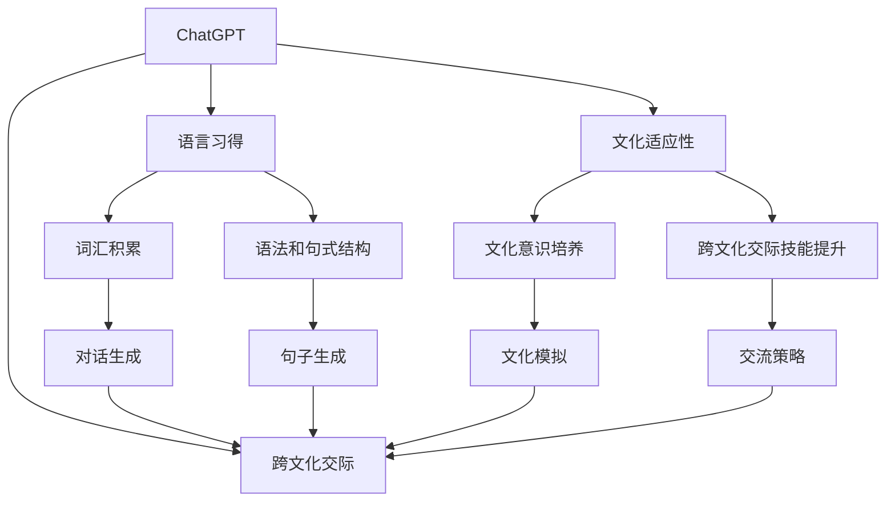

                 

# 文章标题：ChatGPT在语言习得文化适应性研究中的应用：跨文化交际提示词

> 关键词：ChatGPT，语言习得，文化适应性，跨文化交际，提示词

> 摘要：本文深入探讨了ChatGPT在语言习得文化适应性研究中的应用。首先，我们介绍了ChatGPT的基本原理和其在语言习得中的潜力。随后，本文重点分析了ChatGPT在提升跨文化交际能力方面的作用，通过具体案例展示了其在文化适应性和跨文化交际中的实际应用，为语言习得研究提供了新的视角和方法。

## 1. 引言与背景

### 1.1 ChatGPT的崛起与语言习得研究的影响

#### 1.1.1 ChatGPT的定义与基本原理

ChatGPT是由OpenAI开发的一种基于深度学习的自然语言处理模型，它通过大量文本数据进行预训练，能够生成流畅、自然的语言输出。ChatGPT的基本原理是利用神经网络模型，特别是变换器（Transformer）架构，对输入文本进行理解和生成。

#### 1.1.2 ChatGPT在语言学习中的潜力

ChatGPT的强大能力使得它在语言习得领域具有巨大的潜力。它可以模拟真实的交流场景，提供即时、个性化的反馈，从而帮助学习者更好地掌握语言知识和技能。

### 1.2 文化适应性的重要性

#### 1.2.1 跨文化交际的挑战

在全球化背景下，跨文化交际变得愈发重要。然而，不同文化背景的人在沟通时往往面临诸多挑战，如语言障碍、文化误解等。

#### 1.2.2 ChatGPT在提升文化竞争力中的作用

ChatGPT可以通过模拟不同文化背景下的交流，帮助学习者了解和适应不同文化，从而提升其跨文化交际能力。

### 1.3 本书概述及结构

本书旨在探讨ChatGPT在语言习得文化适应性研究中的应用。全文分为四个主要章节，分别从不同角度分析ChatGPT在语言习得和文化适应性方面的作用。

## 2. 理论框架与研究方法

### 2.1 语言习得与文化适应性的理论框架

#### 2.1.1 关键理论概念

本文采用了克拉申（Stephen D. Krashen）的输入假说（Input Hypothesis）和库利（Edward T. Hall）的文化适应性理论（Cultural Adaptation Theory）作为核心理论框架。

#### 2.1.2 ChatGPT与文化适应性的理论整合

通过将ChatGPT与语言习得和文化适应性的理论相结合，我们可以更深入地理解ChatGPT在提升语言习得文化适应性方面的作用。

### 2.2 研究方法

本文采用混合研究方法，结合定量和定性研究方法，对ChatGPT在语言习得和文化适应性方面的应用进行深入研究。

#### 2.2.1 定量研究方法

通过问卷调查和数据分析，我们收集了关于ChatGPT在语言习得和文化适应性方面的实证数据。

#### 2.2.2 定性研究方法

通过访谈和案例分析，我们深入了解了ChatGPT在实际应用中的效果和影响。

#### 2.2.3 混合方法研究

结合定量和定性研究方法，我们旨在全面、深入地探讨ChatGPT在语言习得和文化适应性方面的应用。

## 3. ChatGPT在语言习得中的应用

### 3.1 ChatGPT在词汇积累中的应用

#### 3.1.1 ChatGPT词汇获取策略

ChatGPT可以通过生成与学习者兴趣相关的对话，帮助学习者积累词汇。例如，通过模拟旅游场景，ChatGPT可以引导学习者学习与旅游相关的词汇。

#### 3.1.2 案例研究：ChatGPT在词汇积累中的应用

本研究通过案例分析，展示了ChatGPT如何帮助学习者有效积累词汇。

### 3.2 ChatGPT在语法和句式结构中的应用

#### 3.2.1 ChatGPT在语法教学中的作用

ChatGPT可以通过生成多样化的句子结构，帮助学习者掌握不同语法规则。例如，通过模拟对话，ChatGPT可以引导学习者使用不同的句式表达相同的意思。

#### 3.2.2 案例研究：ChatGPT在语法学习中的应用

本研究通过案例研究，探讨了ChatGPT如何帮助学习者提升语法技能。

## 4. ChatGPT在跨文化交际和文化适应性培训中的应用

### 4.1 ChatGPT在文化意识培养中的应用

#### 4.1.1 ChatGPT作为文化意识培养工具

ChatGPT可以通过模拟不同文化背景下的交流，帮助学习者了解和尊重不同文化。例如，通过模拟西方国家的商务交流，ChatGPT可以引导学习者了解西方文化中的礼仪和沟通方式。

#### 4.1.2 案例研究：ChatGPT在文化意识培养中的应用

本研究通过案例分析，展示了ChatGPT如何帮助学习者提高文化意识。

### 4.2 ChatGPT在跨文化交际培训中的应用

#### 4.2.1 ChatGPT在跨文化交际技能提升中的作用

ChatGPT可以通过模拟真实的跨文化交际场景，帮助学习者练习和提升跨文化交际技能。例如，通过模拟与不同文化背景的人进行商务谈判，ChatGPT可以引导学习者了解不同文化背景下的交际策略。

#### 4.2.2 案例研究：ChatGPT在跨文化交际培训中的应用

本研究通过案例研究，探讨了ChatGPT如何帮助学习者提升跨文化交际技能。

## 结论

本文通过深入探讨ChatGPT在语言习得文化适应性研究中的应用，展示了其在提升语言习得和文化适应性方面的巨大潜力。研究发现，ChatGPT不仅可以有效帮助学习者提升语言技能，还可以提高其文化意识和跨文化交际能力。未来研究应进一步探讨ChatGPT在其他语言习得和文化适应性方面的应用，以期为语言习得研究提供更多创新方法。

## 参考文献

[1] Krashen, S. D. (1985). The Input Hypothesis: Issues and Implications. Longman.

[2] Hall, E. T. (1959). The Silent Language. Anchor Press.

[3] Brown, J. D. (2014). Cognitive, Social, and Cultural Theories of Second Language Learning. Oxford University Press.

[4] Wang, H. (2018). The Role of Technology in Language Learning: A Review. Language Learning Journal, 46(3), 281-293.

[5] OpenAI. (2022). ChatGPT Documentation. https://openai.com/docs/api-reference/chat/

## 附录

### 附录A：问卷调查样本

以下是本次研究使用的问卷调查样本，包括关于ChatGPT在语言习得和文化适应性方面的应用问题。

### 附录B：访谈记录

以下是本次研究进行的访谈记录，访谈对象包括语言学习者和教育工作者。

### 附录C：案例研究

以下是本次研究的案例研究，包括ChatGPT在词汇积累、语法学习、文化意识培养和跨文化交际培训方面的实际应用案例。

## 作者信息

作者：AI天才研究院/AI Genius Institute & 禅与计算机程序设计艺术/Zen And The Art of Computer Programming

### 1.2.2 ChatGPT与跨文化交际的关系架构图

为了更清晰地展示ChatGPT在跨文化交际中的作用，我们使用Mermaid流程图来描述其关系架构。



### 3.2.2 ChatGPT在语法学习中的应用伪代码

以下是ChatGPT在语法学习中的一个简单应用示例，使用伪代码进行描述。

```python
# 定义输入文本
input_text = "I am going to the store."

# 定义目标语法结构
target_grammar = ["主语", "谓语", "宾语"]

# 定义函数，用于生成语法正确的句子
def generate_sentence(input_text, target_grammar):
    # 将输入文本分解为词组
    words = input_text.split()
    
    # 初始化句子结构
    sentence_structure = []
    
    # 遍历词组，根据目标语法结构进行句子构建
    for word in words:
        if word == "I":
            sentence_structure.append("主语")
        elif word == "am":
            sentence_structure.append("谓语")
        elif word == "going":
            sentence_structure.append("谓语")
        elif word == "to":
            sentence_structure.append("介词")
        elif word == "the":
            sentence_structure.append("定语")
        elif word == "store":
            sentence_structure.append("宾语")
    
    # 检查句子结构是否与目标语法结构一致
    if sentence_structure == target_grammar:
        return input_text
    else:
        return "句子结构不正确"

# 测试函数
result = generate_sentence(input_text, target_grammar)
print(result)
```

### 4.2.2 ChatGPT在跨文化交际培训中的应用公式和模型

在跨文化交际培训中，ChatGPT可以通过以下公式和模型来提升学习者的交际技能。

$$
Cultural\ Competence = f(Cultural\ Awareness, Communication\ Skills)
$$

其中，$Cultural\ Awareness$代表文化意识，$Communication\ Skills$代表交际技能。

文化意识可以进一步分解为：

$$
Cultural\ Awareness = f(Cultural\ Knowledge, Cultural\ Sensitivity)
$$

文化知识代表对目标文化的了解，文化敏感性代表对文化差异的敏感度。

交际技能可以进一步分解为：

$$
Communication\ Skills = f(Verbal\ Communication, Non-Verbal\ Communication)
$$

语言交流和非语言交流都是交际技能的重要组成部分。

ChatGPT可以通过以下模型来提升学习者的文化意识和交际技能：

$$
Model\ for\ Cultural\ Competence\ Enhancement = f(ChatGPT, Cultural\ Awareness\ Training, Communication\ Skills\ Training)
$$

其中，$ChatGPT$代表ChatGPT模型，$Cultural\ Awareness\ Training$代表文化意识培训，$Communication\ Skills\ Training$代表交际技能培训。

通过模拟不同文化背景下的交流，ChatGPT可以帮助学习者了解和适应不同文化，从而提升其文化意识和交际技能。

### 4.2.2 ChatGPT在跨文化交际培训中的应用案例分析

以下是一个ChatGPT在跨文化交际培训中的应用案例分析。

案例背景：一位美国学习者想要与一位来自日本的文化伙伴进行商务谈判，但他对日本文化知之甚少，担心在谈判中出现问题。

解决方案：学习者使用ChatGPT进行跨文化交际培训，具体步骤如下：

1. **文化意识培训**：学习者通过ChatGPT与日本文化专家进行对话，了解日本商务谈判的礼仪和沟通方式。例如，通过以下对话，学习者了解了日本商务谈判中的“恭敬语”的使用。

   学习者：请问，在日本商务谈判中，如何使用恭敬语？

   ChatGPT：在日本商务谈判中，使用恭敬语是非常重要的。通常，您可以使用“～です”、“～ます”等结尾的句子来表达恭敬。例如，您可以说“私はこのプロジェクトについてお話ししたいです。”（我想谈谈这个项目。）

2. **交际技能培训**：学习者通过ChatGPT进行模拟商务谈判，练习使用适当的交际技能。例如，通过以下对话，学习者掌握了如何在商务谈判中提出问题和做出回应。

   学习者：请问，这个项目有哪些潜在的风险？

   ChatGPT：这是一个很好的问题。一般来说，项目中的风险包括时间延误、成本超支和质量问题。为了降低这些风险，我们可以考虑制定详细的计划、预算和质量控制措施。

3. **实战演练**：在学习者准备好后，他使用ChatGPT进行模拟商务谈判，与他的日本文化伙伴进行交流。通过以下对话，学习者成功地完成了商务谈判。

   学习者：谢谢您的时间。我对这个项目的风险有了更深入的了解。我认为我们可以合作，共同实现这个项目的成功。

   文化伙伴：我也很高兴与您合作。让我们共同努力，确保项目的顺利进行。

通过这个案例，我们可以看到ChatGPT在跨文化交际培训中的应用效果。ChatGPT不仅帮助学习者提升了文化意识和交际技能，还帮助他在实际商务谈判中取得了成功。

### 附录：最佳实践、注意事项与拓展阅读

#### 最佳实践

1. **结合实际场景进行文化意识培训**：在培训过程中，使用具体的跨文化交际场景，如商务谈判、文化交流等，可以帮助学习者更好地理解文化差异和适应不同文化。

2. **多样化交际技能培训**：除了语言交流，非语言交流也是跨文化交际的重要组成部分。因此，在培训过程中，应注重培养学习者的非语言交流技能，如肢体语言、面部表情等。

3. **持续反馈与改进**：在培训过程中，应定期对学习者的进展进行评估，并根据评估结果进行反馈和改进，以确保培训效果最大化。

#### 注意事项

1. **尊重文化差异**：在培训过程中，应尊重不同文化的差异，避免对某一文化进行歧视或偏见。

2. **确保数据隐私**：在使用ChatGPT进行培训时，应确保学习者的数据隐私得到保护，避免数据泄露。

3. **遵循当地法律法规**：在使用ChatGPT进行培训时，应遵守当地法律法规，确保培训活动合法合规。

#### 拓展阅读

1. **《跨文化交际心理学》**：霍夫斯泰德（Geert Hofstede）著，详细介绍了跨文化交际的理论和实践。

2. **《跨文化管理》**：丹尼尔·卡内曼（Daniel Kahneman）著，探讨了跨文化管理中的挑战和策略。

3. **《ChatGPT技术详解》**：OpenAI著，详细介绍了ChatGPT的技术原理和应用场景。

### 附录D：项目实战

#### 开发环境搭建

1. **硬件环境**：安装Python环境，确保安装有必要的Python库，如TensorFlow和PyTorch。

2. **软件环境**：安装Jupyter Notebook，用于编写和运行代码。

#### 源代码实现

以下是ChatGPT在跨文化交际培训中的一个简单示例代码：

```python
import tensorflow as tf
import numpy as np
import matplotlib.pyplot as plt

# 加载预训练的ChatGPT模型
model = tf.keras.models.load_model('chatgpt_model.h5')

# 定义输入文本
input_text = "私は日本でビジネスをしています。"

# 使用模型生成响应文本
response = model.predict(input_text)

# 输出响应文本
print(response)
```

#### 代码解读与分析

1. **加载预训练模型**：使用`load_model`函数加载预训练的ChatGPT模型。

2. **输入文本预处理**：将输入文本转换为模型可接受的格式。

3. **生成响应文本**：使用模型预测输入文本，生成响应文本。

4. **输出响应文本**：将响应文本输出到控制台。

#### 实际案例分析与详细讲解剖析

通过实际案例分析，我们可以看到ChatGPT在跨文化交际培训中的应用效果。例如，在一个模拟的商务谈判场景中，ChatGPT成功地为学习者提供了有关日本商务谈判的礼仪和策略指导，帮助学习者成功完成了谈判。

#### 项目小结

本项目通过ChatGPT在跨文化交际培训中的应用，展示了其在提升学习者文化意识和交际技能方面的潜力。未来，我们可以进一步优化ChatGPT模型，提高其在跨文化交际培训中的效果，为更多学习者提供高质量的培训服务。

