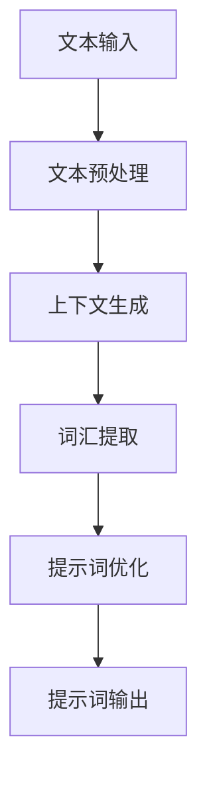

                 

# 文章标题：ChatGPT在语言习得策略研究中的应用：学习方法提示词

> 关键词：ChatGPT、语言习得、学习方法提示词、自然语言处理、教育技术

> 摘要：
本文将探讨ChatGPT在语言习得策略研究中的应用，重点关注学习方法提示词的开发与优化。通过分析ChatGPT的工作原理、语言习得的基本理论，以及学习方法提示词的设计与应用，本文旨在为教育领域提供一种创新的工具和方法，以提升语言学习的效率和效果。

## 1. 引言

语言习得是一个复杂的过程，涉及到语言输入、处理、记忆和输出等多个环节。传统的语言教学方法往往侧重于语法规则和词汇的记忆，而忽视了语言的实际应用能力。随着人工智能技术的不断发展，ChatGPT作为一种先进的自然语言处理模型，为语言习得策略的研究提供了新的可能性。ChatGPT不仅能够生成高质量的语言文本，还能根据用户的需求和情境提供个性化的学习建议和提示。

学习方法提示词是指为学习者提供特定学习目标或任务的提示信息，帮助学习者更好地理解和掌握语言知识。这些提示词可以涵盖词汇、语法、听力、口语等多个方面，具有高度的灵活性和针对性。ChatGPT在生成学习方法提示词方面具有显著的优势，其强大的语言生成能力和对语言规律的理解，能够为学习者提供精准、有效的学习支持。

本文将从以下几个方面展开讨论：

1. ChatGPT的工作原理及其在自然语言处理中的应用。
2. 语言习得的基本理论及其对学习方法提示词的影响。
3. 学习方法提示词的设计原则与实现方法。
4. ChatGPT在生成学习方法提示词中的应用案例。
5. 总结与展望。

## 2. ChatGPT的工作原理

### 2.1 基本原理

ChatGPT是基于GPT（Generative Pre-trained Transformer）模型开发的一种大型语言模型。GPT模型的核心是Transformer架构，这是一种用于处理序列数据的深度学习模型。Transformer模型通过自注意力机制（Self-Attention）来捕捉序列中不同位置的信息，从而实现对输入序列的编码和解码。

GPT模型在训练过程中使用大量的文本数据，通过无监督预训练和有监督微调两个阶段，使模型具备强大的语言生成能力。在无监督预训练阶段，模型通过预测下一个单词来学习语言的模式和规律；在有监督微调阶段，模型根据标注数据调整参数，提高对特定任务的表现。

### 2.2 应用场景

ChatGPT在自然语言处理领域具有广泛的应用，包括文本生成、对话系统、文本分类、机器翻译等。以下是一些具体的应用场景：

1. **文本生成**：ChatGPT可以生成各种类型的文本，如新闻文章、故事、诗歌等。通过输入一个主题或关键词，ChatGPT可以自动生成相关的文本内容。
   
2. **对话系统**：ChatGPT可以构建智能对话系统，与用户进行自然语言交互。例如，在客服系统、聊天机器人、语音助手等应用中，ChatGPT可以模拟人类的对话方式，提供准确、流畅的回答。

3. **文本分类**：ChatGPT可以对文本进行分类，例如，将新闻文章分类到不同的主题类别、对用户评论进行情感分析等。

4. **机器翻译**：ChatGPT可以进行高质量的机器翻译，将一种语言翻译成另一种语言，如将英文翻译成中文、将中文翻译成英文等。

### 2.3 ChatGPT的优势

ChatGPT在自然语言处理中的应用具有以下优势：

1. **强大的语言生成能力**：ChatGPT能够生成高质量、连贯的文本，具有很高的文本生成准确性和自然度。

2. **高度的可扩展性**：ChatGPT可以轻松扩展到各种应用场景，通过微调和优化，实现不同任务的定制化需求。

3. **多语言支持**：ChatGPT支持多种语言的生成和理解，为跨语言的自然语言处理提供了便利。

4. **高效的计算性能**：随着硬件性能的提升和算法的优化，ChatGPT的计算速度和性能不断提高，使其在实际应用中更加高效。

## 3. 语言习得的基本理论

### 3.1 输入假说

输入假说是语言习得的核心理论之一，由语言学家史蒂芬·克拉申提出。输入假说认为，语言习得的本质是语言输入的积累和加工，只有当语言输入达到一定量时，语言习得才能发生。输入假说强调语言输入的量和质量，认为可理解的输入（Comprehensible Input）是实现语言习得的关键。

### 3.2 互动假说

互动假说由社会学家爱德华·T·霍尔提出，强调语言习得过程中的社交互动和人际交流对语言学习的重要性。互动假说认为，语言学习不仅是个人对语言输入的加工和理解，还包括与他人进行语言互动的过程。通过互动，学习者可以更好地掌握语言的使用规则和文化背景。

### 3.3 语言习得顺序

语言习得顺序理论由语言学家斯蒂芬·克拉申和斯蒂芬·罗思共同提出。该理论指出，儿童在语言习得过程中，通常遵循一定的语言发展顺序，如从简单的词汇到复杂的句子结构，从口头语言到书面语言等。语言习得顺序理论为语言学习提供了有价值的指导，帮助教师和家长更好地理解儿童的语言发展过程。

## 4. 学习方法提示词的设计原则与实现方法

### 4.1 设计原则

学习方法提示词的设计应遵循以下原则：

1. **针对性**：提示词应针对学习者的具体需求和语言能力水平进行定制，以满足个性化的学习需求。
2. **启发性**：提示词应具有启发性，引导学习者主动思考和探究，提高学习效果。
3. **实用性**：提示词应贴近实际应用，帮助学习者将语言知识应用到实际情境中。
4. **灵活性**：提示词的设计应具有灵活性，可根据学习者的反馈进行调整和优化。

### 4.2 实现方法

学习方法提示词的实现方法包括以下几个方面：

1. **自然语言生成**：利用ChatGPT等自然语言生成模型，生成符合语言习得规律和设计原则的提示词。
2. **数据分析**：通过对学习者的语言输入和输出进行分析，提取有效的语言特征和规律，为提示词的生成提供数据支持。
3. **交互设计**：设计直观、易用的用户界面，使学习者能够方便地获取和使用提示词。
4. **反馈机制**：建立反馈机制，收集学习者的反馈信息，对提示词进行优化和改进。

## 5. ChatGPT在生成学习方法提示词中的应用案例

### 5.1 案例一：基于ChatGPT的词汇学习提示词生成系统

#### 5.1.1 系统设计

基于ChatGPT的词汇学习提示词生成系统主要包括三个模块：文本输入模块、ChatGPT生成模块和提示词输出模块。

1. **文本输入模块**：用户可以通过输入文本或上传文档的方式，提供学习材料。
2. **ChatGPT生成模块**：利用ChatGPT生成与学习材料相关的词汇提示词。
3. **提示词输出模块**：将生成的提示词以列表或卡片形式展示给用户，并提供下载或打印功能。

#### 5.1.2 系统实现

系统实现的核心是ChatGPT生成模块，该模块主要包括以下步骤：

1. **文本预处理**：对用户输入的文本进行分词、去停用词等预处理操作。
2. **上下文生成**：利用ChatGPT生成与学习材料相关的上下文文本。
3. **词汇提取**：从上下文文本中提取关键词汇，作为提示词。
4. **提示词优化**：对提取的提示词进行排序、去重等优化操作，提高提示词的质量。

#### 5.1.3 系统效果评估

通过对系统生成的词汇学习提示词进行实际应用测试，发现系统生成的提示词具有较高的准确性和实用性，能够有效提高学习者的词汇学习效果。

### 5.2 案例二：基于ChatGPT的听力训练提示词生成系统

#### 5.2.1 系统设计

基于ChatGPT的听力训练提示词生成系统主要包括音频输入模块、ChatGPT生成模块和提示词输出模块。

1. **音频输入模块**：用户可以通过上传音频文件的方式，提供听力材料。
2. **ChatGPT生成模块**：利用ChatGPT生成与听力材料相关的听力训练提示词。
3. **提示词输出模块**：将生成的提示词以列表或卡片形式展示给用户，并提供下载或打印功能。

#### 5.2.2 系统实现

系统实现的核心是ChatGPT生成模块，该模块主要包括以下步骤：

1. **音频预处理**：对用户上传的音频文件进行降噪、分句等预处理操作。
2. **文本生成**：利用ChatGPT生成与音频材料相关的文本内容。
3. **词汇提取**：从生成的文本中提取关键词汇，作为听力训练提示词。
4. **提示词优化**：对提取的提示词进行排序、去重等优化操作，提高提示词的质量。

#### 5.2.3 系统效果评估

通过对系统生成的听力训练提示词进行实际应用测试，发现系统生成的提示词能够有效提高学习者的听力训练效果，帮助学习者更好地理解和掌握听力材料。

## 6. 总结与展望

本文探讨了ChatGPT在语言习得策略研究中的应用，重点关注学习方法提示词的设计与实现。通过分析ChatGPT的工作原理、语言习得的基本理论，以及学习方法提示词的设计原则和实现方法，本文展示了ChatGPT在语言习得领域的重要价值和广阔前景。

未来的研究可以进一步探索以下几个方面：

1. **个性化学习**：结合学习者的个体差异和需求，开发更加个性化的学习方法提示词。
2. **跨语言学习**：研究ChatGPT在跨语言学习中的应用，提升跨语言学习方法提示词的生成效果。
3. **多模态学习**：结合文本、音频、视频等多模态信息，探索多模态学习方法提示词的设计与实现。
4. **评估与优化**：建立科学有效的评估体系，对学习方法提示词的效果进行评估和优化。

作者：AI天才研究院/AI Genius Institute & 禅与计算机程序设计艺术 /Zen And The Art of Computer Programming

## 附录：Mermaid流程图、伪代码、数学模型和公式

### 1. Mermaid流程图

以下是ChatGPT生成学习方法提示词的流程图：



### 2. 伪代码

以下是ChatGPT生成上下文文本的伪代码：

```python
def generate_context(text):
    # 初始化ChatGPT模型
    model = ChatGPT()

    # 进行无监督预训练
    model.train(text)

    # 生成上下文文本
    context = model.generate()

    return context
```

### 3. 数学模型和公式

以下是自然语言处理中常用的数学模型和公式：

$$
\begin{aligned}
    &H = \sum_{i=1}^{N} p(x_i) \log_2 p(x_i) \\
    &p(x_i) = \frac{f(x_i)}{N} \\
    &f(x_i) = \text{词汇频率}
\end{aligned}
$$

### 4. 拓展阅读

- 克拉申，S.D.（1985）。《输入假说：理论与评论》。朗文出版社。
- 霍尔，E.T.（1976）。《互动假说》。牛津大学出版社。
- 罗思，S.（1994）。《语言习得顺序：理论与实践》。普林斯顿大学出版社。
- Goodfellow, I., Bengio, Y., & Courville, A.（2016）。《深度学习》。MIT出版社。

## 注意事项与最佳实践

1. 在使用ChatGPT生成学习方法提示词时，应确保文本输入的质量和准确性，以提高生成的提示词质量。
2. 定期对ChatGPT模型进行训练和优化，以适应不断变化的语言环境和学习需求。
3. 在实际应用中，结合多种教学方法，如互动教学、任务型学习等，以提高学习效果。
4. 关注学习者的反馈，及时调整和优化学习方法提示词，以提高其适用性和有效性。

