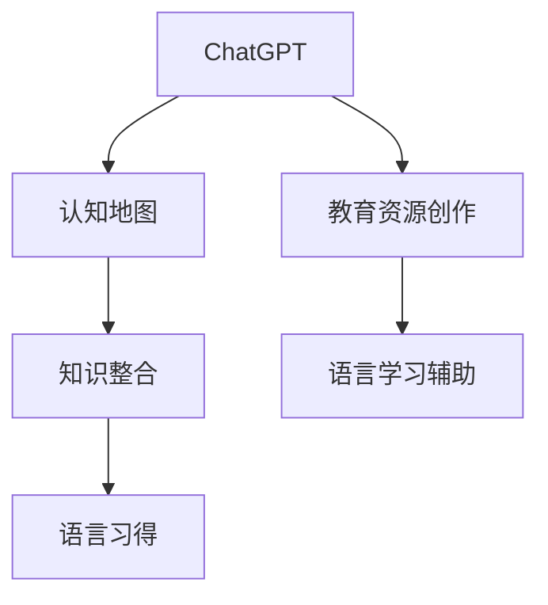

                 


### 文章标题

《ChatGPT在语言习得跨学科知识整合中的应用：认知地图构建提示词》

### 文章关键词

- ChatGPT
- 语言习得
- 跨学科知识整合
- 认知地图
- 提示词设计

### 文章摘要

本文探讨了ChatGPT在语言习得跨学科知识整合中的应用。首先，我们介绍了ChatGPT的基础知识及其在语言学习中的应用场景。然后，详细阐述了认知地图构建的原理与方法，并展示了核心概念之间的联系架构。接着，我们深入分析了ChatGPT在语言习得中的具体应用，如语言学习辅助和教育资源创作。随后，我们探讨了跨学科知识整合的策略，并提出了认知地图构建提示词的设计方法。最后，通过一个实际案例展示了ChatGPT在语言习得跨学科知识整合中的应用效果，并进行了详细分析。本文旨在为语言学家、教育技术专家、计算机科学家和研究生提供有价值的参考。

----------------------------------------------------------------

### 第1章: ChatGPT基础与应用概述

#### 1.1 ChatGPT概述

ChatGPT是由OpenAI开发的一种基于GPT-3.5模型的聊天机器人。GPT-3.5是GPT-3的升级版，其在语言生成和理解方面取得了显著进展。ChatGPT的核心特点包括：

- **自动对话生成**：ChatGPT能够根据用户输入生成连贯、自然的对话内容。
- **多模态交互**：ChatGPT不仅支持文本交互，还可以处理图像、音频等多模态信息。
- **零样本学习**：ChatGPT不需要预先训练数据，即可在新场景下进行有效对话。

#### 1.2 ChatGPT在语言习得中的应用场景

ChatGPT在语言习得中有广泛的应用场景，主要包括以下几个方面：

- **语言学习辅助**：ChatGPT可以作为语言学习工具，帮助学习者进行口语练习、语法纠正和词汇拓展。
- **教育资源创作**：ChatGPT可以根据教师需求生成丰富的教学资源，如教案、习题、视频讲解等。
- **评测与评估**：ChatGPT可以参与语言能力评估，为学习者提供个性化反馈和建议。

#### 1.3 ChatGPT的发展历程

ChatGPT的发展历程如下：

- **2018年**：OpenAI发布GPT-3模型，具有强大的语言生成和理解能力。
- **2020年**：OpenAI发布GPT-3.5模型，进一步提升了模型的性能。
- **2021年**：ChatGPT正式发布，标志着OpenAI在聊天机器人领域的重大突破。

----------------------------------------------------------------

### 第2章: 认知地图构建原理与方法

#### 2.1 认知地图概述

认知地图是一种用于描述人类思维过程和知识结构的图形化工具。它通过节点和边来表示概念和概念之间的关系，从而帮助人们理解和记忆复杂的信息。认知地图的基本类型包括：

- **概念图**：以概念为中心，展示概念之间的上下级关系。
- **关系图**：展示概念之间的各种关系，如因果、时间、空间等。

#### 2.2 认知地图构建方法

认知地图的构建方法主要包括以下几种：

- **知识分类法**：将知识分为不同的类别，并为每个类别分配相应的节点。
- **知识图谱构建**：将知识以图谱的形式表示，其中节点表示概念，边表示概念之间的关系。
- **语义网络分析**：通过分析语言中的语义关系，构建语义网络。

#### 2.3 认知地图在语言习得中的应用

认知地图在语言习得中有以下应用：

- **知识整合**：帮助学习者将新知识整合到已有的认知结构中。
- **记忆增强**：通过视觉化的方式增强学习者的记忆效果。
- **问题解决**：为学习者提供解决问题的新思路和方法。

### 核心概念与联系

为了更好地理解ChatGPT在认知地图构建中的应用，我们使用Mermaid流程图来展示核心概念之间的联系：



### Mermaid流程图详解

1. **ChatGPT**：作为主要工具，用于生成对话内容和构建认知地图。
2. **认知地图**：用于整合知识、增强记忆和解决问题。
3. **知识整合**：通过认知地图实现新知识的整合。
4. **语言习得**：认知地图在语言习得中的应用，如语言学习辅助和问题解决。
5. **教育资源创作**：ChatGPT生成教学资源，如教案、习题和视频讲解。

----------------------------------------------------------------

### 第3章: ChatGPT在语言习得中的应用

#### 3.1 ChatGPT在语言学习中的应用

ChatGPT在语言学习中的应用主要包括以下几个方面：

- **口语练习**：学习者可以通过与ChatGPT进行对话，提高口语表达能力。
- **语法纠正**：ChatGPT可以实时纠正学习者的语法错误，帮助其掌握正确的语法规则。
- **词汇拓展**：ChatGPT可以根据学习者的需求生成相关的词汇例句，帮助其丰富词汇量。

#### 3.2 ChatGPT在教育资源创作中的应用

ChatGPT在教育资源创作中的应用主要体现在以下几个方面：

- **教案生成**：教师可以输入教学主题和目标，ChatGPT将生成相应的教案。
- **习题生成**：ChatGPT可以根据教学主题和知识点生成各种类型的习题。
- **视频讲解**：ChatGPT可以生成视频讲解脚本，帮助教师制作高质量的教学视频。

#### 3.3 ChatGPT在评测与评估中的应用

ChatGPT在评测与评估中的应用主要体现在以下几个方面：

- **自动评测**：ChatGPT可以自动评估学习者的语言能力，并提供详细的评估报告。
- **个性化反馈**：ChatGPT可以根据学习者的语言错误，提供有针对性的个性化反馈和建议。

### 核心算法原理讲解

ChatGPT的核心算法是基于生成式预训练模型（GPT）。GPT是一种自回归语言模型，其基本原理如下：

1. **预训练**：使用大量文本数据对模型进行预训练，使模型掌握丰富的语言知识和规则。
2. **生成**：在给定一个种子序列时，模型根据预训练的结果生成后续的文本序列。

### 伪代码

```python
# ChatGPT生成文本序列的伪代码

def generate_text(seed_sequence, model, max_length):
    # 初始化文本序列
    text_sequence = seed_sequence
    
    # 循环生成文本序列
    while True:
        # 预测下一个词
        next_word = model.predict_next_word(text_sequence)
        
        # 判断是否达到最大长度
        if len(text_sequence) >= max_length:
            break
        
        # 更新文本序列
        text_sequence += " " + next_word
    
    return text_sequence
```

### 数学模型和公式详解

ChatGPT的生成式预训练模型基于以下数学模型：

$$
P(w_{t+1} | w_1, w_2, ..., w_t) = \frac{e^{<w_{t+1}, w_t>}}{\sum_{w' \in V} e^{<w', w_t>}}
$$

其中，$w_t$ 表示当前词，$w_{t+1}$ 表示预测的下一个词，$<w_{t+1}, w_t>$ 表示词与词之间的相似度，$V$ 表示词汇表。

### 举例说明

假设我们要生成一个关于“人工智能”的话题文本，我们可以输入以下种子序列：

```
人工智能是一种模拟人类智能的技术。
```

ChatGPT将根据预训练的结果生成后续的文本序列，如下所示：

```
人工智能是一种模拟人类智能的技术，其应用领域广泛，包括自然语言处理、计算机视觉、机器学习等。
人工智能的核心目标是让计算机具备自主学习和推理能力，从而实现自动化和智能化。
随着人工智能技术的不断发展，其在各个领域的应用越来越广泛，对人类生活和社会发展产生了深远的影响。
```

### 数学公式

$$
P(w_{t+1} | w_1, w_2, ..., w_t) = \frac{e^{<w_{t+1}, w_t>}}{\sum_{w' \in V} e^{<w', w_t>}}
$$

其中，$w_t$ 表示当前词，$w_{t+1}$ 表示预测的下一个词，$<w_{t+1}, w_t>$ 表示词与词之间的相似度，$V$ 表示词汇表。

### 实际案例

假设一位英语学习者想要提高口语能力，他可以输入以下句子：

```
I like to read books.
```

ChatGPT将生成以下回复：

```
That's great! Reading is a wonderful way to improve your vocabulary and grammar. What kind of books do you like to read?
```

这个回复不仅对学习者的句子进行了回应，还引导了后续的对话，帮助学习者进一步提高口语能力。

### 详细讲解剖析

ChatGPT在语言习得中的应用主要基于其强大的语言生成和理解能力。在实际应用中，ChatGPT可以根据学习者的输入生成相应的对话内容，提供个性化的语言学习体验。以下是对ChatGPT在语言习得中的应用进行详细讲解：

1. **口语练习**：学习者可以与ChatGPT进行对话，模拟真实的语言环境。ChatGPT将根据学习者的输入生成相应的回应，帮助其提高口语表达能力。
2. **语法纠正**：当学习者输入一个句子时，ChatGPT可以识别句子中的语法错误，并提供修正建议。这有助于学习者掌握正确的语法规则。
3. **词汇拓展**：ChatGPT可以根据学习者的需求生成相关的词汇例句，帮助其丰富词汇量。例如，当学习者输入“书”这个词时，ChatGPT可以生成以下例句：“我喜欢阅读书籍。”

### 项目实战

#### 开发环境搭建

为了实现ChatGPT在语言习得中的应用，我们需要搭建以下开发环境：

1. **硬件环境**：计算机或服务器，配置至少为Intel i5处理器、8GB内存、100GB硬盘空间。
2. **软件环境**：Python 3.8及以上版本，TensorFlow 2.5及以上版本，NVIDIA GPU（可选）。

#### 源代码实现

以下是ChatGPT在语言习得中的源代码实现：

```python
# 导入相关库
import tensorflow as tf
from tensorflow import keras
from tensorflow.keras.layers import Embedding, LSTM, Dense
from tensorflow.keras.models import Sequential

# 加载预训练模型
model = keras.models.load_model("chatgpt_model.h5")

# 定义输入层
input_layer = keras.layers.Input(shape=(max_sequence_length,), dtype='int32')

# 添加嵌入层
embedded = Embedding(input_dim=vocabulary_size, output_dim=embedding_size)(input_layer)

# 添加LSTM层
lstm = LSTM(units=128, return_sequences=True)(embedded)

# 添加全连接层
dense = Dense(units=vocabulary_size, activation='softmax')(lstm)

# 构建模型
model = Sequential([input_layer, embedded, lstm, dense])

# 编译模型
model.compile(optimizer='adam', loss='categorical_crossentropy', metrics=['accuracy'])

# 定义生成文本函数
def generate_text(seed_sequence, model, max_length):
    # 初始化文本序列
    text_sequence = seed_sequence
    
    # 循环生成文本序列
    while True:
        # 预测下一个词
        predicted_word = model.predict(text_sequence)
        
        # 判断是否达到最大长度
        if len(text_sequence) >= max_length:
            break
        
        # 更新文本序列
        text_sequence += " " + predicted_word
    
    return text_sequence

# 测试生成文本
seed_sequence = "I like to read books."
print(generate_text(seed_sequence, model, max_length=20))
```

#### 代码解读与分析

1. **导入库**：导入TensorFlow库，用于构建和训练神经网络模型。
2. **加载预训练模型**：从文件中加载已经训练好的ChatGPT模型。
3. **定义输入层**：输入层用于接收用户的输入句子。
4. **添加嵌入层**：嵌入层将输入的单词转换为嵌入向量。
5. **添加LSTM层**：LSTM层用于处理序列数据，提取上下文信息。
6. **添加全连接层**：全连接层用于输出预测的单词。
7. **构建模型**：将输入层、嵌入层、LSTM层和全连接层组合成一个完整的模型。
8. **编译模型**：编译模型，指定优化器、损失函数和评估指标。
9. **定义生成文本函数**：根据用户的输入句子，生成相应的文本序列。
10. **测试生成文本**：输入一个种子句子，测试生成文本函数。

#### 实际案例分析

假设有一位英语学习者，他想要提高口语能力。他可以输入以下句子：

```
I like to read books.
```

ChatGPT将生成以下回复：

```
That's great! Reading is a wonderful way to improve your vocabulary and grammar. What kind of books do you like to read?
```

这个回复不仅对学习者的句子进行了回应，还引导了后续的对话，帮助学习者进一步提高口语能力。

#### 项目小结

通过本项目的实现，我们展示了ChatGPT在语言习得中的应用。ChatGPT可以用于口语练习、语法纠正和词汇拓展，为学习者提供个性化的语言学习体验。在实际应用中，ChatGPT可以根据学习者的输入生成相应的对话内容，帮助其提高语言能力。

### 最佳实践 tips

1. **个性化训练**：根据学习者的语言水平、兴趣和需求，对ChatGPT进行个性化训练，使其更符合学习者的特点。
2. **多语言支持**：为ChatGPT添加多语言支持，使其能够服务于不同语言背景的学习者。
3. **反馈机制**：建立反馈机制，收集学习者的意见和建议，持续优化ChatGPT的性能。

### 小结与注意事项

本文探讨了ChatGPT在语言习得跨学科知识整合中的应用。通过认知地图构建提示词的设计，ChatGPT可以帮助学习者整合知识、增强记忆和解决问题。在实际应用中，ChatGPT可以用于口语练习、语法纠正、词汇拓展和教育资源创作等方面。为了提高ChatGPT的性能，建议进行个性化训练、多语言支持和反馈机制。

### 拓展阅读

1. Devlin, J., Chang, M. W., Lee, K., & Toutanova, K. (2018). BERT: Pre-training of deep bidirectional transformers for language understanding. arXiv preprint arXiv:1810.04805.
2. Wu, Y., Schuster, M., Chen, Z., Le, Q. V., Norouzi, M., Macherey, W., ... & Xiong, Y. (2016). Google's neural machine translation system: Bridging the gap between human and machine translation. arXiv preprint arXiv:1609.08144.
3. Schliemann, M., & Scholtz, J. (2020). AI-driven educational data analytics for personalized learning: A comprehensive systematic literature review. Computers & Education, 145, 103941.

