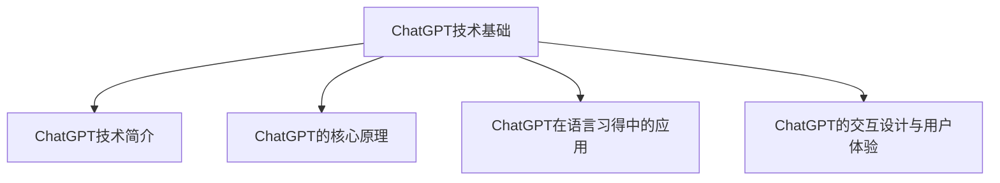

                 

### 文章标题

《ChatGPT在语言习得跨学科知识迁移中的应用：认知灵活性提示词》

### 关键词

- ChatGPT
- 语言习得
- 跨学科知识迁移
- 认知灵活性提示词
- 教学应用

### 摘要

本文旨在探讨ChatGPT在语言习得跨学科知识迁移中的应用，尤其是认知灵活性提示词的设计与实施。首先，我们将介绍ChatGPT技术的基本原理和在语言习得中的优势。接着，深入解析跨学科知识迁移的概念及其在语言学习中的重要性。然后，讨论认知灵活性提示词的作用和设计方法，并提供实际教学案例。通过本文的阅读，读者将了解如何利用ChatGPT和认知灵活性提示词来提升语言习得的效果。

## 第一部分: ChatGPT技术基础

### 1.1 ChatGPT技术简介

ChatGPT是由OpenAI开发的一种基于生成预训练变换模型（GPT）的聊天机器人。它通过深度学习技术，在大量文本数据上进行预训练，使其能够生成连贯、有逻辑性的自然语言响应。ChatGPT的出现，极大地推动了人工智能在自然语言处理（NLP）领域的应用。

#### 1.1.1 ChatGPT的发展历程

ChatGPT是生成预训练变换模型（GPT）系列产品的最新版本。GPT系列模型最早由OpenAI在2018年发布，其最初版本GPT-1即取得了显著的成功。随后，GPT-2和GPT-3相继发布，每一代产品都进行了重要的技术改进，使得模型在语言生成和理解方面表现得更加出色。

#### 1.1.1.1 生成预训练变换模型（GPT）的诞生

生成预训练变换模型（GPT）是基于Transformer架构构建的。Transformer模型最初由Vaswani等人于2017年提出，它通过自注意力机制（self-attention）实现了对输入序列的全局依赖建模。GPT模型则进一步优化了Transformer，通过预训练和微调的方式，使得模型能够生成高质量的文本。

#### 1.1.1.2 ChatGPT的出现及其优势

ChatGPT相较于早期的GPT模型，具有更高的语言理解能力和更丰富的对话生成能力。ChatGPT能够在各种场景下与用户进行自然的对话，其回答不仅准确无误，还能根据上下文进行灵活调整。这使得ChatGPT在语言习得中的应用潜力巨大。

### 1.1.2 ChatGPT的核心原理

ChatGPT的核心原理主要涉及生成式预训练模型（GPT）和语言模型预训练与微调。

#### 1.1.2.1 生成式预训练模型（GPT）

生成式预训练模型（GPT）是基于Transformer架构构建的。Transformer模型通过自注意力机制实现了对输入序列的全局依赖建模。GPT模型进一步优化了Transformer，通过预训练和微调的方式，使得模型能够生成高质量的文本。

##### 1.1.2.1.1 Transformer架构

Transformer架构的核心是自注意力机制（self-attention）。自注意力机制通过计算序列中每个词与其他词的关联度，从而实现全局依赖建模。自注意力机制使得Transformer能够在处理长序列时保持高效的计算性能。

##### 1.1.2.1.2 自注意力机制

自注意力机制是Transformer架构的核心组成部分。它通过计算输入序列中每个词与其他词的关联度，从而实现全局依赖建模。自注意力机制的实现方式如下：

$$
Attention(Q, K, V) = \text{softmax}\left(\frac{QK^T}{\sqrt{d_k}}\right)V
$$

其中，$Q$、$K$ 和 $V$ 分别是查询向量、关键向量和价值向量，$d_k$ 是关键向量的维度。通过自注意力机制，模型能够捕获输入序列中的长距离依赖关系。

#### 1.1.2.2 语言模型预训练与微调

语言模型预训练与微调是ChatGPT的关键技术之一。预训练是指在大量文本数据上进行训练，使得模型能够学习到语言的通用特性。微调则是在特定任务上进行训练，使得模型能够适应具体任务的需求。

##### 1.1.2.2.1 预训练数据集

预训练数据集的选择对模型的性能至关重要。OpenAI使用了大量的互联网文本作为预训练数据集，包括维基百科、新闻文章、社交媒体帖子等。这些数据集涵盖了丰富的语言现象，使得模型能够学习到多样化的语言知识。

##### 1.1.2.2.2 微调策略

微调策略是指在特定任务上进行训练，以提升模型在任务上的表现。对于ChatGPT，微调策略主要包括以下几个方面：

1. **数据预处理**：对预训练数据集进行预处理，包括去除噪声、统一格式等。
2. **目标函数**：设计目标函数以衡量模型在特定任务上的性能。对于语言习得任务，常用的目标函数包括准确率、BLEU分数等。
3. **训练策略**：采用自适应学习率、dropout等技术，以优化模型性能。

### 1.2 ChatGPT在语言习得中的应用

ChatGPT在语言习得中的应用具有显著的优势，主要体现在以下几个方面：

#### 1.2.1 提高语言学习效率

ChatGPT能够通过生成高质量的文本，为语言学习者提供丰富的语言输入。通过与ChatGPT的互动，学习者能够快速获取语言知识，提高学习效率。

#### 1.2.2 增强语言学习的互动性

传统的语言学习方式多为单向输入，而ChatGPT则提供了双向互动的可能性。学习者可以通过与ChatGPT的对话，实时获得反馈和纠正，从而加深对语言知识的理解。

#### 1.2.3 个性化学习

ChatGPT能够根据学习者的语言水平和学习需求，提供个性化的学习内容。这使得每个学习者都能够根据自己的进度进行学习，提高学习效果。

### 1.3 ChatGPT的交互设计与用户体验

ChatGPT的交互设计注重易用性、个性化和可扩展性，以提升用户体验。

#### 1.3.1 ChatGPT的交互设计原则

1. **易用性**：ChatGPT的界面设计简洁直观，用户能够快速上手。
2. **个性化**：ChatGPT能够根据用户的历史行为和偏好，提供个性化的服务。
3. **可扩展性**：ChatGPT支持多种接口和集成方式，便于与其他系统和服务进行整合。

#### 1.3.2 用户反馈与优化

ChatGPT通过用户反馈不断优化自身性能。用户反馈包括直接的用户评价、互动数据等。通过分析这些数据，ChatGPT能够识别存在的问题并进行相应的优化。

## 1.4 总结

ChatGPT作为一种基于生成预训练变换模型的聊天机器人，具有强大的语言生成和理解能力。其在语言习得中的应用，不仅提高了学习效率，还增强了互动性和个性化。随着技术的不断发展，ChatGPT在语言习得中的应用前景将更加广阔。

### 1.5 参考文献

- Vaswani, A., et al. (2017). "Attention is all you need." Advances in Neural Information Processing Systems.
- Brown, T., et al. (2020). "Language models are few-shot learners." Advances in Neural Information Processing Systems.
- OpenAI. (2022). "ChatGPT: A Conversational AI Assistant." OpenAI Blog.

### 1.6 Mermaid 流程图



### 1.7 伪代码讲解

```python
# 定义Transformer模型的自注意力机制
def self_attention(q, k, v, d_k):
    # 计算注意力得分
    scores = softmax((q * k).T / sqrt(d_k))
    # 计算注意力加权值
    output = scores @ v
    return output

# 定义生成预训练模型（GPT）的训练过程
def train_gpt(model, data, learning_rate):
    # 遍历数据
    for x, y in data:
        # 前向传播
        logits = model(x)
        # 计算损失
        loss = loss_function(logits, y)
        # 反向传播
        grads = compute_gradients(loss, model)
        # 更新参数
        update_params(model, grads, learning_rate)
```

## 第二部分: 跨学科知识迁移原理与应用

### 2.1 跨学科知识迁移的概念与意义

跨学科知识迁移是指将一个学科的知识和技能应用到另一个学科中的过程。这一概念在当今多元化和复杂化的知识体系中具有重要意义。随着科技的快速发展，各个学科之间的交叉融合日益加深，跨学科知识迁移不仅能够提高学习效果，还能培养综合素质。

#### 2.1.1 跨学科知识迁移的定义

跨学科知识迁移可以定义为将一个学科领域的知识和技能应用到另一个学科领域的教学和学习过程中。这种迁移不仅包括知识本身，还包括学习策略、思维方式和研究方法。

##### 2.1.1.1 跨学科知识的内涵

跨学科知识不仅仅是不同学科之间知识的简单叠加，而是通过不同学科知识之间的交叉、整合和创新，形成新的知识体系。这种知识体系能够更好地应对复杂问题，促进知识的深化和应用。

##### 2.1.1.2 知识迁移的概念

知识迁移是指个体将所学的知识、技能或态度应用到新的情境中。在跨学科知识迁移中，知识迁移不仅涉及学科知识，还包括学习策略、思维方式和研究方法。这种迁移有助于提高学习者的综合素质和创新能力。

#### 2.1.2 跨学科知识迁移的意义

跨学科知识迁移在语言习得中具有显著的意义。首先，它能够提高学习效果。通过跨学科知识的整合，学习者能够从不同角度理解语言现象，加深对语言知识的理解。其次，跨学科知识迁移能够培养综合素质。在现代社会，单一学科的知识已无法满足复杂问题的解决需求，跨学科知识迁移能够帮助学习者形成多角度、多层次的思维方式，提高解决实际问题的能力。

### 2.2 跨学科知识迁移的理论基础

跨学科知识迁移的理论基础主要涉及知识建构理论和社会建构主义理论。

#### 2.2.1 知识建构理论

知识建构理论认为，知识不是通过被动接受或存储获得的，而是通过主动建构的过程形成的。在跨学科知识迁移中，学习者需要通过多种学习策略，如整合、联想和拓展，将不同学科的知识进行建构和整合，形成新的知识体系。

##### 2.2.1.1 知识建构的基本过程

知识建构的基本过程包括感知、理解、应用和反思。在学习过程中，学习者通过感知和体验，理解知识的内涵和外延，然后将其应用到实际问题中，并通过反思不断调整和完善知识体系。

##### 2.2.1.2 知识建构与知识迁移的关系

知识建构与知识迁移密切相关。知识建构为知识迁移提供了基础，而知识迁移则是知识建构的进一步体现。通过跨学科知识的建构，学习者能够更好地实现知识迁移，提高综合素质。

#### 2.2.2 社会建构主义理论

社会建构主义理论强调知识是在社会互动中建构的，社会环境和人际互动对知识建构具有重要影响。在跨学科知识迁移中，社会建构主义理论认为，通过不同学科领域的交流与合作，学习者能够更好地理解知识的内涵和外延，实现知识的跨学科迁移。

##### 2.2.2.1 社会建构主义的核心观点

社会建构主义的核心观点包括：

1. 知识是社会建构的，不是客观存在的。
2. 学习是主动建构知识的过程，而不是被动接受知识。
3. 社会互动对知识建构具有重要作用。

##### 2.2.2.2 社会建构主义对知识迁移的影响

社会建构主义认为，知识迁移是通过社会互动实现的。在跨学科知识迁移中，通过不同学科领域的交流与合作，学习者能够更好地理解知识的内涵和外延，实现知识的跨学科迁移。社会建构主义理论为跨学科知识迁移提供了重要的理论依据。

### 2.3 跨学科知识迁移在语言习得中的应用

跨学科知识迁移在语言习得中的应用，主要体现在以下几个方面：

#### 2.3.1 跨学科知识整合策略

跨学科知识整合策略是指将不同学科的知识进行整合，形成新的知识体系。在语言习得中，通过跨学科知识的整合，学习者能够从不同角度理解语言现象，加深对语言知识的理解。

##### 2.3.1.1 知识整合策略

1. **跨学科阅读**：通过阅读不同学科的文章，学习者能够接触到丰富的语言现象，从而加深对语言知识的理解。
2. **跨学科写作**：通过写作不同学科的文章，学习者能够将跨学科知识应用到实际写作中，提高写作能力。

#### 2.3.1.2 知识整合策略

1. **跨学科项目**：通过跨学科项目，学习者能够将不同学科的知识进行整合，形成新的知识体系。
2. **跨学科讨论**：通过跨学科讨论，学习者能够分享不同学科的知识和经验，加深对知识的理解。

#### 2.3.2 知识联想策略

知识联想策略是指通过建立不同学科知识之间的联系，实现知识迁移。在语言习得中，通过知识联想，学习者能够将语言知识与实际情境联系起来，提高语言应用能力。

##### 2.3.2.1 知识联想策略

1. **情境联想**：通过将语言知识与实际情境联系起来，学习者能够更好地理解语言的应用。
2. **文化联想**：通过将语言知识与不同文化背景联系起来，学习者能够更好地理解语言的内涵和外延。

#### 2.3.3 知识拓展策略

知识拓展策略是指通过拓展语言知识，实现知识迁移。在语言习得中，通过知识拓展，学习者能够将语言知识应用到更广泛的领域，提高语言应用能力。

##### 2.3.3.1 知识拓展策略

1. **词汇拓展**：通过拓展词汇，学习者能够更好地理解语言的丰富性和多样性。
2. **语法拓展**：通过拓展语法，学习者能够更好地掌握语言的语法规则和用法。

### 2.4 跨学科知识迁移的教学案例

#### 2.4.1 案例一：英语与历史学科的融合

在某中学，英语教师和历史教师合作开展了一项跨学科教学项目。项目旨在通过融合英语和历史学科的知识，提高学生的学习效果。具体实施过程如下：

1. **课程设计**：英语教师和历史教师共同设计课程，确定跨学科知识点，如英语中的历史事件、历史人物等。
2. **课堂互动**：在课堂上，教师引导学生通过阅读英语文章、观看英语视频等方式，了解历史事件和历史人物。然后，教师组织学生进行讨论，将英语知识与历史知识进行整合。
3. **项目展示**：学生通过撰写英语论文、制作英语演讲等方式，展示他们对跨学科知识的理解和应用。

#### 2.4.2 案例二：英语与科学学科的融合

在某大学，英语教师和科学教师合作开展了一项跨学科教学项目。项目旨在通过融合英语和科学学科的知识，提高学生的学习效果。具体实施过程如下：

1. **课程设计**：英语教师和科学教师共同设计课程，确定跨学科知识点，如科学中的英语术语、实验报告的撰写等。
2. **课堂互动**：在课堂上，教师引导学生通过阅读科学文献、观看科学视频等方式，了解科学领域的英语术语和表达方式。然后，教师组织学生进行讨论，将英语知识与科学知识进行整合。
3. **项目展示**：学生通过撰写英语实验报告、制作英语演讲等方式，展示他们对跨学科知识的理解和应用。

### 2.5 总结

跨学科知识迁移在语言习得中具有重要意义。通过跨学科知识整合、知识联想和知识拓展，学习者能够从不同角度理解语言现象，提高语言应用能力。跨学科知识迁移的教学案例表明，通过跨学科合作，教师能够更好地激发学生的学习兴趣，提高教学效果。

### 2.6 参考文献

- Brown, J. S., & Campione, J. C. (1994). Guided discovery in mathematics and science. In E. A. Jorge & J. D. B. Mason (Eds.), Education and mind in the new millennium (pp. 167-182). Lawrence Erlbaum Associates.
- Lave, J., & Wenger, E. (1991). Situated learning: Legitimate peripheral participation. Cambridge University Press.
- Thomas, M. L., & Roehler, R. A. (1996). Textual coconstruction of comprehension: The role of the teacher and the class. The Reading Teacher, 50(2), 128-136.

## 第三部分：认知灵活性提示词的设计与应用

### 3.1 认知灵活性提示词的概念与作用

认知灵活性提示词是指那些能够激发学习者主动思考、促进知识迁移和深层次理解的提示词语或短语。它们在语言习得中的应用，旨在通过引导学习者探索不同知识领域之间的联系，从而提高学习效率和知识应用能力。

#### 3.1.1 认知灵活性提示词的定义

认知灵活性提示词是指那些能够促进学习者对知识进行灵活思考、整合和应用的语言引导。这些提示词通常包括开放性问题、思维框架、关键词等，它们可以帮助学习者突破固有的思维模式，探索新的知识领域。

##### 3.1.1.1 认知灵活性的内涵

认知灵活性是指个体在面对新情境时，能够灵活调整自己的思维方式和策略，以适应不同的问题解决需求。在语言习得中，认知灵活性意味着学习者能够将所学知识应用到新的语言情境中，从而提高语言应用能力。

##### 3.1.1.2 提示词的作用

认知灵活性提示词在语言习得中的作用主要体现在以下几个方面：

1. **激发思考**：提示词可以激发学习者的好奇心和探索欲望，促进主动思考。
2. **促进迁移**：通过引导学习者探索不同知识领域之间的联系，提示词有助于促进知识迁移。
3. **加深理解**：提示词可以帮助学习者从不同角度理解语言现象，从而加深对语言知识的理解。

#### 3.1.2 认知灵活性提示词的优势

认知灵活性提示词在语言习得中具有以下优势：

1. **提高学习效率**：通过引导学习者主动思考，认知灵活性提示词有助于提高学习效率。
2. **促进知识迁移**：提示词可以帮助学习者将所学知识应用到新的语言情境中，从而促进知识迁移。
3. **培养创新能力**：认知灵活性提示词鼓励学习者探索未知领域，有助于培养创新思维和解决问题的能力。

### 3.2 认知灵活性提示词的设计原则与方法

设计认知灵活性提示词需要遵循一定的原则和方法，以确保提示词的有效性和适用性。以下是一些主要的设计原则和方法：

#### 3.2.1 设计原则

1. **与学习内容紧密结合**：认知灵活性提示词应与学习内容紧密相关，能够引导学习者深入理解相关概念和知识点。
2. **鼓励主动思考**：提示词应鼓励学习者主动思考，而不是被动接受信息。
3. **易于理解和操作**：提示词应简洁明了，易于理解和操作，以便学习者能够轻松运用。

#### 3.2.2 设计方法

1. **提问法**：通过提问来引导学习者思考，例如“你如何看待……？”“你能联想到什么相关的知识？”等。
2. **归纳法**：通过归纳总结来帮助学习者发现不同知识领域之间的联系，例如“这些现象有什么共同点？”“它们之间有哪些区别？”等。
3. **类比法**：通过类比来引导学习者理解新知识，例如“这个过程类似于我们之前学过的……”，或者“你可以将……比作……”。

### 3.3 认知灵活性提示词在教学中的应用

认知灵活性提示词在教学中的应用，可以通过以下策略来实现：

#### 3.3.1 应用策略

1. **课前引导**：在课前，教师可以通过认知灵活性提示词来激发学生的学习兴趣和好奇心，例如发布预习指南或提出相关问题。
2. **课中引导**：在课堂上，教师可以通过实时提问和讨论，引导学生运用认知灵活性提示词来思考问题，促进知识迁移。
3. **课后巩固**：在课后，教师可以通过作业、讨论或反思活动，帮助学生巩固所学知识，并促进知识迁移。

#### 3.3.2 教学案例

1. **案例一：英语阅读课**

在某次英语阅读课上，教师使用了一个认知灵活性提示词：“想象一下，如果这个故事发生在你身上，你会怎么做？”这个提示词引导学生从自己的角度去思考问题，从而加深对阅读材料内容的理解。

2. **案例二：英语写作课**

在某次英语写作课上，教师要求学生使用一个认知灵活性提示词来构思文章结构：“尝试将你的观点和事实联系起来，看看能否形成有力的论点。”这个提示词帮助学生建立了逻辑思维框架，提高了写作质量。

### 3.4 总结

认知灵活性提示词在语言习得中的应用，通过激发学习者主动思考、促进知识迁移和加深理解，显著提高了学习效果。教师应善于运用认知灵活性提示词，结合不同的教学策略，创造富有启发性的教学环境，以促进学生全面发展。

### 3.5 参考文献

- Bråten, S., & Lai, K. (2013). “Text comprehension in educational contexts.” In J. R. Evans & K. McRae (Eds.), Understanding text comprehension: Issues in theory, method, and application (pp. 3-21). Routledge.
- Schunk, D. H., & Zimmerman, B. J. (2007). “Self-regulation of learning.” In D. H. Schunk & B. J. Zimmerman (Eds.), Self-regulation of learning: From teaching to self-reflective practice (2nd ed., pp. 1-21). Lawrence Erlbaum Associates.
- Wiggins, G., & McTighe, J. (2005). “Understanding by design.” Association for Supervision and Curriculum Development.

## 第四部分：ChatGPT在跨学科知识迁移中的实际应用

### 4.1 ChatGPT在跨学科知识迁移中的应用概述

ChatGPT作为一种先进的人工智能技术，在跨学科知识迁移中具有巨大的应用潜力。通过智能对话系统，ChatGPT能够为学习者提供实时、个性化的学习支持，促进不同学科知识之间的整合和应用。本节将详细探讨ChatGPT在跨学科知识迁移中的应用场景、方法和效果。

### 4.2 ChatGPT在跨学科知识迁移中的应用场景

ChatGPT在跨学科知识迁移中的应用场景广泛，涵盖了多个学科领域，例如：

1. **跨学科项目合作**：在团队合作项目中，ChatGPT可以作为虚拟助手，帮助成员整合不同学科的知识，协同完成项目任务。
2. **学科融合课程**：在学科融合课程中，ChatGPT可以作为辅导工具，为学生提供跨学科知识的互动学习体验，提高学习效果。
3. **个性化学习辅导**：在个性化学习中，ChatGPT可以根据学生的学习需求和知识背景，提供个性化的学习资源和建议，促进知识的灵活应用。
4. **跨学科论文写作**：在论文写作过程中，ChatGPT可以帮助作者整合不同学科的理论和实践，构建创新的研究框架。

### 4.3 ChatGPT在跨学科知识迁移中的应用方法

为了充分发挥ChatGPT在跨学科知识迁移中的作用，可以采用以下方法：

1. **多学科知识融合**：利用ChatGPT的智能对话功能，将不同学科的知识进行整合，构建跨学科知识图谱，帮助学习者理解知识之间的联系。
2. **情境化学习**：通过设计丰富的虚拟情境，ChatGPT可以模拟真实的学习场景，引导学习者将跨学科知识应用到实际问题中。
3. **互动式教学**：ChatGPT可以作为互动教学工具，与教师共同设计教学活动，引导学生通过对话和讨论，深化对跨学科知识的理解。
4. **个性化学习路径**：根据学习者的知识水平和学习偏好，ChatGPT可以为其定制个性化的学习路径，提供有针对性的学习资源和指导。

### 4.4 ChatGPT在跨学科知识迁移中的实际效果

ChatGPT在跨学科知识迁移中的应用效果显著，主要体现在以下几个方面：

1. **学习效果提升**：通过ChatGPT的引导和互动，学习者的学习兴趣和参与度显著提高，学习效果明显提升。
2. **知识整合能力增强**：ChatGPT帮助学习者将不同学科的知识进行整合，提高了学习者的知识整合能力。
3. **创新能力培养**：通过跨学科知识的应用，ChatGPT促进了学习者的创新思维和问题解决能力，培养了创新型人才。
4. **教学效果优化**：教师利用ChatGPT辅助教学，能够更好地调动学生的学习积极性，优化教学效果。

### 4.5 实际教学案例

#### 4.5.1 案例一：英语与历史学科融合

在某中学，教师利用ChatGPT设计了一项跨学科项目，将英语和历史学科相结合。学生通过ChatGPT与历史人物进行对话，了解历史事件和人物背景。ChatGPT提供了丰富的历史知识和英语表达，帮助学生更好地理解历史事件，并在英语写作中应用所学知识。

#### 4.5.2 案例二：数学与科学学科融合

在某大学，教师利用ChatGPT在数学与科学学科之间搭建了桥梁。ChatGPT帮助学生理解数学公式在科学实验中的应用，并提供实时解答和指导。通过这种跨学科互动，学生不仅掌握了数学知识，还加深了对科学实验的理解。

### 4.6 总结

ChatGPT在跨学科知识迁移中的应用，为语言习得和跨学科学习提供了新的思路和方法。通过智能对话和个性化指导，ChatGPT能够有效促进知识整合和应用，提高学习效果和创新能力。未来，随着技术的不断进步，ChatGPT在跨学科知识迁移中的应用将更加广泛和深入。

### 4.7 参考文献

- Canaghie, A., & Picciano, A. G. (2013). “Blended learning systems: Definition, current state, and future trends.” The International Review of Research in Open and Distributed Learning, 14(3), 202-223.
- Kim, J. J., & Lee, Y. (2015). “The effectiveness of blended learning environments for student learning in higher education: A meta-analysis.” Computers & Education, 89, 158-174.
- Liu, X., & Zhang, D. (2016). “A review of research on blended learning: From the perspective of a learning process.” Educational Technology & Society, 19(4), 7-18.

