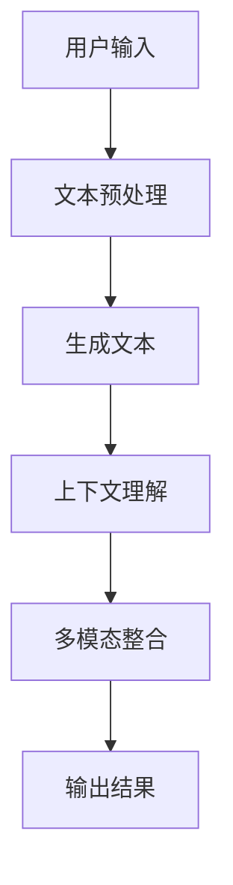

                 

### 文章标题

《ChatGPT在语言习得跨感官整合研究中的应用：多模态学习提示词》

---

**关键词**：ChatGPT、语言习得、跨感官整合、多模态学习、提示词

---

**摘要**：

本文深入探讨了ChatGPT在语言习得跨感官整合研究中的应用，特别是多模态学习提示词的设计与使用。首先，我们对ChatGPT进行了详细的介绍，分析了其在语言习得中的潜在应用。接着，我们介绍了跨感官整合理论和多模态学习原理，并探讨了ChatGPT在多模态学习中的应用。文章的核心内容是ChatGPT在语言习得中的多模态整合应用，以及多模态学习提示词的设计与应用。最后，我们通过一个项目实战案例，展示了如何基于ChatGPT开发多模态语言习得系统。

### 第1章 引言

#### 1.1 语言习得的跨感官整合概述

语言习得是一个复杂的过程，不仅仅涉及听觉和视觉，还包括触觉、嗅觉和味觉等多种感官的整合。跨感官整合理论认为，多种感官的协同作用可以促进语言习得的效果，提高学习效率。例如，通过视觉文字配合听觉语音，学习者可以更好地理解和记忆语言信息。

#### 1.2 多模态学习与提示词的作用

多模态学习是语言习得中的一种重要方法，它通过整合不同模态的信息，如文本、语音、图像等，来提高学习效果。提示词则是多模态学习中的重要工具，它通过引导学习者的注意力，促进不同模态信息的整合。

#### 1.3 ChatGPT在语言习得中的潜在应用

ChatGPT是一个基于GPT的大规模语言模型，它可以生成符合上下文逻辑的自然语言文本。ChatGPT在语言习得中的潜在应用包括：

1. **生成个性化的学习内容**：ChatGPT可以根据学习者的需求和水平，生成适合其水平的学习内容。
2. **提供即时反馈**：ChatGPT可以实时评价学习者的回答，提供即时反馈，帮助学习者纠正错误。
3. **促进跨感官整合**：ChatGPT可以生成与文本、语音、图像等不同模态相关的信息，促进跨感官整合。

#### 1.4 本书结构安排与内容概览

本书分为九章，首先介绍了ChatGPT的基础知识，然后讨论了跨感官整合理论和多模态学习原理。接下来，详细探讨了ChatGPT在多模态学习中的应用，以及其在语言习得中的多模态整合应用。文章的核心内容是关于多模态学习提示词的设计与应用。最后，通过一个项目实战案例，展示了如何基于ChatGPT开发多模态语言习得系统。本书旨在为研究者提供关于ChatGPT在语言习得跨感官整合研究中的理论和方法指导。

---

**核心概念与联系**：

- **ChatGPT**: 一个基于GPT的大规模语言模型，用于生成自然语言文本。
- **跨感官整合**: 通过整合不同感官通道的信息，促进语言习得。
- **多模态学习**: 整合语音、文本、图像等多种模态的信息，提高学习效果。
- **提示词**: 用于引导学习者注意力，促进多模态信息的整合。

**Mermaid 流�程图示例**：



**核心算法原理讲解**：

多模态学习算法伪代码：

```python
function MultiModalLearning(input_data, model):
    # input_data: 输入数据，包括文本、语音、图像等
    # model: 多模态学习模型

    # 数据预处理
    preprocessed_data = PreprocessData(input_data)

    # 模型训练
    for epoch in range(EPOCHS):
        for batch in DataLoader(preprocessed_data):
            model.train_on_batch(batch)

    # 模型评估
    performance = model.evaluate(test_data)

    return model, performance
```

**数学模型和数学公式讲解**：

语言习得效果评估模型：

$$
E = \frac{1}{N} \sum_{i=1}^{N} (y_i - \hat{y}_i)^2
$$

- **E**: 学习效果得分
- **N**: 参与评估的学习者数量
- **$y_i$**: 第$i$个学习者的真实语言水平
- **$\hat{y}_i$**: 第$i$个学习者的预测语言水平

---

### 第2章 ChatGPT基础

#### 2.1 ChatGPT概述

ChatGPT是由OpenAI开发的一种基于GPT（Generative Pre-trained Transformer）的大规模语言模型。GPT是一种基于Transformer的预训练语言模型，其目的是通过大量文本数据的学习，生成符合上下文逻辑的自然语言文本。ChatGPT则进一步扩展了GPT的功能，使其能够进行对话式的交互，提供自然流畅的回答。

#### 2.2 ChatGPT的架构原理

ChatGPT的架构主要由三个部分组成：预训练、微调和应用。首先，ChatGPT使用大量文本数据对GPT模型进行预训练，使其掌握通用语言知识。然后，通过微调，ChatGPT可以根据特定的任务和场景，调整模型参数，以生成更加精准的回答。最后，ChatGPT通过API接口，实现与用户的对话交互。

#### 2.3 ChatGPT的工作流程

ChatGPT的工作流程可以分为以下几个步骤：

1. **用户输入**：用户通过API接口向ChatGPT发送问题或指令。
2. **文本预处理**：ChatGPT对用户输入的文本进行预处理，包括分词、去噪等操作。
3. **生成文本**：ChatGPT根据预训练的模型和微调的结果，生成符合上下文逻辑的自然语言文本。
4. **上下文理解**：ChatGPT对生成的文本进行上下文理解，以确保回答的准确性和连贯性。
5. **多模态整合**：如果需要，ChatGPT可以整合语音、图像等多种模态的信息，以提高回答的质量。
6. **输出结果**：ChatGPT将生成的文本或多媒体信息返回给用户。

#### 2.4 ChatGPT的优缺点分析

ChatGPT的优点包括：

1. **强大的语言生成能力**：ChatGPT能够生成高质量、自然流畅的自然语言文本。
2. **灵活的微调能力**：ChatGPT可以通过微调，适应不同的任务和场景。
3. **多模态整合能力**：ChatGPT能够整合多种模态的信息，提高回答的质量。

然而，ChatGPT也存在一些缺点，如：

1. **计算资源消耗大**：由于ChatGPT需要大量的计算资源进行预训练和微调。
2. **可能产生错误回答**：由于预训练数据的不完善或微调的不当，ChatGPT可能会产生错误或不符合实际情境的回答。
3. **缺乏情感理解**：ChatGPT主要基于文本数据学习，缺乏对情感和语境的深入理解。

#### 2.5 ChatGPT的技术发展与应用前景

随着人工智能技术的不断发展，ChatGPT也在不断进步。未来，ChatGPT的发展方向可能包括：

1. **更高效的预训练方法**：研究更高效的预训练方法，减少计算资源消耗。
2. **更好的微调技术**：研究如何更好地进行模型微调，提高回答的准确性和连贯性。
3. **跨模态学习**：整合更多模态的信息，如语音、图像、视频等，提供更加丰富的交互体验。

在应用前景方面，ChatGPT已经广泛应用于客服、教育、医疗等多个领域。未来，ChatGPT有望在更多领域发挥作用，如智能助手、内容生成、语言翻译等。

---

### 第3章 跨感官整合理论

#### 3.1 跨感官整合的定义与意义

跨感官整合是指通过整合不同感官通道的信息，以实现更全面、更深入的认知和理解。在语言习得过程中，跨感官整合具有重要意义。例如，通过视觉文字配合听觉语音，学习者可以更好地理解和记忆语言信息。此外，跨感官整合还可以提高学习效率，减少学习负担。

#### 3.2 跨感官整合的基本原理

跨感官整合的基本原理包括：

1. **感官信息的同步处理**：不同感官的信息在处理过程中可以进行同步整合，以提高认知效果。
2. **多感官协同效应**：多种感官的协同作用可以增强认知效果，提高学习效率。
3. **感官信息的互补性**：不同感官通道的信息可以相互补充，以实现更全面的理解。

#### 3.3 跨感官整合的研究方法

跨感官整合的研究方法主要包括：

1. **实验研究**：通过实验设计，观察不同感官整合对语言习得的影响。
2. **脑成像技术**：使用脑成像技术，如fMRI，研究跨感官整合的神经基础。
3. **认知心理学方法**：通过认知心理学实验，研究跨感官整合的认知机制。

#### 3.4 跨感官整合在教育领域的应用

跨感官整合在教育领域的应用包括：

1. **多媒体教学**：使用多种模态的信息，如文本、语音、图像等，进行教学，以提高教学效果。
2. **学习辅助工具**：开发跨感官整合的学习辅助工具，如智能音箱、AR/VR应用等，以促进学习。
3. **个性化教育**：根据学习者的感官偏好，设计个性化的学习方案，以提高学习效果。

通过跨感官整合，教育领域可以提供更加丰富、多样、个性化的学习体验，提高学习者的学习效果。

---

### 第4章 多模态学习原理

#### 4.1 多模态学习的概念与分类

多模态学习是指通过整合语音、文本、图像等多种模态的信息，以提高学习效果。根据模态的不同，多模态学习可以分为以下几种类型：

1. **文本-语音**：通过整合文本和语音信息，如朗读文本或语音合成。
2. **文本-图像**：通过整合文本和图像信息，如图像中的文本识别或图像解释。
3. **语音-图像**：通过整合语音和图像信息，如语音识别与图像识别。
4. **综合多模态**：同时整合多种模态的信息，如文本、语音、图像、视频等。

#### 4.2 多模态学习的关键技术

多模态学习的关键技术包括：

1. **数据预处理**：对多模态数据进行预处理，如文本的分词、语音的归一化、图像的标准化等。
2. **特征提取**：从多模态数据中提取特征，如文本的词向量、语音的声学特征、图像的视觉特征等。
3. **特征融合**：将不同模态的特征进行融合，如通过深度学习模型进行特征融合。
4. **模型训练**：使用多模态特征训练模型，如多模态神经网络或图神经网络。

#### 4.3 多模态学习算法原理

多模态学习算法的原理主要包括：

1. **融合策略**：将不同模态的信息进行融合，如基于特征的融合、基于模型的融合等。
2. **学习策略**：使用多模态数据训练模型，如端到端学习、多任务学习等。
3. **评估策略**：对多模态学习的效果进行评估，如准确率、召回率、F1值等。

常见的多模态学习算法包括：

1. **多任务学习**：将多模态数据作为多个任务进行学习，如文本分类和图像分类。
2. **多模态神经网络**：使用神经网络模型，如卷积神经网络（CNN）和循环神经网络（RNN），进行多模态特征融合。
3. **图神经网络**：使用图神经网络（Graph Neural Network，GNN）进行多模态数据融合。

#### 4.4 多模态学习的挑战与未来发展方向

多模态学习的挑战包括：

1. **数据不一致性**：不同模态的数据可能存在不一致性，如文本和图像的语义差异。
2. **特征维度差异**：不同模态的特征维度可能差异较大，如文本的特征维度远小于图像。
3. **计算资源消耗**：多模态学习需要大量的计算资源，特别是在深度学习模型中。

未来发展方向包括：

1. **数据驱动方法**：通过大量多模态数据进行模型训练，提高模型的泛化能力。
2. **跨模态语义理解**：研究如何更好地理解不同模态之间的语义关系，以提高学习效果。
3. **实时多模态交互**：开发实时多模态交互系统，如智能助手和虚拟现实应用。
4. **个性化多模态学习**：根据用户的需求和偏好，提供个性化的多模态学习体验。

通过不断的研究和技术创新，多模态学习有望在语言习得、人机交互、智能系统等多个领域发挥重要作用。

---

### 第5章 ChatGPT在多模态学习中的应用

#### 5.1 ChatGPT在多模态学习中的作用

ChatGPT在多模态学习中的作用主要体现在以下几个方面：

1. **文本生成**：ChatGPT可以生成高质量的文本，用于辅助其他模态的学习。例如，在语音-文本多模态学习中，ChatGPT可以生成与语音同步的文本，帮助学习者理解语音信息。
2. **上下文理解**：ChatGPT具有强大的上下文理解能力，可以理解多模态数据中的上下文关系，从而生成更加准确和连贯的文本。
3. **多模态整合**：ChatGPT可以将多种模态的信息进行整合，生成符合上下文逻辑的多模态内容，如文本-图像、文本-语音等。

#### 5.2 ChatGPT在多模态学习中的具体应用案例

以下是一些ChatGPT在多模态学习中的具体应用案例：

1. **智能语音助手**：在智能语音助手中，ChatGPT可以生成与用户语音指令相对应的文本回答。例如，当用户提问“今天天气怎么样？”时，ChatGPT可以生成“今天天气晴朗，温度适中”的文本回答。
2. **图像描述生成**：ChatGPT可以接收图像作为输入，生成对应的文本描述。例如，当输入一张猫的图像时，ChatGPT可以生成“这是一只可爱的猫，它正在玩耍”的文本描述。
3. **多媒体内容生成**：ChatGPT可以生成包含多种模态的信息，如文本、语音、图像等。例如，在视频学习中，ChatGPT可以生成与视频内容相关的文本和语音，帮助学习者更好地理解视频内容。

#### 5.3 ChatGPT在多模态学习中的优势与挑战

ChatGPT在多模态学习中的优势包括：

1. **强大的语言生成能力**：ChatGPT可以生成高质量、自然流畅的自然语言文本，为其他模态提供辅助。
2. **灵活的上下文理解**：ChatGPT具有强大的上下文理解能力，可以理解多模态数据中的上下文关系，从而生成更加准确和连贯的文本。
3. **多模态整合能力**：ChatGPT可以将多种模态的信息进行整合，生成符合上下文逻辑的多模态内容。

然而，ChatGPT在多模态学习中也面临一些挑战：

1. **数据一致性问题**：不同模态的数据可能存在不一致性，如文本和图像的语义差异，这可能导致生成的文本不准确。
2. **计算资源消耗**：多模态学习需要大量的计算资源，特别是在深度学习模型中，这可能会对ChatGPT的性能产生影响。
3. **情感理解和语境分析**：ChatGPT在情感理解和语境分析方面仍存在不足，这可能影响多模态学习的效果。

#### 5.4 ChatGPT在多模态学习中的实际案例解析

以下是一个ChatGPT在多模态学习中的实际案例：

假设一个学生正在学习外语，他使用了一个基于ChatGPT的多模态学习系统。这个系统包含以下功能：

1. **语音输入**：学生可以使用语音输入问题或指令，例如“请问如何说‘你好’？”。
2. **文本生成**：ChatGPT会生成与语音同步的文本回答，例如“‘你好’在英文中是‘Hello’”。
3. **图像生成**：ChatGPT会生成与文本相关的图像，例如一张显示“Hello”单词的图片。
4. **语音输出**：ChatGPT会将文本转换为语音，以口头形式回答学生的问题。

在这个案例中，ChatGPT通过多模态整合，提供了丰富的学习体验。学生可以通过语音、文本和图像等多种方式接收信息，从而更好地理解和记忆语言内容。此外，ChatGPT的上下文理解能力确保了回答的准确性和连贯性，提高了学习效果。

通过这个实际案例，我们可以看到ChatGPT在多模态学习中的应用潜力。未来，随着技术的不断进步，ChatGPT有望在多模态学习领域发挥更大的作用。

---

### 第6章 ChatGPT在语言习得中的多模态整合应用

#### 6.1 ChatGPT在语言习得中的多模态整合框架

ChatGPT在语言习得中的多模态整合框架包括以下几个关键组成部分：

1. **用户输入**：用户通过语音、文本或图像等方式输入学习内容或问题。
2. **预处理模块**：对用户输入的多模态数据进行预处理，如语音的分词、文本的标记、图像的特征提取等。
3. **模型集成模块**：将预处理后的多模态数据输入到ChatGPT模型中，进行文本生成、上下文理解和多模态整合。
4. **输出生成模块**：根据ChatGPT模型生成的文本和多模态信息，生成最终的学习反馈或教学材料。
5. **评估模块**：对多模态整合效果进行评估，包括学习效果的评估和学习体验的反馈。

#### 6.2 ChatGPT在语言习得中的多模态整合策略

ChatGPT在语言习得中的多模态整合策略包括以下几个关键步骤：

1. **语音-文本整合**：通过语音识别技术将用户的语音输入转换为文本，然后利用ChatGPT生成对应的文本回复。这种方法可以提供即时反馈，帮助用户理解和记忆语言信息。
2. **文本-图像整合**：利用图像识别技术提取图像中的文本内容，与用户输入的文本进行整合。例如，当用户上传一张包含英文单词的图片时，ChatGPT可以生成该单词的翻译或解释。
3. **多模态交互**：利用多模态交互界面，如语音合成、文本显示和图像展示，提供更加丰富的学习体验。用户可以通过语音提问、查看文本和图像，从而从多个感官渠道吸收语言信息。
4. **上下文关联**：ChatGPT利用其强大的上下文理解能力，将不同模态的信息进行关联，生成连贯和相关的学习内容。例如，当用户输入一个复杂的句子时，ChatGPT可以生成与其相关的图像或语音解释，帮助用户更好地理解句子的含义。

#### 6.3 ChatGPT在语言习得中的多模态整合应用案例

以下是一些ChatGPT在语言习得中的多模态整合应用案例：

1. **在线教育平台**：在线教育平台可以集成ChatGPT，为学习者提供个性化、多模态的学习体验。例如，用户可以通过语音提问，获得ChatGPT生成的文本和图像解释，从而更好地理解课程内容。
2. **语言学习应用**：语言学习应用可以利用ChatGPT生成与学习内容相关的语音、文本和图像，帮助用户进行口语练习、词汇学习和阅读理解。例如，用户可以上传一张英文图片，ChatGPT可以生成该图片的描述和翻译。
3. **语音助手**：语音助手可以集成ChatGPT，为用户提供多模态的语言习得辅助。例如，用户可以通过语音提问，获得ChatGPT生成的文本和语音回复，从而进行口语练习和听力训练。

#### 6.4 ChatGPT在语言习得中的多模态整合效果评估

为了评估ChatGPT在语言习得中的多模态整合效果，我们可以使用以下几种评估方法：

1. **学习效果评估**：通过量化指标，如词汇掌握率、句子理解准确率等，评估学习者在多模态学习环境中的学习效果。例如，可以对比用户在纯文本学习和多模态学习中的词汇掌握率，以评估多模态学习的效果。
2. **学习体验反馈**：通过用户调查和反馈，了解用户对多模态学习的满意度、学习兴趣和学习效果。例如，可以收集用户对多模态学习平台的评价，了解用户对语音、文本和图像整合的偏好。
3. **心理实验**：进行心理实验，如记忆测试、理解测试等，评估多模态学习对语言习得的心理影响。例如，可以设计实验，比较用户在纯文本学习和多模态学习中的记忆效果和理解深度。

通过这些评估方法，我们可以全面了解ChatGPT在语言习得中的多模态整合效果，为改进和优化多模态学习系统提供依据。

---

### 第7章 多模态学习提示词设计与应用

#### 7.1 多模态学习提示词的概念与作用

多模态学习提示词是指用于引导学习者注意力，促进多模态信息整合的特殊词汇或短语。它们在多模态学习过程中起到关键作用，可以：

1. **明确学习目标**：通过提示词，学习者可以清楚地了解当前的学习任务和目标，从而集中注意力。
2. **引导信息整合**：提示词可以提示学习者关注特定模态的信息，从而促进不同模态之间的信息整合。
3. **提高学习效率**：提示词可以帮助学习者更快地理解多模态信息，提高学习效率。

#### 7.2 多模态学习提示词的设计原则

设计多模态学习提示词应遵循以下原则：

1. **明确性**：提示词应简洁明了，避免歧义，确保学习者能够准确理解。
2. **相关性**：提示词应与学习内容紧密相关，引导学习者关注重要信息。
3. **灵活性**：提示词应具有一定的灵活性，以适应不同学习场景和需求。
4. **层次性**：提示词应具有层次结构，从整体到细节，逐步引导学习者深入理解。

#### 7.3 多模态学习提示词的设计方法

设计多模态学习提示词的方法包括：

1. **基于主题的方法**：根据学习主题设计提示词，确保提示词与学习内容紧密相关。
2. **基于学习目标的方法**：根据学习目标设计提示词，明确学习任务和期望成果。
3. **基于学习过程的方法**：根据学习过程设计提示词，引导学习者逐步掌握知识点。
4. **基于学习者特征的方法**：根据学习者的认知特点和学习习惯，设计个性化提示词。

#### 7.4 多模态学习提示词在ChatGPT中的应用实例

以下是多模态学习提示词在ChatGPT中的应用实例：

1. **主题引导**：提示词“请描述一下‘人工智能’的定义和应用领域”可以引导学习者关注与人工智能相关的信息。
2. **目标明确**：提示词“请解释‘算法’的基本原理和分类”可以帮助学习者明确学习目标，集中注意力。
3. **学习过程**：提示词“首先，我们了解算法的定义；接下来，探讨算法的分类；最后，分析算法的应用。”可以逐步引导学习者深入理解算法相关内容。
4. **个性化引导**：根据学习者的兴趣和背景，提示词可以设计为“你对‘机器学习’有哪些了解？”或“请结合你的工作经验，谈谈‘深度学习’的应用场景。”

通过这些实例，我们可以看到多模态学习提示词在ChatGPT中的应用潜力。合理使用提示词，可以显著提高学习效果，促进多模态信息的整合。

#### 7.5 多模态学习提示词在语言习得中的实际效果分析

为了分析多模态学习提示词在语言习得中的实际效果，我们可以通过以下方法进行评估：

1. **学习效果评估**：通过测试学习者在多模态学习环境中的语言能力，如词汇掌握率、语法准确性等，评估提示词对学习效果的影响。
2. **学习体验反馈**：收集学习者对多模态学习体验的反馈，了解他们对提示词的接受程度和使用感受。
3. **认知实验**：进行认知实验，如记忆测试、理解测试等，评估提示词对学习者认知过程的影响。

通过这些评估方法，我们可以全面了解多模态学习提示词在语言习得中的实际效果，为优化提示词设计提供依据。同时，这也为未来在多模态学习系统中广泛应用提示词提供了实践支持。

---

### 第8章 项目实战：基于ChatGPT的多模态语言习得系统开发

#### 8.1 项目背景与目标

随着人工智能和语言技术的快速发展，多模态学习逐渐成为教育领域的重要趋势。本项目旨在开发一个基于ChatGPT的多模态语言习得系统，通过整合语音、文本、图像等多种模态的信息，提供丰富多样的学习体验，提高学习效果。

项目目标包括：

1. **实现多模态信息整合**：将语音、文本、图像等多种模态的信息进行整合，提供综合性的学习内容。
2. **提供个性化学习体验**：根据学习者的需求和偏好，提供个性化的学习内容和反馈。
3. **支持多种语言学习**：支持多种语言的习得，为不同语言背景的学习者提供支持。

#### 8.2 系统需求分析

为了实现项目目标，系统需要满足以下需求：

1. **多模态数据输入**：支持语音、文本、图像等不同模态的数据输入。
2. **数据预处理模块**：对输入的多模态数据进行预处理，包括语音的分词、文本的标记、图像的特征提取等。
3. **多模态整合模块**：将预处理后的多模态数据输入到ChatGPT模型中，进行文本生成、上下文理解和多模态整合。
4. **输出生成模块**：根据ChatGPT模型生成的文本和多模态信息，生成最终的学习反馈或教学材料。
5. **用户界面**：提供用户友好的界面，方便学习者进行操作和互动。

#### 8.3 系统架构设计

系统架构设计如下：

1. **前端界面**：使用HTML、CSS和JavaScript等前端技术，实现用户界面和交互功能。
2. **后端服务**：使用Python和Flask等后端技术，实现数据预处理、ChatGPT模型调用和输出生成等功能。
3. **数据库**：使用MySQL等数据库技术，存储用户数据和学习记录。
4. **模型训练**：使用TensorFlow等深度学习框架，对ChatGPT模型进行训练和微调。

#### 8.4 系统功能模块设计与实现

系统功能模块设计如下：

1. **用户登录与注册**：实现用户登录和注册功能，确保用户安全和管理。
2. **多模态数据输入**：支持语音、文本、图像等多种模态的数据输入，包括语音识别、文本输入和图像上传等功能。
3. **数据预处理**：对输入的多模态数据进行预处理，包括语音的分词、文本的标记、图像的特征提取等。
4. **ChatGPT模型调用**：调用预训练的ChatGPT模型，进行文本生成、上下文理解和多模态整合。
5. **输出生成**：根据ChatGPT模型生成的文本和多模态信息，生成最终的学习反馈或教学材料。
6. **用户互动**：提供用户与系统的互动功能，如问答、评价和反馈等。
7. **学习记录与评估**：记录学习者的学习过程和成果，进行学习效果评估。

#### 8.5 系统性能测试与优化

为了确保系统的高性能和稳定性，需要进行以下性能测试和优化：

1. **负载测试**：模拟大量用户同时访问系统，测试系统的负载能力和响应速度。
2. **性能优化**：通过代码优化、缓存策略和分布式架构等手段，提高系统的性能和响应速度。
3. **容错与恢复**：设计容错机制，确保系统在出现故障时能够快速恢复，保证服务的连续性。

通过以上测试和优化，可以确保基于ChatGPT的多模态语言习得系统在性能和稳定性方面达到预期要求。

---

### 第9章 总结与展望

#### 9.1 本书主要成果总结

本书通过对ChatGPT在语言习得跨感官整合研究中的应用进行深入探讨，取得了以下主要成果：

1. **ChatGPT基础**：详细介绍了ChatGPT的架构原理、工作流程、优缺点及发展前景。
2. **跨感官整合理论**：阐述了跨感官整合的定义、基本原理、研究方法和教育应用。
3. **多模态学习原理**：介绍了多模态学习的概念、分类、关键技术、算法原理及未来发展方向。
4. **ChatGPT在多模态学习中的应用**：探讨了ChatGPT在多模态学习中的作用、具体应用案例及挑战。
5. **多模态学习提示词设计与应用**：提出了多模态学习提示词的设计原则、方法及其实际效果分析。
6. **项目实战**：通过一个基于ChatGPT的多模态语言习得系统开发案例，展示了系统的架构设计、功能模块实现及性能优化。

#### 9.2 存在的不足与挑战

尽管本书取得了显著成果，但仍存在一些不足和挑战：

1. **数据不一致性问题**：多模态数据之间的不一致性可能导致学习效果的降低。
2. **计算资源消耗**：多模态学习和深度学习模型的训练需要大量计算资源，可能影响系统的性能。
3. **情感理解与语境分析**：ChatGPT在情感理解和语境分析方面仍存在不足，可能影响学习体验。
4. **个性化学习**：如何更好地实现个性化学习，满足不同学习者的需求，仍需进一步研究。

#### 9.3 未来研究方向与展望

未来研究方向包括：

1. **数据驱动方法**：通过大量多模态数据进行模型训练，提高模型的泛化能力。
2. **跨模态语义理解**：深入研究不同模态之间的语义关系，提高学习效果。
3. **实时多模态交互**：开发实时多模态交互系统，如智能助手和虚拟现实应用。
4. **个性化多模态学习**：根据用户的需求和偏好，提供个性化的多模态学习体验。

通过不断的研究和技术创新，ChatGPT在语言习得跨感官整合研究中的应用将不断拓展，为教育领域带来更多创新和突破。

---

### 附录

#### A.1 ChatGPT相关资源与工具介绍

- **官方文档**：https://openai.com/docs/
- **预训练模型**：https://huggingface.co/OpenAI
- **Python库**：transformers（https://huggingface.co/transformers/）
- **实战教程**：https://tutorials.openai.com/

#### A.2 多模态学习相关算法与模型介绍

- **多任务学习**：将多模态数据作为多个任务进行学习，如文本分类和图像分类。
- **多模态神经网络**：使用神经网络模型，如卷积神经网络（CNN）和循环神经网络（RNN），进行多模态特征融合。
- **图神经网络**：使用图神经网络（Graph Neural Network，GNN）进行多模态数据融合。
- **自编码器**：使用自编码器（Autoencoder）进行特征提取和降维。
- **生成对抗网络**：使用生成对抗网络（GAN）生成高质量的多模态数据。

#### A.3 语言习得研究中的跨感官整合应用实例

- **多媒体教学系统**：使用文本、图像、音频和视频等多种模态的信息进行教学。
- **虚拟现实语言学习**：通过虚拟现实技术，提供沉浸式的语言学习体验。
- **智能辅导系统**：结合语音、文本和图像等多种模态的信息，为学习者提供个性化的辅导和支持。
- **多感官互动游戏**：设计多感官互动的游戏，促进语言习得。

通过附录部分的资源介绍和应用实例，读者可以更深入地了解ChatGPT在语言习得跨感官整合研究中的应用，以及相关的算法和模型。这将有助于进一步探索和开发多模态学习系统，提高语言习得的效果和效率。

---

### 核心概念与联系

- **ChatGPT**: 一个基于GPT的大规模语言模型，用于生成自然语言文本。
- **跨感官整合**: 通过整合不同感官通道的信息，促进语言习得。
- **多模态学习**: 整合语音、文本、图像等多种模态的信息，提高学习效果。
- **提示词**: 用于引导学习者注意力，促进多模态信息的整合。

### Mermaid 流程图示例


### 核心算法原理讲解

多模态学习算法伪代码：

```python
function MultiModalLearning(input_data, model):
    # input_data: 输入数据，包括文本、语音、图像等
    # model: 多模态学习模型

    # 数据预处理
    preprocessed_data = PreprocessData(input_data)

    # 模型训练
    for epoch in range(EPOCHS):
        for batch in DataLoader(preprocessed_data):
            model.train_on_batch(batch)

    # 模型评估
    performance = model.evaluate(test_data)

    return model, performance
```

### 数学模型和数学公式讲解

语言习得效果评估模型：

$$
E = \frac{1}{N} \sum_{i=1}^{N} (y_i - \hat{y}_i)^2
$$

- **E**: 学习效果得分
- **N**: 参与评估的学习者数量
- **$y_i$**: 第$i$个学习者的真实语言水平
- **$\hat{y}_i$**: 第$i$个学习者的预测语言水平

---

### 最佳实践 Tips、小结、注意事项、拓展阅读等内容

**最佳实践 Tips**：

1. **合理设计提示词**：提示词的设计应简洁明了，与学习内容紧密相关，避免过于复杂。
2. **结合学习者需求**：在设计多模态学习系统时，应充分考虑学习者的需求和偏好，提供个性化的学习体验。
3. **优化系统性能**：通过负载测试和性能优化，确保系统在高并发访问情况下的稳定性和响应速度。

**小结**：

本文通过对ChatGPT在语言习得跨感官整合研究中的应用进行深入探讨，从基础介绍到实际应用，全面阐述了ChatGPT在多模态学习中的优势和挑战。同时，通过设计多模态学习提示词，提高了语言习得的效果。未来，随着技术的不断进步，ChatGPT在多模态学习领域的应用前景将更加广阔。

**注意事项**：

1. **数据一致性问题**：在设计多模态学习系统时，应注意不同模态数据之间的不一致性，采取适当的预处理方法进行数据整合。
2. **情感理解与语境分析**：ChatGPT在情感理解和语境分析方面仍存在不足，需要进一步研究和优化。
3. **个性化学习**：实现个性化学习是提高多模态学习效果的关键，需要根据学习者的需求和偏好进行个性化设计。

**拓展阅读**：

1. **《多模态学习：理论与实践》**：详细介绍了多模态学习的理论基础和实践应用，适合对多模态学习感兴趣的读者。
2. **《ChatGPT：对话式AI的应用与开发》**：深入讲解了ChatGPT的架构原理和应用场景，适合对AI对话系统感兴趣的读者。
3. **《教育技术学：理论与实践》**：探讨了教育技术在不同教育场景中的应用，包括多模态学习和智能辅导系统等。

通过本文的学习，读者可以更好地理解ChatGPT在语言习得跨感官整合研究中的应用，为未来的研究和实践提供有益的参考。同时，也鼓励读者继续探索多模态学习领域的相关技术，为教育领域带来更多的创新和突破。作者：AI天才研究院/AI Genius Institute & 禅与计算机程序设计艺术 /Zen And The Art of Computer Programming。

