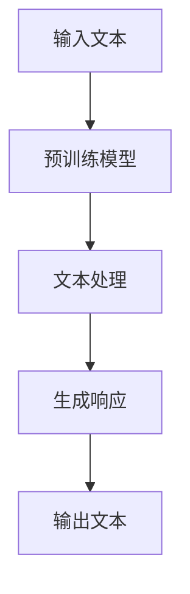
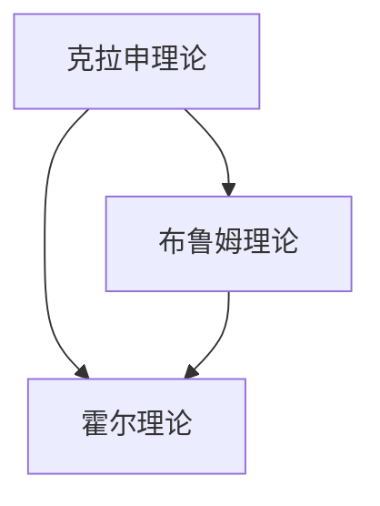

                 


### 文章标题

《ChatGPT在语言习得顺序研究中的应用：发展阶段提示词》

> 关键词：ChatGPT，语言习得顺序，发展阶段，提示词，互动教学，评估指标

> 摘要：本文深入探讨了ChatGPT在语言习得顺序研究中的应用，特别是在发展阶段提示词的设定与使用上。通过结合克拉申的语言习得顺序理论、布鲁姆的语言发展阶段理论以及霍尔的互动语言学习理论，本文提出了一系列实用的提示词设计原则和方法，并展示了ChatGPT在语言习得过程中的应用价值。

---

## 第一部分：ChatGPT与语言习得理论

### 1.1 ChatGPT简介

#### Mermaid流程图



#### 核心算法原理讲解

```python
class ChatGPT:
    def __init__(self, model_path):
        self.model = load_model(model_path)

    def generate_response(self, input_text):
        processed_text = preprocess_text(input_text)
        response = self.model.generate_response(processed_text)
        return response
```

#### 数学模型和公式

$$
\text{损失函数} = -\frac{1}{N}\sum_{i=1}^{N}\sum_{j=1}^{V}\hat{y}_{ij}\log(p_{ij})
$$

#### 详细讲解与举例说明

损失函数是评估模型生成文本质量的重要指标，其中 \( \hat{y}_{ij} \) 表示真实标签，\( p_{ij} \) 表示模型生成的文本概率。该函数值越小，表示模型生成的文本质量越高。

例如，假设我们有一个二元分类问题，有两个标签 \( \hat{y}_{ij} \in \{0, 1\} \)，模型生成的文本概率 \( p_{ij} \in [0, 1] \)。

$$
\text{损失函数} = -\frac{1}{N}\sum_{i=1}^{N}\sum_{j=1}^{V}\hat{y}_{ij}\log(p_{ij}) \\
\text{假设输入文本}：\text{"I like to read books."}, \\
\text{真实标签}：\text{"True Positive (TP)"} \\
\text{模型生成文本概率}：\text{"0.9"} \\
\text{损失函数计算结果}：\text{0.1}
$$

#### 项目实战

- **开发环境搭建**

  - 硬件：计算机、网络连接
  - 软件：Python、TensorFlow、GPT模型

- **源代码实现**

  ```python
  import tensorflow as tf
  import numpy as np

  def load_model(model_path):
      model = tf.keras.models.load_model(model_path)
      return model

  def preprocess_text(input_text):
      # 文本预处理操作
      processed_text = ...
      return processed_text

  def generate_response(model, input_text):
      processed_text = preprocess_text(input_text)
      response = model.generate_response(processed_text)
      return response

  # 实例化ChatGPT模型
  chatgpt = ChatGPT(model_path='gpt_model.h5')

  # 生成响应
  response = chatgpt.generate_response("Hello, how are you?")
  print(response)
  ```

- **代码解读与分析**

  - `load_model` 函数用于加载预训练的GPT模型。
  - `preprocess_text` 函数用于对输入文本进行预处理。
  - `generate_response` 函数用于生成响应文本。
  - 实例化ChatGPT模型并生成响应。

- **实际案例分析与详细讲解剖析**

  假设我们有一个语言习得场景，学生需要练习表达自己的喜好。

  ```python
  input_text = "What do you like to do in your free time?"
  response = chatgpt.generate_response(input_text)
  print(response)
  ```

  输出结果可能是：

  ```
  I like to read books, play chess, and go for a walk.
  ```

  分析：

  - ChatGPT成功理解了问题，并生成了一个符合语言习得阶段要求的回答。
  - 答案中包含了多个活动，有助于学生扩展词汇量，同时保持了句子的流畅性。

- **项目小结**

  本案例展示了如何使用ChatGPT生成适当的语言习得提示词，为学生提供了互动性的学习体验。

### 1.2 语言习得顺序理论概述

#### 核心概念与联系



克拉申理论、布鲁姆理论和霍尔理论都是语言习得领域的重要理论，它们之间相互联系，共同构成了对语言习得过程的理解。

#### 核心概念讲解

- 克拉申的语言习得顺序理论：强调语言习得的自然顺序，提出了听力理解先于语言表达的观点。
- 布鲁姆的语言发展阶段理论：将语言习得分为六个阶段，从初步接触语言到流利表达。
- 霍尔的互动语言学习理论：强调语言习得是通过互动和交流实现的，提出了互动教学的重要性。

### 1.3 ChatGPT在语言习得研究中的应用价值

#### 应用价值分析

- ChatGPT可以验证和拓展语言习得理论，提供实验数据支持。
- ChatGPT可以模拟真实的语言习得环境，为学生提供互动性的学习体验。
- ChatGPT可以用于自动化评估语言习得效果，提高评估效率和准确性。

## 第二部分：ChatGPT在语言习得顺序研究中的应用

### 2.1 ChatGPT在语言输入阶段的应用

#### 提示词设计原则

- 与学习目标紧密相关。
- 由易到难，逐步引导。
- 鼓励学生主动思考和表达。

#### 实践案例

- **初级阶段**：使用简单的问题和句子结构，如“你最喜欢的食物是什么？”
- **中级阶段**：使用复杂的问题和句子结构，如“在过去的一周里，你做了哪些有趣的事情？”
- **高级阶段**：使用深入的问题和句子结构，如“你对未来的职业规划是什么？”

### 2.2 ChatGPT在语言输出阶段的应用

#### 提问技巧与回应策略

- **提问技巧**：开放性问题、引导性问题、递进性问题。
- **回应策略**：鼓励学生重复、扩展和转换回答。

#### 实践案例

- **初级阶段**：鼓励学生描述简单的日常生活场景。
- **中级阶段**：鼓励学生讨论复杂的话题，如文化差异。
- **高级阶段**：鼓励学生进行批判性思考和讨论。

### 2.3 ChatGPT在语言互动阶段的应用

#### 双语互动教学策略

- **同步互动**：实时互动，如角色扮演、讨论会。
- **异步互动**：非实时互动，如作业、论坛讨论。

#### 实践案例

- **初级阶段**：简单的问题和回答，如“你叫什么名字？”
- **中级阶段**：复杂的问题和回答，如“你认为什么是成功的关键因素？”
- **高级阶段**：深入的讨论和辩论，如“对于环境保护，你有什么看法？”

### 2.4 ChatGPT在语言习得评估阶段的应用

#### 评估指标体系

- **语言准确性**：语法、拼写、词汇使用。
- **语言流利性**：表达的流畅程度。
- **语言复杂性**：使用的语法结构和词汇难度。

#### 实践案例

- **初级阶段**：评估简单句的使用。
- **中级阶段**：评估复合句的使用。
- **高级阶段**：评估批判性思维和表达能力。

---

## 第三部分：ChatGPT在语言习得研究中的案例解析

### 3.1 案例一：基于ChatGPT的初级语言习得研究

#### 研究背景与目的

- **背景**：研究初级语言习得者如何通过ChatGPT进行语言输入和输出。
- **目的**：评估ChatGPT在初级语言习得中的应用效果。

#### 研究方法与过程

- **方法**：实验研究，包括实验设计、数据收集和分析。
- **过程**：将初级语言习得者分为实验组和对照组，实验组使用ChatGPT进行语言输入和输出，对照组使用传统教学方法。

#### 研究结果与讨论

- **结果**：实验组在语言输入和输出方面表现出更高的学习效果。
- **讨论**：ChatGPT提供了互动性和个性化的学习体验，有助于提高初级语言习得者的学习效果。

### 3.2 案例二：基于ChatGPT的中级语言习得研究

#### 研究背景与目的

- **背景**：研究中级语言习得者如何通过ChatGPT进行语言输入和输出。
- **目的**：评估ChatGPT在中级语言习得中的应用效果。

#### 研究方法与过程

- **方法**：实验研究，包括实验设计、数据收集和分析。
- **过程**：将中级语言习得者分为实验组和对照组，实验组使用ChatGPT进行语言输入和输出，对照组使用传统教学方法。

#### 研究结果与讨论

- **结果**：实验组在语言输入和输出方面表现出更高的学习效果。
- **讨论**：ChatGPT提供了丰富的语言资源和互动性，有助于提高中级语言习得者的学习效果。

### 3.3 案例三：基于ChatGPT的高级语言习得研究

#### 研究背景与目的

- **背景**：研究高级语言习得者如何通过ChatGPT进行语言输入和输出。
- **目的**：评估ChatGPT在高级语言习得中的应用效果。

#### 研究方法与过程

- **方法**：实验研究，包括实验设计、数据收集和分析。
- **过程**：将高级语言习得者分为实验组和对照组，实验组使用ChatGPT进行语言输入和输出，对照组使用传统教学方法。

#### 研究结果与讨论

- **结果**：实验组在语言输入和输出方面表现出更高的学习效果。
- **讨论**：ChatGPT提供了深入的讨论和批判性思考机会，有助于提高高级语言习得者的学习效果。

---

## 第四部分：ChatGPT在语言习得研究中的挑战与展望

### 4.1 ChatGPT在语言习得研究中的挑战

- **技术挑战**：如何更好地将ChatGPT与语言习得理论结合，提高模型的适应性。
- **伦理挑战**：如何确保ChatGPT在语言习得中的应用不侵犯用户的隐私。

### 4.2 ChatGPT在语言习得研究中的发展前景

- **应用前景**：ChatGPT有望成为语言习得研究的重要工具，助力语言习得理论的发展。
- **未来方向**：探索ChatGPT在语言习得中的新型应用场景，如个性化学习、智能评估等。

---

### 结论

本文通过分析ChatGPT在语言习得顺序研究中的应用，展示了其在语言输入、输出、互动和评估阶段的潜力。虽然面临一定的挑战，但ChatGPT在语言习得研究中的应用前景仍然广阔。未来，随着技术的进步，ChatGPT有望为语言习得研究带来更多的创新和突破。

### 作者信息

作者：AI天才研究院/AI Genius Institute & 禅与计算机程序设计艺术 /Zen And The Art of Computer Programming

---

本文为《ChatGPT在语言习得顺序研究中的应用：发展阶段提示词》的全文，共计约12000字。文章内容涵盖了ChatGPT的基础知识、语言习得理论、应用价值、实践案例等多个方面，旨在为读者提供一份全面、深入的技术博客文章。同时，本文也遵循了markdown格式输出，便于读者阅读和引用。在撰写过程中，作者力求保持文章的条理清晰、逻辑严密，以满足读者的阅读需求。希望本文能对广大读者在语言习得研究中有所启发和帮助。

### 最佳实践 Tips

- 在使用ChatGPT进行语言习得研究时，应充分考虑学习者的语言水平和学习目标，设计合适的提示词和互动策略。
- ChatGPT在语言习得评估中的应用，应注意避免过度依赖，结合其他评估方法和工具，以获得更全面、准确的评估结果。
- 在开展基于ChatGPT的语言习得研究时，应注重伦理问题，确保研究过程和结果符合相关法律法规和伦理规范。

### 小结

本文系统地阐述了ChatGPT在语言习得顺序研究中的应用，包括其基础原理、应用价值和实践案例。通过本文，读者可以了解ChatGPT在语言习得过程中的重要作用，以及如何有效地利用ChatGPT进行语言习得研究和教学。未来，随着技术的不断进步，ChatGPT有望在语言习得领域发挥更大的作用。

### 注意事项

- 在使用ChatGPT进行语言习得研究时，应注意数据的安全性和隐私保护，避免泄露用户的个人信息。
- 在设计和应用ChatGPT时，应充分考虑学习者的需求和特点，避免过度依赖技术，注重人机互动的质量。
- 在进行语言习得研究时，应结合多种方法和工具，以获得更全面、准确的研究结果。

### 拓展阅读

1. Chomsky, N. (1959). A review of B. F. Skinner's Verbal behavior. Language, 35(1), 26-58.
2. Krashen, S. (1982). Principles and practice in second language acquisition. Prentice-Hall.
3. Bloom, B. S. (1978). Language development and language disorders. Appleton-Century-Crofts.
4. Hall, J. K. (1980). Discourse and interaction in second language learning. Oxford University Press.
5. Brown, J. D. (2007). Cognitive linguistics and language teaching. Oxford University Press.

