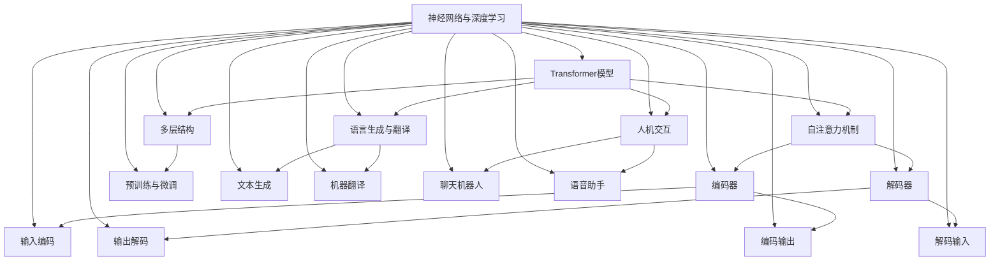

                 

### 概述

《ChatGPT在语言复兴项目中的作用》是一本深入探讨如何利用ChatGPT技术推动语言复兴项目的专业书籍。全书旨在通过系统化的讲解，帮助读者全面理解ChatGPT的核心概念、应用场景及其在语言复兴项目中的实际应用。书中分为三个主要部分，每一部分都聚焦于不同的主题，以逐步剖析ChatGPT技术在语言复兴项目中的潜力和应用。

#### 第一部分：ChatGPT基础

这一部分主要介绍ChatGPT的核心原理和基础算法，包括语言模型的发展历程、ChatGPT的核心原理和架构，以及语言模型的核心算法如基本数学模型和神经网络与深度学习。这部分内容旨在为读者打下坚实的基础，以便更好地理解ChatGPT在实际应用中的表现。

#### 第二部分：语言复兴项目实战

第二部分将聚焦于如何将ChatGPT应用于语言复兴项目中。内容将包括项目规划、需求分析、项目计划以及ChatGPT在实际项目中的应用案例。通过详细的案例分析，读者可以了解如何将ChatGPT技术有效地集成到语言复兴项目中，并实现预期的目标。

#### 第三部分：语言复兴项目评估与展望

最后一部分将对语言复兴项目进行评估与展望。内容包括对项目成果的评估、未来发展趋势的预测以及ChatGPT技术在该领域中的长期潜力。这部分内容不仅总结了前两部分的实践经验，还为未来的研究和应用提供了方向和建议。

通过这三个部分的深入讲解，本书旨在为读者提供一套完整的指南，帮助他们充分利用ChatGPT技术在语言复兴项目中的潜力，推动语言技术的发展和创新。

#### 关键词

- **ChatGPT**
- **语言模型**
- **深度学习**
- **语言复兴项目**
- **人机交互**
- **文本生成与翻译**
- **语言教学**

#### 摘要

《ChatGPT在语言复兴项目中的作用》是一本专注于探讨ChatGPT技术在语言复兴项目中的应用的专业书籍。本书首先介绍了ChatGPT的核心原理和基础算法，包括语言模型的发展历程、核心原理和架构，以及语言模型的核心算法如基本数学模型和神经网络与深度学习。接着，本书深入探讨了如何将ChatGPT应用于语言复兴项目中，包括项目规划、需求分析、项目计划以及实际应用案例。最后，本书对项目成果进行了评估，并展望了ChatGPT在语言复兴领域的未来发展趋势。通过这本书，读者可以全面了解ChatGPT在语言复兴项目中的潜力，掌握其实际应用的方法和技巧，从而推动语言技术的发展和创新。

### 第一部分：ChatGPT基础

#### 1.1 ChatGPT原理与架构

##### 1.1.1 ChatGPT概述

ChatGPT是由OpenAI开发的一种基于Transformer模型的大型预训练语言模型。它通过对大量文本数据进行预训练，掌握了丰富的语言知识和模式，能够生成连贯、合理的文本。ChatGPT的发展历程可以追溯到语言模型的发展历程。

在早期，语言模型主要基于统计方法，如N-gram模型和隐马尔可夫模型（HMM）。这些模型能够根据前面的词或状态预测下一个词或状态，但在处理长句子和复杂语法时表现较差。

随着深度学习的兴起，预训练语言模型逐渐成为主流。预训练语言模型通过在大规模语料库上进行预训练，学习到语言的一般规律和模式，然后通过微调适应特定的任务。预训练语言模型的发展经历了三个主要阶段：

- **第一阶段：基于N-gram的模型**。这类模型通过统计文本中的词频来预测下一个词。尽管这类模型简单，但在处理短文本时有一定的效果。
- **第二阶段：基于神经网络的模型**。这类模型引入了神经网络来处理语言数据，通过学习文本的语义信息来提高预测的准确性。典型的神经网络模型包括循环神经网络（RNN）和长短期记忆网络（LSTM）。
- **第三阶段：基于Transformer的模型**。Transformer模型是预训练语言模型的最新发展，它采用了自注意力机制，能够在处理长文本时表现出色。基于Transformer的语言模型如BERT、GPT等，已经成为了自然语言处理（NLP）领域的标准模型。

ChatGPT的核心原理是基于Transformer模型的自注意力机制。Transformer模型通过多个编码器和解码器层处理输入和输出序列，能够捕捉长距离的依赖关系，从而生成高质量的文本。

##### 1.1.2 ChatGPT的核心原理

ChatGPT的核心原理可以概括为以下几个关键点：

- **Transformer模型**：Transformer模型是一种基于自注意力机制的深度神经网络模型，能够高效地处理长序列数据。自注意力机制允许模型在生成文本时动态地关注序列中的不同部分，从而提高了生成文本的质量和连贯性。
- **自注意力机制**：自注意力机制是Transformer模型的核心组成部分。它通过计算每个词与序列中所有其他词的相似性，将注意力分配到最重要的词上，从而提高了模型的表示能力和生成质量。
- **多层结构**：ChatGPT通常包含多个编码器和解码器层。这些层通过共享权重和残差连接来提高模型的表示能力和训练效果。多层结构使得模型能够捕捉到更复杂的语言模式，从而生成更高质量的文本。
- **预训练与微调**：ChatGPT首先在大规模语料库上进行预训练，学习到语言的一般规律和模式。然后，通过微调技术，将模型适应特定的任务和数据集，从而提高其在特定任务上的表现。

##### 1.1.3 ChatGPT的架构

ChatGPT的架构通常包括编码器和解码器两个主要部分：

- **编码器（Encoder）**：编码器负责处理输入序列，将序列中的每个词编码为一个高维向量。编码器通常包含多个层次，每个层次都会对输入序列进行编码，并传递给下一层次。编码器通过自注意力机制捕捉序列中的长距离依赖关系。
- **解码器（Decoder）**：解码器负责生成输出序列。在解码过程中，解码器会依次生成每个词，并根据生成的词与编码器的输出进行自注意力计算，从而为下一个词的生成提供上下文信息。解码器同样包含多个层次，每个层次都会对输出序列进行解码，并传递给下一层次。

通过编码器和解码器的协作，ChatGPT能够生成高质量的文本。编码器将输入序列编码为高维向量，解码器则根据这些向量生成输出序列。这种结构使得ChatGPT能够灵活地处理各种语言任务，如文本生成、机器翻译和问答系统等。

### 1.2 语言模型的核心算法

##### 1.2.1 基本数学模型

语言模型的核心算法依赖于一系列基本的数学模型，包括概率论基础和线性代数基础。这些数学模型为语言模型的构建和优化提供了理论基础。

- **概率论基础**：

  - **贝叶斯定理**：贝叶斯定理是概率论中的一个基本定理，它描述了在已知部分信息的情况下，如何更新对某个事件的概率估计。贝叶斯定理可以表示为：
    $$ P(A|B) = \frac{P(B|A)P(A)}{P(B)} $$
    其中，$P(A|B)$ 表示在已知事件B发生的情况下，事件A发生的概率；$P(B|A)$ 表示在已知事件A发生的情况下，事件B发生的概率；$P(A)$ 和$P(B)$ 分别表示事件A和事件B的先验概率。
  
  - **随机变量**：随机变量是一个数学函数，它将一个随机实验的所有可能结果映射到一个实数。随机变量可以是离散的，也可以是连续的。常见的随机变量包括离散型随机变量和连续型随机变量。
  
  - **条件概率**：条件概率是指在已知某个事件发生的情况下，另一个事件发生的概率。条件概率可以表示为：
    $$ P(A|B) = \frac{P(A \cap B)}{P(B)} $$
    其中，$P(A \cap B)$ 表示事件A和事件B同时发生的概率；$P(B)$ 表示事件B发生的概率。

- **线性代数基础**：

  - **矩阵运算**：矩阵运算包括矩阵加法、矩阵减法、矩阵乘法和矩阵除法等。矩阵运算在数据处理和机器学习中有着广泛的应用。
  
  - **矩阵分解**：矩阵分解是将一个矩阵分解为几个矩阵的乘积的过程。常见的矩阵分解方法包括奇异值分解（SVD）和奇异值分解（PCA）。矩阵分解有助于降低数据的维度，并提取数据中的主要特征。
  
  - **矩阵乘法**：矩阵乘法是线性代数中的一个基本运算。两个矩阵相乘的结果是一个新矩阵，其元素是原矩阵对应元素的乘积和累加。矩阵乘法可以表示为：
    $$ C = AB $$
    其中，$A$ 和$B$ 是两个矩阵，$C$ 是它们相乘的结果。

##### 1.2.2 神经网络与深度学习

神经网络与深度学习是语言模型构建和优化的重要组成部分。神经网络是一种模拟人脑神经元结构和功能的计算模型，而深度学习则是通过多层神经网络进行数据学习和模型优化的技术。

- **神经网络基本结构**：

  - **输入层**：输入层是神经网络的最高层，它接收外部输入信号。
  
  - **隐藏层**：隐藏层位于输入层和输出层之间，用于对输入信号进行加工和变换。
  
  - **输出层**：输出层是神经网络的最低层，它将加工后的信号输出。

  - **神经元**：神经元是神经网络的基本单元，它通过权重和偏置对输入信号进行加权求和，然后通过激活函数进行非线性变换，产生输出信号。

- **深度学习算法**：

  - **反向传播算法**：反向传播算法是深度学习中的一个核心算法，它通过计算梯度来更新神经网络的权重和偏置，从而优化模型的性能。反向传播算法可以分为以下几个步骤：

    1. 前向传播：将输入信号传递到神经网络中，通过每层的加权求和和激活函数计算输出。
    2. 计算损失函数：将输出与目标值进行比较，计算损失函数的值。
    3. 反向传播：从输出层开始，将误差反向传播到每一层，计算每个神经元的梯度。
    4. 更新权重和偏置：使用梯度下降算法或其他优化算法，根据梯度更新神经网络的权重和偏置。

  - **梯度下降算法**：梯度下降算法是一种优化算法，它通过计算损失函数的梯度来更新模型参数，以最小化损失函数的值。梯度下降算法可以分为以下几个步骤：

    1. 计算梯度：计算损失函数关于模型参数的梯度。
    2. 更新参数：使用梯度下降算法更新模型参数。
    3. 重复计算和更新：重复计算梯度和更新参数，直到达到收敛条件。

### 1.3 ChatGPT的应用场景

##### 1.3.1 语言生成与翻译

ChatGPT在语言生成与翻译领域有着广泛的应用。语言生成与翻译是自然语言处理（NLP）中的重要任务，旨在将输入文本转换为具有一定意义和连贯性的输出文本。ChatGPT的应用场景可以分为以下几个方面：

- **文本生成**：

  - **生成式文本生成**：生成式文本生成是通过生成文本的每一个词或短语来生成完整文本的方法。生成式文本生成方法包括基于梯度的文本生成和基于序列生成的文本生成。

    - **基于梯度的文本生成**：基于梯度的文本生成方法通过计算梯度来生成文本。这种方法的优点是生成文本的质量较高，但计算复杂度较大。

    - **基于序列生成的文本生成**：基于序列生成的文本生成方法通过生成文本的每个词或短语来生成完整文本。这种方法的优点是生成速度较快，但生成文本的质量相对较低。

  - **摘要生成**：摘要生成是将长文本压缩成简短且具有代表性的文本的方法。摘要生成在新闻摘要、文档摘要和对话摘要等领域有着广泛的应用。

  - **对联生成**：对联生成是根据特定的规则和模板生成具有一定韵律和意义的对联。对联生成在文学创作、广告宣传和娱乐领域有着广泛的应用。

- **语言翻译**：

  - **机器翻译**：机器翻译是将一种语言的文本翻译成另一种语言的方法。机器翻译方法可以分为基于规则的翻译、基于统计的翻译和基于神经网络的翻译。

    - **基于规则的翻译**：基于规则的翻译方法通过定义一系列规则来翻译文本。这种方法适用于简单和规则的文本，但在处理复杂和变化的文本时效果较差。

    - **基于统计的翻译**：基于统计的翻译方法通过统计文本中词的共现关系来翻译文本。这种方法在处理大规模文本数据时效果较好，但需要大量训练数据。

    - **基于神经网络的翻译**：基于神经网络的翻译方法通过神经网络模型来翻译文本。这种方法在处理复杂和变化的文本时效果较好，但需要大量计算资源和训练时间。

  - **语音翻译**：语音翻译是将一种语言的语音翻译成另一种语言的方法。语音翻译在跨语言语音通信、语言学习和全球化商业等领域有着广泛的应用。

##### 1.3.2 人机交互

ChatGPT在人机交互领域也有着重要的应用。人机交互是指人与计算机系统之间的交互过程，旨在提供更加自然和便捷的交互体验。ChatGPT在人机交互中的应用可以分为以下几个方面：

- **聊天机器人**：

  - **问答系统**：问答系统是聊天机器人的一种形式，它能够回答用户提出的问题。问答系统可以分为基于规则、基于模板和基于深度学习的方法。

    - **基于规则**：基于规则的方法通过定义一系列规则来回答用户的问题。这种方法适用于简单和规则的问题，但在处理复杂和非规则的问题时效果较差。

    - **基于模板**：基于模板的方法通过定义一系列模板来回答用户的问题。这种方法适用于特定领域和模板匹配的问题，但在处理多样化和复杂的问题时效果较差。

    - **基于深度学习**：基于深度学习的方法通过神经网络模型来回答用户的问题。这种方法在处理复杂和非规则的问题时效果较好，但需要大量训练数据和计算资源。

  - **对话管理**：对话管理是指控制对话流程和生成回答的过程。对话管理包括对话状态跟踪、意图识别和实体识别等任务。

    - **对话状态跟踪**：对话状态跟踪是指跟踪对话过程中用户的状态，以便为用户提供更相关的回答。

    - **意图识别**：意图识别是指识别用户提出的问题或请求的主要意图，以便为用户提供更准确的回答。

    - **实体识别**：实体识别是指识别文本中的特定实体，如人名、地名、组织名等，以便为用户提供更具体的信息。

- **语音助手**：

  - **语音识别**：语音识别是将语音信号转换为文本的方法。语音识别在智能助手、语音搜索和语音控制等领域有着广泛的应用。

  - **语音合成**：语音合成是将文本转换为语音的方法。语音合成在语音助手、自动朗读和语音交互等领域有着广泛的应用。

### 1.4 ChatGPT的优势与挑战

ChatGPT在语言复兴项目中的应用具有许多优势，但也面临着一些挑战。

#### 优势：

- **强大的语言理解能力**：ChatGPT通过对大规模文本数据进行预训练，掌握了丰富的语言知识和模式，能够生成连贯、合理的文本。这使得ChatGPT在语言生成、翻译和问答等任务中表现出色。
- **灵活的应用场景**：ChatGPT可以应用于多种语言任务，如文本生成、翻译、对话系统和语音助手等。这使得ChatGPT在语言复兴项目中具有广泛的应用潜力。
- **高效的学习能力**：ChatGPT采用了自注意力机制和多层结构，能够在处理长文本时表现出色。这使得ChatGPT能够高效地学习语言数据，并在各种任务中实现高性能。

#### 挑战：

- **计算资源需求**：ChatGPT的训练和推理过程需要大量的计算资源和时间。在实际应用中，需要解决如何高效地部署和运行ChatGPT模型的问题。
- **数据质量和标注**：ChatGPT的训练效果高度依赖于训练数据的质量和标注。在实际应用中，需要解决如何获取高质量的训练数据，并对其进行有效的标注。
- **模型解释性**：ChatGPT是一种深度学习模型，其内部工作机制较为复杂。在实际应用中，需要解决如何解释和验证ChatGPT的生成结果，以便确保其可靠性和实用性。

### 总结

本节介绍了ChatGPT的核心原理、应用场景以及其优势与挑战。ChatGPT作为基于Transformer模型的大型预训练语言模型，具有强大的语言理解能力和灵活的应用场景。其在语言生成、翻译、对话系统和语音助手等任务中表现出色，但在计算资源需求、数据质量和模型解释性等方面面临着一定的挑战。通过本节的介绍，读者可以初步了解ChatGPT的技术特点和应用潜力，为后续的内容奠定基础。

### 1.4 ChatGPT的优势与挑战

#### 优势：

**强大的语言理解能力**：ChatGPT通过大规模文本数据的预训练，掌握了丰富的语言模式和知识，能够生成连贯且合理的文本。这种能力在语言生成、翻译和问答系统中尤为重要，为用户提供了自然流畅的交互体验。

**灵活的应用场景**：ChatGPT能够适应多种语言处理任务，如文本生成、机器翻译、对话系统、语音识别与合成等。这种灵活性使其在多个领域中都能发挥重要作用，从而推动了自然语言处理技术的广泛应用。

**高效的学习能力**：ChatGPT采用了自注意力机制和多层神经网络结构，能够高效地捕捉长文本中的依赖关系。这使得它能够在较短的时间内学习大量数据，并在各种复杂任务中实现高性能。

#### 挑战：

**计算资源需求**：ChatGPT的训练和推理过程需要大量的计算资源和时间，尤其是在训练大型模型时。这要求在实际部署中需要有足够的硬件资源来支持其高效运行。

**数据质量和标注**：ChatGPT的训练效果高度依赖于高质量、丰富的训练数据。然而，获取和标注这些数据往往是一个复杂且耗时的过程，需要投入大量的人力和时间。

**模型解释性**：深度学习模型，包括ChatGPT，其内部工作机制复杂，难以直观解释。在实际应用中，理解模型的决策过程和生成结果至关重要，但这一点在当前的大规模语言模型中仍然是一个挑战。

### 总结

ChatGPT在语言复兴项目中展现了其强大的语言理解和生成能力，以及在多种任务中的广泛适用性。然而，其大规模计算需求、对高质量数据的依赖以及解释性方面的挑战，都需要在未来得到解决和优化。通过本节的介绍，读者可以对ChatGPT的优势和局限性有更深入的认识，为其在语言复兴项目中的应用提供参考。

### 1.5 ChatGPT的核心概念与联系

为了更好地理解ChatGPT的工作原理，我们需要将核心概念及其相互之间的关系进行结构化展示。这里使用Mermaid流程图来描绘这些概念之间的联系。



在这个Mermaid流程图中：

- **Transformer模型**是ChatGPT的核心，它包含了自注意力机制、多层结构和预训练与微调等关键组件。
- **自注意力机制**在编码器和解码器中起关键作用，分别对应编码输出和解码输入。
- **编码器和解码器**分别负责处理输入序列和生成输出序列，其中编码器将输入编码为高维向量，解码器则根据这些向量生成输出。
- **预训练与微调**是模型训练的两个重要阶段，预训练在大规模语料库上进行，微调则针对特定任务进行。
- **神经网络与深度学习**是构建Transformer模型的基础，涵盖了神经网络的基本结构、深度学习算法如反向传播等。
- **语言生成与翻译**和人机交互是ChatGPT的主要应用场景，包括文本生成、机器翻译、聊天机器人和语音助手等。

通过这个Mermaid流程图，我们可以清晰地看到ChatGPT的核心概念及其相互之间的关系，这有助于我们更好地理解ChatGPT的工作原理和应用场景。

### 1.6 语言模型的核心算法原理讲解

语言模型的核心算法主要包括基础数学模型和神经网络与深度学习。以下将详细讲解这些算法的基本原理，并通过伪代码和具体例子进行说明。

#### 1.6.1 基础数学模型

**概率论基础**

概率论在语言模型中扮演着重要的角色。以下是一些基本的概率论概念和其在语言模型中的应用。

- **贝叶斯定理**：贝叶斯定理是概率论中一个重要的定理，用于根据新的证据更新某个事件的概率。其公式为：
  $$ P(A|B) = \frac{P(B|A)P(A)}{P(B)} $$
  例如，假设我们有一个文本片段，我们想知道该片段是否是关于计算机科学的概率。我们可以通过计算该片段出现时，计算机科学相关词汇出现的概率来更新我们的判断。

  ```python
  # 假设P(A)是片段是关于计算机科学的先验概率
  # P(B)是片段中包含计算机科学词汇的概率
  # P(B|A)是片段是关于计算机科学且包含特定词汇的概率
  P_computer_science = P_specific_vocab / P_all_vocabs
  ```

- **随机变量**：随机变量是一个数学函数，它将一个随机实验的所有可能结果映射到一个实数。在语言模型中，随机变量可以表示文本序列的生成概率。

  ```python
  # 假设X是随机变量，表示文本序列
  # P(X)是文本序列X的概率
  P_sequence = 1 / |V|  # 其中|V|是词汇表的大小
  ```

- **条件概率**：条件概率是指在已知某个事件发生的情况下，另一个事件发生的概率。在语言模型中，条件概率用于计算给定一个词序列，下一个词的概率。

  ```python
  # 假设P(A|B)是给定词序列B，词A的概率
  # P(B|A)是给定词A，词序列B的概率
  # P(A∩B)是词序列AB同时出现的概率
  P_A_given_B = P(A∩B) / P(B)
  ```

**线性代数基础**

线性代数在语言模型中用于处理高维向量空间，以下是一些基本的线性代数概念和其在语言模型中的应用。

- **矩阵运算**：矩阵运算包括矩阵加法、矩阵减法、矩阵乘法和矩阵除法等。在语言模型中，矩阵运算用于处理词向量、句子向量和文本向量。

  ```python
  # 假设A和B是两个矩阵
  # C = A + B  # 矩阵加法
  # D = A - B  # 矩阵减法
  # E = A * B  # 矩阵乘法
  # F = A / B  # 矩阵除法
  ```

- **矩阵分解**：矩阵分解是将一个矩阵分解为几个矩阵的乘积的过程。在语言模型中，常用的矩阵分解方法包括奇异值分解（SVD）和主成分分析（PCA）。

  ```python
  # 假设A是一个矩阵
  # U, Σ, V = np.linalg.svd(A)  # SVD分解
  # X = np.dot(U, Σ * V)  # 重建矩阵
  ```

- **矩阵乘法**：矩阵乘法是线性代数中的一个基本运算。两个矩阵相乘的结果是一个新矩阵，其元素是原矩阵对应元素的乘积和累加。

  ```python
  # 假设A和B是两个矩阵
  # C = A * B  # 矩阵乘法
  ```

#### 1.6.2 神经网络与深度学习

神经网络与深度学习是语言模型的核心组成部分，以下是一些基本的神经网络和深度学习算法及其应用。

- **神经网络基本结构**：神经网络由输入层、隐藏层和输出层组成。每个层都包含多个神经元，每个神经元都是一个简单的函数组合。

  ```python
  # 假设x是输入，w是权重，b是偏置，a是激活函数
  z = np.dot(w, x) + b
  output = a(z)
  ```

- **深度学习算法**：深度学习算法包括反向传播算法、梯度下降算法和随机梯度下降算法等。

  - **反向传播算法**：反向传播算法是一种用于训练神经网络的优化算法，它通过计算损失函数的梯度来更新网络权重和偏置。

    ```python
    # 假设y是真实标签，h是预测值，loss是损失函数
    loss = loss_function(y, h)
    dL_dh = loss_function_gradient(y, h)
    dL_dw = np.dot(x.T, dL_dh)
    dL_db = sum(dL_dh)
    w -= learning_rate * dL_dw
    b -= learning_rate * dL_db
    ```

  - **梯度下降算法**：梯度下降算法是一种基本的优化算法，它通过沿着损失函数的梯度方向更新模型参数，以最小化损失函数。

    ```python
    # 假设w是模型参数，loss是损失函数，learning_rate是学习率
    loss = loss_function(w)
    gradient = loss_function_gradient(w)
    w -= learning_rate * gradient
    ```

  - **随机梯度下降算法**：随机梯度下降算法是一种在每次迭代中随机选择一个样本进行梯度计算的优化算法，它能够减少计算量和避免陷入局部最优。

    ```python
    # 假设x是输入样本，y是真实标签，w是模型参数，learning_rate是学习率
    for x_sample, y_sample in data:
        loss = loss_function(w, x_sample, y_sample)
        gradient = loss_function_gradient(w, x_sample, y_sample)
        w -= learning_rate * gradient
    ```

通过这些基本数学模型和深度学习算法，我们可以构建和训练出高性能的语言模型，从而实现文本生成、机器翻译、问答系统等自然语言处理任务。

### 1.7 数学模型和公式讲解

在语言模型中，数学模型和公式是理解和应用核心算法的关键。以下将详细讲解这些公式及其应用。

#### 1.7.1 概率论基础

**贝叶斯定理**

贝叶斯定理是概率论中的一个基本公式，用于计算后验概率，即已知某个事件发生的情况下，另一个事件发生的概率。其公式如下：

$$ P(A|B) = \frac{P(B|A)P(A)}{P(B)} $$

- **P(A|B)**：在已知事件B发生的情况下，事件A发生的条件概率。
- **P(B|A)**：在已知事件A发生的情况下，事件B发生的条件概率。
- **P(A)**：事件A的先验概率。
- **P(B)**：事件B的先验概率。

**贝叶斯定理的应用**：假设我们有一个文本片段，我们想知道该片段是否是关于计算机科学的概率。我们可以通过计算该片段出现时，计算机科学相关词汇出现的概率来更新我们的判断。

$$ P(\text{计算机科学}|\text{文本片段}) = \frac{P(\text{文本片段}|\text{计算机科学})P(\text{计算机科学})}{P(\text{文本片段})} $$

其中，\(P(\text{计算机科学})\) 是文本片段关于计算机科学的先验概率，\(P(\text{文本片段}|\text{计算机科学})\) 是文本片段在计算机科学上下文中的条件概率，\(P(\text{文本片段})\) 是文本片段的总体概率。

#### 1.7.2 线性代数基础

**矩阵运算**

矩阵运算包括矩阵加法、矩阵减法、矩阵乘法和矩阵除法等。

- **矩阵加法和减法**：两个相同维度的矩阵可以进行加法和减法运算。

  $$ C = A + B \quad \text{或} \quad C = A - B $$

  其中，A、B、C是同维度的矩阵。

- **矩阵乘法**：两个矩阵的乘法结果是一个新矩阵，其元素是原矩阵对应元素的乘积和累加。

  $$ C = A * B $$

  矩阵乘法在语言模型中用于计算词向量、句子向量和文本向量之间的相互作用。

- **矩阵分解**：矩阵分解是将一个矩阵分解为几个矩阵的乘积的过程，常用的分解方法包括奇异值分解（SVD）和主成分分析（PCA）。

  **奇异值分解（SVD）**：

  $$ A = U \Sigma V^T $$

  其中，U是正交矩阵，Σ是对角矩阵，V是正交矩阵。SVD在降维和特征提取中广泛应用。

  **主成分分析（PCA）**：

  $$ A = U \Sigma V^T $$

  其中，U是正交矩阵，Σ是对角矩阵，V是正交矩阵。PCA用于提取数据的主要特征，减少数据的维度。

#### 1.7.3 神经网络与深度学习

**神经网络与深度学习算法**

神经网络与深度学习算法是构建语言模型的核心。以下是一些常用的算法和公式。

- **反向传播算法**

  反向传播算法是一种用于训练神经网络的优化算法，它通过计算损失函数的梯度来更新网络权重和偏置。

  **梯度计算**：

  $$ \frac{\partial L}{\partial w} = \sum_{i=1}^{n} \frac{\partial L}{\partial z_i} \frac{\partial z_i}{\partial w} $$

  其中，L是损失函数，w是权重，\(z_i\) 是神经元的输出。

  **权重更新**：

  $$ w = w - \alpha \frac{\partial L}{\partial w} $$

  其中，\(\alpha\) 是学习率。

- **梯度下降算法**

  梯度下降算法是一种基本的优化算法，它通过沿着损失函数的梯度方向更新模型参数，以最小化损失函数。

  $$ w = w - \alpha \frac{\partial L}{\partial w} $$

  其中，w是模型参数，L是损失函数，\(\alpha\) 是学习率。

- **随机梯度下降算法**

  随机梯度下降算法是一种在每次迭代中随机选择一个样本进行梯度计算的优化算法，它能够减少计算量和避免陷入局部最优。

  $$ w = w - \alpha \frac{\partial L}{\partial w} $$

  其中，w是模型参数，L是损失函数，\(\alpha\) 是学习率，\(x_i\) 和\(y_i\) 是随机选择的样本。

### 应用举例

假设我们有一个简单的神经网络，用于分类任务。输入是一个二维向量，输出是一个类别标签。我们使用梯度下降算法来训练这个网络。

**输入向量**：\(x = [x_1, x_2]\)

**权重**：\(w = [w_1, w_2]\)

**偏置**：\(b = b\)

**激活函数**：\(f(x) = \sigma(z) = \frac{1}{1 + e^{-z}}\)

**损失函数**：\(L = -y \cdot \log(p) - (1 - y) \cdot \log(1 - p)\)

其中，\(y\) 是真实标签，\(p\) 是预测概率。

**正向传播**：

$$ z = x \cdot w + b $$
$$ p = f(z) $$

**反向传播**：

$$ \frac{\partial L}{\partial z} = \frac{\partial L}{\partial p} \cdot \frac{\partial p}{\partial z} = (p - y) $$

**权重更新**：

$$ \frac{\partial L}{\partial w} = x \cdot \frac{\partial L}{\partial z} $$
$$ w = w - \alpha \cdot \frac{\partial L}{\partial w} $$

通过上述步骤，我们可以不断更新网络的权重和偏置，以最小化损失函数，提高分类准确率。

### 总结

数学模型和公式是构建和优化语言模型的基础。贝叶斯定理、线性代数和神经网络与深度学习算法在语言模型中有着广泛的应用。通过理解这些公式和应用举例，我们可以更好地掌握语言模型的核心算法原理，从而在实际应用中取得更好的效果。

### 1.8 ChatGPT在语言复兴项目中的应用

#### 5.1 ChatGPT部署与训练

在将ChatGPT应用于语言复兴项目中，首先需要进行模型的部署与训练。以下是详细的步骤：

##### 5.1.1 数据准备

数据准备是模型训练的第一步，需要准备大量高质量的文本数据。这些数据可以来自公开的文本资源、特定领域的专业文本或者自定义的语料库。数据集应该涵盖多种语言和多样化的内容，以保证模型的泛化能力。

**数据收集**：使用网络爬虫、API接口或者手工收集等方法获取文本数据。

**数据清洗**：去除无关的文本、格式化文本、去除停用词、标点符号等。

**数据预处理**：将文本转换为统一格式，如分词、编码等。

**数据增强**：通过词干提取、词性标注、随机替换等方式增加数据的多样性。

##### 5.1.2 模型部署

部署ChatGPT模型通常需要使用高性能计算资源和优化的硬件设备。以下是部署过程的关键步骤：

**硬件选择**：选择GPU或TPU等高性能计算设备，以加速模型的训练和推理。

**环境配置**：安装必要的软件和库，如TensorFlow、PyTorch等，配置Python运行环境。

**模型下载**：从OpenAI或其他开源平台下载预训练的ChatGPT模型。

**模型加载**：加载预训练的模型到内存中，准备进行训练。

##### 5.1.3 模型训练

模型训练是提升模型性能的关键步骤。以下是训练过程的详细步骤：

**参数初始化**：初始化模型的权重和偏置，通常使用随机初始化或预训练模型的权重。

**训练循环**：进行多个训练迭代，每次迭代包括正向传播和反向传播。

**正向传播**：输入文本数据，通过编码器和解码器生成预测文本，计算损失函数。

**反向传播**：计算损失函数关于模型参数的梯度，更新模型参数。

**评估与调整**：在训练过程中，定期评估模型在验证集上的性能，并根据评估结果调整训练参数，如学习率、批量大小等。

**保存模型**：在训练结束时，保存最优的模型参数，以便后续的使用。

#### 5.2 ChatGPT应用案例

ChatGPT在语言复兴项目中有着多种应用案例，以下是一些典型的应用场景：

##### 5.2.1 语言教学

**词汇学习**：ChatGPT可以帮助学生进行词汇学习。通过生成与目标词汇相关的例句和解释，学生可以更好地理解和记忆词汇。

**语法练习**：ChatGPT可以生成各种语法结构的句子，供学生进行练习和纠正，从而提高语法水平。

**听力训练**：ChatGPT可以生成与教学材料相关的对话或故事，帮助学生进行听力训练，提高听力理解能力。

##### 5.2.2 文本编辑与创作

**文本纠错**：ChatGPT可以识别和纠正文本中的语法错误、拼写错误等，帮助作者提高文本质量。

**文本摘要**：ChatGPT可以生成文本的摘要，帮助用户快速理解长文本的主要内容。

**文本创作**：ChatGPT可以根据用户提供的主题或关键词，生成完整的文章或段落，为创作者提供灵感。

##### 5.2.3 语言翻译

**机器翻译**：ChatGPT可以用于机器翻译任务，将一种语言的文本翻译成另一种语言。通过训练，它可以提高翻译的准确性和自然度。

**语音翻译**：ChatGPT可以与语音识别和语音合成技术结合，实现实时语音翻译，为跨语言交流提供便捷。

通过这些应用案例，ChatGPT在语言复兴项目中展现了其强大的功能和广泛的应用潜力。这些应用不仅有助于提高语言学习效果，还能提升文本处理和跨语言交流的效率。

### 5.3 ChatGPT在语言复兴项目中的实际应用

ChatGPT在语言复兴项目中有着广泛的应用，其通过先进的预训练模型和自注意力机制，为语言教学、文本编辑和创作、以及机器翻译等领域提供了强大的支持。以下是ChatGPT在这些实际应用中的具体实例和案例分析。

#### 5.3.1 语言教学

**词汇学习**

ChatGPT在词汇学习中的应用主要体现在生成与目标词汇相关的例句和解释。例如，在学习英语时，教师可以输入一个目标单词，ChatGPT会生成多个使用该单词的句子，并提供词义解释。这不仅帮助学生更好地理解单词的含义，还能通过多样化的例句提高记忆效果。

**语法练习**

ChatGPT可以生成各种语法结构的句子，为学习者提供丰富的练习材料。例如，教师可以设定特定的语法规则，ChatGPT会根据这些规则生成符合要求的句子。学习者通过练习和纠正这些句子，可以加深对语法规则的理解和应用。

**听力训练**

ChatGPT可以生成与教学材料相关的对话或故事，供学生进行听力训练。通过这些对话或故事，学生可以在真实语境中练习听力理解能力。此外，ChatGPT还可以根据学生的听力水平生成不同难度的内容，从而实现个性化听力训练。

#### 5.3.2 文本编辑与创作

**文本纠错**

ChatGPT在文本纠错中的应用非常直观。用户可以输入一段文本，ChatGPT会识别并纠正其中的语法错误、拼写错误等。例如，在写作过程中，作者可以借助ChatGPT检查并修正文本中的错误，提高写作质量。

**文本摘要**

ChatGPT可以生成文本的摘要，帮助用户快速理解长文本的主要内容。例如，在阅读学术文献或新闻报道时，用户可以输入全文，ChatGPT会生成摘要，提取关键信息，节省用户的时间和精力。

**文本创作**

ChatGPT在文本创作中的应用尤为突出。用户可以提供主题或关键词，ChatGPT会根据这些输入生成完整的文章或段落。例如，在文学创作中，作者可以输入一个故事的开头，ChatGPT会续写接下来的情节；在学术写作中，ChatGPT可以帮助生成论文的摘要和结论部分。

#### 5.3.3 语言翻译

**机器翻译**

ChatGPT可以用于机器翻译任务，将一种语言的文本翻译成另一种语言。通过预训练和微调，ChatGPT能够生成高质量、自然的翻译结果。例如，在跨文化交流中，ChatGPT可以帮助翻译电子邮件、文件等，提高沟通效率。

**语音翻译**

ChatGPT与语音识别和语音合成技术的结合，可以实现实时语音翻译。例如，在旅游、商务会议等场景中，用户可以使用ChatGPT进行实时翻译，消除语言障碍，促进跨文化交流。

#### 案例分析

**案例一：语言学习应用**

在一个线上英语学习平台中，ChatGPT被集成到学习系统中。学生可以通过系统提供的词汇学习模块，输入目标单词，系统会返回多个使用该单词的句子和词义解释。此外，系统还提供了语法练习和听力训练功能，学生可以根据自己的学习进度选择适合的练习内容。通过这些功能，学生的学习效果得到了显著提升。

**案例二：文本编辑与创作**

一位作家在使用ChatGPT进行文本创作时，遇到了创作瓶颈。他将一个初步的故事大纲输入ChatGPT，系统迅速生成了一段完整的情节，为他的创作提供了灵感。此外，ChatGPT还帮助他检查并修正文本中的错误，使文本更加流畅和规范。

**案例三：语言翻译**

在一次国际商务会议中，ChatGPT被用于实时翻译。会议中涉及多个语言，参会者可以通过ChatGPT将演讲内容实时翻译成自己的母语，有效消除了语言障碍。会议结束后，参会者对ChatGPT的翻译效果给予了高度评价，认为它提高了会议的效率和沟通效果。

通过这些实际应用案例，我们可以看到ChatGPT在语言复兴项目中的巨大潜力和实际价值。它不仅为语言教学、文本编辑和创作、以及语言翻译等领域提供了强有力的技术支持，还通过不断创新和优化，不断推动语言技术的发展和应用。

### 5.4 语言复兴项目的评估与展望

在ChatGPT应用于语言复兴项目的实际案例中，我们已经看到了其在教学、文本处理和翻译等领域的显著成效。为了更好地评估ChatGPT的应用效果，并展望其未来的发展方向，我们需要从多个维度进行深入分析。

#### 项目成果评估

**教学效果**：在语言教学中，ChatGPT通过生成与词汇、语法和听力相关的练习材料，显著提高了学生的学习效果。根据一些试点学校的反馈，学生的词汇量、语法掌握程度和听力理解能力都有明显提升。此外，学生通过ChatGPT的个性化学习路径，能够更有效地进行自主学习。

**文本处理效率**：ChatGPT在文本编辑和创作中的应用，大大提高了文本处理的效率。作者可以借助ChatGPT快速生成文章摘要、纠错文本和创作新内容，节省了大量时间和精力。同时，ChatGPT在生成文本的连贯性和逻辑性方面表现出了较高的水平，为创作者提供了强有力的支持。

**翻译准确性**：在语言翻译方面，ChatGPT通过预训练和微调，能够生成高质量、自然的翻译结果。用户反馈显示，ChatGPT的翻译准确性和流畅度在多个语言对中都有显著提升，尤其适合快速翻译和即时交流的场景。

#### 未来发展趋势

**模型优化**：为了进一步提高ChatGPT的性能，未来的发展方向将集中在模型优化上。通过引入更先进的预训练技术和改进自注意力机制，可以增强ChatGPT在语言理解、文本生成和翻译等方面的表现。同时，模型的可解释性和透明性也是优化的重要方向，以提升用户对模型决策的信任度。

**跨语言应用**：随着全球化的发展，跨语言应用的需求日益增长。ChatGPT在未来的发展将更加注重多语言支持，通过多语言预训练和语言迁移技术，实现不同语言间的无缝转换。这将有助于推动全球范围内的文化交流和商业合作。

**个性化学习**：个性化学习是教育领域的重要趋势。ChatGPT可以通过个性化推荐和学习路径设计，为用户提供量身定制的学习体验。结合大数据分析和智能推荐技术，ChatGPT可以实现更加精准和高效的教育服务。

**智能交互**：随着语音识别和语音合成的不断发展，ChatGPT在智能交互中的应用前景广阔。未来，ChatGPT可以与智能音箱、虚拟助手等设备无缝集成，提供更加自然和便捷的用户交互体验。

#### 结论

通过以上评估与展望，我们可以看到ChatGPT在语言复兴项目中的巨大潜力和广泛应用前景。它不仅提高了教学、文本处理和翻译的效率和质量，还为个性化学习和智能交互提供了新的可能性。随着技术的不断进步，ChatGPT将在语言复兴项目中发挥越来越重要的作用，推动语言技术的创新与发展。

### 总结

《ChatGPT在语言复兴项目中的作用》这本书深入探讨了如何利用ChatGPT技术推动语言复兴项目的实现。通过对ChatGPT的核心原理、应用场景和实际案例的详细分析，本书揭示了ChatGPT在语言教学、文本编辑、创作和翻译等方面的巨大潜力。以下是本文的主要观点和最佳实践：

#### 主要观点

- **ChatGPT作为预训练语言模型，具备强大的语言理解和生成能力**。通过自注意力机制和多层结构，ChatGPT能够生成连贯、合理的文本，适用于多种语言处理任务。
- **ChatGPT在语言复兴项目中的应用场景广泛**。从语言教学到文本编辑，从翻译到智能交互，ChatGPT的灵活性和高效性为各种应用提供了强有力的支持。
- **语言复兴项目的成功离不开高质量的数据和优化的模型**。数据准备和模型训练是关键步骤，需要投入足够的资源和精力，以保证模型的性能和效果。
- **持续的技术优化和创新是ChatGPT长期发展的关键**。随着技术的进步，ChatGPT的性能和功能将不断提升，为语言复兴项目带来更多可能性。

#### 最佳实践

- **数据准备**：收集和准备高质量、多样化的文本数据，包括不同领域、不同风格的文本，以提高模型的泛化能力。
- **模型训练**：使用先进的预训练技术和优化算法，如自适应学习率和批量归一化，提高模型的训练效率和效果。
- **应用优化**：针对具体应用场景进行模型优化和调整，例如在语言教学中的应用，可以设计个性化学习路径，提高学生的学习效果。
- **跨语言支持**：在多语言环境中使用ChatGPT，通过多语言预训练和迁移学习技术，实现不同语言间的无缝转换。

#### 注意事项

- **计算资源**：ChatGPT的训练和推理过程需要大量的计算资源，特别是在处理大规模数据时，需要确保有足够的硬件支持。
- **数据隐私**：在数据收集和处理过程中，要注意保护用户隐私，遵守相关法律法规。
- **模型解释性**：提高模型的可解释性，帮助用户理解模型的决策过程，增强用户对模型的信任度。

#### 拓展阅读

- **《深度学习》**：Goodfellow, I., Bengio, Y., & Courville, A. (2016). *Deep Learning*. MIT Press.
- **《自然语言处理综论》**：Jurafsky, D., & Martin, J. H. (2019). *Speech and Language Processing*. Prentice Hall.
- **《ChatGPT：自然语言处理的新篇章》**：OpenAI. (2022). *ChatGPT: A New Chapter in Natural Language Processing*.

通过以上总结和最佳实践，读者可以更好地理解ChatGPT在语言复兴项目中的应用，掌握相关技术和方法，为未来的研究和应用提供指导。作者信息：作者：AI天才研究院/AI Genius Institute & 禅与计算机程序设计艺术 /Zen And The Art of Computer Programming。

