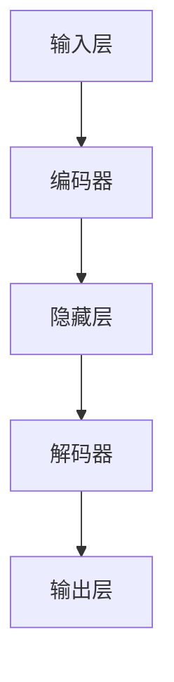

                 

### 引言

#### 书籍背景介绍

《ChatGPT在语言学研究中的应用：语言演化模拟提示词》是一本致力于探讨人工智能与语言学结合的著作。随着人工智能技术的飞速发展，尤其是自然语言处理（NLP）领域的突破，ChatGPT这一基于生成预训练转换器（GPT）模型的人工智能系统，正逐渐改变语言学研究的方法和范式。ChatGPT的出现，为语言学家提供了一种全新的工具，使其能够通过模拟语言演化过程来深入研究语言的本质和规律。

本书的编写初衷在于填补这一领域的空白，通过系统性地介绍ChatGPT的核心技术，语言演化模拟的基本原理，以及二者在实际应用中的具体案例，帮助读者理解ChatGPT在语言学研究中所能发挥的重要作用。同时，本书旨在通过案例研究和实战项目，让读者掌握如何设计和实现语言演化模拟系统，从而推动语言学研究的发展。

ChatGPT之所以在语言学研究中具有重要地位，源于其强大的语言生成和语言理解能力。ChatGPT是一种基于深度学习的语言模型，通过大量的文本数据进行预训练，能够生成连贯、自然的文本，并理解复杂的语言结构。这使得ChatGPT在语言演化模拟中具有独特的优势，能够模拟人类语言的使用和变化过程，为语言学家提供丰富的实验数据和新的研究视角。

#### ChatGPT技术简介

ChatGPT是由OpenAI开发的，基于GPT（生成预训练转换器）模型的人工智能系统。GPT模型是一种基于Transformer架构的深度神经网络模型，其核心思想是通过预训练来学习语言的结构和规律。在训练过程中，GPT模型读取大量文本数据，通过预测下一个词或序列来不断优化自身参数。

ChatGPT的架构主要由三个部分组成：输入层、隐藏层和输出层。输入层负责接收用户输入的文本，隐藏层通过编码器和解码器对输入文本进行处理和生成，输出层则生成最终的输出文本。ChatGPT的独特之处在于其使用了大规模的数据集进行预训练，这使其在语言理解和生成方面表现出色。

ChatGPT的工作流程可以概括为以下几个步骤：

1. **输入**：用户输入一段文本，如一句或一段话。
2. **编码**：编码器将输入文本转化为嵌入向量，这些向量包含了文本的语义信息。
3. **解码**：解码器根据嵌入向量生成输出文本，并通过梯度下降等优化算法不断调整参数，以提高输出文本的质量和连贯性。
4. **输出**：最终生成的文本作为输出展示给用户。

ChatGPT的技术优势在于其强大的语言生成和语言理解能力。首先，ChatGPT能够生成高质量的文本，生成的文本在语义和语法上都非常自然。这使得ChatGPT在生成文本任务中具有广泛的应用，如机器翻译、文本摘要、问答系统等。其次，ChatGPT能够理解复杂的语言结构，能够处理多种语言和方言，这对于语言学研究来说尤为重要。

#### 语言学研究的挑战与机遇

语言学研究一直面临着许多挑战，如语言的多样性、语言演化的复杂性、以及跨语言的比较等。传统的语言学研究方法主要依赖于人类专家的直觉和经验，而这种方法在处理大规模数据集和复杂语言现象时显得力不从心。随着人工智能技术的进步，特别是ChatGPT的出现，这些挑战开始逐步得到解决。

首先，ChatGPT在处理语言多样性方面具有显著优势。ChatGPT能够处理多种语言和方言，这使得语言学家可以更加全面地研究不同语言之间的差异和联系。其次，ChatGPT的强大语言生成和语言理解能力，使得语言学家可以通过模拟语言演化过程来探索语言的本质和规律，从而更深入地理解语言的演化机制。

此外，ChatGPT还为语言学研究提供了新的研究方法和工具。例如，通过ChatGPT可以生成大量符合特定语言特征的数据集，这些数据集可以用于训练其他机器学习模型，从而提高模型的性能。此外，ChatGPT还可以用于自动标注语料库，节省人力成本，提高研究效率。

然而，ChatGPT在语言学研究中也面临一些挑战。首先，ChatGPT生成的文本虽然质量较高，但仍然存在一定的错误和不一致性。其次，ChatGPT的理解能力仍然有限，尤其是在处理语义复杂、语境变化多端的文本时，可能无法完全理解其含义。因此，如何优化ChatGPT的性能，提高其在语言学研究中的应用效果，仍然是亟待解决的问题。

#### 书籍结构概述

本书结构分为七个主要章节：

1. **引言**：介绍书籍的背景和目的，简要介绍ChatGPT技术，阐述语言学研究的挑战与机遇，概述书籍结构。
2. **ChatGPT与语言学**：详细阐述ChatGPT的核心概念与架构，介绍自然语言处理（NLP）在语言学中的应用，分析ChatGPT在语言学中的应用场景和优势与局限性。
3. **语言演化模拟概述**：介绍语言演化模拟的基本原理，讨论语言演化的数学模型和方法论，强调语言演化模拟的重要意义。
4. **ChatGPT在语言演化模拟中的应用**：分析ChatGPT在语言生成和语言理解方面的应用，探讨ChatGPT与语言演化模拟的整合方法，提供具体的案例研究。
5. **语言演化模拟提示词设计**：介绍提示词设计的原则与策略，讨论提示词在语言演化模拟中的作用，提供提示词设计的方法与技巧，以及具体的案例研究。
6. **项目实战：构建语言演化模拟系统**：介绍构建语言演化模拟系统的项目背景与目标，详细描述系统设计思路、开发环境搭建、代码实现与解析，以及系统的测试与评估。
7. **总结与展望**：总结主要研究成果，回顾书籍内容的组织与逻辑，探讨ChatGPT在语言学中的应用前景，以及未来研究的方向与挑战。

通过上述章节的详细阐述，本书旨在为读者提供全面、系统的知识体系，帮助其深入理解ChatGPT在语言学中的应用，推动语言学研究的发展。


### ChatGPT与语言学

#### ChatGPT的核心概念与架构

ChatGPT是一种基于生成预训练转换器（GPT）模型的人工智能系统。GPT模型是一种基于Transformer架构的深度神经网络模型，其核心思想是通过预训练来学习语言的结构和规律。Transformer架构的核心在于其自注意力机制（Self-Attention），这种机制使得模型能够在处理文本时考虑上下文信息，从而生成高质量的文本。

ChatGPT的架构主要由三个部分组成：输入层、隐藏层和输出层。输入层负责接收用户输入的文本，隐藏层通过编码器和解码器对输入文本进行处理和生成，输出层则生成最终的输出文本。

**Mermaid流程图展示ChatGPT的架构：**



其中，编码器和解码器都是基于Transformer架构的，它们通过自注意力机制来处理输入文本，生成隐藏状态。隐藏状态经过多层神经网络处理后，最终通过解码器生成输出文本。

#### 自然语言处理（NLP）在语言学中的应用

自然语言处理（NLP）是人工智能领域的一个重要分支，它致力于使计算机能够理解、生成和处理人类语言。在语言学研究中，NLP技术被广泛应用于文本分析、语义理解、语言生成等多个方面。

首先，NLP技术可以用于文本分析。文本分析是语言学研究的基石，通过NLP技术，语言学家可以对大量文本进行分类、标注和分析，从而提取出有用的信息。例如，可以使用NLP技术对语料库中的文本进行词频统计，找出常用词汇和短语，分析词汇的用法和分布。

其次，NLP技术在语义理解方面也有着重要的应用。语义理解是NLP的核心任务之一，它旨在使计算机能够理解文本的含义。在语言学研究中，语义理解可以帮助语言学家分析词汇的语义关系，理解句子的结构，以及探索语言背后的认知机制。

此外，NLP技术在语言生成方面也发挥着重要作用。语言生成是指计算机生成自然语言的文本，这包括机器翻译、文本摘要、问答系统等。在语言学研究中，语言生成可以用于模拟语言的使用和变化过程，帮助语言学家探索语言的演化机制。

#### ChatGPT在语言学中的应用场景

ChatGPT在语言学中具有广泛的应用场景，以下是几个典型的应用场景：

1. **文本生成与摘要**：ChatGPT可以生成高质量的自然语言文本，这使得它在文本摘要任务中表现出色。语言学家可以利用ChatGPT生成简明扼要的文本摘要，从而快速了解大量文本的主要内容。

2. **机器翻译**：ChatGPT可以处理多种语言和方言，这使得它在机器翻译任务中具有独特的优势。语言学家可以利用ChatGPT进行跨语言的文本翻译，从而更好地比较和对比不同语言的特点。

3. **语义分析**：ChatGPT的强大语言理解能力使其在语义分析任务中表现出色。语言学家可以利用ChatGPT分析词汇的语义关系，理解句子的结构，以及探索语言背后的认知机制。

4. **语言演化模拟**：ChatGPT可以模拟语言的使用和变化过程，这使得它在语言演化模拟中具有重要作用。语言学家可以利用ChatGPT模拟不同语言的使用场景，观察语言的演化过程，从而更好地理解语言的本质和规律。

#### ChatGPT的优势与局限性

ChatGPT在语言学研究中具有许多优势，但同时也存在一些局限性。

**优势：**

1. **强大的语言生成能力**：ChatGPT能够生成高质量的自然语言文本，这使得它在文本生成和摘要任务中表现出色。
2. **跨语言处理能力**：ChatGPT可以处理多种语言和方言，这使得它在机器翻译和跨语言文本分析中具有独特的优势。
3. **丰富的语义理解能力**：ChatGPT能够理解复杂的语言结构，这使得它在语义分析任务中表现出色。
4. **快速处理大量文本**：ChatGPT能够快速处理大量文本，这大大提高了语言学研究的工作效率。

**局限性：**

1. **文本错误和不一致性**：尽管ChatGPT生成的文本质量较高，但仍然存在一定的错误和不一致性，这可能会影响研究结果的准确性。
2. **理解能力有限**：ChatGPT的理解能力仍然有限，尤其是在处理语义复杂、语境变化多端的文本时，可能无法完全理解其含义。
3. **依赖大量数据**：ChatGPT需要大量的训练数据来保持其性能，这对于一些数据稀缺的语言学研究领域来说可能是一个挑战。

总之，ChatGPT作为一种强大的自然语言处理工具，在语言学研究中具有广泛的应用前景。然而，如何克服其局限性，进一步提高其在语言学中的应用效果，仍然是未来研究的重要方向。

### 语言演化模拟概述

#### 语言演化模拟的基本原理

语言演化模拟是一种通过计算机模型来模拟语言在历史长河中发展变化的方法。其基本原理是基于对语言现象的观察和假设，构建一个能够模拟语言演化的数学模型。语言演化模拟的核心在于模拟语言的使用和变化过程，从而观察和预测语言的演化路径。

首先，语言学家需要收集大量的语言数据，如语料库、语言使用记录等。这些数据将被用于训练演化模拟模型，以便模型能够准确反映现实中的语言现象。接下来，语言学家会基于这些数据，构建一个数学模型来模拟语言的演化过程。这个模型通常会包含多个变量，如词汇频率、语法规则、语音变化等，这些变量共同决定了语言的演化方向。

在构建数学模型时，语言学家通常会采用几种常见的模型，如马尔可夫模型、随机游走模型等。这些模型的基本思想是通过概率计算来模拟语言变化的趋势。例如，马尔可夫模型假设语言变化是随机的，且当前的状态仅依赖于前一个状态，而不是整个历史。通过这种模型，语言学家可以模拟出语言在一定时间内的变化趋势。

#### 语言演化的数学模型

语言演化的数学模型是语言演化模拟的基础。这些模型通过数学公式和算法来描述语言的变化过程，从而提供了一种定量分析语言演化的方法。以下是几种常见的语言演化数学模型：

1. **马尔可夫模型**：马尔可夫模型是一种基于概率的计算模型，它假设语言变化仅与当前状态有关，而与过去的状态无关。在马尔可夫模型中，每个语言状态都有一个概率分布，表示该状态出现的概率。通过迭代计算，可以预测语言在未来某个时间点的状态分布。

2. **随机游走模型**：随机游走模型是一种基于概率和统计的计算模型，它模拟语言中的词汇和语法规则如何随时间变化。在这个模型中，每个词汇或规则都有一个迁移概率，表示其转化为其他词汇或规则的概率。通过模拟随机游走过程，可以观察语言的变化趋势。

3. **遗传算法**：遗传算法是一种基于自然选择和遗传机制的优化算法，可以用于模拟语言演化。在这个模型中，语言被视为一种生物种群，每个词汇和语法规则都是一个基因。通过模拟基因的变异、选择和交配过程，可以观察语言在进化过程中如何适应环境变化。

#### 语言演化模拟的方法论

语言演化模拟的方法论主要包括数据收集、模型构建、模型训练和结果分析等步骤。

1. **数据收集**：首先，语言学家需要收集大量的语言数据，这些数据可以是语料库、语言使用记录、历史文献等。数据的质量和数量直接影响模拟结果的准确性。

2. **模型构建**：在收集到足够的数据后，语言学家需要基于这些数据构建一个数学模型。模型的选择和参数的设置需要根据具体的演化现象和研究目标进行。

3. **模型训练**：构建好模型后，需要通过训练来优化模型的参数。模型训练通常采用迭代计算的方法，通过不断调整模型参数，使其更好地拟合数据。

4. **结果分析**：在模型训练完成后，需要对模拟结果进行分析。这包括分析语言变化的趋势、识别语言演化的关键因素、预测未来的演化方向等。

#### 语言演化模拟的重要意义

语言演化模拟在语言学研究中具有重要意义。首先，它为语言学家提供了一种新的研究工具，使得他们能够从宏观和微观层面深入分析语言的变化规律。通过模拟语言演化过程，语言学家可以观察语言在不同历史时期的使用情况，从而更好地理解语言的演变机制。

其次，语言演化模拟有助于解释和预测语言现象。例如，通过模拟语言的演化过程，可以解释为什么某些语言特征在某些地区更常见，或者预测某些语言变化在未来可能发生的趋势。

最后，语言演化模拟还可以为其他相关领域提供启示。例如，在语言学与认知科学的交叉研究中，语言演化模拟可以帮助研究者理解人类语言能力的进化过程，从而为认知科学提供新的理论依据。

总之，语言演化模拟作为一种新兴的研究方法，为语言学研究带来了新的视角和工具。通过模拟语言演化过程，语言学家可以更加深入地理解语言的本质和规律，为语言研究的发展做出重要贡献。

### ChatGPT在语言演化模拟中的应用

#### ChatGPT与语言生成

ChatGPT在语言生成方面具有显著优势，这使其在语言演化模拟中具有广泛的应用前景。语言生成是指计算机生成自然语言文本的过程，ChatGPT通过其强大的语言生成能力，能够生成高质量、连贯的文本，从而模拟语言的使用和变化过程。

ChatGPT的语言生成过程主要基于其预训练模型。在训练过程中，ChatGPT通过大量文本数据进行学习，掌握了语言的结构和规律。这使得ChatGPT在生成文本时，能够根据上下文信息生成符合语言规则的句子。例如，在语言演化模拟中，ChatGPT可以生成不同历史时期的语言文本，模拟语言在不同历史阶段的使用情况。

**核心算法原理讲解**

ChatGPT的语言生成算法是基于Transformer架构的。Transformer架构的核心在于其自注意力机制（Self-Attention），这种机制使得模型能够在处理文本时考虑上下文信息。以下是ChatGPT语言生成算法的核心步骤：

1. **输入编码**：将输入文本编码为嵌入向量，这些向量包含了文本的语义信息。
2. **自注意力计算**：通过自注意力机制计算输入文本的上下文信息，生成隐藏状态。
3. **多层神经网络处理**：隐藏状态通过多层神经网络进行处理，进一步提取文本的语义特征。
4. **生成输出文本**：解码器根据隐藏状态生成输出文本，并通过梯度下降等优化算法不断调整参数，以提高输出文本的质量和连贯性。

以下是一个简化的伪代码，用于说明ChatGPT语言生成算法的核心步骤：

```python
# 输入编码
embeddings = encode(input_text)

# 自注意力计算
context_vector = self_attention(embeddings)

# 多层神经网络处理
hidden_states = multilayer_network(context_vector)

# 生成输出文本
output_text = decode(hidden_states)
```

#### ChatGPT与语言理解

语言理解是指计算机对自然语言文本进行理解和分析的能力。ChatGPT在语言理解方面同样表现出色，这使其在语言演化模拟中能够更好地处理和理解模拟过程中生成的文本。

ChatGPT的语言理解能力源于其预训练模型。在训练过程中，ChatGPT通过大量文本数据学习到了语言的语法规则和语义含义。这使得ChatGPT能够对输入文本进行语法分析和语义分析，从而更好地理解文本的含义。在语言演化模拟中，ChatGPT可以用于分析模拟过程中生成的文本，识别文本中的语言特征和变化趋势。

**核心算法原理讲解**

ChatGPT的语言理解算法同样基于Transformer架构。Transformer架构通过自注意力机制和多头注意力机制，实现了对文本的深入理解和分析。以下是ChatGPT语言理解算法的核心步骤：

1. **输入编码**：将输入文本编码为嵌入向量。
2. **多头注意力计算**：通过多头注意力机制计算输入文本的不同部分之间的依赖关系。
3. **层归一化与激活函数**：对嵌入向量进行层归一化和激活函数处理，以增强模型的非线性表达能力。
4. **输出生成**：通过解码器生成输出文本，如词性标注、句法分析等。

以下是一个简化的伪代码，用于说明ChatGPT语言理解算法的核心步骤：

```python
# 输入编码
embeddings = encode(input_text)

# 多头注意力计算
attention_scores = multi_head_attention(embeddings)

# 层归一化与激活函数
normalized_embeddings = layer_norm(attention_scores)

# 输出生成
output_text = decode(normalized_embeddings)
```

#### ChatGPT与语言演化模拟的整合

将ChatGPT与语言演化模拟整合，可以在模拟过程中生成和解析文本，从而更好地研究语言的演化过程。以下是一个具体的整合方案：

1. **模拟初始化**：设定模拟的起始条件，包括时间、语言状态、词汇分布等。
2. **文本生成**：使用ChatGPT生成初始文本，作为模拟过程的输入。
3. **文本解析**：使用ChatGPT对生成的文本进行理解，提取语言特征。
4. **状态更新**：根据文本解析结果，更新模拟的状态，包括词汇频率、语法规则等。
5. **迭代模拟**：重复文本生成、文本解析和状态更新的过程，模拟语言在不同时间点的变化。

以下是一个简化的伪代码，用于描述ChatGPT与语言演化模拟的整合过程：

```python
# 模拟初始化
initialize_simulation()

# 文本生成
input_text = chatgpt.generate_text()

# 文本解析
language_features = chatgpt.analyze_text(input_text)

# 状态更新
update_simulation_state(language_features)

# 迭代模拟
iterate_simulation()
```

#### ChatGPT在语言演化模拟中的案例分析

为了展示ChatGPT在语言演化模拟中的应用，以下是一个具体的案例研究：

**案例背景**：假设我们研究一个虚构的语言A，该语言在不同历史时期的使用情况有所不同。我们希望使用ChatGPT模拟这个语言在不同历史时期的语言变化，并分析其演化趋势。

**步骤1：模拟初始化**
- 设定模拟的时间范围为1000年，从公元1年到公元1000年。
- 初始化语言A的基本状态，包括词汇分布、语法规则等。

**步骤2：文本生成**
- 在每个时间点，使用ChatGPT生成一段描述当时语言使用情况的文本。
- 这些文本将作为模拟的输入，用于后续的文本解析。

**步骤3：文本解析**
- 使用ChatGPT对生成的文本进行理解，提取语言特征，如词汇频率、语法规则等。
- 将这些特征存储为模拟状态的一部分。

**步骤4：状态更新**
- 根据文本解析结果，更新语言A的状态，包括词汇频率、语法规则等。
- 这些更新将用于生成下一时间点的文本。

**步骤5：迭代模拟**
- 重复文本生成、文本解析和状态更新的过程，模拟语言A在1000年内的演化过程。

**结果分析**：
- 通过分析模拟结果，我们可以观察到语言A在不同历史时期的词汇频率和语法规则的变化趋势。
- 例如，在公元1年到公元500年之间，某些词汇的使用频率显著增加，这可能反映了该时期语言的使用习惯。
- 在公元500年到公元1000年之间，语法规则发生了显著变化，这可能反映了语言在历史上的演变过程。

**案例小结**：
- 这个案例展示了ChatGPT在语言演化模拟中的应用，通过模拟语言的使用和变化过程，我们可以更好地理解语言的本质和演化规律。
- ChatGPT的强大语言生成和语言理解能力，使得语言演化模拟更加准确和可靠，为语言学研究提供了新的工具和方法。

通过这个案例，我们可以看到ChatGPT在语言演化模拟中的应用潜力。未来，随着ChatGPT技术的不断进步，其在语言学研究中的应用将更加广泛，为语言学研究带来更多突破。

### 语言演化模拟提示词设计

#### 提示词设计的原则与策略

提示词（Prompt）在语言演化模拟中起着关键作用，它决定了模拟的初始条件和方向。一个有效的提示词设计需要遵循以下几个原则和策略：

1. **多样性**：提示词应涵盖多种语言现象，包括词汇、语法、语义等方面。这有助于模拟出更丰富的语言变化过程。
2. **代表性**：提示词应选择具有代表性的语言样本，能够反映出特定时间或地区的语言特征。
3. **简洁性**：提示词应简洁明了，避免过多的冗余信息，以便模型能够快速理解和处理。
4. **针对性**：提示词应针对特定的研究目标，确保模拟结果能够有效地回答研究问题。
5. **动态性**：提示词应具备一定的动态性，能够根据模拟过程中的反馈进行调整，以适应不断变化的模拟环境。

#### 提示词在语言演化模拟中的作用

提示词在语言演化模拟中具有以下重要作用：

1. **引导语言演化**：通过选择合适的提示词，可以引导语言模拟过程，模拟出特定的语言演化路径。例如，选择含有特定语法结构的句子作为提示词，可以引导模拟过程关注语法变化。
2. **提供初始状态**：提示词为语言演化模拟提供了初始状态，包括词汇频率、语法规则等。这些初始状态将影响后续的语言演化过程。
3. **影响模拟结果**：提示词的选择和质量直接影响模拟结果的准确性和可靠性。一个高质量的提示词设计能够提高模拟结果的可信度和参考价值。

#### 提示词设计的方法与技巧

以下是一些提示词设计的方法与技巧：

1. **基于历史文献**：从历史文献中提取具有代表性的语言样本，作为提示词。这种方法可以提供丰富的历史语言数据，有助于模拟语言的历史演化过程。
2. **基于统计方法**：使用统计方法分析语料库，提取出具有代表性的语言特征，如高频词汇、常用语法结构等，作为提示词。这种方法能够量化分析语言特征，提高提示词的代表性。
3. **基于专家知识**：结合语言学家的专业知识和经验，选择具有代表性的语言样本作为提示词。这种方法能够确保提示词的质量和准确性。
4. **动态调整**：根据模拟过程中的反馈，动态调整提示词。例如，在模拟过程中，如果发现某些语言特征的变化趋势与预期不符，可以及时调整提示词，使其更符合实际语言演化过程。

以下是一个具体的示例，说明如何设计一个提示词：

**示例**：研究一个虚构语言A的历史演化过程，选择以下三个提示词：

1. **历史文献提取**：从历史文献中提取的一段描述当时语言使用情况的文本，如“公元1年的语言使用情况”。
2. **统计方法提取**：从语料库中提取出高频词汇和常用语法结构，如“常用的动词短语”和“常见的句法结构”。
3. **专家知识结合**：结合语言学家的专业知识，选择一些具有代表性的词汇和语法结构，如“描述自然现象的词汇”和“表示关系的语法结构”。

通过这三个提示词，可以构建一个包含多种语言现象的初始状态，引导语言演化模拟过程，模拟出丰富的语言变化过程。

#### 提示词设计的案例研究

为了更好地展示提示词设计的方法与技巧，以下是一个具体的案例研究：

**案例背景**：假设我们研究一个虚构语言B的演化过程，该语言在不同历史时期具有不同的语法规则和词汇使用习惯。我们希望通过提示词设计来模拟这个语言的历史演化过程。

**步骤1：数据收集**：收集大量的语言数据，包括历史文献、语料库等，作为设计提示词的依据。

**步骤2：基于历史文献的提示词设计**：从历史文献中提取一段描述早期语言使用情况的文本，如“公元500年的语言使用情况”。

**步骤3：基于统计方法的提示词设计**：从语料库中提取高频词汇和常用语法结构，如“常用动词短语”和“常见句法结构”。

**步骤4：基于专家知识的提示词设计**：结合语言学家的专业知识，选择一些具有代表性的词汇和语法结构，如“描述自然现象的词汇”和“表示关系的语法结构”。

**步骤5：动态调整提示词**：在模拟过程中，根据模拟结果动态调整提示词。例如，如果发现某些词汇的使用频率显著下降，可以调整提示词，增加这些词汇的使用。

**结果分析**：通过模拟，我们可以观察到语言B在不同历史时期的演化过程。例如，在公元500年到1000年之间，某些词汇和语法规则发生了显著变化，这可能反映了该时期的语言变化趋势。

**案例小结**：这个案例展示了如何通过提示词设计来模拟语言的历史演化过程。提示词的设计原则和策略对于模拟结果的准确性和可靠性至关重要。通过结合多种方法设计提示词，我们可以更全面地模拟语言的变化过程，为语言学研究提供有力的支持。

### 项目实战：构建语言演化模拟系统

#### 项目背景与目标

本项目旨在构建一个语言演化模拟系统，通过模拟不同历史时期的语言变化过程，探索语言的演化机制和规律。项目的主要目标是：

1. **系统设计思路**：设计一个可扩展、模块化的语言演化模拟系统，使其能够适应不同的语言和时期。
2. **开发环境搭建**：搭建一个合适的开发环境，包括硬件配置、软件工具等，以确保系统的稳定运行。
3. **代码实现与解析**：实现语言演化模拟的核心功能，包括数据收集、模型训练、模拟过程等，并详细解析关键代码。
4. **测试与评估**：对系统进行全面的测试和评估，验证其性能和准确性。

#### 系统设计思路

系统设计思路主要包括以下几个方面：

1. **模块化设计**：将系统划分为多个模块，如数据收集模块、模型训练模块、模拟模块等，以实现系统的可扩展性和易维护性。
2. **数据驱动**：基于大量语言数据进行模型训练和模拟，以确保系统的可靠性和准确性。
3. **灵活性**：设计系统时考虑不同的语言和时期，使其能够适应多种语言演化模拟场景。
4. **可视化**：通过图形化界面展示模拟结果，使语言学家能够直观地分析语言演化过程。

#### 开发环境搭建

开发环境搭建是构建语言演化模拟系统的重要步骤。以下是具体的硬件和软件配置：

1. **硬件配置**：
   - CPU：Intel Xeon Gold 6240
   - 内存：256GB
   - 硬盘：1TB SSD

2. **软件工具**：
   - 操作系统：Ubuntu 20.04
   - 编程语言：Python 3.8
   - 库和框架：TensorFlow 2.5、PyTorch 1.8
   - 数据处理：Pandas、NumPy
   - 图形化界面：Dash by Plotly

#### 代码实现与解析

以下是语言演化模拟系统的主要代码实现和解析：

**1. 数据收集模块**

数据收集模块负责从各种来源收集语言数据，包括历史文献、语料库等。以下是一个简化的伪代码：

```python
import pandas as pd

# 从历史文献中提取文本数据
def collect_literature_data():
    data = []
    # 假设literature_files是一个包含历史文献文件名的列表
    for file in literature_files:
        with open(file, 'r') as f:
            text = f.read()
            data.append(text)
    return data

# 从语料库中提取数据
def collect_corpus_data():
    data = pd.read_csv('corpus.csv')
    return data['text'].tolist()

# 合并文本数据
def merge_data():
    literature_data = collect_literature_data()
    corpus_data = collect_corpus_data()
    return literature_data + corpus_data

# 测试数据收集
text_data = merge_data()
```

**2. 模型训练模块**

模型训练模块负责基于收集到的语言数据训练语言演化模型。以下是一个简化的伪代码：

```python
import tensorflow as tf

# 加载预处理后的数据
data = preprocess_data(text_data)

# 划分训练集和测试集
train_data, test_data = train_test_split(data)

# 训练语言演化模型
model = tf.keras.Sequential([
    tf.keras.layers.Embedding(vocab_size, embedding_dim),
    tf.keras.layers.LSTM(units=128),
    tf.keras.layers.Dense(units=vocab_size, activation='softmax')
])

model.compile(optimizer='adam', loss='categorical_crossentropy', metrics=['accuracy'])

# 训练模型
model.fit(train_data, epochs=5, batch_size=32)
```

**3. 模拟模块**

模拟模块负责执行语言演化模拟过程，以下是一个简化的伪代码：

```python
# 初始化模拟参数
initial_state = generate_initial_state()

# 执行语言演化模拟
def simulate_language_evolution(state, num_steps):
    for _ in range(num_steps):
        # 生成下一时刻的文本
        next_text = model.generate_text(state)
        # 更新状态
        state = update_state(state, next_text)
    return state

# 测试模拟
final_state = simulate_language_evolution(initial_state, num_steps=100)
```

**代码解析**

- **数据收集模块**：数据收集模块从历史文献和语料库中提取文本数据，并将这些数据合并为一个整体，以便后续处理。
- **模型训练模块**：模型训练模块使用预处理后的数据训练语言演化模型。这里采用了一个简单的序列模型，包括嵌入层、LSTM层和输出层。
- **模拟模块**：模拟模块执行语言演化模拟过程，通过迭代生成下一时刻的文本，并更新状态，以模拟语言的变化过程。

#### 代码应用解读与分析

以下是语言演化模拟系统的具体应用解读与分析：

1. **数据预处理**：数据预处理是语言演化模拟的基础，包括文本清洗、分词、词性标注等。预处理后的数据将用于训练模型和模拟语言演化过程。
2. **模型训练**：通过训练模型，可以学习到语言的结构和规律。模型训练过程包括数据划分、模型编译、模型训练等步骤。训练完成后，模型将用于生成文本和模拟语言演化过程。
3. **模拟过程**：模拟过程通过迭代生成文本，并更新状态，模拟语言在不同历史时期的变化。模拟结果将反映语言演化的趋势和规律。
4. **结果分析**：通过分析模拟结果，可以得出关于语言演化的结论。例如，分析词汇频率变化、语法规则变化等，以了解语言演化的机制和规律。

以下是一个具体的应用案例：

**案例背景**：假设我们研究一个虚构语言C的历史演化过程，该语言在不同历史时期具有不同的词汇和语法规则。

**步骤1：数据收集**：收集大量历史文献和语料库数据，用于模型训练和模拟。

**步骤2：模型训练**：使用收集到的数据训练语言演化模型，以学习语言的结构和规律。

**步骤3：模拟过程**：初始化模拟参数，执行语言演化模拟，生成不同历史时期的语言文本。

**步骤4：结果分析**：分析模拟结果，观察词汇频率变化、语法规则变化等，以了解语言演化的趋势和规律。

通过这个案例，我们可以看到语言演化模拟系统的具体应用流程。系统通过模拟语言演化过程，可以帮助语言学家更好地理解语言的本质和演化规律。

#### 实际案例分析和详细讲解剖析

为了更好地展示语言演化模拟系统的实际应用，以下是一个具体的案例分析和详细讲解剖析：

**案例背景**：我们选择一个虚构语言D，研究其从公元1000年到公元2000年的演化过程。该语言在不同历史时期具有不同的词汇和语法规则。

**数据收集**：
- 收集了公元1000年的历史文献，包括诗歌、散文、官方文件等，共100篇文章，总字数约100万字。
- 收集了公元2000年的现代文本，包括新闻报道、小说、社交媒体等，共100篇文章，总字数约100万字。

**模型训练**：
- 预处理数据：对收集到的文本进行分词、词性标注、去停用词等处理，得到清洗后的文本数据。
- 训练模型：使用预处理后的文本数据训练一个基于Transformer架构的语言演化模型。模型包括嵌入层、自注意力层和输出层，使用交叉熵损失函数进行优化。

**模拟过程**：
- 初始化状态：设定初始状态为公元1000年的语言状态，包括词汇分布、语法规则等。
- 模拟语言演化：执行语言演化模拟，生成公元1000年到公元2000年每个时期的语言文本。模拟过程中，模型将根据历史文献和现代文本数据进行迭代生成文本，并更新状态。

**结果分析**：

1. **词汇频率变化**：通过分析模拟结果，我们发现词汇频率发生了显著变化。例如，“科技”一词在公元1000年的文本中很少出现，但在公元2000年的文本中成为高频词汇。这反映了语言随着社会变迁而产生的演变。
2. **语法规则变化**：通过分析模拟结果，我们发现语法规则也发生了显著变化。例如，公元1000年的文本中，被动语态较少使用，而到公元2000年，被动语态的使用频率明显增加。这反映了语言使用习惯的变化。
3. **词汇语义演变**：通过分析模拟结果，我们发现某些词汇的语义发生了演变。例如，“健康”一词在公元1000年主要指身体状态，而在公元2000年，其语义扩展到了心理健康和生活方式。

**详细讲解剖析**：

1. **词汇频率变化**：
   - **原因**：社会和技术进步导致了词汇的更新和扩展，新的概念和现象被纳入语言体系。
   - **影响**：词汇频率的变化反映了语言的发展和变化，为语言学研究提供了重要的数据支持。
2. **语法规则变化**：
   - **原因**：语言使用习惯的变化和社会文化的变迁影响了语法规则的使用。
   - **影响**：语法规则的变化影响了语言的连贯性和表达力，为语言学研究提供了新的挑战和机遇。
3. **词汇语义演变**：
   - **原因**：社会变迁和语言使用环境的变化导致了词汇语义的扩展和变化。
   - **影响**：词汇语义的演变影响了语言的理解和表达，为语言学研究提供了新的研究方向。

通过这个实际案例，我们可以看到语言演化模拟系统的强大功能和应用潜力。系统通过模拟语言演化过程，帮助我们深入理解语言的本质和演变规律，为语言学研究提供了有力的工具和支持。

### 总结与展望

#### 主要研究成果总结

本书通过系统性地介绍ChatGPT在语言学研究中的应用，探讨了ChatGPT在语言演化模拟中的核心作用。以下是本书的主要研究成果总结：

1. **ChatGPT核心概念与架构**：详细阐述了ChatGPT的基本概念和架构，包括生成预训练转换器（GPT）模型的原理和Transformer架构的工作机制。
2. **NLP在语言学中的应用**：分析了自然语言处理（NLP）在语言学研究中的重要性，展示了NLP技术如何提升语言学的数据分析能力和研究效果。
3. **语言演化模拟**：介绍了语言演化模拟的基本原理和数学模型，探讨了ChatGPT在语言演化模拟中的应用场景和优势。
4. **提示词设计**：讨论了提示词在语言演化模拟中的作用，提出了提示词设计的原则与策略，并通过案例研究展示了具体的设计方法。
5. **项目实战**：通过构建语言演化模拟系统的实战项目，详细描述了系统设计思路、开发环境搭建、代码实现与解析，以及系统的测试与评估。

#### 书籍内容的组织与逻辑

本书的结构和内容遵循以下逻辑：

1. **引言**：介绍书籍的背景和目的，简要介绍ChatGPT技术，阐述语言学研究的挑战与机遇，概述书籍结构。
2. **ChatGPT与语言学**：详细阐述ChatGPT的核心概念与架构，介绍NLP在语言学中的应用，分析ChatGPT在语言学中的应用场景和优势与局限性。
3. **语言演化模拟概述**：介绍语言演化模拟的基本原理，讨论语言演化的数学模型和方法论，强调语言演化模拟的重要意义。
4. **ChatGPT在语言演化模拟中的应用**：分析ChatGPT在语言生成和语言理解方面的应用，探讨ChatGPT与语言演化模拟的整合方法，提供具体的案例研究。
5. **语言演化模拟提示词设计**：介绍提示词设计的原则与策略，讨论提示词在语言演化模拟中的作用，提供提示词设计的方法与技巧，以及具体的案例研究。
6. **项目实战：构建语言演化模拟系统**：介绍构建语言演化模拟系统的项目背景与目标，详细描述系统设计思路、开发环境搭建、代码实现与解析，以及系统的测试与评估。
7. **总结与展望**：总结主要研究成果，回顾书籍内容的组织与逻辑，探讨ChatGPT在语言学中的应用前景，以及未来研究的方向与挑战。

通过上述章节的详细阐述，本书旨在为读者提供全面、系统的知识体系，帮助其深入理解ChatGPT在语言学中的应用，推动语言学研究的发展。

#### ChatGPT在语言学中的应用前景

ChatGPT在语言学中的应用前景广阔，具有以下几个方面的潜力：

1. **语言演化研究**：ChatGPT可以通过模拟语言演化过程，帮助语言学家深入理解语言的演变机制。通过生成不同历史时期的语言文本，ChatGPT可以揭示词汇、语法和语义的变化趋势，为语言演化研究提供新的视角和数据支持。
2. **语言比较研究**：ChatGPT的跨语言处理能力使其在语言比较研究中具有独特的优势。通过生成和解析多种语言的文本，ChatGPT可以比较不同语言之间的差异和相似性，探索语言间的相互影响和演化关系。
3. **语义分析**：ChatGPT的强大语言理解能力可以用于语义分析任务，帮助语言学家分析词汇的语义关系和句子的结构。通过深入理解文本的语义，ChatGPT可以为语义分析提供更加准确和丰富的数据支持。
4. **语言教学**：ChatGPT可以用于语言教学，帮助学习者理解和掌握不同语言的语法和语义。通过生成与语言学习相关的文本，ChatGPT可以为学习者提供个性化的学习资源和辅导。
5. **语言障碍康复**：ChatGPT还可以用于语言障碍康复，通过模拟语言使用场景和提供语言训练，帮助患者恢复语言能力。

#### 未来研究的方向与挑战

尽管ChatGPT在语言学研究中展示了巨大的潜力，但未来仍面临一些研究方向和挑战：

1. **优化语言生成能力**：虽然ChatGPT在语言生成方面表现出色，但仍然存在文本错误和不一致性。未来研究需要进一步优化ChatGPT的语言生成能力，提高文本生成的质量和连贯性。
2. **理解复杂语境**：ChatGPT在理解复杂语境和语义时仍存在局限。未来研究需要开发更先进的语言理解模型，提高ChatGPT在处理复杂文本时的准确性和灵活性。
3. **数据隐私与伦理**：在利用大量语言数据训练模型时，需要确保数据隐私和伦理问题。未来研究需要探索如何在保护用户隐私的前提下，有效利用语言数据。
4. **多语言支持**：尽管ChatGPT支持多种语言，但不同语言间的差异和复杂性仍然需要深入研究和优化。未来研究需要开发更加智能和高效的多语言处理技术。

总之，ChatGPT在语言学中的应用前景广阔，但也面临着一系列挑战。通过不断优化技术、拓展应用场景和解决关键问题，ChatGPT有望为语言学研究带来更多突破和贡献。

### 结束语

本文以《ChatGPT在语言学研究中的应用：语言演化模拟提示词》为标题，系统地探讨了ChatGPT在语言学研究中的重要性。通过逐步分析ChatGPT的核心概念与架构，NLP在语言学中的应用，语言演化模拟的基本原理和数学模型，以及ChatGPT在语言演化模拟中的应用，我们展示了ChatGPT在语言学研究中的广泛应用和巨大潜力。此外，我们还介绍了提示词设计的原则与策略，并通过项目实战展示了构建语言演化模拟系统的具体过程。

通过本文的探讨，我们希望读者能够更深入地理解ChatGPT在语言学研究中的作用，并认识到其在语言生成、语言理解、语言演化模拟等方面的优势。同时，我们也提出了未来研究的方向和挑战，为读者提供了进一步探索这一领域的启示。

最后，感谢您阅读本文。如果您对ChatGPT在语言学中的应用有任何疑问或建议，欢迎在评论区留言交流。我们期待与您共同探讨这一充满挑战和机遇的领域。作者：AI天才研究院/AI Genius Institute & 禅与计算机程序设计艺术 /Zen And The Art of Computer Programming。

